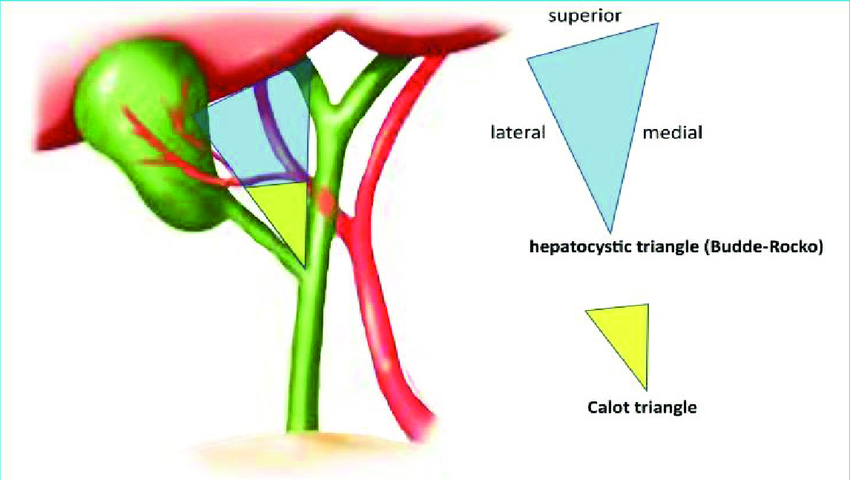
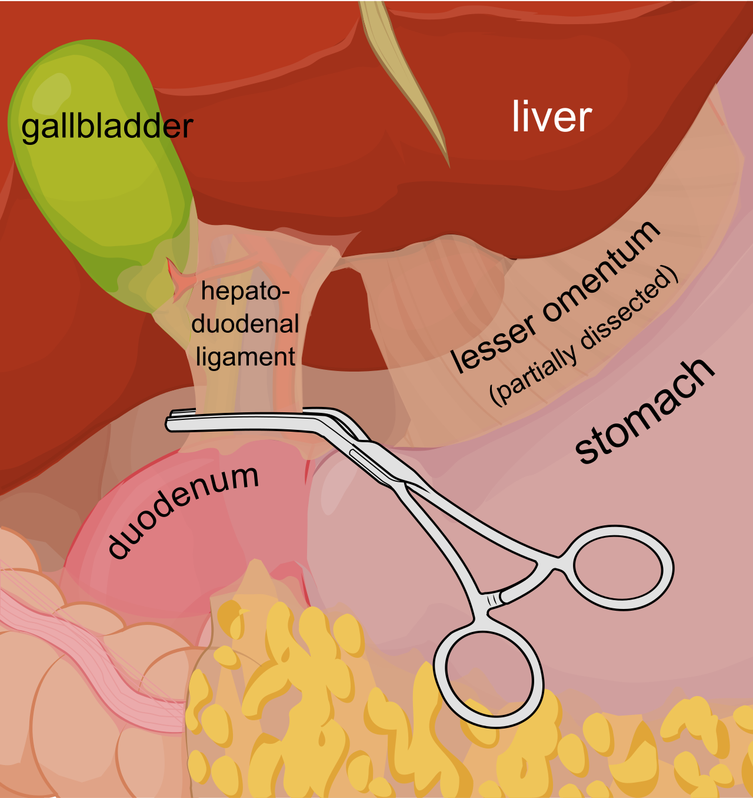
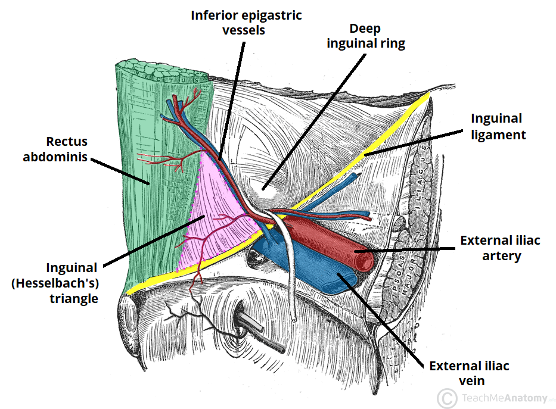
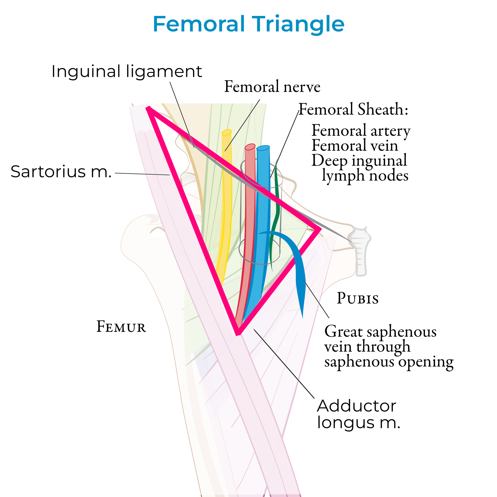
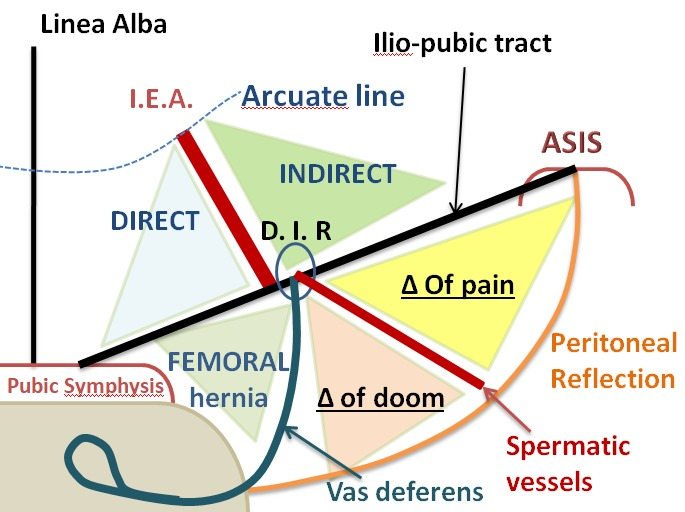
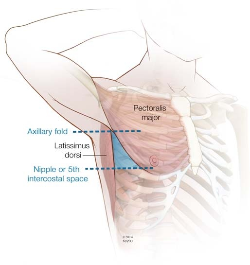

# 易混淆與相反規則整理

> 只放「跨章會混、方向會反、選項唯一例外」；完整病程留在主筆記。格式盡量用一句話＋cf. 對照。

## 標籤慣例

- 用藥/處置句要先標方向：疾病/診斷底下的治療用 `Tx＝`；藥物底下的適應症/常考用途用 `Ind＝`，抗生素抗菌範圍用 `Coverage＝`。其他常用標籤：`SE＝`副作用/毒性、`C/I＝`禁忌/避免、`Risk＝`併發症或高風險情境、`Dx＝`診斷用途、`f/u＝`追蹤用途、`PK＝`藥物排除/代謝、`MOA＝`作用機轉、`interaction＝`交互作用、`Safety＝`特殊族群可用性。看到藥名但沒標方向時，優先補標籤，避免把副作用誤記成適應症。

## 影像與檢查徵象

### Bubble / Halo sign

| 名稱 | 先想到 | 快速分法 |
| --- | --- | --- |
| Double bubble sign（雙泡徵，X ray） | Duodenal atresia/obstruction（十二指腸閉鎖/阻塞） | 胃＋十二指腸近端兩個氣泡。 |
| Triple bubble sign | Jejunal atresia（空腸閉鎖） | 胃、十二指腸、空腸氣體積聚；不要和雙泡徵混。 |
| Double halo sign（雙暈徵，CT） | Lupus enteritis / mesenteric vasculitis（狼瘡腸炎/腸繫膜血管炎） | 腸壁水腫分層；也會被寫成 target sign，不是十二指腸阻塞的 double bubble。 |

### Target sign / Bull's-eye sign

先看器官與影像，不要只背名字。

| 場景 | 先想到 | 快速分法 |
| --- | --- | --- |
| Skin target lesion | Erythema multiforme（多形性紅斑） by herpes simplex virus（HSV；單純疱疹病毒）或 Mycoplasma（黴漿菌） | 典型三層 target/iris lesion，多在四肢伸側；不是所有 bull's-eye rash 都等於 EM。 |
| 小兒腹痛/果醬便，US/CT | Intussusception（腸套疊） | Bowel-within-bowel＝target/doughnut；橫切面最像靶。 |
| 嬰兒非膽汁噴射吐，US | Hypertrophic pyloric stenosis（肥厚性幽門狹窄） | Thick pyloric muscle 橫切面像 target/donut；仍要看 muscle thickness/length。 |
| 增厚腸壁 CT | Double halo / target sign | 腸壁分層＝submucosal edema/hemorrhage；可見於 inflammatory bowel disease（IBD；發炎性腸病）、ischemia、infectious enteritis、lupus enteritis / mesenteric vasculitis（狼瘡腸炎/腸繫膜血管炎）。 |
| Systemic lupus erythematosus（SLE；全身性紅斑狼瘡）腹痛 | Double halo / target sign | 連到 lupus enteritis / mesenteric vasculitis；不要把「target」只背成皮膚。 |
| Acquired immunodeficiency syndrome（AIDS；後天免疫缺乏症） ring-enhancing brain lesion，MRI | Eccentric target sign | 散發先想 cerebral toxoplasmosis（腦弓漿蟲）；cf. 單顆/深部/periventricular＝central nervous system lymphoma（CNS lymphoma；中樞神經淋巴瘤）。 |
| Peripheral nerve/soft tissue MRI | Neurofibroma / benign peripheral nerve sheath tumor（良性周邊神經鞘瘤） | T2 central low＋peripheral high；不是皮膚多形性紅斑。 |
| Liver target/bull's-eye lesion | Metastasis 或 abscess | Abscess 可 double-target/cluster/gas；metastasis 常多發，靠感染 vs 癌症情境分。 |

### Coffee bean

| 名稱 | 場景 | 快速分法 |
| --- | --- | --- |
| Coffee bean sign（咖啡豆徵） | X ray | Sigmoid volvulus（乙狀結腸扭轉）。 |
| Coffee-bean nuclei | 病理 | Granulosa cell tumor（顆粒細胞瘤）。 |

### Marcus Gunn

| 名稱 | 先想到 | 快速分法 |
| --- | --- | --- |
| Marcus Gunn syndrome（下頷瞬目症候群） | Jaw-winking ptosis | 咀嚼/張口會帶動眼瞼。 |
| Marcus Gunn pupil | Relative afferent pupillary defect（RAPD；相對傳入瞳孔缺損） | 視網膜/視神經傳入路徑病變線索。 |

### Light-near dissociation

光近反射分離＝對光差，但看近會縮。

| 名稱 | 瞳孔/定位 | 快速分法 |
| --- | --- | --- |
| Argyll Robertson pupil | Neurosyphilis（神經性梅毒） | 小瞳孔；light-near dissociation。 |
| Adie tonic pupil | 年輕女、大瞳孔 | 副交感神經節後纖維受損；縮小後恢復慢。 |
| Parinaud syndrome | Pineal/dorsal midbrain（松果區/背側中腦） | 松果區腫瘤壓迫背側中腦；上視麻痺/上視失敗後會聚後縮眼震。 |

### Horner syndrome

- Horner syndrome（霍納症候群）：ptosis＋miosis＋anhidrosis（眼瞼下垂＋縮瞳＋無汗），純交感侵犯；可見 Pancoast tumor、neuroblastoma、brainstem stroke、internal carotid artery（ICA；內頸動脈） lesion。

### Charcot / Courvoisier

| 名稱 | 先想到 | 快速分法 |
| --- | --- | --- |
| Charcot triad（夏科三徵） | Acute cholangitis（急性膽管炎） | Fever＋right upper quadrant pain（RUQ pain；右上腹痛）＋jaundice；Reynolds pentad＝再加 shock＋altered mental status（AMS；意識狀態改變）。 |
| Courvoisier sign（庫瓦西耶徵） | Pancreatic/periampullary malignancy（胰臟/壺腹周圍惡性腫瘤） | 無痛性黃疸＋可摸到膽囊。 |
| Charcot-Leyden crystals（夏科萊登結晶） | Eosinophil（嗜酸性球）分解產物 | 見 allergic fungal rhinosinusitis（過敏性黴菌性鼻竇炎）/氣喘等。 |

### Kocher / Kerley / Kernig

| 名稱 | 類別 | 快速分法 |
| --- | --- | --- |
| Kocher | 外科方法 | 膽囊切口或胰十二指腸游離。 |
| Kerley B line | X 光影像 | 肺水腫間質線。 |
| Kernig | 神經學理學檢查 | 腦膜刺激徵。 |

### Hutchinson

| 名稱 | 先想到 | 快速分法 |
| --- | --- | --- |
| Hutchinson sign | Herpes zoster ophthalmicus（眼帶狀疱疹）風險 | 鼻尖水疱/皮疹＝varicella-zoster virus（VZV；水痘帶狀疱疹病毒）侵犯 nasociliary branch。 |
| Hutchinson nail sign | Subungual melanoma（甲下黑色素瘤） | 甲黑線延伸到甲周/近端甲皺襞。 |

### Keyboard / Piano key sign

| 位置 | 先想到 | 快速分法 |
| --- | --- | --- |
| Shoulder | Acromioclavicular joint（AC joint；肩鎖關節） separation/dislocation | 壓 distal clavicle 會下沉，放開彈回。 |
| Wrist | Distal radioulnar joint（DRUJ；遠端橈尺關節） instability / triangular fibrocartilage complex（TFCC；三角纖維軟骨複合體） injury | 壓突出的 ulnar head 會像琴鍵彈動。 |
| Urinary tract keyhole sign（鑰匙孔徵） | Posterior urethral valve（PUV；後尿道瓣膜） | 產前/新生兒影像見膀胱＋後尿道擴張，常合併雙側 hydronephrosis；不是 piano key sign。 |

### Calcification pattern

| 鈣化型態 | 先想到 |
| --- | --- |
| Popcorn（爆米花狀/coarse） | 子宮肌瘤（骨盆）、fibroadenoma（乳房纖維腺瘤）、pulmonary hamartoma（肺過誤瘤）；多偏良性/退化。 |
| Psammomatous（沙粒狀/psammoma body） | Serous ovarian carcinoma（漿液性卵巢癌）；也可見 papillary thyroid carcinoma（乳突甲狀腺癌）/meningioma（腦膜瘤），先看器官。 |
| 牙齒/骨骼/脂肪 | Mature cystic teratoma / dermoid cyst（成熟囊性畸胎瘤/皮樣囊腫）。 |
| 線狀/無定形 | 放射治療後 dystrophic calcification（營養不良性鈣化）；屬於營養不良壞死，不等於復發。 |

### 核醫 Tracer

| 檢查 | Tracer / 機轉 | 快速判斷 |
| --- | --- | --- |
| Meckel scan | Technetium-99m pertechnetate（Tc-99m pertechnetate） | 被胃黏膜分泌細胞攝取，抓異位胃黏膜；不是直接抓憩室本身。 |
| Bone scan | Technetium-99m methylene diphosphonate（Tc-99m MDP） | 骨表面沉積，反映 osteoblastic activity（骨母細胞活性）/血流；lytic lesion 如 multiple myeloma（MM；多發性骨髓瘤）可不亮。 |
| HIDA scan | Tc-99m iminodiacetic acid 類（Tc-99m IDA 類） | 肝細胞攝取後經膽汁排泄，看 gallbladder（GB；膽囊）/膽道；急性膽囊炎常見 GB 不顯影（膽汁進不去 GB）。 |
| PET | Fluorine-18 fluorodeoxyglucose（18F-FDG） | 葡萄糖代謝高就亮；腫瘤常亮但發炎/感染也可亮，非癌症專一。 |
| Thyroid scan/uptake | Iodine-123 / iodine-131（I-123/I-131） | 甲狀腺攝碘功能；I-123 偏診斷，I-131 可用於治療/全身追蹤。 |

## 解剖與定位

### 外科解剖 Landmark

| Landmark | 邊界 / 位置 | 內容物 / 考點 |
| --- | --- | --- |
| Calot / hepatocystic triangle | Modern＝cystic duct（膽囊管）＋common hepatic duct（總肝管）＋肝下緣；classic Calot 把肝下緣換成 cystic artery（膽囊動脈） | 內有 cystic artery、Lund node；膽囊切除要做 critical view of safety，避免把 common bile duct（CBD；總膽管）/common hepatic duct（CHD；總肝管）誤剪。 |
| Hepatoduodenal ligament | 肝十二指腸韌帶內 | CBD、proper hepatic artery（肝固有動脈）、portal vein（門靜脈）；Pringle maneuver 夾這裡。若仍出血，想 hepatic vein/inferior vena cava（IVC；下腔靜脈）。 |
| Foramen of Winslow（omental foramen） | 前＝portal triad、後＝IVC、上＝caudate lobe、下＝duodenum 第 1 段 | Lesser sac 入口；手指進去可壓 hepatoduodenal ligament 做 Pringle maneuver。 |
| Deep inguinal ring | Inferior epigastric vessels（下腹壁血管）外側 | Indirect inguinal hernia（間接型腹股溝疝氣）從 deep ring 進 inguinal canal；位於 inferior epigastric vessels 外側。 |
| Femoral triangle | 上＝inguinal ligament、外＝sartorius、內＝adductor longus | 內容物外到內＝NAVEL：nerve、artery、vein、empty space/femoral canal、lymphatics。 |
| Femoral ring/canal | Ring 邊界：前/上＝inguinal ligament、後/下＝pectineal ligament/pectineus fascia、內＝lacunar ligament、外＝femoral vein | Canal＝NAVEL 的 E，位於 femoral vein 內側；hernia 走 ring→canal→saphenous opening，表面在 inguinal ligament 下、pubic tubercle 外下方；女多，strangulation 風險高。 |
| Laparoscopic hernia triangle of doom | Vas deferens 與 gonadal vessels 之間 | 內有 external iliac vessels（外髂血管）；腹腔鏡疝氣修補避免 tack/釘針。 |
| Laparoscopic hernia triangle of pain | Gonadal vessels 外側、iliopubic tract 下方 | 內有 femoral nerve、lateral femoral cutaneous nerve、genitofemoral nerve 分支；避免神經痛。 |
| McBurney point | Umbilicus 到右 anterior superior iliac spine（ASIS；前上髂棘）連線外 1/3 處 | Appendix（闌尾）常見壓痛點；Lanz point 偏兩 ASIS 連線右 1/3，闌尾位置非典型時壓痛可不典型。 |
| Chest tube triangle of safety | 前＝pectoralis major 外緣、後＝latissimus dorsi 前緣、下＝第 5 肋間/乳頭線、上＝腋窩 | 胸管較安全插入區；通常走肋骨上緣，避免肋間血管神經束。 |

### 外科解剖圖譜

| Hepatocystic / Calot | Pringle maneuver | Hesselbach triangle |
| --- | --- | --- |
|  |  |  |
| 分 modern hepatocystic triangle vs classic Calot | 夾 hepatoduodenal ligament 控制 portal triad 流入血 | Direct hernia 通過；inferior epigastric vessels 內側。 |

| Femoral triangle / hernia | Laparoscopic hernia triangles | Chest tube triangle of safety |
| --- | --- | --- |
|  |  |  |
| 對照 NAVEL、saphenous opening 與股疝突出路徑 | Direct/indirect/femoral hernia、triangle of doom / pain | 胸管安全三角。 |

### 血管與解剖名稱

| 名稱 | 不要混成 | 快速分法 |
| --- | --- | --- |
| Coronary vein（胃冠狀靜脈） vs short gastric veins | 腹部語境 coronary vein 不是短胃靜脈 | Coronary vein 舊名多指 left gastric vein（左胃靜脈）：胃小彎/食道下端→portal vein；門脈高壓時和 esophageal veins 形成側枝，esophageal veins 再回 azygos vein（奇靜脈）。Short gastric veins＝胃底→splenic vein（脾靜脈）。 |
| Cardiac coronary veins vs coronary sinus | 心臟 coronary vein 不是 coronary sinus 本身 | Great/middle/small cardiac veins 等是心臟靜脈；coronary sinus 是後方 atrioventricular groove（AV groove；房室溝）的大靜脈通道，收集多數心臟靜脈後開口到右心房。 |
| Anterior cardiac veins / Thebesian veins | 不一定進 coronary sinus | Anterior cardiac veins 多直接進右心房；Thebesian/smallest cardiac veins 直接進心腔，是少量生理性 right-to-left shunt（右向左分流）來源。 |
| Aortic sinus vs coronary sinus | 都叫 sinus，但一動一靜 | Aortic sinus 在主動脈根部瓣膜後方，左右冠狀動脈從 left/right aortic sinus 出；coronary sinus 是心臟靜脈回流到 right atrium（RA；右心房）。 |
| Carotid sinus vs carotid body vs cavernous sinus | Sinus/body 不是同一功能 | Carotid sinus＝頸動脈分叉 baroreceptor（壓力受器）；carotid body＝chemoreceptor（化學受器）；cavernous sinus＝顱內硬腦膜靜脈竇，內有 ICA/cranial nerve VI（CN6；第六對腦神經），側壁有 CN3/4/V1/V2。 |
| Pulmonary artery/vein vs bronchial artery/vein | 肺循環 vs 支氣管營養血流 | Pulmonary artery 帶低氧血去肺泡氣體交換，pulmonary veins 帶高氧血回 left atrium（LA；左心房）；bronchial arteries 來自 systemic circulation 供應支氣管/肺支架組織。 |
| Hepatic portal vein vs hepatic vein | 入肝 vs 出肝 | Portal vein＝superior mesenteric vein（SMV；上腸繫膜靜脈）＋splenic vein，帶腸胃血進肝；hepatic veins 把肝血排到 IVC。Pringle maneuver 夾 portal triad，不夾 hepatic veins。 |
| Portal triad vs porta hepatis | 結構內容 vs 肝門位置 | Portal triad＝portal vein＋proper hepatic artery＋CBD；porta hepatis 是肝門，還有淋巴/神經等結構進出。 |
| Internal carotid artery vs external carotid artery | 頸部有沒有分支 | ICA 頸部沒有分支、進顱供腦/眼；external carotid artery（ECA；外頸動脈）在頸部分支供臉頭頸（superficial temporal、facial、maxillary 等）。 |
| Internal jugular vein vs external jugular vein | 深部主幹 vs 表淺靜脈 | Internal jugular vein（IJV；內頸靜脈）深部伴 carotid sheath，收腦顱內血；external jugular vein（EJV；外頸靜脈）表淺跨 sternocleidomastoid（SCM；胸鎖乳突肌），收頭皮/臉部表淺血，最後進 subclavian vein。 |
| Inferior epigastric vessels | Direct/indirect hernia 定位線 | Direct hernia 在 inferior epigastric vessels 內側、Hesselbach triangle；indirect hernia 在外側，從 deep inguinal ring 進。 |
| Abdominal aorta / external iliac artery（外髂動脈）來源，cf. 內髂 | 不要把 gonadal/rectal/sacral 血管接到外髂 | 腹主動脈直接/間接：ovarian/testicular artery＝腹主動脈直接供卵巢/睪丸；superior rectal artery＝inferior mesenteric artery（IMA；下腸繫膜動脈）終末支供直腸上段；median sacral artery＝aortic bifurcation 附近後方出、走骶骨前。外髂動脈主要記 inferior epigastric artery、deep circumflex iliac artery，過 inguinal ligament 後變 femoral artery。 |
| May-Thurner syndrome vs left varicocele | 都是左側，但壓迫點/回流路徑不同 | May-Thurner（孕婦左下肢 deep vein thrombosis〔DVT；深部靜脈栓塞〕常考）＝right common iliac artery 壓 left common iliac vein→左下肢靜脈回流差；left varicocele＝left testicular vein 先垂直入 left renal vein，右 testicular vein 多直接入 IVC→左精索靜脈壓較高（可合併 nutcracker 概念）。 |
| Great saphenous vein vs small saphenous vein vs saphenous nerve | 名字都 saphenous，但走向不同 | Great saphenous＝內側腿，進 femoral vein；small saphenous＝後小腿，進 popliteal vein；saphenous nerve＝femoral nerve 感覺分支，內側腿皮膚感覺。 |
| Profunda femoris / medial circumflex femoral artery | Femoral artery 主幹不要直接等同 | Profunda femoris＝deep femoral artery；medial circumflex femoral artery 常由 profunda 出，供 femoral head，股骨頸骨折怕傷它造成 avascular necrosis（AVN；缺血性壞死）。 |
| Middle meningeal artery vs middle cerebral artery | 都 middle，但病完全不同 | Middle meningeal artery 破裂＝temporal bone fracture 後 epidural hematoma（EDH；硬膜外血腫）；middle cerebral artery（MCA；中大腦動脈）阻塞＝對側臉手無力/感覺＋aphasia（失語）或 neglect（忽略）。 |
| Anterior inferior cerebellar artery（AICA） vs posterior inferior cerebellar artery（PICA） | 都是後循環外側腦幹症候群 | AICA＝lateral pontine，常有 facial weakness、聽力/前庭症狀；PICA＝lateral medullary，常有 nucleus ambiguus 症狀（dysphagia/hoarseness；吞嚥困難/聲音沙啞）。 |

### 神經定位：上肢重 vs 下肢重

| 分布 | 常見定位 | 快速分法 |
| --- | --- | --- |
| 下肢 > 上肢 | Anterior cerebral artery（ACA；前大腦動脈） stroke、cerebral palsy spastic diplegia / periventricular leukomalacia（PVL；腦室周圍白質軟化）、thoracic cord lesion、lumbar stenosis/cauda equina（馬尾症候群）、hereditary spastic paraplegia、early Guillain-Barre syndrome（GBS；格林-巴利症候群） | 腦部＝內側運動皮質偏腿；早產兒 PVL 常影響下肢皮質脊髓徑；胸髓以下/腰薦根自然偏下肢；GBS 早期常 ascending weakness（上行性無力）。 |
| 上肢 > 下肢 | MCA stroke、central cord syndrome（中央脊髓症候群）、brachial plexopathy、cervical radiculopathy/myelopathy、部分 amyotrophic lateral sclerosis（ALS；肌萎縮性側索硬化症）或 multifocal motor neuropathy（MMN；多灶性運動神經病變） | 腦部＝外側運動皮質偏臉/手；頸髓中央病灶上肢纖維較受影響；臂神經叢/頸神經根自然偏上肢。 |

## 疾病名稱與分類

### 同字必綁器官/情境

| 詞 / alias | 不要互套的定位 |
| --- | --- |
| Clear cell（透明細胞） | 一定加器官。clear cell renal cell carcinoma（RCC，透明細胞腎細胞癌）＝腎癌常見 subtype；ovarian clear cell＝type I、低惡性，常與 endometriosis（子宮內膜異位症）相關、化療反應較差；endometrial clear cell＝type II（non-estrogen-related、高 grade、預後差）。 |
| Anti-Mullerian hormone（AMH，抗穆勒氏管荷爾蒙） | androgen insensitivity syndrome（AIS，雄性素不敏感症）裡是 Sertoli cell 讓 Mullerian duct 退化；不孕裡是 ovarian reserve（卵巢庫存）。 |
| Hernia | External hernia（腹壁疝氣）＝經腹壁/腹股溝缺損往外突出，通常可摸到外部腫塊；俗稱「睪丸疝氣」多指腹股溝/陰囊疝氣（inguinoscrotal hernia），腸子或網膜經 inguinal canal 掉到陰囊。Internal hernia（內部疝氣）＝腸管鑽入腹腔內孔洞/腸繫膜缺損，外表通常無腫塊，考小腸阻塞/strangulation；paraduodenal hernia＝1st，transmesenteric hernia（腸繫膜裂孔疝氣）因 Roux-en-Y gastric bypass（胃繞道手術）變常見。 |

### 名稱/縮寫只差一點

| alias | 快速定位 |
| --- | --- |
| Epstein-Barr virus（EBV） | HHV-4，導致 mono（單核增多症）/NPC（nasopharyngeal carcinoma，鼻咽癌）/Burkitt/HL（Hodgkin lymphoma，霍奇金淋巴瘤）。 |
| Ebstein anomaly | 先天性三尖瓣下移、右心室變小、可發紺/WPW（Wolff-Parkinson-White syndrome；注意拼字少一個 p）。 |
| Pel-Ebstein fever | HL 的週期性發燒（發燒數天後退燒、反覆循環），不是心臟病。 |
| TGA（transient global amnesia，暫時性全面失憶） | 海馬/記憶迴路問題，突然無法形成新記憶＋反覆問同問題；意識清楚、無局灶神經缺損、<24 hr 恢復，通常不用中風二級預防。 |
| TIA（transient ischemic attack，暫時性腦缺血發作） | 局灶腦/脊髓/視網膜缺血（單側無力麻、失語、黑矇等），影像無急性梗塞但屬 stroke warning，要緊急找血管/心臟來源與二級預防。 |

### Chiari / Budd-Chiari

| 名稱 | 快速定位 |
| --- | --- |
| Chiari I | 小腦扁桃體下移；青少年/成人，枕頸頭痛、syringomyelia（脊髓空洞）。 |
| Chiari II / Arnold-Chiari | 小腦＋腦幹/第四腦室下移；常合併 myelomeningocele（脊髓脊膜膨出）/hydrocephalus（水腦）。 |
| Budd-Chiari | 肝靜脈/IVC（inferior vena cava，下腔靜脈）流出阻塞，多血栓；腹痛＋肝大＋腹水 ± 肝功能異常。 |

### 血栓處置名詞

| 情境 | 用語 | 快速定位 |
| --- | --- | --- |
| 心臟 percutaneous coronary intervention（PCI，經皮冠狀動脈介入） | STEMI（ST-elevation myocardial infarction，ST 段上升型心肌梗塞）的「打通血管」首選 primary PCI；溶栓是 PCI 延遲時的替代。 | 相關指標＝ECG、troponin、coronary angiography。 |
| 腦 endovascular thrombectomy（EVT，血管內取栓） | EVT/取栓只用於 large vessel occlusion（LVO；ICA/M1/M2 等大血管阻塞），小血管 lacunar 不適用。 | 相關指標＝DAWN/DEFUSE-3、penumbra/mismatch、CT/MR perfusion（找 penumbra）。 |

### Type I / Type II 沒有跨章通用方向

| 疾病 | 分類判斷 |
| --- | --- |
| Schizophrenia（思覺失調症） | Type I＝正向症狀、預後較好；Type II＝負向症狀、預後較差。 |
| Bipolar disorder（雙相情緒障礙） | I＝mania；II＝hypomania＋major depressive disorder（MDD，重鬱症）。 |
| 2nd-degree AV block（二度房室傳導阻滯） | Mobitz I＝Wenckebach；Mobitz II＝突然漏拍、較危險。 |
| Autoimmune pancreatitis（AIP，自體免疫胰臟炎） | Type 1＝IgG4-related、老男、多器官、易復發；type 2＝非 IgG4、較年輕、常合併 inflammatory bowel disease（IBD）/ulcerative colitis（UC）。 |

### 遺傳模式

| 模式 | 常見考點 |
| --- | --- |
| Autosomal dominant（AD，體染色體顯性） | Marfan、Ehlers-Danlos、neurofibromatosis type 1（NF1）、von Hippel-Lindau disease（VHL）、Tuberous sclerosis、Huntington、Myotonic dystrophy、autosomal dominant polycystic kidney disease（ADPKD）、multiple endocrine neoplasia（MEN）1/2、familial adenomatous polyposis（FAP）/Gardner、Lynch、Peutz-Jeghers、hypertrophic cardiomyopathy（HCM）、familial hypercholesterolemia、achondroplasia、osteogenesis imperfecta、maturity-onset diabetes of the young（MODY）、Darier、porphyria cutanea tarda。 |
| Autosomal recessive（AR，體染色體隱性） | Cystic fibrosis（CF）、phenylketonuria（PKU）、maple syrup urine disease（MSUD）、galactosemia、Wilson、hemochromatosis、alpha-1 antitrypsin deficiency、sickle cell disease、thalassemia、congenital adrenal hyperplasia（CAH）、spinal muscular atrophy（SMA）、autosomal recessive polycystic kidney disease（ARPKD）、leukocyte adhesion deficiency（LAD）、多數 enzyme deficiency/lysosomal storage disease。 |
| X-linked recessive（X 連鎖隱性） | Duchenne muscular dystrophy（DMD）/Becker muscular dystrophy、Hemophilia A/B、glucose-6-phosphate dehydrogenase（G6PD）deficiency、Bruton agammaglobulinemia、Wiskott-Aldrich、X-linked severe combined immunodeficiency（SCID）、Hunter syndrome、Lesch-Nyhan、androgen insensitivity syndrome（AIS）。 |
| X-linked dominant（X 連鎖顯性） | Fragile X、Rett syndrome、Alport syndrome 常考 X-linked（也可 AR/AD）、hypophosphatemic rickets、incontinentia pigmenti。 |
| Trinucleotide repeat（三核苷酸重複） | Huntington＝CAG、Fragile X＝CGG、Myotonic dystrophy type 1＝CTG、Friedreich ataxia＝GAA、spinocerebellar ataxia（SCA）＝CAG；anticipation 常見於三核苷酸重複病。 |

### 骨科與創傷人名病

| 組別 | 名稱 | 快速定位 |
| --- | --- | --- |
| 脊椎骨折 | Jefferson | C1 atlas burst（axial loading、C1 lateral mass 外散、重點看 transverse ligament）。 |
| 脊椎骨折 | Odontoid | C2 dens 齒突骨折；Type II 齒突基底最常見且 nonunion 風險高。 |
| 脊椎骨折 | Hangman（絞刑者） | C2 pars/pedicle 雙側骨折＋C2 on C3 traumatic spondylolisthesis（hyperextension/distraction）。 |
| 前臂骨折脫位 MUGR | Monteggia | Ulna 骨折＋radial head 脫位，病灶近端；記 MUGR＝Monteggia U 折 / Galeazzi R 折。 |
| 前臂骨折脫位 MUGR | Galeazzi | Radius 骨折＋distal radioulnar joint（DRUJ）脫位，病灶遠端。 |
| 手部/腕部骨折 | Boxer fracture | 第 4/5 掌骨頸骨折（4/5 metacarpal neck），揍牆/出拳。 |
| 手部/腕部骨折 | Colles fracture | 遠端橈骨骨折＋遠端骨片背側移位/背側成角；FOOSH、dinner-fork deformity（餐叉變形）。 |

### 代謝、黃疸與腎小管

| 組別 | 名稱 | 快速定位 |
| --- | --- | --- |
| 低鉀代謝鹼遺傳腎小管病 | Bartter syndrome（巴特氏） | 像 loop diuretic，TAL Na-K-2Cl 問題；低 K 代謝鹼、尿鈣高/正常、年紀較小。 |
| 低鉀代謝鹼遺傳腎小管病 | Gitelman syndrome（吉特曼） | 像 thiazide，DCT Na-Cl 問題；低 K 代謝鹼、低尿鈣、低 Mg、較晚發。 |
| 遺傳黃疸 | Gilbert syndrome（吉爾伯特） | 輕微 unconjugated bilirubin ↑，壓力/禁食後黃疸，良性。 |
| 遺傳黃疸 | Crigler-Najjar syndrome（克里格勒-納賈爾） | UGT 嚴重缺陷，unconjugated bilirubin 大幅 ↑；type I 無活性/可 kernicterus/phenobarbital Tx 無效，type II 對 phenobarbital Tx 有效。 |
| 遺傳黃疸 | Dubin-Johnson syndrome（杜賓-強生） | Direct bilirubin ↑＋黑肝 pigment。 |
| 遺傳黃疸 | Rotor syndrome（羅特） | Direct bilirubin ↑，但沒有黑肝。 |

### 消化、肝膽與腸癌

| 組別 | 名稱 | 快速定位 |
| --- | --- | --- |
| 嘔吐後食道損傷 | Mallory-Weiss tear | 嘔吐後黏膜裂傷、吐血、非全層。 |
| 嘔吐後食道損傷 | Boerhaave syndrome | 嘔吐後全層食道破裂、胸痛/縱膈炎、外科急症。 |
| 遺傳性腸癌/息肉 | Lynch syndrome | MMR（mismatch repair，DNA 錯配修復；不是 MMR 疫苗）defect，又名 HNPCC（hereditary nonpolyposis colorectal cancer）；腺癌為主，右側大腸癌＋子宮內膜癌，不是滿腸息肉/瘜肉。 |
| 遺傳性腸癌/息肉 | Familial adenomatous polyposis（FAP）/Gardner | APC mutation，滿腸息肉/瘜肉＝大量 adenomatous polyps（常 >100 顆，幾乎必癌化）；Gardner 加 osteoma/soft tissue tumor。 |
| 遺傳性腸癌/息肉 | Peutz-Jeghers | Hamartomatous polyps＋嘴唇口腔黑斑、STK11。 |
| 肝靜脈流出障礙 | Budd-Chiari syndrome | Hepatic vein outflow obstruction（肝靜脈阻塞），肝大＋腹痛＋腹水，常血栓/MPN（myeloproliferative neoplasm，骨髓增殖性腫瘤）。 |
| 肝靜脈流出障礙 | Sinusoidal obstruction syndrome | 小肝靜脈/肝竇阻塞，多化療/骨髓移植後。 |

### 自體免疫、甲狀腺與神經肌肉

| 組別 | 名稱 | 快速定位 |
| --- | --- | --- |
| 自體免疫甲狀腺 | Graves disease | TSH receptor stimulating Ab，甲亢＋diffuse goiter＋orbitopathy。 |
| 自體免疫甲狀腺 | Hashimoto thyroiditis | Anti-TPO/anti-thyroglobulin，甲低最常見，可短暫 hyper。 |
| 神經肌肉接合 | Myasthenia gravis（MG，重症肌無力） | Postsynaptic AChR、眼肌先、越動越弱、胸腺。 |
| 神經肌肉接合 | Lambert-Eaton syndrome（LEMS） | Presynaptic P/Q-type Ca channel（不是 K channel）、下肢近端、越動越有力、口乾、自律神經、SCLC（small cell lung cancer，小細胞肺癌）。 |

### 神經皮膚/腫瘤症候群

| 名稱 | 快速定位 |
| --- | --- |
| Neurofibromatosis type 1（NF1，von Recklinghausen disease） | Ch17 neurofibromin；cafe-au-lait、腋/鼠蹊 freckling、Lisch nodules、neurofibroma/plexiform neurofibroma、optic pathway glioma；可惡化 MPNST（malignant peripheral nerve sheath tumor，惡性周邊神經鞘瘤）。 |
| Neurofibromatosis type 2（NF2） | Bilateral vestibular schwannoma（雙側前庭神經鞘瘤）＋meningioma＋ependymoma，皮膚表現不是主軸。 |
| von Hippel-Lindau disease（VHL） | Ch3 VHL/HIF；CNS/retina hemangioblastoma、RCC（renal cell carcinoma，腎細胞癌）、pheochromocytoma、pancreatic cyst/NET（neuroendocrine tumor，神經內分泌腫瘤）。 |

### 動作異常/快速失智

| 名稱 / alias | 快速定位 |
| --- | --- |
| Spinocerebellar ataxia（SCA，脊髓小腦共濟失調） | Autosomal dominant（AD）多代家族＋慢性小腦共濟失調（眼震、dysarthria、dysmetria）。 |
| Huntington disease | Autosomal dominant（AD）＋chorea（舞蹈病）＋精神/認知。 |
| Creutzfeldt-Jakob disease（CJD） | 快速失智＋myoclonus＋一年內死亡。 |
| Parkinson | 老人 TRAP、resting tremor 為主。 |
| Wilson | 年輕＋肝病/KF ring/低 ceruloplasmin。 |

### 字首與轉移體徵快分

| 組別 | 名稱 | 快速定位 |
| --- | --- | --- |
| W 開頭 | Wilms | WT1 小兒腎母細胞瘤，腹部腫塊＋hypertension（HTN）/血尿，tumor 平滑少跨中線，Tx＝腎切除＋化放療。 |
| W 開頭 | Warthin | 腮腺良性腫瘤。 |
| W 開頭 | Whipple triad | 低血糖症狀＋低血糖值＋補糖改善（insulinoma）。 |
| W 開頭 | Whipple disease | 罕見慢性全身感染，Tropheryma whipplei 感染，關節症狀＋吸收不良。 |
| W 開頭 | Whipple operation | 胰十二指腸切除。 |
| W 開頭 | Wilson | Hepato-lenticular degeneration（肝豆狀核變性），ATP7B/ceruloplasmin 銅代謝異常，肝＋神經精神＋Kayser-Fleischer ring，Tx＝D-penicillamine/鋅。 |
| M 開頭異名 | Meckel | 小腸憩室、rule of 2。 |
| M 開頭異名 | Merkel | 皮膚神經內分泌癌。 |
| K 開頭腫瘤 | Klatskin | 肝門部膽管癌。 |
| K 開頭腫瘤 | Krukenberg | 胃癌等轉移到雙側卵巢，常 signet-ring cell。 |
| 胃腫瘤細胞來源 | Gastrointestinal stromal tumor（GIST） | Interstitial cell of Cajal（c-KIT/CD117）。 |
| 胃腫瘤細胞來源 | Gastric neuroendocrine tumor（gastric NET） | ECL cell（不是 Cajal）。 |
| 轉移體徵/部位 | Virchow | 左鎖骨上淋巴結。 |
| 轉移體徵/部位 | Sister Mary Joseph | 肚臍轉移。 |
| 轉移體徵/部位 | Krukenberg | 卵巢轉移。 |

## 病程與診斷邏輯

### 意識改變：Delirium vs Seizure / NCSE

| 情境 | EEG / 治療方向 |
| --- | --- |
| Delirium（譫妄） | 急性波動性注意力/意識障礙；EEG 多 diffuse slowing（theta/delta）± triphasic waves（代謝性腦病）；BZD（benzodiazepine，苯二氮平類）是惡化不是治療。 |
| Seizure/NCSE（seizure 癲癇發作 / nonconvulsive status epilepticus，非痙攣性癲癇重積） | 發作刻板或不明原因持續意識改變；EEG 有 epileptiform discharges（spike/sharp/spike-wave）或 rhythmic evolving ictal pattern；absence＝3-Hz generalized spike-and-wave；BZD 是治療。 |

### Catatonia 緊張症

- Catatonia：住院病人最常與 mood disorder（bipolar/MDD）相關；可有 echolalia/echopraxia（模仿），但不會有 nihilism 虛無妄想。Tx＝benzodiazepine（BZD）為主；Risk＝抗精神病藥可能誘發/惡化。

### Blood Culture vs 感染部位 Culture

| culture 一致性 | 情境 | 原則 |
| --- | --- | --- |
| 一致率高 | bacteremic urinary tract infection（UTI）/acute pyelonephritis、catheter-related bloodstream infection（CRBSI，導管相關血流感染）、endocarditis/endovascular infection | 單一病原、sterile site 或血管內感染較一致。 |
| 常不一致 | pneumonia、cellulitis/skin and soft tissue infection（SSTI）、intra-abdominal infection、meningitis | 呼吸道/皮膚/腹腔多菌或 colonization 者較不一致。 |

### 水環境暴露

| 暴露 | 病原 / 考點 |
| --- | --- |
| 海水/生蠔 | Vibrio vulnificus：肝病、壞死性筋膜炎、敗血症。 |
| 淡水/水災 | Aeromonas hydrophila：傷口感染、壞死性軟組織感染。 |
| 魚缸/水族箱 | Mycobacterium marinum：fish tank granuloma，手部慢性結節。 |
| 冷卻水塔/熱水系統 | Legionella：非典型肺炎、低 Na、腹瀉。 |
| 淡水/隱形眼鏡 | Acanthamoeba：阿米巴角膜炎；隱形眼鏡還要想 Pseudomonas。 |

### 生殖器潰瘍病程

| 疾病 | 病程判斷 |
| --- | --- |
| Herpes simplex virus（HSV，單純皰疹病毒） | 疼痛群聚水泡/潰瘍、反覆復發。 |
| 梅毒 | 一期無痛硬下疳自癒 > 二期全身疹/手掌足底疹 > 潛伏 > 三期 gumma/心血管/神經。 |
| Lymphogranuloma venereum（LGV，性病淋巴肉芽腫；Chlamydia trachomatis 沙眼 L1-L3） | 短暫無痛小潰瘍後，進入疼痛單側腹股溝淋巴結腫/bubo 或直腸結腸炎，晚期可瘻管/狹窄。 |
| Granuloma inguinale/Donovanosis（腹股溝肉芽腫；Klebsiella granulomatis） | 慢性緩慢進展、無痛 beefy-red 易出血潰瘍、通常無淋巴結腫；cf. chronic granulomatous disease（CGD，慢性肉芽腫病）是先天免疫問題。 |

### PCR / NAAT 診斷定位

| 定位 | 例子 | 考點 |
| --- | --- | --- |
| 可當主力快速確診 | HSV encephalitis（CSF HSV PCR）、enterovirus meningitis（CSF PCR）、gonorrhea（GC）/Chlamydia（NAAT）、COVID-19/influenza/respiratory syncytial virus（RSV，呼吸道 NAAT/PCR）、急性 human immunodeficiency virus（HIV）感染（HIV RNA） | PCR/NAAT＝快。 |
| 快速輔助但不能取代 culture/藥敏 | Tuberculosis（TB；痰/CSF PCR 可快速抓 MTB 或 rifampin resistance）、bacterial meningitis、bacteremia/endocarditis | TB culture 仍要做確診/藥敏；TB meningitis 尤其不能 PCR 陰性就排除；bacterial meningitis 仍重 CSF Gram stain/culture；bacteremia/endocarditis 仍以 blood culture 為主軸。 |
| PCR 太敏感需看臨床 | C. difficile NAAT | 可抓毒素基因，但不能分 colonization（帶菌）或真的 toxin disease。 |
| 病毒量監測不等於單次診斷萬能 | HBV DNA、HCV RNA、HIV viral load、cytomegalovirus（CMV）PCR | 多用於現症感染、治療反應或免疫低下監測。 |
| 工具總分工 | PCR/NAAT、culture、toxin/antigen | PCR/NAAT＝快；culture＝活菌＋藥敏；toxin/antigen＝是否正在表現毒素/抗原。 |

## 數值 / 分期 / 預後

### Grade / High-Low 不等於良惡性

| 癌別 | 不可亂套點 |
| --- | --- |
| Ovarian epithelial tumor（卵巢上皮腫瘤） | High-grade serous＝主力惡性、預後差；low-grade serous＝較慢但仍是惡性 subtype，不等於良性。 |
| Endometrial cancer（子宮內膜癌） | Type I/endometrioid/low grade＝estrogen 相關、abnormal uterine bleeding（AUB）、預後較好；type II/serous/clear cell/high grade＝p53、老人、預後差。 |
| Endometrial stromal sarcoma（ESS，子宮內膜間質肉瘤） | Low-grade ESS 病程較慢；high-grade/undifferentiated ESS 預後差。 |
| Prostate Gleason（攝護腺 Gleason） | 癌症內分級，>7 高風險；不是良惡性分類。 |
| Chondrosarcoma（軟骨肉瘤） | Grade 越高越惡，處置越 aggressive。 |

### 癌症分期詞彙

| 主題 | 快速定位 |
| --- | --- |
| FIGO「骨盆」不要跨癌別互套 | FIGO（International Federation of Gynecology and Obstetrics，國際婦產科聯盟）分期同一個詞，放到不同癌別可能不是同一層級。卵巢癌：Stage II＝骨盆腔內擴散（仍未出骨盆）；Stage III＝骨盆外腹膜/後腹腔淋巴。子宮頸癌/陰道癌：Stage III 的「骨盆」多指 pelvic wall（骨盆壁）或淋巴，不是單純骨盆腔內。 |
| 婦癌分期粗記 | 卵巢癌（Stage 重視遠端轉移）：I＝卵巢內；II＝骨盆內；III＝骨盆外腹膜/後腹腔淋巴；IV＝遠端。子宮頸癌/陰道癌（Stage 重視局部侵犯）：II＝超出原器官但未達骨盆壁；III＝骨盆壁/下 1/3 陰道/水腎/淋巴。 |
| 婦癌 debulking 不要所有癌都套 | 最重要：advanced epithelial ovarian/fallopian tube/primary peritoneal cancer；目標追求 no gross residual（傳統 optimal <1 cm）。不是主軸：uterus/cervical/vaginal/vulvar cancer 以局部根除/淋巴/放化療為主；gestational trophoblastic disease（GTD）/choriocarcinoma 以化療＋hCG 追蹤為主。特定情境可考慮：stage IV 或明顯腹腔病灶（體積大/吃到腹腔）。 |
| 膽道分類不要互套 | Bismuth-Corlette classification（Bismuth-Corlette 分類）：hilar cholangiocarcinoma/Klatskin tumor（肝門部膽管癌），看腫瘤侵犯左右肝管匯合與分支程度。Todani classification（Todani 分類）：choledochal cyst（先天性膽管囊腫）分類，不是肝門部膽管癌分期。 |
| 頭頸癌 TNM 不要硬背全表 | TNM（tumor/node/metastasis）先拆欄位：T＝局部侵犯深度/鄰近結構；N＝頸部淋巴；M＝遠端轉移。N 常考：淋巴結大小、數量、單雙側、ENE（extranodal extension，囊外侵犯）。考題常比的是部位引流或是否晚期，不是完整 stage 表。 |

### 常見 / 最差 / 治療敏感

| 主題 | 常見/重要 | 最差/最惡性/死亡 | 治療敏感/其他陷阱 |
| --- | --- | --- | --- |
| Thyroid cancer | 最常見 papillary、預後好 | 最差 anaplastic |  |
| Postmenopausal bleeding（PMB） | 最常見原因是 endometrial/vaginal atrophy（萎縮） | 最重要是排除 endometrial cancer |  |
| Eyelid tumor | 最常見 basal cell carcinoma（BCC） | 最惡性 sebaceous carcinoma |  |
| Skin cancer | 最常見 BCC | 死亡最多 melanoma |  |
| Salivary gland tumor | 最常見良性 pleomorphic adenoma；最常見惡性 mucoepidermoid |  | adenoid cystic 易 perineural invasion。 |
| Lung cancer | adenocarcinoma 最常見 | Small cell lung cancer（SCLC）轉移快/預後差 | SCLC chemo/radiation sensitive。 |
| Ovarian cancer | epithelial tumor 常見且常晚期 |  | malignant germ cell tumor 年輕、常 unilateral、化療敏感。 |
| Choriocarcinoma/GTD（gestational trophoblastic disease） | 惡性可轉移 |  | beta-hCG 好追蹤、化療反應佳。 |
| Ewing sarcoma vs osteosarcoma |  |  | Ewing 放化療較敏感；osteosarcoma 放療差，手術＋化療。 |

### Marker 與病理方向

| Marker/病理詞 | 方向與陷阱 |
| --- | --- |
| Alpha-fetoprotein（AFP） | 產篩 AFP 上升＝neural tube defect（NTD）/gastroschisis；產篩 AFP 下降＝trisomy；腫瘤 AFP 上升＝hepatocellular carcinoma（HCC）/yolk sac/hepatoblastoma。 |
| beta-hCG | Down syndrome 上升、Edwards 下降；GTD/GCT/懷孕追蹤多看升高。 |
| LDH | 非特異 cell injury/tumor burden；可用在 Light criteria、Ranson、溶血、dysgerminoma/Ewing。 |
| CA-125 | 卵巢癌可升高；endometriosis、月經、腹膜炎也可升高，不能單獨診斷癌。 |
| Carcinoembryonic antigen（CEA） | 消化道 adenocarcinoma、medullary thyroid carcinoma（MTC）、肺癌/發炎都可升；偏追蹤，不是單一癌症診斷。 |
| Squamous cell carcinoma（SCC） antigen | 肺、子宮頸、頭頸、食道、皮膚等 SCC 都可能；要加器官才有意義。 |
| Serous/mucinous/endometrioid | 卵巢與子宮內膜都會用；子宮內膜 endometrioid 較好，serous/clear cell 差。 |
| Seminoma/dysgerminoma | 睪丸/卵巢 counterpart，常 LDH 上升，但處置依器官不同。 |
| Noncaseating granuloma（非乾酪性肉芽腫） | Crohn、sarcoidosis、berylliosis 等；cf. tuberculosis（TB）＝caseating granuloma。 |
| Crohn disease | Rectal sparing 是指可跳過直腸黏膜，不是 perianal sparing；看到肛周瘻管/膿瘍/肛裂仍要想 Crohn（全層發炎）。 |

### 數值方向與例外

| 類型 | 判讀 |
| --- | --- |
| 0-100 scale | 多半 100 是滿分/最好，如 Karnofsky performance status、Barthel index、SF-36。 |
| 0-5/0-4/0-3 稀疏 scale | 低分多半好，但不太準。 |
| 高分好的例外 | Apgar 10 好、Glasgow Coma Scale（GCS）15 好、Medical Research Council（MRC）muscle power 5 好。 |
| 不是好壞分數 | BI-RADS 0-6：0 未完成，後面看惡性風險/處置；Tanner stage 1-5：青春期發育階段。 |

### 產科 cervix / 助產數字不要互套

| 項目 | 看哪些指標/條件 | 數字重點 | 不要混成 |
| --- | --- | --- | --- |
| Bishop score（引產成功率） | dilation、effacement、station、cervical consistency、cervical position | 總分 > 8＝子宮成熟/可引產；dilation 只是其中一項，>4 cm 拿滿分。 | 不是子宮頸開 8 cm。 |
| Active phase | 規律產痛下的子宮頸擴張進入活躍期 | 子宮頸擴張 ≥ 6 cm 才算 active phase。 | 不是 Bishop 分數。 |
| 真空吸引器（vacuum extraction） | cervix、membrane、presentation/position、station、pelvis、GA、停損條件 | 子宮頸全開 10 cm、破水、頭位/胎頭位置已知、head engaged（常考 station ≥ +2）、無 cephalopelvic disproportion（CPD，頭盆不對稱）；避免 <34 wks；3 次 pop-off 或約 20 min/3 次牽拉無進展要停。 | 不能只看 Bishop 成熟就吸。 |
| 第二產程 arrest | 子宮頸全開後的推產時間、胎頭下降、有無 epidural | 無 epidural >2 hr，有 epidural >3 hr。 | 是產程停滯判定，不是真空吸引器充分條件。 |

### Rule 口訣

| Rule | 內容 |
| --- | --- |
| Graves rule of 10 | 女:男約 10:1、10% 無明顯甲亢、10% 眼病可單側。 |
| Meckel rule of 2 | 2% 人口、<2 y/o、男:女 2:1、距 ileocecal valve 2 feet、2 inches、2 種異生組織。 |
| Pheochromocytoma 舊 rule of 10 | extra-adrenal 10%、雙側 10%、家族 10%、惡性 10%。 |

### 濃度 vs 症狀嚴重度

| 關係 | 例子 |
| --- | --- |
| 大致正比 | 尿毒素/GFR in uremia（cf. BUN 不是完美指標）；glucose in DKA/hyperosmolar hyperglycemic state（HHS）；hyperkalemia in 心律不整；lactate in sepsis。 |
| 不完全看濃度 | Hyponatremia：症狀看下降速度＋絕對值；慢性低 Na 可很低但症狀少，急性下降較危險。 |
| 不正比/不能拿來判嚴重度 | T3/T4 in Graves ophthalmopathy（甲狀腺眼病）；serum IgG4 in autoimmune pancreatitis（AIP）type 1；ANA titer in SLE 活性（cf. 看 anti-dsDNA/C3/C4/尿蛋白）；RF/anti-CCP in rheumatoid arthritis（RA）偏診斷/預後，不拿來追蹤活動度；尿酸 in gout/CPPD；胸痛程度 in 氣胸/肺塌陷。 |

### Severity / Prognosis Scores

| 類別 | Score | 用途/組成與陷阱 |
| --- | --- | --- |
| Acute pancreatitis | BISAP（Bedside Index for Severity in Acute Pancreatitis） | BUN > 25＋impaired mental status＋SIRS（systemic inflammatory response syndrome）＋age > 60＋pleural effusion；入院後 24 hr 內可評估，預測死亡/重症；cf. Ranson 要等 48 hr 才完整。 |
| Acute pancreatitis | Ranson | 入院 5 項＝age > 55、WBC > 16k、glucose > 200、AST > 250、LDH > 350；入院後 48 hr 6 項＝Hct drop > 10%、BUN rise > 5、Ca < 8、PaO2 < 60、base deficit > 4、fluid sequestration > 6 L。 |
| Acute pancreatitis | APACHE II/CTSI/Revised Atlanta | APACHE II（Acute Physiology and Chronic Health Evaluation II）＝ICU 通用重症分數；CTSI（CT severity index）/Balthazar＝CT 發炎/壞死嚴重度；Revised Atlanta＝看 organ failure 是否持續 >48 hr 與局部併發症。 |
| 肝病 | Child-Pugh | 慢性肝病/肝硬化預後與手術風險，ABCDE＝albumin＋bilirubin＋coagulation（PT/INR）＋distension（ascites）＋encephalopathy；A = 5-6、B = 7-9、C = 10-15；不含 aPTT/ALT/AST/NH3/platelet/Cr。 |
| 肝病 | MELD/MELD-Na/MELD 3.0 | Model for End-stage Liver Disease（MELD）用於肝移植優先順序/預測 3 個月死亡率；傳統 MELD＝bilirubin＋INR＋Cr；MELD-Na 加 Na；MELD 3.0 現行另納 Na/albumin/sex。 |
| Alcoholic hepatitis | Maddrey/Lille | Maddrey discriminant function＝4.6×（PT 病人 - PT 對照）＋bilirubin，≥32 偏重症/考慮 steroid Tx；Lille score＝治療後看 steroid 反應，常用第 7 天 bilirubin 變化等。 |
| HCC/肝功能保留 | ALBI | Albumin-bilirubin（ALBI）＝albumin＋bilirubin，客觀 lab-only。 |
| Upper gastrointestinal bleeding（UGIB） | Glasgow-Blatchford | 內視鏡前判斷需不需要介入：BUN、Hb、SBP、pulse、melena/syncope、liver disease/heart failure（HF）。 |
| UGIB | Rockall | 再出血/死亡風險；內視鏡後版本含 endoscopic diagnosis/stigmata。 |
| Acute coronary syndrome（ACS）/心導管 | TIMI risk score vs TIMI flow grade | TIMI risk score＝ACS 風險分數，分數越高越高危；TIMI flow grade＝心導管冠脈灌流分級，分數越高越安全（0 無灌流、1 穿過阻塞但遠端不足、2 延遲/部分灌流、3 正常灌流）。 |

## 用藥與治療規則

### 生理目標特性

| 主題 | 情境 | 要點 |
| --- | --- | --- |
| CO2 保留 | Traumatic brain injury（TBI）/ increased intracranial pressure（IICP，顱內壓上升） | PaCO2 目標 35-40；CO2 高會腦血管擴張、ICP 上升；CO2 低會腦缺血。 |
| CO2 保留 | Acute respiratory distress syndrome（ARDS，急性呼吸窘迫症候群） | 可 permissive hypercapnia（允許性高碳酸血症），pH > 7.2 即可；重點是低潮氣量、Pplat < 30，避免 ventilator-induced lung injury（呼吸器誘發肺傷害）。 |
| 凝血/纖溶 | Tranexamic acid（TXA，氨甲環酸） | MOA＝anti-fibrinolytic（抗纖溶、保住血塊）；Ind＝急性出血、trauma/postpartum hemorrhage（PPH）常考越早越好且 ≤ 3 hr。 |
| 凝血/纖溶 | Tissue plasminogen activator（tPA）/ alteplase | MOA＝fibrinolytic（促纖溶、拆血塊）；Ind＝急性缺血性中風，符合條件且 ≤ 4.5 hr。考試先判斷「正在出血」還是「血管被栓住」。 |

### 特殊情境要一起補

| 情境 | 基礎原本要給/做 | 特別加補 | 為什麼 |
| --- | --- | --- | --- |
| 小兒嚴重燒傷（<20 kg 或 <2 歲） | 燒傷輸液復甦 Lactate Ringer | Dextrose（葡萄糖） | 幼兒肝醣儲備少，避免低血糖。 |
| Diabetic ketoacidosis（DKA，糖尿病酮酸中毒）初始 | Isotonic fluid＋insulin（K 夠才給） | K+ | Insulin 會把 K+ 推入細胞，易低血鉀。 |
| DKA 血糖降到約 200-250 mg/dL | 繼續 insulin 清酮 | Dextrose | 避免低血糖，讓 insulin 可繼續用。 |
| Hyperkalemia（高血鉀）急救用 insulin | Insulin 把 K+ 推入細胞 | Glucose | 避免 insulin 造成低血糖。 |
| Alcoholic/malnourished（酒癮/營養不良） | 需要 glucose/營養支持 | Thiamine before glucose | 避免 Wernicke encephalopathy。 |
| Refeeding syndrome（再餵食症候群） | 重新給營養 | Phosphate、K、Mg、thiamine | Insulin 上升造成電解質進細胞。 |
| Massive transfusion（大量輸血） | Blood products/massive transfusion protocol | Calcium | 血品 citrate 抗凝會抓 Ca，造成低血鈣。 |
| Tumor lysis syndrome（腫瘤溶解症候群） | 高風險化療/腫瘤治療前後監測 | 大量輸液 ± allopurinol/rasburicase | 排尿酸、避免 acute kidney injury（AKI，急性腎損傷）。 |
| Rhabdomyolysis（橫紋肌溶解） | 處理外傷/壓迫/誘因 | 大量 isotonic fluid（避免高鉀，e.g. Ringer） | 防 myoglobin AKI。 |
| 新生兒出血/預防 | 新生兒常規照護 | Vitamin K | 凝血因子 II、VII、IX、X 不足。 |
| Warfarin overdose | 停 warfarin、評估出血 | Vitamin K ± prothrombin complex concentrate（PCC，凝血酶原複合濃縮物） | 反轉抗凝。 |
| INH 使用 | 抗結核治療 | Vitamin B6 | 預防周邊神經病變。 |
| Methotrexate toxicity | 停藥/支持療法 | Leucovorin | Folate rescue。 |
| Cyclophosphamide | 化療/免疫抑制治療會產生 acrolein 破壞膀胱黏膜 | MESNA | 結合代謝產物 acrolein（膀胱刺激物），預防 hemorrhagic cystitis。 |

### 標靶藥物對應標靶

| 類別 | 藥物 | 標靶/機轉、適應症與毒性 |
| --- | --- | --- |
| EGFR/HER2 axis | Trastuzumab | MOA＝標靶 HER2；Ind＝HER2-positive 乳癌、胃癌；SE＝cardiotoxicity。 |
| EGFR/HER2 axis | Cetuximab/panitumumab | MOA＝標靶 EGFR；Ind＝metastatic colorectal cancer（CRC），RAS wild-type 才有效；cetuximab Ind＝head and neck squamous cell carcinoma（SCC）；SE＝acneiform rash（痤瘡樣皮疹）、infusion reaction、hypomagnesemia。 |
| EGFR/HER2 axis | Erlotinib/gefitinib/osimertinib | MOA＝標靶 EGFR mutation；Ind＝EGFR-mutant non-small cell lung cancer（NSCLC）；osimertinib 可打 T790M；SE＝rash、diarrhea、少見 interstitial lung disease。 |
| BCR-ABL/c-KIT/PDGFR | Imatinib | MOA＝標靶 BCR-ABL、c-KIT/PDGFR；Ind＝chronic myeloid leukemia（CML）、gastrointestinal stromal tumor（GIST，常 c-KIT/CD117）；SE＝edema/fluid retention、myelosuppression、GI upset。 |
| B-cell/CD20 | Rituximab | MOA＝標靶 CD20；Ind＝B-cell lymphoma、chronic lymphocytic leukemia（CLL）、rheumatoid arthritis（RA）等；SE＝infusion reaction、hepatitis B virus（HBV）reactivation、progressive multifocal leukoencephalopathy（PML，JC virus 再活化）。 |
| Cytokine biologics | TNF inhibitors（infliximab/adalimumab/etanercept/golimumab/certolizumab） | Ind＝RA、IBD、ankylosing spondylitis（AS）、psoriasis/psoriatic arthritis（PsA）等廣泛發炎；Safety＝用前篩 TB/HBV；SE＝TB reactivation/嚴重感染；陷阱＝etanercept 不治 IBD。 |
| Cytokine biologics | IL-17 inhibitors（secukinumab/ixekizumab/brodalumab） | Ind＝psoriasis/PsA/AS 皮膚-關節-脊椎強；C/I＝IBD 可能惡化。 |
| Cytokine biologics | IL-23 axis（risankizumab/guselkumab/tildrakizumab；ustekinumab＝IL-12/23） | MOA＝Th17 上游；Ind＝psoriasis 很重要，IBD 常記 risankizumab/ustekinumab。 |
| Angiogenesis/VEGF pathway | Bevacizumab | MOA＝標靶 VEGF；Ind＝metastatic CRC、NSCLC、ovarian cancer 等抗血管新生治療；SE＝hypertension（HTN）、bleeding、wound healing 差、GI perforation。 |
| Angiogenesis/VEGF pathway | Sunitinib/sorafenib | MOA＝標靶 VEGFR 等 multi-TKI；Ind＝renal cell carcinoma（RCC）、hepatocellular carcinoma（HCC）；sunitinib Ind＝GIST/pancreatic neuroendocrine tumor；SE＝HTN、hand-foot syndrome、diarrhea。 |
| ALK/BRAF drivers | Alectinib/crizotinib | MOA＝標靶 ALK rearrangement；Ind＝ALK-positive NSCLC；SE＝hepatotoxicity、visual disturbance（crizotinib 較典型）。 |
| ALK/BRAF drivers | Vemurafenib/dabrafenib | MOA＝標靶 BRAF V600E；Ind＝BRAF V600E melanoma；SE＝photosensitivity/skin toxicity、secondary cutaneous SCC、fever（dabrafenib）。 |
| Immune checkpoint inhibitors（免疫檢查點抑制劑） | Pembrolizumab/nivolumab/atezolizumab/ipilimumab 等 | MOA＝標靶 PD-1/PD-L1/CTLA-4；Ind＝melanoma、NSCLC、RCC、HCC、MSI-H/dMMR tumor 等；SE＝immune-related adverse events，如 colitis、pneumonitis、thyroiditis。 |

### 孕婦可用 / 禁用

| 情境 | 可用/治療方向 | 禁忌/風險 |
| --- | --- | --- |
| Pregnancy DVT/PE | Tx＝LMWH/UFH 可用。 | C/I＝warfarin（過胎盤、畸形/胎兒出血）。 |
| Pregnancy HTN | Tx＝labetalol、nifedipine、methyldopa 可用。 | C/I＝ACEi/ARB（胎兒腎傷害、羊水少）。 |
| Pregnancy hyperthyroidism | Tx＝1st trimester 首選 PTU。 | C/I＝methimazole（MMI）早孕避免；Risk＝畸胎；SE＝PTU 肝毒。 |
| Pregnancy HBV | Tx＝預防母嬰垂直：tenofovir disoproxil fumarate（TDF，高病毒量時孕晚期/約 28 週後常用）＋新生兒 HBV vaccine/HBIG；Safety＝lamivudine/telbivudine 可用但非首選（抗藥性）。 | C/I＝interferon、entecavir/adefovir 避免（孕期資料不足/不首選）。 |
| SLE pregnancy | Tx＝hydroxychloroquine（不是 fluoroquinolone）、azathioprine、prednisolone；Safety＝孕期可用。 | C/I＝MMF、cyclophosphamide、methotrexate（MTX）。 |
| Pregnancy antibiotics | Safety＝beta-lactams（PCN/cephalosporin）、macrolide、clindamycin 較安全。 | C/I＝tetracycline、fluoroquinolone、aminoglycoside、足月 nitrofurantoin；Risk＝tetracycline 牙骨、fluoroquinolone 軟骨/肌腱、aminoglycoside 耳腎毒、足月 nitrofurantoin 溶血。 |
| Pregnancy epilepsy | Tx＝相對常用 lamotrigine/levetiracetam。 | C/I＝valproate 最要避；Risk＝neural tube defect（NTD）＋cognitive risk。 |
| Gestational diabetes mellitus（GDM） | Tx＝insulin 最標準。 |  |

### 孕婦 vs 新生兒用藥

| 藥物 | 孕婦/小兒方向 | 新生兒/特殊風險 |
| --- | --- | --- |
| Ceftriaxone | Safety＝孕婦可用。 | C/I＝新生兒避免，因競爭 bilirubin、kernicterus 風險，也避免與含鈣 IV 液併用；Tx＝新生兒替代藥 cefotaxime。 |
| Sulfonamide/TMP-SMX | Risk＝孕早期抗葉酸。 | Risk＝孕晚期/新生兒 kernicterus；C/I＝G6PD 缺乏也要避。 |
| Chloramphenicol |  | C/I＝新生兒避免；SE＝gray baby syndrome；Risk＝新生兒高。 |
| Tetracycline/fluoroquinolone | C/I＝孕婦、小兒多避。 | Tx＝嚴重 rickettsia 時 doxycycline 仍可權衡。 |

### 腎排 / 肝膽排 / 腎功能不佳

| 類別 | 藥物/族群 | 方向 |
| --- | --- | --- |
| 腎排為主 | PCN 類 | PK＝多腎排；PK＝oxacillin/nafcillin 例外偏肝排。 |
| 腎排為主 | Cephalosporin | PK＝多腎排；PK＝ceftriaxone 例外偏肝膽排。 |
| 腎排為主 | Aminoglycoside/vancomycin | PK＝腎排，需腎功能調整；SE＝腎毒性；aminoglycoside 另有 SE＝ototoxicity。 |
| 腎排為主 | Dabigatran | PK＝direct oral anticoagulant（DOAC）中最依賴腎排；Risk＝腎差最小心。 |
| 腎排為主 | Levetiracetam（左乙拉西坦） | PK＝腎排為主、肝代謝少、interaction＝藥物交互作用低。 |
| 肝/膽汁排或非腎排 | Oxacillin/nafcillin | PK＝PCN 例外，偏肝代謝。 |
| 肝/膽汁排或非腎排 | Ceftriaxone | PK＝cephalosporin 例外，偏膽汁/肝排，不太需腎調整；SE＝biliary sludge。 |
| 肝/膽汁排或非腎排 | Moxifloxacin | PK＝較非腎排、尿中濃度不佳；C/I＝不適合 urinary tract infection（UTI）；Coverage＝不打 Pseudomonas。 |
| 肝/膽汁排或非腎排 | Argatroban | PK＝偏肝代謝；Ind＝heparin-induced thrombocytopenia（HIT）且腎衰時可用；Risk＝肝差要調整。 |
| 肝/膽汁排或非腎排 | Statin | interaction＝simvastatin/lovastatin/atorvastatin 主要受 CYP3A 影響；pravastatin/rosuvastatin 最不像 CYP3A 藥，不是「抑制 CYP3A」。 |
| 肝/膽汁排或非腎排 | 癲癇用藥 | PK＝phenytoin、carbamazepine、valproate、phenobarbital；interaction＝多為 CYP inducer，valproate 另有 inhibitor 特性。 |
| 腎功能不佳特別記 | Metformin | C/I＝eGFR <30 禁用/避免；SE＝lactic acidosis；Risk＝腎差時上升。 |
| 腎功能不佳特別記 | Nitrofurantoin | Ind＝lower UTI；C/I＝不適合 pyelonephritis；腎差時尿中濃度不足。 |

### 殺菌性 / 抑菌性

| 類別 | 藥物 | 考點 |
| --- | --- | --- |
| Bactericidal（殺菌性） | beta-lactam、vancomycin、aminoglycoside（少數殺菌性 protein synthesis inhibitor）、fluoroquinolone、metronidazole、daptomycin、TMP-SMX | 嚴重感染如 endocarditis、meningitis、neutropenia 常偏好 bactericidal。 |
| Bacteriostatic（抑菌性） | macrolide、tetracycline、clindamycin、linezolid、chloramphenicol、sulfonamide、ethambutol | Ethambutol＝TB 唯一抑菌。 |

### 抗生素一藥一特色

| 藥物 | 方向 |
| --- | --- |
| Ceftaroline | Coverage＝cephalosporin 中可打 methicillin-resistant Staphylococcus aureus（MRSA）。 |
| Ceftazidime/cefepime | Coverage＝Pseudomonas。 |
| Cefoxitin | Coverage＝偏 anaerobe，GI/婦科/橫膈下常見。 |
| Ceftriaxone | Ind＝gonorrhea、meningitis；PK＝偏肝膽排。 |
| Aztreonam | Coverage＝只打 aerobic Gram-negative rods；Ind＝PCN allergy pts。 |
| Daptomycin | C/I＝不能治 pneumonia，因被 surfactant 去活化。 |
| Clindamycin | Coverage＝厭氧；Ind＝toxin suppression；SE＝C. difficile 感染。 |
| Metronidazole | Coverage＝anaerobe below diaphragm；Ind＝bacterial vaginosis（BV）、trichomonas；SE＝酒精 disulfiram-like reaction。 |
| Aminoglycoside | C/I＝不打 anaerobe；SE＝耳毒、腎毒、神經肌肉阻斷。 |
| Linezolid | Coverage＝MRSA/vancomycin-resistant Enterococcus（VRE）；PK＝口服 bioavailability 高；SE＝thrombocytopenia、serotonin syndrome/monoamine oxidase inhibitor（MAOI）-like interaction。 |
| Vancomycin | Ind＝IV 用於 MRSA 等 systemic infection；Ind＝oral 用於 C. difficile 腸腔感染；陷阱＝IV vancomycin 打不到腸腔內 C. difficile。 |
| Tetracycline/doxycycline | Ind＝rickettsia、Lyme、chlamydia、atypical；C/I＝孕婦小孩；interaction＝牛奶/制酸劑降吸收。 |
| Fluoroquinolone | Ind＝UTI/prostatitis 常用；C/I＝孕婦小孩避免；Risk＝孕婦小孩；SE＝肌腱斷裂/QT。 |

### 抗結核、抗病毒、抗黴菌

| 類別 | 藥物 | 方向 |
| --- | --- | --- |
| 抗結核 | INH | SE＝peripheral neuropathy；Safety＝補 vitamin B6 預防周邊神經病變。 |
| 抗結核 | Rifampin | SE＝橘色體液；MOA＝CYP inducer；interaction＝會讓 OCP/warfarin 等藥效下降。 |
| 抗結核 | Pyrazinamide | SE＝hyperuricemia，痛風考點。 |
| 抗結核 | Ethambutol | SE＝optic neuritis，紅綠色盲/視力下降。 |
| 抗結核 | Streptomycin | SE＝ototoxicity；C/I＝孕婦避免。 |
| 抗病毒 | Acyclovir | Ind＝HSV/VZV；SE＝crystal nephropathy（藥多補水、腎調整）。 |
| 抗病毒 | Ganciclovir | Ind＝cytomegalovirus（CMV）；SE＝bone marrow suppression。 |
| 抗病毒 | Foscarnet | Ind＝抗藥 HSV/CMV；MOA＝不需 viral kinase 活化；SE＝nephrotoxicity/electrolyte。 |
| 抗黴菌 | Amphotericin B | Ind＝廣效抗黴菌；SE＝腎毒性。 |
| 抗黴菌 | Azole 類 | MOA＝抑制 ergosterol synthesis；SE＝肝毒性；interaction＝CYP interaction。 |
| 抗黴菌 | Echinocandin | MOA＝抑制 cell wall glucan；Ind＝Candida、Aspergillus salvage。 |

### 抗凝血 / 抗血小板

| 情境/藥物 | 方向 |
| --- | --- |
| Mechanical valve | Tx＝warfarin；C/I＝不要 DOAC。 |
| Pregnancy anticoagulation | Tx＝heparin 可用；C/I＝warfarin。 |
| Heparin-induced thrombocytopenia（HIT） | Tx＝停 heparin，改 non-heparin anticoagulant；腎差偏 argatroban（肝代謝），肝差小心 argatroban。 |
| DOAC target | MOA＝dabigatran 是 direct thrombin inhibitor；apixaban/rivaroxaban/edoxaban 是 factor Xa inhibitors。 |
| Reversal | Tx＝反轉/解毒：heparin-protamine；warfarin-vitamin K/PCC；dabigatran-idarucizumab；Xa inhibitor-andexanet alfa。 |
| Aspirin | Ind＝coronary artery disease（CAD）/ACS/PCI 等動脈血栓的抗血小板；C/I＝不可替代 atrial fibrillation（AF）的 anticoagulation（抗凝血）。 |

### 內分泌 / 心血管

| 情境/藥物 | 方向 |
| --- | --- |
| Heart failure with reduced ejection fraction（HFrEF） | Tx＝降死亡：ACEi/ARB/ARNI、beta-blocker、MRA、SGLT2i；Tx＝digoxin 效果偏改善症狀/住院，不是主要降死亡。 |
| SGLT2 inhibitors | MOA＝glucosuria；Ind＝diabetes mellitus（DM）＋HFrEF/chronic kidney disease（CKD） benefit；SE＝genital infection、euglycemic DKA；Risk＝euglycemic DKA。 |
| Pioglitazone | SE＝fluid retention/heart failure 惡化、weight gain；Risk＝congestive heart failure（CHF）避免。 |
| Asthma＋HTN | C/I＝nonselective beta-blocker 避免。 |
| Hyperkalemia 急救 | Tx＝降 K：insulin/glucose、beta agonist、dialysis；cf. calcium gluconate Tx＝穩心肌，不降血鉀。 |
| Thyroid storm | Tx＝順序：thionamide（PTU/MMI）→ beta-blocker → iodine → steroid/support；iodine 要在 thionamide 後。 |
| Pheochromocytoma 術前 | Tx＝順序：先 alpha-blocker，再 beta-blocker；Risk＝先 beta 會 unopposed alpha。 |
| Esmolol | PK＝超短效 beta-blocker，紅血球 esterase 代謝；Ind＝需要快速開關的 rate/BP 控制。 |
| Sotalol | MOA＝class II＋class III；SE＝QT prolongation/torsades，腎排需調整。 |
| Amiodarone | MOA＝class III 但毒性最雜；SE＝pulmonary fibrosis、thyroid dysfunction、hepatotoxicity、corneal/skin。 |
| SIADH vs DI | Syndrome of inappropriate antidiuretic hormone secretion（SIADH）Tx＝限水；central diabetes insipidus（DI）Tx＝DDAVP；nephrogenic DI 對 DDAVP Tx 無效。 |

### 精神 / 神經副作用

| 藥物 | 方向 |
| --- | --- |
| Clozapine | Ind＝treatment-resistant schizophrenia、降低自殺風險；SE＝agranulocytosis/severe neutropenia、seizure、myocarditis；需 f/u CBC。 |
| Bupropion | Ind＝depression＋smoking cessation；特色＝較少 sexual dysfunction、可 weight loss；C/I＝seizure disorder、bulimia/anorexia。 |
| Mirtazapine | 特色＝sedation、appetite 上升/weight gain；Ind＝depression＋失眠/體重下降時好用。 |
| Lithium | SE＝腎毒、甲低、Ebstein anomaly，需監測濃度。 |
| Valproate | Ind＝broad-spectrum seizure/mood stabilizer；SE＝NTD、肝毒、胰臟炎，孕婦最要避。 |
| Carbamazepine | SE＝CYP inducer/autoinduction、SIADH、aplastic anemia、Stevens-Johnson syndrome（SJS；HLA-B*1502）。 |
| Levetiracetam | interaction＝少 CYP 交互作用；SE＝irritability/mood change。 |
| Lamotrigine | SE＝Stevens-Johnson syndrome（SJS）。 |
| Phenytoin | SE＝gingival hyperplasia、hirsutism、fetal hydantoin。 |
| Ethosuximide | Ind＝absence seizure 首選；MOA＝T-type Ca channel。 |
| Levodopa | Ind＝Parkinson 症狀最有效；SE＝長期 dyskinesia/on-off。 |

### 化療

| 藥物 | 方向 |
| --- | --- |
| Cyclophosphamide | SE＝hemorrhagic cystitis；Safety＝MESNA 預防。 |
| Doxorubicin | SE＝cardiotoxicity、dilated cardiomyopathy。 |
| Bleomycin | SE＝pulmonary fibrosis。 |
| Cisplatin | SE＝nephrotoxicity＋ototoxicity。 |
| Vincristine | SE＝neurotoxicity。 |
| Methotrexate | MOA＝folate antagonist；Tx＝leucovorin rescue；C/I＝孕婦禁用。 |
| Irinotecan | SE＝diarrhea。 |
| 5-FU/capecitabine | SE＝hand-foot syndrome、mucositis。 |

### 婦科 / 不孕與生殖軸

| 情境/藥物 | 方向 |
| --- | --- |
| GnRH agonist | Tx 方向看用法；連續用＝downregulation（抑制軸線）；trigger/脈衝用法＝促 LH surge，情境不同效果相反。 |
| Endometriosis | Tx＝danazol/GnRH agonist/OCP 可用；SE＝danazol 雄性化、GnRH agonist 骨鬆；OCP 反而降 endometrial/ovarian cancer 風險。 |
| Polycystic ovary syndrome（PCOS）想懷孕 | Tx＝letrozole/clomiphene 誘導排卵；不想懷孕才 Tx＝OCP 調經/抗雄性素。 |
| Ovarian hyperstimulation syndrome（OHSS）預防 | Risk＝降低 OHSS 風險策略：antagonist protocol、GnRH agonist trigger、freeze-all；long protocol 不是預防 OHSS。 |
| 男性不孕＋低 testosterone | C/I＝外源性 testosterone，會壓 GnRH/LH/FSH 讓精子更差；Tx＝可用 SERM/hCG/aromatase inhibitor。 |

### 感染治療與其他唯一性

| 情境 | 方向 |
| --- | --- |
| C. difficile | Tx＝停原抗生素最重要；重症 Tx＝oral vancomycin/fidaxomicin。 |
| Pneumocystis jirovecii pneumonia（PCP）in AIDS | Tx＝TMP-SMX；PaO2 低可加 steroid。 |
| Toxoplasma in AIDS | Tx＝sulfadiazine＋pyrimethamine＋leucovorin。 |
| Cryptococcus meningitis | Tx＝amphotericin B＋flucytosine → fluconazole。 |
| Gout | 急性 Tx＝NSAID/colchicine/steroid；慢性 Tx＝allopurinol/febuxostat（腎不好可用）；急性期不要把降尿酸當止痛主軸。 |
| Migraine | 急性 Tx＝triptan/NSAID；預防 Tx＝beta-blocker/topiramate/TCA；C/I＝triptan 禁用 CAD。 |

## 考前總則

- 同一個英文名詞先加器官/系統，再判斷意思。
- `type I/II` 沒有跨科通用方向。
- `low-grade` 不等於良性；`high-grade` 多數代表更惡但仍要綁疾病。
- `最常見`、`預後最差`、`治療最敏感` 是三個欄位。
- 用藥題先檢查：孕婦、腎功能、肝代謝、殺菌/抑菌、唯一毒性、解毒劑。
