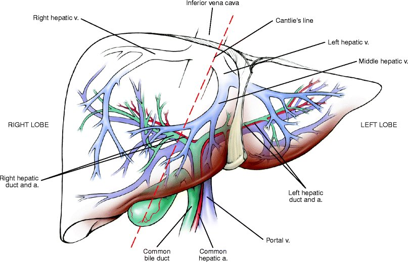
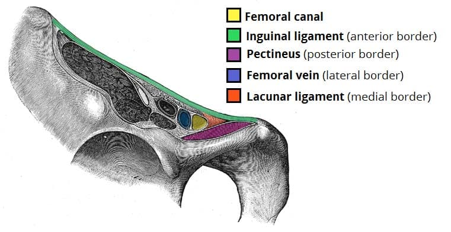

# 易混淆與相反規則整理

> 只放「跨章會混、方向會反、選項唯一例外」；完整病程留在主筆記。格式盡量用一句話＋cf. 對照。

## 標籤慣例

- 用藥/處置句要先標方向：疾病/診斷底下的治療用 `Tx＝`；藥物底下的適應症/常考用途用 `Ind＝`，抗生素抗菌範圍用 `Coverage＝`。其他常用標籤：`SE＝`副作用/毒性、`C/I＝`禁忌藥物或情境（原因放括號）、`Risk＝`併發症或高風險情境、`Dx＝`診斷用途、`f/u＝`追蹤用途、`PK＝`藥物排除/代謝、`MOA＝`作用機轉、`interaction＝`交互作用、`Safety＝`特殊族群可用性。看到藥名但沒標方向時，優先補標籤，防止把副作用誤記成適應症。

## 影像與檢查徵象

### 題幹反射診斷

用途：考場 first reflex（第一反射），不是取代完整鑑別；若選項有更特異 sign，先服從特異 sign。

| 題幹線索                                                           | 先跳診斷                                                | 不要誤套                                                           |
| -------------------------------------------------------------- | --------------------------------------------------- | -------------------------------------------------------------- |
| ENT（ear, nose, throat；耳鼻喉科）MRI＋單側耳悶/耳鳴/中耳積液/乳突炎樣表現             | Nasopharyngeal carcinoma（NPC；鼻咽癌）                   | 不是「所有 ENT MRI 都 NPC」；若寫 salt and pepper sign 先想 paraganglioma。 |
| Skull base MRI salt and pepper sign（鹽胡椒徵）                      | Paraganglioma（副神經節瘤）                                | 和 NPC 的單側耳症狀型題幹分開。                                             |
| 鞍部/蝶鞍 MRI mass＋雙側視力模糊/視野問題/頭痛                                  | Pituitary adenoma（腦下垂體腺瘤）                           | 視野典型是 bitemporal hemianopia（雙顳側偏盲）。                            |
| 姿勢性頭痛，躺下改善＋MRI diffuse dural/pachymeningeal enhancement        | Intracranial hypotension（顱內低壓）                      | 和 normal pressure hydrocephalus（NPH；常壓性水腦）三聯徵分開。               |
| 快速失智＋**視幻覺**/步態不穩＋startle myoclonus＋DWI **皮質/基底核訊號**           | Creutzfeldt-Jakob disease（CJD；庫賈氏症）                 | 不要只當一般 dementia（失智症）。                                          |
| 年輕女性＋**急性精神症狀/癲癇**＋口臉不自主動作＋MRI 可正常                             | **Anti-NMDA receptor encephalitis**（抗 NMDA 受體腦炎）    | 不是 primary psychosis；常要聯想到 ovarian teratoma（卵巢畸胎瘤）。            |
| 糖尿病/免疫低下＋黑色鼻甲/硬顎變黑＋眼眶症狀                                        | Mucormycosis（毛黴菌症；白黴菌感染）                            | 急症；不是一般鼻竇炎。                                                    |
| 肝病/肝硬化＋海水/魚刺傷＋快速水泡壞死/休克                                        | Vibrio vulnificus（創傷弧菌）                             | 危險因子不是淡水；進展快。                                                  |
| 郵輪/旅遊/旅館水源＋肺炎＋腹瀉＋**意識變化**＋hyponatremia（低鈉）                     | Legionella pneumonia（退伍軍人症）                         | CAP（community-acquired pneumonia，社區型肺炎）題幹若有**腹瀉低鈉**就優先選。       |
| 骨盆 MRI：T1 high、T2 shading/稍低訊號囊腫＋經痛                            | Endometrioma / chocolate cyst（卵巢子宮內膜異位瘤/巧克力囊腫）      | CA-125 可輕升，不等於卵巢癌。                                             |
| 骨盆腫塊影像有 fat/calcification/teeth（脂肪/鈣化/牙齒）                      | Mature cystic teratoma / dermoid cyst（成熟囊性畸胎瘤/皮樣囊腫） | 若年輕女＋AFP 高，改想 yolk sac tumor。                                  |
| HSG（hysterosalpingography，子宮輸卵管攝影）＋不孕＋遠端輸卵管阻塞/積水               | Hydrosalpinx（輸卵管積水）                                 | 不要用子宮鏡診斷輸卵管水腫。                                                 |
| 新生兒/嬰兒 bilious vomiting（膽汁性嘔吐）＋UGI（upper GI series，上消化道攝影）     | Malrotation with midgut volvulus（中腸旋轉不良併中腸扭結）       | 非膽汁性噴射吐才偏 hypertrophic pyloric stenosis（肥厚性幽門狹窄）。              |
| 嬰兒陣發哭鬧＋嘔吐/果醬便＋US target/doughnut sign                          | Intussusception（腸套疊）                                | 大多可 air/contrast enema reduction；有腹膜炎/穿孔才手術。                   |
| 糖尿病＋會陰紅腫痛＋CT gas（筋膜/軟組織氣體）                                     | Fournier gangrene（福尼爾壞疽）                            | 不等培養；核心是廣效抗生素＋緊急清創。                                            |
| 鋇劑吞嚥 bird-beak＋吞嚥困難/吸入性肺炎                                      | Achalasia（食道遲緩不能/賁門弛緩不能）                            | Corkscrew/rosary bead 比較像 diffuse esophageal spasm。            |
| 腎腫瘤影像含脂肪、健檢偶然發現                                                | Angiomyolipoma（AML；腎血管平滑肌脂肪瘤）                       | 低回音不均質或典型惡性腎腫塊才偏 renal cell carcinoma（RCC；腎細胞癌）。               |
| 酒精/類固醇風險＋髖痛＋X ray/MRI                                          | Avascular necrosis of femoral head（股骨頭缺血性壞死）        | 早期 X ray 可正常，MRI 敏感。                                           |
| 快速長大、火山口樣、中央角質栓皮膚腫瘤                                            | Keratoacanthoma（角化棘皮瘤）                              | 臨床常和 squamous cell carcinoma（SCC；鱗狀細胞癌）處理上接近，要切除/病理。           |
| Wood lamp coral-red fluorescence（伍氏燈珊瑚紅螢光）＋腋下/胯下               | Erythrasma（紅癬）                                      | 不是黴菌；KOH 可陰性，病因偏 Corynebacterium。                              |
| 點頭性痙攣＋hypopigmented macules/shagreen patch＋cardiac rhabdomyoma | Tuberous sclerosis complex（TSC；結節性硬化症）              | 和 Sturge-Weber（臉部 port-wine stain＋癲癇）分開。                       |

### Target sign / Bull's-eye sign

先看器官與影像，不要只背名字。

Lyme dx Erythema Chronicum Migrans/Borrelia burgdorferi硬蜱遊走性紅斑也長得像靶狀。

| 場景                                                                               | 先想到                                                                             | 快速分法                                                                                                                                                           |
| -------------------------------------------------------------------------------- | ------------------------------------------------------------------------------- | -------------------------------------------------------------------------------------------------------------------------------------------------------------- |
| Skin target lesion                                                               | Erythema multiforme（多形性紅斑） by herpes simplex virus（HSV；單純疱疹病毒）或 Mycoplasma（黴漿菌） | 典型三層 target/iris lesion，多在四肢伸側；不是所有 bull's-eye rash 都等於 EM。                                                                                                    |
| 小兒腹痛/果醬便，US/CT                                                                   | Intussusception（腸套疊）                                                            | Bowel-within-bowel＝target/doughnut；橫切面最像靶。                                                                                                                     |
| 嬰兒非膽汁噴射吐，US                                                                      | Hypertrophic pyloric stenosis（肥厚性幽門狹窄）                                          | Thick pyloric muscle 橫切面像 target/donut；仍要看 muscle thickness/length。                                                                                            |
| 增厚腸壁 CT                                                                          | Double halo / target sign                                                       | 腸壁分層＝submucosal edema/hemorrhage；可見於 inflammatory bowel disease（IBD；發炎性腸病）、ischemia、infectious enteritis、lupus enteritis / mesenteric vasculitis（狼瘡腸炎/腸繫膜血管炎）。 |
| Systemic lupus erythematosus（SLE；全身性紅斑狼瘡）腹痛                                      | Double halo / target sign                                                       | 連到 lupus enteritis / mesenteric vasculitis；不要把「target」只背成皮膚。                                                                                                   |
| Acquired immunodeficiency syndrome（AIDS；後天免疫缺乏症） ring-enhancing brain lesion，MRI | Eccentric target sign                                                           | 散發先想 cerebral toxoplasmosis（腦弓漿蟲）；cf. 單顆/深部/periventricular＝central nervous system lymphoma（CNS lymphoma；中樞神經淋巴瘤）。                                             |
| Peripheral nerve/soft tissue target sign MRI                                     | Neurofibroma / benign peripheral nerve sheath tumor（良性周邊神經鞘瘤）                   | T2 central low＋peripheral high。                                                                                                                                |
| Liver target/bull's-eye lesion                                                   | Metastasis 或 abscess                                                            | Abscess 可 double-target/cluster/gas；metastasis 常多發，靠感染 vs 癌症情境分。                                                                                               |

### Erythema 開頭病名快分

重點：先看年齡、位置、形狀、關聯感染；不要看到紅斑就全部互套成 target lesion。

| 名稱                                          | 快速定位                                                                                                                         | 不要混                                                                                                      |
| ------------------------------------------- | ---------------------------------------------------------------------------------------------------------------------------- | -------------------------------------------------------------------------------------------------------- |
| Erythema infectiosum（傳染性紅斑；第五病）             | Parvovirus B19；小孩 slapped cheek（被打巴掌臉）＋lacy rash（蕾絲狀疹）；孕婦感染可 fetal hydrops（胎兒水腫）。                                            | 不是 target lesion；和 measles/rubella 的發燒出疹時序分開。                                                            |
| Erythema multiforme（EM；多形性紅斑）               | 常由 herpes simplex virus（HSV；單純疱疹病毒）或 Mycoplasma（黴漿菌）誘發；true target/iris lesion（三層靶狀病灶），常在四肢伸側、手掌足底。                          | 和 Stevens-Johnson syndrome/toxic epidermal necrolysis（SJS/TEN；史蒂芬強生症候群/毒性表皮壞死溶解症）分開；EM 皮膚剝離少、target 較典型。 |
| Erythema nodosum（結節性紅斑）                     | 小腿前側痛性結節；septal panniculitis（間隔性脂肪織炎）；常連 sarcoidosis（類肉瘤症）、inflammatory bowel disease（IBD；發炎性腸病）、感染/藥物、Behcet disease（白塞氏病）。 | 通常不潰瘍；不是 vasculitis purpura（血管炎紫斑）。                                                                      |
| Erythema marginatum（邊緣性紅斑）                  | Acute rheumatic fever（ARF；急性風濕熱）Jones criteria major；軀幹/近端肢體、非癢、移動性環狀/蛇行。                                                    | 臉部通常 sparing；不是 Lyme bull's-eye，也不是 EM target。                                                           |
| Erythema migrans / chronicum migrans（遊走性紅斑） | Lyme disease（萊姆病）by Borrelia burgdorferi（伯氏疏螺旋體）；tick exposure（硬蜱叮咬）；bull's-eye 可像靶。                                         | 不是所有 bull's-eye 都是 EM；若題幹有關節炎/AV block/神經症狀要接 Lyme。                                                      |
| Erythema toxicum neonatorum（新生兒毒性紅斑）        | 足月新生兒出生後 1-3 天常見；紅斑底上小丘疹/膿皰；抹片 eosinophils（嗜酸性球）。                                                                            | 良性、會自行消退；不要當 neonatal sepsis 或 herpes。                                                                   |

### Coffee bean

| 名稱                     | 場景    | 快速分法                                                                                    |
| ---------------------- | ----- | --------------------------------------------------------------------------------------- |
| Coffee bean sign（咖啡豆徵） | X ray | **Sigmoid volvulus**（乙狀結腸扭轉；成因＝**老人、懷孕、高纖維飲食（過猶不及）、長期便秘**）。 c.f **盲腸扭轉＝KUB Coma shape** |
| Coffee-bean nuclei     | 病理    | **Granulosa cell tumor**（顆粒細胞瘤）。                                                        |

### Corkscrew sign

先看器官與影像。

| 場景                                               | 先想到                                        | 快速分法                                                                   |
| ------------------------------------------------ | ------------------------------------------ | ---------------------------------------------------------------------- |
| Barium swallow / esophagram（鋇劑吞嚥攝影）              | Diffuse/distal esophageal spasm（瀰漫/遠端食道痙攣） | 多發同步非推進收縮，corkscrew/rosary-bead esophagus；cf. **achalasia＝bird-beak**。 |
| Upper GI series：**duodenum/proximal jejunum** 螺旋 | Midgut volvulus（中腸扭轉） from malrotation     | **嬰兒膽汁性嘔吐/急腹症**；US/CT 可見 whirlpool sign螺旋丸。                            |
| Scrotal Doppler US：spermatic cord 扭在 testis 上方   | Testicular torsion（睪丸扭轉）                   | Twisted cord＝corkscrew/whirlpool；早期/部分扭轉仍可能有血流。                        |
| Pelvic Doppler US/CT：twisted vascular pedicle    | Ovarian/adnexal torsion（卵巢/附件扭轉）           | Pedicle 像 whirlpool/corkscrew；配急性單側疼痛＋ovarian enlargement。             |

### Beading / string of beads（串珠狀）

先看器官：肋骨、腎動脈、膽管、食道各代表不同疾病。

| 串珠位置/影像                           | 先想到                                           | 快速分法                                                                                               |
| --------------------------------- | --------------------------------------------- | -------------------------------------------------------------------------------------------------- |
| Rib costochondral junction（肋軟骨交界） | Rickets（佝僂症）                                  | **Rachitic rosary**（肋骨串珠）；兒童＋bowed legs/widening wrists/維生素 D 或磷酸鹽問題。                              |
| Renal artery（腎動脈）                 | **Fibromuscular dysplasia**（FMD；肌纖維發育不全）      | String of beads＝狹窄與擴張交替；年輕/中年女＋**次發性高血壓**、**abdominal bruit**。                                     |
| Bile ducts（膽管，MRCP/ERCP）          | Primary sclerosing cholangitis（PSC；原發性硬化性膽管炎） | Multifocal strictures＋dilatation＝beading；常連 ulcerative colitis（UC；潰瘍性結腸炎）、cholangiocarcinoma（膽管癌）。 |
| Esophagus（食道，barium swallow）      | Diffuse/distal esophageal spasm（瀰漫/遠端食道痙攣）    | Rosary-bead/corkscrew esophagus；胸痛＋吞嚥困難，cf. achalasia＝bird-beak。                                   |

### Marcus Gunn：jaw-winking vs RAPD

| 名稱                            | 定位                                                | 快速分法                                                                                       |
| ----------------------------- | ------------------------------------------------- | ------------------------------------------------------------------------------------------ |
| Marcus Gunn syndrome（下頷瞬目症候群） | Jaw-winking ptosis（眼瞼下垂）                          | 咀嚼/張口會帶動眼瞼；屬 congenital synkinesis（先天聯合運動），不是瞳孔反射題。                                        |
| Marcus Gunn pupil             | Relative afferent pupillary defect（RAPD；相對傳入瞳孔缺損） | Retina/optic nerve afferent lesion（視網膜/視神經傳入病變）；swinging flashlight test 照病眼時雙眼縮得少，甚至相對放大。 |

### Light-near dissociation（LND；光近反射分離）

光近反射分離＝對光差/消失，但看近會縮；重點是 near response（近反射）保留。RAPD 是傳入路徑定位，放在上面的 Marcus Gunn pupil，不當典型 LND 背。

| 名稱                     | 瞳孔/定位                            | 快速分法                          |
| ---------------------- | -------------------------------- | ----------------------------- |
| Argyll Robertson pupil | Neurosyphilis（神經性梅毒）             | 小瞳孔；light-near dissociation。  |
| Adie tonic pupil       | 年輕女、平時大瞳孔                        | **副交感**神經節後纖維受損；縮小後恢復慢。       |
| Parinaud syndrome      | Pineal/dorsal midbrain（松果區/背側中腦） | 松果區腫瘤壓迫背側中腦；上視麻痺/上視失敗後會聚後縮眼震。 |

### Horner syndrome

- Horner syndrome（霍納症候群）：ptosis＋miosis＋anhidrosis（眼瞼下垂＋縮瞳＋無汗），純交感侵犯；可見 Pancoast tumor、neuroblastoma、brainstem stroke、Klumpe palsy、internal carotid artery（ICA；內頸動脈） lesion。

### Charcot / Courvoisier

| 名稱                                         | 先想到                                                                    | 快速分法                                                                                                                    |
| ------------------------------------------ | ---------------------------------------------------------------------- | ----------------------------------------------------------------------------------------------------------------------- |
| Charcot triad（夏科三徵）                        | Acute cholangitis（急性膽管炎）                                               | Fever＋right upper quadrant pain（RUQ pain；右上腹痛）＋jaundice；Reynolds pentad＝再加 **shock＋altered mental status**（AMS；意識狀態改變）。 |
| Charcot-Bouchard microaneurysm（夏科-布沙爾微動脈瘤） | **Chronic hypertension**（慢性高血壓）→ deep intracerebral hemorrhage（深部腦內出血） | 小穿通動脈微動脈瘤；破裂常見 basal ganglia/putamen（基底核/殼核），不是膽道感染的 Charcot triad。                                                     |
| Courvoisier sign（庫瓦西耶徵）                    | Pancreatic/periampullary malignancy（胰臟/壺腹周圍惡性腫瘤）                       | 無痛性黃疸＋可摸到膽囊。                                                                                                            |
| **Charcot**-Leyden crystals（夏科萊登結晶）        | **Eosinophil**（嗜酸性球）分解產物                                               | 見 allergic fungal rhinosinusitis（過敏性黴菌性鼻竇炎）/氣喘等。                                                                        |
| Charcot-Marie-Tooth disease（CMT，夏科-馬里-圖斯病） | **Hereditary motor sensory neuropathy**（遺傳性運動感覺神經病變）                   | 周邊神經病變：高足弓、**遠端肌無力/萎縮**、感覺下降；不是膽道感染的 Charcot triad。                                                                     |

### Kocher / Kerley / Kernig

| 名稱            | 類別      | 快速分法          |
| ------------- | ------- | ------------- |
| Kocher        | 外科方法    | 膽囊切口或胰十二指腸游離。 |
| Kerley B line | X 光影像   | 肺水腫間質線。       |
| Kernig        | 神經學理學檢查 | 腦膜刺激徵。        |

### Hutchinson

| 名稱                   | 先想到                                 | 快速分法                                                               |
| -------------------- | ----------------------------------- | ------------------------------------------------------------------ |
| Hutchinson sign      | Herpes zoster ophthalmicus（眼帶狀疱疹）風險 | 鼻尖水疱/皮疹＝varicella-zoster virus（VZV；水痘帶狀疱疹病毒）侵犯 nasociliary branch。 |
| Hutchinson nail sign | Subungual melanoma（甲下黑色素瘤）          | 甲黑線延伸到**甲周/近端甲皺襞**。                                                |

### Keyboard / Piano key sign

| 位置                               | 先想到                                                                                                         | 快速分法                                                      |
| -------------------------------- | ----------------------------------------------------------------------------------------------------------- | --------------------------------------------------------- |
| Shoulder                         | Acromioclavicular joint（AC joint；肩鎖關節） separation/dislocation                                               | 壓 **distal clavicle** 會下沉，放開彈回。                           |
| Wrist                            | Distal radioulnar joint（DRUJ；遠端橈尺關節） instability / triangular fibrocartilage complex（TFCC；三角纖維軟骨複合體） injury | 壓突出的 ulnar head 會像琴鍵彈動。                                   |
| Urinary tract keyhole sign（鑰匙孔徵） | Posterior urethral valve（PUV；後尿道瓣膜）                                                                         | 產前/新生兒影像見膀胱＋後尿道擴張，常合併雙側 hydronephrosis；不是 piano key sign。 |
| keyboard sign                    | 小腸阻塞時小腸褶皺被分開。                                                                                               |                                                           |

### Calcification pattern

先問時間點：治療前原本的 microcalcification/psammoma body 多是診斷線索；治療後新出現鈣化常代表壞死/纖維化/修復，可支持治療反應，但仍要合併腫瘤大小、活性與臨床。

| 鈣化型態                            | 先想到                                                                                                        |
| ------------------------------- | ---------------------------------------------------------------------------------------------------------- |
| Popcorn（爆米花狀/coarse）            | 子宮肌瘤（骨盆）、fibroadenoma（乳房纖維腺瘤）、pulmonary hamartoma（肺過誤瘤）；多偏良性/退化。                                           |
| Psammomatous（沙粒狀/psammoma body） | **Serous** ovarian carcinoma（漿液性卵巢癌）；也可見 **papillary** thyroid carcinoma（乳突甲狀腺癌）/**meningioma**（腦膜瘤），先看器官。 |
| 牙齒/骨骼/脂肪                        | Mature cystic teratoma / dermoid cyst（成熟囊性畸胎瘤/皮樣囊腫）。                                                       |
| 線狀/無定形                          | 放射治療後 dystrophic calcification（營養不良性鈣化）；屬於營養不良壞死，不等於復發。                                                    |

治療後新鈣化：多偏反應/修復。

| 情境                                            | 快速判讀                 |
| --------------------------------------------- | -------------------- |
| Colorectal cancer liver metastasis（大腸癌肝轉移）化療後 | 新鈣化可代表治療反應，不要直接當惡化。  |
| Lymphoma（淋巴瘤）治療後殘餘腫塊                          | 殘餘鈣化可為纖維化/壞死。        |
| Osteosarcoma（骨肉瘤）化療後                          | 礦化增加可提示反應；但仍看大小/壞死率。 |
| Neuroblastoma（神經母細胞瘤）治療後                      | 鈣化/成熟化可見，偏治療後變化。     |

治療前原本鈣化：多是腫瘤特性/診斷線索，不等於治療成功。

| 情境                                                           | 快速判讀                         |
| ------------------------------------------------------------ | ---------------------------- |
| Breast clustered pleomorphic microcalcifications（乳房群聚多形性微鈣化） | 懷疑 **DCIS**/乳癌。              |
| Papillary thyroid carcinoma / serous ovarian carcinoma       | Psammoma body 是惡性診斷線索之一。     |
| Meningioma / oligodendroglioma                               | 腫瘤常見鈣化特性，不直接代表好壞。            |
| Pulmonary hamartoma                                          | Popcorn calcification 偏良性線索。 |
| Mature teratoma                                              | 牙齒/骨頭/脂肪＝成熟組織成分。             |

### 核醫 Tracer

| 檢查                  | Tracer / 機轉                                        | 快速判斷                                                                                     |
| ------------------- | -------------------------------------------------- | ---------------------------------------------------------------------------------------- |
| Meckel scan         | Technetium-99m pertechnetate（Tc-99m pertechnetate） | 被胃黏膜分泌細胞攝取，抓異位胃黏膜；不是直接抓憩室本身。                                                             |
| Bone scan           | Technetium-99m methylene diphosphonate（Tc-99m MDP） | 骨表面沉積，反映 osteoblastic activity（骨母細胞活性）/血流；lytic lesion 如 multiple myeloma（MM；多發性骨髓瘤）可不亮。 |
| HIDA scan           | Tc-99m iminodiacetic acid 類（Tc-99m IDA 類）          | 肝細胞攝取後經膽汁排泄，看 gallbladder（GB；膽囊）/膽道；**急性膽囊炎常見 GB 不顯影**（膽汁進不去 GB）。                        |
| PET                 | Fluorine-18 fluorodeoxyglucose（18F-FDG）            | 葡萄糖代謝高就亮；腫瘤常亮但發炎/感染也可亮，非癌症專一。                                                            |
| Thyroid scan/uptake | Iodine-123 / iodine-131（I-123/I-131）               | 甲狀腺攝碘功能；**I-123 偏診斷**，I-131 可用於治療/全身追蹤。                                                  |

## 解剖與定位

### 外科解剖 Landmark

| Landmark                                       | 邊界 / 位置                                                                                                                                                                                                                                                 | 內容物 / 考點                                                                                                                                                                                                                                                                                                                  |
| ---------------------------------------------- | ------------------------------------------------------------------------------------------------------------------------------------------------------------------------------------------------------------------------------------------------------- | ------------------------------------------------------------------------------------------------------------------------------------------------------------------------------------------------------------------------------------------------------------------------------------------------------------------------- |
| Calot / hepatocystic triangle                  | Modern＝cystic duct（膽囊管）＋common hepatic duct（總肝管）＋肝下緣；classic Calot 把肝下緣換成 cystic artery（膽囊動脈）                                                                                                                                                           | 內有 cystic artery、Lund node；膽囊切除要做 critical view of safety，避免把 common bile duct（CBD；總膽管）/common hepatic duct（CHD；總肝管）誤剪。                                                                                                                                                                                                   |
| Hepatoduodenal ligament/portal triad           | 肝十二指腸韌帶內                                                                                                                                                                                                                                                | CBD、proper hepatic artery（肝固有動脈）、portal vein（門靜脈）；Pringle maneuver 夾這裡。若仍出血，想 hepatic vein/inferior vena cava（IVC；下腔靜脈）。                                                                                                                                                                                                  |
| Foramen of Winslow（omental foramen）            | 前＝Hepatoduodenal ligament、後＝IVC、上＝caudate lobe、下＝duodenum **第 1 段**                                                                                                                                                                                     | Lesser sac 入口；手指進去可壓 hepatoduodenal ligament 做 Pringle maneuver。                                                                                                                                                                                                                                                          |
| Liver anatomical lobes vs functional hemiliver | 嚴格解剖詞：外觀 left/right lobe（左右葉）多用 **falciform ligament**（鐮狀韌帶）分；手術/影像的 functional left/right hemiliver（左右肝）用 Cantlie line 分。考題若把 left/right lobe 當功能葉，通常也是問 Cantlie line/middle hepatic vein（中肝靜脈）。Cantlie line＝gallbladder fossa（膽囊窩）到 IVC。              | Functional left liver＝Couinaud II/III/IV；functional right liver＝V/VI/VII/VIII；segment I（caudate lobe，尾狀葉）常單獨看。                                                                                                                                                                                                            |
| Couinaud liver segments（肝段）                    | Hepatic veins（肝靜脈）多是 segment 間分界；portal triad 分支走在 segment 中心。Right hepatic vein 分右前/右後，middle hepatic vein 分功能左右肝，portal vein 平面分上下。Left lateral segment（左外側肝段，II/III）與 left medial segment（左內側肝段，IV）分界＝falciform ligament/umbilical fissure（鐮狀韌帶/臍裂）。 | 快速定位：II/III＝left lateral；IV＝left medial/quadrate；V/VIII＝right anterior；VI/VII＝right posterior；I＝caudate，常有直接流到 IVC 的小肝靜脈。易混：segment IV 在 Couinaud/functional system 屬 left liver（left medial segment），但用 falciform ligament 分外觀 anatomical lobes 時位在 falciform 右側，容易被看成 right anatomical lobe/quadrate area；不要用外觀左右葉反推肝段。 |
| Deep inguinal ring                             | Inferior epigastric vessels（下腹壁血管）外側                                                                                                                                                                                                                    | Indirect inguinal hernia（間接型腹股溝疝氣）從 deep ring 進 inguinal canal；位於 inferior epigastric vessels 外側。                                                                                                                                                                                                                         |
| Femoral triangle                               | 上＝inguinal ligament、外＝sartorius、內＝adductor longus                                                                                                                                                                                                       | 內容物外到內＝NAVEL：nerve、artery、vein、empty space/femoral canal、lymphatics。                                                                                                                                                                                                                                                      |
| Femoral ring/canal                             | Ring 邊界：前/上＝inguinal ligament、後/下＝pectineal ligament/pectineus fascia、內＝lacunar ligament、外＝femoral vein                                                                                                                                                 | Canal＝NAVEL 的 E，位於 femoral vein 內側；hernia 走 ring→canal→saphenous opening，表面在 inguinal ligament 下、pubic tubercle 外下方；女多，strangulation 風險高。                                                                                                                                                                                 |
| Laparoscopic hernia triangle of doom           | Vas deferens 與 gonadal vessels 之間                                                                                                                                                                                                                       | 內有 external iliac vessels（外髂血管）；腹腔鏡疝氣修補避免 tack/釘針。                                                                                                                                                                                                                                                                        |
| Laparoscopic hernia triangle of pain           | Gonadal vessels 外側、iliopubic tract 下方                                                                                                                                                                                                                   | 內有 femoral nerve、lateral femoral cutaneous nerve、genitofemoral nerve 分支；避免神經痛。                                                                                                                                                                                                                                            |
| McBurney point                                 | Umbilicus 到右 anterior superior iliac spine（ASIS；前上髂棘）連線外 1/3 處                                                                                                                                                                                          | Appendix（闌尾）常見壓痛點；Lanz point 偏兩 ASIS 連線右 1/3，闌尾位置非典型時壓痛可不典型。                                                                                                                                                                                                                                                              |
| Chest tube triangle of safety                  | 前＝pectoralis major 外緣、後＝latissimus dorsi 前緣、下＝第 5 肋間/乳頭線、上＝腋窩                                                                                                                                                                                           | 胸管較安全插入區；通常走肋骨上緣，避免肋間血管神經束。                                                                                                                                                                                                                                                                                               |

### 外科解剖圖譜

| Liver lobes / Cantlie line                                              | Hepatocystic / Calot                                                                   | Pringle maneuver                                     |
| ----------------------------------------------------------------------- | -------------------------------------------------------------------------------------- | ---------------------------------------------------- |
|  |  |  |
| Falciform ligament 分外觀 lobe；Cantlie line / middle hepatic vein 分功能左右肝。  | 分 modern hepatocystic triangle vs classic Calot                                        | 夾 hepatoduodenal ligament 控制 portal triad 流入血        |

| Hesselbach triangle                                       | Femoral triangle / hernia                                                             | Laparoscopic hernia triangles                                                  |
| --------------------------------------------------------- | ------------------------------------------------------------------------------------- | ------------------------------------------------------------------------------ |
|  |  |  |
| Direct hernia 通過；inferior epigastric vessels 內側。          | 對照 NAVEL、saphenous opening 與股疝突出路徑                                                    | Direct/indirect/femoral hernia、triangle of doom / pain                         |

| Chest tube triangle of safety                                                 | Femoral ring / canal borders                                                                                              |     |
| ----------------------------------------------------------------------------- | ------------------------------------------------------------------------------------------------------------------------- | --- |
|  |                                        |     |
| 胸管安全三角。                                                                       | 股環邊界＝前/上 inguinal ligament、後/下 pectineal ligament/pectineus fascia、內 lacunar ligament、外 femoral vein；Femoral canal 是股疝入口。 |     |

### 跨科高收益圖譜

| ECG / action potential / pressure waves                                                             | Pituitary anatomy                                                   | Antibiotic spectrum                            |
| --------------------------------------------------------------------------------------------------- | ------------------------------------------------------------------- | ---------------------------------------------- |
|  |  |  |
| ECG（electrocardiogram，心電圖）與動作電位/壓力波對照，心律不整定位速掃。                                                     | Sella（鞍部）/pituitary（腦下垂體）解剖定位。                                      | 抗生素 coverage（抗菌譜）與常見菌種對照。                      |

| Dermatology overview                          | Skin infections / reactions                            | Intracranial hemorrhage types                            |
| --------------------------------------------- | ------------------------------------------------------ | -------------------------------------------------------- |
|  |  |  |
| 皮膚科型態學、常見病灶與診斷線索總覽。                           | 感染、藥疹、免疫反應常見外觀比對。                                      | EDH/SDH/SAH/ICH（硬膜外/硬膜下/蜘蛛膜下/腦內出血）位置與影像。                 |

| Scalp / intracranial bleeding layers                             | Cervical vs lumbar root compression                                                    | Prostate zones                                                     |
| ---------------------------------------------------------------- | -------------------------------------------------------------------------------------- | ------------------------------------------------------------------ |
|  |  |                     |
| 頭皮到顱內各層出血位置，對照 cephalohematoma / subgaleal / epidural 等。         | Cervical（頸椎）與 lumbar（腰椎）radiculopathy（神經根病變）受壓方向差異。                                    | Prostate cancer 多 peripheral zone；BPH 多 transitional/periurethral。 |

| Inguinal canal map                                               | Lower abdominal hernia sites                                                                   | Buck's / Dartos fascia                                                    |
| ---------------------------------------------------------------- | ---------------------------------------------------------------------------------------------- | ------------------------------------------------------------------------- |
|           |  |  |
| Deep ring、inferior epigastric vessels、direct/indirect hernia 定位。 | Inguinal/femoral/其他下腹疝氣位置比較。                                                                   | Penile fascia（陰莖筋膜）與尿道外傷尿液外滲路徑。                                           |

| Right shoulder AC ligaments                                               | De Quervain vs intersection syndrome                                                     | Bone tumor comparison                          |
| ------------------------------------------------------------------------- | ---------------------------------------------------------------------------------------- | ---------------------------------------------- |
|  |  |  |
| AC joint（acromioclavicular joint，肩鎖關節）韌帶與分級定位。                            | De Quervain tenosynovitis（狄奎凡腱鞘炎）與 intersection syndrome 疼痛位置。                           | 骨腫瘤年齡、位置、影像與關鍵字比較。                             |

| Uterine ligament atlas                                           | Menstrual cycle hormones                                            | Eye anatomy overview                                        |
| ---------------------------------------------------------------- | ------------------------------------------------------------------- | ----------------------------------------------------------- |
|  |  |  |
| Uterine artery/ureter、cardinal/uterosacral/round ligament 速掃。    | HPO axis（hypothalamic-pituitary-ovarian axis，下視丘-腦下垂體-卵巢軸）與週期激素。    | 眼球、前房、視網膜與視神經解剖定位。                                          |

| Pyriform sinus anatomy                                          | Laryngeal cartilages anatomy                          | Neck lymph node levels I-VII                                           |
| --------------------------------------------------------------- | ----------------------------------------------------- | ---------------------------------------------------------------------- |
|  |  |  |
| Pyriform sinus（梨狀竇）與 hypopharynx（下咽）定位。                         | Thyroid/cricoid/arytenoid cartilage（甲狀/環狀/杓狀軟骨）速掃。    | 頭頸癌 neck node levels（頸部淋巴結分區）I-VII。                                    |

### 左右側偏好

| 側別                             | 常見項目                                                                                                                                                                                                                                                                                       | 快速分法                                                                                                                                                                                                                                                                                                                                                                                                                                                                                                                                                                                                                                                                                            |
| ------------------------------ | ------------------------------------------------------------------------------------------------------------------------------------------------------------------------------------------------------------------------------------------------------------------------------------------ | ----------------------------------------------------------------------------------------------------------------------------------------------------------------------------------------------------------------------------------------------------------------------------------------------------------------------------------------------------------------------------------------------------------------------------------------------------------------------------------------------------------------------------------------------------------------------------------------------------------------------------------------------------------------------------------------------- |
| Left-sided predominance（左側偏好）  | CDH（congenital diaphragmatic hernia，先天性橫膈疝氣） / May-Thurner syndrome / left varicocele（左精索靜脈曲張） / UPJ obstruction（ureteropelvic junction obstruction，輸尿管腎盂接口處阻塞） / SCFE（slipped capital femoral epiphysis，股骨頭骨骺滑脫） / left RLN injury（left recurrent laryngeal nerve injury，左喉返神經損傷） / 梨狀竇瘻管 | 都是左側偏好/左側較易受影響，但系統/機轉不同。CDH 多為 left-sided CDH，常見左側 posterolateral/Bochdalek defect；May-Thurner（孕婦左下肢 deep vein thrombosis〔DVT；深部靜脈栓塞〕常考）＝**right common iliac artery **壓 left common iliac vein→左下肢靜脈回流差；left varicocele＝left testicular vein 先垂直入 left renal vein，右 testicular vein 多直接入 inferior vena cava（IVC；下腔靜脈）→左精索靜脈壓較高；nutcracker effect＝superior mesenteric artery（SMA；上腸繫膜動脈）/aorta 夾 left renal vein→左腎靜脈壓↑，可左側血尿＋left varicocele；UPJ obstruction＝男、左腎為主，是泌尿道接口阻塞；SCFE＝肥胖男孩、左側為主，是骨科髖部骨骺滑脫；left recurrent laryngeal nerve＝繞 aortic arch（主動脈弓）後上行，路徑較長，較易被胸腔/縱膈/甲狀腺手術或腫瘤傷到，表現聲音沙啞/聲帶麻痺。補：**巧克力囊腫也是左側多**，成因不明。                                                                        |
| Right-sided predominance（右側偏好） | **inguinal hernia（鼠蹊疝氣）** / **cryptorchidism（隱睪）** / **ovarian torsion（卵巢扭轉）** / Asian diverticulitis（亞洲型右側憩室炎） / gastroschisis（腹壁裂） / Lynch syndrome colorectal cancer（CRC，大腸癌） / 呼吸道異物                                                                                                   | 都是右側偏好/右下腹痛/右側腹壁缺損易混，但機轉不同。Inguinal hernia（尤其小兒 indirect）/communicating hydrocele（交通性陰囊水腫）＝right processus vaginalis（右鞘狀突）**較晚閉合**→右側較多；cryptorchidism 也較常右側。Ovarian/adnexal torsion（卵巢/附件扭轉）**右側較常見**，常和 appendicitis（闌尾炎）同樣表現 right lower quadrant pain（RLQ pain，右下腹痛），c.f 左側 sigmoid colon（乙狀結腸）限制活動。Asian/Taiwan 的 colonic diverticulitis（大腸憩室炎）較常右側，可 mimic appendicitis；cf. Western classic＝sigmoid diverticulitis（乙狀結腸憩室炎）/left lower quadrant pain（LLQ pain，左下腹痛）。Gastroschisis＝多在 umbilicus（臍）右側旁中線較小腹壁缺損，腸子外露且無膜囊；cf. omphalocele（臍膨出）＝正中、常有膜囊、腹壁缺口通常較大，較常合併染色體/症候群。Lynch syndrome（林奇症候群）相關 colorectal cancer 偏 proximal/right colon（近端/右側結腸），常和 endometrial cancer（子宮內膜癌）一起考；不是滿腸息肉。 |

### 血管與解剖名稱

| 名稱                                                                                                                   | 不要混成                                                                             | 快速分法                                                                                                                                                                                                                                                                                 |
| -------------------------------------------------------------------------------------------------------------------- | -------------------------------------------------------------------------------- | ------------------------------------------------------------------------------------------------------------------------------------------------------------------------------------------------------------------------------------------------------------------------------------ |
| Coronary vein（胃冠狀靜脈） vs short gastric veins                                                                          | 腹部語境 coronary vein 不是短胃靜脈                                                        | Coronary vein 舊名多指 left gastric vein（左胃靜脈）：胃小彎/食道下端→portal vein；門脈高壓時和 esophageal veins 形成側枝，**esophageal veins 再回 azygos vein**（奇靜脈）。Short gastric veins＝胃底→splenic vein（脾靜脈）。                                                                                                      |
| Cardiac coronary veins vs coronary sinus                                                                             | 心臟 coronary vein 不是 coronary sinus 本身                                            | Great/middle/small cardiac veins 等是心臟靜脈；coronary sinus 是後方 atrioventricular groove（AV groove；房室溝）的大靜脈通道，收集多數心臟靜脈後開口到右心房。                                                                                                                                                             |
| Anterior cardiac veins / Thebesian veins                                                                             | 不一定進 coronary sinus                                                              | **Anterior cardiac veins 多直接進右心房**；Thebesian/smallest cardiac veins 直接進心腔，是**少量生理性 right-to-left shunt（右向左分流）**來源。                                                                                                                                                                   |
| Aortic sinus vs coronary sinus                                                                                       | 都叫 sinus，但一動一靜                                                                   | Aortic sinus 在主動脈根部瓣膜後方，左右冠狀動脈從 left/right aortic sinus 出；coronary sinus 是心臟靜脈回流到 right atrium（RA；右心房）。                                                                                                                                                                              |
| Carotid sinus vs carotid body vs cavernous sinus                                                                     | Sinus/body 不是同一功能                                                                | Carotid **sinus**＝頸動脈分叉 baroreceptor（**壓力**受器）；carotid body＝chemoreceptor（化學受器）；**cavernous sinus＝顱內硬腦膜靜脈竇**，內有 ICA/cranial nerve VI（CN6；第六對腦神經），側壁有 CN3/4/V1/V2。                                                                                                                    |
| Pulmonary artery/vein vs bronchial artery/vein                                                                       | 肺循環 vs 支氣管營養血流                                                                   | Pulmonary artery 帶低氧血去肺泡氣體交換，pulmonary veins 帶高氧血回 left atrium（LA；左心房）；bronchial arteries 來自 systemic circulation 供應支氣管/肺支架組織。                                                                                                                                                       |
| Hepatic portal vein vs hepatic vein                                                                                  | 入肝 vs 出肝                                                                         | Portal vein＝superior mesenteric vein（SMV；上腸繫膜靜脈）＋splenic vein，帶腸胃血進肝；hepatic veins 把肝血排到 IVC。Pringle maneuver 夾 portal triad，不夾 hepatic veins。                                                                                                                                       |
| Portal triad vs porta hepatis                                                                                        | 結構內容 vs 肝門位置                                                                     | Portal triad＝portal vein＋proper hepatic artery＋**CBD**；porta hepatis 是肝門，還有淋巴/神經等結構進出。                                                                                                                                                                                               |
| Internal carotid artery vs external carotid artery                                                                   | 頸部有沒有分支                                                                          | ICA 頸部沒有分支、進顱供腦/眼；external carotid artery（ECA；外頸動脈）在頸部分支供臉頭頸（superficial temporal、facial、maxillary 等）。                                                                                                                                                                               |
| Internal jugular vein vs external jugular vein                                                                       | 深部主幹 vs 表淺靜脈                                                                     | Internal jugular vein（IJV；內頸靜脈）深部伴 carotid sheath（總頸動脈、內頸靜脈、迷走神經），收腦顱內血；external jugular vein（EJV；外頸靜脈）表淺跨 sternocleidomastoid（SCM；胸鎖乳突肌），收頭皮/臉部表淺血，**最後進 subclavian vein**。                                                                                                         |
| Inferior epigastric vessels                                                                                          | Direct/indirect hernia 定位線                                                       | Direct hernia 在 inferior epigastric vessels 內側、Hesselbach triangle；indirect hernia 在外側，從 deep inguinal ring 進。                                                                                                                                                                       |
| Abdominal aorta / external iliac artery（外髂動脈）來源，cf. 內髂                                                               | 不要把 gonadal/rectal/sacral 血管接到外髂                                                 | 腹主動脈直接/間接：ovarian/testicular artery＝腹主動脈直接供卵巢/睪丸、superior rectal artery＝inferior mesenteric artery（IMA；下腸繫膜動脈）終末支供直腸上段、**median sacral artery**＝aortic bifurcation 附近後方出、走骶骨前。外髂動脈主要記 inferior epigastric artery、deep circumflex iliac artery，過 inguinal ligament 後變 femoral artery。 |
| Great saphenous vein vs small saphenous vein vs saphenous nerve                                                      | 名字都 saphenous，但走向不同                                                              | Great saphenous＝內側腿，進 femoral vein；small saphenous＝後小腿，進 **popliteal vein**；saphenous nerve＝femoral nerve 感覺分支，內側腿皮膚感覺。                                                                                                                                                              |
| Profunda femoris / medial circumflex femoral artery                                                                  | Femoral artery 主幹不要直接等同                                                          | Profunda femoris＝deep femoral artery；medial circumflex femoral artery 常由 profunda 出，供 femoral head，股骨頸骨折怕傷它造成 avascular necrosis（AVN；缺血性壞死）。                                                                                                                                         |
| Middle meningeal artery vs middle cerebral artery                                                                    | 都 middle，但病完全不同                                                                  | Middle meningeal artery 破裂＝temporal bone fracture 後 epidural hematoma（EDH；硬膜外血腫）；middle cerebral artery（MCA；中大腦動脈）阻塞＝對側臉手無力/感覺＋aphasia（失語）或 neglect（忽略）。                                                                                                                             |
| Anterior inferior cerebellar artery（AICA）/posterior inferior cerebellar artery（PICA）/Superior cerebellar artery（SCA） | AICA、PICA、SCA 都屬 posterior circulation；AICA/PICA 常造成 lateral brainstem syndrome。 | AICA＝lateral pontine，常有 facial weakness、聽力/前庭症狀；PICA＝lateral medullary；常有 **Wallenberg syndrome**（延髓外側症候群；包含nucleus ambiguus 症狀（dysphagia/hoarseness；吞嚥困難/聲音沙啞）；SCA＝常有ataxia、dysarthria、vertigo；可因血管壓迫造成 trigeminal neuralgia。                                                       |

### 鼻竇與唾液腺之最

| 系統                                 | 之最                                                                                              | 快速分法                                        |
| ---------------------------------- | ----------------------------------------------------------------------------------------------- | ------------------------------------------- |
| Paranasal sinus（副鼻竇）               | Maxillary sinus（上頜竇）＝鼻竇炎/感染最常見                                                                  | 上頜竇開口位置高、引流差；題目問鼻竇炎最常見定位先選上頜竇。              |
| Salivary stone（sialolithiasis，唾石症） | Submandibular gland/Wharton's duct（下頷腺/華頓氏管）＝結石最常見；sublingual/minor salivary gland（舌下腺/小唾液腺）＝少見 | Wharton's duct 長、向上開口、唾液較黏；下頷腺＝石頭之最，不是腫瘤之最。 |
| Salivary gland tumor（唾液腺腫瘤）        | Parotid gland（腮腺）＝腫瘤最常見且多良性；sublingual/minor salivary gland＝較少但惡性比例高                            | 規則＝腺體越大，腫瘤越常見但越良性；腺體越小，越少見但越惡性。             |

### 神經定位：上肢重 vs 下肢重

| 分布      | 常見定位                                                                                                                                                                                                                                                                                                                                                | 快速分法                                                                             |
| ------- | --------------------------------------------------------------------------------------------------------------------------------------------------------------------------------------------------------------------------------------------------------------------------------------------------------------------------------------------------- | -------------------------------------------------------------------------------- |
| 下肢 > 上肢 | Anterior cerebral artery（ACA；前大腦動脈） stroke、**cerebral palsy spastic diplegia **/ **periventricular leukomalacia**（PVL；腦室周圍白質軟化）、thoracic cord lesion、lumbar stenosis/cauda equina（馬尾症候群）、hereditary spastic paraplegia、early Guillain-Barre syndrome（GBS；格林-巴利症候群）、Lambert-Eaton syndrome、低血鉀週期性麻痺、**Cerebral palsy quadriplegia**（四肢麻痺型；廣泛腦病變，預後差） | 腦部＝內側運動皮質偏腿；CP diplegia/PVL＝下肢重；胸髓以下/腰薦根自然偏下肢；GBS 早期常 ascending weakness（上行性無力）。 |
| 上肢 > 下肢 | MCA stroke、central cord syndrome（中央脊髓症候群）、cerebral palsy hemiplegia（同側上肢常較重）、brachial plexopathy、cervical radiculopathy/myelopathy、部分 **amyotrophic lateral sclerosis**（ALS；肌萎縮性側索硬化症）或 multifocal motor neuropathy（MMN；多灶性運動神經病變）                                                                                                                  | 腦部＝外側運動皮質偏臉/手；頸髓中央病灶上肢纖維較受影響；臂神經叢/頸神經根自然偏上肢。                                     |

- 易混：GBS 的「遠端先」是周邊神經病變（遠端下肢先→近端上行），不是 primary myopathy（原發肌肉病）；MD（myotonic dystrophy，肌強直性失養症）則是肌肉病變中少數遠端手部先。DMD/BMD 多為近端先。
- ALS（amyotrophic lateral sclerosis，肌萎縮性側索硬化症）反射：不是「反射都保留」。Babinski/clonus/jaw jerk 可陽性；LMN（lower motor neuron，下運動神經）病灶節段反射可↓；感覺路徑相對保留→superficial abdominal/cremasteric reflex（腹壁/提睪表淺反射）可保留。肌萎縮/fasciculation＋hyperreflexia 反而支持 ALS。
- central cord syndrome＝Center+Chin hit（伸展台頭）+Can't move hands+Commonly in elderly

| 無力方向                | 先想到                                                  | 快速分法                                                                                                                                                                                                                                                     |
| ------------------- | ---------------------------------------------------- | -------------------------------------------------------------------------------------------------------------------------------------------------------------------------------------------------------------------------------------------------------- |
| Ascending（上行）       | Guillain-Barre syndrome（GBS；格林-巴利症候群）                | 周邊神經去髓鞘；遠端下肢/腳先無力→近端上行，**自主神經損傷，反射下降/消失，可呼吸衰竭**。                                                                                                                                                                                                         |
| Fatigable（越用越弱）     | Myasthenia gravis（MG；重症肌無力）                          | 神經肌肉接合處 postsynaptic acetylcholine receptor（AChR，乙醯膽鹼受器）；眼肌/口咽/近端肌波動性易疲勞，休息改善；可複視、口齒不清、吞嚥困難、喘；常合併 thymus（胸腺）病變；Tx＝acetylcholinesterase inhibitor（AChE inhibitor，乙醯膽鹼酯酶抑制劑，例如 pyridostigmine）± thymectomy/免疫治療；不是 ascending。                              |
| Facilitation（越動越有力） | Lambert-Eaton myasthenic syndrome（LEMS；蘭伯特-伊頓肌無力症候群） | 神經肌肉接合處 presynaptic P/Q-type Ca channel（不是 K channel）；下肢近端無力、deep tendon reflex（DTR，深部肌腱反射）低、自律神經症狀（口乾），活動後力量/反射可改善；少眼口咽/呼吸症狀，可鑑別 MG；常為 paraneoplastic syndrome，尤其 small cell lung cancer（SCLC，小細胞肺癌）；Tx＝treat tumor ± **amifampridine**（3,4-DAP；K離子通道）。 |
| Descending（下行）      | Botulism（肉毒桿菌中毒）                                     | 神經肌肉接合處；先腦神經/眼口（**複視、瞳大、口乾、吞嚥困難**）→四肢→呼吸。                                                                                                                                                                                                                |

### 脊髓症候群：側別 / 血管 / 自主神經

| 定位                                      | 快速分法                                                                          |
| --------------------------------------- | ----------------------------------------------------------------------------- |
| Brown-Sequard syndrome（半側脊髓症候群）         | 同側 motor/proprioception loss＋對側 pain/temp loss；不完全 spinal cord injury 中預後相對好。 |
| Anterior spinal artery infarct（前脊髓動脈梗塞） | 脊髓前 2/3：motor＋pain/temp 受損，dorsal column 相對保留；**MRI 可見 owl's eye sign。**      |
| Autonomic dysreflexia（自主神經反射異常）         | T6 以上脊髓損傷，下方刺激 → 突發高血壓、頭痛、冒汗，可 bradycardia。                                   |

### Neuraxial block：epidural / spinal / caudal

| Block                              | 空間 / 入口                                                 | 快速分法                                           |
| ---------------------------------- | ------------------------------------------------------- | ---------------------------------------------- |
| Epidural（硬脊膜外）                     | 過 ligamentum flavum 到 epidural space；loss of resistance | 可放 catheter，常用**術後/分娩止痛**；交感阻斷可低血壓。            |
| Spinal（脊髓麻醉）                       | 進 subarachnoid space，見 CSF；最後穿過 arachnoid mater         | 劑量小、作用快；post-dural puncture headache＝坐起痛、平躺改善。 |
| Caudal block（骶管阻斷；caudal epidural） | 經 sacral hiatus 進 epidural space                        | 本質是 epidural，不是 intrathecal；常見小兒/會陰薦部處置。       |

### 中樞去髓鞘：MS / NMO / ADEM

縮寫陷阱：這組第三個是 ADEM，不要寫 AD；AD 在筆記常指 Alzheimer's disease（阿茲海默症）或 autosomal dominant（體染色體顯性）。

| 疾病                                                                     | 抓法                                                             | Exam/影像                                                                      | 易混點                                                                                                                                                                         |
| ---------------------------------------------------------------------- | -------------------------------------------------------------- | ---------------------------------------------------------------------------- | --------------------------------------------------------------------------------------------------------------------------------------------------------------------------- |
| Multiple sclerosis（MS，多發性硬化症）                                          | **年輕/中年女**；**T cell mediated**；時間＋空間多發，反覆發作                    | 無特異血清抗體；**CSF oligoclonal band**（寡克隆帶）；**MRI 腦室旁（periventricular）病灶**        | 視神經炎較輕/**常單側**；脊髓病灶多 <3 vertebral segments（脊椎節段）；急性 Tx＝IV steroid；長期 disease-modifying therapy（DMT，疾病修飾治療）可用 interferon-beta（IFN-β）、fingolimod、**natalizumab**、ocrelizumab。 |
| Neuromyelitis optica spectrum disorder（NMOSD/NMO，Devic disease，視神經脊髓炎） | 抗 **aquaporin-4 immunoglobulin G（AQP4-IgG，水通道蛋白4抗體）**；視神經＋脊髓為主 | AQP4-IgG/NMO-IgG；脊髓長節段 ≥3 vertebral segments，**延髓 area postrema**（最後區）可打嗝/嘔吐 | 視神經炎較重/**可雙側**；急性 Tx＝IV steroid ± plasma exchange（PLEX，血漿置換）；長期預防常考 rituximab、eculizumab、satralizumab；c.f **natalizumab 對 MS 有效，但 NMOSD 可能惡化**。                             |
| Acute disseminated encephalomyelitis（ADEM，急性播散性腦脊髓炎）                   | 兒青，感染/疫苗後；急性單次發作                                               | MRI 多灶白質病灶；常有**發燒、頭痛**、譫妄/encephalopathy（腦病變/意識改變）                           | 像 MS 但偏小孩、單相病程、全身/意識症狀明顯；Tx＝steroid，年紀小預後佳。                                                                                                                                 |

cf. MM（multiple myeloma，多發性骨髓瘤）不是中樞去髓鞘，是 plasma cell dyscrasia（漿細胞疾病）。縮寫看到 MM 要跳到血液腫瘤；Dx 速背＝clonal plasma cell ≥10% 或 plasmacytoma，加任一 SLiM-CRAB：SLiM＝Sixty%（骨髓 clonal plasma cell ≥60%）、Light chain ratio（involved/uninvolved serum free light chain ratio ≥100，且 involved free light chain ≥100 mg/L）、MRI >1 focal lesion（每個 ≥5 mm）；CRAB＝hyperCalcemia（高血鈣）、Renal failure（腎衰竭）、Anemia（貧血）、Bone lesions（骨病灶/骨痛）。

## 疾病名稱與分類

### 同字必綁器官/情境

| 詞 / alias                            | 不要互套的定位                                                                                                                                                                                                                                                                                                                       |
| ------------------------------------ | ----------------------------------------------------------------------------------------------------------------------------------------------------------------------------------------------------------------------------------------------------------------------------------------------------------------------------- |
| Clear cell（透明細胞）                     | 一定加器官：clear cell renal cell carcinoma（RCC，透明細胞腎細胞癌）＝腎癌常見 subtype；ovarian clear cell＝type I（低惡性、常與 endometriosis 子宮內膜異位症相關、化療反應較差）；endometrial clear cell＝type II（non-estrogen-related、高 grade、預後差）。                                                                                                                           |
| Anti-Mullerian hormone（AMH，抗穆勒氏管荷爾蒙） | androgen insensitivity syndrome（AIS，雄性素不敏感症）裡是 Sertoli cell 讓 Mullerian duct 退化； 不孕裡是 ovarian reserve（卵巢庫存）。                                                                                                                                                                                                                  |
| Hernia                               | External hernia（腹壁疝氣）＝經腹壁/腹股溝缺損往外突出，通常可摸到外部腫塊；Inguinoscrotal hernia（股溝/陰囊疝氣，aka睪丸疝氣，是一種腹壁疝氣）＝腸子或網膜經 inguinal canal 掉到陰囊；Internal hernia（內部疝氣）＝腸管鑽入腹腔內孔洞/腸繫膜缺損，外表通常無腫塊，考小腸阻塞/strangulation；paraduodenal hernia＝1st，transmesenteric hernia（腸繫膜裂孔疝氣）因 Roux-en-Y gastric bypass（胃繞道手術）變常見。                                        |
| Paget disease                        | 一定加器官：Paget disease of bone（Paget 骨病）＝骨代謝/remodeling 疾病，本身不是癌；癌症關係＝少數可併 osteosarcoma（骨肉瘤），老人 osteosarcoma RF。Paget disease of breast/vulva（乳房/外陰佩吉特病）＝皮膚/上皮內**腺癌**表現；乳頭濕疹樣病灶常代表 underlying ductal carcinoma in situ（**DCIS，乳管原位癌**）或 invasive breast carcinoma，外陰 Paget 多為 intraepithelial **adenocarcinoma**（上皮內腺癌）且通常非 HPV。 |

### Rose 相關病名/徵象

看到 rose 先分「小兒病毒疹、皮膚慢性發炎、傷寒徵象、真菌外傷、梅毒二期」，不要只背玫瑰兩字。

| 名稱/線索                                              | 真正定位                                         | 快速分法                                                        |
| -------------------------------------------------- | -------------------------------------------- | ----------------------------------------------------------- |
| Roseola infantum / exanthem subitum（嬰兒玫瑰疹/突發疹，第六病） | HHV**-6/7**；小兒感染                             | 3-5 天**高燒後退燒才出疹**；可熱痙攣；Nagayama spots 可見。                   |
| Pityriasis rosea（玫瑰糠疹）                             | 自限性皮膚病，可能與 **HHV-6/7** 再活化相關                 | 無燒或症狀輕；先 herald patch，後胸背 Christmas tree pattern；不是幼兒高燒後疹。  |
| Rosacea（酒糟/玫瑰痤瘡）                                   | **成人臉部慢性發炎**                                 | 臉中央潮紅、telangiectasia、papulopustule；無 comedone（粉刺）可和 acne 分。 |
| Rose spots（玫瑰斑/玫瑰疹）                                | Typhoid fever（傷寒）by Salmonella typhi         | 發燒＋腹部/軀幹淡紅斑＋relative **bradycardia**；不是 roseola infantum。   |
| Rose gardener disease                              | Sporotrichosis（孢子絲菌症）by Sporothrix schenckii | 玫瑰刺/園藝外傷後，皮下結節沿 lymphatic spread；Tx 常考 **itraconazole**。    |
| Secondary syphilis（第二期梅毒）的玫瑰疹                      | Treponema pallidum                           | **全身疹可含手掌腳底**，常合併淋巴結；不是 HHV-6 的嬰兒玫瑰疹。                       |
| Erysipelas（丹毒）                                     | 表淺皮膚感染，多 Group A Streptococcus               | 題幹可寫 bright red/rose-red、隆起、邊界清楚；不要跟 rosacea 慢性臉部潮紅混。       |

Pitfall：Rosenmuller fossa（鼻咽癌好發處）與 Rosenmuller valve（淚道）是解剖名，不是 rose 相關疾病。

### Darier sign / Darier disease / Hailey-Hailey

| 名稱                                               | 本質                                                  | 快速分法                                                                                                                         |
| ------------------------------------------------ | --------------------------------------------------- | ---------------------------------------------------------------------------------------------------------------------------- |
| Darier sign                                      | Sign，不是 Darier disease                              | 搔抓/摩擦皮損後 urtication（紅腫膨疹）＋搔癢；指向 cutaneous mastocytosis/mastocytoma（肥大細胞去顆粒）。                                                 |
| Darier disease（Darier-White disease）             | AD；ATP2A2/SERCA2；hereditary acantholytic dermatosis | 脂漏區 greasy hyperkeratotic papules/plaques、臭、UV/熱惡化；指甲 V-shaped notch；病理＝acantholysis＋dyskeratosis（corps ronds/grains）。       |
| Hailey-Hailey disease（benign familial pemphigus） | AD；**ATP2C1**；不是 autoimmune pemphigus               | 對磨處/皺褶反覆糜爛、水泡、裂隙；熱/流汗/摩擦惡化；**口腔sparing**（c.f autoimmune pemphigus）；病理＝suprabasal acantholysis、dilapidated brick wall、DIF（-）。 |

### Epstein / Ebstein / Pel-Ebstein

| 名稱                      | 快速定位                                                                                                                      |
| ----------------------- | ------------------------------------------------------------------------------------------------------------------------- |
| Epstein-Barr virus（EBV） | HHV-4，導致 mono（單核增多症）/NPC（**nasopharyngeal carcinoma**，鼻咽癌）/Burkitt lymphoma（NHL，非霍奇金淋巴瘤）/HL（**Hodgkin lymphoma**，霍奇金淋巴瘤）。 |
| Ebstein anomaly         | 先天性三尖瓣下移、右心室變小、可發紺/WPW（Wolff-Parkinson-White syndrome；注意拼字少一個 p）。                                                         |
| Pel-Ebstein fever       | **HL 的週期性發燒**（發燒數天後退燒、反覆循環、非極性），不是心臟病。                                                                                    |

### TGA / TIA

| 名稱                                        | 快速定位                                                                                                                      |
| ----------------------------------------- | ------------------------------------------------------------------------------------------------------------------------- |
| TGA（transient global amnesia，**暫時性全面失憶**） | 海馬/記憶迴路問題，**突然無法形成新記憶＋反覆問同問題**；意識清楚、無局灶神經缺損、**<24 hr 恢復**，通常**不用中風二級預防**。                                                 |
| TIA（transient ischemic attack，暫時性腦缺血發作）   | 局灶腦/脊髓/視網膜缺血（**單側無力麻、失語、黑矇**等），影像無急性梗塞但屬 stroke warning，要緊急找血管/心臟來源與二級預防（**非心因＝Aspirin，心因性＝warfarin/DOAC**；Heparin不常規使用）。 |

### Chiari / Budd-Chiari

| 名稱                        | 快速定位                                                                            |
| ------------------------- | ------------------------------------------------------------------------------- |
| Chiari I                  | **小腦扁桃體**下移；青少年/成人，枕頸頭痛、**syringomyelia**（脊髓空洞）。                                |
| Chiari II / Arnold-Chiari | 小腦＋**腦幹/第四腦室下移**；常合併 myelomeningocele（脊髓脊膜膨出）/hydrocephalus（水腦）。                |
| Budd-Chiari               | 肝靜脈/IVC（inferior vena cava，下腔靜脈）流出阻塞（spider-web sign），多**血栓；腹痛＋肝大＋腹水** ± 肝功能異常。 |

### 血栓處置名詞

| 情境                                                               | 用語                                                                                         | 快速定位                                                                  |
| ---------------------------------------------------------------- | ------------------------------------------------------------------------------------------ | --------------------------------------------------------------------- |
| 心臟 percutaneous coronary intervention（PCI，經皮冠狀動脈介入；<12hr better） | STEMI（ST-elevation myocardial infarction，ST 段上升型心肌梗塞）的「打通血管」首選 primary PCI；溶栓是 PCI 延遲時的替代。 | 相關指標＝ECG、troponin、coronary angiography。                               |
| 腦 endovascular thrombectomy（EVT，血管內取栓）                           | EVT/取栓只用於 large vessel occlusion（LVO；ICA/M1/M2 等大血管阻塞），小血管 lacunar 不適用。                    | 相關指標＝**DAWN/DEFUSE-3**、penumbra/mismatch、CT/MR perfusion（找 penumbra）。 |

### Type I / Type II / 其他型沒有跨章通用方向

| 疾病                                     | 分類判斷                                                                                                                                                                                                                          |
| -------------------------------------- | ----------------------------------------------------------------------------------------------------------------------------------------------------------------------------------------------------------------------------- |
| Schizophrenia（思覺失調症）                   | Type I＝正向症狀、預後較好；Type II＝負向症狀、預後較差。                                                                                                                                                                                           |
| Bipolar disorder（雙相情緒障礙）               | I＝mania；II＝hypomania＋major depressive disorder（MDD，重鬱症）。                                                                                                                                                                      |
| 2nd-degree AV block（二度房室傳導阻滯）          | Mobitz I＝Wenckebach；Mobitz II＝突然漏拍、較危險。                                                                                                                                                                                       |
| Autoimmune pancreatitis（AIP，自體免疫胰臟炎）   | Type 1＝IgG4-related、老男、多器官、易復發；type 2＝非 IgG4、**較年輕**、常合併 inflammatory bowel disease（IBD）/ulcerative colitis（UC）。                                                                                                              |
| Diabetes mellitus（DM，糖尿病）              | Type 1＝自體免疫 beta-cell 破壞、絕對 insulin 缺乏、DKA/胰臟移植考點；Type 2＝insulin resistance，後期用 insulin 仍是 Type 2。補：糖尿病藥物不易低血糖＝Met Thai Bose GLP DPP；會減重＝GL系列flozintide（-flozin、glutide、-patide）                                              |
| Hypersensitivity（過敏反應）                 | Type I＝IgE/mast cell 即時型（5A1U）；Type II＝IgG/IgM 攻細胞或受體（血型不合、myasthenia gravis〔**MG**，重症肌無力〕、Goodpasture syndrome〔抗GBM病〕）；Type III＝immune complex 沉積（**SLE、PSGN**）；Type IV＝T cell delayed（contact dermatitis、**TB skin test**）。 |
| Endometrial cancer（子宮內膜癌）              | Type I＝**estrogen**-related、endometrioid/low grade、**PTEN**、預後較好；Type II＝non-estrogen、serous/clear cell、p53、老人、預後差。                                                                                                           |
| Ovarian epithelial tumor（卵巢上皮腫瘤）       | Type I＝low-grade pathway，endometrioid/clear cell/low-grade serous，多早期；Type II＝**high-grade serous 為主、p53、侵襲強/晚期**；不要套子宮內膜癌 estrogen 規則。                                                                                       |
| Gastric NET（胃神經內分泌腫瘤）                  | Type I＝autoimmune gastritis，最常見；Type II＝**MEN1**（multiple endocrine neoplasia type 1，第一型多發性內分泌腫瘤）/Zollinger-Ellison；Type III＝sporadic，預後最差。                                                                                   |
| Primary osteoporosis（原發性骨鬆）            | Type I＝postmenopausal（停經後）→ vertebra/distal radius；Type II＝senile（老化）→ hip/vertebra。                                                                                                                                          |
| Ventricular septal defect（VSD，心室中隔缺損）  | Type I＝subarterial/**肺動脈瓣下**，東方人常見、易 aortic cusp prolapse（主動脈其中**一葉失去支撐而下垂**）；Type II＝perimembranous，最常見、可因 aneurysm 自癒；Type III＝inlet/AV canal；Type IV＝**muscular**，早產兒常見、最易自癒。                                              |
| Odontoid fracture（齒突骨折）                | Type I＝tip 較穩；Type II＝base，最常見＋nonunion 風險高；Type III＝延伸進 C2 body，較易癒合。                                                                                                                                                        |
| Crigler-Najjar syndrome                | Type I＝UGT 無活性、**phenobarbital 無效、可 kernicterus**；Type II＝**UGT** 部分活性、phenobarbital 有效。                                                                                                                                      |
| MPGN（膜增生性腎絲球腎炎）                        | 舊分型：Type I＝immune complex mediated，C3/C4 低；Type II＝dense deposit disease，主要 C3 低；Type III＝subendothelial＋subepithelial deposits，少考。                                                                                           |
| AC separation（肩鎖關節分離）                  | Rockwood Type I＝AC sprain；Type II＝AC torn＋CC sprain；Type III＝AC＋CC torn（處置分水嶺）；Type IV＝distal clavicle 後移；Type V＝嚴重上移；Type VI＝下移到 coracoid/acromion 下，IV-VI 手術考點。                                                             |
| Supracondylar humerus fracture（肱骨髁上骨折） | Gartland Type I＝無位移；Type II＝後方骨膜仍部分連續；Type III＝完全位移；Type IV＝多方向不穩定；III/IV 多 **closed** reduction＋pinning。                                                                                                                     |

### 遺傳模式

| 模式                                                               | 常見考點                                                                                                                                                                                                                                                                                                                                                                                                                                                                                                     |
| ---------------------------------------------------------------- | -------------------------------------------------------------------------------------------------------------------------------------------------------------------------------------------------------------------------------------------------------------------------------------------------------------------------------------------------------------------------------------------------------------------------------------------------------------------------------------------------------- |
| Autosomal dominant（AD，體染色體顯性）體現共濟會的馬膠軟骨神纖領取肥大心PJ、MD Darier接應跳舞河馬 | Marfan、Ehlers-Danlos、neurofibromatosis type 1（NF1）、von Hippel-Lindau disease（VHL）、Tuberous sclerosis、Huntington、Myotonic dystrophy、autosomal dominant polycystic kidney disease（ADPKD）、multiple endocrine neoplasia（MEN）1/2、familial adenomatous polyposis（FAP）/Gardner、Lynch、Peutz-Jeghers、hypertrophic cardiomyopathy（HCM）、familial hypercholesterolemia、achondroplasia、osteogenesis imperfecta、maturity-onset diabetes of the young（MODY）、Darier、Spinocerebellar Ataxia（SCA）、porphyria cutanea tarda。 |
| Autosomal recessive（AR，體染色體隱性）高光司馬師父（CF）用鐮刀銅笨威爾森                 | Cystic fibrosis（CF）、phenylketonuria（PKU）、maple syrup urine disease（MSUD）、galactosemia、Wilson、hemochromatosis、alpha-1 antitrypsin deficiency（不抽煙／年輕人卻COPD）、sickle cell disease、thalassemia、congenital adrenal hyperplasia（CAH）、spinal muscular atrophy（SMA）、autosomal recessive polycystic kidney disease（ARPKD）、leukocyte adhesion deficiency（LAD）、多數 enzyme deficiency/lysosomal storage disease、Homocystinuria。                                                                                        |
| X-linked dominant（X 連鎖顯性）明顯脆弱法國機場                                | Fragile X、Alport syndrome 常考 X-linked（也可 AR/AD）、Fabry disease、Rett syndrome、hypophosphatemic rickets、incontinentia pigmenti。                                                                                                                                                                                                                                                                                                                                                                             |
| X-linked recessive（X 連鎖隱性）死定，殘暴獵人餵食血豆娘                           | Duchenne muscular dystrophy（DMD）/Becker muscular dystrophy、Hemophilia A/B(血友病)、glucose-6-phosphate dehydrogenase（G6PD）deficiency、Wilson disease、Bruton agammaglobulinemia、Wiskott-Aldrich、X-linked severe combined immunodeficiency（SCID）、Hunter syndrome、Lesch-Nyhan、androgen insensitivity syndrome（AIS）。                                                                                                                                                                                              |
| Repeat expansion（核苷酸重複擴增）                                        | 先背六個：**Fragile X＝CGG**、**Friedreich ataxia＝GAA**、**myotonic dystrophy type 1＝CTG**、**Huntington＝CAG**、**spinocerebellar ataxia（SCA）＝多為 CAG**、**spinal and bulbar muscular atrophy（SBMA/Kennedy disease）＝CAG**；這組常考 anticipation（世代提早/加重）。                                                                                                                                                                                                                                                                |
| Anticipation（世代提早/加重）父母來源                                        | Paternal transmission（父傳）偏 **Huntington disease**；maternal transmission（母傳）偏 **myotonic dystrophy**、**Fragile X syndrome**。                                                                                                                                                                                                                                                                                                                                                                              |

### 先天/遺傳症候群：臉部線索

臉部特徵只是入口，作答要接「性別/身高、心臟病、智力/發展、性腺、免疫」。後腦杓凸要想 Edwards；後頸水腫/蹼頸則先想 Turner/Noonan。

| 疾病                                                  | 臉部/外觀線索                                                                                                                                               | 最會考搭配                                                                                                                         |
| --------------------------------------------------- | ----------------------------------------------------------------------------------------------------------------------------------------------------- | ----------------------------------------------------------------------------------------------------------------------------- |
| Fragile X syndrome（脆性 X 症候群）                        | 長臉、突出大耳、長下巴/前額高。                                                                                                                                      | 男孩 intellectual disability（智能障礙）/autism spectrum disorder（ASD，自閉症類群）＋青春期後 macroorchidism（巨睪）；**CGG repeat**。                  |
| Noonan syndrome（努南症候群）                              | hypertelorism（眼距寬）、down-slanting palpebral fissures（**眼裂下斜**）、low-set/posteriorly rotated ears（**低位後旋耳**）、webbed neck（蹼頸）。                            | Turner-like 但男女都可、常 normal karyotype；pulmonary valve stenosis（肺動脈瓣狹窄）＋hypertrophic cardiomyopathy（HCM，肥厚型心肌病）。                |
| Turner syndrome（透納症候群；45,X）                         | webbed neck（蹼頸）、low posterior hairline（後髮際低）、shield chest（盾狀胸）。                                                                                       | 女性 short stature、streak ovary/primary amenorrhea；coarctation of aorta（主動脈縮窄）、bicuspid aortic valve。                           |
| Down syndrome（唐氏症；trisomy 21）                       | flat facies/flat nasal bridge（扁平臉/鼻樑低）、upslanting palpebral fissures（眼裂上斜）、epicanthal folds（內眥贅皮）、protruding tongue（舌頭外突）、single palmar crease（單一掌紋）。 | AV canal/VSD、duodenal atresia/Hirschsprung、ALL/AML 風險、早發 Alzheimer；篩檢常記 beta-hCG 上升、PAPP-A 下降。                                |
| Edwards syndrome（愛德華氏症；trisomy 18）                  | prominent occiput（後枕部/後腦杓突出）、micrognathia（小下巴）、low-set ears（低位耳）。                                                                                     | Clenched fists with overlapping fingers（握拳且手指重疊）、**rocker-bottom feet（搖椅底足）**、VSD/PDA；預後差。                                    |
| Williams syndrome（威廉氏症候群）                           | elfin facies（小精靈臉）、wide mouth/full lips（寬嘴/厚唇）。                                                                                                       | 7q11.23 elastin deletion；supravalvular aortic stenosis（主動脈瓣上狹窄）＋peripheral pulmonary artery stenosis＋hypercalcemia（高血鈣）＋過度友善。 |
| DiGeorge syndrome（22q11.2 deletion syndrome，迪喬治症候群） | abnormal facies（低位耳、小下巴/顎裂可見）。                                                                                                                        | **Conotruncal cardiac defect（圓錐動脈幹心臟病）**＋thymic aplasia（胸腺發育不全，T cell 低）＋**hypocalcemia（低血鈣）**。                               |

### Marfan vs homocystinuria（高瘦長肢＋水晶體異位）

同：都可 marfanoid habitus馬凡樣體（高瘦、長肢、arachnodactyly 蜘蛛指）＋ectopia lentis（水晶體異位）。

| 疾病                            | 本質/遺傳                                                                                 | 水晶體    | 最會考差異                                                                                                   |
| ----------------------------- | ------------------------------------------------------------------------------------- | ------ | ------------------------------------------------------------------------------------------------------- |
| Marfan syndrome（馬凡氏症候群）       | FBN1/fibrillin-1；AD                                                                   | 上外/上顳側 | Aortic root dilation/dissection（主動脈根擴張/剝離）、MVP（二尖瓣脫垂）、關節鬆；通常智力正常、不是血栓病。                                 |
| Homocystinuria（高胱胺酸尿症/高胱氨酸尿症） | cystathionine β-synthase（CBS） deficiency；AR；Tx＝**pyridoxine（vitamin B6）**、cysteine 補充 | 下內/下鼻側 | Thromboembolism（血栓）＋developmental delay/intellectual disability（發展遲緩/智能障礙）＋osteoporosis；看到血栓不要選 Marfan。 |

### 屈光狀態：近視 vs 遠視相關眼病

先用眼軸長短抓方向：近視眼軸長，遠視眼軸短；看到 glaucoma（青光眼）題尤其不要互套。

| 屈光狀態          | 眼球結構直覺      | 較相關疾病/考點                                                                                                                                             | 快速分法                                            |
| ------------- | ----------- | ---------------------------------------------------------------------------------------------------------------------------------------------------- | ----------------------------------------------- |
| Myopia（近視）    | 眼軸長、常高度近視   | Rhegmatogenous retinal detachment（裂孔性視網膜剝離）、lattice degeneration（格子狀變性）、primary open-angle glaucoma（POAG；原發性**隅角開放型青光眼**）、myopic maculopathy/脈絡膜新生血管 | 飛蚊/閃光/黑幕＋高度近視 → 先想視網膜裂孔/剝離；**青光眼若寫近視，多偏開角型風險**。 |
| Hyperopia（遠視） | 眼軸短、前房淺、房角窄 | Primary angle-closure glaucoma（PACG；**原發性隅角閉鎖型青光眼**）、acute angle closure attack（急性隅角閉鎖發作）、accommodative esotropia（調節性內斜視）                            | 老年女/亞洲人＋遠視＋眼痛紅眼虹視 → 閉角型；小孩遠視過度調節 → 內斜視，可用眼鏡矯正。  |

### HLA-DR2/3/4/5 常見對應

| HLA | 常見疾病                                                                                                       |
| --- | ---------------------------------------------------------------------------------------------------------- |
| DR2 | Multiple sclerosis（MS）、systemic lupus erythematosus（SLE）、Goodpasture syndrome、narcolepsy（實際常記 DQB1*06:02）。 |
| DR3 | myasthenia gravis（MG）、SLE、Graves disease、type 1 diabetes mellitus（T1DM）。                                   |
| DR4 | Rheumatoid arthritis（RA）、T1DM、pemphigus vulgaris、autoimmune Addison disease。                               |
| DR5 | Hashimoto thyroiditis、pernicious anemia。                                                                   |

陷阱：HLA 只是 association，不是診斷；T1DM、SLE常記 DR3/DR4 都可。

### 移植配對：HLA vs ABO

先分「能不能移植的硬門檻」vs「排斥/預後風險」：骨髓/造血幹細胞最看 HLA；實質器官先看 ABO compatibility（ABO 血型相容）與 crossmatch。HLA 位在 chromosome 6p；MHC I 在所有有核細胞，MHC II 在 antigen-presenting cell（APC；抗原呈現細胞，HLA-DP/DQ/DR）。HLA sensitization 常來自懷孕、輸血、曾移植。

| 移植類型                                              | 最重要配對                                                | 快速分法                                                    |
| ------------------------------------------------- | ---------------------------------------------------- | ------------------------------------------------------- |
| Hematopoietic stem cell / bone marrow（造血幹細胞/骨髓移植） | HLA（human leukocyte antigen，人類白血球抗原）match            | **HLA 不合最怕 graft failure/GVHD**；ABO 可處理，通常不是主配對考點。      |
| Kidney（腎臟移植）                                      | **ABO 血型＋T-cell crossmatch 是硬門檻**；HLA-A/B/DR 影響排斥/預後 | 問「受贈者評估/能否移植」選 ABO/crossmatch；問「排斥抗原/長期風險」選 HLA-A、B、DR。 |
| Liver/heart/lung（肝/心/肺等實質器官）                      | ABO compatibility 優先                                 |                                                         |
| Cornea（角膜移植）                                      | 兩者權重都低                                               | 角膜免疫特權、少血管 → 排斥少，不是 ABO/HLA 配對題主軸。                      |

### 病毒 / 疫苗口訣

| 口訣             | 對應                                                                                                                                                                                            | 考試陷阱                                                                     |
| -------------- | --------------------------------------------------------------------------------------------------------------------------------------------------------------------------------------------- | ------------------------------------------------------------------------ |
| 無套膜病毒＝ARE小小烙乳腺 | A＝Astrovirus（星狀）；R＝Rhinovirus、Rotavirus（輪狀；Reovirus）、Norovirus（諾羅；Calicivirus）；E＝HEV；小DNA＝Parvovirus B19；小RNA＝Picornavirus（HAV、polio、coxsackie、echo、rhino）；乳＝Papillomavirus（HPV）；腺＝Adenovirus | 無套膜多較耐酸/乾燥/界面活性劑，常糞口/接觸傳染；`rhino` 也屬小RNA Picorna，口訣可重複幫定位。               |
| 減毒疫苗＝JRBOYMV   | J＝Japanese encephalitis SA-14-14-2（日本腦炎減毒株）；R＝Rotavirus；B＝BCG；O＝oral polio vaccine（OPV，口服沙賓小兒麻痺）；Y＝Yellow fever；M＝MMR（measles/mumps/rubella，麻疹/腮腺炎/德國麻疹）；V＝Varicella（水痘）                      | Live attenuated vaccine（活性減毒疫苗）通常 C/I＝懷孕、嚴重免疫低下；OPV 是減毒，**IPV（注射沙克）不是**。 |

### 小兒心雜音 / 發紺心臟病

| 線索                                    | 快速分法                                                                                      |
| ------------------------------------- | ----------------------------------------------------------------------------------------- |
| Ventricular septal defect（VSD，心室中隔缺損） | 餵食喘汗/FTT；手術看心衰、生長差、肺高壓、**Qp:Qs >=2**。                                                     |
| Atrial septal defect（ASD，心房中隔缺損）      | **Fixed split S2**＋肺動脈區 flow murmur；right volume overload。                                |
| Continuous murmur（連續性雜音；持續壓力差）        | PDA、**Blalock-Taussig shunt、coronary fistula **常考。                                        |
| Tetralogy of Fallot（TOF，法洛氏四重症）       | Cyanosis、tet spell、腦膿瘍/IE risk；CHF 反而少見（沒有肺部overload）。                                    |
| Duct-dependent lesion                 | PGE1 keep duct open；obstructed total anomalous pulmonary venous return（TAPVR）不是靠 PGE1 解決。 |

### 骨科與創傷人名病

脊椎骨折：

| 名稱           | 快速定位                                                                                                      |
| ------------ | --------------------------------------------------------------------------------------------------------- |
| Jefferson    | C1 atlas burst（後仰外力導致**橫韌帶斷**，axial loading、C1 lateral mass 外散、重點看 transverse ligament）。                  |
| Odontoid     | C2 dens 齒突骨折；Type II 齒突基底最常見且 nonunion 風險高。                                                               |
| Hangman（絞刑者） | C2 **pars/pedicle 雙側骨折**＋C2 on C3 traumatic spondylolisthesis（後仰外力導致**縱韌帶斷**，hyperextension/distraction）。 |

前臂骨折脫位：記 MUGR＝Monteggia U 折 / Galeazzi R 折：

| 名稱        | 快速定位                                              |
| --------- | ------------------------------------------------- |
| Monteggia | Ulna 骨折＋radial head 脫位，病灶近端。                      |
| Galeazzi  | 中段Radius 骨折＋distal radioulnar joint（DRUJ）脫位，病灶遠端。 |

手部/腕部骨折：

| 名稱              | 快速定位                                                                  |
| --------------- | --------------------------------------------------------------------- |
| Boxer fracture  | 第 4/5 掌骨頸骨折（4/5 metacarpal neck），揍牆/出拳。                               |
| Colles fracture | 遠端橈骨骨折（c.f Galeazzi）＋遠端骨片背側移位/背側成角；FOOSH、dinner-fork deformity（餐叉變形）。 |

### 代謝、黃疸與腎小管（吉巴）

Lysosomal storage diseases（LSD，溶小體儲積病）一眼速辨：

| 題幹線索                                                 | 先想                                                                                                                                 |
| ---------------------------------------------------- | ---------------------------------------------------------------------------------------------------------------------------------- |
| Cherry-red spot（櫻桃紅斑）＋無 hepatosplenomegaly（無肝脾腫大）    | Tay-Sachs disease（泰-薩克斯症）：Hexosaminidase A 缺乏，GM2 ganglioside 堆積。                                                                  |
| Cherry-red spot＋hepatosplenomegaly                   | Niemann-Pick disease（尼曼匹克病）：常考 sphingomyelinase 缺乏，**foam cells**（泡沫細胞）。                                                           |
| 骨痛/骨危象＋hepatosplenomegaly＋macrophage（巨噬細胞）           | Gaucher disease（高雪氏症）：glucocerebrosidase 缺乏，Gaucher cells 像wrinkled tissue paper。                                                  |
| X-linked＋angiokeratoma（血管角化瘤）＋腎衰竭/心腦病變               | Fabry disease（法布瑞氏症）：alpha-galactosidase A 缺乏。                                                                                     |
| X-linked＋**無 corneal clouding（角膜混濁）**                | Hunter syndrome（Mucopolysaccharidosis type II, MPS II；第 2 型黏多醣症）：**iduronate sulfatase 缺乏；cf. Hurler syndrome（MPS I）有角膜混濁且多為 AR**。 |
| 嬰兒 hypertrophic cardiomyopathy（肥厚型心肌病）＋hypotonia/肌無力 | **Pompe disease**（龐貝氏症；Glycogen storage disease type II）：**acid alpha-glucosidase（GAA）**缺乏。                                        |

低鉀代謝鹼遺傳腎小管病：

| 名稱                               | 快速定位                                                 |
| -------------------------------- | ---------------------------------------------------- |
| Bartter syndrome（巴特氏，**無限迴圈早八**） | 像 loop diuretic，TAL Na-K-2Cl 問題；低 K 代謝鹼、尿鈣高/正常、年紀較小。 |
| Gitelman syndrome（吉特慢）           | 像 thiazide，DCT Na-Cl 問題；低 K 代謝鹼、**低尿鈣、低 Mg**、較晚發。    |

Fanconi anemia vs Fanconi syndrome：

| 名稱                       | 本質                                         | 快速分法                                                                                  |
| ------------------------ | ------------------------------------------ | ------------------------------------------------------------------------------------- |
| Fanconi anemia（范可尼貧血）    | 先天 DNA repair defect → bone marrow failure | 小兒先天**再生不良性貧血**/pancytopenia；可有 cafe-au-lait、拇指/橈骨異常、小頭/性腺低下；Risk＝**AML/MDS**。        |
| Fanconi syndrome（范可尼症候群） | Proximal tubule 全失                         | 近端腎小管再吸收失敗：glycosuria＋phosphaturia＋aminoaciduria＋HCO3- loss；SS＝生長遲緩、**骨痛/佝僂症、多尿/脫水**。 |

遺傳黃疸（皆為**bilirubin運輸缺陷，不影響肝酵素**）：

| 名稱                      | 快速定位                                                                                                     |
| ----------------------- | -------------------------------------------------------------------------------------------------------- |
| Gilbert syndrome（良吉）    | 輕微 unconjugated bilirubin ↑，壓力/禁食後黃疸，良性。                                                                 |
| Crigler-Najjar syndrome | UGT 嚴重缺陷，unconjugated bilirubin 大幅 ↑；type I 無活性/可 kernicterus/phenobarbital無效，type II 對 phenobarbital有效。 |
| Dubin-Johnson syndrome  | Direct bilirubin ↑＋黑肝 pigment。                                                                           |
| Rotor syndrome          | Direct bilirubin ↑，但沒有黑肝。                                                                                |

### 腎病縮寫：MCD / MGN / MPGN

| 縮寫     | 全名                                                           | 沉積/鏡檢快分（LM光學顯微鏡、IF免疫螢光、EM電顯）                                                                                                                                         |
| ------ | ------------------------------------------------------------ | -------------------------------------------------------------------------------------------------------------------------------------------------------------------- |
| MCD    | Minimal change disease（微小變化病）                                | 兒童1st；不是 immune deposit disease；LM/IF＝C3/4都正常，EM＝**diffuse podocyte foot process effacement腳突整片融合**。                                                                 |
| MGN/MN | Membranous nephropathy / membranous glomerulonephritis（膜性腎病） | **成人1st；SS＝最常高凝狀態**；IF＝C3⭡；EM＝subepi沉積；LM＝**GBM thickening/spike and dome**。                                                                                         |
| MPGN   | Membranoproliferative glomerulonephritis（膜增生性腎絲球腎炎）          | **兒童慢性絲球炎1st**；LM＝***tram-track/double contour***；EM＝多為 subendothelial/mesangial沈積；type I（較常見，Immune complex mediated）＝C3⭣、C4⭣；type II（dense deposit disease）＝只有C3⭣。 |

一句話：MCD＝沒有沉積、MGN＝**subepithelial**、MPGN＝subendothelial/mesangial（type II 另記 intramembranous dense deposit）。

### IgA vasculitis / HSP / IgA nephropathy / Selective IgA deficiency

觀念釐清＝IgA vasculitis 與 HSP 是同一病；IgA nephropathy 是腎限定為主的 IgA 沉積病（不會palpable purpura/腹痛/關節痛）；Selective IgA deficiency 是 IgA 缺乏，方向相反。

| 名稱                                                   | 本質                                | 快速分法                                                                                                                    |
| ---------------------------------------------------- | --------------------------------- | ----------------------------------------------------------------------------------------------------------------------- |
| IgA vasculitis = Henoch-Schonlein purpura（HSP，過敏性紫斑） | IgA immune complex 小血管炎           | 同一病的新舊名；兒童＋palpable purpura（下肢/臀部）＋腹痛＋關節痛＋腎炎；**血小板、C3通常正常**。                                                            |
| HSP nephritis                                        | IgA vasculitis 的腎侵犯               | **像 IgA nephropathy 的腎表現**，但多了palpable purpura/腹痛/關節痛；腎臟預後要另外追尿蛋白/血尿。                                                   |
| IgA nephropathy（**Berger disease**）                  | 腎限定為主的 IgA 沉積性 glomerulonephritis | URI 後很快血尿（synpharyngitic hematuria；c.f Post-strep glomerulonephritis＝感染後1-3周血尿）、**C3 正常**；通常沒有 palpable purpura/腹痛/關節痛。 |
| Selective IgA deficiency（選擇性 IgA 缺乏）                 | 抗體缺乏症，不是 IgA 沉積病                  | IgA 低、IgG/IgM 多正常；反覆黏膜感染/腹瀉、**Giardia**、過敏/自免風險；**輸血可因 anti-IgA 抗體過敏/過敏性休克**。                                           |

不要互套：HSP/IgA vasculitis＝**小孩＋IgA＋C3常正常**；mixed cryoglobulinemia（混合型冷球蛋白血症）＝**成人/HCV＋IgM rheumatoid factor（RF）＋C4低＋MPGN/neuropathy**。

### 消化、肝膽與腸癌

嘔吐後食道損傷：

| 名稱                 | 快速定位                       |
| ------------------ | -------------------------- |
| Mallory-Weiss tear | 嘔吐後黏膜裂傷、吐血、**非全層。**        |
| Boerhaave syndrome | **嘔吐後全層食道破裂**、胸痛/縱膈炎、外科急症。 |

遺傳性腸癌/息肉：

| 名稱                                                              | 快速定位                                                                                                |
| --------------------------------------------------------------- | --------------------------------------------------------------------------------------------------- |
| Hereditary nonpolyposis colorectal cancer（HNPCC）=Lynch syndrome | **MMR**（mismatch repair，DNA 錯配修復；不是 MMR 疫苗）defect；**腺癌為主**，**右側大腸癌**＋子宮內膜癌，不是滿腸息肉/瘜肉。               |
| Familial adenomatous polyposis（FAP）/Gardner                     | APC mutation，滿腸息肉/瘜肉＝大量 adenomatous polyps（常 >100 顆，幾乎必癌化）；**Gardner 加 osteoma/soft tissue tumor**。 |
| Turcot syndrome（Turcot's；分Lynch跟FAP兩型）                          | 腸息肉/腸癌＋CNS tumor；APC/FAP 型多 medulloblastoma（1st. 小兒腦瘤），MMR/Lynch 型多 glioblastoma。                   |
| Peutz-Jeghers                                                   | Hamartomatous polyps＋嘴唇口腔黑斑、STK11。                                                                  |
| Juvenile polyposis syndrome（JPS）                                | Hamartomatous juvenile polyps 多顆；SMAD4/BMPR1A；**CRC/胃癌風險高。**                                        |

肝靜脈流出障礙：

| 名稱                              | 快速定位                                                                                               |
| ------------------------------- | -------------------------------------------------------------------------------------------------- |
| Budd-Chiari syndrome            | Hepatic vein outflow obstruction（肝靜脈阻塞），肝大＋腹痛＋腹水，**常血栓/MPN**（myeloproliferative neoplasm，骨髓增殖性腫瘤）。 |
| Sinusoidal obstruction syndrome | 小肝靜脈/肝竇阻塞（postsinusoidal portal hypertension），**多化療/骨髓移植後**。                                       |

膽道分類：

| 分類                              | 快速定位                                                                                    |
| ------------------------------- | --------------------------------------------------------------------------------------- |
| Bismuth-Corlette classification | Hilar cholangiocarcinoma/Klatskin tumor（肝門部膽管癌）分類，看腫瘤侵犯左右肝管匯合與分支程度；分IV types（III再分a/b）。 |
| Todani classification           | Choledochal cyst（先天性膽管囊腫）分類，分5 types。                                                   |
| Borrmann classification         | 胃癌形狀；分4types（polypoid最好, fungating, ulcerated, infiltrative最惡性）。                        |

### Graves / Hashimoto

| 名稱                        | 快速定位                                                                    |
| ------------------------- | ----------------------------------------------------------------------- |
| Graves disease            | **TSH receptor stimulating Ab**，甲亢＋diffuse goiter＋orbitopathy+Myxedema。 |
| **H**ashimoto thyroiditis | Anti-T**P**O/anti-thyroglobulin，甲低最常見，可短暫 hyper。                        |

### 甲狀腺癌：乳突 / 濾泡 / 髓質 / 未分化

| 癌別                                | 快速分法                                                                 |
| --------------------------------- | -------------------------------------------------------------------- |
| Papillary thyroid cancer（乳突癌）     | 最常見、預後好，**淋巴**轉移較常見；可見 **psammoma body**，**BRAF/RET 常考**。            |
| Follicular thyroid cancer（濾泡癌）    | 血行轉移；FNA 不能分 adenoma vs carcinoma，需看 capsular/vascular invasion。     |
| Medullary thyroid cancer（MTC，髓質癌） | **C cell**；marker＝calcitonin/CEA；**RET/MEN2** 相關；不吃 iodine，不用 I-131。 |
| Anaplastic thyroid cancer（未分化癌）   | 老人、p53、高惡性、預後最差。                                                     |

### 神經皮膚/腫瘤症候群

| 名稱                                                           | 快速定位                                                                                                                                                                                           |
| ------------------------------------------------------------ | ---------------------------------------------------------------------------------------------------------------------------------------------------------------------------------------------- |
| Neurofibromatosis type 1（NF1，**von Recklinghausen **disease） | **Ch17** neurofibromin；cafe-au-lait、腋/鼠蹊 freckling、Lisch nodules、neurofibroma/plexiform neurofibroma、optic pathway **glioma**；可惡化 MPNST（malignant peripheral nerve sheath tumor，**惡性周邊神經鞘瘤**）。 |
| Neurofibromatosis type 2（NF2）                                | Bilateral vestibular schwannoma（雙側前庭神經鞘瘤）＋meningioma＋ependymoma，皮膚表現不是主軸。                                                                                                                      |
| von Hippel-Lindau disease（VHL）                               | **Ch3** VHL/HIF；CNS/retina hemangioblastoma、RCC（renal cell carcinoma，腎細胞癌）、pheochromocytoma、pancreatic cyst/NET（neuroendocrine tumor，神經內分泌腫瘤）。                                                 |
| Sturge-Weber syndrome                                        | V1 port-wine stain（葡萄酒色斑）＋**leptomeningeal** angioma；seizure/contralateral weakness、glaucoma risk。                                                                                             |
| Tuberous sclerosis complex（TSC，結節硬化症）                        | Cortical tubers、**subependymal nodules**/SEGA、癲癇＋皮膚表現；可**合併 angiomyolipoma**。                                                                                                                  |
| Multiple endocrine neoplasia type 1（MEN1，Wermer syndrome）    | MEN1/menin；3P＝parathyroid hyperplasia（副甲狀腺增生；最常見/最早）、pancreatic/duodenal NET（胰腸神經內分泌腫瘤；**gastrinoma** 常考）、pituitary adenoma（常 prolactinoma）。                                                   |
| Multiple endocrine neoplasia type 2A（MEN2A）                  | Medullary thyroid carcinoma＋pheochromocytoma＋hyperparathyroidism；兒童**家族史先做 RET germline test **決定預防性 thyroidectomy。                                                                            |
| Multiple endocrine neoplasia type 2B（MEN2B）                  | RET **M918T**；medullary thyroid carcinoma＋pheochromocytoma＋**mucosal neuroma（黏膜神經瘤）**＋marfanoid habitus。                                                                                       |
| Multiple endocrine neoplasia type 4（MEN4）                    | CDKN1B/p27；表現像 MEN1 但較罕見：parathyroid tumor 最常見，其次 **anterior pituitary adenoma**，也可有 gastro-entero-pancreatic NET；不是 RET/MTC 主軸。                                                               |

### Von 開頭病名

| Von 名稱                         | 對應疾病                                           | 快速定位                                                                                                                      |
| ------------------------------ | ---------------------------------------------- | ------------------------------------------------------------------------------------------------------------------------- |
| von Recklinghausen disease     | Neurofibromatosis type 1（NF1）                  | Ch17 neurofibromin；cafe-au-lait、腋/鼠蹊 freckling、Lisch nodules、neurofibroma、optic pathway glioma。                           |
| von Hippel-Lindau disease（VHL） | 神經/腫瘤症候群                                       | Ch3 VHL/HIF；CNS/retina hemangioblastoma、RCC、pheochromocytoma、pancreatic cyst/NET。                                         |
| von Willebrand disease         | **1st pediatric hereditary bleeding disorder** | vWF 缺乏/功能差；mucocutaneous bleeding、bleeding time/PFA 延長，PTT 可延長；**Tx＝desmopressin**（**靠刺激內皮細胞釋放 vWF 和 factor VIII，**保水止血）。 |
| von Zumbusch（一種psoriasis）      | Generalized pustular **psoriasis**（泛發性膿皰型乾癬）   | Trigger＝**口服 steroid rebound**；突發全身膿皰，可融合成 lakes of pus。                                                                  |

### 動作異常/快速失智

| 名稱 / alias                            | 快速定位                                                                             |
| ------------------------------------- | -------------------------------------------------------------------------------- |
| Spinocerebellar ataxia（SCA，脊髓小腦共濟失調）  | Autosomal dominant（AD）多代家族＋慢性小腦共濟失調（眼震、dysarthria、dysmetria辨距不良）。                |
| Huntington disease                    | Autosomal dominant（AD）＋chorea（舞蹈病）＋精神/認知。                                        |
| Creutzfeldt-Jakob disease（CJD）        | 快速失智＋myoclonus＋一年內死亡；MRI＝**前後皮質帶**狀亮起。                                           |
| Parkinson                             | 老人 TRAP、resting tremor 為主。                                                       |
| Wilson                                | 年輕＋肝病/KF ring/低 ceruloplasmi                                                     |
| Dementia with Lewy bodies（DLB，路易氏體失智） | **視幻覺**、REM sleep behavior disorder、fluctuation、parkinsonism；對 antipsychotic 敏感。 |
| Frontotemporal dementia（FTD，額顳葉失智）    | 早期人格/行為/語言/社會認知改變，**memory 相對保留**。                                               |
| Mild cognitive impairment（MCI，輕度認知障礙） | 客觀認知下降但不明顯干擾獨立生活；不要直接當 dementia。                                                 |

### 皮膚腫瘤 / 水皰病快分

| 類別                                 | 快速分法                                                                       |
| ---------------------------------- | -------------------------------------------------------------------------- |
| Basal cell carcinoma（BCC，基底細胞癌）    | 珍珠狀、rolled border、局部侵犯，轉移少；皮膚癌最常見。                                         |
| Squamous cell carcinoma（SCC，鱗狀細胞癌） | Actinic keratosis/Bowen disease 可前驅；keratoacanthoma＝快速長大、火山口＋中央角質栓。        |
| Melanoma（黑色素瘤）                     | 台灣常見 acral lentiginous/甲下；Hutchinson sign 是警訊；死亡風險高。                       |
| Kaposi sarcoma（卡波西肉瘤）              | HHV-8、紫色血管性病灶，HIV/免疫抑制常考。                                                  |
| Pemphigus vulgaris（尋常性天皰瘡）         | 口腔常受累、flaccid bullae；suprabasal blister，**DIF 表皮細胞間** IgG/C3****。          |
| Bullous pemphigoid（類天皰瘡）           | 老人、tense bullae；subepidermal blister，basement membrane zone linear IgG/C3。 |
| Fixed drug eruption（固定藥疹）          | 同藥同位置復發，常留色素沉著。                                                            |

### Factitious / Malingering / Somatic

| 診斷                               | 快速分法                               |
| -------------------------------- | ---------------------------------- |
| Malingering（詐病）                  | 有意製造/誇大症狀，且有外在利益（錢、假、逃責）。          |
| Factitious disorder（人為疾患）        | 有意製造症狀、扮病人，但沒有明顯外在利益。              |
| Conversion disorder（轉化症）         | 壓力導致的，神經症狀與神經解剖不完全吻合；身體麻痺、失明、說不出話。 |
| Illness anxiety disorder（罹病焦慮症）  | 症狀少，但一直怕自己有病。                      |
| Somatic symptom disorder（身體症狀疾患） | 有症狀＋對症狀過度焦慮/耗費心力；重點不是症狀是否能被醫學解釋。   |

### BPH vs Prostate cancer

| 題型                                        | 快速分法                                                                                                                                                                                                                                             |
| ----------------------------------------- | ------------------------------------------------------------------------------------------------------------------------------------------------------------------------------------------------------------------------------------------------ |
| Benign prostatic hyperplasia（BPH，良性攝護腺肥大） | 分布＝**transition zone（TZ，移行區）** > periurethral gland（尿道周圍腺） > 其他；絕對手術適應症＝recurrent retention/UTI/gross hematuria、**bladder stone**、renal insufficiency。大體積/IPSS 高不是絕對。                                                                            |
| Prostate cancer（攝護腺癌）                     | 分布＝peripheral zone（PZ，周邊區）約 70% > transition zone（TZ，移行區）約 20% > central zone（CZ，中央區）約 5-10%；DRE hard nodule、Gleason 分級；骨轉移常 osteoblastic。                                                                                                       |
| 治療陷阱                                      | 先分 risk + life expectancy：low-risk localized 且 >10y 多 active surveillance（AS，主動監測），不是立刻治療；unfavorable intermediate/high-risk localized 且 >10y 要根治性手術或放療（**ADT 可當放療輔助，不是單用根治**）；**metastatic 才以 androgen deprivation therapy（ADT，雄性素剝奪治療）為治療骨幹**。 |

### Acute aortic syndrome / 主動脈剝離分類

| 名詞 / 分類                             | 快速分法                                                                                                                                         |
| ----------------------------------- | -------------------------------------------------------------------------------------------------------------------------------------------- |
| Acute aortic syndrome（AAS，急性主動脈症候群） | 三成員＝aortic dissection（主動脈剝離）＋intramural hematoma（IMH，壁內血腫）＋penetrating aortic ulcer（PAU，穿透性主動脈潰瘍）；不含單純 atherosclerosis。                      |
| Stanford classification             | 看有沒有 ascending aorta（升主動脈）。Type A＝有升主動脈，不管起點/範圍，通常緊急 surgery；Type B＝沒有升主動脈，起於 left subclavian distal 的 descending aorta，uncomplicated 先內科控壓。 |
| DeBakey classification              | 看起點與範圍。Type I＝起於升主動脈並延伸到 arch/descending aorta；Type II＝限於升主動脈；Type III＝起於 descending aorta。Type IIIa＝限胸降主動脈；Type IIIb＝過 diaphragm（橫膈）到腹主動脈。  |
| Stanford ↔ DeBakey 對應               | DeBakey I/II ≈ Stanford A；DeBakey III ≈ Stanford B。考處置先用 Stanford：A surgery；B medical unless complicated。                                    |
| 急性 dissection 降壓順序                  | **先 IV beta-blocker 降 HR/dP/dt**（目標 HR 約 60 以下），再加 vasodilator 控 SBP（約 120 以下）；不要先單用血管擴張劑，避免 reflex tachycardia 增加 shear stress。             |
| Complicated Stanford B              | Rupture、malperfusion（器官/肢體缺血）、持續痛、持續擴大或血壓控制差 → 考慮 TEVAR（thoracic endovascular aortic repair，胸主動脈血管內修補）/手術。                                   |

注意：Crawford classification 是 thoracoabdominal aortic aneurysm（TAAA，胸腹主動脈瘤）範圍；endoleak I-V 是 EVAR 後漏血分類，不要混進 AAS/剝離分類。

### W 開頭人名

| 名稱                | 快速定位                                                                                                                    |
| ----------------- | ----------------------------------------------------------------------------------------------------------------------- |
| Wilms             | WT1 小兒腎母細胞瘤，腹部腫塊＋hypertension（HTN）/血尿，tumor 平滑少跨中線，Tx＝**腎切除＋化放療**。                                                      |
| Warthin           | 腮腺良性腫瘤。                                                                                                                 |
| Whipple triad     | 低血糖症狀＋低血糖值＋補糖改善（insulinoma）。                                                                                            |
| Whipple disease   | 罕見慢性全身感染，Tropheryma whipplei 惠普式桿菌感染，關節症狀＋吸收不良。                                                                         |
| Whipple operation | 胰十二指腸切除。                                                                                                                |
| Wilson            | Hepato-lenticular degeneration（肝豆狀核變性），ATP7B/ceruloplasmin 銅代謝異常，肝＋神經精神＋Kayser-Fleischer ring，Tx＝D-penicillamine/**鋅**。 |

### M 開頭異名

| 名稱     | 快速定位            |
| ------ | --------------- |
| Meckel | 小腸憩室、rule of 2。 |
| Merkel | 皮膚神經內分泌癌。       |

### K 開頭腫瘤

| 名稱         | 快速定位                                       |
| ---------- | ------------------------------------------ |
| Klatskin   | 肝門部膽管癌（複習Bismuth-Corlette classification）。 |
| Krukenberg | 胃癌等轉移到雙側卵巢，常 **signet-ring cell**。         |

### 胃腫瘤細胞來源

| 名稱                                        | 快速定位                                         |
| ----------------------------------------- | -------------------------------------------- |
| Gastrointestinal stromal tumor（GIST）      | Interstitial cell of Cajal（**c-KIT/CD117**）。 |
| Gastric neuroendocrine tumor（gastric NET） | ECL cell（不是 Cajal）。                          |

### 婦癌病理名 / 性腺腫瘤 counterpart

| 名稱                           | 快速分法                                                                                                                                                                                                    |
| ---------------------------- | ------------------------------------------------------------------------------------------------------------------------------------------------------------------------------------------------------- |
| Serous/mucinous/endometrioid | 卵巢與子宮內膜都會用；先看器官。子宮內膜 endometrioid 較好，serous/clear cell 差。                                                                                                                                               |
| Seminoma/dysgerminoma        | 睪丸/卵巢 counterpart，都是 germ cell tumor；常 **LDH** 上升，對**放療敏感**、也對 platinum-based chemotherapy（鉑類化療；如 BEP）敏感；但處置依器官/期別不同，dysgerminoma 年輕女性常優先 **fertility-sparing surgery（保留生育手術）± BEP**，不要把「放療敏感」背成一律首選放療。 |

### 轉移體徵 / 部位

| 名稱                 | 轉移部位      | 常見原發 / 快速聯想                                          |
| ------------------ | --------- | ---------------------------------------------------- |
| Virchow / Troisier | 左鎖骨上淋巴結。  | 胃癌最經典；也可來自胰臟、膽道、其他腹腔 gastrointestinal（GI，腸胃道）癌。      |
| Sister Mary Joseph | 肚臍轉移。     | 腹腔/骨盆腔癌；常見胃、胰臟、結腸、卵巢。                                |
| Krukenberg         | 卵巢轉移，常雙側。 | 胃癌最經典，常 **signet-ring cell**；也可來自結腸、乳癌、appendix（闌尾）。 |

## 病程與診斷邏輯

### 意識改變：Delirium vs Seizure / NCSE

| 情境                                                      | EEG / 治療方向                                                                                                                                                  |
| ------------------------------------------------------- | ----------------------------------------------------------------------------------------------------------------------------------------------------------- |
| Delirium（譫妄）                                            | 急性波動性注意力/意識障礙；EEG 多 **diffuse slowing**（theta/delta）± triphasic waves（代謝性腦病）；BZD（benzodiazepine，苯二氮平類）是惡化不是治療。                                              |
| Seizure/NCSE（nonconvulsive status epilepticus，非痙攣性癲癇重積） | 發作刻板或不明原因持續意識改變；EEG 有 epileptiform discharges（spike/sharp/spike-wave）或 rhythmic **evolving ictal pattern**；absence＝3-Hz generalized spike-and-wave；BZD 是治療。 |

例外：alcohol/BZD **withdrawal delirium** 要用 BZD；alcohol withdrawal 時序＝tremor/anxiety → hallucinosis（視/觸） → seizure（6-48 hr）→ delirium tremens 較晚。

### 急症先處置：胸痛 / shock / 外傷

| 情境                              | 快速分法                                                                                                                                                                                                                                                                                                                                                                                                                                                                                                                                                                         |
| ------------------------------- | ---------------------------------------------------------------------------------------------------------------------------------------------------------------------------------------------------------------------------------------------------------------------------------------------------------------------------------------------------------------------------------------------------------------------------------------------------------------------------------------------------------------------------------------------------------------------------- |
| STEMI                           | 胸痛冒冷汗＋ST elevation → **先啟動 reperfusion/primary PCI**；不要等 troponin 才處置。                                                                                                                                                                                                                                                                                                                                                                                                                                                                                                       |
| Pericardial tamponade（心包填塞）     | Beck triad＝低血壓＋JVD＋心音低沉；屬 obstructive shock。                                                                                                                                                                                                                                                                                                                                                                                                                                                                                                                                 |
| Pulmonary embolism / dissection | PE 重低氧/pleuritic pain/風險因子；dissection 重撕裂痛＋血壓差/神經缺損。                                                                                                                                                                                                                                                                                                                                                                                                                                                                                                                         |
| Shock pattern                   | Hypovolemic＝乾/JVP低；cardiogenic＝JVP高＋肺濕；obstructive＝JVP高但肺不一定濕；septic＝感染＋低灌流/乳酸。                                                                                                                                                                                                                                                                                                                                                                                                                                                                                              |
| Shock 初始處置不要互套                  | Anaphylaxis（過敏性休克）＝懷疑就先 **intramuscular epinephrine（IM epinephrine，肌肉注射腎上腺素）**，不要等建立 airway/IV 或先給 antihistamine/steroid；airway/O2/IV fluid 同步準備。Septic shock＝抽 blood culture 不可延誤 antibiotic，先 crystalloid，壓不住再 norepinephrine。Cardiogenic shock＝不要大量灌液，找 MI/arrhythmia/valve/mechanical complication，需 inotrope/vasopressor/urgent PCI。Hypovolemic/hemorrhagic shock＝先止血＋血品/液體。Obstructive shock＝解除阻塞：tension pneumothorax 先 decompression、tamponade 先 pericardiocentesis、massive PE 考慮 thrombolysis/embolectomy。Adrenal crisis＝IV fluid＋IV hydrocortisone，不等 cortisol 結果。 |
| Shock治療目標：成人                    | **初始抓 MAP（mean arterial pressure，平均動脈壓）≥65 mmHg**；urine output（尿量）≥0.5 mL/kg/hr；lactate（乳酸）下降/CRT（capillary refill time，微血管回填時間）改善。不要硬追 MAP>90。                                                                                                                                                                                                                                                                                                                                                                                                                              |
| Shock治療目標：兒童                    | 目標＝年齡對應 SBP/MAP 足夠、心跳下降（SBP>70+2 x Age）、意識/脈搏/四肢灌流改善、CRT <2 sec、urine output >1 mL/kg/hr、lactate/acidosis 改善。                                                                                                                                                                                                                                                                                                                                                                                                                                                                |
| 外傷 primary survey               | 先 ABCDE；**GCS <=8 先插管＋頸椎保護**。                                                                                                                                                                                                                                                                                                                                                                                                                                                                                                                                                |
| Tension pneumothorax            | 臨床診斷；休克/呼吸窘迫先 needle/chest tube，不等 CXR。                                                                                                                                                                                                                                                                                                                                                                                                                                                                                                                                      |
| 骨盆骨折＋休克＋FAST(-)                 | 先想骨盆動脈出血 → pelvic binder、angiography/embolization。                                                                                                                                                                                                                                                                                                                                                                                                                                                                                                                           |
| 尿道口出血                           | 先 retrograde urethrography（RUG，逆行尿道攝影），再考慮 Foley。                                                                                                                                                                                                                                                                                                                                                                                                                                                                                                                            |

### 外來物/毒物/感染：取出沖洗 vs 不要硬拔洗出

核心：先問「傷害源還在表面嗎？卡住越久越危險嗎？拔出/洗出會不會造成二次傷害？有沒有特效解毒/抗毒？」

- **要立刻去除/沖洗**：surface chemical exposure（表面化學暴露）如皮膚/眼睛酸鹼、催淚瓦斯，先脫衣，再大量 water/normal saline irrigation（水或生理食鹽水沖洗）。化學物還在表面，越早沖掉越好。
- **危險卡住物要取出**：esophageal button battery（食道鈕扣電池）立即內視鏡；multiple magnets（多顆磁鐵）盡快取出/外科評估避免腸穿孔；sharp object（尖銳異物）多需內視鏡。胃內鈍圓硬幣多可觀察，食道卡住才取。
- **感染要 source control（感染源控制）**：abscess（膿瘍）核心＝incision and drainage（I&D，切開引流）；necrotizing fasciitis（壞死性筋膜炎）＝不等 culture（培養），立即清創＋廣效抗生素。
- **不要用「拔出/洗出」邏輯**：swallowed caustic（吞食腐蝕物）如強酸/強鹼，做 ABC（airway, breathing, circulation，呼吸道/呼吸/循環）、NPO（nil per os，禁食）、早期 EGD（esophagogastroduodenoscopy，上消化道內視鏡）；**不催吐、不洗胃、不中和**，避免再灼傷/放熱。
- **穿刺異物不要現場拔**：眼球穿刺/身體插入刀、鋼筋、箭，固定＋眼罩/保護，交給 OR（operating room，手術室）/ophthalmology（眼科）。cf. 淺表木刺、髒異物可清創取出＋破傷風評估。
- **毒液已進組織，靠抗毒不是切吸**：snakebite（毒蛇咬傷）不切、不吸、不冰、不綁死，固定送醫＋antivenom（抗蛇毒血清）。Bee sting（蜂螫）毒針越快刮/取越好；tick（蜱蟲）用細鑷子夾近皮膚口器取出，不燒、不塗油。
- **已吸收的 systemic poisoning（全身中毒）多數不是靠洗胃**：opioid（鴉片類）→ naloxone；acetaminophen（乙醯胺酚）→ N-acetylcysteine（NAC）；carbon monoxide（CO，一氧化碳）→ 高流量 oxygen（O2，氧氣）/高壓氧。Activated charcoal（活性碳）只適合早期、可吸附毒物；iron（鐵）/lithium（鋰）/酒精/酸鹼不靠 charcoal。Iron 可 deferoxamine ± whole bowel irrigation（全腸灌洗）；嚴重 lithium 可 hemodialysis（血液透析）。
- **腦膿瘍是感染但不做 lumbar puncture（LP，腰椎穿刺）**：brain abscess（腦膿瘍）重點是影像、抗生素 ± 引流；不要為了找病原而 LP，避免 herniation（腦疝）風險。

### 小兒急症入口：黃疸 / 嘔吐 / 抽動

| 題型                                        | 快速分法                                                                                         | 時序感                                                                                                                                               |
| ----------------------------------------- | -------------------------------------------------------------------------------------------- | ------------------------------------------------------------------------------------------------------------------------------------------------- |
| 新生兒黃疸                                     | 先分 direct/conjugated vs indirect；direct ↑或灰白便＝cholestasis/膽道閉鎖 → 糞便卡＋早轉診/Kasai。              | 生理性多出生後 2-3 d 出現、約 1 wk 內退；24 hr 內出現、上升太快、持續超過 1-2 wk、direct ↑ 都偏病理。**膽道閉鎖常 2-8 wk** 才明顯，Kasai 越早越好，常背小於 60 d。                                    |
| 間接高 bilirubin                             | 母乳/溶血/G6PD 等 → 餵食、照光、風險分層；不要一開始就排 MRCP（magnetic resonance cholangiopancreatography，磁振膽胰管攝影）。 | 溶血/G6PD 可很早，常出生 24-48 hr 內；breastfeeding jaundice（攝取不足型）多第 2-5 d/第一週，增加餵奶；breast milk jaundice（母乳性）多第 1-2 wk 出現，可持續數週，通常續餵母乳。                     |
| Bilious vomiting（膽汁性嘔吐）                   | Ampulla distal obstruction；急想 malrotation/midgut volvulus/atresia。                           | 十二指腸/腸閉鎖常出生 24-48 hr 內吐；malrotation/midgut volvulus 多在新生兒/嬰兒期，但任何年齡的膽汁性吐都先當急症。                                                                    |
| Non-bilious projectile vomiting           | 2-8 wk 嬰兒先想 hypertrophic pyloric stenosis（HPS，肥厚性幽門狹窄）。                                      | 典型出生時還好，2-8 wk 漸進變嚴重；餵後噴射吐、仍想吃，先矯正脫水/低氯低鉀代鹼再 pyloromyotomy。                                                                                       |
| Intussusception（腸套疊）                      | 陣發哭鬧＋target sign/果醬便；治療常先 air/contrast enema，peritonitis 才手術。                                | 多 6-36 mo；腹痛/哭鬧一陣一陣，常每 15-20 min 發作；果醬便通常較晚，早期可能只有陣發哭鬧＋嘔吐。                                                                                        |
| Meckel diverticulum（梅克爾憩室）                | 無痛大量血便；記 rule of 2。                                                                          | 常小於 2 y/o 發病；出血可突然大量或反覆間歇，重點是「無痛」而不是新生兒期膽汁性吐。                                                                                                     |
| Simple febrile seizure（單純熱痙攣）             | **Generalized、小於 15 min**、24 hr 不再發；神經正常通常不 EEG（electroencephalography，腦電圖）/影像/長期抗癲癇。        | 年齡 6 mo-5 y；常在發燒初期/快速升溫時發生；發作小於 15 min、24 hr 只一次、很快回 baseline。                                                                                    |
| Infantile spasms / West syndrome（嬰兒點頭痙攣）  | 一串短促對稱屈曲/伸展抽動，像點頭/抱胸；EEG＝hypsarrhythmia。                                                     | 多 3-12 mo，peak 4-7 mo；常剛醒時成串發作，每下只幾秒但可連續很多下；Tx 常考 ACTH（adrenocorticotropic hormone，促腎上腺皮質素）或 vigabatrin（tuberous sclerosis complex〔TSC，結節性硬化症〕時）。 |
| Tic disorder / Tourette syndrome（抽動症/妥瑞症） | motor tic ± vocal tic，會 wax/wane、可短暫抑制；Tourette 要 motor＋vocal 且超過 1 y。                       | 多 4-6 y 開始，10-12 y peak，青春期後常減輕；不是秒級失神，也不是單次發燒誘發。                                                                                                 |
| Syncope vs seizure                        | 昏厥可短暫抽動但有前驅、很快恢復；juvenile myoclonic epilepsy（JME，青少年肌陣攣性癲癇）＝晨間肌躍，phenytoin 可惡化。              | Syncope 多秒級、幾分鐘內恢復；seizure 常有 postictal 混亂 10-30 min 以上。JME 多青少年，剛睡醒/早晨肌躍。                                                                        |

### 眩暈 / 耳症狀：中樞 vs 周邊 vs NPC

| 線索                         | 快速分法                                                                                                                  |
| -------------------------- | --------------------------------------------------------------------------------------------------------------------- |
| BPPV                       | 位置誘發、短暫眩暈；Dix-Hallpike/耳石復位。                                                                                          |
| Meniere disease            | 眩暈＋波動性聽損/耳鳴/耳悶。                                                                                                       |
| Vestibular neuritis（前庭神經炎） | 急性持續眩暈，通常無聽損。                                                                                                         |
| 中樞警訊                       | Direction-changing/gaze-evoked nystagmus、dysarthria、dysphagia、ataxia、複視 → cerebellum/brainstem/posterior circulation。 |
| Vertebrobasilar syndrome   | Dysarthria/dysphagia/vertigo/ataxia 常見；aphasia 偏 MCA/優勢半球，不是後循環主軸。                                                    |
| 成人單側中耳積液/耳悶/耳鳴             | 先排 nasopharyngeal carcinoma（NPC，鼻咽癌）阻塞 Eustachian tube；NPC 常見頸部 LN、EBV、Rosenmuller fossa。                             |

### 泌尿症狀：血尿 / 急性陰囊 / 尿失禁

| 題型                                  | 快速分法                                                                         |
| ----------------------------------- | ---------------------------------------------------------------------------- |
| 血尿                                  | 年輕女＋急尿頻尿痛＝**cystitis**；腰絞痛＝stone；老人/抽菸/化學暴露＋無痛全程血尿或血塊＝urothelial malignancy。 |
| 腎功能差的上泌尿道評估                         | CT urography 不適合時，可用 retrograde pyelography；膀胱侵犯深度靠 TURBT 含肌肉層病理。            |
| Testicular torsion（睪丸扭轉）            | 突發陰囊痛、cremaster reflex 消失、Prehn 不緩解；高度懷疑直接探查，不等 MRI，6 hr 內救睪丸。               |
| Epididymitis（副睪炎）                   | 發燒/尿路症狀、Prehn 可緩解；依年齡與性病風險選抗生素。                                              |
| Stress urinary incontinence（應力性尿失禁） | 咳嗽/用力漏尿；Tx＝pelvic floor training、pessary、mid-urethral sling。                 |
| Urge incontinence（急迫性尿失禁）           | 突然尿急來不及；先排 UTI/血尿等，Tx＝bladder training ± antimuscarinic/beta-3 agonist。      |
| Overflow/retention                  | Post-void residual 高；女性急性尿滯留先找藥物、術後、神經或阻塞原因，不要直接套 stress/urge。               |

### Compartment syndrome：脈搏正常也不能排除

| 線索 / 處置                                 | 快速分法                                                                           |
| --------------------------------------- | ------------------------------------------------------------------------------ |
| 最早線索                                    | Pain with passive stretch；遠端脈搏可仍在，不能用 pulse 正常排除。                              |
| 壓力判準                                    | Compartment pressure >30 mmHg 或 diastolic pressure - compartment pressure <30。 |
| Crush/reperfusion                       | CPK↑、myoglobinuria、高 K、酸中毒；急性期不是高 Ca。                                          |
| Escharotomy vs fasciotomy（焦痂切開 vs 筋膜切開） | Escharotomy 只切焦痂/皮下釋壓；compartment syndrome 要 fasciotomy 切筋膜。                   |

### PFT / 呼吸衰竭：obstructive / restrictive / pump failure

| 線索                                                | 快速分法                                                     |
| ------------------------------------------------- | -------------------------------------------------------- |
| Obstructive ventilatory defect（阻塞型）               | FEV1/FVC 下降；COPD/asthma 主軸，看可逆性與控制不足是否升階 ICS/LABA。       |
| Restrictive / interstitial lung disease（限制型/間質肺病） | TLC 下降或正常偏低、DLCO 下降、運動低氧；不是 airflow limitation 主軸。       |
| Upper airway obstruction（上呼吸道阻塞）                  | Inspiratory stridor；不要當 asthma/COPD wheezing。            |
| Pump failure（呼吸幫浦失敗）                              | PaCO2 高＋HCO3 未代償＝急性高碳酸呼吸衰竭，如 myasthenic crisis（重症肌無力危象）。 |
| ARDS                                              | Non-cardiogenic **pulmonary edema**；wedge pressure 不高。   |

### Blood Culture vs 感染部位 Culture

| culture 一致性 | 情境                                                                                                                                                      | 原則                               |
| ----------- | ------------------------------------------------------------------------------------------------------------------------------------------------------- | -------------------------------- |
| 一致率高        | bacteremic urinary tract infection（UTI）/acute pyelonephritis、catheter-related bloodstream infection（CRBSI，導管相關血流感染）、endocarditis/endovascular infection | 單一病原、sterile site 或血管內感染較一致。     |
| 常不一致        | pneumonia、cellulitis/skin and soft tissue infection（SSTI）、intra-abdominal infection、meningitis                                                          | 呼吸道/皮膚/腹腔多菌或 colonization 者較不一致。 |

### 感染：先 empiric treatment vs 先找 pathogen

核心：不是所有 infection（感染）都要先知道 pathogen（病原）才治療；考題先問「等結果會不會害人、採檢會不會危險」。病人危急、結果太慢、陽性率低或採檢風險高時，先 empiric treatment（經驗性治療）；能安全採檢就先留 specimen（檢體），但不要拖延治療。

| 情境                                                                                           | 考試決策                                                                                                                                                    |
| -------------------------------------------------------------------------------------------- | ------------------------------------------------------------------------------------------------------------------------------------------------------- |
| Cellulitis / uncomplicated skin and soft tissue infection（SSTI，皮膚軟組織感染）                      | 常見 Group A Streptococcus（GAS，A群鏈球菌）與 methicillin-susceptible Staphylococcus aureus（MSSA，甲氧西林敏感金黃色葡萄球菌）；blood culture/皮膚抽吸陽性率低，通常直接 empiric antibiotics。 |
| Outpatient community-acquired pneumonia（CAP，門診社區型肺炎）                                         | 不常規 sputum culture（痰培養）或 bronchoscopy（支氣管鏡）；依常見菌與風險給 empiric antibiotics。                                                                               |
| Acute otitis media（急性中耳炎）/ acute bacterial sinusitis（急性細菌性鼻竇炎）                               | 多靠 clinical diagnosis（臨床診斷）治療；不常規抽耳液或鼻竇穿刺培養，治療失敗或特殊情境再考慮培養。                                                                                             |
| Necrotizing fasciitis（壞死性筋膜炎）                                                                | 可以送 blood/tissue culture，但不能等 culture；先 broad-spectrum antibiotics（廣效抗生素）＋urgent debridement（緊急清創）。                                                     |
| Meningitis（腦膜炎）                                                                              | 盡量找病原；若 lumbar puncture（LP，腰椎穿刺）會延誤，先 blood culture → antibiotics → 再 LP。                                                                               |
| Brain abscess（腦膿瘍）/ elevated intracranial pressure（ICP，顱內壓升高）/ space-occupying lesion（佔位性病灶） | 不為了找病原硬做 LP；mass effect（腫塊效應）可造成 transtentorial/tonsillar herniation（小腦幕/扁桃體疝脫）。靠 MRI/CT、blood culture、abscess drainage culture。                        |

### Widal vs Weil-Felix test

兩個都是舊式血清凝集試驗，考定位即可；臨床都不能單靠一次陰陽性定診。

| Test                  | 先想到                                                          | 測什麼 / 陷阱                                                                                                     |
| --------------------- | ------------------------------------------------------------ | ------------------------------------------------------------------------------------------------------------ |
| Widal test（傷寒寡婦）      | Typhoid/paratyphoid fever（傷寒/副傷寒；Salmonella Typhi/Paratyphi） | 測 Salmonella O（somatic）/H（flagellar）抗體；低敏感/特異，疫苗或過去感染可假陽性；**急性期首選仍是 blood culture**。                         |
| Weil-Felix test（立克往返） | Rickettsial infection（立克次體感染）                                | 用 Proteus OX antigen（OX19/OX2/OXK）和 Rickettsia 抗體交叉反應；低敏感/特異，現在偏輔助，較準是 paired IFA；**治療不要等檢驗才給 doxycycline**。 |

### 水環境暴露

| 暴露        | 病原 / 考點                                           |
| --------- | ------------------------------------------------- |
| 海水/生蠔     | Vibrio vulnificus：肝病、壞死性筋膜炎、敗血症。                  |
| 淡水/水災     | Aeromonas hydrophila：傷口感染、壞死性軟組織感染。               |
| 魚缸/水族箱    | Mycobacterium marinum：fish tank granuloma，手部慢性結節。 |
| 冷卻水塔/熱水系統 | Legionella：非典型肺炎、**低 Na、腹瀉**。                     |
| 淡水/隱形眼鏡   | Acanthamoeba：阿米巴角膜炎；隱形眼鏡還要想 Pseudomonas。          |

### 生殖器潰瘍病程

| 疾病                                                                          | 病程判斷                                                                                    |
| --------------------------------------------------------------------------- | --------------------------------------------------------------------------------------- |
| Herpes simplex virus（HSV，單純皰疹病毒）                                            | 疼痛群聚水泡/潰瘍、反覆復發。                                                                         |
| 梅毒                                                                          | 一期無痛硬下疳自癒 > 二期全身疹/手掌足底疹 > 潛伏 >** 三期 gumma/心血管/神經**。                                     |
| Lymphogranuloma venereum（LGV，性病淋巴肉芽腫；**Chlamydia trachomatis** 沙眼 血清型L1-L3） | 短暫無痛小潰瘍後，進入**疼痛單側腹股溝淋巴結腫**/bubo 或直腸結腸炎，晚期可瘻管/狹窄。                                        |
| Granuloma inguinale/Donovanosis（腹股溝肉芽腫；**Klebsiella** granulomatis）         | 慢性緩慢進展、無痛 beefy-red 易出血潰瘍、通常無淋巴結腫；cf. chronic granulomatous disease（CGD，慢性肉芽腫病）是先天免疫問題。 |

### 分布判讀

| 線索                              | 快速分法                                                                                  |
| ------------------------------- | ------------------------------------------------------------------------------------- |
| Noncaseating granuloma（非乾酪性肉芽腫） | **Crohn、sarcoidosis、berylliosis** 等；cf. tuberculosis（TB）＝caseating granuloma（乾酪性肉芽腫）。 |
| Crohn disease                   | Rectal sparing 是可跳過直腸黏膜，不是 perianal sparing；肛周瘻管/膿瘍/肛裂仍支持 Crohn（全層發炎）。                |

### SnNout / SpPin

| 口訣        | 判讀                                       |
| --------- | ---------------------------------------- |
| SnNout    | Sensitivity high（有病都陽）＋Negative＝rule out |
| SpPin（士彬） | Specificity high（沒病都陰）＋Positive＝rule in  |

### PCR / NAAT 診斷定位

| 定位                   | 例子                                                                                                                                                                                                           | 考點                                                                                                                                                                                                               |
| -------------------- | ------------------------------------------------------------------------------------------------------------------------------------------------------------------------------------------------------------ | ---------------------------------------------------------------------------------------------------------------------------------------------------------------------------------------------------------------- |
| 可當主力快速確診(病毒為主)       | HSV encephalitis（CSF HSV PCR）、enterovirus meningitis（CSF PCR）、gonorrhea（GC）/Chlamydia（NAAT）、COVID-19/influenza/respiratory syncytial virus（RSV，呼吸道 NAAT/PCR）、急性 human immunodeficiency virus（HIV）感染（HIV RNA） | PCR/NAAT＝快                                                                                                                                                                                                       |
| 快速輔助但不能取代 culture/藥敏 | Tuberculosis（痰/CSF PCR 可快分 TB/MTN 或 rifampin resistance（補：AFB快篩完後一定要做NAAT確認））bacterial meningitis、bacteremia/endocarditis                                                                                    | Tuberculosis仍要補做culture測藥敏；bacterial meningitis 仍重 CSF Gram stain/culture；bacteremia/endocarditis 仍以 blood culture 為主軸。                                                                                          |
| PCR 太敏感需看臨床          | C. difficile NAAT                                                                                                                                                                                            | 可抓毒素基因，**但不能分 colonization（帶菌）或真的 toxin disease**。                                                                                                                                                               |
| 病毒量＝追蹤/現症線索，不是單次全包診斷 | HBV DNA（hepatitis B virus DNA，B 型肝炎病毒 DNA）、HCV RNA（hepatitis C virus RNA，C 型肝炎病毒 RNA）、HIV viral load、cytomegalovirus（CMV）PCR                                                                                 | Viral load 主要回答「病毒有沒有在複製、量多不多、治療有沒有壓下來」。不要用一次數值取代時序判讀：HBV 急性/慢性/曾感染仍要看 HBsAg（B 型肝炎表面抗原）、anti-HBc IgM/IgG、anti-HBs；HCV antibody 陽性後用 HCV RNA 判現症感染；HIV 初篩仍以 Ag/Ab 為主，HIV RNA 多用在急性感染疑似或治療追蹤；CMV PCR 要配合免疫狀態與器官症狀。 |
| 工具總分工                | PCR/NAAT、culture、toxin/antigen                                                                                                                                                                               | PCR/NAAT＝快；culture＝活菌＋藥敏；toxin/antigen＝是否正在表現毒素/抗原。                                                                                                                                                              |

### 檢體細胞 dominant：PMN vs lymphocyte

總原則：PMN/neutrophil＝急性細菌/化膿；lymphocyte/mononuclear＝病毒、TB/fungal、慢性發炎/惡性；eosinophil＝過敏/寄生蟲/藥物。

| 檢體                   | Neutrophil/PMN dominant                                              | Lymphocyte/mononuclear dominant                                  |
| -------------------- | -------------------------------------------------------------------- | ---------------------------------------------------------------- |
| CSF（腦脊髓液）            | Bacterial meningitis：PMN↑、glucose↓、protein↑。                         | Viral：lymph↑、glucose常正常；TB/fungal：lymph↑但 glucose可低、protein高。    |
| Synovial fluid（關節液）  | Inflammatory/crystal 可 PMN>75%；septic arthritis 通常 WBC/PMN最高、膿狀。     | Non-inflammatory/OA：**WBC<*2000***、單核球為主、清亮黏稠。                   |
| Ascites（腹水）          | SBP自發性腹膜炎＝PMN ≥250/μL；看 PMN，不是看總 WBC。                                | TB/peritoneal carcinomatosis 可偏 lymphocyte；另用 SAAG 分 portal HTN。 |
| Pleural effusion（胸水） | Acute parapneumonic effusion/empyema 多 PMN。                          | TB/malignancy/chylothorax 多 lymphocyte。                          |
| Sputum（痰）            | 好痰標準(不代表感染)＝**PMN >25/LPF **才像下呼吸道；再看 Gram stain。                    | 痰 lymphocyte dominant 不常當國考主判讀。                                  |
| Blood（血液）            | Bacterial infection 常 neutrophilia/left shift。                       | Viral infection 常 lymphocytosis；EBV/CMV 可 atypical lymphocytes。  |
| Urine（尿）             | UTI pyuria＝WBC/PMN；WBC cast 想 pyelonephritis/interstitial nephritis。 | AIN 可有 **eosinophiluria**；不要把它當一般 UTI 主軸。                        |

## 數值 / 分期 / 預後

### Grade / High-Low 不等於良惡性

| 癌別                                        | 不可亂套點                                                                                                                                  |
| ----------------------------------------- | -------------------------------------------------------------------------------------------------------------------------------------- |
| Ovarian epithelial tumor（卵巢上皮腫瘤；最常見卵巢惡性）  | Endometrioid/clear cell=Type I、endometriosis相關；High-grade serous（Type II）/Low-grade serous（Type I）＝都惡性，Low長比較慢。                        |
| Endometrial cancer（子宮內膜癌；c.f. 卵巢Type）     | Type I/endometrioid/low grade＝estrogen 相關、**abnormal uterine bleeding**（AUB）、預後較好；Type II/serous/clear cell/high grade＝**p53、老人**、預後差。 |
| Endometrial stromal sarcoma（ESS，子宮內膜間質肉瘤） | Low-grade ESS 病程較慢；high-grade/undifferentiated ESS 預後差。                                                                                |
| Prostate Gleason（攝護腺 Gleason）             | 癌症內分級，>7 高風險（PSA >20 ng/mL、Gleason 8–10 或 T3 以上）；不是良惡性分類（都是惡性）。                                                                        |
| Chondrosarcoma（軟骨肉瘤）                      | Grade 越高越高風險（都是惡性），處置越 aggressive。                                                                                                     |

### Smoking：保護因子 / 無關 / 危險因子

核心＝不要把抽菸一律套成 risk factor；考題要先分「疾病本體、分子亞型、急性惡化誘因」。

| 關係                   | 情境                                                                               | 快速分法                                                                                                                   |
| -------------------- | -------------------------------------------------------------------------------- | ---------------------------------------------------------------------------------------------------------------------- |
| Protective / inverse | Ulcerative colitis（UC，潰瘍性結腸炎）、endometrial cancer（子宮內膜癌）、uterine myoma（子宮肌瘤）      | 只當考點：抽菸與這些風險負相關；Crohn disease 反而會被 smoking 惡化。                                                                         |
| 無直接/非典型關係            | Mesothelioma（間皮瘤）                                                                | Risk＝asbestos；smoking＋asbestos 會大增 **lung cancer**，不是 mesothelioma 主因。                                                 |
| 不是典型 smoking-driven  | EGFR-mutant non-small cell lung cancer（EGFR 突變非小細胞肺癌）                            | EGFR mutation 常見於 **adenocarcinoma**、Asian、female、never/minimal smoker；不要說 smoking 保護肺癌，只是此亞型不像 SCC 那麼 smoking-driven。 |
| 不是急性惡化主因             | Heart failure **acute** exacerbation（HF AE，心衰急性惡化）                               | 典型誘因＝infection、MI/ischemia、arrhythmia、nonadherence、salt/NSAIDs；smoking 是慢性 CV risk，不是常考急性 trigger。                     |
| 非典型 risk factor      | Osteoarthritis（OA，退化性關節炎）                                                        | Risk＝**age、obesity、prior joint injury、overuse**；smoking 不是主軸。                                                          |
| Risk factor          | **Esophageal** squamous cell carcinoma（食道鱗癌）＋**esophageal** adenocarcinoma（食道腺癌） | SCC：smoking＋alcohol 很強；adenocarcinoma：GERD/Barrett/obesity 是主軸，smoking 也加風險。                                           |

### 癌症分期詞彙

- 婦癌分期粗記：
  - 卵巢癌（Stage 重視遠端轉移）：I＝卵巢內；II＝骨盆內；III＝骨盆外腹膜/後腹腔淋巴；IV＝遠端。
    - IIIA1＝只有後**腹腔/骨盆淋巴轉移**，無腹膜轉移；不要混成骨盆內局部侵犯的 stage II。
  - 子宮頸癌/陰道癌（Stage 重視局部侵犯）：II＝超出原器官但**未達骨盆壁**；III＝骨盆壁/**下 1/3 陰道**/水腎/淋巴。
    - 子宮頸癌術後復發/預後：LN、parametrial involvement、positive margin、tumor size、stromal invasion、LVSI；**HPV type 不是術後主要預後因子**。
- 婦癌 debulking：
  - 主軸＝advanced epithelial ovarian/fallopian tube/primary peritoneal cancer；目標追求 no gross residual（傳統 optimal <1 cm）。
  - 非主軸＝uterus/cervical/vaginal/vulvar cancer 以**局部根除/淋巴/放化療為主**；gestational trophoblastic disease（GTD）/choriocarcinoma 以**化療＋hCG **追蹤為主。
    - 特定情境＝stage IV 或明顯腹腔病灶（體積大/吃到腹腔需減積）可考慮。
- HCC 肝移植 criteria（都需無 macrovascular invasion/肝外轉移）：

  | Criteria                             | 腫瘤負荷                                            | 快速記                  |
  | ------------------------------------ | ----------------------------------------------- | -------------------- |
  | Milan criteria                       | 單顆 ≤5 cm；或 ≤3 顆、每顆 ≤3 cm；無血管/肝外轉移               | 5-3-3，較保守/基準。        |
  | UCSF criteria（expanded criteria，放寬版） | 單顆 ≤6.5 cm；或 ≤3 顆、最大 ≤4.5 cm，總直徑 ≤8 cm；無血管/肝外轉移 | 6.5-4.5-8，Milan 放寬版。 |

  - 不要互套：UCSF criteria＝expanded transplant selection 的 6.5-4.5-8；UNOS/OPTN downstaging criteria＝本來超出 Milan、經 locoregional therapy 後要降回 T2/Milan 範圍，常見入口是單顆 >5 至 ≤8 cm、2-3 顆且每顆 ≤5 cm 總徑 ≤8 cm、或 4-5 顆且每顆 ≤3 cm 總徑 ≤8 cm。
  - 考試抓法：問「UCSF」背 6.5-4.5-8；問「downstaging / MELD exception / UNOS/OPTN」不要直接套 UCSF。

### 常見 / 最差 / 治療敏感

| 主題                                                     | 常見/重要                                                                                          | 最差/最惡性/死亡                           | 治療敏感/其他陷阱                                                       |
| ------------------------------------------------------ | ---------------------------------------------------------------------------------------------- | ----------------------------------- | --------------------------------------------------------------- |
| Thyroid cancer                                         | 最常見 papillary、預後好                                                                              | 最差 anaplastic                       | 缺點容易Follicular carcinoma                                        |
| Postmenopausal bleeding（PMB）                           | 最常見原因是 endometrial/vaginal atrophy（萎縮）                                                         | 最重要是排除 endometrial cancer           |                                                                 |
| Eyelid tumor                                           | **最常見 basal cell carcinoma（BCC）**                                                              | 最惡性 **sebaceous carcinoma**         |                                                                 |
| Skin cancer                                            | 最常見 BCC                                                                                        | 死亡最多 melanoma                       |                                                                 |
| Salivary gland tumor                                   | 最常見良性 **pleomorphic** adenoma                                                                  | 最常見惡性 **mucoepidermoid**            | **adenoid cystic （2nd惡性）易 perineural invasion。**                |
| Lung cancer                                            | adenocarcinoma 最常見                                                                             | Small cell lung cancer（SCLC）轉移快/預後差 | SCLC chemo/radiation sensitive。                                 |
| Ovarian cancer                                         | **epithelial tumor 常見且常晚期**                                                                    |                                     | **malignant germ cell tumor 年輕、常 unilateral、化療敏感。**             |
| Choriocarcinoma/GTD（gestational trophoblastic disease） | 惡性可轉移                                                                                          |                                     | **beta-hCG 好追蹤、化療反應佳。**                                         |
| Ewing sarcoma vs osteosarcoma                          | Osteosarcoma＝青少年 metaphysis、sunburst/Codman；Ewing＝較小兒/青少年、**diaphysis/骨盆、onion-skin、EWS-FLI1** |                                     | Ewing 放化療較敏感；osteosarcoma 放療差，**手術＋化療**；osteosarcoma 化療後壞死率看預後。 |
| Chondrosarcoma（軟骨肉瘤）                                   | 成人/骨盆較常考                                                                                       |                                     | **放療差**，主軸手術＋Adjuvant chemotherapy；cartilage cap >2 cm 警覺惡轉。    |

### 小兒腫瘤年齡預後

| 類型     | 疾病                                         | 年齡記法                                                        |
| ------ | ------------------------------------------ | ----------------------------------------------------------- |
| 太小反而差  | ALL（acute lymphoblastic leukemia，急性淋巴性白血病） | **<1y 差；1-9y 最好**。                                          |
| 太小反而差  | Medullo**blastoma**（髓母細胞瘤）                 | **<3y 差**，因為年紀太小** craniospinal irradiation（CSI，顱脊髓放療）受限。** |
| 越小通常越好 | **Neuroblastoma**（神經母細胞瘤）                  | **>18mo **較差；嬰兒反而常比較好。                                      |
| 越小通常越好 | **Wilms** tumor（腎母細胞瘤）                     | **小孩常見且預後好；年紀大/青少年較差**。                                     |
| 越小通常越好 | Ewing sarcoma                              | Ewing：>10 y/o（男、骨盆/軸向、LDH高、轉移）預後差                           |
| 年齡非主軸  | osteosarcoma                               | osteosarcoma：主看轉移、能否完整切除/治療反應與位置，年齡不是最核心。                   |
| 年齡非主軸  | Hepatoblastoma（肝母細胞瘤）                      | 小孩常見；預後主看能否切除、PRETEXT，不是越小越差。                               |

### Tumor marker / lab 方向

| Marker/lab                           | 方向與陷阱                                                                                                                                                                                    |
| ------------------------------------ | ---------------------------------------------------------------------------------------------------------------------------------------------------------------------------------------- |
| Alpha-fetoprotein（AFP）               | 產篩 AFP 上升＝neural tube defect（NTD）/**gastroschisis**（腹裂）；第一步多先 detailed fetal **ultrasound** 校正日期/雙胞胎/胎死與結構異常，不是立刻 amniocentesis；產篩 AFP 下降＝trisomy；腫瘤 AFP 上升＝HCC/yolk sac/hepatoblastoma。 |
| beta-hCG                             | Down syndrome 上升、Edwards 下降；**GTD/懷孕追蹤多看升高**。                                                                                                                                            |
| LDH                                  | 非特異 cell injury/tumor burden；可用在 Light criteria、**Ranson**、溶血、dysgerminoma/Ewing。                                                                                                        |
| CA-125                               | 卵巢癌可升高；endometriosis、月經、腹膜炎也可升高，不能單獨診斷癌。                                                                                                                                                 |
| Carcinoembryonic antigen（CEA）        | 消化道 adenocarcinoma、**medullary thyroid carcinoma**（MTC）、肺癌/發炎都可升；偏追蹤，不是單一癌症診斷。                                                                                                           |
| Squamous cell carcinoma（SCC） antigen | 肺、子宮頸、頭頸、食道、皮膚等 SCC 都可能；要加器官才有意義。                                                                                                                                                        |
| 小兒腹部腫瘤 marker / 線索                   | Neuroblastoma＝urine **VMA/HVA＋Homer Wright rosette**；hepatoblastoma＝AFP；Wilms＝HTN/血尿，沒有經典 serum marker；retinoblastoma＝**leukocoria/strabismus**。                                         |
| 性腺 / 卵巢 germ cell tumor marker       | Dysgerminoma＝LDH ± hCG；yolk sac/endodermal sinus＝AFP；choriocarcinoma＝beta-hCG；immature teratoma marker 不穩，除非 mixed。                                                                      |

### 白血病快速鑑別：ALL / AML / CML / CLL

先用急性/慢性＋myeloid/lymphoid 定位，再看年齡、抹片、flow cytometry（流式細胞儀）、cytogenetics（細胞遺傳）。

| 疾病                                         | 快速定位                                                       | 經典檢查 / 基因                                                                                                                                                          | 考試陷阱                                                                                                                 |
| ------------------------------------------ | ---------------------------------------------------------- | ------------------------------------------------------------------------------------------------------------------------------------------------------------------ | -------------------------------------------------------------------------------------------------------------------- |
| ALL（acute lymphoblastic leukemia，急性淋巴性白血病） | 小孩多；骨痛、CNS/testis 可侵犯；**blast 常 TdT+、MPO-**。               | 兒科 ALL cytogenetics：**ETV6-RUNX1 / t(12;21)、high hyperdiploidy、trisomy 4/10/17 預後好**；hypodiploidy、Philadelphia chromosome **t(9;22)**、**t(4;11)/KMT2A** 預後差（11倍數）。 | 年齡：小於 1 y 差，1-9 y 最好；**Ph+ ALL 要加 tyrosine kinase inhibitor（TKI；如 imatinib/dasatinib）**。                             |
| AML（acute myeloid leukemia，急性骨髓性白血病）       | 成人多；**Auer rod**、MPO+；出血/感染/貧血。                            | 好預後（4倍數）：t(15;17) APL、t(8;21)、inv(16)、CEBPA biallelic；差預後：del(5q)、del(7q)、17p、FLT3-ITD high。                                                                       | APL（acute promyelocytic leukemia，急性前骨髓性白血病）＝**最怕 DIC**；**Tx＝ATRA（all-trans retinoic acid，全反式維甲酸）＋arsenic trioxide。** |
| CML（chronic myeloid leukemia，慢性骨髓性白血病）     | 慢性 myeloid 增生；leukocytosis with left shift、basophilia、脾腫大。 | **t(9;22) BCR-ABL / Philadelphia chromosome**；**LAP**（leukocyte alkaline phosphatase，白血球鹼性磷酸酶）**下降**。                                                              | 和 leukemoid reaction 分：CML LAP 低、BCR-ABL+；Tx＝TKI。Blast phase＝**blast 超過 20%**，可轉 AML 或 ALL。                          |
| CLL（chronic lymphocytic leukemia，慢性淋巴球白血病） | 老人；成熟 B cell 慢性淋巴球增多。                                      | Flow：**CD5+ CD19+ CD20 dim CD23+**；smudge/basket cells；**isolated 13q14 deletion 預後好。**                                                                            | 無症狀常觀察不急治療；hypogammaglobulinemia（低丙種球蛋白血症）→ 反覆感染。                                                                    |

粗略存活/慢性直覺可背 CLL > CML > ALL > AML，但不要拿來覆蓋兒童 ALL 或個別 cytogenetics。

### 液體判讀：Light criteria vs SAAG

| 指標                                   | 用途                                          | 判讀                                                                                                            | 不要混成                                                                                                                                                         |
| ------------------------------------ | ------------------------------------------- | ------------------------------------------------------------------------------------------------------------- | ------------------------------------------------------------------------------------------------------------------------------------------------------------ |
| Light criteria（胸水 Light 標準）          | Pleural effusion（胸水）：分 exudate / transudate | 任一成立＝exudate：pleural/serum **protein** >0.5、pleural/serum LDH >0.6、pleural LDH > serum LDH upper limit 的 2/3。 | 用來抓發炎/惡性/感染等 exudate；不要拿去判斷腹水 portal hypertension。CHF 用利尿劑後可變 pseudo-exudate。                                                                                |
| SAAG（serum-ascites albumin gradient） | Ascites（腹水）：判斷是否 portal HTN                 | SAAG＝serum albumin - ascites albumin；≥1.1＝portal HTN，<1.1＝非 portal HTN。                                       | 不是胸水 Light criteria，也不是單純 exudate/transudate。高 SAAG＝cirrhosis/heart failure/Budd-Chiari；低 SAAG＝peritoneal carcinomatosis/TB/pancreatitis/nephrotic syndrome。 |

### 腎臟數值：AKI / 酸鹼 / 水鈉

| 題型                                                    | 快速分法                                                                                                                                                                                                                                                                     |
| ----------------------------------------------------- | ------------------------------------------------------------------------------------------------------------------------------------------------------------------------------------------------------------------------------------------------------------------------ |
| Prerenal AKI（腎前性急性腎損傷）                                | **FeNa <1%、urine osm >500**、**BUN/Cr >20；腎小管仍會保鈉濃縮尿。**                                                                                                                                                                                                                   |
| Acute tubular necrosis（ATN，急性腎小管壞死）                   | **Muddy brown granular casts** / tubular epithelial casts；FeNa 常 >2%。                                                                                                                                                                                                    |
| Acute interstitial nephritis（AIN，急性間質腎炎）              | 藥物後數日-數週、血尿/白血球尿、輕蛋白尿；nephrotic-range proteinuria 不是典型。                                                                                                                                                                                                                  |
| Contrast AKI（顯影劑腎損傷）                                  | **CKD/DM/脫水/HF/MM** 高風險；Cr 常 3-5 天高峰；預防重點 **isotonic saline**；表現像Prerenal但是ATN。                                                                                                                                                                                          |
| High anion gap metabolic acidosis（HAGMA，高陰離子間隙代謝性酸中毒） | **GOLDMARK**：Glycols（ethylene/propylene glycol，乙二醇/丙二醇）、Oxoproline（5-oxoproline/pyroglutamic acid，慢性 acetaminophen 可見）、L-lactate/D-lactate、Methanol（甲醇）、Aspirin/salicylate（水楊酸）、Renal failure（腎衰竭）、Ketoacidosis（DKA〔diabetic ketoacidosis，糖尿病酮酸中毒〕/酒精/飢餓）；PaCO2 下降是呼吸代償。 |
| Normal anion gap metabolic acidosis                   | Diarrhea vs renal tubular acidosis（RTA）；urine anion gap 負＝腸道 HCO3- loss，正＝腎排酸差。                                                                                                                                                                                          |
| Metabolic alkalosis＋嘔吐                                | 低 Cl、低 K、低血容；**urine Cl <20**，Tx＝normal saline＋**KCl**。                                                                                                                                                                                                                  |
| Kussmaul respiration vs Kussmaul sign                 | Respiration＝代謝性酸中毒深大呼吸；sign＝吸氣 JVP 上升，別混。                                                                                                                                                                                                                                |
| Central diabetes insipidus（central DI，中樞性尿崩）          | 限水後尿仍稀，desmopressin 後 urine osm ↑、尿量 ↓。                                                                                                                                                                                                                                  |
| Nephrogenic DI（腎性尿崩）                                  | 限水後尿仍稀，desmopressin 反應差。                                                                                                                                                                                                                                                 |
| Solute diuresis（溶質性利尿）                                | 多尿但 urine osm 不低（常 >300-450），不是單純 DI/psychogenic polydipsia。                                                                                                                                                                                                             |
| SIADH / symptomatic hyponatremia                      | 低張低鈉＋尿未適當稀釋；看症狀/**急性給3% saline保腦**，慢性不用快補。                                                                                                                                                                                                                               |

### 功能 / 體能量表方向

| 量表                                          | 方向/用途                                     | 不要混成                                                |
| ------------------------------------------- | ----------------------------------------- | --------------------------------------------------- |
| ECOG performance status                     | 癌症/安寧病人功能狀態分數；0 最好、5 = death；低分功能好/治療耐受佳。 | 和 Karnofsky 方向相反；ECOG 0 約等於 Karnofsky 90-100。       |
| Karnofsky performance status                | 癌症/安寧病人功能狀態分數；100 最好、0 最差；高分功能好。          | Karnofsky <50 通常接近 ECOG 3-4。                        |
| Barthel index（巴氏量表）                         | 0-100，高分較獨立；偏 basic ADL（日常生活功能）。          | 不含完整 IADL、communication（溝通）/social cognition（社會認知）。 |
| Functional Independence Measure（FIM，功能獨立量表） | 功能評估較廣，含溝通/認知等項目。                         | 不是單純 Barthel，也不是只看行走能力。                             |

### 麻醉指標不要互套

| 指標                                         | 用途                                                                                     | 不要混成                                                              |
| ------------------------------------------ | -------------------------------------------------------------------------------------- | ----------------------------------------------------------------- |
| BIS（bispectral index，雙頻譜指數）                | 輔助判斷 hypnosis/consciousness（**催眠/意識**）深度。                                              | 不代表 analgesia（止痛）或 muscle relaxation（肌肉鬆弛）；ketamine 可讓 BIS 不可靠偏高。 |
| Aldrete score（麻醉恢復評分）                      | PACU術後恢復室轉出/麻醉恢復：**activity、respiration、circulation、consciousness、oxygen saturation**。 | Pain（疼痛）不是原始 Aldrete score 項目。                                    |
| Train-of-four（TOF，四連刺激）                    | 評 neuromuscular block recovery（**神經肌肉阻斷恢復**）；TOF ratio **>=0.9 才算較足夠恢復**。              | 不代表意識或止痛。                                                         |
| End-tidal CO2（ETCO2，潮氣末二氧化碳）               | 確認插管在氣管（沒插到食道）、監測 CPR 灌流/惡性高熱早期上升。                                                     | 不能可靠判斷 tube 是否太深進單側主支氣管（只知道在氣管內）。                                 |
| MAC（minimum alveolar concentration，最低肺泡濃度） | 吸入麻醉劑 potency 指標，MAC 越低 potency 越高。                                                    | 不是麻醉深度監測，也不是 analgesia 指標。                                        |

### 產科 / 新生兒數字不要互套

| 項目                                  | 看哪些指標/條件                                                                     | 數字重點                                                                                                                                          | 不要混成                                                 |
| ----------------------------------- | ---------------------------------------------------------------------------- | --------------------------------------------------------------------------------------------------------------------------------------------- | ---------------------------------------------------- |
| Bishop score（子宮頸成熟度/引產成功率；5項，0-13分） | 母體、產前/引產前：dilation、effacement、station、cervical consistency、cervical position | 總分** > 8＝子宮成熟/可引產**；低分＝先做 cervical ripening（子宮頸成熟處置）；dilation 只是其中一項，**>4 cm 拿滿分**。                                                           | 評 mother/cervix before delivery；不是子宮頸開 8 cm，也不是評新生兒。 |
| Apgar score（APGAR，新生兒評分）            | 新生兒、出生後：Appearance、Pulse、Grimace（刺激、反射）、Activity、Respiration                 | 出生後 1/5 min 評估，每項 0-2 分、總分 0-10；**>7 通常穩定**，低分要 neonatal resuscitation（新生兒復甦）/持續評估。                                                           | 評 baby after delivery；不是引產成功率，也不是剖腹產適應症分數。           |
| Active phase                        | 規律產痛下的子宮頸擴張進入活躍期                                                             | 子宮頸擴張 **≥ 6 cm** 才算 active phase；足夠產力常用 **Montevideo units（MVU/MU，蒙特維多單位）≥200** 判斷。                                                           | 不是 Bishop 分數。                                        |
| 真空吸引器（vacuum extraction）            | cervix、membrane、presentation/position、station、pelvis、GA、停損條件                 | 子宮頸全開 10 cm、破水、頭位/胎頭位置已知、head engaged（**station ≥ +2**）、無 cephalopelvic disproportion（CPD，頭盆不對稱）；避免 <34 wks；3 次 pop-off 或約 20 min/3 次牽拉無進展要停。 | 不是Bishop > 4cm。                                      |
| 第二產程 arrest                         | 子宮頸全開後的推產時間、胎頭下降、有無 epidural                                                 | 無 epidural >2 hr，**有 epidural >3 hr**。                                                                                                        | 是產程停滯判定，不是真空吸引器充分條件。                                 |

### Rule 口訣

| Rule                                        | 內容                                                                                                                 |
| ------------------------------------------- | ------------------------------------------------------------------------------------------------------------------ |
| Infantile colic rule of 3                   | 健康嬰兒哭鬧：>3 hr/day、>3 d/wk、>3 wk；c.f 不是腹脹/血便/病容差的 NEC。                                                               |
| Sudden sensorineural hearing loss rule of 3 | 3 天內、連續 3 個頻率、下降 ≥30 dB；是聽力診斷門檻，c.f 不是哭鬧規則。                                                                        |
| Airway 3-3-2 rule                           | Difficult airway screen：張口 3 指、下巴到舌骨 3 指、舌骨到甲狀軟骨 2 指。                                                              |
| Maintenance fluid 4-2-1 rule                | 小兒維持輸液：前 10 kg 4 mL/kg/hr、10-20 kg 2、>20 kg 1。                                                                     |
| Wallace rule of 9                           | 燒傷 TBSA 粗估；成人常用，兒童頭身比例不同要小心；Parkland（fluid＝LR）＝4 mL x kg x %TBSA，前 8 hr 給一半（從燒傷時間算）；尿量目標 adult 約 **0.5 mL/kg/hr**。 |
| Graves rule of 10                           | **女**:男約 10:1、**10% 無明顯甲亢**、**10% 眼病可單側**（c.f Pheochromocytoma）。                                                   |
| Meckel rule of 2                            | 2% 人口、<2 y/o、**男**:女 2:1、距 ileocecal valve 2 feet、2 inches、2 種異生組織（胃＋胰）。                                           |
| Pheochromocytoma 舊 rule of 10               | extra-adrenal 10%、雙側 10%、家族 10%、惡性 10%。                                                                            |

燒傷陷阱：**inhalation injury 早期 CXR 可正常**，不能用正常CXR排除；燒傷不 routine 全身預防性抗生素；**mafenide** （燒傷常用外用抗菌藥，穿透焦痂能力強）可造成 metabolic acidosis。

### 濃度 vs 症狀嚴重度

| 關係           | 例子                                                                                                                                                                                                                                                                                                  |
| ------------ | --------------------------------------------------------------------------------------------------------------------------------------------------------------------------------------------------------------------------------------------------------------------------------------------------- |
| 大致正比         | **尿毒素/GFR** in uremia（cf. BUN 不是完美指標）；**glucose** in DKA/hyperosmolar hyperglycemic state（HHS）；**hyperkalemia** in 心律不整；**lactate** in sepsis；子宮中隔長度 in 不孕                                                                                                                                          |
| 不完全看濃度       | Hyponatremia：症狀看下降速度＋絕對值；慢性低 Na 可很低但症狀少，急性下降較危險。                                                                                                                                                                                                                                                    |
| 不正比/不能拿來判嚴重度 | **T3/T4** in Graves ophthalmopathy（甲狀腺眼病）；**serum IgG4** in autoimmune pancreatitis（AIP）type 1；ANA titer in SLE 活性（cf. 看 anti-dsDNA/C3/C4/尿蛋白）；**RF/anti-CCP** in rheumatoid arthritis（RA；偏診斷/預後，不拿來追蹤活動度）；尿酸 in gout/CPPD；胸痛程度 in 氣胸/肺塌陷；石頭大小 in 尿結石疼痛；腎炎嚴重度 in HSP其他症狀嚴重度； **AST/ALT in 肝組織學嚴重度** |

### DKA / HHS：血糖、滲透壓、鉀不要互套

| 情境                                            | 快速分法                                                                                          |
| --------------------------------------------- | --------------------------------------------------------------------------------------------- |
| Diabetic ketoacidosis（DKA，糖尿病酮酸中毒）            | High anion gap metabolic acidosis＋**ketone**；Kussmaul respiration；血 K 可正常/高，但 total body K 缺。 |
| Hyperosmolar hyperglycemic state（HHS，高滲高血糖狀態） | Effective osmolality >320、嚴重脫水、ketosis 不明顯；不一定昏迷，血糖 300 不是判斷門檻。                               |
| Pancreatogenic diabetes（胰源性糖尿病）               | Alpha/beta cells 都受損，**glucagon 也低，DKA 反而不典型**。                                               |
| Tx pitfall                                    | Insulin 前先看 K；**血糖降到 200-250 仍要 insulin 清 ketone，補 dextrose 防低糖**。                            |

### PT / aPTT / platelet pattern

| Pattern                                               | 快速分法                                                                                                                                      |
| ----------------------------------------------------- | ----------------------------------------------------------------------------------------------------------------------------------------- |
| Isolated aPTT prolongation＋bleeding                   | Hemophilia A/B；severe hemophilia A＝factor **VIII** <1%；mixing test （病人血漿＋常人血漿）可完全校正。                                                      |
| Isolated aPTT prolongation＋**thrombosis**             | Lupus anticoagulant / antiphospholipid syndrome；mixing test 不完全校正，代表病人體內有**inhibitor**而不是補體缺乏，血栓持續。                                       |
| PT/INR                                                | **Warfarin**、liver synthetic function；ALT 只是肝細胞傷害，不等於肝衰竭程度。                                                                               |
| Disseminated intravascular coagulation（DIC；全身凝血把原料用光） | 成因＝sepsis、trauma、burn、malignancy、APL；Platelet ↓、PT/aPTT ↑、fibrinogen ↓（都變fibrin了）、D-dimer ↑；**acute promyelocytic leukemia**（APL）要想到 DIC。 |

### 常考風險 / 預後 score 快分

| 場景                                    | Score/index                                                      | 用途；組成；陷阱                                                                                                                                                       |
| ------------------------------------- | ---------------------------------------------------------------- | -------------------------------------------------------------------------------------------------------------------------------------------------------------- |
| ICU / general severity                | **APACHE II**（Acute Physiology and Chronic Health Evaluation II） | 用途：ICU 通用重症預後；組成：**急性生理、年齡、慢性健康**                                                                                                                              |
| COPD（慢性阻塞性肺病）                         | BODE index                                                       | 用途：COPD 預後；組成：Body mass index、airflow Obstruction、Dyspnea、Exercise capacity                                                                                    |
| NHL（non-Hodgkin lymphoma，非何杰金氏淋巴瘤）    | IPI（International Prognostic Index）                              | 用途：NHL 預後；組成：**age >60、stage III/IV、LDH、ECOG、extranodal site**；                                                                                                |
| Pressure injury（壓傷，是種Burden（Braden））  | Braden scale                                                     | 用途：壓傷風險；組成：sensory perception、moisture、activity、mobility、nutrition、friction/shear；                                                                             |
| OSA（阻塞型睡眠呼吸中止症）                       | AHI（apnea-hypopnea index，呼吸中止低通氣指數）                              | 用途：OSA 嚴重度；組成：每小時 apnea/hypopnea 次數，確診＝AHI>5有症狀/AHI>15                                                                                                         |
| 術後肺部併發症                               | ARISCAT score（肺部術後併發症愛麗絲的貓）                                      | 用途：術後肺部併發症風險；組成（沒有體重，不要問愛麗絲體重）：age、術前 SpO2、近 1 個月呼吸道感染、貧血、手術切口位置、手術時間、急診手術                                                                                     |
| Acute pancreatitis                    | BISAP（Bedside Index for Severity in Acute Pancreatitis）          | 用途：急性胰臟炎早期重症/死亡風險；組成：BUN > 25、Impaired mental status、SIRS、Age > 60、Pleural effusion；陷阱：24 hr 內可評估，cf. Ranson 要等 48 hr 才完整。                                     |
| Acute pancreatitis                    | Ranson                                                           | 用途：急性胰臟炎預後；組成：入院 5 項＋48 hr 6 項；陷阱：要等 48 hr 才完整。                                                                                                                |
| Acute pancreatitis                    | CTSI/Revised Atlanta                                             | 用途：急性胰臟炎影像/臨床嚴重度；組成：CTSI 看 **CT 發炎/壞死**，Revised Atlanta 看 organ failure 是**否持續 >48 hr 與局部併發症**。                                                                |
| 肝病                                    | Child-Pugh                                                       | 用途：慢性肝病/肝硬化預後與手術風險；組成（ABCDE）：Albumin、Bilirubin、Coagulation(PT/INR)、Distension（ascites）、Encephalopathy；陷阱：不含 aPTT/ALT/AST/NH3/platelet/Cr。                      |
| 肝病                                    | MELD/MELD-Na/MELD 3.0                                            | 用途：肝移植優先順序/預測 3 個月死亡率；組成：傳統 MELD＝bilirubin、INR、Cr；MELD-Na 加 Na；MELD 3.0 另納 Na/albumin/sex。                                                                     |
| Alcoholic hepatitis                   | Maddrey/Lille                                                    | 用途：alcoholic hepatitis 重症判斷/類固醇反應；組成：Maddrey＝PT 差值＋bilirubin，Lille＝治療後 bilirubin 變化等；陷阱：Maddrey 看是否考慮 steroid，Lille 看治療反應（Bili<0.45停steroid）。                  |
| HCC/肝功能保留                             | ALBI                                                             | 用途：HCC 肝功能保留評估；組成：albumin、bilirubin。                                                                                                                           |
| Upper gastrointestinal bleeding（UGIB） | **Glasgow**-Blatchford                                           | 用途：**UGIB 內視鏡前判斷需不需要介入**；組成：BUN、Hb、SBP（收縮壓）、pulse、melena/syncope、liver disease/heart failure（HF）。                                                              |
| UGIB                                  | **Rockall**                                                      | 用途：UGIB **再出血/死亡風險**；組成：臨床項目＋**內視鏡後 diagnosis/stigmata**（近期出血象徵）。                                                                                              |
| Acute coronary syndrome（ACS）/心導管      | TIMI risk score vs TIMI flow grade                               | 用途：TIMI risk score 看 ACS 風險，TIMI flow grade 看心導管冠脈灌流；組成：risk score 是 clinical risk factors（0-1低風險，5-7高風險），flow grade 是 0-3 灌流分級（3最好）；陷阱：risk 高分較危險，flow 高分較安全。 |

## 用藥與治療規則

### 生理目標特性

| 主題      | 情境                                                                       | 要點                                                                                                                                                                                                                      |
| ------- | ------------------------------------------------------------------------ | ----------------------------------------------------------------------------------------------------------------------------------------------------------------------------------------------------------------------- |
| CO2 控制  | Traumatic brain injury（TBI）/ increased intracranial pressure（IICP，顱內壓上升） | Target＝normocapnia：PaCO2 約 35-40；CO2 高會腦血管擴張、ICP 上升；短暫 hyperventilation 可降 ICP，但 CO2 太低會腦缺血。                                                                                                                            |
| CO2 可保留 | Acute respiratory distress syndrome（ARDS，急性呼吸窘迫症候群）                      | Target＝permissive hypercapnia（允許性高碳酸血症），pH > 7.2 即可；**重點是低潮氣量**、**Pplat < 30**，避免 ventilator-induced lung injury（呼吸器誘發肺傷害）；不要套到 IICP/TBI。                                                                               |
| 凝血/纖溶   | Tranexamic acid（TXA，氨甲環酸）                                                | MOA＝anti-fibrinolytic（抗纖溶、保住血塊）；Ind＝重大 trauma/PPH（產後出血）等**出血越早越好且 ≤ 3 hr**（TBI 依情境）；Avoid/not routine＝trauma >3 hr、**GI bleeding（大型研究顯示死亡率沒改善）**、上泌尿道/腎性血尿（clot obstruction）、active thrombosis、非 hyperfibrinolytic DIC。 |
| 促纖溶     | Tissue plasminogen activator（tPA）/ alteplase                             | MOA＝fibrinolytic（促纖溶、拆血塊）；Ind＝急性缺血性中風，符合條件且 **≤ 4.5 hr**。考試先判斷「正在出血」還是「血管被栓住」。                                                                                                                                          |
| PDA/PGE | Patent ductus arteriosus（PDA，開放性動脈導管）關閉 vs duct-dependent lesion 維持      | 關 PDA＝**indomethacin/ibuprofen** 抑制 PGE；duct-dependent systemic/pulmonary circulation＝PGE1 維持 duct open；obstructed TAPVR 不是靠 PGE1 解決。                                                                                   |

### 氧療 / 正壓通氣 / 人工氣道不要互套

| 工具 / 情境                          | 快速分法                                                                                                                                      |
| -------------------------------- | ----------------------------------------------------------------------------------------------------------------------------------------- |
| Venturi mask（文氏面罩）               | 固定 FiO2 氧療，不是正壓通氣工具。                                                                                                                      |
| 可正壓通氣工具                          | Endotracheal tube（ET tube）、laryngeal mask airway（LMA）、麻醉面罩。                                                                               |
| Oropharyngeal airway（口咽 airway）  | 昏迷/無 gag reflex 較適合；清醒者易嘔吐。                                                                                                               |
| Nasopharyngeal airway（鼻咽 airway） | 可用於較清醒者；C/I＝顱底骨折。                                                                                                                         |
| CICO/CICV 急救                     | 成人急救＝cricothyrotomy（環甲膜切開）；長期 airway bypass＝tracheostomy（氣管造口）。c.f <12y/o改作 **Needle cricothyrotomy** + trans**tracheal jet ventilation** |

### 控制目標：更嚴格 vs 放寬/慢修正

核心：不是「共病越多就越嚴格」，而是問嚴格控制會不會造成低灌流、低血糖、跌倒或快速滲透壓改變。慢性預防/二級預防常更嚴格；急性低灌流、frailty（衰弱）、慢性代謝異常常要放寬或慢修正。

速讀基準（只是正常值/一般參照，不等於都要追到）：BP 正常** <120/<80 mmHg**；MAP 約需** ≥65 mmHg 才能基本灌流**；SpO2 正常多約 95-100%；**HbA1c 正常 <5.7%**，糖尿病常見目標 <7%；Na 135-145 mEq/L；serum osmolality 約 275-295 mOsm/kg；LDL-C 一般常抓 **<100 mg/dL**，高風險另抓更低；Hb 成人大約女 12-16、男 13.5-17.5 g/dL。

更嚴格：多半是穩定期、預防併發症。

| 情境                     | 控制目標 / 快速數字                                                                           |
| ---------------------- | ------------------------------------------------------------------------------------- |
| DM + HTN               | BP 多抓 **<130/80** mmHg if safely attained；老年/frailty 仍看耐受性。                           |
| CKD + albuminuria（蛋白尿） | ACEi/ARB if UACR ≥30 mg/g；BP 考試先抓 <130/80，KDIGO 標準化量測可抓 SBP <120 if tolerated。        |
| 年輕糖尿病、預期壽命長、低血糖風險低     | HbA1c <7%。老年 healthy 約 <7.0-7.5%；complex/intermediate 約 <8%。                          |
| ACS/CAD/ASCVD 高風險      | High-intensity statin；LDL-C 降 ≥50%，**常抓 <70 mg/dL 或** LDL ≥70 時加 ezetimibe/PCSK9****。 |
| 中風/TIA 後穩定期            | BP <130/80；atherosclerotic stroke/TIA 常抓 LDL-C <70 mg/dL。                             |

放寬/慢修正：多半是怕立即傷害。

| 情境                     | 控制目標 / 不要太快太嚴                                                                    |
| ---------------------- | -------------------------------------------------------------------------------- |
| 老年、frailty、多重共病        | HbA1c 多放寬到 <8%；very complex/poor health 不硬追 A1c，重點避低血糖與症狀性高血糖。                   |
| 糖尿病病程久、嚴重低血糖史          | 低血糖立即危險 > 微血管併發症的長期風險；避免把 HbA1c <7% 硬套。                                          |
| 急性**缺血性**中風初期（未溶栓/未取栓） | permissive HTN：常到 >220/120 mmHg 才降；若要 tPA/取栓，先壓到 <185/110，治療後 <180/105。          |
| 敗血症/休克                 | MAP 初始目標 65 mmHg；不是追求低血壓，高齡 septic shock 可更保守抓約 60-65 但考試先記 65。                  |
| 高齡 CAD / **嚴重頸動脈狹窄**   | DBP 太低會降冠脈/腦灌流；避免為了 SBP 漂亮造成 angina/MI/腦缺血。                                      |
| COPD 長期 CO2 retention  | **SpO2 88-92%**，避免高氧造成 CO2 retention / narcosis。                                 |
| 慢性 hyponatremia（低血鈉）   | 補鈉上限：**24 hr ≤8-10 mEq/L**；高風險 ODS 抓 ≤8 mEq/L/day。嚴重症狀可先用** 3% saline 小幅升 4-6**。 |
| HHS/慢性高血糖              | Osmolality 下降約 3-8 mOsm/kg/hr；**glucose 下降不要 >90-120 mg/dL/hr**，避免腦水腫/循環崩。       |
| CKD 晚期/洗腎前後            | 血壓太低會腎/腦/心灌流不足；SBP <120 的 KDIGO 目標不套用 dialysis/transplant，仍看症狀與耐受性。              |

### 補到生理目標 vs 不追求100%正常化

核心：先問是「替代缺乏」還是「風險控制」。替代缺乏＝補到生理/止血/危機預防目標，不故意留低；風險控制＝過度正常化會造成 CO2 retention（二氧化碳滯留）、stroke（中風）/thrombosis（血栓）、hypoglycemia（低血糖）等立即傷害。

| 方向                  | 國考典型                                                                          | 快速分法                                                                                                                                                                                        |
| ------------------- | ----------------------------------------------------------------------------- | ------------------------------------------------------------------------------------------------------------------------------------------------------------------------------------------- |
| 要補到100%（＝補到生理/足量目標） | Hemophilia A/B（血友病A/B）                                                        | 缺 factor VIII/IX（第八/第九凝血因子）就補凝血因子；major bleeding/surgery 可抓 80-100%。                                                                                                                        |
| 要補到100%（＝補到生理/足量目標） | Hypothyroidism（甲狀腺低下）                                                         | Levothyroxine（左旋甲狀腺素）補到** TSH/free T4 回治療範圍**；老人/CAD 可慢慢加量，但不是故意長期維持低甲狀腺素。                                                                                                                  |
| 要補到100%（＝補到生理/足量目標） | Adrenal insufficiency（腎上腺功能不全）                                                | Hydrocortisone ± fludrocortisone 生理 replacement；生病/手術要 stress dose，重點是**避免 adrenal crisis**，不是把 ACTH 硬壓到正常。                                                                                 |
| 不要補到100%/正常值        | COPD（chronic obstructive pulmonary disease，慢性阻塞性肺病）急性缺氧/CO2 retention（二氧化碳滯留） | SpO2（peripheral oxygen saturation，周邊血氧飽和度）抓 88-92%；高氧可惡化 CO2 retention / narcosis（麻醉樣意識障礙）。                                                                                                 |
| 不要補到100%/正常值        | ESRD（end-stage renal disease，末期腎病）/CKD 貧血用 EPO/ESA                            | EPO/ESA（erythropoietin / erythropoiesis-stimulating agent，紅血球生成素/紅血球生成刺激劑）**不要把 Hb（hemoglobin，血紅素）補到正常**；多抓約 10-11.5 g/dL，太高增加 HTN（hypertension，**高血壓**）、stroke（**中風**）、thrombosis（**血栓**）。 |
| 不要補到100%/正常值        | DM（diabetes mellitus，糖尿病）控制 HbA1c                                             | HbA1c（glycated hemoglobin，糖化血色素）不是越低越好；年輕低風險可 <7%，老年/frailty（衰弱）/低血糖風險高**要放寬，重點避 hypoglycemia**（低血糖）。                                                                                       |

### 尿液酸鹼化：結石 / TLS / rhabdo

原則＝uric acid/cystine 要鹼化；struvite 感染石可酸化但重點是取石＋抗生素；TLS 不可常規鹼化；rhabdomyolysis 主線大量輸液，考題若問 myoglobin cast/酸性尿可想到鹼化但臨床不常規。

| 情境                                    | 尿液 pH 方向                                       | 快速分法                                                                                                                           |
| ------------------------------------- | ---------------------------------------------- | ------------------------------------------------------------------------------------------------------------------------------ |
| Uric acid stone（尿酸結石）                 | 鹼化尿液                                           | Low urine pH 促進尿酸沉澱；Tx＝potassium citrate/bicarbonate，hyperuricosuria 才加 allopurinol。                                           |
| Cystine stone（胱胺酸結石）                  | 鹼化尿液                                           | 年輕＋hexagonal crystals；Tx＝大量水＋鹼化，仍復發才 tiopronin/penicillamine。                                                                  |
| Struvite/infection stone（感染石；Proteus） | 酸化尿液可當輔助                                       | Urease 產 ammonia 使尿液鹼、長鹿角結石；Tx 主軸＝complete removal（偏經皮）＋抗生素，酸化不是單獨治療。                                                          |
| Calcium oxalate stone（草酸鈣結石）          | 不靠酸鹼溶石                                         | Tx＝水、正常鈣攝取、少 oxalate/Na、thiazide if hypercalciuria；citrate 是補抑制因子，不是硬鹼化。                                                       |
| Calcium phosphate stone（磷酸鈣結石）        | 避免過度鹼化                                         | **高 urine pH 易沉澱**；Tx＝水、低 Na、正常鈣攝取、thiazide if hypercalciuria；distal RTA 可用 citrate 補低 citrate，但要避免尿 pH 過高，不要套 uric acid 鹼化邏輯。 |
| Tumor lysis syndrome（TLS，腫瘤溶解症候群）     | C/I＝不可常規鹼化尿液                                   | Tx＝大量 hydration＋allopurinol/rasburicase；鹼化會增加 calcium phosphate/xanthine 沉澱風險。                                                 |
| Rhabdomyolysis（橫紋肌溶解）                 | 主線不常規鹼化；舊考點/特定情境可考慮 bicarbonate（避免myoglobin沈澱） | Tx＝大量 isotonic fluid；myoglobin 在酸性尿較易形成 cast 是考題對比點，但現行不把 bicarbonate 鹼化當 routine。                                             |

碎石/取石三法：

| 方法                                                 | 主要 indication                                                 | 考試例外 / 陷阱                                                                                        |
| -------------------------------------------------- | ------------------------------------------------------------- | ------------------------------------------------------------------------------------------------ |
| ESWL（extracorporeal shock wave lithotripsy，體外震波碎石） | 較小、非複雜腎結石/上段輸尿管結石；考試粗抓**小於 1 cm、可被震波打到**、沒有感染阻塞。              | C/I＝pregnancy（懷孕）、出血傾向、主動脈瘤、嚴重阻塞/水腎、感染未控制；硬石/下腎盞/肥胖可能效果差。                                        |
| URS（ureteroscopy，輸尿管鏡碎石/取石）                        | 輸尿管結石，尤其中下段、ESWL 失敗或不適合 ESWL；可同時放 JJ stent。                   | 比 ESWL 侵入，但可直接處理；懷孕若必須介入常比 ESWL 合理。                                                              |
| PCNL（percutaneous nephrolithotomy，經皮腎造廔取石/碎石）      | 大腎結石、鹿角結石、感染石需 complete removal；考試粗抓超過 2 cm 或 staghorn stone。 | Obstructed infected stone（感染合併阻塞）急性期先抗生素＋立即 drainage（percutaneous nephrostomy 或 JJ stent），不要先碎石。 |

### 特殊情境要一起補

| 情境                                   | 基礎原本要給/做                                    | 特別加補                                                          | 為什麼                                                                            |
| ------------------------------------ | ------------------------------------------- | ------------------------------------------------------------- | ------------------------------------------------------------------------------ |
| 小兒嚴重燒傷（<20 kg 或 <2 歲）                | 燒傷輸液復甦 Lactate Ringer                       | **Dextrose**（葡萄糖）                                             | 幼兒肝醣儲備少，避免低血糖。                                                                 |
| Diabetic ketoacidosis（DKA，糖尿病酮酸中毒）初始 | Isotonic fluid＋insulin（K 夠才給）               | **K+**                                                        | Insulin 會把 K+ 推入細胞，易低血鉀。                                                       |
| DKA 血糖降到約 200-250 mg/dL              | 繼續 insulin 清酮                               | **Dextrose**                                                  | 避免低血糖，讓 insulin 可繼續用。                                                          |
| Hyperkalemia（高血鉀）急救用 insulin         | Insulin 把 K+ 推入細胞                           | Glucose                                                       | 避免 insulin 造成低血糖。                                                              |
| Alcoholic/malnourished（酒癮/營養不良）      | 需要 glucose/營養支持                             | **Thiamine before glucose**                                   | 避免 Wernicke encephalopathy。                                                    |
| Refeeding syndrome（再餵食症候群）           | 重新給營養                                       | **Phosphate、K、Mg、thiamine**                                   | Insulin 上升造成電解質進細胞。                                                            |
| Massive transfusion（大量輸血）            | Blood products/massive transfusion protocol | **Calcium**                                                   | **血品 citrate 抗凝會抓 Ca**，造成低血鈣。                                                  |
| Tumor lysis syndrome（腫瘤溶解症候群）        | 高風險化療/腫瘤治療前後監測                              | 大量輸液 ± allopurinol/rasburicase；不可常規鹼化尿液                       | 排尿酸、避免 acute kidney injury（AKI，急性腎損傷）；**鹼化會增加 calcium phosphate/xanthine 沉澱**。 |
| Rhabdomyolysis（橫紋肌溶解）                | 處理外傷/壓迫/誘因                                  | 大量 isotonic fluid；**bicarbonate **防 myoglobin AKI（不是 routine） | 防 myoglobin AKI；（myoglobin 在酸性尿中易沉澱（**很酸的店**），c.f TLS如果尿液鹼化會沉澱）                |
| 新生兒出血/預防                             | 新生兒常規照護                                     | Vitamin K                                                     | 凝血因子 II、VII、IX、X 不足。                                                           |
| INH 使用                               | 抗結核治療                                       | **Vitamin B6**                                                | 預防周邊神經病變。                                                                      |

### 解毒 / reversal agents

凝血、溶栓、麻醉 reversal：

| 藥物/情境                               | 解藥/反轉方式                                                        | 快速分法                                                                                                        |
| ----------------------------------- | -------------------------------------------------------------- | ----------------------------------------------------------------------------------------------------------- |
| Heparin                             | Protamine                                                      | 直接反轉 unfractionated heparin；LMWH 只能部分反轉。                                                                    |
| Warfarin                            | **Vitamin K ± prothrombin complex concentrate**（PCC，凝血酶原複合濃縮物） | 大出血/急需反轉偏 PCC＋vitamin K；vitamin K 較慢。                                                                       |
| Dabigatran                          | **Idarucizumab**                                               | Direct thrombin inhibitor 的專一反轉。                                                                            |
| Apixaban/rivaroxaban（Xa inhibitors） | **Andexanet alfa**                                             | Factor Xa inhibitor 反轉；edoxaban 多歸 Xa 類記，但實務常依資源用 PCC。                                                      |
| tPA/**alteplase** 出血                | Cryoprecipitate ± tranexamic acid（TXA）/aminocaproic acid       | Tx＝補 fibrinogen＋抗纖溶；不要用 vitamin K 反轉。                                                                       |
| Aspirin/P2Y12 inhibitor             | 無乾淨專一解藥；嚴重出血以支持療法 ± platelet transfusion                       | Tx＝supportive care；不要背成 vitamin K/PCC。                                                                      |
| Rocuronium/vecuronium               | Sugammadex                                                     | MOA＝包住 **aminosteroid** neuromuscular blocker（rocuronium/vecuronium），不是 cisatracurium，也不是 succinylcholine。  |
| Nondepolarizing NMBD                | **Neostigmine＋anticholinergic**                                | Ind＝需已有部分恢復：定量 **TOF ratio 約 0.4-0.9**，或至少 TOF count 4/4；extubation 仍要 TOF ratio ≥0.9；不是反轉 succinylcholine。 |
| Succinylcholine                     | 無 neostigmine/sugammadex 反轉；支持處置                               | Class＝depolarizing NMBD；SE＝可誘發 malignant hyperthermia（惡性高熱）與高血鉀。                                            |
| Succinylcholine 高血鉀高風險              | C/I＝避免使用，**RSI 可改 rocuronium**                                 | C/I＝燒傷、denervation、長期不動、重大創傷後 ACh receptor upregulation → succinylcholine 可致命 **hyperkalemia**。             |
| Cisatracurium                       | Hofmann elimination                                            | 肝腎功能差時可考慮；不要和 rocuronium/vecuronium 的 sugammadex 反轉混。                                                       |

常見中毒 / 化療 rescue：

| 中毒/藥物                                            | 解藥/處理                            | 快速分法                                                                                              |
| ------------------------------------------------ | -------------------------------- | ------------------------------------------------------------------------------------------------- |
| Acetaminophen overdose                           | N-acetylcysteine（NAC）            | MOA＝補 **glutathione**，防肝毒性。                                                                       |
| Opioid overdose                                  | **Naloxone**                     | Dx clue＝呼吸抑制＋縮瞳；PK＝naloxone 短效，可能需重複給。                                                            |
| Benzodiazepine overdose                          | Flumazenil                       | Flumazenil SE＝可誘發 seizure；C/I/小心＝混合 TCA 中毒、慢性 BZD 使用者。                                            |
| Methanol/ethylene glycol                         | Fomepizole                       | MOA＝抑制 alcohol dehydrogenase；Tx＝重症可洗腎。                                                            |
| Organophosphate                                  | **Atropine＋pralidoxime**（2-PAM）  | Atropine Tx＝乾分泌物/bronchorrhea；2-PAM MOA＝reactivate acetylcholinesterase。                          |
| Cyanide                                          | **Hydroxocobalamin**             | MOA＝把 cyanide 綁成 cyanocobalamin。                                                                  |
| Methemoglobinemia                                | **Methylene blue**               | C/I/小心＝G6PD deficiency，可能溶血。                                                                      |
| Carbon monoxide（CO）                              | 100% O2 ± hyperbaric oxygen      | Tx＝先給高濃度氧；Why＝CO 和 Hb 親和力高。                                                                       |
| Digoxin toxicity                                 | Digoxin immune Fab               | Ind＝高鉀/致命 arrhythmia 時常考。                                                                         |
| Beta-blocker overdose                            | **Glucagon ± high-dose insulin** | MOA＝glucagon 繞過 beta receptor 增 cAMP。                                                             |
| Calcium channel blocker overdose                 | **Calcium＋high-dose insulin**    | Ind＝心肌收縮差/休克時常考 high-dose insulin。                                                                |
| Tricyclic antidepressant（TCA）                    | **Sodium bicarbonate**           | Ind＝wide QRS / ventricular arrhythmia。                                                            |
| Iron poisoning                                   | Deferoxamine                     | Tx marker＝可見 vin rose urine。                                                                      |
| INH toxicity/seizure                             | Pyridoxine（vitamin B6）           | Tx＝中毒抽搐也用 B6；Safety＝治療中預防周邊神經病變。                                                                  |
| Methotrexate toxicity                            | **Leucovorin、Glucaroidase**      | Glucarpidase直接分解血中MTX                                                                             |
| Cyclophosphamide/ifosfamide                      | **MESNA**                        | MOA＝綁 acrolein；Safety＝預防 hemorrhagic cystitis。                                                    |
| Local anesthetic systemic toxicity（LAST，局麻藥全身毒性） | Lipid emulsion＋stop injection    | Dx clue＝早期口周麻、金屬味、耳鳴/眩暈；SE＝嚴重 seizure/心律不整。Bupivacaine 心毒性最警覺，不要再用 lidocaine 加重 Na channel block。 |

Local anesthetic metabolism：ester 類＝血漿 pseudocholinesterase 代謝；amide 類＝**肝**代謝。

### 標靶藥物對應標靶

- EGFR / HER2 axis 相關（血：Trast-Gef-Erlo-Cetu-Pani）
  - Trastuzumab：target＝HER2；Ind/條件＝HER2-positive 乳癌、胃癌；SE＝**cardiotoxicity**。
  - Cetuximab / panitumumab：target＝EGFR；Ind/條件＝metastatic colorectal cancer（CRC，RAS wild-type 才有效）
    - Cetuximab Ind＝head and neck squamous cell carcinoma（**SCC**）；SE＝**acneiform rash**（痤瘡樣皮疹）、Infusion reaction、hypomagnesemia 低血鎂。
  - Erlotinib / gefitinib / **osimertinib**：target＝EGFR mutation；Ind/條件＝EGFR-mutant non-small cell lung cancer（NSCLC）
    - osimertinib 可打 T790M；SE＝rash、diarrhea、少見 interstitial lung disease。
- BCR-ABL / c-KIT / PDGFR（Pon-Nilo-Ima-Dasa-Bos）
  - Imatinib：target＝BCR-ABL、c-KIT/PDGFR；Ind/條件＝chronic myeloid leukemia（CML）、gastrointestinal stromal tumor（GIST，常 c-KIT/CD117）；SE＝edema/fluid retention、myelosuppression、GI upset。
- B-cell / CD20
  - Rituximab：target＝CD20；Ind/條件＝B-cell lymphoma、chronic lymphocytic leukemia（CLL）、****rheumatoid arthritis（RA）****等；SE＝infusion reaction、hepatitis B virus（HBV）reactivation、progressive multifocal leukoencephalopathy（PML，JC virus 再活化）。
- Cytokine biologics（**RA**/IBD/AS/psoriasis 易混）
  - TNF inhibitors（Inf-Etan-Certo-Ada-Go）：infliximab/adalimumab/etanercept/golimumab/certolizumab；Ind＝RA、IBD、ankylosing spondylitis（AS）、psoriasis/psoriatic arthritis（PsA）等廣泛發炎；Safety＝用前篩 TB/HBV，SE＝TB reactivation/嚴重感染；陷阱＝**etanercept 不治 IBD**。
  - IL-17 inhibitors（Bro一起(ixe, 17)去澀谷，肚子痛不能去）：secukinumab/ixekizumab/brodalumab；Ind＝psoriasis/PsA/AS 皮膚-關節-脊椎強；注意＝IBD 可能惡化。
  - IL-23 axis（23美國太古里）：risankizumab/guselkumab/tildrakizumab；ustekinumab＝IL-12/23；MOA＝Th17 上游；Ind＝psoriasis 很重要，IBD 常記 risankizumab/ustekinumab。
- Angiogenesis / VEGF pathway（Beva-Sun-Sora-Pazo**新生北伐太陽AI迷宮**）
  - Bevacizumab：target＝VEGF；Ind/條件＝metastatic CRC（直腸癌）、NSCLC、ovarian cancer 等抗血管新生治療；SE＝hypertension（HTN）、bleeding、wound healing 差、**GI perforation**。
  - Sunitinib / sorafenib：Ind/條件＝**renal cell carcinoma（RCC）、hepatocellular carcinoma（HCC）**；
    - sunitinib Ind＝GIST/pancreatic neuroendocrine tumor；SE＝HTN、hand-foot syndrome、diarrhea。
- ALK / BRAF drivers
  - Alectinib / crizotinib（ALK inhibitors）：target＝ALK rearrangement；Ind/條件＝ALK-positive NSCLC；SE＝hepatotoxicity、**visual disturbance**（crizotinib 較典型）。
  - Vemurafenib / dabrafenib（BRAF inhibitors）：target＝BRAF V600E；Ind/條件＝BRAF V600E **melanoma**；SE＝**photosensitivity/skin toxicity**、secondary **cutaneous SCC**、fever（dabrafenib）。
- Immune checkpoint inhibitors（免疫檢查點抑制劑，免疫檢查都吃-IP-騙不了你）
  - Pembrolizumab / nivolumab / atezolizumab / ipilimumab / Durvalumab等：target＝PD-1/PD-L1/CTLA-4；Ind/條件＝melanoma、NSCLC、RCC、HCC、MSI-H/dMMR tumor 等；SE＝immune-related adverse events，如 colitis、pneumonitis、thyroiditis。

### 近年新機轉藥物快辨

年份/給付會變，考試先背「Ind/MOA/最大陷阱」。

| 藥物                    | 快速定位                                                                                                                                                                                | 不要混成                                                                 |
| --------------------- | ----------------------------------------------------------------------------------------------------------------------------------------------------------------------------------- | -------------------------------------------------------------------- |
| Lecanemab / donanemab | Ind＝early Alzheimer disease（早期阿茲海默症，MCI/輕度失智且需確認 Aβ pathology）；MOA＝**anti-amyloid beta（Aβ）monoclonal antibody**（抗類澱粉蛋白單株抗體）；SE＝amyloid-related imaging abnormalities（ARIA，腦水腫/微出血）。 | 不是 acetylcholinesterase inhibitor/memantine 的症狀治療；不適合拿來治晚期失智。        |
| Nirsevimab            | Ind＝嬰兒 RSV lower respiratory tract disease 預防，屬** passive immunization（被動免疫）**；MOA＝long-acting monoclonal antibody against RSV F protein。                                           | 不是傳統 vaccine；cf. **palivizumab 多限高風險兒且需反覆給。**                        |
| Tirzepatide           | Ind＝type 2 diabetes mellitus（T2DM）血糖控制、obesity/overweight 體重控制；MOA＝dual **GIP/GLP-1** receptor agonist；SE＝GI upset、pancreatitis 風險，C/I＝**medullary thyroid carcinoma（MTC）/MEN2**。   | 不是 insulin，也不是單純 GLP-1 agonist；減重仍要符合適應症。                            |
| Inclisiran            | Ind＝降 LDL-C；MOA＝**small interfering RNA（siRNA）抑制肝臟 PCSK9 synthesis**；PK/用法＝**maintenance 可半年一次**。                                                                                   | 不是 PCSK9 monoclonal antibody（alirocumab/evolocumab），但終點同樣是 LDL-C 下降。 |
| Finerenone            | Ind＝T2DM + CKD/albuminuria，↓CKD progression/心血管事件；MOA＝non-steroidal **mineralocorticoid receptor antagonist**（nsMRA）；SE＝**hyperkalemia**。                                           | 不是急性利尿消腫藥；**比 spironolactone 少 anti-androgen effect**，但仍會高鉀。         |
| **Teplizumab**        | Ind＝stage 2 type 1 diabetes（T1D：autoantibody+血糖異常）**延後進入 stage 3**；MOA＝**anti-CD3** monoclonal antibody；SE＝lymphopenia/cytokine reaction。                                           | 不是治 DKA，也不能取代已發病 T1D 的 insulin。                                      |
| Zuranolone            | Ind＝**postpartum depression（產後憂鬱）**短療程口服；MOA＝GABA-A receptor positive allosteric modulator（神經活性類固醇）；SE＝sedation/dizziness。                                                          | 不是 SSRI；不要直接外推成所有 MDD 的標準一線。                                         |

### 婦產 / 乳癌荷爾蒙與妊娠用藥不要互套

| 情境                                                              | 用藥方向                                                                                                                                          | 不要混成                                                                       |
| --------------------------------------------------------------- | --------------------------------------------------------------------------------------------------------------------------------------------- | -------------------------------------------------------------------------- |
| ER+ breast cancer（雌激素受體陽性乳癌）                                    | Aromatase inhibitor（AI；letrozole/anastrozole/exemestane）主要用於 postmenopausal；premenopausal 要先 ovarian suppression/ablation（卵巢抑制/去勢）**才可搭 AI**。 | 不要把 AI 單用在仍有卵巢功能的乳癌病人；未停經常先想到 **tamoxifen** 或 ovarian suppression＋AI。      |
| Endometriosis（子宮內膜異位症）                                          | **AI 可用於 refractory pain（難治疼痛）**；停經前通常要合併 OCP/progestin/GnRH agonist/antagonist 抑制卵巢。                                                         | 不是「只有停經後才能用」；但也不是 AI 單用隨便開，避免反刺激卵巢。                                        |
| Intrauterine pregnancy loss / medication abortion（子宮內妊娠流產/藥物流產） | Tx＝misoprostol ± mifepristone（misoprostol MOA＝子宮軟化、子宮收縮）；重點是子宮內 pregnancy/retained products。                                                  | misoprostol 不是治療 ectopic pregnancy。                                        |
| Ectopic pregnancy（子宮外孕）                                         | Tx＝**methotrexate**（MTX；穩定、未破裂、條件符合）或手術；**C/I/avoid＝NSAIDs（會降低 MTX 腎排除率）；治療後追 β-hCG。**                                                        | 不用 misoprostol/mifepristone 當外孕治療；MTX 在一般妊娠是 C/I，但在外孕是**刻意殺 trophoblast**。 |

### 孕婦可用 / 禁用

| 情境                                 | 可用/治療方向                                                                                                                                                                     | 禁忌/風險                                                                                                                                                                                                  |
| ---------------------------------- | --------------------------------------------------------------------------------------------------------------------------------------------------------------------------- | ------------------------------------------------------------------------------------------------------------------------------------------------------------------------------------------------------ |
| Pregnancy DVT/PE                   | Tx＝LMWH/UFH 可用。                                                                                                                                                             | C/I＝warfarin（過胎盤、畸形/胎兒出血）。                                                                                                                                                                             |
| Pregnancy HTN                      | Tx＝**labetalol**、nifedipine、**methyldopa（少數M開頭孕婦可用）** 可用。                                                                                                                   | C/I＝ACEi/ARB（胎兒腎傷害、羊水少）。                                                                                                                                                                               |
| Pregnancy hyperthyroidism          | Tx＝1st trimester 首選 PTU（SE＝肝毒性）。                                                                                                                                            | C/I＝methimazole（MMI；早孕畸胎風險）。                                                                                                                                                                           |
| Pregnancy HBV                      | Tx＝預防母嬰垂直：**tenofovir** disoproxil fumarate（TDF，高病毒量時孕晚期/約 28 週後常用）＋新生兒 HBV vaccine/HBIG；Safety＝**lamivudine/telbivudine** 可用但非首選（抗藥性）。                                     | C/I＝interferon、entecavir/adefovir（孕期資料不足/不首選）。                                                                                                                                                         |
| SLE pregnancy                      | Tx＝**hydroxychloroquine**（不是 fluoroquinolone）、azathioprine、prednisolone。                                                                                                    | C/I＝MMF、**cyclophosphamide**、methotrexate（MTX）。                                                                                                                                                        |
| Pregnancy antibiotics              | Safety＝beta-lactams（PCN/cephalosporin）、**macrolide**、clindamycin 較安全。                                                                                                       | C/I＝tetracycline、fluoroquinolone、aminoglycoside、足月 nitrofurantoin；Risk＝tetracycline 牙骨、fluoroquinolone **軟骨/肌腱**、aminoglycoside 耳腎毒、足月 nitrofurantoin 溶血。                                              |
| Pregnancy epilepsy                 | Tx＝相對常用 lamotrigine/levetiracetam。                                                                                                                                          | C/I＝valproate（neural tube defect（NTD）＋cognitive risk）。                                                                                                                                                 |
| Gestational diabetes mellitus（GDM） | Tx step＝nutrition therapy/運動＋self-monitoring blood glucose（SMBG，自我血糖監測）先行；若 fasting/餐後仍超標或胎兒過度生長再加藥。藥物最標準＝insulin（不過胎盤）；**考試血糖目標常抓 fasting <95、1 hr <140、2 hr <120 mg/dL。** | Metformin 可用/可作替代，但會通過胎盤，長期胎兒資料較少，且約一部分病人最後仍需加 insulin；glyburide 不建議第一線，較怕 neonatal hypoglycemia/macrosomia。其他口服/針劑糖尿病藥如 SGLT2 inhibitor、GLP-1 receptor agonist、DPP-4 inhibitor、TZD **通常不作 GDM 常規用藥**。 |

### 孕婦 vs 新生兒用藥

| 藥物                           | 結論                                                      | 理由 / 例外                                                                      |
| ---------------------------- | ------------------------------------------------------- | ---------------------------------------------------------------------------- |
| Ceftriaxone                  | Safety＝孕婦可用；C/I＝新生兒避免。                                  | 新生兒 bilirubin displacement → kernicterus；也避免和含鈣 IV 液併用；新生兒可改 **cefotaxime**。 |
| **Sulfonamide/TMP-SMX**      | C/I/小心＝孕早期、孕晚期、新生兒/G6PD。                                | 孕早期抗葉酸；孕晚期/新生兒 bilirubin displacement → kernicterus；G6PD risk＝溶血。            |
| Chloramphenicol              | C/I＝新生兒避免；孕婦也非首選。                                       | Risk＝**gray baby syndrome**。                                                 |
| Tetracycline/fluoroquinolone | C/I＝孕婦/小兒多避；Exception＝嚴重 **rickettsia** 可用 doxycycline。 | tetracycline＝牙骨風險；fluoroquinolone＝軟骨/肌腱顧慮。                                   |

### 小兒/孕婦 Aspirin

原則＝小兒不要用 aspirin 當退燒/止痛，但 Kawasaki disease 與 acute rheumatic fever/rheumatic heart disease 急性發炎是考題例外；孕婦不是全面禁，低劑量有特定預防適應症。

| 情境                                                                                   | 方向                             | 快速分法                                                                           |
| ------------------------------------------------------------------------------------ | ------------------------------ | ------------------------------------------------------------------------------ |
| Kawasaki disease（川崎病）                                                                | Ind＝IVIG＋aspirin               | 急性期抗發炎，退燒後低劑量抗血小板；目標是**降低 coronary aneurysm**（冠狀動脈瘤）風險。                        |
| IVIG 後活性疫苗                                                                           | Safety＝**MMR/varicella 延後**    | IVIG 會干擾活性減毒疫苗；Kawasaki 高劑量 IVIG 後通常延後約 11 個月。非活性疫苗（PCV/HBV）照常；雞蛋過敏不是 MMR C/I。 |
| Acute rheumatic fever / Rheumatic heart disease acute inflammation（急性風濕熱/風濕性心臟病急性發炎） | Ind＝aspirin/salicylate 可用      | 小兒 aspirin 禁忌的例外：風濕熱關節炎/發炎症狀可用；慢性預防重點仍 是用penicillin secondary prophylaxis。     |
| Influenza（流感）/influenza-like illness/ Dengue                                         | C/I＝避免 aspirin/salicylate      | Risk＝Reye syndrome（急性腦病變＋肝功能障礙/脂肪肝）。                                           |
| Varicella（水痘）                                                                        | C/I＝避免 aspirin/salicylate      | Risk＝Reye syndrome；長期 aspirin 兒童要重視 influenza/varicella 疫苗與暴露處理。               |
| Pregnancy：preeclampsia 高風險                                                           | Ind＝low-dose aspirin 81 mg/day | 12-28 wk 開始（最好 <16 wk），每日到 delivery；**是預防子癲前症最有效的方法**，不是止痛退燒。                  |
| Pregnancy：高劑量/止痛退燒用 aspirin/NSAID                                                    | C/I＝避免自行用，尤其 ≥20 wk            | Risk＝**oligohydramnios**（胎兒腎功能）/晚孕 ductus arteriosus 早閉與出血；81 mg 產科適應症是例外。     |

### 腎排 / 肝膽排 / 腎功能不佳

腎排為主：

| 藥物/族群                         | 方向                                                    |
| ----------------------------- | ----------------------------------------------------- |
| PCN 類（腎塔芭芭拉Beta lactem）       | PK＝多腎排；PK＝oxacillin/nafcillin 例外偏肝排。                  |
| Cephalosporin                 | PK＝多腎排；PK＝ceftriaxone 例外偏肝膽排。                         |
| **Aminoglycoside/vancomycin** | PK＝腎排，需腎功能調整；SE＝腎毒性；aminoglycoside 另有 SE＝ototoxicity。 |
| **Dabigatran**抗凝血藥            | PK＝**direct oral anticoagulant（DOAC）中最依賴腎的藥物**。       |
| Levetiracetam（左乙拉西坦）          | PK＝腎排為主、肝代謝少、藥物交互作用低。                                 |

肝/膽汁排或非腎排：

| 藥物/族群               | 方向                                                                                                          |
| ------------------- | ----------------------------------------------------------------------------------------------------------- |
| Oxacillin/nafcillin | PK＝PCN 例外，偏肝代謝。                                                                                             |
| Ceftriaxone         | PK＝cephalosporin 例外，偏膽汁/肝排，不太需腎調整；SE＝biliary sludge。                                                        |
| **Moxifloxacin**    | PK＝肝為主、尿中濃度低；**C/I＝urinary tract infection（UTI；尿中濃度低）**、Pseudomonas（打不到）。                                   |
| Argatroban（抗凝）      | PK＝偏肝代謝；Ind＝**heparin-induced thrombocytopenia**（HIT）且腎衰時可用；Risk＝肝差要調整。                                     |
| Statin              | interaction＝simvastatin/lovastatin/atorvastatin 主要受 CYP3A 影響；例外＝**pravastatin/rosuvastatin** 不影響 CYP3A。     |
| 癲癇用藥                | phenytoin、carbamazepine、valproate、phenobarbital；interaction＝多為 CYP inducer；**例外＝valproate 有 inhibitor 特性**。 |

CYP3A interaction：

- CYP3A inhibitor減慢代謝：高血脂病人柚子（Grapefruit）動作慢，到西門町（Cimetidine）等紅（紅黴素）燈到發霉（azole）
- CYP3A inducer 加速代謝：癲癇芭比開車猛，看到綠（Ri）燈就加速

腎功能不佳特別記：

| 藥物/族群              | 方向                                                                     |
| ------------------ | ---------------------------------------------------------------------- |
| **Metformin**      | C/I＝eGFR <30；SE＝lactic acidosis；Risk＝腎差時上升。                            |
| **Nitrofurantoin** | **Ind＝lower UTI（用腎過濾進到尿道）**；C/I＝pyelonephritis（**腎組織濃度不足**）；腎差時尿中濃度不足。 |

### 殺菌性 / 抑菌性

| 類別                            | 藥物                                                                                                                        | 考點                                                          |
| ----------------------------- | ------------------------------------------------------------------------------------------------------------------------- | ----------------------------------------------------------- |
| Bactericidal（殺菌性）             | beta-lactam、vancomycin、aminoglycoside（少數殺菌性 protein synthesis inhibitor）、fluoroquinolone、metronidazole、daptomycin、TMP-SMX | 嚴重感染如 endocarditis、meningitis、neutropenia 常偏好 bactericidal。 |
| Bacteriostatic（抑菌性；停止CC林伊凡三媽） | **macrolide**、**tetracycline**、**clindamycin**、linezolid、**chloramphenicol**、sulfonamide、ethambutol                       | Ethambutol＝TB 唯一抑菌。                                         |

### 抗生素一藥一特色

| 藥物                       | 方向                                                                                                                                                           |
| ------------------------ | ------------------------------------------------------------------------------------------------------------------------------------------------------------ |
| Ceftaroline              | Coverage＝cephalosporin 中可打 **methicillin-resistant Staphylococcus aureus（MRSA）**。                                                                            |
| Ceftazidime/cefepime     | Coverage＝**Pseudomonas**。                                                                                                                                    |
| Cefoxitin                | Coverage＝偏 **anaerobe**，GI/婦科/橫膈下常見。                                                                                                                         |
| Ceftriaxone              | Ind＝gonorrhea、meningitis；PK＝偏肝膽排。                                                                                                                            |
| **Aztreonam**            | Coverage＝**只打 aerobic Gram-negative rods；Ind＝PCN allergy pts**。                                                                                              |
| Daptomycin               | Ind=MRSA；C/I/**不適用＝pneumonia**，因被 surfactant 去活化。                                                                                                            |
| Clindamycin              | Coverage＝厭氧；Ind＝toxin suppression（抑制蛋白質合成，e.g **STSS,、GAS exotoxin、Clostridial toxin**）；SE＝C. difficile 感染。                                                  |
| Metronidazole            | Coverage＝**anaerobe below diaphragm**；Ind＝bacterial vaginosis（BV）、trichomonas；SE＝酒精 disulfiram-like reaction。                                                |
| Aminoglycoside           | Coverage＝**厭氧以外**；SE＝耳毒、腎毒、神經肌肉阻斷；常和 β-lactam 合用，有 synergistic effect。                                                                                       |
| Linezolid                | Coverage＝MRSA/vancomycin-resistant Enterococcus（VRE）；PK＝口服 bioavailability 高；SE＝thrombocytopenia、serotonin syndrome（MAOI-like interaction，並用SSRI、SNRI藥效會過強）。 |
| Vancomycin               | Ind＝IV 用於 MRSA 等 systemic infection；**oral 用於 C. difficile 腸腔感染**；陷阱＝IV vancomycin 打不到腸腔內 C. difficile。                                                      |
| Tetracycline/doxycycline | Ind＝rickettsia、Lyme、chlamydia、atypical；C/I＝pregnancy/children（牙骨風險；嚴重 rickettsia 可權衡 doxycycline）；interaction＝牛奶/制酸劑降吸收。                                     |
| Fluoroquinolone          | Ind＝**UTI/prostatitis** 常用；C/I＝pregnancy/children（軟骨/肌腱顧慮）；SE＝肌腱斷裂/QT。                                                                                       |

### 抗結核、抗病毒、抗黴菌

| 類別  | 藥物             | 方向                                                                       |
| --- | -------------- | ------------------------------------------------------------------------ |
| 抗結核 | Isoniazid      | SE＝peripheral neuropathy；Safety＝補 vitamin B6 預防周邊神經病變。                   |
| 抗結核 | Rifampin       | SE＝橘色體液；MOA＝CYP inducer；interaction＝會讓 OCP/warfarin 等藥效下降。               |
| 抗結核 | Pyrazinamide   | SE＝**hyperuricemia**，痛風考點。                                               |
| 抗結核 | Ethambutol     | SE＝optic **neuritis**，紅綠色盲/視力下降。                                         |
| 抗結核 | Streptomycin   | C/I＝**pregnancy**（胎兒耳毒性）；SE＝ototoxicity。                                 |
| 抗病毒 | Acyclovir      | Ind＝HSV/VZV；SE＝crystal nephropathy（要多補水、腎調整）。                            |
| 抗病毒 | Ganciclovir    | Ind＝cytomegalovirus（CMV）；SE＝**bone marrow suppression**。                 |
| 抗病毒 | Foscarnet      | Ind＝抗藥 HSV/CMV；MOA＝不需 viral kinase 活化；SE＝**nephrotoxicity/electrolyte**。 |
| 抗黴菌 | Amphotericin B | Ind＝廣效抗黴菌；SE＝腎毒性。                                                        |
| 抗黴菌 | Azole 類        | MOA＝抑制 **ergosterol synthesis**；SE＝肝毒性；interaction＝CYP inhibitor。        |
| 抗黴菌 | Echinocandin   | MOA＝抑制 cell wall glucan；Ind＝Candida、Aspergillus salvage。                 |

### 抗凝血 / 抗血小板

| 情境/藥物                                 | 方向                                                                                                                                                                     |
| ------------------------------------- | ---------------------------------------------------------------------------------------------------------------------------------------------------------------------- |
| Mechanical valve/中重度二尖瓣狹窄             | Tx＝**warfarin**；C/I＝DOAC。                                                                                                                                              |
| Pregnancy **anticoagulation**         | Tx＝heparin 可用；C/I＝warfarin。                                                                                                                                            |
| Heparin-induced thrombocytopenia（HIT） | Tx＝停 heparin，改 non-heparin anticoagulant（**argatroban**，肝代謝）                                                                                                           |
| DOAC target                           | MOA＝dabigatran 是 **direct thrombin inhibitor**；apixaban/rivaroxaban/edoxaban 是 factor Xa inhibitors。                                                                   |
| Aspirin                               | Ind＝coronary artery disease（CAD）/ACS/PCI 等動脈血栓的抗血小板（懷疑就要用）；陷阱＝不可替代 atrial fibrillation（AF）的 **anticoagulation**（抗凝血；DOAC為主，Warfarin for 機械辦/中重度mitral valve stenosis）。 |

### 內分泌/血管急症：順序不要互套

- Hyperkalemia 急救：降 K＝insulin/glucose、**beta agonist**、dialysis；calcium gluconate 只穩心肌，不降 K。
- Thyroid storm：thionamide（PTU/MMI）→ **beta-blocker** → iodine → steroid/support；**iodine 要在 thionamide/beta-blocker** 後。
- Pheochromocytoma 術前：先 alpha-blocker，再 beta-blocker；先 beta 會 unopposed alpha。
- Acute aortic syndrome（AAS，急性主動脈症候群）：先 IV beta-blocker → heart rate（HR，心跳）降到約 60 以下；再加 vasodilator → systolic blood pressure（SBP，收縮壓）降到約 120 以下；Pitfall＝不能先單用 vasodilator，會 reflex tachycardia 讓剪力更高。

### 精神 / 神經副作用

| 藥物                    | 方向                                                                                                                                                      |
| --------------------- | ------------------------------------------------------------------------------------------------------------------------------------------------------- |
| Clozapine             | Ind＝treatment-resistant schizophrenia、降低自殺風險；SE＝agranulocytosis/severe neutropenia、seizure、myocarditis、流口水；需 f/u **CBC**。                               |
| Bupropion             | Ind＝depression＋**smoking** cessation；特色＝**較少 sexual dysfunction、可 weight loss**；**C/I＝seizure disorder、bulimia/anorexia飲食疾患。**                          |
| Mirtazapine           | Ind＝depression＋失眠/體重下降時好用；特色＝**sedation**、**appetite 上升/weight gain**。                                                                                  |
| Lithium               | Ind＝**bipolar** disorder（mania/maintenance）；SE＝腎毒、甲低、Ebstein anomaly，需監測濃度。                                                                             |
| Valproate             | Ind＝**broad-spectrum seizure/mood stabilizer**；C/I/avoid＝pregnancy（NTD＋cognitive risk）；SE＝肝毒、胰臟炎。                                                       |
| Carbamazepine         | Ind＝focal seizure、trigeminal neuralgia、**acute mania**；SE＝CYP inducer/autoinduction、**SIADH、aplastic anemia**、Stevens-Johnson syndrome（SJS；HLA-B*1502）。 |
| Levetiracetam         | Ind＝seizure（含 **myoclonic seizure**；也常用 early **post-traumatic seizure prophylaxis**）；interaction＝少 CYP 交互作用；SE＝irritability/mood change。               |
| Lamotrigine           | Ind＝focal seizure、bipolar **depression**/maintenance；SE＝Stevens-Johnson syndrome（SJS）。                                                                  |
| Phenytoin             | Ind＝focal/generalized tonic-clonic seizure、status epilepticus 後續；SE＝**gingival hyperplasia**、hirsutism、fetal hydantoin。                                 |
| Ethosuximide          | Ind＝**absence seizure** 首選；MOA＝T-type Ca channel。                                                                                                       |
| Levodopa              | Ind＝Parkinson 症狀最有效；SE＝長期 dyskinesia/on-off（症狀好壞切換）。                                                                                                    |
| Antipsychotic EPS 時間軸 | Acute dystonia（小時-天，年輕男）→ akathisia（天-週）→ parkinsonism（週-月，老人女）→ tardive dyskinesia（月-年）；NMS＝fever＋rigidity＋CK↑。                                        |

### 化療

| 藥物                | 方向                                                                              |
| ----------------- | ------------------------------------------------------------------------------- |
| Cyclophosphamide  | SE＝hemorrhagic cystitis；Safety＝**MESNA** 預防。                                    |
| Doxorubicin       | SE＝cardiotoxicity、dilated cardiomyopathy。                                       |
| Bleomycin         | SE＝pulmonary fibrosis。                                                          |
| Cisplatin         | SE＝nephrotoxicity＋ototoxicity。                                                  |
| Vincristine       | SE＝neurotoxicity。                                                               |
| Methotrexate      | C/I＝pregnancy（teratogenic/流產風險）；MOA＝folate antagonist；Tx＝**leucovorin rescue**。 |
| **Irinotecan**    | SE＝**diarrhea**。                                                                |
| 5-FU/capecitabine | SE＝hand-foot syndrome、mucositis。                                                |

### 婦科 / 不孕與生殖軸

| 情境/藥物                                     | 方向                                                                                                                                               |
| ----------------------------------------- | ------------------------------------------------------------------------------------------------------------------------------------------------ |
| GnRH agonist                              | Tx 方向看用法；連續用＝downregulation（抑制軸線）；trigger/脈衝用法＝促 LH surge，情境不同效果相反。                                                                              |
| Endometriosis                             | Tx＝**danazol**/GnRH agonist/OCP 可用；SE＝danazol 雄性化、GnRH agonist 骨鬆；OCP 反而降 endometrial/ovarian cancer 風險。                                         |
| Endometrioma 術後復發                         | Risk＝**年輕**、囊腫大、**雙側**、未做術後抑制等。OCP/hormonal suppression 可降低 recurrence。                                                                          |
| Uterine myoma（子宮肌瘤）＋想保留生育                 | Submucosal 最影響出血/不孕；想保留 fertility → myomectomy；UAE/MRgFUS 對未來生育較保守，hysterectomy 不保留生育。                                                           |
| Polycystic ovary syndrome（PCOS）想懷孕        | Tx＝**letrozole/clomiphene 誘導排卵**；不想懷孕才 Tx＝OCP 調經/抗雄性素。                                                                                           |
| Ovarian hyperstimulation syndrome（OHSS）預防 | Risk＝降低 OHSS 風險策略：antagonist protocol（為GnRH agonist trigger鋪路）＋GnRH agonist trigger（取代hCG，快速短效LH surge，避免長療程）、freeze-all；long protocol 會增加 OHSS。 |
| 男性不孕＋低 testosterone                       | Tx＝可用 **SERM/hCG/aromatase inhibitor**；C/I＝外源性 testosterone（會壓 GnRH/LH/FSH 讓精子更差）。                                                               |

### 感染治療與其他唯一性

| 情境                                           | 方向                                                                                                                                                                                                                                                                         |
| -------------------------------------------- | -------------------------------------------------------------------------------------------------------------------------------------------------------------------------------------------------------------------------------------------------------------------------- |
| C. difficile                                 | Tx＝停原抗生素最重要；重症＝oral **vancomycin/fidaxomicin**。                                                                                                                                                                                                                            |
| Pneumocystis jirovecii pneumonia（PCP）in AIDS | Tx＝**TMP-SMX**；Ind＝moderate-severe PCP 加 **steroid**（room air PaO2 <70 mmHg 或 A-a gradient ≥35），減少肺部發炎造成的缺氧惡化。                                                                                                                                                             |
| 感染加 steroid 總整理（降低發炎暴衝/氧氣消耗過量）               | Ind＝PCP 低氧、**bacterial meningitis（dexamethasone 要在抗生素前/同時，特別 pneumococcus/Hib）、TB meningitis、severe/critical COVID-19 需氧**、**croup**、**refractory septic shock**（腎上腺相對不足所以給steroid，補充vasopressor升壓）；Pitfall＝一般 pneumonia/輕症 viral infection 不 routine。                     |
| Toxoplasma in AIDS                           | Tx＝**sulfadiazine**＋**pyrimethamine**＋**leucovorin**。                                                                                                                                                                                                                      |
| Cryptococcus meningitis                      | Tx＝amphotericin B＋flucytosine → fluconazole。                                                                                                                                                                                                                               |
| Gout                                         | 急性 Tx＝NSAID/colchicine/steroid；慢性 Tx＝allopurinol/febuxostat（腎不好可用）；急性期不要把降尿酸當止痛主軸。                                                                                                                                                                                         |
| Migraine                                     | 急性 Tx＝**triptan**（CAD禁用，會導致血管收縮）/NSAID/CGRP "receptor" antagonist（-Gepants）；預防/慢性 ＝A(Antidepression（TCA）、Anticonvulsants（**topiramate；降低神經興奮**）、ARB)、B（beta-blocker）、C（CGRP antagonist（**Erenumab；半衰期常用來預防**）、CCB（但**Nimodipine**沒效））、Memantine、 onabotulinumtoxinA（Botox） |
