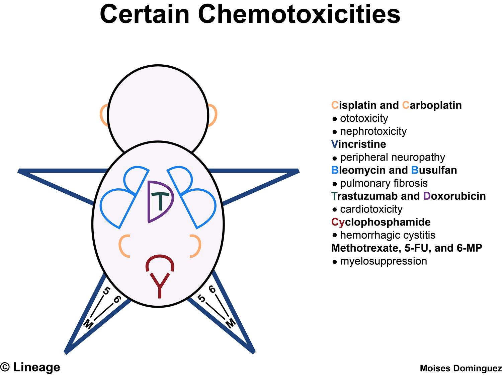

# 易混淆與相反規則整理

> 只放「跨章會混、方向會反、選項唯一例外」；完整病程留在主筆記。格式盡量用一句話＋cf. 對照。

## 標籤慣例

- 用藥/處置句要先標方向：疾病/診斷底下的治療用 `Tx＝`；藥物底下的適應症/常考用途用 `Ind＝`，抗生素抗菌範圍用 `Coverage＝`。其他常用標籤：`SE＝`副作用/毒性、`C/I＝`禁忌藥物或情境（原因放括號）、`Risk＝`併發症或高風險情境、`Dx＝`診斷用途、`f/u＝`追蹤用途、`PK＝`藥物排除/代謝、`MOA＝`作用機轉、`interaction＝`交互作用、`Safety＝`特殊族群可用性。看到藥名但沒標方向時，優先補標籤，防止把副作用誤記成適應症。

## 影像與檢查徵象

### Bubble / Halo sign

| 名稱                            | 先想到                                                  | 快速分法                                              |
| ----------------------------- | ---------------------------------------------------- | ------------------------------------------------- |
| Double bubble sign（雙泡徵，X ray） | Duodenal atresia/obstruction（十二指腸閉鎖/阻塞）              | 胃＋十二指腸近端兩個氣泡。                                     |
| Triple bubble sign            | Jejunal atresia（空腸閉鎖）                                | 胃、十二指腸、空腸氣體積聚；不要和雙泡徵混。                            |
| Double halo sign（雙暈徵，CT）      | Lupus enteritis / mesenteric vasculitis（狼瘡腸炎/腸繫膜血管炎） | 腸壁水腫分層；也會被寫成 target sign，不是十二指腸阻塞的 double bubble。 |

### Target sign / Bull's-eye sign

先看器官與影像，不要只背名字。

Lyme dx Erythema Chronicum Migrans/Borrelia burgdorferi硬蜱遊走性紅斑也長得像靶狀。

| 場景                                                                               | 先想到                                                                             | 快速分法                                                                                                                                                           |
| -------------------------------------------------------------------------------- | ------------------------------------------------------------------------------- | -------------------------------------------------------------------------------------------------------------------------------------------------------------- |
| Skin target lesion                                                               | Erythema multiforme（多形性紅斑） by herpes simplex virus（HSV；單純疱疹病毒）或 Mycoplasma（黴漿菌） | 典型三層 target/iris lesion，多在四肢伸側；不是所有 bull's-eye rash 都等於 EM。                                                                                                    |
| 小兒腹痛/果醬便，US/CT                                                                   | Intussusception（腸套疊）                                                            | Bowel-within-bowel＝target/doughnut；橫切面最像靶。                                                                                                                     |
| 嬰兒非膽汁噴射吐，US                                                                      | Hypertrophic pyloric stenosis（肥厚性幽門狹窄）                                          | Thick pyloric muscle 橫切面像 target/donut；仍要看 muscle thickness/length。                                                                                            |
| 增厚腸壁 CT                                                                          | Double halo / target sign                                                       | 腸壁分層＝submucosal edema/hemorrhage；可見於 inflammatory bowel disease（IBD；發炎性腸病）、ischemia、infectious enteritis、lupus enteritis / mesenteric vasculitis（狼瘡腸炎/腸繫膜血管炎）。 |
| Systemic lupus erythematosus（SLE；全身性紅斑狼瘡）腹痛                                      | Double halo / target sign                                                       | 連到 lupus enteritis / mesenteric vasculitis；不要把「target」只背成皮膚。                                                                                                   |
| Acquired immunodeficiency syndrome（AIDS；後天免疫缺乏症） ring-enhancing brain lesion，MRI | Eccentric target sign                                                           | 散發先想 cerebral toxoplasmosis（腦弓漿蟲）；cf. 單顆/深部/periventricular＝central nervous system lymphoma（CNS lymphoma；中樞神經淋巴瘤）。                                             |
| Peripheral nerve/soft tissue MRI                                                 | Neurofibroma / benign peripheral nerve sheath tumor（良性周邊神經鞘瘤）                   | T2 central low＋peripheral high；不是皮膚多形性紅斑。                                                                                                                      |
| Liver target/bull's-eye lesion                                                   | Metastasis 或 abscess                                                            | Abscess 可 double-target/cluster/gas；metastasis 常多發，靠感染 vs 癌症情境分。                                                                                               |

### Coffee bean

| 名稱                     | 場景    | 快速分法                                                                        |
| ---------------------- | ----- | --------------------------------------------------------------------------- |
| Coffee bean sign（咖啡豆徵） | X ray | Sigmoid volvulus（乙狀結腸扭轉；成因=老人、懷孕、高纖維飲食（過猶不及）、長期便秘）。 c.f 盲腸扭轉=KUB Coma shape |
| Coffee-bean nuclei     | 病理    | Granulosa cell tumor（顆粒細胞瘤）。                                                |

### Corkscrew sign

先看器官與影像。

| 場景                                             | 先想到                                        | 快速分法                                                               |
| ---------------------------------------------- | ------------------------------------------ | ------------------------------------------------------------------ |
| Barium swallow / esophagram（鋇劑吞嚥攝影）            | Diffuse/distal esophageal spasm（瀰漫/遠端食道痙攣） | 多發同步非推進收縮，corkscrew/rosary-bead esophagus；cf. achalasia＝bird-beak。 |
| Upper GI series：duodenum/proximal jejunum 螺旋   | Midgut volvulus（中腸扭轉） from malrotation     | 嬰兒膽汁性嘔吐/急腹症；US/CT 可見 whirlpool sign。                               |
| Scrotal Doppler US：spermatic cord 扭在 testis 上方 | Testicular torsion（睪丸扭轉）                   | Twisted cord＝corkscrew/whirlpool；早期/部分扭轉仍可能有血流。                    |
| Pelvic Doppler US/CT：twisted vascular pedicle  | Ovarian/adnexal torsion（卵巢/附件扭轉）           | Pedicle 像 whirlpool/corkscrew；配急性單側疼痛＋ovarian enlargement。         |

### Beading / string of beads（串珠狀）

先看器官：肋骨、腎動脈、膽管、食道各代表不同疾病。

| 串珠位置/影像                           | 先想到                                           | 快速分法                                                                       |
| --------------------------------- | --------------------------------------------- | -------------------------------------------------------------------------- |
| Rib costochondral junction（肋軟骨交界） | Rickets（佝僂症）                                  | Rachitic rosary（肋骨串珠）；兒童＋bowed legs/widening wrists/維生素 D 或磷酸鹽問題。          |
| Renal artery（腎動脈）                 | Fibromuscular dysplasia（FMD；肌纖維發育不全）          | String of beads＝狹窄與擴張交替；年輕/中年女＋次發性高血壓、abdominal bruit。                     |
| Bile ducts（膽管，MRCP/ERCP）          | Primary sclerosing cholangitis（PSC；原發性硬化性膽管炎） | Multifocal strictures＋dilatation＝beading；常連 ulcerative colitis（UC；潰瘍性結腸炎）。 |
| Esophagus（食道，barium swallow）      | Diffuse/distal esophageal spasm（瀰漫/遠端食道痙攣）    | Rosary-bead/corkscrew esophagus；胸痛＋吞嚥困難，cf. achalasia＝bird-beak。           |

### Marcus Gunn

| 名稱                            | 先想到                                               | 快速分法             |
| ----------------------------- | ------------------------------------------------- | ---------------- |
| Marcus Gunn syndrome（下頷瞬目症候群） | Jaw-winking ptosis                                | 咀嚼/張口會帶動眼瞼。      |
| Marcus Gunn pupil             | Relative afferent pupillary defect（RAPD；相對傳入瞳孔缺損） | 視網膜/視神經傳入路徑病變線索。 |

### Light-near dissociation

光近反射分離＝對光差，但看近會縮。

| 名稱                     | 瞳孔/定位                            | 快速分法                          |
| ---------------------- | -------------------------------- | ----------------------------- |
| Argyll Robertson pupil | Neurosyphilis（神經性梅毒）             | 小瞳孔；light-near dissociation。  |
| Adie tonic pupil       | 年輕女、平時大瞳孔                        | 副交感神經節後纖維受損；縮小後恢復慢。           |
| Parinaud syndrome      | Pineal/dorsal midbrain（松果區/背側中腦） | 松果區腫瘤壓迫背側中腦；上視麻痺/上視失敗後會聚後縮眼震。 |

### Horner syndrome

- Horner syndrome（霍納症候群）：ptosis＋miosis＋anhidrosis（眼瞼下垂＋縮瞳＋無汗），純交感侵犯；可見 Pancoast tumor、neuroblastoma、brainstem stroke、internal carotid artery（ICA；內頸動脈） lesion。

### Charcot / Courvoisier

| 名稱                              | 先想到                                              | 快速分法                                                                                                                |
| ------------------------------- | ------------------------------------------------ | ------------------------------------------------------------------------------------------------------------------- |
| Charcot triad（夏科三徵）             | Acute cholangitis（急性膽管炎）                         | Fever＋right upper quadrant pain（RUQ pain；右上腹痛）＋jaundice；Reynolds pentad＝再加 shock＋altered mental status（AMS；意識狀態改變）。 |
| Courvoisier sign（庫瓦西耶徵）         | Pancreatic/periampullary malignancy（胰臟/壺腹周圍惡性腫瘤） | 無痛性黃疸＋可摸到膽囊。                                                                                                        |
| Charcot-Leyden crystals（夏科萊登結晶） | Eosinophil（嗜酸性球）分解產物                             | 見 allergic fungal rhinosinusitis（過敏性黴菌性鼻竇炎）/氣喘等。                                                                    |

### Kocher / Kerley / Kernig

| 名稱            | 類別      | 快速分法          |
| ------------- | ------- | ------------- |
| Kocher        | 外科方法    | 膽囊切口或胰十二指腸游離。 |
| Kerley B line | X 光影像   | 肺水腫間質線。       |
| Kernig        | 神經學理學檢查 | 腦膜刺激徵。        |

### Hutchinson

| 名稱                   | 先想到                                 | 快速分法                                                               |
| -------------------- | ----------------------------------- | ------------------------------------------------------------------ |
| Hutchinson sign      | Herpes zoster ophthalmicus（眼帶狀疱疹）風險 | 鼻尖水疱/皮疹＝varicella-zoster virus（VZV；水痘帶狀疱疹病毒）侵犯 nasociliary branch。 |
| Hutchinson nail sign | Subungual melanoma（甲下黑色素瘤）          | 甲黑線延伸到甲周/近端甲皺襞。                                                    |

### Keyboard / Piano key sign

| 位置                               | 先想到                                                                                                         | 快速分法                                                      |
| -------------------------------- | ----------------------------------------------------------------------------------------------------------- | --------------------------------------------------------- |
| Shoulder                         | Acromioclavicular joint（AC joint；肩鎖關節） separation/dislocation                                               | 壓 distal clavicle 會下沉，放開彈回。                               |
| Wrist                            | Distal radioulnar joint（DRUJ；遠端橈尺關節） instability / triangular fibrocartilage complex（TFCC；三角纖維軟骨複合體） injury | 壓突出的 ulnar head 會像琴鍵彈動。                                   |
| Urinary tract keyhole sign（鑰匙孔徵） | Posterior urethral valve（PUV；後尿道瓣膜）                                                                         | 產前/新生兒影像見膀胱＋後尿道擴張，常合併雙側 hydronephrosis；不是 piano key sign。 |
| keyboard sign                    | 小腸阻塞時小腸褶皺被分開。                                                                                               |                                                           |

### Calcification pattern

先問時間點：治療前原本的 microcalcification/psammoma body 多是診斷線索；治療後新出現鈣化常代表壞死/纖維化/修復，可支持治療反應，但仍要合併腫瘤大小、活性與臨床。

| 鈣化型態                            | 先想到                                                                                            |
| ------------------------------- | ---------------------------------------------------------------------------------------------- |
| Popcorn（爆米花狀/coarse）            | 子宮肌瘤（骨盆）、fibroadenoma（乳房纖維腺瘤）、pulmonary hamartoma（肺過誤瘤）；多偏良性/退化。                               |
| Psammomatous（沙粒狀/psammoma body） | Serous ovarian carcinoma（漿液性卵巢癌）；也可見 papillary thyroid carcinoma（乳突甲狀腺癌）/meningioma（腦膜瘤），先看器官。 |
| 牙齒/骨骼/脂肪                        | Mature cystic teratoma / dermoid cyst（成熟囊性畸胎瘤/皮樣囊腫）。                                           |
| 線狀/無定形                          | 放射治療後 dystrophic calcification（營養不良性鈣化）；屬於營養不良壞死，不等於復發。                                        |

治療後新鈣化：多偏反應/修復。

| 情境                                            | 快速判讀                 |
| --------------------------------------------- | -------------------- |
| Colorectal cancer liver metastasis（大腸癌肝轉移）化療後 | 新鈣化可代表治療反應，不要直接當惡化。  |
| Lymphoma（淋巴瘤）治療後殘餘腫塊                          | 殘餘鈣化可為纖維化/壞死。        |
| Osteosarcoma（骨肉瘤）化療後                          | 礦化增加可提示反應；但仍看大小/壞死率。 |
| Neuroblastoma（神經母細胞瘤）治療後                      | 鈣化/成熟化可見，偏治療後變化。     |

治療前原本鈣化：多是腫瘤特性/診斷線索，不等於治療成功。

| 情境                                                           | 快速判讀                         |
| ------------------------------------------------------------ | ---------------------------- |
| Breast clustered pleomorphic microcalcifications（乳房群聚多形性微鈣化） | 懷疑 DCIS/乳癌。                  |
| Papillary thyroid carcinoma / serous ovarian carcinoma       | Psammoma body 是惡性診斷線索之一。     |
| Meningioma / oligodendroglioma                               | 腫瘤常見鈣化特性，不直接代表好壞。            |
| Pulmonary hamartoma                                          | Popcorn calcification 偏良性線索。 |
| Mature teratoma                                              | 牙齒/骨頭/脂肪＝成熟組織成分。             |

### 核醫 Tracer

| 檢查                  | Tracer / 機轉                                        | 快速判斷                                                                                     |
| ------------------- | -------------------------------------------------- | ---------------------------------------------------------------------------------------- |
| Meckel scan         | Technetium-99m pertechnetate（Tc-99m pertechnetate） | 被胃黏膜分泌細胞攝取，抓異位胃黏膜；不是直接抓憩室本身。                                                             |
| Bone scan           | Technetium-99m methylene diphosphonate（Tc-99m MDP） | 骨表面沉積，反映 osteoblastic activity（骨母細胞活性）/血流；lytic lesion 如 multiple myeloma（MM；多發性骨髓瘤）可不亮。 |
| HIDA scan           | Tc-99m iminodiacetic acid 類（Tc-99m IDA 類）          | 肝細胞攝取後經膽汁排泄，看 gallbladder（GB；膽囊）/膽道；急性膽囊炎常見 GB 不顯影（膽汁進不去 GB）。                            |
| PET                 | Fluorine-18 fluorodeoxyglucose（18F-FDG）            | 葡萄糖代謝高就亮；腫瘤常亮但發炎/感染也可亮，非癌症專一。                                                            |
| Thyroid scan/uptake | Iodine-123 / iodine-131（I-123/I-131）               | 甲狀腺攝碘功能；I-123 偏診斷，I-131 可用於治療/全身追蹤。                                                      |

## 解剖與定位

### 外科解剖 Landmark

| Landmark                             | 邊界 / 位置                                                                                                 | 內容物 / 考點                                                                                                                                  |
| ------------------------------------ | ------------------------------------------------------------------------------------------------------- | ----------------------------------------------------------------------------------------------------------------------------------------- |
| Calot / hepatocystic triangle        | Modern＝cystic duct（膽囊管）＋common hepatic duct（總肝管）＋肝下緣；classic Calot 把肝下緣換成 cystic artery（膽囊動脈）           | 內有 cystic artery、Lund node；膽囊切除要做 critical view of safety，避免把 common bile duct（CBD；總膽管）/common hepatic duct（CHD；總肝管）誤剪。                   |
| Hepatoduodenal ligament/portal triad | 肝十二指腸韌帶內                                                                                                | CBD、proper hepatic artery（肝固有動脈）、portal vein（門靜脈）；Pringle maneuver 夾這裡。若仍出血，想 hepatic vein/inferior vena cava（IVC；下腔靜脈）。                  |
| Foramen of Winslow（omental foramen）  | 前＝Hepatoduodenal ligament、後＝IVC、上＝caudate lobe、下＝duodenum 第 1 段                                         | Lesser sac 入口；手指進去可壓 hepatoduodenal ligament 做 Pringle maneuver。                                                                          |
| Deep inguinal ring                   | Inferior epigastric vessels（下腹壁血管）外側                                                                    | Indirect inguinal hernia（間接型腹股溝疝氣）從 deep ring 進 inguinal canal；位於 inferior epigastric vessels 外側。                                         |
| Femoral triangle                     | 上＝inguinal ligament、外＝sartorius、內＝adductor longus                                                       | 內容物外到內＝NAVEL：nerve、artery、vein、empty space/femoral canal、lymphatics。                                                                      |
| Femoral ring/canal                   | Ring 邊界：前/上＝inguinal ligament、後/下＝pectineal ligament/pectineus fascia、內＝lacunar ligament、外＝femoral vein | Canal＝NAVEL 的 E，位於 femoral vein 內側；hernia 走 ring→canal→saphenous opening，表面在 inguinal ligament 下、pubic tubercle 外下方；女多，strangulation 風險高。 |
| Laparoscopic hernia triangle of doom | Vas deferens 與 gonadal vessels 之間                                                                       | 內有 external iliac vessels（外髂血管）；腹腔鏡疝氣修補避免 tack/釘針。                                                                                        |
| Laparoscopic hernia triangle of pain | Gonadal vessels 外側、iliopubic tract 下方                                                                   | 內有 femoral nerve、lateral femoral cutaneous nerve、genitofemoral nerve 分支；避免神經痛。                                                            |
| McBurney point                       | Umbilicus 到右 anterior superior iliac spine（ASIS；前上髂棘）連線外 1/3 處                                          | Appendix（闌尾）常見壓痛點；Lanz point 偏兩 ASIS 連線右 1/3，闌尾位置非典型時壓痛可不典型。                                                                              |
| Chest tube triangle of safety        | 前＝pectoralis major 外緣、後＝latissimus dorsi 前緣、下＝第 5 肋間/乳頭線、上＝腋窩                                           | 胸管較安全插入區；通常走肋骨上緣，避免肋間血管神經束。                                                                                                               |

### 外科解剖圖譜

| Hepatocystic / Calot                                                                   | Pringle maneuver                                     | Hesselbach triangle                                       |
| -------------------------------------------------------------------------------------- | ---------------------------------------------------- | --------------------------------------------------------- |
|  |  |  |
| 分 modern hepatocystic triangle vs classic Calot                                        | 夾 hepatoduodenal ligament 控制 portal triad 流入血        | Direct hernia 通過；inferior epigastric vessels 內側。          |

| Femoral triangle / hernia                                                             | Laparoscopic hernia triangles                                                  | Chest tube triangle of safety                                                 |
| ------------------------------------------------------------------------------------- | ------------------------------------------------------------------------------ | ----------------------------------------------------------------------------- |
|  |  |  |
| 對照 NAVEL、saphenous opening 與股疝突出路徑                                                    | Direct/indirect/femoral hernia、triangle of doom / pain                         | 胸管安全三角。                                                                       |

### 血管與解剖名稱

| 名稱                                                                                                                   | 不要混成                                                                             | 快速分法                                                                                                                                                                                                                                                                                                                                                                                                                                                                                                                                                                                                                   |
| -------------------------------------------------------------------------------------------------------------------- | -------------------------------------------------------------------------------- | ---------------------------------------------------------------------------------------------------------------------------------------------------------------------------------------------------------------------------------------------------------------------------------------------------------------------------------------------------------------------------------------------------------------------------------------------------------------------------------------------------------------------------------------------------------------------------------------------------------------------- |
| Coronary vein（胃冠狀靜脈） vs short gastric veins                                                                          | 腹部語境 coronary vein 不是短胃靜脈                                                        | Coronary vein 舊名多指 left gastric vein（左胃靜脈）：胃小彎/食道下端→portal vein；門脈高壓時和 esophageal veins 形成側枝，esophageal veins 再回 azygos vein（奇靜脈）。Short gastric veins＝胃底→splenic vein（脾靜脈）。                                                                                                                                                                                                                                                                                                                                                                                                                                            |
| Cardiac coronary veins vs coronary sinus                                                                             | 心臟 coronary vein 不是 coronary sinus 本身                                            | Great/middle/small cardiac veins 等是心臟靜脈；coronary sinus 是後方 atrioventricular groove（AV groove；房室溝）的大靜脈通道，收集多數心臟靜脈後開口到右心房。                                                                                                                                                                                                                                                                                                                                                                                                                                                                                               |
| Anterior cardiac veins / Thebesian veins                                                                             | 不一定進 coronary sinus                                                              | Anterior cardiac veins 多直接進右心房；Thebesian/smallest cardiac veins 直接進心腔，是少量生理性 right-to-left shunt（右向左分流）來源。                                                                                                                                                                                                                                                                                                                                                                                                                                                                                                             |
| Aortic sinus vs coronary sinus                                                                                       | 都叫 sinus，但一動一靜                                                                   | Aortic sinus 在主動脈根部瓣膜後方，左右冠狀動脈從 left/right aortic sinus 出；coronary sinus 是心臟靜脈回流到 right atrium（RA；右心房）。                                                                                                                                                                                                                                                                                                                                                                                                                                                                                                                |
| Carotid sinus vs carotid body vs cavernous sinus                                                                     | Sinus/body 不是同一功能                                                                | Carotid sinus＝頸動脈分叉 baroreceptor（壓力受器）；carotid body＝chemoreceptor（化學受器）；cavernous sinus＝顱內硬腦膜靜脈竇，內有 ICA/cranial nerve VI（CN6；第六對腦神經），側壁有 CN3/4/V1/V2。                                                                                                                                                                                                                                                                                                                                                                                                                                                                  |
| Pulmonary artery/vein vs bronchial artery/vein                                                                       | 肺循環 vs 支氣管營養血流                                                                   | Pulmonary artery 帶低氧血去肺泡氣體交換，pulmonary veins 帶高氧血回 left atrium（LA；左心房）；bronchial arteries 來自 systemic circulation 供應支氣管/肺支架組織。                                                                                                                                                                                                                                                                                                                                                                                                                                                                                         |
| Hepatic portal vein vs hepatic vein                                                                                  | 入肝 vs 出肝                                                                         | Portal vein＝superior mesenteric vein（SMV；上腸繫膜靜脈）＋splenic vein，帶腸胃血進肝；hepatic veins 把肝血排到 IVC。Pringle maneuver 夾 portal triad，不夾 hepatic veins。                                                                                                                                                                                                                                                                                                                                                                                                                                                                         |
| Portal triad vs porta hepatis                                                                                        | 結構內容 vs 肝門位置                                                                     | Portal triad＝portal vein＋proper hepatic artery＋CBD；porta hepatis 是肝門，還有淋巴/神經等結構進出。                                                                                                                                                                                                                                                                                                                                                                                                                                                                                                                                     |
| Internal carotid artery vs external carotid artery                                                                   | 頸部有沒有分支                                                                          | ICA 頸部沒有分支、進顱供腦/眼；external carotid artery（ECA；外頸動脈）在頸部分支供臉頭頸（superficial temporal、facial、maxillary 等）。                                                                                                                                                                                                                                                                                                                                                                                                                                                                                                                 |
| Internal jugular vein vs external jugular vein                                                                       | 深部主幹 vs 表淺靜脈                                                                     | Internal jugular vein（IJV；內頸靜脈）深部伴 carotid sheath，收腦顱內血；external jugular vein（EJV；外頸靜脈）表淺跨 sternocleidomastoid（SCM；胸鎖乳突肌），收頭皮/臉部表淺血，最後進 subclavian vein。                                                                                                                                                                                                                                                                                                                                                                                                                                                               |
| Inferior epigastric vessels                                                                                          | Direct/indirect hernia 定位線                                                       | Direct hernia 在 inferior epigastric vessels 內側、Hesselbach triangle；indirect hernia 在外側，從 deep inguinal ring 進。                                                                                                                                                                                                                                                                                                                                                                                                                                                                                                         |
| Abdominal aorta / external iliac artery（外髂動脈）來源，cf. 內髂                                                               | 不要把 gonadal/rectal/sacral 血管接到外髂                                                 | 腹主動脈直接/間接：ovarian/testicular artery＝腹主動脈直接供卵巢/睪丸；superior rectal artery＝inferior mesenteric artery（IMA；下腸繫膜動脈）終末支供直腸上段；median sacral artery＝aortic bifurcation 附近後方出、走骶骨前。外髂動脈主要記 inferior epigastric artery、deep circumflex iliac artery，過 inguinal ligament 後變 femoral artery。                                                                                                                                                                                                                                                                                                                                       |
| May-Thurner syndrome vs left varicocele vs UPJ obstruction vs SCFE vs left RLN injury                                | 都是左側偏好/左側較易受影響，但系統/機轉不同（補：巧克力囊腫也是左側多，成因不明）                                       | May-Thurner（孕婦左下肢 deep vein thrombosis〔DVT；深部靜脈栓塞〕常考）＝right common iliac artery 壓 left common iliac vein→左下肢靜脈回流差；left varicocele＝left testicular vein 先垂直入 left renal vein，右 testicular vein 多直接入 inferior vena cava（IVC；下腔靜脈）→左精索靜脈壓較高；nutcracker effect＝superior mesenteric artery（SMA；上腸繫膜動脈）/aorta 夾 left renal vein→左腎靜脈壓↑，可左側血尿＋left varicocele；UPJ obstruction（ureteropelvic junction obstruction，輸尿管腎盂接口處阻塞）＝男、左腎為主，是泌尿道接口阻塞；SCFE（slipped capital femoral epiphysis，股骨頭骨骺滑脫症）＝肥胖男孩、左側為主，是骨科髖部骨骺滑脫；left recurrent laryngeal nerve（left RLN；左喉返神經）＝繞 aortic arch（主動脈弓）後上行，路徑較長，較易被胸腔/縱膈/甲狀腺手術或腫瘤傷到，表現聲音沙啞/聲帶麻痺。 |
| Great saphenous vein vs small saphenous vein vs saphenous nerve                                                      | 名字都 saphenous，但走向不同                                                              | Great saphenous＝內側腿，進 femoral vein；small saphenous＝後小腿，進 popliteal vein；saphenous nerve＝femoral nerve 感覺分支，內側腿皮膚感覺。                                                                                                                                                                                                                                                                                                                                                                                                                                                                                                    |
| Profunda femoris / medial circumflex femoral artery                                                                  | Femoral artery 主幹不要直接等同                                                          | Profunda femoris＝deep femoral artery；medial circumflex femoral artery 常由 profunda 出，供 femoral head，股骨頸骨折怕傷它造成 avascular necrosis（AVN；缺血性壞死）。                                                                                                                                                                                                                                                                                                                                                                                                                                                                           |
| Middle meningeal artery vs middle cerebral artery                                                                    | 都 middle，但病完全不同                                                                  | Middle meningeal artery 破裂＝temporal bone fracture 後 epidural hematoma（EDH；硬膜外血腫）；middle cerebral artery（MCA；中大腦動脈）阻塞＝對側臉手無力/感覺＋aphasia（失語）或 neglect（忽略）。                                                                                                                                                                                                                                                                                                                                                                                                                                                               |
| Anterior inferior cerebellar artery（AICA）/posterior inferior cerebellar artery（PICA）/Superior cerebellar artery（SCA） | AICA、PICA、SCA 都屬 posterior circulation；AICA/PICA 常造成 lateral brainstem syndrome。 | AICA＝lateral pontine，常有 facial weakness、聽力/前庭症狀；PICA＝lateral medullary；常有 Wallenberg syndrome（延髓外側症候群；包含nucleus ambiguus 症狀（dysphagia/hoarseness；吞嚥困難/聲音沙啞）；SCA＝常有ataxia、dysarthria、vertigo；可因血管壓迫造成 trigeminal neuralgia。                                                                                                                                                                                                                                                                                                                                                                                             |

### 鼻竇與唾液腺之最

| 系統                                 | 之最                                                                                              | 快速分法                                        |
| ---------------------------------- | ----------------------------------------------------------------------------------------------- | ------------------------------------------- |
| Paranasal sinus（副鼻竇）               | Maxillary sinus（上頜竇）＝鼻竇炎/感染最常見                                                                  | 上頜竇開口位置高、引流差；題目問鼻竇炎最常見定位先選上頜竇。              |
| Salivary stone（sialolithiasis，唾石症） | Submandibular gland/Wharton's duct（下頷腺/華頓氏管）＝結石最常見；sublingual/minor salivary gland（舌下腺/小唾液腺）＝少見 | Wharton's duct 長、向上開口、唾液較黏；下頷腺＝石頭之最，不是腫瘤之最。 |
| Salivary gland tumor（唾液腺腫瘤）        | Parotid gland（腮腺）＝腫瘤最常見且多良性；sublingual/minor salivary gland＝較少但惡性比例高                            | 規則＝腺體越大，腫瘤越常見但越良性；腺體越小，越少見但越惡性。             |

### 神經定位：上肢重 vs 下肢重

| 分布      | 常見定位                                                                                                                                                                                                                                                                              | 快速分法                                                                            |
| ------- | --------------------------------------------------------------------------------------------------------------------------------------------------------------------------------------------------------------------------------------------------------------------------------- | ------------------------------------------------------------------------------- |
| 下肢 > 上肢 | Anterior cerebral artery（ACA；前大腦動脈） stroke、cerebral palsy spastic diplegia / periventricular leukomalacia（PVL；腦室周圍白質軟化）、thoracic cord lesion、lumbar stenosis/cauda equina（馬尾症候群）、hereditary spastic paraplegia、early Guillain-Barre syndrome（GBS；格林-巴利症候群）、Lambert-Eaton syndrome | 腦部＝內側運動皮質偏腿；早產兒 PVL 常影響下肢皮質脊髓徑；胸髓以下/腰薦根自然偏下肢；GBS 早期常 ascending weakness（上行性無力）。 |
| 上肢 > 下肢 | MCA stroke、central cord syndrome（中央脊髓症候群）、brachial plexopathy、cervical radiculopathy/myelopathy、部分 amyotrophic lateral sclerosis（ALS；肌萎縮性側索硬化症）或 multifocal motor neuropathy（MMN；多灶性運動神經病變）                                                                                       | 腦部＝外側運動皮質偏臉/手；頸髓中央病灶上肢纖維較受影響；臂神經叢/頸神經根自然偏上肢。                                    |
| 下肢 = 上肢 | Quadriplegia四肢麻痺型 Cerebral palsy（上肢屈曲下肢伸張）                                                                                                                                                                                                                                        |                                                                                 |

- 易混：GBS 的「遠端先」是周邊神經病變（遠端下肢先→近端上行），不是 primary myopathy（原發肌肉病）；MD（myotonic dystrophy，肌強直性失養症）則是肌肉病變中少數遠端手部先。DMD/BMD 多為近端先。
- central cord syndrome＝Center+Chin hit（伸展台頭）+Can't move hands+Commonly in elderly

| 無力方向            | 先想到                                   | 快速分法                                         |
| --------------- | ------------------------------------- | -------------------------------------------- |
| Ascending（上行）   | Guillain-Barre syndrome（GBS；格林-巴利症候群） | 周邊神經去髓鞘；遠端下肢/腳先無力→近端上行，自主神經損傷，反射下降/消失，可呼吸衰竭。 |
| Fatigable（越用越弱） | Myasthenia gravis（MG；重症肌無力）           | 神經肌肉接合處；眼肌/口咽/近端肌易疲勞，休息改善；不是 ascending。      |
| Descending（下行）  | Botulism（肉毒桿菌中毒）                      | 神經肌肉接合處；先腦神經/眼口（複視、瞳大、口乾、吞嚥困難）→四肢→呼吸。        |

### 中樞去髓鞘：MS / NMO / ADEM

縮寫陷阱：這組第三個是 ADEM，不要寫 AD；AD 在筆記常指 Alzheimer's disease（阿茲海默症）或 autosomal dominant（體染色體顯性）。

| 疾病                                                                     | 抓法                  | Exam/影像                                                 | 易混點                                                            |
| ---------------------------------------------------------------------- | ------------------- | ------------------------------------------------------- | -------------------------------------------------------------- |
| Multiple sclerosis（MS，多發性硬化症）                                          | 年輕/中年女；時間＋空間多發，反覆發作 | CSF oligoclonal band（寡克隆帶）；MRI 腦室旁（periventricular）病灶   | 脊髓病灶多 <3 節，視神經常單側；急性 Tx＝steroid，維持可用 interferon（干擾素）。          |
| Neuromyelitis optica spectrum disorder（NMOSD/NMO，Devic disease，視神經脊髓炎） | 抗 AQP4 抗體；視神經＋脊髓為主  | AQP4-IgG/NMO-IgG；脊髓長節段 >3 節，延髓 area postrema（最後區）可打嗝/嘔吐 | 視神經炎常雙側/嚴重，預後比 MS 差；Tx＝steroid/plasma exchange，維持常考 rituximab。 |
| Acute disseminated encephalomyelitis（ADEM，急性播散性腦脊髓炎）                   | 兒青，感染/疫苗後；急性單次發作    | MRI 多灶白質病灶；常有發燒、頭痛、譫妄/encephalopathy（腦病變/意識改變）          | 像 MS 但偏小孩、單相病程、全身/意識症狀明顯；Tx＝steroid，年紀小預後佳。                    |

## 疾病名稱與分類

### 同字必綁器官/情境

| 詞 / alias                            | 不要互套的定位                                                                                                                                                                                                                                                                                                           |
| ------------------------------------ | ----------------------------------------------------------------------------------------------------------------------------------------------------------------------------------------------------------------------------------------------------------------------------------------------------------------- |
| Clear cell（透明細胞）                     | 一定加器官：clear cell renal cell carcinoma（RCC，透明細胞腎細胞癌）＝腎癌常見 subtype；ovarian clear cell＝type I（低惡性、常與 endometriosis 子宮內膜異位症相關、化療反應較差）；endometrial clear cell＝type II（non-estrogen-related、高 grade、預後差）。                                                                                                               |
| Anti-Mullerian hormone（AMH，抗穆勒氏管荷爾蒙） | androgen insensitivity syndrome（AIS，雄性素不敏感症）裡是 Sertoli cell 讓 Mullerian duct 退化； 不孕裡是 ovarian reserve（卵巢庫存）。                                                                                                                                                                                                      |
| Hernia                               | External hernia（腹壁疝氣）＝經腹壁/腹股溝缺損往外突出，通常可摸到外部腫塊；Inguinoscrotal hernia（股溝/陰囊疝氣，aka睪丸疝氣，是一種腹壁疝氣）＝腸子或網膜經 inguinal canal 掉到陰囊；Internal hernia（內部疝氣）＝腸管鑽入腹腔內孔洞/腸繫膜缺損，外表通常無腫塊，考小腸阻塞/strangulation；paraduodenal hernia＝1st，transmesenteric hernia（腸繫膜裂孔疝氣）因 Roux-en-Y gastric bypass（胃繞道手術）變常見。                            |
| Paget disease                        | 一定加器官：Paget disease of bone（Paget 骨病）＝骨代謝/remodeling 疾病，本身不是癌；癌症關係＝少數可併 osteosarcoma（骨肉瘤），老人 osteosarcoma RF。Paget disease of breast/vulva（乳房/外陰佩吉特病）＝皮膚/上皮內腺癌表現；乳頭濕疹樣病灶常代表 underlying ductal carcinoma in situ（DCIS，乳管原位癌）或 invasive breast carcinoma，外陰 Paget 多為 intraepithelial adenocarcinoma（上皮內腺癌）且通常非 HPV。 |

### Rose 相關病名/徵象

看到 rose 先分「小兒病毒疹、皮膚慢性發炎、傷寒徵象、真菌外傷、梅毒二期」，不要只背玫瑰兩字。

| 名稱/線索                                              | 真正定位                                         | 快速分法                                                        |
| -------------------------------------------------- | -------------------------------------------- | ----------------------------------------------------------- |
| Roseola infantum / exanthem subitum（嬰兒玫瑰疹/突發疹，第六病） | HHV-6/7；小兒感染                                 | 3-5 天高燒後退燒才出疹；可熱痙攣；Nagayama spots 可見。                       |
| Pityriasis rosea（玫瑰糠疹）                             | 自限性皮膚病，可能與 HHV-6/7 相關                        | 無燒或症狀輕；先 herald patch，後胸背 Christmas tree pattern；不是幼兒高燒後疹。  |
| Rosacea（酒糟/玫瑰痤瘡）                                   | 成人臉部慢性發炎                                     | 臉中央潮紅、telangiectasia、papulopustule；無 comedone（粉刺）可和 acne 分。 |
| Rose spots（玫瑰斑/玫瑰疹）                                | Typhoid fever（傷寒）by Salmonella typhi         | 發燒＋腹部/軀幹淡紅斑＋relative bradycardia；不是 roseola infantum。       |
| Rose gardener disease                              | Sporotrichosis（孢子絲菌症）by Sporothrix schenckii | 玫瑰刺/園藝外傷後，皮下結節沿 lymphatic spread；Tx 常考 itraconazole。        |
| Secondary syphilis（第二期梅毒）的玫瑰疹                      | Treponema pallidum                           | 全身疹可含手掌腳底，常合併淋巴結；不是 HHV-6 的嬰兒玫瑰疹。                           |
| Erysipelas（丹毒）                                     | 表淺皮膚感染，多 Group A Streptococcus               | 題幹可寫 bright red/rose-red、隆起、邊界清楚；不要跟 rosacea 慢性臉部潮紅混。       |

Pitfall：Rosenmuller fossa（鼻咽癌好發處）與 Rosenmuller valve（淚道）是解剖名，不是 rose 相關疾病。

### Darier sign / Darier disease / Hailey-Hailey

| 名稱                                               | 本質                                                  | 快速分法                                                                                                                   |
| ------------------------------------------------ | --------------------------------------------------- | ---------------------------------------------------------------------------------------------------------------------- |
| Darier sign                                      | Sign，不是 Darier disease                              | 搔抓/摩擦皮損後 urtication（紅腫膨疹）＋搔癢；指向 cutaneous mastocytosis/mastocytoma（肥大細胞去顆粒）。                                           |
| Darier disease（Darier-White disease）             | AD；ATP2A2/SERCA2；hereditary acantholytic dermatosis | 脂漏區 greasy hyperkeratotic papules/plaques、臭、UV/熱惡化；指甲 V-shaped notch；病理＝acantholysis＋dyskeratosis（corps ronds/grains）。 |
| Hailey-Hailey disease（benign familial pemphigus） | AD；ATP2C1；不是 autoimmune pemphigus                   | 對磨處/皺褶反覆糜爛、水泡、裂隙；熱/流汗/摩擦惡化；病理＝suprabasal acantholysis、dilapidated brick wall。                                          |

### Epstein / Ebstein / Pel-Ebstein

| 名稱                      | 快速定位                                                                                        |
| ----------------------- | ------------------------------------------------------------------------------------------- |
| Epstein-Barr virus（EBV） | HHV-4，導致 mono（單核增多症）/NPC（nasopharyngeal carcinoma，鼻咽癌）/Burkitt/HL（Hodgkin lymphoma，霍奇金淋巴瘤）。 |
| Ebstein anomaly         | 先天性三尖瓣下移、右心室變小、可發紺/WPW（Wolff-Parkinson-White syndrome；注意拼字少一個 p）。                           |
| Pel-Ebstein fever       | HL 的週期性發燒（發燒數天後退燒、反覆循環、非極性），不是心臟病。                                                          |

### TGA / TIA

| 名稱                                      | 快速定位                                                                  |
| --------------------------------------- | --------------------------------------------------------------------- |
| TGA（transient global amnesia，暫時性全面失憶）   | 海馬/記憶迴路問題，突然無法形成新記憶＋反覆問同問題；意識清楚、無局灶神經缺損、<24 hr 恢復，通常不用中風二級預防。         |
| TIA（transient ischemic attack，暫時性腦缺血發作） | 局灶腦/脊髓/視網膜缺血（單側無力麻、失語、黑矇等），影像無急性梗塞但屬 stroke warning，要緊急找血管/心臟來源與二級預防。 |

### Chiari / Budd-Chiari

| 名稱                        | 快速定位                                                         |
| ------------------------- | ------------------------------------------------------------ |
| Chiari I                  | 小腦扁桃體下移；青少年/成人，枕頸頭痛、syringomyelia（脊髓空洞）。                     |
| Chiari II / Arnold-Chiari | 小腦＋腦幹/第四腦室下移；常合併 myelomeningocele（脊髓脊膜膨出）/hydrocephalus（水腦）。 |
| Budd-Chiari               | 肝靜脈/IVC（inferior vena cava，下腔靜脈）流出阻塞，多血栓；腹痛＋肝大＋腹水 ± 肝功能異常。   |

### 血栓處置名詞

| 情境                                                  | 用語                                                                                         | 快速定位                                                              |
| --------------------------------------------------- | ------------------------------------------------------------------------------------------ | ----------------------------------------------------------------- |
| 心臟 percutaneous coronary intervention（PCI，經皮冠狀動脈介入） | STEMI（ST-elevation myocardial infarction，ST 段上升型心肌梗塞）的「打通血管」首選 primary PCI；溶栓是 PCI 延遲時的替代。 | 相關指標＝ECG、troponin、coronary angiography。                           |
| 腦 endovascular thrombectomy（EVT，血管內取栓）              | EVT/取栓只用於 large vessel occlusion（LVO；ICA/M1/M2 等大血管阻塞），小血管 lacunar 不適用。                    | 相關指標＝DAWN/DEFUSE-3、penumbra/mismatch、CT/MR perfusion（找 penumbra）。 |

### Type I / Type II 沒有跨章通用方向

| 疾病                                   | 分類判斷                                                                                                         |
| ------------------------------------ | ------------------------------------------------------------------------------------------------------------ |
| Schizophrenia（思覺失調症）                 | Type I＝正向症狀、預後較好；Type II＝負向症狀、預後較差。                                                                          |
| Bipolar disorder（雙相情緒障礙）             | I＝mania；II＝hypomania＋major depressive disorder（MDD，重鬱症）。                                                     |
| 2nd-degree AV block（二度房室傳導阻滯）        | Mobitz I＝Wenckebach；Mobitz II＝突然漏拍、較危險。                                                                      |
| Autoimmune pancreatitis（AIP，自體免疫胰臟炎） | Type 1＝IgG4-related、老男、多器官、易復發；type 2＝非 IgG4、較年輕、常合併 inflammatory bowel disease（IBD）/ulcerative colitis（UC）。 |

### 遺傳模式

| 模式                             | 常見考點                                                                                                                                                                                                                                                                                                                                                                                                                                                                         |
| ------------------------------ | ---------------------------------------------------------------------------------------------------------------------------------------------------------------------------------------------------------------------------------------------------------------------------------------------------------------------------------------------------------------------------------------------------------------------------------------------------------------------------- |
| Autosomal dominant（AD，體染色體顯性）  | Marfan、Ehlers-Danlos、neurofibromatosis type 1（NF1）、von Hippel-Lindau disease（VHL）、Tuberous sclerosis、Huntington、Myotonic dystrophy、autosomal dominant polycystic kidney disease（ADPKD）、multiple endocrine neoplasia（MEN）1/2、familial adenomatous polyposis（FAP）/Gardner、Lynch、Peutz-Jeghers、hypertrophic cardiomyopathy（HCM）、familial hypercholesterolemia、achondroplasia、osteogenesis imperfecta、maturity-onset diabetes of the young（MODY）、Darier、porphyria cutanea tarda。 |
| Autosomal recessive（AR，體染色體隱性） | Cystic fibrosis（CF）、phenylketonuria（PKU）、maple syrup urine disease（MSUD）、galactosemia、Wilson、hemochromatosis、alpha-1 antitrypsin deficiency（不抽煙／年輕人卻COPD）、sickle cell disease、thalassemia、congenital adrenal hyperplasia（CAH）、spinal muscular atrophy（SMA）、autosomal recessive polycystic kidney disease（ARPKD）、leukocyte adhesion deficiency（LAD）、多數 enzyme deficiency/lysosomal storage disease。                                                                           |
| X-linked recessive（X 連鎖隱性）     | Duchenne muscular dystrophy（DMD）/Becker muscular dystrophy、Hemophilia A/B(血友病)、glucose-6-phosphate dehydrogenase（G6PD）deficiency、Bruton agammaglobulinemia、Wiskott-Aldrich、X-linked severe combined immunodeficiency（SCID）、Hunter syndrome、Lesch-Nyhan、androgen insensitivity syndrome（AIS）。                                                                                                                                                                                 |
| X-linked dominant（X 連鎖顯性）      | Fragile X、Alport syndrome 常考 X-linked（也可 AR/AD）、Rett syndrome、hypophosphatemic rickets、incontinentia pigmenti。                                                                                                                                                                                                                                                                                                                                                               |
| Trinucleotide repeat（三核苷酸重複）   | Huntington＝CAG、Fragile X＝CGG、Myotonic dystrophy type 1＝CTG、Friedreich ataxia＝GAA、spinocerebellar ataxia（SCA）＝CAG；anticipation 常見於三核苷酸重複病。                                                                                                                                                                                                                                                                                                                                    |

### Marfan vs homocystinuria（高瘦長肢＋水晶體異位）

同：都可 marfanoid habitus馬凡樣體（高瘦、長肢、arachnodactyly 蜘蛛指）＋ectopia lentis（水晶體異位）。

| 疾病                            | 本質/遺傳                                         | 水晶體    | 最會考差異                                                                                                   |
| ----------------------------- | --------------------------------------------- | ------ | ------------------------------------------------------------------------------------------------------- |
| Marfan syndrome（馬凡氏症候群）       | FBN1/fibrillin-1；AD                           | 上外/上顳側 | Aortic root dilation/dissection（主動脈根擴張/剝離）、MVP、關節鬆；通常智力正常、不是血栓病。                                        |
| Homocystinuria（高胱胺酸尿症/高胱氨酸尿症） | CBS deficiency；AR；可做 pyridoxine（vitamin B6）反應 | 下內/下鼻側 | Thromboembolism（血栓）＋developmental delay/intellectual disability（發展遲緩/智能障礙）＋osteoporosis；看到血栓不要選 Marfan。 |

### 屈光狀態：近視 vs 遠視相關眼病

先用眼軸長短抓方向：近視眼軸長，遠視眼軸短；看到 glaucoma（青光眼）題尤其不要互套。

| 屈光狀態          | 眼球結構直覺      | 較相關疾病/考點                                                                                                                                         | 快速分法                                           |
| ------------- | ----------- | ------------------------------------------------------------------------------------------------------------------------------------------------ | ---------------------------------------------- |
| Myopia（近視）    | 眼軸長、常高度近視   | Rhegmatogenous retinal detachment（裂孔性視網膜剝離）、lattice degeneration（格子狀變性）、primary open-angle glaucoma（POAG；原發性隅角開放型青光眼）、myopic maculopathy/脈絡膜新生血管 | 飛蚊/閃光/黑幕＋高度近視 → 先想視網膜裂孔/剝離；青光眼若寫近視，多偏開角型風險。    |
| Hyperopia（遠視） | 眼軸短、前房淺、房角窄 | Primary angle-closure glaucoma（PACG；原發性隅角閉鎖型青光眼）、acute angle closure attack（急性隅角閉鎖發作）、accommodative esotropia（調節性內斜視）                            | 老年女/亞洲人＋遠視＋眼痛紅眼虹視 → 閉角型；小孩遠視過度調節 → 內斜視，可用眼鏡矯正。 |

### HLA-DR2/3/4/5 常見對應

| HLA | 常見疾病                                                                                                       |
| --- | ---------------------------------------------------------------------------------------------------------- |
| DR2 | Multiple sclerosis（MS）、systemic lupus erythematosus（SLE）、Goodpasture syndrome、narcolepsy（實際常記 DQB1*06:02）。 |
| DR3 | SLE、Graves disease、type 1 diabetes mellitus（T1DM）、myasthenia gravis（MG）。                                   |
| DR4 | Rheumatoid arthritis（RA）、T1DM、pemphigus vulgaris、autoimmune Addison disease。                               |
| DR5 | Hashimoto thyroiditis、pernicious anemia。                                                                   |

陷阱：HLA 只是 association，不是診斷；T1DM 常記 DR3/DR4 都可。

### 移植配對：HLA vs ABO

先分「能不能移植的硬門檻」vs「排斥/預後風險」：骨髓/造血幹細胞最看 HLA；實質器官先看 ABO compatibility（ABO 血型相容）與 crossmatch。

| 移植類型                                              | 最重要配對                                            | 快速分法                                                    |
| ------------------------------------------------- | ------------------------------------------------ | ------------------------------------------------------- |
| Hematopoietic stem cell / bone marrow（造血幹細胞/骨髓移植） | HLA（human leukocyte antigen，人類白血球抗原）match        | HLA 不合最怕 graft failure/GVHD；ABO 可處理，通常不是主配對考點。          |
| Kidney（腎臟移植）                                      | ABO 血型＋T-cell crossmatch 是硬門檻；HLA-A/B/DR 影響排斥/預後 | 問「受贈者評估/能否移植」選 ABO/crossmatch；問「排斥抗原/長期風險」選 HLA-A、B、DR。 |
| Liver/heart/lung（肝/心/肺等實質器官）                      | ABO compatibility 優先                             | HLA 相對次要；先排除血型不合與 preformed antibody。                   |
| Cornea（角膜移植）                                      | 兩者權重都低                                           | 角膜免疫特權、少血管 → 排斥少，不是 ABO/HLA 配對題主軸。                      |

### 病毒 / 疫苗口訣

| 口訣               | 對應                                                                                                                                                                                                        | 考試陷阱                                                                 |
| ---------------- | --------------------------------------------------------------------------------------------------------------------------------------------------------------------------------------------------------- | -------------------------------------------------------------------- |
| 無套膜病毒＝ARE小小乳腺長烙賽 | A/輪狀/諾羅＝Astrovirus（星狀）、Rotavirus（輪狀；Reovirus）、Norovirus（諾羅；Calicivirus）；R rhino＝Rhinovirus；E＝HEV；小DNA＝Parvovirus B19；小RNA＝Picornavirus（HAV、polio、coxsackie、echo、rhino）；乳＝Papillomavirus（HPV）；腺＝Adenovirus | 無套膜多較耐酸/乾燥/界面活性劑，常糞口/接觸傳染；`rhino` 也屬小RNA Picorna，口訣可重複幫定位。           |
| 減毒疫苗＝JRBOYMV     | J＝Japanese encephalitis SA-14-14-2（日本腦炎減毒株）；R＝Rotavirus；B＝BCG；O＝oral polio vaccine（OPV，口服沙賓小兒麻痺）；Y＝Yellow fever；M＝MMR（measles/mumps/rubella，麻疹/腮腺炎/德國麻疹）；V＝Varicella（水痘）                                  | Live attenuated vaccine（活性減毒疫苗）通常 C/I＝懷孕、嚴重免疫低下；OPV 是減毒，IPV（注射沙克）不是。 |

### 骨科與創傷人名病

脊椎骨折：

| 名稱           | 快速定位                                                                                              |
| ------------ | ------------------------------------------------------------------------------------------------- |
| Jefferson    | C1 atlas burst（後仰外力導致橫韌帶斷，axial loading、C1 lateral mass 外散、重點看 transverse ligament）。              |
| Odontoid     | C2 dens 齒突骨折；Type II 齒突基底最常見且 nonunion 風險高。                                                       |
| Hangman（絞刑者） | C2 pars/pedicle 雙側骨折＋C2 on C3 traumatic spondylolisthesis（後仰外力導致縱韌帶斷，hyperextension/distraction）。 |

前臂骨折脫位 MUGR：

| 名稱        | 快速定位                                                             |
| --------- | ---------------------------------------------------------------- |
| Monteggia | Ulna 骨折＋radial head 脫位，病灶近端；記 MUGR＝Monteggia U 折 / Galeazzi R 折。 |
| Galeazzi  | Radius 骨折＋distal radioulnar joint（DRUJ）脫位，病灶遠端。                  |

手部/腕部骨折：

| 名稱              | 快速定位                                                    |
| --------------- | ------------------------------------------------------- |
| Boxer fracture  | 第 4/5 掌骨頸骨折（4/5 metacarpal neck），揍牆/出拳。                 |
| Colles fracture | 遠端橈骨骨折＋遠端骨片背側移位/背側成角；FOOSH、dinner-fork deformity（餐叉變形）。 |

### 代謝、黃疸與腎小管

低鉀代謝鹼遺傳腎小管病：

| 名稱                           | 快速定位                                                 |
| ---------------------------- | ---------------------------------------------------- |
| Bartter syndrome（巴特氏，無限迴圈早八） | 像 loop diuretic，TAL Na-K-2Cl 問題；低 K 代謝鹼、尿鈣高/正常、年紀較小。 |
| Gitelman syndrome（吉特曼）       | 像 thiazide，DCT Na-Cl 問題；低 K 代謝鹼、低尿鈣、低 Mg、較晚發。        |

Fanconi anemia vs Fanconi syndrome：

| 名稱                       | 本質                                         | 快速分法                                                                              |
| ------------------------ | ------------------------------------------ | --------------------------------------------------------------------------------- |
| Fanconi anemia（范可尼貧血）    | 先天 DNA repair defect → bone marrow failure | 小兒先天再生不良性貧血/pancytopenia；可有 cafe-au-lait、拇指/橈骨異常、小頭/性線低下；Risk＝AML/MDS。            |
| Fanconi syndrome（范可尼症候群） | Proximal tubule 全失                         | 近端腎小管再吸收失敗：glycosuria＋phosphaturia＋aminoaciduria＋HCO3- loss；SS＝生長遲緩、骨痛/佝僂症、多尿/脫水。 |

遺傳黃疸（皆為bilirubin運輸缺陷，不影響肝酵素）：

| 名稱                      | 快速定位                                                                                                     |
| ----------------------- | -------------------------------------------------------------------------------------------------------- |
| Gilbert syndrome（良吉）    | 輕微 unconjugated bilirubin ↑，壓力/禁食後黃疸，良性。                                                                 |
| Crigler-Najjar syndrome | UGT 嚴重缺陷，unconjugated bilirubin 大幅 ↑；type I 無活性/可 kernicterus/phenobarbital無效，type II 對 phenobarbital有效。 |
| Dubin-Johnson syndrome  | Direct bilirubin ↑＋黑肝 pigment。                                                                           |
| Rotor syndrome          | Direct bilirubin ↑，但沒有黑肝。                                                                                |

### 腎病縮寫：MCD / MGN / MPGN

| 縮寫     | 全名                                                           | 沉積/鏡檢快分（LM光學顯微鏡、IF免疫螢光、EM電顯）                                                                                                                               |
| ------ | ------------------------------------------------------------ | ---------------------------------------------------------------------------------------------------------------------------------------------------------- |
| MCD    | Minimal change disease（微小變化病）                                | 兒童1st；不是 immune deposit disease；LM/IF＝C3/4都正常，EM＝diffuse podocyte foot process effacement腳突消失。                                                             |
| MGN/MN | Membranous nephropathy / membranous glomerulonephritis（膜性腎病） | 成人1st；SS＝最常高凝狀態；IF＝C3⭡；EM＝subepi沉積；LM＝GBM thickening/spike and dome。                                                                                       |
| MPGN   | Membranoproliferative glomerulonephritis（膜增生性腎絲球腎炎）          | 兒童慢性絲球炎1st；LM＝tram-track/double contour；EM＝多為 subendothelial/mesangial沈積；type I（較常見，Immune complex mediated）＝C3⭣、C4⭣；type II（dense deposit disease）＝只有C3⭣。 |

一句話：MCD＝沒有沉積、MGN＝subepithelial、MPGN＝subendothelial/mesangial（type II 另記 intramembranous dense deposit）。

### IgA vasculitis / HSP / IgA nephropathy / Selective IgA deficiency

觀念釐清＝IgA vasculitis 與 HSP 是同一病；IgA nephropathy 是腎限定為主的 IgA 沉積病；Selective IgA deficiency 是 IgA 缺乏，方向相反。

| 名稱                                                   | 本質                                | 快速分法                                                                    |
| ---------------------------------------------------- | --------------------------------- | ----------------------------------------------------------------------- |
| IgA vasculitis = Henoch-Schonlein purpura（HSP，過敏性紫斑） | IgA immune complex 小血管炎           | 同一病的新舊名；兒童＋palpable purpura（下肢/臀部）＋腹痛＋關節痛＋腎炎；血小板通常正常。                   |
| HSP nephritis                                        | IgA vasculitis 的腎侵犯               | 像 IgA nephropathy 的腎表現，但多了皮膚/GI/關節；腎臟預後要另外追尿蛋白/血尿。                      |
| IgA nephropathy（Berger disease）                      | 腎限定為主的 IgA 沉積性 glomerulonephritis | URI 後很快血尿（synpharyngitic hematuria）、C3 正常；通常沒有 palpable purpura/腹痛/關節痛。 |
| Selective IgA deficiency（選擇性 IgA 缺乏）                 | 抗體缺乏症，不是 IgA 沉積病                  | IgA 低、IgG/IgM 多正常；反覆黏膜感染/腹瀉、Giardia、過敏/自免風險；輸血可因 anti-IgA 抗體過敏/過敏性休克。   |

### Cryoglobulinemia（冷球蛋白血症）

核心＝免疫球蛋白遇冷沉澱、回溫可溶；題目常用 palpable purpura＋arthralgia/weakness＋腎炎/neuropathy 連到 HCV。

| 類型             | 本質                                             | 快速定位                                                                               |
| -------------- | ---------------------------------------------- | ---------------------------------------------------------------------------------- |
| Type I         | Monoclonal Ig（單株免疫球蛋白）                         | 血液腫瘤：multiple myeloma/Waldenstrom；偏 hyperviscosity、Raynaud/肢端缺血、皮膚壞死。              |
| Type II mixed  | Monoclonal IgM with RF activity＋polyclonal IgG | 最常考；多連 chronic HCV；小血管 immune-complex vasculitis、palpable purpura、MPGN、補體低（常 C4↓）。 |
| Type III mixed | Polyclonal IgM＋polyclonal IgG                  | 自免/感染相關；也可 HCV/SLE/Sjogren；表現像 type II 但較 polyclonal。                              |

不要互套：HSP/IgA vasculitis＝小孩＋IgA＋C3常正常；mixed cryoglobulinemia＝成人/HCV＋IgM RF＋C4低＋MPGN/neuropathy。

### 消化、肝膽與腸癌

嘔吐後食道損傷：

| 名稱                 | 快速定位                   |
| ------------------ | ---------------------- |
| Mallory-Weiss tear | 嘔吐後黏膜裂傷、吐血、非全層。        |
| Boerhaave syndrome | 嘔吐後全層食道破裂、胸痛/縱膈炎、外科急症。 |

遺傳性腸癌/息肉：

| 名稱                                                              | 快速定位                                                                                            |
| --------------------------------------------------------------- | ----------------------------------------------------------------------------------------------- |
| Hereditary nonpolyposis colorectal cancer（HNPCC）=Lynch syndrome | MMR（mismatch repair，DNA 錯配修復；不是 MMR 疫苗）defect；腺癌為主，右側大腸癌＋子宮內膜癌，不是滿腸息肉/瘜肉。                       |
| Familial adenomatous polyposis（FAP）/Gardner                     | APC mutation，滿腸息肉/瘜肉＝大量 adenomatous polyps（常 >100 顆，幾乎必癌化）；Gardner 加 osteoma/soft tissue tumor。 |
| Turcot syndrome（Turcot's）                                       | 腸息肉/腸癌＋CNS tumor；APC/FAP 型多 medulloblastoma（1st. 小兒腦瘤），MMR/Lynch 型多 glioblastoma。               |
| Peutz-Jeghers                                                   | Hamartomatous polyps＋嘴唇口腔黑斑、STK11。                                                              |
| Juvenile polyposis syndrome（JPS）                                | Hamartomatous juvenile polyps 多顆；SMAD4/BMPR1A；CRC/胃癌風險高。                                        |

肝靜脈流出障礙：

| 名稱                              | 快速定位                                                                                           |
| ------------------------------- | ---------------------------------------------------------------------------------------------- |
| Budd-Chiari syndrome            | Hepatic vein outflow obstruction（肝靜脈阻塞），肝大＋腹痛＋腹水，常血栓/MPN（myeloproliferative neoplasm，骨髓增殖性腫瘤）。 |
| Sinusoidal obstruction syndrome | 小肝靜脈/肝竇阻塞，多化療/骨髓移植後。                                                                           |

膽道分類：

| 分類                              | 快速定位                                                                                   |
| ------------------------------- | -------------------------------------------------------------------------------------- |
| Bismuth-Corlette classification | Hilar cholangiocarcinoma/Klatskin tumor（肝門部膽管癌）分類，看腫瘤侵犯左右肝管匯合與分支程度；分4 types（III再分a/b）。 |
| Todani classification           | Choledochal cyst（先天性膽管囊腫）分類，分5 types。                                                  |
| Borrmann classification         | 胃癌形狀；分4types（polypoid, fungating, ulcerated, infiltrative）。                            |

### Graves / Hashimoto

| 名稱                    | 快速定位                                                                |
| --------------------- | ------------------------------------------------------------------- |
| Graves disease        | TSH receptor stimulating Ab，甲亢＋diffuse goiter＋orbitopathy+Myxedema。 |
| Hashimoto thyroiditis | Anti-TPO/anti-thyroglobulin，甲低最常見，可短暫 hyper。                        |

### Myasthenia gravis / Lambert-Eaton

| 名稱                           | 快速定位                                                                                                                                                    |
| ---------------------------- | ------------------------------------------------------------------------------------------------------------------------------------------------------- |
| Myasthenia gravis（MG，重症肌無力）  | Postsynaptic AChR、眼肌先、越動越弱；SS＝波動性無力（近端為主）、複視、口齒不清、吞嚥困難、喘、70%合併胸腺；Tx＝Achase inhibitor。                                                                   |
| Lambert-Eaton syndrome（LEMS） | Presynaptic P/Q-type Ca channel（不是 K channel）；SS＝下肢近端、越動越有力、口乾、自律神經；不會複視、口齒不清、吞嚥困難、喘（鑑別MG）；>50%成因是Paraneoplastic syndrome（8成是SCLC）；Tx＝underlying dx tx。 |

### 神經皮膚/腫瘤症候群

| 名稱                                                       | 快速定位                                                                                                                                                                               |
| -------------------------------------------------------- | ---------------------------------------------------------------------------------------------------------------------------------------------------------------------------------- |
| Neurofibromatosis type 1（NF1，von Recklinghausen disease） | Ch17 neurofibromin；cafe-au-lait、腋/鼠蹊 freckling、Lisch nodules、neurofibroma/plexiform neurofibroma、optic pathway glioma；可惡化 MPNST（malignant peripheral nerve sheath tumor，惡性周邊神經鞘瘤）。 |
| Neurofibromatosis type 2（NF2）                            | Bilateral vestibular schwannoma（雙側前庭神經鞘瘤）＋meningioma＋ependymoma，皮膚表現不是主軸。                                                                                                          |
| von Hippel-Lindau disease（VHL）                           | Ch3 VHL/HIF；CNS/retina hemangioblastoma、RCC（renal cell carcinoma，腎細胞癌）、pheochromocytoma、pancreatic cyst/NET（neuroendocrine tumor，神經內分泌腫瘤）。                                         |

### Von 開頭病名

| Von 名稱                         | 對應疾病                                       | 快速定位                                                                                            |
| ------------------------------ | ------------------------------------------ | ----------------------------------------------------------------------------------------------- |
| von Recklinghausen disease     | Neurofibromatosis type 1（NF1）              | Ch17 neurofibromin；cafe-au-lait、腋/鼠蹊 freckling、Lisch nodules、neurofibroma、optic pathway glioma。 |
| von Hippel-Lindau disease（VHL） | 神經皮膚/腫瘤症候群                                 | Ch3 VHL/HIF；CNS/retina hemangioblastoma、RCC、pheochromocytoma、pancreatic cyst/NET。               |
| von Willebrand disease         | 1st pediatric hereditary bleeding disorder | vWF 缺乏/功能差；mucocutaneous bleeding、bleeding time/PFA 延長，PTT 可延長；Tx＝desmopressin。                 |
| von Zumbusch                   | Generalized pustular psoriasis（泛發性膿皰型乾癬）   | Trigger＝口服 steroid rebound；突發全身膿皰，可融合成 lakes of pus。                                            |

### 動作異常/快速失智

| 名稱 / alias                           | 快速定位                                                          |
| ------------------------------------ | ------------------------------------------------------------- |
| Spinocerebellar ataxia（SCA，脊髓小腦共濟失調） | Autosomal dominant（AD）多代家族＋慢性小腦共濟失調（眼震、dysarthria、dysmetria）。 |
| Huntington disease                   | Autosomal dominant（AD）＋chorea（舞蹈病）＋精神/認知。                     |
| Creutzfeldt-Jakob disease（CJD）       | 快速失智＋myoclonus＋一年內死亡；MRI＝前後皮質帶狀亮起。                            |
| Parkinson                            | 老人 TRAP、resting tremor 為主。                                    |
| Wilson                               | 年輕＋肝病/KF ring/低 ceruloplasmi                                  |

### W 開頭人名

| 名稱                | 快速定位                                                                                                                |
| ----------------- | ------------------------------------------------------------------------------------------------------------------- |
| Wilms             | WT1 小兒腎母細胞瘤，腹部腫塊＋hypertension（HTN）/血尿，tumor 平滑少跨中線，Tx＝腎切除＋化放療。                                                      |
| Warthin           | 腮腺良性腫瘤。                                                                                                             |
| Whipple triad     | 低血糖症狀＋低血糖值＋補糖改善（insulinoma）。                                                                                        |
| Whipple disease   | 罕見慢性全身感染，Tropheryma whipplei 惠普式桿菌感染，關節症狀＋吸收不良。                                                                     |
| Whipple operation | 胰十二指腸切除。                                                                                                            |
| Wilson            | Hepato-lenticular degeneration（肝豆狀核變性），ATP7B/ceruloplasmin 銅代謝異常，肝＋神經精神＋Kayser-Fleischer ring，Tx＝D-penicillamine/鋅。 |

### M 開頭異名

| 名稱     | 快速定位            |
| ------ | --------------- |
| Meckel | 小腸憩室、rule of 2。 |
| Merkel | 皮膚神經內分泌癌。       |

### K 開頭腫瘤

| 名稱         | 快速定位                           |
| ---------- | ------------------------------ |
| Klatskin   | 肝門部膽管癌。                        |
| Krukenberg | 胃癌等轉移到雙側卵巢，常 signet-ring cell。 |

### 胃腫瘤細胞來源

| 名稱                                        | 快速定位                                     |
| ----------------------------------------- | ---------------------------------------- |
| Gastrointestinal stromal tumor（GIST）      | Interstitial cell of Cajal（c-KIT/CD117）。 |
| Gastric neuroendocrine tumor（gastric NET） | ECL cell（不是 Cajal）。                      |

### 婦癌病理名 / 性腺腫瘤 counterpart

| 名稱                           | 快速分法                                                      |
| ---------------------------- | --------------------------------------------------------- |
| Serous/mucinous/endometrioid | 卵巢與子宮內膜都會用；先看器官。子宮內膜 endometrioid 較好，serous/clear cell 差。 |
| Seminoma/dysgerminoma        | 睪丸/卵巢 counterpart，常 LDH 上升，但處置依器官不同。                      |

### 轉移體徵 / 部位

| 名稱                 | 快速定位     |
| ------------------ | -------- |
| Virchow            | 左鎖骨上淋巴結。 |
| Sister Mary Joseph | 肚臍轉移。    |
| Krukenberg         | 卵巢轉移。    |

## 病程與診斷邏輯

### 意識改變：Delirium vs Seizure / NCSE

| 情境                                                      | EEG / 治療方向                                                                                                                                              |
| ------------------------------------------------------- | ------------------------------------------------------------------------------------------------------------------------------------------------------- |
| Delirium（譫妄）                                            | 急性波動性注意力/意識障礙；EEG 多 diffuse slowing（theta/delta）± triphasic waves（代謝性腦病）；BZD（benzodiazepine，苯二氮平類）是惡化不是治療。                                              |
| Seizure/NCSE（nonconvulsive status epilepticus，非痙攣性癲癇重積） | 發作刻板或不明原因持續意識改變；EEG 有 epileptiform discharges（spike/sharp/spike-wave）或 rhythmic evolving ictal pattern；absence＝3-Hz generalized spike-and-wave；BZD 是治療。 |

### Blood Culture vs 感染部位 Culture

| culture 一致性 | 情境                                                                                                                                                      | 原則                               |
| ----------- | ------------------------------------------------------------------------------------------------------------------------------------------------------- | -------------------------------- |
| 一致率高        | bacteremic urinary tract infection（UTI）/acute pyelonephritis、catheter-related bloodstream infection（CRBSI，導管相關血流感染）、endocarditis/endovascular infection | 單一病原、sterile site 或血管內感染較一致。     |
| 常不一致        | pneumonia、cellulitis/skin and soft tissue infection（SSTI）、intra-abdominal infection、meningitis                                                          | 呼吸道/皮膚/腹腔多菌或 colonization 者較不一致。 |

### Widal vs Weil-Felix test

兩個都是舊式血清凝集試驗，考定位即可；臨床都不能單靠一次陰陽性定診。

| Test                            | 先想到                                                          | 測什麼 / 陷阱                                                                                                 |
| ------------------------------- | ------------------------------------------------------------ | -------------------------------------------------------------------------------------------------------- |
| Widal test                      | Typhoid/paratyphoid fever（傷寒/副傷寒；Salmonella Typhi/Paratyphi） | 測 Salmonella O（somatic）/H（flagellar）抗體；低敏感/特異，疫苗或過去感染可假陽性；急性期首選仍是 blood culture。                         |
| Weil-Felix test（也常誤寫 Wil Felix） | Rickettsial infection（立克次體感染）                                | 用 Proteus OX antigen（OX19/OX2/OXK）和 Rickettsia 抗體交叉反應；低敏感/特異，現在偏輔助，較準是 paired IFA；治療不要等檢驗才給 doxycycline。 |

### 水環境暴露

| 暴露        | 病原 / 考點                                           |
| --------- | ------------------------------------------------- |
| 海水/生蠔     | Vibrio vulnificus：肝病、壞死性筋膜炎、敗血症。                  |
| 淡水/水災     | Aeromonas hydrophila：傷口感染、壞死性軟組織感染。               |
| 魚缸/水族箱    | Mycobacterium marinum：fish tank granuloma，手部慢性結節。 |
| 冷卻水塔/熱水系統 | Legionella：非典型肺炎、低 Na、腹瀉。                         |
| 淡水/隱形眼鏡   | Acanthamoeba：阿米巴角膜炎；隱形眼鏡還要想 Pseudomonas。          |

### 生殖器潰瘍病程

| 疾病                                                                      | 病程判斷                                                                                    |
| ----------------------------------------------------------------------- | --------------------------------------------------------------------------------------- |
| Herpes simplex virus（HSV，單純皰疹病毒）                                        | 疼痛群聚水泡/潰瘍、反覆復發。                                                                         |
| 梅毒                                                                      | 一期無痛硬下疳自癒 > 二期全身疹/手掌足底疹 > 潛伏 > 三期 gumma/心血管/神經。                                         |
| Lymphogranuloma venereum（LGV，性病淋巴肉芽腫；Chlamydia trachomatis 沙眼 血清型L1-L3） | 短暫無痛小潰瘍後，進入疼痛單側腹股溝淋巴結腫/bubo 或直腸結腸炎，晚期可瘻管/狹窄。                                            |
| Granuloma inguinale/Donovanosis（腹股溝肉芽腫；Klebsiella granulomatis）         | 慢性緩慢進展、無痛 beefy-red 易出血潰瘍、通常無淋巴結腫；cf. chronic granulomatous disease（CGD，慢性肉芽腫病）是先天免疫問題。 |

### 分布判讀

| 線索                              | 快速分法                                                                              |
| ------------------------------- | --------------------------------------------------------------------------------- |
| Noncaseating granuloma（非乾酪性肉芽腫） | Crohn、sarcoidosis、berylliosis 等；cf. tuberculosis（TB）＝caseating granuloma（乾酪性肉芽腫）。 |
| Crohn disease                   | Rectal sparing 是可跳過直腸黏膜，不是 perianal sparing；肛周瘻管/膿瘍/肛裂仍支持 Crohn（全層發炎）。            |

### SnNout / SpPin

| 口訣     | 判讀                                       |
| ------ | ---------------------------------------- |
| SnNout | Sensitivity high（有病都陽）＋Negative＝rule out |
| SpPin  | Specificity high（沒病都陰）＋Positive＝rule in  |

### PCR / NAAT 診斷定位

| 定位                   | 例子                                                                                                                                                                                                           | 考點                                                                                                                      |
| -------------------- | ------------------------------------------------------------------------------------------------------------------------------------------------------------------------------------------------------------ | ----------------------------------------------------------------------------------------------------------------------- |
| 可當主力快速確診(病毒為主)       | HSV encephalitis（CSF HSV PCR）、enterovirus meningitis（CSF PCR）、gonorrhea（GC）/Chlamydia（NAAT）、COVID-19/influenza/respiratory syncytial virus（RSV，呼吸道 NAAT/PCR）、急性 human immunodeficiency virus（HIV）感染（HIV RNA） | PCR/NAAT＝快                                                                                                              |
| 快速輔助但不能取代 culture/藥敏 | Tuberculosis（痰/CSF PCR 可快分 TB/MTN 或 rifampin resistance（補：AFB快篩完後一定要做NAAT確認））bacterial meningitis、bacteremia/endocarditis                                                                                    | Tuberculosis仍要補做culture測藥敏；bacterial meningitis 仍重 CSF Gram stain/culture；bacteremia/endocarditis 仍以 blood culture 為主軸。 |
| PCR 太敏感需看臨床          | C. difficile NAAT                                                                                                                                                                                            | 可抓毒素基因，但不能分 colonization（帶菌）或真的 toxin disease。                                                                          |
| 病毒量監測不等於單次診斷萬能       | HBV DNA、HCV RNA、HIV viral load、cytomegalovirus（CMV）PCR                                                                                                                                                       | 多用於現症感染、治療反應或免疫低下監測。                                                                                                    |
| 工具總分工                | PCR/NAAT、culture、toxin/antigen                                                                                                                                                                               | PCR/NAAT＝快；culture＝活菌＋藥敏；toxin/antigen＝是否正在表現毒素/抗原。                                                                     |

### 檢體細胞 dominant：PMN vs lymphocyte

總原則：PMN/neutrophil＝急性細菌/化膿；lymphocyte/mononuclear＝病毒、TB/fungal、慢性發炎/惡性；eosinophil＝過敏/寄生蟲/藥物。

| 檢體                   | Neutrophil/PMN dominant                                              | Lymphocyte/mononuclear dominant                                  |
| -------------------- | -------------------------------------------------------------------- | ---------------------------------------------------------------- |
| CSF（腦脊髓液）            | Bacterial meningitis：PMN↑、glucose↓、protein↑。                         | Viral：lymph↑、glucose常正常；TB/fungal：lymph↑但 glucose可低、protein高。    |
| Synovial fluid（關節液）  | Inflammatory/crystal 可 PMN>75%；septic arthritis 通常 WBC/PMN最高、膿狀。     | Non-inflammatory/OA：WBC<2000、單核球為主、清亮黏稠。                         |
| Ascites（腹水）          | SBP＝PMN ≥250/μL；看 PMN，不是看總 WBC。                                      | TB/peritoneal carcinomatosis 可偏 lymphocyte；另用 SAAG 分 portal HTN。 |
| Pleural effusion（胸水） | Acute parapneumonic effusion/empyema 多 PMN。                          | TB/malignancy/chylothorax 多 lymphocyte。                          |
| Sputum（痰）            | 好痰標準＝PMN >25/LPF 才像下呼吸道；再看 Gram stain。                               | 痰 lymphocyte dominant 不常當國考主判讀。                                  |
| Blood（血液）            | Bacterial infection 常 neutrophilia/left shift。                       | Viral infection 常 lymphocytosis；EBV/CMV 可 atypical lymphocytes。  |
| Urine（尿）             | UTI pyuria＝WBC/PMN；WBC cast 想 pyelonephritis/interstitial nephritis。 | AIN 可有 eosinophiluria；不要把它當一般 UTI 主軸。                            |

## 數值 / 分期 / 預後

### Grade / High-Low 不等於良惡性

| 癌別                                        | 不可亂套點                                                                                                                          |
| ----------------------------------------- | ------------------------------------------------------------------------------------------------------------------------------ |
| Ovarian epithelial tumor（卵巢上皮腫瘤；最常見卵巢惡性）  | Endometrioid/clear cell=Type I、endometriosis相關；High-grade serous（Type II）/Low-grade serous（Type I）＝都惡性，Low長比較慢。                |
| Endometrial cancer（子宮內膜癌；c.f. 卵巢Type）     | Type I/endometrioid/low grade＝estrogen 相關、abnormal uterine bleeding（AUB）、預後較好；Type II/serous/clear cell/high grade＝p53、老人、預後差。 |
| Endometrial stromal sarcoma（ESS，子宮內膜間質肉瘤） | Low-grade ESS 病程較慢；high-grade/undifferentiated ESS 預後差。                                                                        |
| Prostate Gleason（攝護腺 Gleason）             | 癌症內分級，>7 高風險；不是良惡性分類（都是惡性）。                                                                                                    |
| Chondrosarcoma（軟骨肉瘤）                      | Grade 越高越高風險（都是惡性），處置越 aggressive。                                                                                             |

### 癌症分期詞彙

- 婦癌分期粗記：
  - 卵巢癌（Stage 重視遠端轉移）：I＝卵巢內；II＝骨盆內；III＝骨盆外腹膜/後腹腔淋巴；IV＝遠端。
  - 子宮頸癌/陰道癌（Stage 重視局部侵犯）：II＝超出原器官但未達骨盆壁；III＝骨盆壁/下 1/3 陰道/水腎/淋巴。
- 婦癌 debulking：
  - 主軸＝advanced epithelial ovarian/fallopian tube/primary peritoneal cancer；目標追求 no gross residual（傳統 optimal <1 cm）。
  - 非主軸＝uterus/cervical/vaginal/vulvar cancer 以局部根除/淋巴/放化療為主；gestational trophoblastic disease（GTD）/choriocarcinoma 以化療＋hCG 追蹤為主。
    - 特定情境＝stage IV 或明顯腹腔病灶（體積大/吃到腹腔需減積）可考慮。
- HCC 肝移植 criteria（都需無 macrovascular invasion/肝外轉移）：

  | Criteria           | 腫瘤負荷                                            | 快速記                  |
  | ------------------ | ----------------------------------------------- | -------------------- |
  | Milan criteria     | 單顆 ≤5 cm；或 ≤3 顆、每顆 ≤3 cm；無血管/肝外轉移               | 5-3-3，較保守/基準。        |
  | UCSF criteria（改良版） | 單顆 ≤6.5 cm；或 ≤3 顆、最大 ≤4.5 cm，總直徑 ≤8 cm；無血管/肝外轉移 | 6.5-4.5-8，Milan 放寬版。 |

### 常見 / 最差 / 治療敏感

| 主題                                                     | 常見/重要                                  | 最差/最惡性/死亡                           | 治療敏感/其他陷阱                                       |
| ------------------------------------------------------ | -------------------------------------- | ----------------------------------- | ----------------------------------------------- |
| Thyroid cancer                                         | 最常見 papillary、預後好                      | 最差 anaplastic                       |                                                 |
| Postmenopausal bleeding（PMB）                           | 最常見原因是 endometrial/vaginal atrophy（萎縮） | 最重要是排除 endometrial cancer           |                                                 |
| Eyelid tumor                                           | 最常見 basal cell carcinoma（BCC）          | 最惡性 sebaceous carcinoma             |                                                 |
| Skin cancer                                            | 最常見 BCC                                | 死亡最多 melanoma                       |                                                 |
| Salivary gland tumor                                   | 最常見良性 pleomorphic adenoma              | 最常見惡性 mucoepidermoid                | adenoid cystic 易 perineural invasion。           |
| Lung cancer                                            | adenocarcinoma 最常見                     | Small cell lung cancer（SCLC）轉移快/預後差 | SCLC chemo/radiation sensitive。                 |
| Ovarian cancer                                         | epithelial tumor 常見且常晚期                |                                     | malignant germ cell tumor 年輕、常 unilateral、化療敏感。 |
| Choriocarcinoma/GTD（gestational trophoblastic disease） | 惡性可轉移                                  |                                     | beta-hCG 好追蹤、化療反應佳。                             |
| Ewing sarcoma vs osteosarcoma                          |                                        |                                     | Ewing 放化療較敏感；osteosarcoma 放療差，手術＋化療。            |

### 小兒腫瘤年齡預後

不是「年紀越小都越差」；先分成太小差、越小好、年紀大差、年齡不是主軸。

| 類型      | 疾病                                         | 年齡記法                                            |
| ------- | ------------------------------------------ | ----------------------------------------------- |
| 太小反而差   | ALL（acute lymphoblastic leukemia，急性淋巴性白血病） | <1y 差；1-9y 最好。                                  |
| 太小反而差   | Medulloblastoma（髓母細胞瘤）                     | <3y 差，因為 craniospinal irradiation（CSI，顱脊髓放療）受限。 |
| 越小通常越好  | Neuroblastoma（神經母細胞瘤）                      | >18mo 較差；嬰兒反而常比較好。                              |
| 年紀大比較差  | Wilms tumor（腎母細胞瘤）                         | 小孩常見且預後好；年紀大/青少年較差。                             |
| 年齡不是主判讀 | Ewing sarcoma / osteosarcoma               | 主要看轉移、切除、位置；不要硬背越小越差。                           |
| 年齡不是主判讀 | Hepatoblastoma（肝母細胞瘤）                      | 小孩常見；預後主看能否切除、PRETEXT，不是越小越差。                   |

### Tumor marker / lab 方向

| Marker/lab                           | 方向與陷阱                                                                                                                                  |
| ------------------------------------ | -------------------------------------------------------------------------------------------------------------------------------------- |
| Alpha-fetoprotein（AFP）               | 產篩 AFP 上升＝neural tube defect（NTD）/gastroschisis（腹裂）；產篩 AFP 下降＝trisomy；腫瘤 AFP 上升＝hepatocellular carcinoma（HCC）/yolk sac/hepatoblastoma。 |
| beta-hCG                             | Down syndrome 上升、Edwards 下降；GTD/GCT/懷孕追蹤多看升高。                                                                                          |
| LDH                                  | 非特異 cell injury/tumor burden；可用在 Light criteria、Ranson、溶血、dysgerminoma/Ewing。                                                          |
| CA-125                               | 卵巢癌可升高；endometriosis、月經、腹膜炎也可升高，不能單獨診斷癌。                                                                                               |
| Carcinoembryonic antigen（CEA）        | 消化道 adenocarcinoma、medullary thyroid carcinoma（MTC）、肺癌/發炎都可升；偏追蹤，不是單一癌症診斷。                                                             |
| Squamous cell carcinoma（SCC） antigen | 肺、子宮頸、頭頸、食道、皮膚等 SCC 都可能；要加器官才有意義。                                                                                                      |

### 液體判讀：Light criteria vs SAAG

| 指標                                   | 用途                                          | 判讀                                                                                                        | 不要混成                                                                                                                                                         |
| ------------------------------------ | ------------------------------------------- | --------------------------------------------------------------------------------------------------------- | ------------------------------------------------------------------------------------------------------------------------------------------------------------ |
| Light criteria（胸水 Light 標準）          | Pleural effusion（胸水）：分 exudate / transudate | 任一成立＝exudate：pleural/serum protein >0.5、pleural/serum LDH >0.6、pleural LDH > serum LDH upper limit 的 2/3。 | 用來抓發炎/惡性/感染等 exudate；不要拿去判斷腹水 portal hypertension。CHF 用利尿劑後可變 pseudo-exudate。                                                                                |
| SAAG（serum-ascites albumin gradient） | Ascites（腹水）：判斷是否 portal HTN                 | SAAG＝serum albumin - ascites albumin；≥1.1＝portal HTN，<1.1＝非 portal HTN。                                   | 不是胸水 Light criteria，也不是單純 exudate/transudate。高 SAAG＝cirrhosis/heart failure/Budd-Chiari；低 SAAG＝peritoneal carcinomatosis/TB/pancreatitis/nephrotic syndrome。 |

### 數值方向與例外

| 類型                   | 判讀                                                                                    |
| -------------------- | ------------------------------------------------------------------------------------- |
| 0-100 scale          | 多半 100 是滿分/最好，如 Karnofsky performance status、Barthel index、SF-36。                     |
| 0-5/0-4/0-3 稀疏 scale | 低分多半好，但不太準。                                                                           |
| 高分好的例外               | Apgar 10 好、Glasgow Coma Scale（GCS）15 好、Medical Research Council（MRC）muscle power 5 好。 |
| 不是好壞分數               | BI-RADS 0-6：0 未完成，後面看惡性風險/處置；Tanner stage 1-5：青春期發育階段。                                |

### 功能 / 體能量表方向

| 量表                                          | 方向/用途                                     | 不要混成                                                |
| ------------------------------------------- | ----------------------------------------- | --------------------------------------------------- |
| ECOG performance status                     | 癌症/安寧病人功能狀態分數；0 最好、5 = death；低分功能好/治療耐受佳。 | 和 Karnofsky 方向相反；ECOG 0 約等於 Karnofsky 90-100。       |
| Karnofsky performance status                | 癌症/安寧病人功能狀態分數；100 最好、0 最差；高分功能好。          | Karnofsky <50 通常接近 ECOG 3-4，不是 ECOG <=2。            |
| Barthel index（巴氏量表）                         | 0-100，高分較獨立；偏 basic ADL（日常生活功能）。          | 不含完整 IADL、communication（溝通）/social cognition（社會認知）。 |
| Functional Independence Measure（FIM，功能獨立量表） | 功能評估較廣，含溝通/認知等項目。                         | 不是單純 Barthel，也不是只看行走能力。                             |

### 麻醉指標不要互套

| 指標                          | 用途                                                                             | 不要混成                                                              |
| --------------------------- | ------------------------------------------------------------------------------ | ----------------------------------------------------------------- |
| BIS（bispectral index，雙頻譜指數） | 輔助判斷 hypnosis/consciousness（催眠/意識）深度。                                          | 不代表 analgesia（止痛）或 muscle relaxation（肌肉鬆弛）；ketamine 可讓 BIS 不可靠偏高。 |
| Aldrete score（麻醉恢復評分）       | PACU 轉出/麻醉恢復：activity、respiration、circulation、consciousness、oxygen saturation。 | Pain（疼痛）不是原始 Aldrete score 項目。                                    |

### 產科 / 新生兒數字不要互套

| 項目                         | 看哪些指標/條件                                                                     | 數字重點                                                                                                                                      | 不要混成                                                 |
| -------------------------- | ---------------------------------------------------------------------------- | ----------------------------------------------------------------------------------------------------------------------------------------- | ---------------------------------------------------- |
| Bishop score（子宮頸成熟度/引產成功率） | 母體、產前/引產前：dilation、effacement、station、cervical consistency、cervical position | 總分 > 8＝子宮成熟/可引產；低分＝先做 cervical ripening（子宮頸成熟處置）；dilation 只是其中一項，>4 cm 拿滿分。                                                               | 評 mother/cervix before delivery；不是子宮頸開 8 cm，也不是評新生兒。 |
| Apgar score（APGAR，新生兒評分）   | 新生兒、出生後：Appearance、Pulse、Grimace、Activity、Respiration                        | 出生後 1/5 min 評估，每項 0-2 分、總分 0-10；>7 通常穩定，低分要 neonatal resuscitation（新生兒復甦）/持續評估。                                                           | 評 baby after delivery；不是引產成功率，也不是剖腹產適應症分數。           |
| Active phase               | 規律產痛下的子宮頸擴張進入活躍期                                                             | 子宮頸擴張 ≥ 6 cm 才算 active phase。                                                                                                             | 不是 Bishop 分數。                                        |
| 真空吸引器（vacuum extraction）   | cervix、membrane、presentation/position、station、pelvis、GA、停損條件                 | 子宮頸全開 10 cm、破水、頭位/胎頭位置已知、head engaged（station ≥ +2）、無 cephalopelvic disproportion（CPD，頭盆不對稱）；避免 <34 wks；3 次 pop-off 或約 20 min/3 次牽拉無進展要停。 | Bishop > 4cm。                                        |
| 第二產程 arrest                | 子宮頸全開後的推產時間、胎頭下降、有無 epidural                                                 | 無 epidural >2 hr，有 epidural >3 hr。                                                                                                        | 是產程停滯判定，不是真空吸引器充分條件。                                 |

### Rule 口訣

| Rule                                        | 內容                                                                   |
| ------------------------------------------- | -------------------------------------------------------------------- |
| Infantile colic rule of 3                   | 健康嬰兒哭鬧：>3 hr/day、>3 d/wk、>3 wk；不是腹脹/血便/病容差的 NEC。                     |
| Sudden sensorineural hearing loss rule of 3 | 3 天內、連續 3 個頻率、下降 ≥30 dB；是聽力診斷門檻，不是哭鬧規則。                              |
| Airway 3-3-2 rule                           | Difficult airway screen：張口 3 指、下巴到舌骨 3 指、舌骨到甲狀軟骨 2 指。                |
| Maintenance fluid 4-2-1 rule                | 小兒維持輸液：前 10 kg 4 mL/kg/hr、10-20 kg 2、>20 kg 1。                       |
| Wallace rule of 9                           | 燒傷 TBSA 粗估；成人常用，兒童頭身比例不同要小心。                                         |
| Graves rule of 10                           | 女:男約 10:1、10% 無明顯甲亢、10% 眼病可單側（c.f Pheochromocytoma）。                 |
| Meckel rule of 2                            | 2% 人口、<2 y/o、男:女 2:1、距 ileocecal valve 2 feet、2 inches、2 種異生組織（胃＋胰）。 |
| Pheochromocytoma 舊 rule of 10               | extra-adrenal 10%、雙側 10%、家族 10%、惡性 10%。                              |

### 濃度 vs 症狀嚴重度

| 關係           | 例子                                                                                                                                                                                                                                                             |
| ------------ | -------------------------------------------------------------------------------------------------------------------------------------------------------------------------------------------------------------------------------------------------------------- |
| 大致正比         | 尿毒素/GFR in uremia（cf. BUN 不是完美指標）；glucose in DKA/hyperosmolar hyperglycemic state（HHS）；hyperkalemia in 心律不整；lactate in sepsis；子宮中隔長度 in 不孕                                                                                                                     |
| 不完全看濃度       | Hyponatremia：症狀看下降速度＋絕對值；慢性低 Na 可很低但症狀少，急性下降較危險。                                                                                                                                                                                                               |
| 不正比/不能拿來判嚴重度 | T3/T4 in Graves ophthalmopathy（甲狀腺眼病）；serum IgG4 in autoimmune pancreatitis（AIP）type 1；ANA titer in SLE 活性（cf. 看 anti-dsDNA/C3/C4/尿蛋白）；RF/anti-CCP in rheumatoid arthritis（RA）偏診斷/預後，不拿來追蹤活動度；尿酸 in gout/CPPD；胸痛程度 in 氣胸/肺塌陷；石頭大小 in 尿結石疼痛；腎炎嚴重度 in HSP其他症狀嚴重度 |

### 常考風險 / 預後 score 快分

| 場景                                    | Score/index                                                  | 用途；組成；陷阱                                                                                                                                                       |
| ------------------------------------- | ------------------------------------------------------------ | -------------------------------------------------------------------------------------------------------------------------------------------------------------- |
| ICU / general severity                | APACHE II（Acute Physiology and Chronic Health Evaluation II） | 用途：ICU 通用重症預後；組成：急性生理、年齡、慢性健康                                                                                                                                  |
| COPD（慢性阻塞性肺病）                         | BODE index                                                   | 用途：COPD 預後；組成：body mass index、airflow obstruction、dyspnea、exercise capacity                                                                                    |
| NHL（non-Hodgkin lymphoma，非何杰金氏淋巴瘤）    | IPI（International Prognostic Index）                          | 用途：NHL 預後；組成：age >60、stage III/IV、LDH、ECOG、extranodal site；                                                                                                    |
| Pressure injury（壓傷）                   | Braden scale                                                 | 用途：壓傷風險；組成：sensory perception、moisture、activity、mobility、nutrition、friction/shear；                                                                             |
| OSA（阻塞型睡眠呼吸中止症）                       | AHI（apnea-hypopnea index，呼吸中止低通氣指數）                          | 用途：OSA 嚴重度；組成：每小時 apnea/hypopnea 次數，確診＝AHI>5有症狀/AHI>15                                                                                                         |
| 術後肺部併發症                               | ARISCAT score                                                | 用途：術後肺部併發症風險；組成：age、術前 SpO2、近 1 個月呼吸道感染、貧血、手術切口位置、手術時間、急診手術                                                                                                    |
| Acute pancreatitis                    | BISAP（Bedside Index for Severity in Acute Pancreatitis）      | 用途：急性胰臟炎早期重症/死亡風險；組成：BUN > 25、impaired mental status、SIRS、age > 60、pleural effusion；陷阱：24 hr 內可評估，cf. Ranson 要等 48 hr 才完整。                                     |
| Acute pancreatitis                    | Ranson                                                       | 用途：急性胰臟炎預後；組成：入院 5 項＋48 hr 6 項；陷阱：要等 48 hr 才完整。                                                                                                                |
| Acute pancreatitis                    | CTSI/Revised Atlanta                                         | 用途：急性胰臟炎影像/臨床嚴重度；組成：CTSI 看 CT 發炎/壞死，Revised Atlanta 看 organ failure 是否持續 >48 hr 與局部併發症。                                                                        |
| 肝病                                    | Child-Pugh                                                   | 用途：慢性肝病/肝硬化預後與手術風險；組成（ABCDE）：Albumin、Bilirubin、Coagulation(PT/INR)、Distension（ascites）、Encephalopathy；陷阱：不含 aPTT/ALT/AST/NH3/platelet/Cr。                      |
| 肝病                                    | MELD/MELD-Na/MELD 3.0                                        | 用途：肝移植優先順序/預測 3 個月死亡率；組成：傳統 MELD＝bilirubin、INR、Cr；MELD-Na 加 Na；MELD 3.0 另納 Na/albumin/sex。                                                                     |
| Alcoholic hepatitis                   | Maddrey/Lille                                                | 用途：alcoholic hepatitis 重症判斷/類固醇反應；組成：Maddrey＝PT 差值＋bilirubin，Lille＝治療後 bilirubin 變化等；陷阱：Maddrey 看是否考慮 steroid，Lille 看治療反應。                                     |
| HCC/肝功能保留                             | ALBI                                                         | 用途：HCC 肝功能保留評估；組成：albumin、bilirubin。                                                                                                                           |
| Upper gastrointestinal bleeding（UGIB） | Glasgow-Blatchford                                           | 用途：UGIB 內視鏡前判斷需不需要介入；組成：BUN、Hb、SBP、pulse、melena/syncope、liver disease/heart failure（HF）。                                                                       |
| UGIB                                  | Rockall                                                      | 用途：UGIB 再出血/死亡風險；組成：臨床項目＋內視鏡後 diagnosis/stigmata。                                                                                                              |
| Acute coronary syndrome（ACS）/心導管      | TIMI risk score vs TIMI flow grade                           | 用途：TIMI risk score 看 ACS 風險，TIMI flow grade 看心導管冠脈灌流；組成：risk score 是 clinical risk factors（0-1低風險，5-7高風險），flow grade 是 0-3 灌流分級（3最好）；陷阱：risk 高分較危險，flow 高分較安全。 |

## 用藥與治療規則

### 生理目標特性

| 主題     | 情境                                                                       | 要點                                                                                                             |
| ------ | ------------------------------------------------------------------------ | -------------------------------------------------------------------------------------------------------------- |
| CO2 保留 | Traumatic brain injury（TBI）/ increased intracranial pressure（IICP，顱內壓上升） | PaCO2 目標 35-40；CO2 高會腦血管擴張、ICP 上升；CO2 低會腦缺血。                                                                   |
| CO2 保留 | Acute respiratory distress syndrome（ARDS，急性呼吸窘迫症候群）                      | 可 permissive hypercapnia（允許性高碳酸血症），pH > 7.2 即可；重點是低潮氣量、Pplat < 30，避免 ventilator-induced lung injury（呼吸器誘發肺傷害）。 |
| 凝血/纖溶  | Tranexamic acid（TXA，氨甲環酸）                                                | MOA＝anti-fibrinolytic（抗纖溶、保住血塊）；Ind＝急性出血、trauma/postpartum hemorrhage（PPH）常考越早越好且 ≤ 3 hr。                      |
| 凝血/纖溶  | Tissue plasminogen activator（tPA）/ alteplase                             | MOA＝fibrinolytic（促纖溶、拆血塊）；Ind＝急性缺血性中風，符合條件且 ≤ 4.5 hr。考試先判斷「正在出血」還是「血管被栓住」。                                     |

### 控制目標：更嚴格 vs 放寬/慢修正

核心：不是「共病越多就越嚴格」，而是問嚴格控制會不會造成低灌流、低血糖、跌倒或快速滲透壓改變。慢性預防/二級預防常更嚴格；急性低灌流、frailty（衰弱）、慢性代謝異常常要放寬或慢修正。

更嚴格：多半是穩定期、預防併發症。

| 情境                     | 控制方向                       |
| ---------------------- | -------------------------- |
| DM + HTN               | 血壓通常比單純 HTN 更嚴格，但仍看耐受性。    |
| CKD + albuminuria（蛋白尿） | 血壓較嚴格；常用 ACEi/ARB 降蛋白尿。    |
| 年輕糖尿病、預期壽命長、低血糖風險低     | HbA1c 可較嚴格（常抓約 <7%）。       |
| ACS/CAD/ASCVD 高風險      | LDL 控制更嚴格，高強度 statin ± 加藥。 |
| 中風/TIA 後穩定期            | 二級預防：血壓、LDL 控制較嚴格。         |

放寬/慢修正：多半是怕立即傷害。

| 情境                    | 為什麼不要太嚴格                                                          |
| --------------------- | ----------------------------------------------------------------- |
| 老年、frailty、多重共病       | 太嚴格易跌倒、低血壓、低血糖；HbA1c 可放寬到 7.5-8% 甚至更寬。                            |
| 糖尿病病程久、嚴重低血糖史         | 低血糖立即危險 > 微血管併發症的長期風險。                                            |
| 急性缺血性中風初期（未溶栓）        | permissive HTN：常到約 220/120 mmHg 才積極降，避免 penumbra（缺血半暗帶）低灌流。       |
| 敗血症/休克                | 不是追求低血壓，而是維持灌流；MAP 目標常 ≥65 mmHg。                                  |
| 高齡 CAD / 嚴重頸動脈狹窄      | DBP 太低會降冠脈/腦灌流，可能 angina/MI/腦缺血。                                  |
| COPD 長期 CO2 retention | 氧氣不要過高；SpO2 常抓 88-92%，避免 CO2 narcosis。                            |
| 慢性 hyponatremia（低血鈉）  | 補太快會 osmotic demyelination syndrome（ODS）；通常 24 hr 不超過 8-10 mEq/L。 |
| HHS/慢性高血糖             | 血糖/滲透壓不要降太快，避免腦水腫；先補液、逐步降。                                        |
| CKD 晚期/洗腎前後           | 血壓太低會腎/腦/心灌流不足；看症狀與耐受性。                                           |

### 尿液酸鹼化：結石 / TLS / rhabdo

原則＝uric acid/cystine 要鹼化；struvite 感染石可酸化但重點是取石＋抗生素；TLS 不可常規鹼化；rhabdomyolysis 主線大量輸液，考題若問 myoglobin cast/酸性尿可想到鹼化但臨床不常規。

| 情境                                    | 尿液 pH 方向                        | 快速分法                                                                                 |
| ------------------------------------- | ------------------------------- | ------------------------------------------------------------------------------------ |
| Uric acid stone（尿酸結石）                 | 鹼化尿液                            | Low urine pH 促進尿酸沉澱；Tx＝potassium citrate/bicarbonate，hyperuricosuria 才加 allopurinol。 |
| Cystine stone（胱胺酸結石）                  | 鹼化尿液                            | 年輕＋hexagonal crystals；Tx＝大量水＋鹼化，仍復發才 tiopronin/penicillamine。                        |
| Struvite/infection stone（感染石；Proteus） | 酸化尿液可當輔助                        | Urease 產 ammonia 使尿液鹼、長鹿角結石；Tx 主軸＝complete removal＋抗生素，酸化不是單獨治療。                     |
| Calcium oxalate stone（草酸鈣結石）          | 不靠酸鹼溶石                          | Tx＝水、正常鈣攝取、少 oxalate/Na、thiazide if hypercalciuria；citrate 是補抑制因子，不是硬鹼化。             |
| Calcium phosphate stone（磷酸鈣結石）        | 避免過度鹼化                          | 高 urine pH 易沉澱；看到 distal RTA/高 pH 要想到 calcium phosphate，不要套 uric acid 鹼化邏輯。          |
| Tumor lysis syndrome（TLS，腫瘤溶解症候群）     | C/I＝不可常規鹼化尿液                    | Tx＝大量 hydration＋allopurinol/rasburicase；鹼化會增加 calcium phosphate/xanthine 沉澱風險。       |
| Rhabdomyolysis（橫紋肌溶解）                 | 主線不常規鹼化；舊考點/特定情境可考慮 bicarbonate | Tx＝大量 isotonic fluid；myoglobin 在酸性尿較易形成 cast 是考題對比點，但現行不把 bicarbonate 當 routine。     |

### 特殊情境要一起補

| 情境                                   | 基礎原本要給/做                                    | 特別加補                                     | 為什麼                                                                        |
| ------------------------------------ | ------------------------------------------- | ---------------------------------------- | -------------------------------------------------------------------------- |
| 小兒嚴重燒傷（<20 kg 或 <2 歲）                | 燒傷輸液復甦 Lactate Ringer                       | Dextrose（葡萄糖）                            | 幼兒肝醣儲備少，避免低血糖。                                                             |
| Diabetic ketoacidosis（DKA，糖尿病酮酸中毒）初始 | Isotonic fluid＋insulin（K 夠才給）               | K+                                       | Insulin 會把 K+ 推入細胞，易低血鉀。                                                   |
| DKA 血糖降到約 200-250 mg/dL              | 繼續 insulin 清酮                               | Dextrose                                 | 避免低血糖，讓 insulin 可繼續用。                                                      |
| Hyperkalemia（高血鉀）急救用 insulin         | Insulin 把 K+ 推入細胞                           | Glucose                                  | 避免 insulin 造成低血糖。                                                          |
| Alcoholic/malnourished（酒癮/營養不良）      | 需要 glucose/營養支持                             | Thiamine before glucose                  | 避免 Wernicke encephalopathy。                                                |
| Refeeding syndrome（再餵食症候群）           | 重新給營養                                       | Phosphate、K、Mg、thiamine                  | Insulin 上升造成電解質進細胞。                                                        |
| Massive transfusion（大量輸血）            | Blood products/massive transfusion protocol | Calcium                                  | 血品 citrate 抗凝會抓 Ca，造成低血鈣。                                                  |
| Tumor lysis syndrome（腫瘤溶解症候群）        | 高風險化療/腫瘤治療前後監測                              | 大量輸液 ± allopurinol/rasburicase；不可常規鹼化尿液  | 排尿酸、避免 acute kidney injury（AKI，急性腎損傷）；鹼化會增加 calcium phosphate/xanthine 沉澱。 |
| Rhabdomyolysis（橫紋肌溶解）                | 處理外傷/壓迫/誘因                                  | 大量 isotonic fluid；bicarbonate 不是 routine | 防 myoglobin AKI；舊考點可用「myoglobin 酸性尿沉澱」與 TLS 對比。                            |
| 新生兒出血/預防                             | 新生兒常規照護                                     | Vitamin K                                | 凝血因子 II、VII、IX、X 不足。                                                       |
| INH 使用                               | 抗結核治療                                       | Vitamin B6                               | 預防周邊神經病變。                                                                  |

### 解毒 / reversal agents

凝血、溶栓、麻醉 reversal：

| 藥物/情境                               | 解藥/反轉方式                                                    | 快速分法                                                   |
| ----------------------------------- | ---------------------------------------------------------- | ------------------------------------------------------ |
| Heparin                             | Protamine                                                  | 直接反轉 unfractionated heparin；LMWH 只能部分反轉。               |
| Warfarin                            | Vitamin K ± prothrombin complex concentrate（PCC，凝血酶原複合濃縮物） | 大出血/急需反轉偏 PCC＋vitamin K；vitamin K 較慢。                  |
| Dabigatran                          | Idarucizumab                                               | Direct thrombin inhibitor 的專一反轉。                       |
| Apixaban/rivaroxaban（Xa inhibitors） | Andexanet alfa                                             | Factor Xa inhibitor 反轉；edoxaban 多歸 Xa 類記，但實務常依資源用 PCC。 |
| tPA/alteplase 出血                    | Cryoprecipitate ± tranexamic acid（TXA）/aminocaproic acid   | 補 fibrinogen＋抗纖溶；不要用 vitamin K 反轉。                     |
| Aspirin/P2Y12 inhibitor             | 無乾淨專一解藥；嚴重出血以支持療法 ± platelet transfusion                   | 不要背成 vitamin K/PCC。                                    |
| Rocuronium/vecuronium               | Sugammadex                                                 | 包住 aminosteroid neuromuscular blocker。                 |
| Nondepolarizing NMBD                | Neostigmine＋anticholinergic                                | 需已有部分恢復；不是反轉 succinylcholine。                          |

常見中毒 / 化療 rescue：

| 中毒/藥物                            | 解藥/處理                        | 快速分法                                        |
| -------------------------------- | ---------------------------- | ------------------------------------------- |
| Acetaminophen overdose           | N-acetylcysteine（NAC）        | 補 glutathione，防肝毒性。                         |
| Opioid overdose                  | Naloxone                     | 呼吸抑制＋縮瞳；短效，可能需重複給。                          |
| Benzodiazepine overdose          | Flumazenil                   | 可誘發 seizure；混合 TCA/慢性 BZD 使用者要小心。           |
| Methanol/ethylene glycol         | Fomepizole                   | 抑制 alcohol dehydrogenase；重症可洗腎。             |
| Organophosphate                  | Atropine＋pralidoxime（2-PAM）  | Atropine 乾分泌物；2-PAM 救 acetylcholinesterase。 |
| Cyanide                          | Hydroxocobalamin             | 把 cyanide 綁成 cyanocobalamin。                |
| Methemoglobinemia                | Methylene blue               | G6PD deficiency 小心溶血。                       |
| Carbon monoxide（CO）              | 100% O2 ± hyperbaric oxygen  | 和 Hb 親和力高；先給高濃度氧。                           |
| Digoxin toxicity                 | Digoxin immune Fab           | 高鉀/致命 arrhythmia 時常考。                       |
| Beta-blocker overdose            | Glucagon ± high-dose insulin | Glucagon 繞過 beta receptor 增 cAMP。           |
| Calcium channel blocker overdose | Calcium＋high-dose insulin    | 心肌收縮差/休克時常考 high-dose insulin。              |
| Tricyclic antidepressant（TCA）    | Sodium bicarbonate           | Wide QRS / ventricular arrhythmia。          |
| Iron poisoning                   | Deferoxamine                 | 可見 vin rose urine。                          |
| INH toxicity/seizure             | Pyridoxine（vitamin B6）       | 治療中預防周邊神經病變；中毒抽搐也用 B6。                      |
| Methotrexate toxicity            | Leucovorin                   | Folate rescue。                              |
| Cyclophosphamide/ifosfamide      | MESNA                        | 綁 acrolein，預防 hemorrhagic cystitis。         |

### 標靶藥物對應標靶

- EGFR / HER2 axis 相關（血：Trast-Gef-Erlo-Cetu-Pani）
  - Trastuzumab：target＝HER2；Ind/條件＝HER2-positive 乳癌、胃癌；SE＝cardiotoxicity。
  - Cetuximab / panitumumab：target＝EGFR；Ind/條件＝metastatic colorectal cancer（CRC，RAS wild-type 才有效）
    - Cetuximab Ind＝head and neck squamous cell carcinoma（SCC）；SE＝acneiform rash（痤瘡樣皮疹）、Infusion reaction、hypomagnesemia 低血鎂。
  - Erlotinib / gefitinib / osimertinib：target＝EGFR mutation；Ind/條件＝EGFR-mutant non-small cell lung cancer（NSCLC）
    - osimertinib 可打 T790M；SE＝rash、diarrhea、少見 interstitial lung disease。
- BCR-ABL / c-KIT / PDGFR（Pon-Nilo-Ima-Dasa-Bos）
  - Imatinib：target＝BCR-ABL、c-KIT/PDGFR；Ind/條件＝chronic myeloid leukemia（CML）、gastrointestinal stromal tumor（GIST，常 c-KIT/CD117）；SE＝edema/fluid retention、myelosuppression、GI upset。
- B-cell / CD20
  - Rituximab：target＝CD20；Ind/條件＝B-cell lymphoma、chronic lymphocytic leukemia（CLL）、rheumatoid arthritis（RA）等；SE＝infusion reaction、hepatitis B virus（HBV）reactivation、progressive multifocal leukoencephalopathy（PML，JC virus 再活化）。
- Cytokine biologics（RA/IBD/AS/psoriasis 易混）
  - TNF inhibitors（Inf-Etan-Certo-Ada-Go）：infliximab/adalimumab/etanercept/golimumab/certolizumab；Ind＝RA、IBD、ankylosing spondylitis（AS）、psoriasis/psoriatic arthritis（PsA）等廣泛發炎；Safety＝用前篩 TB/HBV，SE＝TB reactivation/嚴重感染；陷阱＝etanercept 不治 IBD。
  - IL-17 inhibitors（Ixeki（17一起去）-Secu-Bro）：secukinumab/ixekizumab/brodalumab；Ind＝psoriasis/PsA/AS 皮膚-關節-脊椎強；注意＝IBD 可能惡化。
  - IL-23 axis（Us-Til-Gu-Ri）：risankizumab/guselkumab/tildrakizumab；ustekinumab＝IL-12/23；MOA＝Th17 上游；Ind＝psoriasis 很重要，IBD 常記 risankizumab/ustekinumab。
- Angiogenesis / VEGF pathway（Beva-Sun-Sora-Pazo）
  - Bevacizumab：target＝VEGF；Ind/條件＝metastatic CRC（直腸癌）、NSCLC、ovarian cancer 等抗血管新生治療；SE＝hypertension（HTN）、bleeding、wound healing 差、GI perforation。
  - Sunitinib / sorafenib：target＝VEGFR 等 multi-TKI；Ind/條件＝renal cell carcinoma（RCC）、hepatocellular carcinoma（HCC）；
    - sunitinib Ind＝GIST/pancreatic neuroendocrine tumor；SE＝HTN、hand-foot syndrome、diarrhea。
- ALK / BRAF drivers
  - Alectinib / crizotinib（ALK inhibitors）：target＝ALK rearrangement；Ind/條件＝ALK-positive NSCLC；SE＝hepatotoxicity、visual disturbance（crizotinib 較典型）。
  - Vemurafenib / dabrafenib（BRAF inhibitors）：target＝BRAF V600E；Ind/條件＝BRAF V600E melanoma；SE＝photosensitivity/skin toxicity、secondary cutaneous SCC、fever（dabrafenib）。
- Immune checkpoint inhibitors（免疫檢查點抑制劑，免疫檢查-Ate-IP-Pembro-Ni）
  - Pembrolizumab / nivolumab / atezolizumab / ipilimumab 等：target＝PD-1/PD-L1/CTLA-4；Ind/條件＝melanoma、NSCLC、RCC、HCC、MSI-H/dMMR tumor 等；SE＝immune-related adverse events，如 colitis、pneumonitis、thyroiditis。

### 婦產 / 乳癌荷爾蒙與妊娠用藥不要互套

| 情境                                                              | 用藥方向                                                                                                                                      | 不要混成                                                                   |
| --------------------------------------------------------------- | ----------------------------------------------------------------------------------------------------------------------------------------- | ---------------------------------------------------------------------- |
| ER+ breast cancer（雌激素受體陽性乳癌）                                    | Aromatase inhibitor（AI；letrozole/anastrozole/exemestane）主要用於 postmenopausal；premenopausal 要先 ovarian suppression/ablation（卵巢抑制/去勢）才可搭 AI。 | 不要把 AI 單用在仍有卵巢功能的乳癌病人；未停經常先想到 tamoxifen 或 ovarian suppression＋AI。      |
| Endometriosis（子宮內膜異位症）                                          | AI 可用於 refractory pain（難治疼痛）；停經前通常要合併 OCP/progestin/GnRH agonist/antagonist 抑制卵巢。                                                         | 不是「只有停經後才能用」；但也不是 AI 單用隨便開，避免反刺激卵巢。                                    |
| Intrauterine pregnancy loss / medication abortion（子宮內妊娠流產/藥物流產） | Tx＝misoprostol ± mifepristone（MOA=子宮軟化、子宮收縮）；重點是子宮內 pregnancy/retained products。                                                          | misoprostol 不是治療 ectopic pregnancy。                                    |
| Ectopic pregnancy（子宮外孕）                                         | Tx＝methotrexate（MTX；穩定、未破裂、條件符合，不可合用NSAIDs）或手術；治療後追 β-hCG。                                                                                | 不用 misoprostol/mifepristone 當外孕治療；MTX 在一般妊娠是 C/I，但在外孕是刻意殺 trophoblast。 |

### 孕婦可用 / 禁用

| 情境                                 | 可用/治療方向                                                                                                                         | 禁忌/風險                                                                                                                                                 |
| ---------------------------------- | ------------------------------------------------------------------------------------------------------------------------------- | ----------------------------------------------------------------------------------------------------------------------------------------------------- |
| Pregnancy DVT/PE                   | Tx＝LMWH/UFH 可用。                                                                                                                 | C/I＝warfarin（過胎盤、畸形/胎兒出血）。                                                                                                                            |
| Pregnancy HTN                      | Tx＝labetalol、nifedipine、methyldopa 可用。                                                                                          | C/I＝ACEi/ARB（胎兒腎傷害、羊水少）。                                                                                                                              |
| Pregnancy hyperthyroidism          | Tx＝1st trimester 首選 PTU（SE=肝毒性）。                                                                                                | C/I＝methimazole（MMI；早孕畸胎風險）。                                                                                                                          |
| Pregnancy HBV                      | Tx＝預防母嬰垂直：tenofovir disoproxil fumarate（TDF，高病毒量時孕晚期/約 28 週後常用）＋新生兒 HBV vaccine/HBIG；Safety＝lamivudine/telbivudine 可用但非首選（抗藥性）。 | C/I＝interferon、entecavir/adefovir（孕期資料不足/不首選）。                                                                                                        |
| SLE pregnancy                      | Tx＝hydroxychloroquine（不是 fluoroquinolone）、azathioprine、prednisolone。                                                            | C/I＝MMF、cyclophosphamide、methotrexate（MTX）。                                                                                                           |
| Pregnancy antibiotics              | Safety＝beta-lactams（PCN/cephalosporin）、macrolide、clindamycin 較安全。                                                               | C/I＝tetracycline、fluoroquinolone、aminoglycoside、足月 nitrofurantoin；Risk＝tetracycline 牙骨、fluoroquinolone 軟骨/肌腱、aminoglycoside 耳腎毒、足月 nitrofurantoin 溶血。 |
| Pregnancy epilepsy                 | Tx＝相對常用 lamotrigine/levetiracetam。                                                                                              | C/I＝valproate（neural tube defect（NTD）＋cognitive risk）。                                                                                                |
| Gestational diabetes mellitus（GDM） | Tx＝insulin 最標準。                                                                                                                 |                                                                                                                                                       |

### 孕婦 vs 新生兒用藥

| 藥物                           | 孕婦/小兒方向                                          | 新生兒/特殊風險                                                              |
| ---------------------------- | ------------------------------------------------ | --------------------------------------------------------------------- |
| Ceftriaxone                  | 孕婦通常可用。                                          | 新生兒避免：會競爭 bilirubin，增加 kernicterus 風險；也避免和含鈣 IV 液併用。新生兒可改 cefotaxime。 |
| Sulfonamide/TMP-SMX          | 孕早期小心抗葉酸；孕晚期也要擔心 bilirubin 置換。                   | 新生兒/G6PD 避免，會kernicterus。                                             |
| Chloramphenicol              | 孕婦也不是常規首選。                                       | 新生兒特別避免，會gray baby syndrome。                                          |
| Tetracycline/fluoroquinolone | 孕婦、小兒多避：tetracycline 牙骨；fluoroquinolone 軟骨/肌腱顧慮。 | 嚴重 rickettsia 時 doxycycline 可破例使用。                                    |

### 小兒/孕婦 Aspirin

原則＝小兒不要用 aspirin 當退燒/止痛，但 Kawasaki disease 與 acute rheumatic fever/rheumatic heart disease 急性發炎是考題例外；孕婦不是全面禁，低劑量有特定預防適應症。

| 情境                                                                                   | 方向                             | 快速分法                                                                     |
| ------------------------------------------------------------------------------------ | ------------------------------ | ------------------------------------------------------------------------ |
| Kawasaki disease（川崎病）                                                                | Ind＝IVIG＋aspirin               | 急性期抗發炎，退燒後低劑量抗血小板；目標是降低 coronary aneurysm（冠狀動脈瘤）風險。                      |
| Acute rheumatic fever / Rheumatic heart disease acute inflammation（急性風濕熱/風濕性心臟病急性發炎） | Ind＝aspirin/salicylate 可用      | 小兒 aspirin 禁忌的例外：風濕熱關節炎/發炎症狀可用；慢性預防重點仍 penicillin secondary prophylaxis。 |
| Influenza（流感）/influenza-like illness/ Dengue                                         | C/I＝避免 aspirin/salicylate      | Risk＝Reye syndrome（急性腦病變＋肝功能障礙/脂肪肝）。                                     |
| Varicella（水痘）                                                                        | C/I＝避免 aspirin/salicylate      | 同樣怕 Reye syndrome；長期 aspirin 兒童要重視 influenza/varicella 疫苗與暴露處理。          |
| Pregnancy：preeclampsia 高風險                                                           | Ind＝low-dose aspirin 81 mg/day | 12-28 wk 開始（最好 <16 wk），每日到 delivery；是預防子癲前症最有效的方法，不是止痛退燒。                |
| Pregnancy：高劑量/止痛退燒用 aspirin/NSAID                                                    | C/I＝避免自行用，尤其 ≥20 wk            | Risk＝oligohydramnios（胎兒腎功能）/晚孕 ductus arteriosus 早閉與出血；81 mg 產科適應症是例外。   |

### 腎排 / 肝膽排 / 腎功能不佳

腎排為主：

| 藥物/族群                     | 方向                                                    |
| ------------------------- | ----------------------------------------------------- |
| PCN 類                     | PK＝多腎排；PK＝oxacillin/nafcillin 例外偏肝排。                  |
| Cephalosporin             | PK＝多腎排；PK＝ceftriaxone 例外偏肝膽排。                         |
| Aminoglycoside/vancomycin | PK＝腎排，需腎功能調整；SE＝腎毒性；aminoglycoside 另有 SE＝ototoxicity。 |
| Dabigatran抗凝血藥            | PK＝direct oral anticoagulant（DOAC）中最依賴腎的藥物。           |
| Levetiracetam（左乙拉西坦）      | PK＝腎排為主、肝代謝少、藥物交互作用低。                                 |

肝/膽汁排或非腎排：

| 藥物/族群               | 方向                                                                                                      |
| ------------------- | ------------------------------------------------------------------------------------------------------- |
| Oxacillin/nafcillin | PK＝PCN 例外，偏肝代謝。                                                                                         |
| Ceftriaxone         | PK＝cephalosporin 例外，偏膽汁/肝排，不太需腎調整；SE＝biliary sludge。                                                    |
| Moxifloxacin        | PK＝肝為主、尿中濃度低；C/I＝urinary tract infection（UTI；尿中濃度低）；Coverage＝無法cover Pseudomonas。                       |
| Argatroban（抗凝）      | PK＝偏肝代謝；Ind＝heparin-induced thrombocytopenia（HIT）且腎衰時可用；Risk＝肝差要調整。                                     |
| Statin              | interaction＝simvastatin/lovastatin/atorvastatin 主要受 CYP3A 影響；例外＝pravastatin/rosuvastatin 不影響 CYP3A。     |
| 癲癇用藥                | phenytoin、carbamazepine、valproate、phenobarbital；interaction＝多為 CYP inducer；例外＝valproate 有 inhibitor 特性。 |

CYP3A interaction：

- CYP3A inhibitor減慢代謝：高血脂病人動作慢，到西門町（Cimetidine）等紅（紅黴素）燈
- CYP3A inducer 加速代謝：癲癇病人開車猛，看到綠（Ri）燈就加速

腎功能不佳特別記：

| 藥物/族群          | 方向                                                   |
| -------------- | ---------------------------------------------------- |
| Metformin      | C/I＝eGFR <30；SE＝lactic acidosis；Risk＝腎差時上升。          |
| Nitrofurantoin | Ind＝lower UTI；C/I＝pyelonephritis（腎組織濃度不足）；腎差時尿中濃度不足。 |

### 殺菌性 / 抑菌性

| 類別                  | 藥物                                                                                                                        | 考點                                                          |
| ------------------- | ------------------------------------------------------------------------------------------------------------------------- | ----------------------------------------------------------- |
| Bactericidal（殺菌性）   | beta-lactam、vancomycin、aminoglycoside（少數殺菌性 protein synthesis inhibitor）、fluoroquinolone、metronidazole、daptomycin、TMP-SMX | 嚴重感染如 endocarditis、meningitis、neutropenia 常偏好 bactericidal。 |
| Bacteriostatic（抑菌性） | macrolide、tetracycline、clindamycin、linezolid、chloramphenicol、sulfonamide、ethambutol                                       | Ethambutol＝TB 唯一抑菌。                                         |

### 抗生素一藥一特色

| 藥物                       | 方向                                                                                                                                          |
| ------------------------ | ------------------------------------------------------------------------------------------------------------------------------------------- |
| Ceftaroline              | Coverage＝cephalosporin 中可打 methicillin-resistant Staphylococcus aureus（MRSA）。                                                               |
| Ceftazidime/cefepime     | Coverage＝Pseudomonas。                                                                                                                       |
| Cefoxitin                | Coverage＝偏 anaerobe，GI/婦科/橫膈下常見。                                                                                                            |
| Ceftriaxone              | Ind＝gonorrhea、meningitis；PK＝偏肝膽排。                                                                                                           |
| Aztreonam                | Coverage＝只打 aerobic Gram-negative rods；Ind＝PCN allergy pts。                                                                                 |
| Daptomycin               | 不能治 pneumonia，因被 surfactant 去活化。                                                                                                            |
| Clindamycin              | Coverage＝厭氧；Ind＝toxin suppression（抑制蛋白質合成，e.g STSS,、GAS exotoxin、Clostridial toxin）；SE＝C. difficile 感染。                                     |
| Metronidazole            | Coverage＝anaerobe below diaphragm；Ind＝bacterial vaginosis（BV）、trichomonas；SE＝酒精 disulfiram-like reaction。                                   |
| Aminoglycoside           | 不能cover anaerobe；SE＝耳毒、腎毒、神經肌肉阻斷。                                                                                                           |
| Linezolid                | Coverage＝MRSA/vancomycin-resistant Enterococcus（VRE）；PK＝口服 bioavailability 高；SE＝thrombocytopenia、serotonin syndrome（MAOI-like interaction）。 |
| Vancomycin               | Ind＝IV 用於 MRSA 等 systemic infection；oral 用於 C. difficile 腸腔感染；陷阱＝IV vancomycin 打不到腸腔內 C. difficile。                                         |
| Tetracycline/doxycycline | Ind＝rickettsia、Lyme、chlamydia、atypical；C/I＝pregnancy/children（牙骨風險；嚴重 rickettsia 可權衡 doxycycline）；interaction＝牛奶/制酸劑降吸收。                    |
| Fluoroquinolone          | Ind＝UTI/prostatitis 常用；C/I＝pregnancy/children（軟骨/肌腱顧慮）；SE＝肌腱斷裂/QT。                                                                          |

### 抗結核、抗病毒、抗黴菌

| 類別  | 藥物             | 方向                                                                   |
| --- | -------------- | -------------------------------------------------------------------- |
| 抗結核 | INH            | SE＝peripheral neuropathy；Safety＝補 vitamin B6 預防周邊神經病變。               |
| 抗結核 | Rifampin       | SE＝橘色體液；MOA＝CYP inducer；interaction＝會讓 OCP/warfarin 等藥效下降。           |
| 抗結核 | Pyrazinamide   | SE＝hyperuricemia，痛風考點。                                               |
| 抗結核 | Ethambutol     | SE＝optic neuritis，紅綠色盲/視力下降。                                         |
| 抗結核 | Streptomycin   | SE＝ototoxicity；C/I＝pregnancy（胎兒耳毒性）。                                 |
| 抗病毒 | Acyclovir      | Ind＝HSV/VZV；SE＝crystal nephropathy（要多補水、腎調整）。                        |
| 抗病毒 | Ganciclovir    | Ind＝cytomegalovirus（CMV）；SE＝bone marrow suppression。                 |
| 抗病毒 | Foscarnet      | Ind＝抗藥 HSV/CMV；MOA＝不需 viral kinase 活化；SE＝nephrotoxicity/electrolyte。 |
| 抗黴菌 | Amphotericin B | Ind＝廣效抗黴菌；SE＝腎毒性。                                                    |
| 抗黴菌 | Azole 類        | MOA＝抑制 ergosterol synthesis；SE＝肝毒性；interaction＝CYP inhibitor。        |
| 抗黴菌 | Echinocandin   | MOA＝抑制 cell wall glucan；Ind＝Candida、Aspergillus salvage。             |

### 抗凝血 / 抗血小板

| 情境/藥物                                 | 方向                                                                                                                |
| ------------------------------------- | ----------------------------------------------------------------------------------------------------------------- |
| Mechanical valve/中重度二尖瓣狹窄             | Tx＝warfarin；C/I＝DOAC。                                                                                             |
| Pregnancy anticoagulation             | Tx＝heparin 可用；C/I＝warfarin。                                                                                       |
| Heparin-induced thrombocytopenia（HIT） | Tx＝停 heparin，改 non-heparin anticoagulant（argatroban，肝代謝）                                                          |
| DOAC target                           | MOA＝dabigatran 是 direct thrombin inhibitor；apixaban/rivaroxaban/edoxaban 是 factor Xa inhibitors。                  |
| Aspirin                               | Ind＝coronary artery disease（CAD）/ACS/PCI 等動脈血栓的抗血小板（懷疑就要用）；陷阱＝不可替代 atrial fibrillation（AF）的 anticoagulation（抗凝血）。 |

### 內分泌急症：順序不要互套

- Hyperkalemia 急救：降 K＝insulin/glucose、beta agonist、dialysis；calcium gluconate 只穩心肌，不降 K。
- Thyroid storm：thionamide（PTU/MMI）→ beta-blocker → iodine → steroid/support；iodine 要在 thionamide 後。
- Pheochromocytoma 術前：先 alpha-blocker，再 beta-blocker；先 beta 會 unopposed alpha。

### 精神 / 神經副作用

| 藥物            | 方向                                                                                                                                              |
| ------------- | ----------------------------------------------------------------------------------------------------------------------------------------------- |
| Clozapine     | Ind＝treatment-resistant schizophrenia、降低自殺風險；SE＝agranulocytosis/severe neutropenia、seizure、myocarditis、流口水；需 f/u CBC。                           |
| Bupropion     | Ind＝depression＋smoking cessation；特色＝較少 sexual dysfunction、可 weight loss；C/I＝seizure disorder、bulimia/anorexia。                                  |
| Mirtazapine   | Ind＝depression＋失眠/體重下降時好用；特色＝sedation、appetite 上升/weight gain。                                                                                  |
| Lithium       | Ind＝bipolar disorder（mania/maintenance）；SE＝腎毒、甲低、Ebstein anomaly，需監測濃度。                                                                         |
| Valproate     | Ind＝broad-spectrum seizure/mood stabilizer；SE＝NTD、肝毒、胰臟炎，孕婦最要避。                                                                                 |
| Carbamazepine | Ind＝focal seizure、trigeminal neuralgia、acute mania；SE＝CYP inducer/autoinduction、SIADH、aplastic anemia、Stevens-Johnson syndrome（SJS；HLA-B*1502）。 |
| Levetiracetam | Ind＝seizure（含 myoclonic seizure；也常用 early post-traumatic seizure prophylaxis）；interaction＝少 CYP 交互作用；SE＝irritability/mood change。               |
| Lamotrigine   | Ind＝focal seizure、bipolar depression/maintenance；SE＝Stevens-Johnson syndrome（SJS）。                                                              |
| Phenytoin     | Ind＝focal/generalized tonic-clonic seizure、status epilepticus 後續；SE＝gingival hyperplasia、hirsutism、fetal hydantoin。                             |
| Ethosuximide  | Ind＝absence seizure 首選；MOA＝T-type Ca channel。                                                                                                   |
| Levodopa      | Ind＝Parkinson 症狀最有效；SE＝長期 dyskinesia/on-off。                                                                                                    |

### 化療

| 藥物                | 方向                                                                          |
| ----------------- | --------------------------------------------------------------------------- |
| Cyclophosphamide  | SE＝hemorrhagic cystitis；Safety＝MESNA 預防。                                    |
| Doxorubicin       | SE＝cardiotoxicity、dilated cardiomyopathy。                                   |
| Bleomycin         | SE＝pulmonary fibrosis。                                                      |
| Cisplatin         | SE＝nephrotoxicity＋ototoxicity。                                              |
| Vincristine       | SE＝neurotoxicity。                                                           |
| Methotrexate      | MOA＝folate antagonist；Tx＝leucovorin rescue；C/I＝pregnancy（teratogenic/流產風險）。 |
| Irinotecan        | SE＝diarrhea。                                                                |
| 5-FU/capecitabine | SE＝hand-foot syndrome、mucositis。                                            |

### 婦科 / 不孕與生殖軸

| 情境/藥物                                     | 方向                                                                                                                                               |
| ----------------------------------------- | ------------------------------------------------------------------------------------------------------------------------------------------------ |
| GnRH agonist                              | Tx 方向看用法；連續用＝downregulation（抑制軸線）；trigger/脈衝用法＝促 LH surge，情境不同效果相反。                                                                              |
| Endometriosis                             | Tx＝danazol/GnRH agonist/OCP 可用；SE＝danazol 雄性化、GnRH agonist 骨鬆；OCP 反而降 endometrial/ovarian cancer 風險。                                             |
| Polycystic ovary syndrome（PCOS）想懷孕        | Tx＝letrozole/clomiphene 誘導排卵；不想懷孕才 Tx＝OCP 調經/抗雄性素。                                                                                               |
| Ovarian hyperstimulation syndrome（OHSS）預防 | Risk＝降低 OHSS 風險策略：antagonist protocol（為GnRH agonist trigger鋪路）＋GnRH agonist trigger（取代hCG，快速短效LH surge，避免長療程）、freeze-all；long protocol 會增加 OHSS。 |
| 男性不孕＋低 testosterone                       | Tx＝可用 SERM/hCG/aromatase inhibitor；C/I＝外源性 testosterone（會壓 GnRH/LH/FSH 讓精子更差）。                                                                   |

### 感染治療與其他唯一性

| 情境                                           | 方向                                                                                                                                                                                                                                                   |
| -------------------------------------------- | ---------------------------------------------------------------------------------------------------------------------------------------------------------------------------------------------------------------------------------------------------- |
| C. difficile                                 | Tx＝停原抗生素最重要；重症＝oral vancomycin/fidaxomicin。                                                                                                                                                                                                          |
| Pneumocystis jirovecii pneumonia（PCP）in AIDS | Tx＝TMP-SMX；PaO2 低可加 steroid。                                                                                                                                                                                                                         |
| Toxoplasma in AIDS                           | Tx＝sulfadiazine＋pyrimethamine＋leucovorin。                                                                                                                                                                                                            |
| Cryptococcus meningitis                      | Tx＝amphotericin B＋flucytosine → fluconazole。                                                                                                                                                                                                         |
| Gout                                         | 急性 Tx＝NSAID/colchicine/steroid；慢性 Tx＝allopurinol/febuxostat（腎不好可用）；急性期不要把降尿酸當止痛主軸。                                                                                                                                                                   |
| Migraine                                     | 急性 Tx＝triptan/NSAID/CGRP "receptor" antagonist（-Gepants）；預防/慢性 ＝A(Antidepression（TCA）、Anticonvulsants（topiramate）、SRB)、B（beta-blocker）、C（CGRP antagonist（Erenumab）、CCB（但Nimodipine沒效））、Memantine、 onabotulinumtoxinA（Botox）；C/I＝triptan（CAD；血管收縮風險）。 |

## 考前總則

- 同一個英文名詞先加器官/系統，再判斷意思。
- `type I/II` 沒有跨科通用方向。
- `low-grade` 不等於良性；`high-grade` 多數代表更惡但仍要綁疾病。
- `最常見`、`預後最差`、`治療最敏感` 是三個欄位。
- 用藥題先檢查：孕婦、腎功能、肝代謝、殺菌/抑菌、唯一毒性、解毒劑。
