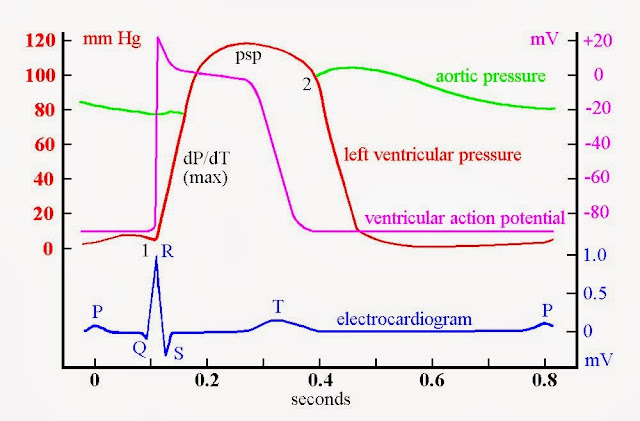
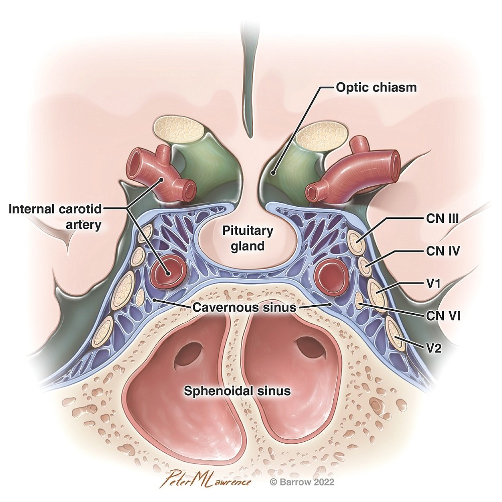
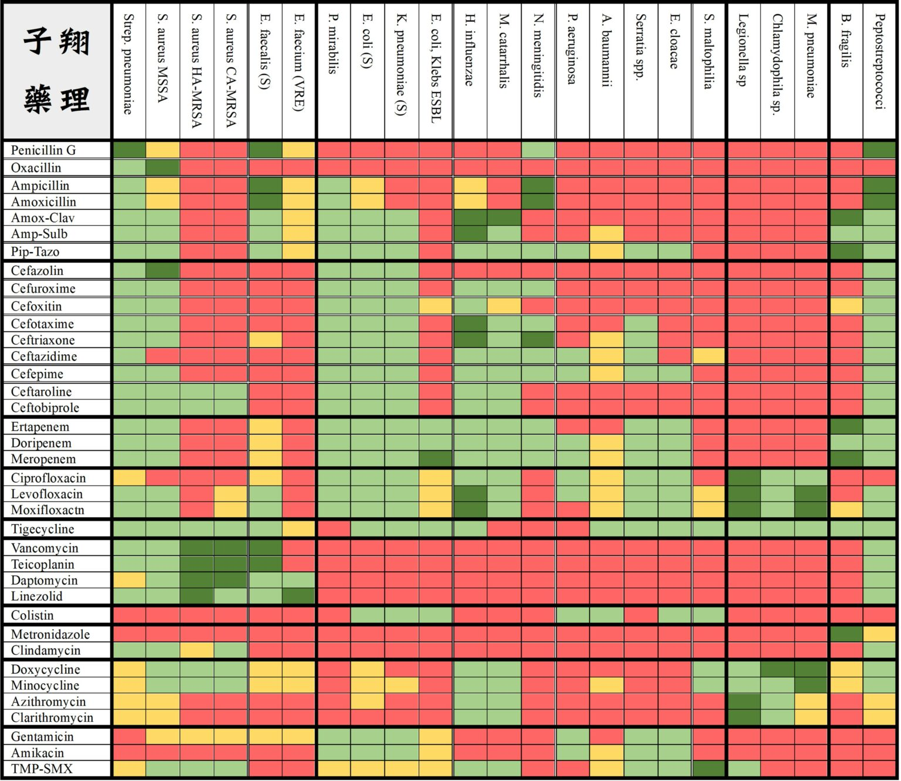

格式：`Dx＝`辨認；`Tx＝`處置；`Ind＝`藥物用途；`C/I＝`禁忌/避免；`Risk＝`高風險；`MOA＝`機轉；`陷阱＝`容易混。

# 心臟內科（考題58）

## 高血壓（考題8）

- 定義：成人（>18y/o）連兩次 SBP ≥140 或 DBP ≥90 mmHg。
- 血壓指標快辨：

  | 指標                                | 最重要用途                                                                           |
  | --------------------------------- | ------------------------------------------------------------------------------- |
  | SBP（systolic BP，收縮壓）              | 預測 stroke、腎病、left ventricular hypertrophy（LVH，左心室肥厚）；老人常見 isolated systolic HTN |
  | DBP（diastolic BP，舒張壓）             | 冠狀動脈主要在舒張期灌流；DBP 太低會讓 coronary perfusion 變差                                     |
  | MAP（mean arterial pressure，平均動脈壓） | 器官灌流、休克/ICU 目標；常抓 MAP ≥65                                                       |
  | Pulse pressure（脈壓＝SBP-DBP）        | 動脈硬化/血管老化；脈壓變寬＝老人收縮壓高、舒張壓低                                                      |

- 測量/診斷陷阱：
  - BP cuff（血壓袖帶）：氣囊長≈臂圍80%、寬≈40%；if 小袖帶＝高估 BP。
  - 雙臂/小腿血壓：初診量雙臂（正常 SBP 差<10）；小腿 SBP 常比上臂高10-20。
  - White coat HTN（白袍高血壓）：用 24h ambulatory BP monitoring（ABPM，行動血壓）或居家血壓確認。
  - Orthostatic hypotension（姿勢性低血壓）：站立3min內 SBP↓≥20 或 DBP↓≥10。
- 分類：
  - Primary hypertension（essential HTN，90-95%）：多有 family history；<50y/o 常 SBP/DBP 都升，>50y/o 常以 SBP 升高為主。
  - Secondary hypertension（5-10%）：
    - When：<30y/o、>60y/o 新發、突然惡化、resistant HTN。
    - 口訣＝腎內主神藥。
    - Pitfall：高血脂常共存，不是典型次發線索。
    - 腎實質病（renal parenchymal disease）：1st secondary HTN；常見 DM/CKD。
    - Renovascular HTN（腎血管性高血壓）：年輕女想 fibromuscular dysplasia（FMD，肌纖維發育不全；string of beads）。
    - Atherosclerotic renal artery stenosis（動脈粥狀硬化腎動脈狹窄）：for 老人/動脈硬化風險；提示＝突然 resistant HTN、Cr上升。
    - 內分泌（CCPG）：
      - Conn's syndrome（primary aldosteronism）：內分泌性次發HTN最常見，常低K。
      - Cushing's syndrome。
      - Pheochromocytoma（嗜鉻細胞瘤）：可和MEN2/NF1/VHL相關。
      - Graves' disease。
    - 主：coarctation of aorta（上下肢血壓差）。
    - 神：sleep apnea/交感亢進。
    - 藥：NSAID、steroid、OCP、sympathomimetic、cyclosporine/tacrolimus、EPO、cocaine/amphetamine。
- Acute hypertensive crisis：
  - Hypertensive urgency：BP >180/120；if no end-organ damage＝口服藥慢慢降。
  - Hypertensive emergency：BP >180/120 + end-organ damage（腦心腎眼/主動脈剝離）。
    - Tx：
      - IV nicardipine、labetalol、nitroprusside/NTG。
    - C/I：
      - 腦中風避免 nitroprusside/NTG，因可能增加 ICP（顱內壓）。
- Exam：for target organ damage
  - 腦心腎周邊眼：TIA/stroke、MI/HF/LVH、CKD、PAD、retinopathy。
  - PE（physical examination，身體診察）：S2、S4 gallop、頸/腎動脈雜音。
  - Pitfall：HTN是 stroke 強RF，但整體 stroke 仍多為 ischemic，不是多數腦出血。
- Tx（ABCDE）：
  - ACEi/ARB：
    - Ind：DM/CKD/proteinuria、心腎保護。
    - C/I：孕婦、雙側腎動脈狹窄、高血鉀。
  - Aldosterone antagonist：
    - Ind：resistant HTN/primary aldosteronism。
  - Pregnancy HTN（妊娠高血壓）：
    - Tx：常用 labetalol/nifedipine/methyldopa。
    - C/I：ACEi/ARB。
  - β-blocker：
    - Pitfall：不是單純 HTN 首選。
    - Ind：CAD/HFrEF/arrhythmia。
    - HFrEF有EBM＝CBM（carvedilol、bisoprolol、metoprolol succinate）。
    - Caution＝Asthma、Bradycardia/bronchospasm、acute decompensated CHF、DM/PVD。
  - CCB：
    - DHP（amlodipine/nifedipine）：降壓常用。
    - Non-DHP（diltiazem/verapamil）：可降 HR。
    - Ind：適合 AACD＝Asthma、Angina、CAD、DM。
  - Diuretics：
    - Thiazide：保鈣、降 Na/K/Mg。
    - Loop（furosemide/Lasix）：排 Na/K/Mg/Ca，CKD/水腫較常用。
    - Caution：痛風/高尿酸、DM 高風險。
  - Lifestyle：Exercise + DASH + 減鹽/減重/戒菸限酒。

## 大動脈疾病（考題1）

- Aneurysm（動脈瘤）：
  - AAA（abdominal aortic aneurysm，腹主動脈瘤）：
    - Risk：男、>60-65y/o、抽菸、高血壓、atherosclerosis、family history。
    - Pitfall：最常見的動脈瘤。
    - Repair/EVAR Ind：有症狀、破裂、快速擴大（≥0.5 cm/6m 或 ≥1 cm/y）、無症狀男≥5.5 cm/女≥5.0 cm。
  - Thoracic aortic aneurysm（胸主動脈瘤）：
    - Risk：Marfan、Ehlers-Danlos、bicuspid aortic valve。
    - Pathology：cystic medial degeneration。
    - Tx：控壓（β-blocker/ARB 常用）＋依大小/成長速度手術。
  - Crawford type II：left subclavian 到 infrarenal aorta（胸腹主動脈瘤範圍最大）。
- Acute aortic syndrome（AAS，急性主動脈症候群）：
  - 分類：
    - Aortic dissection（主動脈剝離）。
    - Intramural hematoma（IMH，壁內血腫）：vasa vasorum破裂。
    - Penetrating aortic ulcer（PAU，穿透性主動脈潰瘍）：atherosclerotic plaque侵蝕。
  - Risk：HTN/atherosclerosis、Marfan/Ehlers-Danlos、bicuspid aortic valve、pregnancy。
    - Pitfall：sick sinus syndrome 不是AAS典型RF。
  - SS：撕裂性胸背痛、pulse deficit/雙手血壓差、神經症狀、AR murmur。
  - Exam：
    - CXR＝可見 mediastinum widening 但不能排除。
    - CTA：for 穩定病人，首選。
    - TEE：for 不穩定/不能搬動。
    - MRA：for 穩定追蹤，急診較慢。
  - Tx：
    - Step 1：先 IV β-blocker，目標 HR <60。
    - Step 2：再加 vasodilator（nitroprusside/nicardipine），目標 SBP <120。
    - C/I：不要先單用 vasodilator，以免 reflex tachycardia 增加 shear stress。
    - Stanford A（升主動脈）：surgery。
    - Stanford B（降主動脈）：先內科控壓。
      - Ind for TEVAR/surgery：malperfusion、破裂、持續痛/擴大。

## Hyperlipidemia（考題1）

- 生理快線：
  - 小腸：TG＋ApoB48 → chylomicron。
  - 肝臟：TG＋ApoB100 → VLDL → IDL → LDL。
  - HDL：reverse cholesterol transport，把 cholesterol 帶回肝臟。
- Atherosclerosis：
  - Path：endothelial injury → LDL oxidation → foam cell/fatty streak → smooth muscle proliferation → fibrous cap/atheroma。
  - ACS：plaque rupture 造成血栓。
- 分類/原因：
  - Primary：familial hypercholesterolemia（LDLR/ApoB/PCSK9；LDL 很高、tendon xanthoma肌腱黃色瘤、早發 CAD）等遺傳型。
  - Secondary：
    - LDL 高：hypothyroidism、nephrotic syndrome、cholestasis。
    - TG 高：DM、alcohol、CKD/obesity、estrogen/steroid。
    - 原口訣：60y/o female＋DM/CKD＋酒精＋雌激素/類固醇。
- Tx：
  - Risk stratification：
    - 先看 LDL/ASCVD（atherosclerotic cardiovascular disease，動脈粥狀硬化心血管疾病）。
    - ASCVD risk factors：男>45、女>55、抽菸、高血壓、DM、早發 CAD family history、HDL<40。
  - Statin（HMG-CoA reductase inhibitor）：
    - Ind：LDL/ASCVD first-line。
    - SE：myopathy、肝酵素上升。
    - C/I：孕婦。
  - Ezetimibe：
    - MOA：抑制 NPC1L1、降 LDL。
    - Ind：statin 不夠再加。
  - PCSK9 inhibitor（alirocumab/Praluent、evolocumab/Repatha）：
    - Ind：very high-risk ASCVD 或 familial hypercholesterolemia。
    - Effect：降 LDL 強。
  - Fibrate（fibric acid derivative）：
    - Ind：TG ≥500 mg/dL，for 避免 pancreatitis。
    - SE：膽結石。
    - Pitfall：fenofibrate 可合用 statin；gemfibrozil＋statin 易 rhabdomyolysis。
  - Omega-3 fatty acids：for 降 TG。
  - Bile acid sequestrant：
    - Effect：降 LDL 但升 TG。
    - C/I：TG 高者避免。
  - Niacin（nicotinic acid）：
    - Effect：降 TG/升 HDL。
    - SE：flushing、高血糖/高尿酸。
    - Pitfall：現在較少作首選。

## Ischemic heart disease（考題15）

- 分類：
  - Stable angina：固定狹窄。
  - Acute coronary syndrome（ACS，急性冠心症）：不穩定plaque/血栓。
    - Unstable angina：troponin陰性。
    - NSTEMI：troponin陽性但無ST elevation。
    - STEMI：ST elevation。
- Chronic stable angina：
  - Dx：固定冠狀動脈狹窄（常>70%）＋運動胸痛、休息/NTG改善。
  - Pitfall：if troponin/CK上升＝不是單純 angina。
  - Prognosis：CRP/BNP高預後較差。
  - Exam：
    - Exercise ECG：for 能運動且 ECG 可判讀；目標HR約220-age；干擾＝LBBB/LVH/digoxin 會干擾 ST depression。
    - Stress imaging（SPECT/echo）或冠脈CT：for 不能運動/ECG難判讀。
    - SPECT：可逆缺損＝ischemia；固定缺損＝舊MI/疤；pitfall＝balanced ischemia 可低估多血管病。
    - Coronary calcium Agatston score：不用顯影；用途＝風險分層，典型胸痛不要一律當最佳診斷。
    - Coronary steal：擴張正常血管後，病灶血管相對更缺血。
  - Tx：
    - Anti-angina＝β-blocker first-line、nitrate。
    - Vasoprotection＝aspirin（不可逆COX抑制）、statin、危險因子控制。
    - PCI/CABG：Ind＝症狀控制不佳或高風險解剖；穩定心絞痛的診斷性心導管/PCI不等於一定降低MI或死亡。
- ACS診斷：
  - Exam：
    - 胸痛到急診10min內 ECG＋serial troponin；早期troponin正常不能排除MI，CK可正常。
    - ECG：
      - ST depression＝subendocardial ischemia/NSTEMI或UA。
      - ST elevation＝transmural injury/STEMI。
      - Q wave＝myocardial necrosis後electrical silence。
      - T inversion＝ischemia或reperfusion，要看導程定位。
    - 發病順序快記：T wave變高 → ST elevation → Q wave → ST下降 → T wave inversion。
    - MI定位：inferior（II/III/aVF）＝RCA 90%/LCX 10%；septal（V1-V2）＝LAD。
    - Right-side ECG：Ind＝inferior MI 加做 V4R；if V4R ST elevation，避免nitrate/利尿劑（怕preload下降）。
- ACS風險/分級：
  - TIMI risk score：
    - AACC＋3＝Age>65、Aspirin in 7d、CAD、CAD risk factors>3、angina、ECG、cardiac enzymes。
    - GRACE>140＝高危險。
  - TIMI flow grade（心導管灌流，別和risk score混）：0無灌流、1穿過但遠端不足、2延遲/部分灌流、3正常灌流。
  - MI 5 types：
    - Type 1＝plaque rupture/erosion造成atherothrombosis。
    - Type 2＝供需失衡（sepsis、貧血、低血壓、tachyarrhythmia）。
    - Type 3＝疑似MI猝死未驗到troponin；Type 4＝PCI相關。
    - Type 5＝CABG相關（troponin >10× 99th percentile＋臨床/影像/心導管證據）。
- ACS Tx：
  - 急性藥物：
    - Antiplatelet/anticoagulation：Aspirin＋P2Y12 inhibitor（ticagrelor/prasugrel/clopidogrel）＋UFH/LMWH。
    - NTG：for 止痛/降 preload。
    - O2：Ind＝低氧/呼吸窘迫等需要，不是常規人人給。
    - GPIIb/IIIa inhibitor：
      - Ind：bailout 或高血栓負荷。
      - Pitfall：不是常規三合一。
  - STEMI reperfusion：
    - Primary PCI：優先，FMC-to-device目標≤90min。
    - Fibrinolysis：for 無法≤120min完成PCI且症狀<12hr，door-to-needle≤30min。
  - NSTE-ACS invasive strategy：
    - Immediate：if 休克、持續胸痛、惡性心律。
    - Early（常抓24hr內）：if GRACE>140、troponin動態上升、ST/T動態變化。
  - PCI強適應：
    - Ind：cardiogenic shock、ongoing ischemia、溶栓失敗（rescue PCI）、症狀>12hr但仍有缺血。
    - Pitfall：DAWN/DEFUSE-3是腦中風EVT條件，不是MI。
  - 次級預防：
    - DAPT：for 防再血栓。
    - High-intensity statin：for plaque stabilization/降LDL。
    - β-blocker：post-MI可降死亡率。
    - ACEi/ARB：for 防remodeling，特別前壁MI/HF/DM/HTN/CKD。
    - 心臟復健＋戒菸。
- MI後併發症：
  - 電氣性：VPC、VT、VF；維持K>4、Mg正常，β-blocker有益；不要預防性給lidocaine。
  - 機械性：
    - Papillary muscle rupture＝急性MR/肺水腫/休克。
    - Ventricular septal rupture＝新holosystolic murmur＋thrill。
    - LV free wall rupture＝tamponade/PEA/猝死。
    - LV pseudoaneurysm＝contained rupture，破裂風險高；cf. true aneurysm＝較晚、persistent ST elevation/HF/血栓/VT，壁含心肌。

## Cardiogram and Arrhythmia（考題9）

- 圖像快讀：ECG、ventricular action potential（心室動作電位）與左心室/主動脈壓力波同步；for 對齊 QRS、plateau、收縮壓上升。
- 生理：
  - Ventricular action potential（心室動作電位）：
    - MOA：Phase 4 靜止膜電位（K梯度）、0 Na內流（SA/AV node是Ca內流）、1 Na停止、2 Ca內流plateau、3 K外流。
- ECG判讀：
  - Rule＝AHI-AHI：
    - Rate：300/RR大格。
    - Rhythm：Lead II看P/QRS關係。
    - Interval：PR<200ms、QRS<120ms、QTc約<440-460ms。
    - Axis：-30到+90正常。
    - Hypertrophy / Infarction。
  - Dx：
    - 低體溫 <32°C：Osborn J wave（J點駱駝峰）相對特異。
    - Bundle branch block：
      - LBBB：V1深V/陰性、V6或Lead I寬R。
      - RBBB：V1兔耳朵、V6深S。
- BLS/ACLS：
  - Tx：
    - BLS叫叫CAB：成人30:2，單人小兒30:2，雙人小兒15:2。
    - Pulseless：CPR＋AED/defibrillation（VF/pulseless VT可電）＋找5H5T。
      - 5H：Hypoxia、Hypovolemia、Hyper/hypokalemia、Hypothermia。
      - 5T：Tension pneumothorax、Tamponade、Toxins、Thrombosis。
    - 有脈但不穩定（低血壓、意識改變、shock、胸痛、急性HF）：
      - Tachycardia：同步電復律。
      - Bradycardia：atropine 1mg IV q3-5min（max 3mg）；無效考慮 transcutaneous pacing（TCP，經皮節律器）/dopamine/epinephrine。
  - C/I：
    - 心臟移植後bradycardia：迷走神經已切斷，atropine效果差，別延誤pacing/升壓藥。
- Tachycardia：
  - Step 0：先看穩不穩定；if 低血壓、意識改變、shock、胸痛、急性HF → synchronized cardioversion（同步電復律）。
  - Step 1：穩定者再看 QRS 寬窄＋規則性。
    - Narrow QRS（<120 ms）＋regular：
      - Dx：PSVT/AVNRT/AVRT。
      - Tx：先 vagal maneuver → adenosine；若仍穩定可用β-blocker或non-DHP CCB（diltiazem/verapamil）。
    - Narrow QRS＋irregular：
      - Dx：AF、atrial flutter with variable block、MAT。
      - Tx：先 rate control（β-blocker或diltiazem/verapamil）→ 再評估 rhythm control＋anticoagulation。
      - C/I：HFrEF 小心 non-DHP CCB。
    - Wide QRS（≥120 ms）：
      - Dx：先當 ventricular tachycardia（VT，心室頻脈）處理，除非很確定是SVT with aberrancy。
      - Tx：穩定可 amiodarone/procainamide；不穩定同步電復律。
    - Torsades de pointes（扭轉型心室頻脈）：
      - Dx：QT prolongation＋polymorphic VT。
      - Tx：MgSO4＋補K/Mg＋停致QT藥。
  - Genetic arrhythmia syndrome（遺傳性心律不整症候群）：
    - Dx：Long QT、Brugada、catecholaminergic polymorphic VT（CPVT，兒茶酚胺性多型性心室頻脈）。
    - Pitfall：結構性心臟病造成的VT不算genetic arrhythmia。
  - VT origin（心室頻脈起源）：
    - LBBB pattern：多想右心室起源，例如修補後法洛氏四重症（TOF）疤痕reentry。
    - RBBB pattern：多想左心室起源。
- AF / MAT：
  - AF（atrial fibrillation，心房顫動）：
    - Dx：irregularly irregular、無一致P波。
    - Risk：血栓多在 left atrial appendage（左心耳）。
    - Tx：
      - Anticoagulation decision：用 CHA2DS2-VASc 評估。
      - Non-valvular AF：需抗凝時優先 DOAC（direct oral anticoagulant，直接口服抗凝血劑）。
      - Mechanical valve / 中重度 mitral stenosis：仍用 warfarin。
    - C/I：aspirin不可替代AF抗凝。
    - Antidote：dabigatran 解毒用 idarucizumab。
  - MAT（multifocal atrial tachycardia，多源性心房頻脈）：
    - Dx：像AF一樣irregularly irregular，但有≥3種P波＋P波間等電位線。
    - Risk：常見COPD/低氧/老人。
    - Tx：治低氧/電解質；通常不需抗凝。
- Bradycardia / block：
  - Sick sinus syndrome：
    - Dx：心跳過慢或暫停 >3s。
  - AV block：
    - Dx：
      - 1st：PR>200ms。
      - 2nd type I（Wenckebach）：PR漸長後掉拍。
      - 2nd type II（Mobitz II）：PR固定但突然掉拍。
      - 3rd：AV dissociation。
    - Risk：下壁MI、Lyme carditis、carotid sinus hypersensitivity。
    - Tx：Mobitz II/3rd或症狀性高階block通常要TCP/永久pacemaker。
- Antiarrhythmic drugs：
  - MOA：
    - Class I（Na blocker，QRS延長）：
      - Ia：quinidine/procainamide/disopyramide；也阻K，QT延長/TdP。
      - Ib：lidocaine。
      - Ic：flecainide/propafenone。
    - Class II：β-blocker（post-MI可降死亡率）。
    - Class III：K blocker（amiodarone常用，QT延長但TdP相對少）。
    - Class IV：non-DHP CCB（diltiazem/verapamil）。
  - Ind：
    - Atropine：for bradycardia。
    - Adenosine：for PSVT。
      - Adenosine = 超短效 AV node blocker，用於 AVNRT 與規則窄 QRS SVT；WPW 合併 AF 時禁用。
    - MgSO4：for torsades de pointes。
  - C/I：
    - Class Ic：避免結構性心臟病。
  - Pitfall：
    - Flecainide/propafenone可誘發Brugada型ST elevation。
    - Amlodipine是DHP CCB，不是心律不整藥。

## 瓣膜心臟病（考題8）

- 心音/時相：
  - Dx：
    - S1：心搏快/MS可變大聲；心搏慢可變小聲。
    - S2：吸氣時左心早於右心＝生理分裂；吐氣仍分裂想 ASD / pulmonary stenosis。
    - S3：心室舒張充血音，小孩可正常；成人常想 volume overload/HF。

  | Valve                   | 正常打開     | 正常關閉     |
  | ----------------------- | -------- | -------- |
  | Aortic / Pulmonic（半月瓣）  | Systole  | Diastole |
  | Mitral / Tricuspid（房室瓣） | Diastole | Systole  |

- Murmur推理（口訣＝舒房狹：房室瓣狹窄在舒張期）：

  | 病變      | Dx＝推理               | Murmur                    |
  | ------- | ------------------- | ------------------------- |
  | AS / PS | 半月瓣 systole 該開，開不好  | Systolic ejection murmur  |
  | AR / PR | 半月瓣 diastole 該關，關不好 | Diastolic murmur          |
  | MS / TS | 房室瓣 diastole 該開，開不好 | Diastolic rumbling murmur |
  | MR / TR | 房室瓣 systole 該關，關不好  | Holosystolic murmur       |

- 相關體徵：
  - Dx：
    - Kussmaul sign（吸氣時JVP/中心壓反而上升）：RV infarction、constrictive pericarditis、restrictive cardiomyopathy。
    - Pulsus paradoxus（吸氣時SBP下降>10mmHg）：cardiac tamponade（Beck triad）。
    - 右心雜音（TR/PS）：吸氣變大聲（Carvallo sign）；左心雜音多在吐氣較清楚。
    - 前負荷下降（Valsalva/站立）：AS/MR多變弱；HOCM變強，MVP click/雜音提早。
    - 蹲下：前負荷/後負荷上升；HOCM變弱，AS多變強。
- 四大瓣膜病：
  - MS（mitral stenosis，二尖瓣狹窄）：
    - Etiology＝rheumatic heart disease、僧帽瓣鈣化。
    - Dx：diastolic rumbling murmur、S1可大聲（最嚴重反而小聲/無聲）、左房大→AF/肺高壓。
    - Tx：
      - Medical：β-blocker或non-DHP CCB控HR＋diuretic。
      - Ind：適合者PMBC（percutaneous mitral balloon commissurotomy，經皮二尖瓣氣球擴張）/手術。
    - Pitfall：單純MS看牙不常規給IE預防抗生素。
  - MR（mitral regurgitation，二尖瓣閉鎖不全）：
    - Etiology＝急性MI後papillary muscle rupture；慢性myxomatous degeneration/MVP、風濕熱。
    - Dx：holosystolic murmur；急性MR可肺水腫/shock。
    - Tx：
      - Acute MR：降afterload/preload（IV nitroprusside/NTG等）＋IABP/手術。
      - Chronic severe primary MR：修補優於置換。
    - Ind＝有症狀或LVEF≤60%/LVESD≥40 mm偏手術。
  - AS（aortic stenosis，主動脈瓣狹窄）：
    - Etiology＝老年退化鈣化、bicuspid aortic valve、風濕熱；BAV常併主動脈根部/升主動脈病變，不是主動脈弓。
    - Dx：systolic ejection murmur＋angina/syncope/HF。
    - C/I：嚴重AS避免脫水/過度vasodilator。
    - Tx：
      - AVR：Ind＝有症狀severe AS或LVEF<50%。
      - SAVR：for 年輕/低風險。
      - TAVI（經導管主動脈瓣置換）：for 高齡或中高手術風險。
  - AR（aortic regurgitation，主動脈瓣閉鎖不全）：
    - Etiology＝aortic root disease（dissection、Marfan、Ehlers-Danlos）、風濕熱、IE。
    - Dx：early diastolic murmur＋wide pulse pressure/bounding pulse。
    - Tx：
      - Acute severe AR：急手術。
      - Chronic severe AR：Ind＝有症狀、LVEF下降（常抓≤50-55%）或LV擴大偏AVR。
    - Pitfall：急性AR避免單靠慢慢藥物觀察。
- 人工瓣膜：
  - 選擇：
    - 機械瓣：for 年輕/可長期抗凝；耐用，但需終身warfarin。
    - 生物瓣：for 高齡/出血風險高/不適合抗凝；免長期抗凝，但會退化需再介入。
  - IE prophylaxis Ind：牙科預防抗生素只給高風險：
    - 人工瓣膜/瓣膜修補人工材料、曾有IE。
    - 未修補發紺先天性心臟病、人工材料修補CHD後6個月內或仍有殘餘缺陷。
    - 心臟移植後瓣膜病。
  - Pitfall：一般MS/MR/AS/AR或MVP看牙不常規預防抗生素。
  - 補＝近年IE發生率上升，與高齡化、侵入處置/裝置增加有關。

## 細菌心內膜炎（考題1）

- 常見菌：
  - S. aureus：
    - Risk：native valve急性、IVDU、醫療相關。
    - Tx：依MSSA/MRSA選藥。
  - Viridans streptococci / HACEK：
    - Risk：口腔/牙科相關亞急性IE。
    - Tx：penicillin/ceftriaxone（抗藥時可加gentamicin）。
  - Enterococci：
    - Risk：泌尿/腸胃道來源、老人。
    - Tx：ampicillin/penicillin-based combination。
- Duke criteria（Dx＝2M / 1M＋3m / 5m）：
  - Major：
    - Blood culture：典型菌陽性；2套以上、>12hr、同一菌種；含HACEK。
    - Endocardial involvement：echo vegetation/oscillating mass、abscess、new valvular regurgitation。
  - Minor：
    - Risk：predisposing heart condition或IVDU。
    - Fever：>38°C。
    - Vascular phenomena：emboli、Janeway lesion（無痛掌蹠紅斑）。
    - Immunologic phenomena：Osler node（痛性指端結節）、Roth spots（視網膜出血白心）。
    - Microbiology：不符合major的血液培養/血清證據。
  - Exam：
    - TTE（經胸心臟超音波）：for 低懷疑/低風險先做。
    - TEE（經食道心臟超音波）：for 高懷疑/高風險，或TTE陰性仍懷疑。
- 手術適應症：
  - 急刀（<24hr）：
    - Acute severe AR/MR或chordae rupture造成急性HF。
    - Abscess/fistula破進心臟。
  - Ind：
    - 適當抗生素7-10日仍持續菌血症。
    - 人工瓣膜IE治療後復發。
  - Pitfall：治療3天仍發燒，不等於手術適應症。
- F/U：
  - Blood culture：每日一次。
  - Pitfall：抗生素7日仍燒/菌血症未清除 → 懷疑abscess（瓣膜旁、脾、腎）。

## Cardiomyopathy（CMP）（考題3）

- Dilated CMP（DCM，擴張型心肌病）：
  - Dx：心室擴大＋收縮功能下降（常見HFrEF表現）。
  - Exam：
    - MRI：LGE（late gadolinium enhancement，延遲顯影）常mid-wall；MI則從subendocardial開始；水腫看T2-based影像，不靠LGE判斷。
  - Tx：
    - HFrEF標準治療。
    - Anticoagulation：Ind＝AF/心室血栓/栓塞史。
    - ICD/CRT：Ind＝optimal Tx後LVEF≤35%。
    - 心臟移植：if 末期。
- Hypertrophic CMP（HCM，肥厚型心肌病）：
  - Dx：心室肥厚＋舒張功能下降。
  - Genetics：多為autosomal dominant（體染色體顯性）sarcomere（肌節）突變，例如β-myosin heavy chain。
  - Exam：
    - Bisferiens carotid pulse（雙峰頸動脈脈搏）。
    - Maneuver：站立/Valsalva使preload下降，LVOT（left ventricular outflow tract，左心室出口）obstruction↑，收縮期雜音變大。
  - Risk：
    - 運動血壓不上升或下降。
    - 少數進展成end-stage DCM（<10%）。
    - Pitfall：多數不是出生即肥厚。
  - Tx：
    - 避免劇烈運動＋β-blocker / verapamil。
    - C/I：血管擴張、過度利尿、降低preload，because 會加重出口阻塞。
  - Septal reduction therapy：
    - Ind：septal myectomy / alcohol ablation，if 有症狀且藥物無效的LVOT obstruction。
- Restrictive CMP（RCM，限制型心肌病）：
  - Dx：心室壁僵硬＋舒張功能下降。
  - Cause：amyloidosis（最常見）、sarcoidosis、hemochromatosis（血色素沉著症）、DM。
  - Dx：找不到原因再切片。
  - Tx：
    - Sarcoidosis：steroid。
    - Hemochromatosis：去鐵。
- Left atrial myxoma（左房黏液瘤）：
  - Epidemiology：成人最常見原發良性心臟腫瘤；女多；常在左心房/房間隔。
  - SS：姿勢性暈厥、二尖瓣阻塞樣舒張中期低頻音、全身症狀、栓塞中風。
  - Risk：表面villous gelatinous（絨毛狀、膠狀）易碎，脫落會embolism。
  - Tx：
    - 手術切除。
    - Pitfall：低復發散發型不需常規長期抗凝。

## Pericarditis（心包膜疾病）（考題2）

- Acute pericarditis（急性心包膜炎）：
  - 分類：infectious、Non-infectious、Fibrous、Purulent、Hemorrhagic
  - Cause：idiopathic/ Coxsackie viral（最常見）、bacterial、autoimmune、uremia。
  - Dx：pleuritic chest pain（吸氣痛）＋pericardial friction rub＋EKG diffuse ST elevation / PR depression。
  - Tx：
    - NSAID＋colchicine：for 預防復發。
    - Steroid：Ind＝NSAID無效或特定自體免疫。
    - Colchicine：服用>3months，顯著下降復發率
- Constrictive pericarditis（束縮性心包炎）：慢性心包膜肥厚/纖維化，常需和RCM鑑別
  - Dx：Kussmaul sign（吸氣時JVP反而上升）。
  - Tx：pericardiectomy（心包膜切除，唯一根治）。
- Cardiac tamponade（心包填塞）：心包液壓迫心臟＝血行動力學急症
  - Dx：
    - Echo：優先。
    - Beck triad：hypotension＋distant heart sound＋JVD（低血壓、心音遙遠、頸靜脈怒張）。
  - SS：pulsus paradoxus（吸氣時收縮壓下降>10 mmHg）；可有electrical alternans但EKG不可靠。
  - Tx：緊急echo-guided pericardiocentesis（心包穿刺引流）。
  - C/I：利尿劑、β-blocker、nitrate，because 會降preload/CO。
- NSAID選藥提醒：aspirin腸胃毒性較強；coxib/ibuprofen心血管風險較高（心臟科少用）

## Heart Failure（考題7）

- Heart failure（HF，心臟衰竭）：
  - Dx：症狀/鬱血＋結構或功能異常。
  - Cause：CAD（coronary artery disease，冠狀動脈疾病；>50%）、長期HTN、CMP、DM、家族因素。
- LVEF表型：
  - HFrEF（heart failure with reduced EF，EF≤40%）：
    - Dx：收縮功能下降。
    - Cause：MI、病毒性心肌炎、DCM。
  - HFmrEF（heart failure with mildly reduced EF，EF 41-49%）：中間型。
  - HFpEF（heart failure with preserved EF，EF≥50%＋左心室充填壓↑）：
    - Dx：舒張功能下降/心室僵硬。
    - Typical：老年、女性、肥胖、多年HTN/LVH、AF、DM、CKD。
  - High-output HF：
    - Dx：CO（cardiac output，心輸出量）高但周邊仍不夠。
    - Cause：甲亢、嚴重貧血、AV fistula（arteriovenous fistula，動靜脈廔管）、beriberi、肥胖、肝病。
    - Pitfall：不是HFpEF同義詞。
- SS：
  - 左心衰竭：肺水腫、咳嗽、喘、crackles。
  - 右心衰竭：周邊水腫、肝腫大、JVD。
- Exam：
  - 基本：CBC、生化、EKG、Echo、CXR。
  - BNP / NT-proBNP：for 判斷呼吸困難是否來自HF；BNP <100通常可排除。
  - Pitfall：肥胖BNP偏低；腎衰竭、年齡大會使NT-proBNP偏高。
  - ARNI（neprilysin inhibitor）會讓BNP不降反升；追蹤較看NT-proBNP。
- 分級：
  - NYHA（New York Heart Association）：看症狀；I無症狀，IV休息也喘。
  - ACC/AHA：看病程/治療策略；A高風險無結構異常，D末期。
- Tx：
  - HFrEF四大柱：
    - ARNI（angiotensin receptor-neprilysin inhibitor）/ACEi/ARB（可減少死亡率、住院率）。
    - 實證β-blocker（減緩心跳，避免LV remodeling）。
    - MRA（mineralocorticoid receptor antagonist，礦物皮質素受體拮抗劑）：e.g. spironolactone。
    - SGLT2 inhibitor。
  - Diuretics：
    - Ind：鬱血/水腫症狀控制。
    - Pitfall：不是主要預後藥。
  - HFrEF不改善預後：
    - Dihydropyridine CCB：可控HTN/angina但非標準預後藥。
  - HFpEF：
    - Tx：利尿緩解鬱血＋控HTN/AF/DM/CKD/肥胖＋SGLT2 inhibitor。
  - High-output HF：
    - Tx：治根因（甲亢/貧血/AVF等）。
- Sudden death prevention：
  - ICD：
    - Ind：心衰猝死倖存者或經最佳藥物治療後仍LVEF≤35%且符合NYHA條件。
    - Pitfall：不是NYHA I且LVEF>35%。
  - CRT（**Cardiac Resynchronization Therapy**）：
    - Ind：LBBB/傳導延遲＋低LVEF的再同步治療。
  - Stage D：
    - Tx：LVAD/心臟移植。
- ACEi/ARB：
  - C/I：孕婦、雙側腎動脈狹窄、高血鉀。
  - Caution：severe AS/HOCM，避免過度降afterload/preload。

## Syncopes（考題3）

- Syncope（昏厥）：短暫意識喪失＋肌張力下降，主因＝腦血流不足。
  - cf. seizure（癲癇）：大腦異常放電，常無典型前兆/時間較久。
- Neurally mediated syncope（神經介導性/血管迷走性）：最常見；Trigger＝情緒壓力、疼痛、久站
  - Dx：tilt table test可誘發。
  - Tx：補水/避誘因。
- Cardiac syncope（心源性）：
  - Cause：心律不整、CMP、瓣膜病。
  - Risk：坐姿/運動中/無前兆/家族猝死。
  - Exam：
    - EKG：第一線。
    - Holter、echo、電生理檢查：依情境。
    - Pitfall：肺功能檢查通常找不到syncope原因。
  - Tx：治underlying cause。
- Orthostatic syncope（直立性）：
  - Dx：站立3分鐘內SBP下降≥20 mmHg或DBP下降≥10 mmHg。
  - Exam：躺/坐/站血壓。
  - Tx：水分＋鹽分、壓力襪、必要時升壓藥。

# 胸腔內科（考題48）

## 泛論（考題13）

- 胸痛四大急症＝急性心肌梗塞，肺栓塞，主動脈剝離，張力性氣胸
- 喘Exam：
  - 氣管＝Stridor（上呼吸道，吸氣高頻，Tx＝Epinephrine）
  - 肺Bronchospasm＝Wheezing （Rhonchi if Localized，下呼吸道，呼氣高頻連續音，Tx＝SABA（Albuterol））
  - Parenchymal disease＝Crackles（＝rales，fine常見肺炎/心衰積水，coarse常見咳痰能力差者），Tx＝依病因；肺水腫用diuretics、肺炎用antibiotics。
  - Pleural disease＝Friction rub，胸膜病變，Tx＝NSAID
- 呼吸pattern：

  | Pattern       | 關鍵字         | 常見原因       |
  | ------------- | ----------- | ---------- |
  | Cheyne-Stokes | 漸強漸弱＋暫停     | CHF、中樞病灶   |
  | Kussmaul      | 深大規則        | DKA、代謝性酸中毒 |
  | Biot / ataxic | 完全不規則＋apnea | 延腦病灶、顱壓高   |
  | Apneustic     | 吸氣拖很久       | 橋腦病灶       |
  | Agonal        | 瀕死喘息        | 心跳停止、瀕死    |

- Cyanosis （黏膜發青）＝還原血紅素>4g/dL，變性血紅素>1.5g/dL，一般SaO2<85%才會出現（若還原血紅素太多氧氣充足也會cyanosis）
  - Central cyanosis＝口唇，舌頭，軀幹發青，原因＝動脈缺氧，VQ mismatch，Shunt，先天性心臟病（Fallot）
  - Peripheral cyanosis＝四肢發青，原因＝PAOD，Raynaud's，心衰竭，Shock
- Exam：
  - PFT（pulmonary function test，肺功能）：for 阻塞/限制分型與氣喘/COPD確認。
    - Spirometry：FEV1/FVC<0.7＝阻塞型；TLC（總肺容量）下降＝限制型；RV（殘氣量）上升＝air trapping。
    - Bronchodilator test（支氣管擴張試驗）：FEV1增加>12%且>200 mL＝可逆性氣流阻塞，支持Asthma。
    - DLCO（一氧化碳擴散能力）：⭡/正常＝Asthma；⭣＝Emphysema（肺氣腫）/ILD/肺栓塞；限制型但DLCO保留較像胸壁/神經肌肉。
    - Maximal inspiratory pressure（最大吸氣壓）：TLC下降＋FEV1/FVC保留＋吸氣壓下降＝神經肌肉/呼吸肌pump failure。
    - Compliance/Resistance：Compliance/Resistance⭣＝限制性肺病；Compliance/Resistance⭡＝阻塞性肺病（阿祖上升）。
  - ABG（arterial blood gas，動脈血氣）：for 酸鹼、氧合與通氣衰竭。
    - PaCO2：⭡＝ventilation failure（換氣不足/呼吸肌pump failure），急性時pH下降、HCO3尚未明顯補償。
    - PaO2：低值代表oxygenation failure；若PaCO2也高，要先想COPD急性惡化、肥胖低通氣、神經肌肉疾病。
    - Winter formula：代謝性酸中毒時預期PaCO2＝1.5 x HCO3 + 8（±2）；實測不合＝混合呼吸問題。
  - CXR pattern：
    - Alveolar pattern：空氣被液體取代（棉花狀），DDx＝水血炎癌（水腫、出血/SLE、肺炎、肺泡細胞癌）。
    - Interstitial pattern：點線網狀，DDx＝上肺葉偏pneumoconiosis、下肺葉偏miliary TB/meta、病毒/黴漿菌/PCP/肺水腫早期/間質性肺病。
    - Ground-glass pattern：毛玻璃狀、均勻不透光，比alveolar更緊緻；DDx＝胸壁lesion、effusion、tumor mass、collapse。
- 呼吸衰竭分類：
  - Type 1 hypoxemic：PaO2<60，PaCO2正常/低；問題在oxygenation，常見V/Q mismatch、shunt、diffusion。
  - Type 2 hypercapnic：PaCO2>50且常pH下降；問題在ventilation，常見COPD、肥胖低通氣、重症肌無力/呼吸肌無力。
- 低血氧DDx：
  - Hypoventilation：A-a gradient正常；since 肺泡氧下降但肺泡-動脈交換本身未壞。
  - V/Q mismatch（還有V但少）：A-a gradient⭡，給氧可改善；e.g. COPD、Asthma、Pulmonary edema。
  - Shunt（V=0）：A-a gradient⭡，給氧不易改善；e.g. 肺炎、ARDS、肺不張、right-to-left shunt。
  - Dead space/diffusion（Q＝0）：A-a gradient⭡；e.g. Emphysema、Pulmonary emboli、pulmonary fibrosis。
  - Low inspired O2：A-a gradient正常；高海拔若步態不穩/意識不清要想腦水腫，Tx＝立即下山/給純氧/保溫。
  - CXR正常的急性低血氧：優先想PE、right-to-left shunt、hepatopulmonary syndrome、Asthma；肺水腫/氣胸通常CXR會有線索。
  - 血氧含量公式＝Hbg x SaO2 x 1.3＋PaO2 x 0.003

## 氣喘（考題7）

- Asthma vs COPD：
  - Asthma：<20y/o常見，mast cell/IgE/CD4/Th2/ILC2，晚上或清晨嚴重；病理＝上皮脫落（shedding）。
  - COPD：>40y/o＋抽菸常見，CD8/Th1，白天活動喘；病理＝squamous metaplasia。
- 典型Asthma＝咳、喘、胸悶、wheezing（4C2），半夜清早加劇，肺功能變化大。
- Exam：
  - PFT：診斷最有價值；bronchodilator test後FEV1增加>12%且>200 mL＝支持Asthma。
    - ABG/CXR/EKG：for 嚴重度或排除其他病，不是診斷Asthma核心。
  - Control：SABA一週3-4次、夜間偶醒、PEF（Peak Expiratory Flow）約75%＝至少partly controlled；若每日發作/頻繁急診/FEV1約56%＝控制差，要升階抗發炎治療。
- Tx：
  - ICS（inhaled corticosteroid，吸入型類固醇）：控制藥核心；症狀頻繁或FEV1下降時不要只加支氣管擴張劑/茶鹼。
  - LABA：可加在ICS上；**不可單用LABA**，會增加死亡風險。
  - Leukotriene modifier：for AERD（aspirin-exacerbated respiratory disease，阿斯匹靈誘發）。
  - β2 agonist：for Exercise-induced。
  - Omalizumab（抗IgE）：for Severe allergic asthma。

## COPD（考題3）

- 定義：慢性咳嗽痰多，呼吸困難，支氣管擴張劑後FEV1/FVC<0.7且不可完全逆轉。
- 分類：
  - Chronic bronchitis：咳痰>3 months/yr且連續2 yr，wheezing，blue bloater；Tx可考慮Roflumilast（反覆惡化＋慢性支氣管炎型）。
  - Emphysema：肺泡壁破壞/過度充氣，pink puffer，DLCO下降。
- 病理：
  - 大氣道：goblet cell增生 → 黏液濃痰分泌增加；抽菸使上皮鱗狀化，鱗狀細胞癌風險↑。
  - 小氣道/肺實質：小氣道阻塞＋elastolytic protein破壞肺泡壁。
- 症狀＝慢性咳嗽、痰多、活動喘，白天嚴重；早期PE可能接近正常；不太會Clubbing fingers（有的話要考慮癌症/bronchiectasis）
  - cf. 年輕無抽菸卻肺氣腫病史 ⭢ 考慮 α-1 antitrypsin deficiency，抽煙 ⭢ 考慮上肺葉氣腫/ 肺葉癌
- Exam：
  - PFT：診斷必要；FEV1%分級＝>80輕、50-80中、30-50重、<30末期；搭配mMRC/CAT（**Modified Medical Research Council dyspnea scale**）決定用藥。
  - PFT pattern：obstructive＋DLCO下降＝Emphysema；c.f obstructive＋DLCO正常/高較像Asthma。
  - Imaging：CXR可見過度充氣/肺野過亮；CT可看emphysema與bronchiectasis，敏感度高於CXR。
- Tx：
  - 預防：戒菸最重要；流感/肺炎鏈球菌疫苗；胸腔復健可改善運動耐受與生活品質。
  - 穩定期：LABA/LAMA為喘的首選（c.f Asthma不能單用）；反覆急性惡化或eosinophil偏高再加ICS；PaO2≤55或長期嚴重低氧才給長期氧療。
  - 急性惡化：短效支氣管擴張劑＋全身steroid；若膿痰/感染線索給抗生素。
  - NIPPV（Non-invasive positive pressure ventilation）：for 高碳酸血症或呼吸性酸中毒；IV theophylline不建議常規使用。
  - 外科：肺減容手術或肺移植 for 選定末期病人。

## 間質性肺病（ILD）（考題7）

- 共通型態：限制性肺病＋DLCO下降＋乾咳/運動喘＋fine crackles；clubbing要想到IPF/肺癌。
- 分類：
  - 已知病因：藥物（amiodarone、bleomycin、methotrexate）、結締組織疾病（SLE、RA、scleroderma）、職業暴露、放射線治療。
  - Idiopathic interstitial pneumonia（IIP，原因不明間質性肺炎）：毛玻璃浸潤越多通常越可逆；蜂窩肺越多預後越差。
    - Idiopathic pulmonary fibrosis（IPF，特發性肺纖維化）：
      - SS：老年＋乾咳＋clubbing＋basal crackles。
      - Exam：HRCT＝UIP pattern（honeycombing、reticulation、traction bronchiectasis）。
      - Tx：pirfenidone/nintedanib減緩FVC下降；不建議傳統免疫抑制。
    - Nonspecific interstitial pneumonia（NSIP）：活躍發炎、多GGO（ground-glass opacity，毛玻璃影），常和CTD相關。
    - Cryptogenic organizing pneumonia（COP）：類固醇有效。
    - **Respiratory Bronchiolitis（RB）**-ILD/DIP：抽菸相關；Tx＝戒菸。
    - Acute interstitial pneumonia（AIP）：急性發作，預後差。
  - 肉芽腫：Hypersensitivity pneumonitis（過敏性肺炎；Tx＝避免抗原）、sarcoidosis（non-caseating granuloma非乾酪性肉芽腫；Tx＝steroid）。
  - CTD-ILD（結締組織病相關ILD）：免疫抑制劑（MMF/cyclophosphamide）；若progressive fibrosing phenotype可加抗纖維化。
- 職業肺病快分：
  - Asbestosis（石綿肺）：**下**肺葉/肋膜斑塊鈣化；Risk＝抽菸會加乘肺癌風險，但不加乘mesothelioma。
  - Silicosis（矽肺）：**上**肺葉結節＋蛋殼狀肺門LN鈣化；Risk＝TB/NTM感染、Erasmus syndrome（silicosis＋scleroderma）。
  - Coal workers' pneumoconiosis（煤礦工人塵肺）：上肺葉黑色斑/結節；相較silicosis，TB或黴菌感染風險較低。

## Infection（考題3）

- Pneumonia（PNA，肺炎）：
  - 痰品質：>25 PMNs/LPF才像下呼吸道檢體；Gram stain＝in pair想肺炎鏈球菌（有疫苗），in cluster想金黃色葡萄球菌。
  - 痰色快分：
    - 黃/綠膿痰＝細菌肺炎/AE COPD/bronchiectasis。
    - 白色或粉紅泡沫痰＝急性肺水腫/CHF。
    - 鐵鏽色＝pneumococcal pneumonia；血痰＝TB/肺癌/PE/bronchiectasis。
  - Exam：
    - CXR：lobar consolidation＋air bronchogram＝典型細菌性肺炎。
    - CXR：interstitial/reticulonodular pattern＝非典型肺炎（Mycoplasma/virus）較像。
  - CAP（community-acquired pneumonia，社區型肺炎）：
    - Pathogen：S. pneumoniae最常見；Klebsiella pneumoniae（KB）偏老年、酒精、DM、膿稠痰。
    - Atypical pneumonia：年輕、WBC不高、雙側/間質影像；Mycoplasma pneumoniae、Chlamydophila pneumoniae（肺炎披衣菌）→ Tx＝macrolide。
    - Legionella pneumonia：水源/郵輪/空調暴露＋高燒、乾咳、腹瀉、意識混亂、低鈉；痰Gram stain WBC多但看不到菌。
    - Pseudomonas CAP：RF＝severe COPD、bronchiectasis、結構性肺病、近期住院/廣效抗生素。
    - Severity：CURB-65高分或住院者→β-lactam＋macrolide，或 respiratory fluoroquinolone。
  - HAP/VAP（hospital-/ventilator-associated pneumonia）：
    - HAP：住院>48hr後新發肺炎；VAP：插管/呼吸器>48hr後新發肺炎。
    - Pathogen：
      - 早發且無MDR（multi-drug resistant，多重抗藥）風險＝社區菌（S. pneumoniae、Haemophilus influenzae（流感嗜血桿菌））。
      - 晚發/有MDR風險＝MRSA（methicillin-resistant S. aureus，抗甲氧西林金黃色葡萄球菌）、Pseudomonas、Klebsiella、Acinetobacter（不動桿菌）。
    - Tx：先經驗性抗綠膿；if MRSA風險再加cover MRSA，培養陰性/無MDR時縮窄，常抓短療程約8天。
    - Prevention：床頭抬高30-45度；15-20度不足。
- Aspiration（吸入性肺炎/肺炎樣反應；正常人不會下這個診段）：
  - RF：意識不清、酒醉、麻醉、癲癇、吞嚥困難、牙周病。
  - Location：仰臥吸入＝上葉後段＋下葉上段；直立吸入＝下葉基底段/RML（右中葉）。
  - Consequence：aspiration pneumonitis/pneumonia，也可進展成 aspiration-related lung abscess。
- Lung abscess（肺膿瘍；RF＝DM、酒精、牙周病）：
  - Cause：primary多由aspiration造成；pathogen＝口腔厭氧菌，多慢性、預後較好。
  - Secondary abscess：pathogen＝S. aureus/KB/綠膿；常見於支氣管阻塞/免疫不全，多急性、預後較差。
  - Exam：
    - CXR：cavitation（空洞）＋air-fluid level（液氣平面）。
    - Pathology：purulent liquefaction（化膿性液化）。
  - Tx：抗厭氧抗生素3-6wks；if 大膿瘍/抗生素無效/併發症，再考慮引流或手術。
- Bronchiectasis（支氣管擴張；感染相關）：
  - SS：反覆感染、慢性膿痰、血痰。
  - Exam：chest CT較CXR敏感，可見支氣管擴張或tram-track/ring shadow。
  - Diffuse bronchiectasis DDx：Kartagener syndrome、反覆吸入或感染、免疫球蛋白缺乏。
  - Pitfall：年輕人反覆肺炎＋慢性鼻竇炎＋H. influenzae，要先查血清IgG/CVID方向。
- 黴菌感染：

  | Fungus             | 特徵                                                                                                |
  | ------------------ | ------------------------------------------------------------------------------------------------- |
  | Aspergillosis      | A.fumigatus（Hyphae/ KOH（＋））；銳角分頁菌絲；血管侵犯⭢Halo sign；舊TB/空洞內fungus ball（aspergilloma）；Tx=Obx、手術（有症狀） |
  | Histoplasmosis     | Ohio/Mississippi、鳥/蝙蝠糞；巨噬細胞內酵母；肺/縱膈鈣化肉芽腫                                                          |
  | Coccidioidomycosis | Arizona/California沙漠；spherule with endospores；肺炎、空洞、erythema nodosum                              |
  | Cryptococcosis     | C.neoformans；鳥糞/HIV；厚莢膜酵母、India ink/CrAg（＋）；肺結節或腦膜炎                                               |

## Tuberculosis（TB）（考題3）

- 病原＝Mycobacterium tuberculosis（MTB，結核分枝桿菌）；傳染＝開放性肺結核空氣/飛沫核傳播，通常要長期密切接觸。
- Primary TB：年輕/初感染，常中下肺葉granuloma＋鈣化後痊癒；約10% lifetime進展。
- Reactivation TB：RF＝HIV、近期感染、免疫抑制；好發上葉apical/posterior segment、下葉superior segment（高氧張力/低灌流，不是吸入沉積）。
  - SS：cough >3wk、fever、night sweat、weight loss、慢性咳痰；cf. 肺炎較急性、肺膿瘍常有air-fluid level。
  - Exam：
    - CXR：上肺葉浸潤、空洞、纖維結節樣病灶支持活動性TB；近乎完全鈣化較像陳舊/非活動性。
    - Sputum AFB smear：快，可看acid-fast bacilli，但不能分MTB/NTM。
    - Mycobacterial culture：最準，可做藥物感受性；缺點＝慢。
    - NAAT/PCR：快速確認MTB，並初步看rifampin resistance；if CXR正常但痰AFB（＋）→優先做NAAT/PCR分MTB/NTM。
  - Tx：
    - Goal：治癒＝痰陰性>1m；完治＝療程走完。
    - INH（Isoniazid）：neuropathy；藥交互常Increase。
    - RMP（Rifampin）：紅尿/flu-like/貧血；藥交互常Reduce。
    - EMB（Ethambutol）：Eye視神經炎；唯一抑菌性/腎代謝。
    - PZA（Pyrazinamide）：高尿酸。
    - Streptomycin：耳毒性。
- LTBI（latent TB infection，潛伏結核感染）：
  - Exam：TST（tuberculin skin test）/IGRA（interferon-gamma release assay）：用免疫記憶找 latent TB，能支持感染。
    - Pitfall：不能區分latent vs active，也不能預測誰會進展；陰性也不能完全排除感染。
  - Tx：一般可INH 9m；if 接觸者來源為INH抗藥開放性TB，改用rifampin 4m，避免INH單方。
- Drug-resistant TB：MDR-TB＝至少INH＋RMP抗藥；XDR-TB＝MDR再加fluoroquinolone與重要第二線藥抗藥。
- NTM（nontuberculous mycobacteria，非結核分枝桿菌）：
  - Source：環境水源/土壤/氣霧，通常不是病人對病人空氣傳播；可colonization，也可肺感染。
  - Species：MAC（Mycobacterium avium complex）＝慢速生長；肺感染需多藥長療程，常治到培養陰轉後至少12m（總療程可約18m）。
  - Pitfall：M. gordonae常是污染菌；M. abscessus快速生長但治療仍長且困難；M. chelonae屬NTM，不屬MTB complex。
- 肺外結核發生率：淋巴結（最常見）>肋膜>上呼吸道>泌尿道。

## 呼吸器（考題2）

- Oxygen / ventilation：
  - Low-flow oxygen：nasal cannula、simple mask、non-rebreathing mask。
  - High-flow oxygen：可提供較穩定FiO2與少量PEEP；for低氧但仍能自行呼吸者。
  - NIPPV（non-invasive positive pressure ventilation，非侵襲性正壓通氣）：避免插管可降低VAP風險。
    - CPAP：固定正壓，for OSA/心因性肺水腫。
    - BiPAP：吸吐壓不同，for COPD急性惡化合併高碳酸血症/呼吸性酸中毒。
    - C/I：shock、深昏迷/無法保護呼吸道、痰太多需頻繁抽吸、臉部密合困難；PaCO2高本身不是禁忌。
  - Invasive ventilation：for 呼吸停止、NIPPV失敗或禁忌、嚴重意識/保護呼吸道問題。
- 呼吸器設定原則：
  - Obstructive disease：RR低、吐氣時間長（確保氣體有排空），I/E約1:3，避免air trapping/auto-PEEP。
  - Restrictive/ARDS：低潮氣量（約4-6 mL/kg PBW起始），避免volutrauma/barotrauma。
- 指標
  - PEEP（Positive End-Expiratory Pressure）：維持肺泡不塌陷；ARDS常需要較高PEEP。
  - FiO2：急性缺氧先救氧合，穩定後用能達標的最低FiO2（**長期盡量<40-50%**）以避氧毒性。
- 脫離呼吸器：Rapid shallow breathing index（RSBI）＝呼吸頻率/潮氣量（L），<105才較可能成功。
- VAP/併發症預防：床頭抬高30-45度、每日中斷鎮靜與評估拔管；**不常規預防性抗生素**；有出血風險時抗凝血預防需個別化。

## 急性呼吸窘迫症候群（ARDS）（考題1）

- 成因：全身發炎疾病的肺部表現，e.g： Sepsis，Trauma，Pancreatitis，Transfusion，Drowning
- Exam：
  - ABG：PaO2/FiO2≤300；100-200＝moderate，≤100＝severe。
  - CXR：bilateral infiltrates。
  - 排除心衰：No heart failure；PAWP（Pulmonary Artery Wedge Pressure）<18 mmHg/BNP低較支持ARDS。
- 病程：滲出期（for 1 wks，edema（充滿exudate） ⭢ Hyaline membrane生長） ⭢ 增生期（fibrosis生長）
- 病理：肺泡上皮細胞受損 ⭢ 肺泡毛細血管受損 ⭢ 肺水腫 ⭢ 透明膜形成 ⭢ 纖維化
- DDx：ARDS（四肢溫暖、BNP<100、PAWP<18mmHg）、Cardiogenic pulmonary edema（四肢冰冷，∵心衰，PAWP>18mmHg）
- Tx（肺泡脆弱，不要撐太大）：
  - Lung-protective ventilation：低潮氣量通氣（4-8 ml/kg PBW，常起始6）＋Pplat<30cmH2O＋PEEP，可降低死亡。
  - Permissive hypercapnia：為避免volutrauma/barotrauma，pH>7.2通常可接受；cf. TBI/IICP則是CO2不能太高（怕腦血管擴張腦壓上升）。
- 預後：主要與年齡（>75 y/o死亡率60%），成因（Sepsis/ Organ failure死亡率>80%），肺功能恢復度有關

## 肺血管栓塞（考題0）

- 成因/Risk：
  - 來源：80%來自DVT（deep vein thrombosis，深部靜脈血栓）。
  - Risk：術後、臥床、癌症、懷孕/OCP、高凝狀態。
  - 主要死因：右心衰竭。
  - Pitfall：癌症病人術後突然喘，或喘但CXR幾乎正常，要想到PE（pulmonary embolism，肺栓塞）。
- SS：突發呼吸困難、pleuritic chest pain、咳血、心搏快；massive PE可低血壓/休克。
- Exam：
  - D-dimer：for 低/中臨床機率排除；陰性才有用，陽性不能診斷，高臨床機率不要只靠D-dimer。
  - CTA（CT pulmonary angiography）：for 穩定病人，診斷首選。
  - V/Q scan（通氣灌流掃描）：for 不能打顯影劑/腎衰竭/部分孕婦情境。
  - CXR：常正常；可見Hampton's hump（楔形梗塞影）、Westermark sign（局部血管減少）。
  - EKG：sinus tachycardia最常見；V1-3 T wave inversion或S1Q3T3＝右心壓力過大線索。
  - Echo/troponin/BNP：for 右心strain與風險分層，不是穩定病人確診主力。
- Tx：
  - 穩定PE：抗凝血（heparin/LMWH起始，之後warfarin或DOAC）；provoked PE常至少3個月。
  - Active cancer/持續高風險：抗凝需延長，考古常抓LMWH；可依癌別/出血風險選DOAC。
  - Massive PE（低血壓/休克）：tPA/systemic thrombolysis；C/I或失敗可catheter/surgical embolectomy。
  - IVC filter：for 抗凝禁忌、足量抗凝仍復發，或慢性肺栓塞合併肺高壓的特定情境；慢性IVC完全阻塞時不適合放。
  - CTEPH（慢性血栓栓塞性肺高壓）：PE後持續喘＋肺高壓；Exam＝V/Q scan敏感，Tx＝長期抗凝＋pulmonary endarterectomy/balloon angioplasty評估。

## 肋膜疾病（考題4）

- 肋膜積水：
  - Exam：
    - Thoracentesis（肋膜穿刺）：新發/不明原因單側積水、疑感染/惡性要抽。
    - Light's criteria：任一陽性＝exudate；PF/serum protein >0.5（c.f SAAG看albumin）、PF/serum LDH >0.6、PF LDH > serum LDH上限2/3。
    - ADA（adenosine deaminase）：TB pleurisy常高；ADA <40較不支持，>70較支持。
    - Cytology（細胞學）：for malignant pleural effusion（惡性肋膜積液）。
  - Transudate：心衰竭、肝硬化、腎病症候群。
  - Exudate：肺炎、肺栓塞、惡性腫瘤、TB、結締組織疾病。
  - 特殊積液：
    - Pseudoexudate：心衰竭使用利尿劑後（胸水被濃縮），Light's criteria可能被推成exudate。
    - Complicated parapneumonic effusion：大量/loculated、pus、pH<7.2、glucose<60、culture positive；Tx＝引流。
    - Empyema（膿胸）：膿狀、pH<7.2、glucose<40、LDH>1000；Tx＝速速引流。
    - Chylothorax（乳糜胸）：乳白或澄清、TG>110或chylomicron＋、lymphocyte主導；常見胸部/食道/縱隔手術後。
      - Tx：少量可MCT diet或NPO＋TPN；長期大量會營養流失。
    - Malignant pleural effusion：常見來源＝肺癌、乳癌；引流主要改善症狀，不一定延長存活。
      - Tx：反覆大量可做talc pleurodesis（滑石粉肋膜沾黏）或indwelling pleural catheter。
- 氣胸：
  - Primary spontaneous pneumothorax：年輕瘦高男性；SS＝突發胸痛＋呼吸困難；復發率高。
  - Secondary pneumothorax：COPD/肺纖維化/感染/腫瘤背景，通常更危險。
  - Tension pneumothorax：低血壓、呼吸窘迫、氣管偏移；頸靜脈怒張可不明顯。臨床診斷，不等CXR。
  - Open pneumothorax：三邊封閉敷料＋另開乾淨位置放胸管。
  - Exam：CXR＝肺邊緣有清楚線，線外無肺紋理。
  - Tx：
    - 穩定少量：觀察/氧氣。
    - 症狀或較大：needle aspiration/pigtail/chest tube。
    - Chest tube：沿肋骨上緣進入以避開肋間血管神經。
    - 復發/持續漏氣：可肋膜沾黏術（pleurodesis）。

## 肺高壓與 OSA（考題0）

- Pulmonary hypertension（PH，肺高壓）：
  - 分類快分：Group 1＝PAH（肺動脈高壓，如CTD/scleroderma）；Group 2＝左心疾病；Group 3＝肺病/缺氧/OSA；Group 4＝CTEPH（Chronic Thromboembolic Pulmonary Hypertension）；Group 5＝其他。
  - SS：運動喘、syncope、右心衰竭；PE＝loud P2、RV heave、TR murmur。
  - Exam：
    - Echo：screen/估右心壓與右心功能。
    - Right heart catheterization（RHC，右心導管）：confirm PH/PAH；**新定義PH＝mPAP>20 mmHg**，考古常見cutoff＝mPAP≥25 mmHg。
    - V/Q scan：for CTEPH篩檢，慢性PE線索不要只看CTA。
  - Tx：
    - 原則：先分組處理原因。
    - Group 1 PAH：endothelin receptor antagonist（肺血管放鬆；Boseentan、Ambrisentan、Mecitentan）、PDE-5 inhibitor（Sedanafil、Tadalfil）、prostacyclin（Epoprostenol）類。
    - Group 2/3：先治心肺病與低氧。
    - CTEPH：endarterectomy/balloon angioplasty評估＋長期抗凝。
- OSA（obstructive sleep apnea，阻塞性睡眠呼吸中止）：
  - RF＝肥胖、男性、頸圍大、鼻中膈彎曲；併發症＝高血壓、心律不整、肺高壓/右心負荷。
  - Exam：
    - Polysomnography（PSG，多項睡眠檢查）：gold standard。
    - AHI（apnea-hypopnea index）：apnea＝不呼吸>10sec；hypopnea＝氣流下降>10sec且伴低氧/覺醒。
    - 診斷：AHI≥5＋典型症狀（白天嗜睡、打鼾、睡眠中呼吸暫停）或AHI≥15即使無症狀。
    - 嚴重度：AHI 5-15輕度、15-30中度、>30重度；夜間低血氧與白天嗜睡也反映嚴重度，**BMI是RF不是嚴重度指標**。
  - Tx：減重、側睡/避免仰睡（positional therapy；考試多寫側睡，不是趴睡為標準）、戒酒/鎮靜藥；CPAP（continuous positive airway pressure，連續正壓呼吸器）一線；UPPP/鼻咽手術for解剖阻塞或CPAP失敗。

## Malignant（記NSCLC特徵，剩下猜SCLC）（考題5）

- 分類：
  - SCLC（small cell lung cancer，小細胞肺癌）：
    - Clue：抽菸強相關、central/hilar mass＋bulky LN、早期轉移、預後差。
    - Paraneoplastic：SIADH、Cushing、Lambert-Eaton/anti-Hu。
    - Tx特性：對CTx/RTx敏感但多不手術。
    - Limited stage：platinum（cis/carboplatin）＋etoposide＋thoracic RTx；無progression後可durvalumab consolidation。
    - Extensive stage：platinum＋etoposide＋PD-L1 inhibitor（atezolizumab/durvalumab）。
  - NSCLC（non-small cell lung cancer，非小細胞肺癌）：較可手術；晚期依driver mutation/PD-L1選標靶或免疫治療。
    - Adenocarcinoma（腺癌）：台灣最常見；女性/非吸菸者、peripheral、EGFR常見；可有hypertrophic pulmonary osteoarthropathy，容易遠端/腦轉移；但預後最好。
      - Driver tests：EGFR（Osimertinib、Afatinib、Gefitinib）、ALK（Alectinib、Crizotinib）、ROS1（Crizotinib）、PD-L1（Pembrolizumab、Atezolizumab）。
      - 病理subtype預後：lepidic（伏壁型/GGO/AIS-MIA概念）最好；acinar/papillary中間；micropapillary/solid最差。
    - Squamous cell carcinoma（SCC，鱗狀細胞癌）：抽菸男性、central cavitation；PTHrP高血鈣。
      - Pancoast tumor：肩頸痛＋Horner syndrome（瞳孔縮小、眼瞼下垂、無汗）。
  - cf. Primary tracheal tumor（原發性氣管腫瘤）極罕見，常見排序和 NSCLC 相反：SCC 最常見，adenoid cystic carcinoma（ACC，腺樣囊性癌）第二；不要把肺 adenocarcinoma 最常見套到氣管。
- Exam：
  - 症狀/CXR abnormal → chest CT → tissue biopsy；中央型（如SCC）痰液細胞學較容易陽性，周邊腺癌較不易。
  - LDCT（low-dose CT，低劑量電腦斷層）：for 高風險肺癌篩檢；PET不是篩檢工具。
  - Brain metastasis：成人腦轉移最常見原發之一是肺癌；SCLC或有神經症狀時要積極看腦部影像。
  - 肺結節影像：
    - 偏良性＝central/diffuse/laminated/popcorn calcification、**fat-containing nodule**、穩定>2年；hamartoma＝1st肺良性腫瘤。
    - 偏惡性＝>8mm、spiculated/irregular margin、**upper lobe**、成長變大、part-solid/GGN持續存在、無良性鈣化。
- 肋膜惡性腫瘤（Mesothelioma，惡性肋膜間皮瘤）：
  - Risk：石綿暴露；和抽菸無關。
  - Tx：依分期/可切除性做多模式治療；傳統EPP＝肺、壁/臟層肋膜、心包膜、橫膈切除。
  - Drug：pemetrexed＋cisplatin；免疫治療（nivolumab＋ipilimumab）可作一線選項。

# 肝膽腸胃科（考題68）

## 吞嚥困難（考題1）

- 鑑別：
  - Diffuse esophageal spasm：間歇性吞嚥困難。
  - Achalasia（食道弛緩不能症）：下括約肌無法放鬆，可伴呼吸道症狀。
  - Scleroderma：食道蠕動減弱，常伴 heartburn。
  - Hiatus hernia：
    - Sliding：整個上移一部分。
    - Paraesophageal：胃部旁邊囊袋上移到胸腔，dysphagia > GERD。
- Achalasia：
  - Epidemiology：男＝女。
  - Risk：癌化多想 SCC（squamous cell carcinoma，鱗狀細胞癌）。
  - Exam：
    - Manometry（蠕動壓力測量）：gold standard。
    - CXR：主動脈後突起內有 air-fluid level。
    - Barium study：bird beak。
  - Tx：
    - 內視鏡肉毒。
    - CCB、nitrate。
    - Pneumatic dilation（氣囊擴張）。
    - Heller myotomy（外科手術切開括約肌）。
- 食道淋巴：
  - Anatomy：submucosa 淋巴網豐富，縱向引流 > 橫向引流，比動脈網更發達。
  - Pitfall：食道癌易 skip/遠端 LN 轉移，不只局部 LN。
- 食道癌快分：
  - ESCC（esophageal squamous cell carcinoma，食道鱗狀細胞癌）：
    - Risk：菸、酒、檳榔、熱飲、Achalasia。
    - Tylosis（Howel-Evans，RHBDF2）：手腳掌角化。
    - Gene：TP53 >90%，HER2 少。
  - EAC（esophageal adenocarcinoma，食道腺癌）：
    - Risk：GERD、Barrett、肥胖。
    - Gene：HER2 較常見（約 15-25%，可用 trastuzumab），Lynch 少見。

## 腹痛（考題0）

- 根據加劇緩解因素鑑別診斷。

## 腸胃道吸收（考題0）

- 常見吸收位置：
  - 上端小腸/十二指腸：Fe、Ca。
  - 空腸：Folate（葉酸）。
  - 末端迴腸：Vit B12（需 intrinsic factor）、bile acid（膽酸）。
  - 脂溶性 Vit A/D/E/K：需膽汁協助吸收。

## 腹瀉（考題3）

- 急性腹瀉（<3 wks）：
  - Warning sign：嚴重脫水、發燒 >5 天、旅遊史、近期住院/抗生素使用。
  - Work-up：stool WBC/RBC、C. difficile toxin。
- 慢性腹瀉（>3 wks）：
  - Work-up：NPO trial。
  - NPO 好：osmotic diarrhea（滲透性腹瀉；如吸收不良、乳糖不耐）；preformed toxin food poisoning（餐後 1-6 hr 想 S. aureus、B. cereus）。
  - NPO 不好：secretory diarrhea（分泌性腹瀉，如 villous adenoma、神經內分泌失調、瀉劑濫用）。
- 感染性腹瀉：
  - 會痢疾/血便：
    - ETEC：旅行者下痢。
    - E. coli O157/EHEC：血便、HUS、腎衰竭。
    - Shigella。
    - Salmonella：生雞蛋。
    - V. parahaemolyticus。
    - C. difficile：住院越多天、PPI/antibiotic 使用越多，感染機率越高；PCR 比 toxin 準。
  - 其他高風險：
    - Norwalk virus：冬季、cruise ship。
    - Rotavirus：兒童、冬季。
    - Giardia lamblia：生水、野外露營。
    - S. aureus：蛋黃醬、奶油。
  - Tx：
    - 補水電解質。
    - 沒發燒/血便：可給止瀉；loperamide＝μ-opioid receptor agonist（不進中樞，不失眠不成癮）。
    - 嚴重血便未知成因：先給 ciprofloxacin。
    - 確定 C. difficile/Giardia/阿米巴：**metronidazole**。

## 腸胃道出血 （top goal＝穩定vital sign）（考題1）

- 上消化道出血（UGIB）：
  - Exam：NG 洗出血。
  - Tx：
    - 胃鏡：診斷＋止血。
    - If variceal ER：先給 octreotide，減少 splanchnic flow、降低門脈壓。
    - If ulcer：PPI。
- 下消化道出血（LGIB）：
  - Etiology：
    - Diverticulosis：最常見；結腸憩室出血可 LLQ，cf. 闌尾炎。
    - Hemorrhoids（痔瘡）。
    - Colorectal cancer。
    - Angiodysplasia（血管異生）：小腸出血常見原因；老人/血管擴張。
  - Exam：
    - Colonoscopy：首選。
    - Radio scan：出血量解析度 >0.1 mL/min。
    - Angiography：出血量解析度 >1 mL/min。
  - Tx：NPO、antibiotics、angiographic embolization（血管攝影栓塞）。

## GERD（考題0）

- Cause：
  - LES pressure 低 / transient relaxation。
  - Hiatal hernia。
  - 副交感神經功能障礙。
  - 胃排空延遲。
  - 藥物/食物：
    - Gastrin、cholinergic：增加 LES 壓力，減輕 GERD。
    - CCB、fat、chocolate、ethanol：降低 LES 壓力。
- Exam：病史 > 胃鏡 > 24hr pH monitoring（for 胃鏡正常但症狀持續）。
- Tx：
  - Lifestyle modification：減重、避免刺激性食物、抬高床頭。
  - Pharmacotherapy：PPI 為首選，H2 blocker 次之；sucralfate、cimetidine。
  - Surgery。
- Complication：
  - Esophagitis（食道炎）。
  - Esophageal stricture（食道狹窄）。
  - Barrett's esophagus（食道黏膜變異）：可進展為食道 adenocarcinoma。
  - C. difficile 感染：PPI 使用增加風險。
  - Aspiration pneumonia：GERD 增加風險。

## Peptic ulcer disease（PUD）（考題0）

- 胃生理：
  - G cell：分泌 gastrin，刺激 parietal cell 分泌胃酸。
  - 抑制胃酸：
    - Atropine：抑制 M3。
    - Cimetidine：抑制 H2 receptor。
    - Omeprazole：抑制 H+/K+ ATPase。
- Ulcer cause：
  - H. pylori 感染最常見。
  - 相關：multifocal atrophic gastritis（MAG）、diffuse antral predominant gastritis、MALToma。
- H. pylori：
  - Micro：G(-) curved rod，urease(+)。
  - Association：PUD、chronic gastritis、MALT lymphoma、gastric adenocarcinoma。
  - 胃癌趨勢：
    - Distal/antrum-body：下降。
    - Proximal/cardia/GEJ 腺癌：上升，和 GERD、肥胖、Barrett 相關。
  - Exam：
    - 胃鏡取樣：侵入性，rapid urease test。
    - Urea breath test：非侵入性；服用標記碳尿素，H. pylori 分解尿素釋放標記碳，呼氣中檢測。
    - t(11,18)：MALToma（B 細胞淋巴瘤）。
  - Tx：PPI + clarithromycin + amoxicillin（或 metronidazole if penicillin allergy）至少 10-14 天。
- 胃腫瘤鑑別：
  - GIST：
    - Origin：interstitial cell of Cajal。
    - Marker：c-KIT/CD117。
    - Tx：原發處 resection（不用淋巴擴清）/ imatinib。
  - Gastric NET（神經內分泌腫瘤）：
    - Origin：enterochromaffin-like cells（ECL）。
    - Type I：最常見，Autoimmune Gastritis
    - Type II：MEN1/Zollinger-Ellison； Gastrinoma分泌gastrin導致胃酸過多胃潰瘍/Type II Gastric NET在胃中產生。
    - Type III：sporadic，預後最差。
    - Localized Tx：complete resection。

功能性 NET 快分：

| 腫瘤                     | 位置/惡性                                             | 典型表現                                                                               | 診斷快分                                                                               | Tx                                                                     |
| ---------------------- | ------------------------------------------------- | ---------------------------------------------------------------------------------- | ---------------------------------------------------------------------------------- | ---------------------------------------------------------------------- |
| Insulinoma（胰島素瘤）       | >99%在pancreas；惡性率低、轉移約5-15%                       | fasting hypoglycemia、Whipple triad（症狀＋低血糖＋補糖改善）                                    | 低血糖時 insulin/C-peptide/proinsulin 不該高卻高；排除 sulfonylurea                            | enucleation/resection；不能開可 **diazoxide**（K ATP channel opener；抑制胰島素釋放） |
| Gastrinoma（胃泌素瘤；也是NET） | 現在多抓duodenum/小腸側45-100%（pancreas 2%）；惡性/轉移約60-90% | Zollinger-Ellison syndrome（ZES）：refractory/multiple ulcers、GERD、secretory diarrhea | fasting gastrin 高＋gastric pH <2；疑難時 secretin stimulation test（給secretin無法抑制G cell） | PPI控酸＋Somastatin控制；手術if保守治療不佳/mass effect（MEN1常多發）                     |

## 切胃後遺症（考題2）

| 術式                                 | Dumping syndrome        | 鹼性/膽汁逆流          | 吸收不良/營養缺乏          | 輸入/輸出 loop syndrome                                    |
| ---------------------------------- | ----------------------- | ---------------- | ------------------ | ------------------------------------------------------ |
| Billroth I（B-I；胃十二指腸吻合）            | 少，可有                    | 少                | 少                  | 幾乎無，因較接近生理、沒有典型 afferent/efferent limb                 |
| Billroth II（B-II；胃空腸吻合）            | 常見                      | 常見，膽汁/胰液可反流到胃    | Vit DEAK           | 經典：afferent loop＝膽汁性嘔吐/膽胰問題；efferent loop＝食物出口阻塞、吐食物   |
| Roux-en-Y gastric bypass（RYGB，胃繞道） | 常見，可有 late hypoglycemia | 少，Roux limb 分流膽汁 | 常見，Fe/Ca/B12 等缺乏要追 | 可有 limb obstruction/internal hernia；傳統輸入/輸出症候群最先想 B-II |

- Dumping syndrome：
  - Path：食物過快進小腸。
  - SS：腹痛、腹瀉、暈眩。
  - Tx：少量多餐、避高糖；嚴重可 octreotide。
- 腸阻塞特徵：
  - X-ray：proximal dilation、distal collapse。
  - Pitfall：KUB 要看到骨盆腔。

## 腸道疾病（考題9）

- Inflammatory bowel disease（IBD，發炎性腸病）：
  - Epidemiology：猶太人多，台灣少。
  - Exam：calprotectin（糞便中白血球蛋白），IBD 高敏感檢查。
  - IBD mimic：
    - Entamoeba histolytica 阿米巴腸炎：
      - Path：flask-shaped ulcer（燒杯狀潰瘍）＋trophozoite 吞 RBC。
      - Pitfall：通常不引起 eosinophilia；誤給 steroid 可猛爆性結腸炎/穿孔。
      - Tx：metronidazole/tinidazole 殺組織中 trophozoites → luminal agent（paromomycin/iodoquinol）清腸腔 cysts 防復發。
    - Intestinal TB（腸結核）：
      - Site：ileocecal（回盲部）常見。
      - SS：fever、night sweats、肺 TB 史。
      - Path：transverse ulcer/stricture，caseating granuloma 或 AFB/PCR 支持。
        - Cf. Crohn：縱走潰瘍、cobblestone、skip lesion、noncaseating granuloma。
      - Pitfall：給 steroid/anti-TNF 前要排除 TB。
  - 腸外SS：
    - 與腸炎活動度相關（鞏關口紅）：peripheral arthritis（四肢關節炎）、erythema nodosum（結節性紅斑）、episcleritis（表皮鞏膜炎）、oral aphthous ulcer（復發口腔潰瘍）。
    - 與腸炎活動度不一定相關：pyoderma gangrenosum（壞疽膿皮病）、ankylosing spondylitis/axial arthritis、uveitis（葡萄膜炎）、PSC（原發性硬化性膽管炎）。
  - Crohn's disease：
    - Pattern：全層、skip lesion、rectal sparing（≠ perianal sparing），治不好。
    - Risk：抽菸/西式飲食惡化。
    - SS：RLQ 痛、cobblestone、肛周病（瘻管/膿瘍/肛裂）/狹窄、腸外關節炎/結節性紅斑。
    - Pathology：noncaseating granuloma。
    - Tx：5-ASA/類固醇/免疫抑制劑（AZA/6-MP）→ 生物製劑（anti-TNF/anti-integrin/anti-IL12/23）。
    - Pitfall：併發症才手術，手術不能根治。
  - Ulcerative colitis：
    - Risk：抽菸、切闌尾為保護因子。
    - Pattern：位置連續，只侵犯 mucosa。
- Irritable bowel syndrome（IBS，大腸激躁症）：
  - Dx：每週腹痛 for 3 months，無器質性病變，診斷為排除性。
  - Pattern：低纖飲食、排羊大便。
  - 分類：IBS-C 便秘型、IBS-D 腹瀉型、IBS-M 混合型。
  - Risk：低纖飲食、壓力、腸胃感染後。
  - Tx：
    - 飲食調整：low FODMAP diet、纖維補充。
    - IBS-C：linaclotide/緩瀉劑。
    - IBS-D：loperamide。
    - 腹痛痙攣：antispasmodics，如 otilonium bromide（catilon）、hyoscine butylbromide。
- Colonic volvulus（大腸扭轉）：
  - Risk：未固定後腹腔＋long mesentery；sigmoid/cecum 常見，transverse 少見；老人、慢性便秘、神經精神病。
  - X-ray：sigmoid coffee bean sign。
  - Tx：sigmoid 先內視鏡減壓後切除；cecal 多手術。
- Intestinal obstruction：
  - Mechanical：KUB 小腸擴張。
  - SS：colicky pain（絞痛）。
  - Tx：NPO/NG 減壓。
- Paralytic ileus（adynamic ileus）：
  - SS：腹脹為主。
  - Exam：KUB 大小腸都擴張。
  - Tx：支持療法，矯正鉀鎂離子。
- GI perforation（腸胃道穿孔）快辨：
  - 原則：resuscitation + NPO（穿孔控制後儘早腸道營養）+ broad-spectrum antibiotics + source control（引流/修補/切除）。
  - Pitfall：越遠端糞便污染越重，大腸一定 cover anaerobes。
  - 食道穿孔＝早診斷＋引流＋抗生素＋營養支持，延誤會腹膜炎mediastinitis
  - 胃/十二指腸穿孔＝free air/急腹症，手術修補＋PPI＋H. pylori eradication
  - 小腸穿孔＝source control＋抗生素，想外傷/缺血
  - 大腸穿孔＝糞便污染重常需手術
  - 闌尾穿孔abscess＝抗生素±percutaneous drainage，穩定後interval appendectomy視情況
  - 憩室炎穿孔＝Hinchey分期，abscess可引流，diffuse peritonitis要手術
  - 腸道營養禁忌：缺血，壞死，未控制腸穿孔，腹膜間隔症候群（腹腔壓力過大導致阻塞缺血）
- Cancer related：
  - Familial adenomatous polyposis（FAP）：APC 基因突變，100% 會進展為癌症；Tx＝預防性切除結腸。
  - Peutz-Jeghers syndrome：hamartomatous polyps、黏膜黑色素沉著、STK11 基因突變，50% 會變 GI cancer。
  - Lynch syndrome：AD，DNA mismatch repair gene 突變，右側結腸癌多；Tx＝定期結腸鏡檢查。

## 肝功能異常（考題8）

- 肝指數 work-up：
  - ALT＝GPT：liver 較專一。
  - AST＝GOT。
  - AST/ALT：看當下 damage。
  - Alkaline phosphatase：看間質/膽道。
  - PT/albumin/bilirubin：看肝剩餘功能。
  - ALT/40：ALKP/100：
    - > *5：肝細胞損傷。*
    - <2：膽道阻塞。
    - 2-5：混合型。
  - γGT/50 > ALKP/100：alcohol、drug、tumor、stone、DM、infection。
  - DBili/TBili：
    - *>0.5：direct，肝膽受傷。*
    - <0.2：indirect，例如溶血。
  - Albumin/(Albumin+Globulin) <0.5：cirrhosis、nephrotic syndrome、chronic inflammation。
  - AST/ALT：
    - <1：考慮病毒肝炎。
    - > *2：考慮酒精肝。*
  - ALT/LDH：
    - <1.5：偏缺血。
      > > 1.5：偏藥物/感染，單純爆肝。
  - 時間軸：
    - 短期肝受傷：PT/aPTT 延長。
    - 長期肝受傷：albumin 下降。
- 病毒性肝炎 serology：
  - HAV：IgG(+) 終生免疫；IgM(+) 急性感染。
  - HBV：
    - HBsAg（表面抗原）：感染指標。
    - HBsAb（表面抗體）：免疫指標。
    - HBcAb（核心抗體）：感染過病毒指標。
    - HBeAg：病毒複製指標。
    - HBeAb：病毒複製抑制指標。
  - HCV：anti-HCV 抗體＝有感染過；HCV RNA＝病毒量多寡。

## 黃疸 （ALKP，GGT，Dbili⭡，cholestasis膽汁滯留）（考題2）

- 病因（用 echo 初步分）：
  - 肝內膽汁滯留：藥物、肝炎、肝硬化。
  - 肝外膽汁滯留：結石、腫瘤、狹窄。
- Dx：
  - 腹部超音波：首選，可評估膽道擴張。
  - CT/MRI：評估腫瘤或結石。
  - ERCP（內視鏡逆行胰膽管造影）：可同時診斷和治療。
- Important signs：
  - Murphy's sign：右上腹吸氣壓痛/發燒。
  - Courvoisier's sign：右上腹摸到無痛性黃疸、腫大不發燒，惡性特徵。
- 尿色：
  - Unconjugated（紅/正常，UGC）：
    - Hemolysis。
    - Gilbert's（良吉）：UGT1A1 輕降，fasting/stress 後黃疸，良性。
    - Crigler-Najjar：UGT1A1 嚴重缺陷；I 型無活性/核黃疸/phenobarbital 無效，II 型部分活性/phenobarbital 有效。
  - Conjugated（direct，深茶色，DDR）：
    - Dubin-Johnson：切片 dark pigment。
    - Rotor's：沒有 pigment。

## 腹水（考題3）

- SAAG score（Serum/Ascitic Albumin）：
  - *“>1.1"： portal hypertension（肝硬化，心衰竭，肝靜脈阻塞）*
  - "<1.1： 發炎/癌症（腹膜癌，結核性腹膜炎，胰臟炎）
- 肝硬化腹水/水腫 Tx：
  - 限鈉 2 g/day。
  - 利尿劑：spironolactone:furosemide（5:2）＝100 mg:40 mg，維持鉀平衡。
  - 低鈉多為 hypervolemic hyponatremia：身體總水鈉都多但水更多。
  - Pitfall：避免補 Na/NS 惡化水腫；嚴重低鈉才限水。
- 細菌性腹膜炎（腹水 PMN >250，cf. 肺炎痰PMN>25）：
  - Spontaneous bacterial peritonitis（SBP）：
    - Cause：E. coli、Klebsiella、S. pneumoniae。
    - Tx：cefotaxime（3rd），不用 cover 厭氧菌。
  - Secondary peritonitis：
    - Cause：腸胃破裂引起，要 cover 厭氧菌。
    - Tx：ampicillin + ciprofloxacin + metronidazole。

## 肝炎（題目多）（考題16）

- 病因：
  - 病毒性肝炎：
    - HAV：糞口，可終身免疫。
    - HBV：唯一雙股環狀 DNA，會猛爆型，HDV 寄生。
    - HCV：慢性為主。
    - Vaccine：目前只有 A、B 有疫苗。
  - 藥物性肝炎：如 acetaminophen 過量，用 N-acetylcysteine 解毒。
  - 酒精性肝炎：AST dominant。
  - NAFLD（非酒精性脂肪肝）：DM、高血脂、肥胖相關；Tx underlying disease。
  - 免疫性肝炎。
  - 病毒性肝炎速分：
    - HAV/HEV：腸道糞口傳染，急性為主、不慢性化、不直接造成 HCC。
    - HBV/HCV/HDV：腸道外（血液、性交、垂直）傳染，可慢性化；慢性肝炎/肝硬化可造成 HCC。
  - 特例：
    - HBV：唯一 DNA 肝炎病毒。
    - HDV：incomplete/defective virus，必須借 HBsAg 組裝，只發生在 HBV coinfection/superinfection。
  - 孕婦警訊：
    - HEV：可猛爆型肝炎，死亡率約 20%，第三孕期更危險。
    - HBV：母嬰垂直傳染，出生後需 HBV vaccine + HBIG。
  - 肝組織 3 zones：
    - Zone 1：肝門區，再生強。
    - Zone 2：中間區。
    - Zone 3：中心靜脈區，易死不易再生；e.g. 酒精、藥物、急性肝炎。
  - Acute liver failure（猛爆型肝炎）：
    - Dx：INR ≥1.5 + hepatic encephalopathy + 病程 <26 週。
- HBV病毒：
  - Pattern：免疫容忍（幼兒，DNA/HBeAg 極高；小兒9成會慢性化）→ 免疫廓清（青年，DNA/HBeAg 下降）→ 不活躍期（中年，HBeAg 陰性）→ 再活化（急性發作/癌化風險）。
  - 血清學：
    - Acute HBV：HBsAg、HBeAg、IgM HBcAb。
    - Chronic HBV：HBsAg、HBeAg、IgG/M HBcAb。
    - Vaccinated：HBsAb。
    - Past infection：HBsAb、HBcAb、HBeAb。
  - 腎損傷：MGN、MPGN。
  - HBV 治療時機：
    - 慢性帶原：HBsAg >6 個月。
    - 肝硬化：切片分數 >5，或 echo/CT 有食道靜脈曲張/脾腫大。
  - Tx：
    - 抗病毒藥物：for HBV DNA 濃度高。
    - Lamivudine：老藥，YMDD 易突變。
    - Entecavir：一線；孕婦禁用。
    - Adefovir：二線。
    - Interferon：不可用於肝硬化/移植/免疫低下。
    - Tenofovir disoproxil fumarate（TDF）孕婦首選。
- HCV：
  - Transmission：mainly 血傳。
  - Marker：HCV-Ab 陽性代表曾感染/暴露；現症感染需 HCV RNA。
  - 腎損傷：MGN、MPGN。
  - Tx：direct acting anti-viral agent（DAA，治癒率95%）＝Sofosbuvir/Velpatasvir；ribavirin 是老藥，會 RBC/renal insufficiency 副作用。
  - F/U：HCV RNA。
  - 成功標準：**SVR12＝治療結束後 12 週 **RNA 測不到。
    - 舊指標：RVR＝第 4 週 RNA 測不到；EVR＝第 12 週 RNA 下降/測不到。
- 免疫性肝炎（T reg⭣）：
  - 自體免疫性肝炎（AIH）：
    - Pattern：肝炎 + 球蛋白上升 + 自體抗體。
    - Type 1：ASMA、ANA(+)，多女，合併甲狀腺/RA。
    - Type 2：Anti-LKM1(+)。
    - Tx：prednisolone。
  - 原發性膽管炎（PBC）：
    - Pattern：中年女。
    - Dx：AMA(+)。
    - SS：眼瞼黃斑瘤 xanthelasma。
    - Tx：ursodeoxycholic acid（UDCA）。
  - 原發性硬化性膽管炎（P**S**C）：
    - Pattern：中年男，IBD 合併症。
    - Tx：只能肝移植。
- 代謝性肝炎：
  - Wilson's disease（hepato-lenticular degeneration，肝豆狀核變性）：
    - Genetics：體隱。
    - Dx：血銅/ceruloplasmin 下降、尿銅上升、肝銅沉積、Kayser-Fleischer ring。
    - Tx：銅螯合劑（penicillamine）、移植。
  - Hemochromatosis（血色素沉著症）：
    - Pattern：體隱，中年男。
    - Dx：**ferritin/transferrin saturation 上升**、肝鐵沉積、HFE 基因突變。
    - Tx：放血療法。
  - α-1 antitrypsin deficiency：**肝蛋白沉積**，缺 A1AT 蛋白 → 肺損傷。

## 肝硬化（題目多）（考題6）

- Child-Pugh score：
  - Use：預測生存率和手術風險。
  - Components：bilirubin、albumin、**PT/INR**、ascites、encephalopathy。
  - Pitfall：不含 ALT/NH3。
  - Grade低分好：**5-6 分 A（預後較好）**，7-9 分 B，10-15 分 C（預後較差）。
- MELD-Na：bilirubin/INR/Cr/Na，用於肝移植優先順序。
- 失代償（decompensation）：
  - 腹水。
  - 靜脈曲張出血。
  - Encephalopathy。
  - 黃疸。
  - Pitfall：新診斷肝硬化約 5 成已有胃食道靜脈曲張，不一定等腹水後才出現。
- 門脈高壓循環：
  - Path：splanchnic vasodilation → SVR/MAP 下降但 **CO/HR 上升**（hyperdynamic circulation，高動力循環）。
  - Pitfall：不是靜脈曲張/靜脈池化讓 CO 下降，而是低 SVR 下心臟代償打更多。
  - 有效動脈血量不足 → RAAS/renin 活化 + 腹水/利尿劑/電解質異常 → 肌肉痙攣（低 MAP、**低 K/Na/Mg**）。
- 肺血管併發症：
  - HPS（hepatopulmonary syndrome，肝肺症候群；此處不是肥厚性幽門狹窄）：肺血管**擴張** → intrapulmonary shunt/VQ mismatch（肺內分流/通氣灌流不均）→ **低血氧**；肺動脈壓通常不高。
  - PoPH（portopulmonary hypertension，門脈肺高壓）：肺血管**收縮/重塑** → PVR（pulmonary vascular resistance，肺血管阻力）上升 → **肺高壓**；可合併低氧。
  - Pitfall：HPS 是「血管太開、氧合差」；PoPH 是「血管太緊、壓力高」。
- 靜脈曲張出血：
  - Acute Tx：先 ABC/輸液/必要時插管 + 抗生素（ceftriaxone）+ Vasopressin（首選，顯著降低門脈壓）/somatostatin/octreotide + 內視鏡 band ligation。
  - Prevention：非選擇性 β-blocker（propranolol/nadolol/carvedilol）預防首次/再出血。
  - 胃 varices：fundus 最常出血，難止血可 **TIPS**。
- Hepatorenal syndrome（HRS，功能性腎衰竭）：
  - Path：晚期肝硬化/腹水 + 有效動脈血量不足 → 腎血管收縮。
  - Dx clue：腎臟本身無結構病灶，尿沉渣乾淨、尿濃、尿 Na 低。
  - Dx：排除 shock/腎毒藥/ATN，停利尿劑 + albumin 48 hr 仍 AKI。
  - Tx：albumin + vasoconstrictor（for 臟器血管收縮，增加有效血流；terlipressin/norepinephrine 或 midodrine + octreotide）；肝移植根治。
- Hepatic encephalopathy：
  - Path：NH3 無法代謝，但血中 NH3 濃度與嚴重度無關。
  - Trigger：GI bleed、感染/SBP、便秘、低血鉀、鎮靜藥、脫水。
  - Tx：lactulose（目標軟便 2-3 次/日）± rifaximin。
  - Grade：
    - Grade 1：prodrome，個性改變、焦躁。
    - Grade 2：impending，嗜睡；asterixis（flapping tremor）。
    - Grade 3：昏睡但可喚醒。
    - Grade 4：coma。

## Liver abscess（考題0）

- 共通：
  - Site：都是右葉為主。
  - Exam：CT/echo。
- Pyogenic liver abscess：
  - Bug：80% Klebsiella。
  - Cause：膽道逆流感染。
  - SS：高燒。
  - Tx：抗生素 + 引流。
- Amebic liver abscess（阿米巴肝膿瘍）：
  - Bug：Entamoeba histolytica。
  - Transmission：血行傳染；男男性行為。
  - SS：腹痛為主；可肝外侵犯肺/腦。
  - Exam：IHA >1:32。
  - Tx：單用 metronidazole。
  - Pitfall：甭引流，以免擴散。

## Liver tumor（考題7）

- 分類：
  - Hemangioma：1st 良性，女多；CT＝peripheral ”nodular“ enhancement；不會轉惡。
  - Adenoma（premalignant）：年輕女，口服避孕藥相關；SS＝intraperitoneal bleeding；CT＝peripheral enhancement with centripetal progression（cf. hemangioma）；Tx＝切除。
  - Hepatocellular carcinoma（HCC）：中年男，1st 主要肝細胞癌。
  - Cholangiocarcinoma（CCA）：膽管癌。
- Hepatocellular carcinoma（HCC，肝細胞癌）：
  - Risk：HBV/HCV 感染、肝硬化、黃麴毒素。
  - Screening：echo（一線 screen）、AFP >400。
  - Dx：
    - 高風險背景（肝硬化/慢性 HBV）+ 腫瘤 ≥1 cm + CT/MRI 典型影像（arterial enhancement + portal/delayed washout）可不切片診斷。
    - 非高風險背景或影像不典型才需 pathology。
    - Pitfall：cf. RCC 影像類似但仍需 pathology。
  - Curative Tx：肝切除/肝移植。
    - Milan criteria：無血管侵犯/肝外轉移；單顆 ≤5 cm 或 3 顆以內 <3 cm。
  - Palliative/life-prolonging：栓塞、標靶治療（TKI；Ate**sorafenib老藥可延長 2 months**）、化放療。
- Cholangiocarcinoma（CCA，膽管癌）：
  - Risk：PSC、肝石症、CA19-9 上升、老男人、中華肝吸蟲。
  - CT/MRI：膽管擴張、delayed enhancement。
  - Tx：手術。
- Budd-Chiari syndrome（肝靜脈阻塞）：
  - Pattern：中年女。
  - Cause：myeloproliferative disease（50%）、腫瘤（10%）、JAK2。
  - SS：腹痛、腹水、肝腫大。
  - Dx：CT/MRI 肝靜脈阻塞；肝活檢中心靜脈區肝細胞壞死。
  - Tx：抗凝血劑、肝移植。
- CT 快分：
  - Hemangioma：centripetal enhancement。
  - HCC：arterial enhancement。
  - CCA：delayed enhancement。

## 膽囊疾病（考題1）

- Cholelithiasis（膽結石）：
  - 分類：
    - Cholesterol：4F＝female、forty、fat、fertility（懷孕）。
    - Pigment：brown＝鈣化（X-ray 看不到），black＝polymer。
    - Mixed：mainly，80%。
  - SS：油性食物後右上腹痛。
  - Exam：
    - Sono：膽囊壁增厚、sonographic Murphy。
    - 腹部超音波：首選，可看到結石和膽囊壁增厚。
    - Pitfall：CT 敏感度不高。
    - HIDA（hepatobiliary iminodiacetic acid scan）：最敏感，IV 打藥等膽汁分泌看顯影。
  - Tx：observe、止痛藥；if pain 則切除。
- Acute cholecystitis（急性膽囊炎）：
  - Cause：90% 膽結石阻塞膽囊頸部。
  - SS：右上腹痛 >4 hr、發燒、Murphy's sign（吸氣時右上腹壓痛）。
  - Pitfall：除非合併 CBD obstruction，不然不黃疸。
  - Dx：腹部超音波，膽囊壁增厚、積液。
  - Tx：抗生素、切除。
- Gall bladder cancer：高齡女，90% 與膽結石有關。
- Acute cholangitis（急性膽管炎）：
  - SS：
    - Charcot triad：右上腹痛、發燒、黃疸。
    - Reynolds pentad：Charcot triad + 休克 + 意識改變。
  - Dx：腹部超音波看膽管擴張；ERCP 可同時診斷和治療。
  - Tx：抗生素、ERCP 引流，6-8 週後切除膽囊。
- Cholangiocarcinoma（CCA，膽管癌）：
  - Risk：>60 y/o 男、PSC、中華肝吸蟲感染。
  - Site：>50% 位在肝門部＝Klatskin tumor。

## Pancreatic diseases（考題9）

- Acute pancreatitis：
  - Cause：gallstone（台灣 1st）、alcohol（外國 1st）。
  - Exam：
    - Amylase/lipase 上升 3x；lipase 專一性高。
    - Echo。
    - CT：首選，可評估嚴重度。
    - BISAP score：預測死亡率；BUN >25、impaired mental status、SIRS、age >60、pleural effusion；0-1 mild、2 moderate、3 severe。
  - Tx：
    - Lactated Ringer：gold。
    - 止痛藥。
    - Early oral/enteral feeding：嘔吐改善後/3 日內開始，不要 NPO 太久，死亡/感染率都增加。
    - Foy（胰酶抑制劑）：不能改善死亡率。
    - Antibiotics：不常規預防性使用；疑感染性壞死/膽管炎/敗血症才給，如 imipenem。
  - Prognosis：Ranson's criteria。
    - 入院時（ASS 是否乳白）：age >55、sugar >200、AST >250、LDH >350、WBC >1W6。
    - 入院後 48 hr（快上 BBS 告訴 CHO）：base deficit >4、BUN 上升 >5、fluid sequestration >6 L、Ca <8、hematocrit 下降 >10%、PaO2 <60。
    - 11C3 代表重症。
  - Complication（胰臟炎四大腹水；依急慢性/有無 necrosis）：
    - APFC（acute peripancreatic fluid collection）：<4 週，間質水腫型，無 wall，pure fluid。
    - ANC（acute necrotic collection）：<4 週，壞死型，無 wall，fluid + necrotic debris。
    - Pseudocyst：>4 週，有 wall，pure fluid。
    - WON（walled-off necrosis）：>4 週，壞死型，有 wall，fluid + necrotic debris。
- Chronic pancreatitis：
  - Cause：同急性。
  - X-ray：鈣化點。
  - SS：steatorrhea（脂肪瀉）、DM、weight loss。
  - Pitfall：DM 不會惡化 DKA，because insulin 和升糖素都不足。
  - Risk：cancer。
- Autoimmune pancreatitis（AIP，自體免疫胰臟炎）：
  - Type 1：
    - Pattern：老人男，IgG4-related disease。
    - Exam：serum IgG4 上升，但與嚴重度無關。
    - SS：侵犯部位腫起（pseudotumor）；常合併膽道/唾液腺/腎臟/後腹腔病灶、allergic disease。
    - Tx：steroid 反應佳，易復發。
  - Type 2：
    - Pattern：較年輕，非 IgG4 相關，常合併 IBD/UC。
    - Pathology：granulocytic epithelial lesion（GEL）。
    - Course：較少復發。
- Pancreatic cancer：
  - Risk：抽菸且胖，90% 與慢性胰臟炎有關。
  - Path：80% adenocarcinoma，mainly K-ras mutant。
  - Tx：手術，放化療/標靶/免疫輔助。
  - Periampullary 四大癌：
    - Pancreatic head、distal CBD、ampulla of Vater、duodenal cancer。
    - Tx：可切除多做 Whipple。
    - Prognosis：pancreatic head 最差，ampullary/duodenal 較好。
  - 位置快分：
    - Head：阻塞性黃疸/Courvoisier，Whipple。
    - Body/tail：晚期才痛/體重減輕/轉移，可切除做 distal pancreatectomy。
  - Pancreatic cystic neoplasm/IPMN high-risk：
    - Obstructive jaundice。
    - Enhancing mural nodule >=5 mm。
    - Main pancreatic duct >=10 mm。
    - Pitfall：fever 偏感染/發炎，不是 high-risk feature。
  - pNET（pancreatic neuroendocrine tumor，胰臟神經內分泌腫瘤）/insulinoma：
    - 多良性。
    - 小表淺：enucleation（腫瘤摘除術）。
    - Body/tail 大或深部/multiple：distal/subtotal pancreatectomy。
  - 胰臟腫瘤預後快分：
    - Risk feature（建議手術）：阻塞性黃疸、enhancing mural nodule >5 mm、主胰管 >10 mm。
    - 預後好/偏良性：
      - Serous cystadenoma（SCN，漿液性囊腺瘤）：良性無癌化可能。
      - Solid pseudopapillary neoplasm（SPN）：年輕女性、low-grade malignant potential、切除後佳。
      - Well-differentiated pNET/insulinoma：分化好通常比 adenocarcinoma 佳。
    - 中間/癌前：
      - Mucinous cystic neoplasm（MCN）與 intraductal papillary mucinous neoplasm（IPMN）：premalignant。
      - Non-invasive/resected：預後可。
      - Invasive carcinoma：轉差。
      - Main-duct IPMN：風險高於 branch-duct。
    - 預後差：
      - Pancreatic ductal adenocarcinoma（PDAC）：最常見且整體差。
      - Anaplastic/undifferentiated/adenosquamous carcinoma（腺鱗癌）：更 aggressive。
      - Body/tail：常晚期才發現，更差。
    - Periampullary 四大癌中 pancreatic head 最差，ampullary/duodenal 較好。

# 新陳代謝科（考題61）

## Pituitary diseases（考題3）

- Anatomy：
  - Sella turcica 內，鄰視叉、海綿竇（cavernous sinus；ICA、CN III/IV/VI）→ 易有 mass effect。
  - 前葉：受下視丘激素調控。
  - 後葉：pituitary stalk 延伸；ADH、oxytocin（主要收縮功能，無分泌功能）。
- Panhypopituitarism（全低下）：
  - Etiology：primary（腦腫瘤、手術）；secondary（外部壓迫）。
  - Pituitary 被壓迫：外側 GH、PRL（FSH/LH）較易先受影響。
  - Exam：MRI；lab＝trophic hormone（e.g. TSH）與 target hormone（e.g. T4）全低。
  - Tx：以補下游激素為主，因 pituitary 激素難做。
  - Pitfall：replacement 順序＝先 glucocorticoid，再 levothyroxine；單給甲狀腺素會增加 cortisol 需求/清除，可能誘發 adrenal crisis。
- Mass effect（pituitary 壓別人）：
  - 視交叉：紅色/顳側上方視野受損。
  - 額葉：人格、嗅覺改變。
  - 海綿竇：ophthalmoplegia（眼肌麻痺）、ptosis（眼瞼下垂）。
- Apoplexy（垂體出血性中風）：
  - Risk：產後 Sheehan's syndrome（estrogen 刺激 pituitary 變大，產後相對血流不足）、休克、HTN、DM。
  - SS：突發頭痛＋視野缺損＋眼肌麻痺。
  - Dx：MRI。
  - Tx：緊急 glucocorticoid > 手術減壓 if needed。
- Lymphocytic hypophysitis（淋巴球性腦垂體炎）：
  - Risk：產後/妊娠女性；自體免疫垂體發炎。
  - SS：頭痛/視野異常、hypopituitarism、hyperprolactinemia。
  - MRI：pituitary enlargement＋stalk thickening，均勻增強。
  - Pitfall：不是 empty sella；cf. Sheehan 後期可 empty sella。
  - Tx：glucocorticoid 可改善。
- Hyperpituitary（多由 pituitary adenoma；多無功能）：
  - Prolactinoma：
    - Feature：最常見功能性；長得慢，唯一腦下垂體腫瘤不用積極切除者。
    - Lab：prolactin >100；30-100 要懷疑藥物抑制 dopamine、甲狀腺低下等成因。
    - SS：galactorrhea（乳漏）、amenorrhea。
    - Tx：dopamine agonist（bromocriptine、cabergoline；dopamine 是 prolactin 煞車）→ 手術 → 放射。
  - Acromegaly：
    - Feature：GH 過多；手腳/心臟肥大、面容變粗。
    - Exam：IGF-1 篩檢；OGTT（75 g glucose）後 GH 無法抑制確診。
    - Tx：經蝶鞍手術 1st；octreotide（somatostatin）± GH receptor antagonist/dopamine agonist for 殘留。
  - Cushing's disease

## Thyroid diseases（考題17）

- Background：
  - TSH：單一時間測量最能反映多數原發性 hypo/hyperthyroidism（雖 pulsatile，但半衰期長）。
  - T4（thyroxine）：主要甲狀腺素；少量 free T4 才有功能；懷孕 TBG↑ → total T4↑，free T4 多正常。
  - T3（triiodothyronine）：功能性，主要由 T4 轉換；濃度約 T4 的 1/10，強度約 3 倍。
  - Thyroglobulin：分化型甲狀腺癌術後復發追蹤。
  - Antibody：anti-TPO、TSHR Ab（與甲亢最相關）、anti-thyroglobulin Ab。
- Exam：
  - RAIU scan：diffuse＝Graves；focal＝toxic adenoma；cold＝惡性/破壞性甲狀腺炎。
- Sick euthyroid syndrome：
  - Cause：手術/重症；甲狀腺本身正常。
  - Exam：T4 轉 T3 減少 → T3↓（反映嚴重度），rT3↑。
  - Tx：治療原疾病，不常規補 thyroxine。
- Hypothyroidism：
  - SS：皮膚乾、髮粗乾易碎、周邊阻力高、DTR↓。
  - Hashimoto's thyroiditis：
    - Feature：最常見；自體免疫抗體攻擊甲狀腺，可有 goiter。
    - Dx：TSH↑、T4↓、anti-TPO Ab（thyroid peroxidase）(+)。
    - Tx：levothyroxine；孕婦補充需求約增加 50%。
  - Subclinical hypothyroidism：
    - Dx：TSH↑、T4 正常。
    - SS：血脂異常、心血管疾病風險。
    - Tx：有症狀或 TSH >10 給 levothyroxine。
  - Pitfall：Graves＝TSH receptor Ab；Hashimoto＝TPO/thyroglobulin 抗體。
- Hyperthyroidism / thyrotoxicosis：
  - SS：喘、心悸、體重減輕、DTR↑、高血鈣、骨鬆、髮細軟易落；free T4↑。
  - Exam：RAIU scan 區分「製造過多」vs「破壞外漏」。
  - Etiology：
    - 甲狀腺破壞：TSH低、T3/T4高，因破壞外漏；e.g. 早期 Hashimoto。
    - 甲狀腺亢進：TSH低、T3/T4高，因過度分泌。
    - 腦垂腺瘤：TSH/T3/T4 都高。
    - 藥物：amiodarone（含碘＋甲狀腺毒性）。
  - Graves' disease：
    - Feature：最常見；年輕女性；TSH receptor 自體免疫。
    - Dx：TSHR Ab↑，free T4↑、TSH↓。
    - Exam：瀰漫性 goiter、exophthalmos、orbitopathy（轉眼睛痛）、pretibial myxedema。
  - Thyroiditis：
    - 急性（細菌）：皮膚紅腫；幼兒左側甲狀腺廔管。
    - 亞急性（病毒感冒後數週）：先 hyper 後 hypo；Tx＝NSAIDs、steroid。
  - Tx：
    - Methimazole（MMI）：1st；SE＝畸胎，孕婦不用。
    - Propylthiouracil（PTU）：孕婦才用；SE＝猛爆性肝炎。
    - β-blocker；放射碘/手術（放射治療後 6m 內不能懷孕/哺乳）。
  - Related syndrome：
    - Jod-Basedow：有結節者短期大量 iodine（海帶、amiodarone、contrast）→ 反而甲亢。
    - Wolff-Chaikoff：正常人短期大量碘 → 抑制甲狀腺功能/血流。
    - Thyroid storm：甲亢＋器官衰竭/全身失代償；SS＝高燒、黃疸、昏迷；Tx＝PTU/MMI、β-blocker、Lugol solution（先給 PTU 半小時）。
- 甲狀腺結節：
  - Dx：TSH↓且 echo 有結節 → RAIU scan；cold nodule 懷疑惡性，做 FNA。
  - 惡性特徵：低回音、鈣化、不規則邊界、直徑 >4 cm、長寬差異大、男性、家族史。
  - Tx：cold nodule 手術；hot nodule 抗甲狀腺藥物。
  - Tumor：
    - Follicular adenoma：良性，無 capsule 侵犯。
    - Papillary carcinoma：最常見；女多；RET/RAS/BRAF/MET；頸部淋巴轉移；<45 y/o 預後好。
    - Follicular carcinoma：女多，血行轉移，預後差。
    - Medullary carcinoma：calcitonin↑、CEA↑；C cell；不嗜碘，預後差。
  - Cancer Tx：多手術＋淋巴廓清＋術後甲狀腺素；<1 cm、單側、無轉移才考慮 lobectomy。

## 腎上腺dx（考題8）

- Anatomy：
  - 皮質三層：外到內＝GFR（醛皮性）。
    - Zona glomerulosa（絲狀帶）：mineralocorticoid＝aldosterone，管血壓；過多＝Conn's syndrome。
    - Zona fasciculata（束狀帶）：glucocorticoid＝cortisol；過多＝Cushing，過少＝Addison's。
    - Zona reticulosa（網狀帶）：androgen。
  - 髓質：catecholamine（epinephrine/NE）；過多＝pheochromocytoma。
- Cushing's syndrome（cortisol 過盛）：
  - Etiology：
    - Cushing disease：80%，pituitary adenoma → adrenal hyperplasia。
    - Adrenal tumor：20%；<4 cm 多 adenoma，>6 cm 惡性風險高。
    - Ectopic ACTH：非垂體腫瘤分泌 ACTH，如 small cell lung cancer；常低K/代謝性鹼中毒。
  - SS：buffalo hump、central obesity、moon face、皮膚薄易瘀青、骨鬆、DM、hirsutism、近端肌無力。
  - Exam：
    - Screen：24hr urine free cortisol↑，或夜間 1 mg dexamethasone 後 cortisol 仍↑。
    - Confirm：low-dose dexamethasone 0.5 mg q6h x2 days 仍無抑制。
    - ACTH 分型：<10＝adrenal tumor → abdomen CT；>10＝pituitary/ectopic → brain MRI；>200＝懷疑 SCLC → chest CT。
  - Tx：手術切除腫瘤（pituitary/adrenal）→ 類固醇約 3 年；難手術可用 ketoconazole 抑制 cortisol 合成。
  - Pitfall：adrenal tumor >4 cm 原則上建議切除。
- Adrenal insufficiency（腎上腺功能不全）：
  - Primary（Addison's）：腎上腺本身被破壞；自體免疫、感染、出血、ketoconazole/rifampin、21-hydroxylase 缺乏。
  - Secondary：pituitary ACTH 不足；外部壓迫、glucocorticoid 長期使用。
  - SS：
    - 共同：疲倦、體重減輕、食慾不振、低血壓、低血糖、低血鈉。
    - Primary 特異：高血鉀、hyperpigmentation（ACTH↑刺激 melanocyte-stimulating hormone）。
  - Exam：早晨 cortisol 低；ACTH stimulation test（cosyntropin）後 cortisol 無法上升＝確診；ACTH 高＝primary，低/正常＝secondary。
  - Tx：cortisone；越長效 glucocorticoid 越強、mineralocorticoid 越弱。
  - Pitfall：短期 pulse steroid 副作用 < 長期少量投藥；急性狼瘡可用 pulse therapy。
  - Adrenal crisis：
    - Cause：感染/手術/外傷/停藥 → 急性 adrenal 失能。
    - SS：休克、發燒、嗜睡。
    - Tx：IV fluids＋IV hydrocortisone。
  - Critical illness-related adrenal insufficiency（relative AI）：重症需求上升 6-10x，術後相對不足；SS＝休克；Tx＝IV hydrocortisone。
- Pheochromocytoma（嗜鉻細胞瘤）：
  - Dx：分泌 catecholamine 的腎上腺髓質腫瘤；代謝物＝metanephrine。
  - cf. Paraganglioma：胸腹部交感神經節分泌 catecholamine。
  - Rule of 10：腎上腺外、雙側、家族性、惡性各 10%。
  - SS：6P＝pressure（陣發高血壓；也可姿勢性低血壓）、pain、palpitation、perspiration、pallor、panic。
  - Exam：24hr urine metanephrine↑；臥姿採血敏感度最高；CT/MRI 定位；MIBG scan for 腎上腺外病灶。
  - Tx：先 α-blocker（phenoxybenzamine）→ 再 β-blocker/CCB 控壓 → 手術。
  - C/I：β-blocker 不可先給，避免 α 血管收縮失控造成 hypertensive crisis。
- Adrenal incidentaloma（偶發腎上腺腫瘤）：
  - Exam：先排除 pheochromocytoma；若有 malignancy history 且排除後懷疑轉移 → CT-guided FNA。
  - Pitfall：adrenal FNA 主要評估轉移，良惡性區分不佳。
  - Tx/切除 Ind：功能性腫瘤、無功能 >6 cm、惡性特徵（不規則邊界、密度 >10 HU、washout <50%）。

## Diabetes mellitus（考題18）

- Dx（任一項即確診）：
  - Random glucose ≥200＋典型症狀（3多1少：吃多、喝多、尿多、體重下降）。
  - 2 次 fasting glucose ≥126。
  - 2 次 75g OGTT 2hr glucose ≥200。
  - 2 次 HbA1c ≥6.5%。
- Classification：
  - Type 1：insulin 依賴；自體免疫破壞 β cell；青少年；SS＝多尿、多飲、體重減輕；Tx＝insulin。
  - Type 2：insulin resistance；成人；SS＝肥胖、黑色棘皮症、PCOS；Tx＝生活習慣改善＋口服藥。
  - Gestational DM：24-28 週篩檢；產後多正常，但未來 DM 風險↑。
  - 其他：glucocorticoid/thiazide、Cushing/acromegaly、MODY/LADA。
- Target：
  - 成人：HbA1c <7%、fasting glucose 80-130、postprandial <180、BP <140/90（kidney disease <130/80）。
  - Lipid：LDL <100（心血管疾病 <70）、TG <150、total cholesterol <160、HDL >40（女 >50）。
  - 住院：重症/非重症皆 **140-180**；Pitfall＝避免過度控制導致低血糖。
- Tx：
  - Lifestyle：減重、運動、飲食控制。
  - Oral drugs：
    - 增加胰島素分泌（DP Sulfo Gl night）：sulfonylureas、glinides（K channel；會增重）、DPP-4 inhibitors（Sitagliptin）、GLP-1 agonists（liraglutide；減重，較不低血糖）。
    - 增加 insulin sensitivity（Met Thai Bose）：metformin、TZD（PPAR-γ）。
    - 減少腸道吸收：α-glucosidase inhibitors（acarbose）。
    - 增加尿糖排出：SGLT2 inhibitors（empagliflozin；減重/降壓，泌尿道感染↑）。
  - Insulin：
    - Target：降血糖、降低酮體生成、增加酮體利用。
    - 速效 lispro；短效 regular；中效 NPH；長效 glargine/detemir。
    - **Pitfall：DKA 治療不要血糖降了就停 insulin；可加 D5W 後繼續 insulin。**
- Related dx：
  - Metabolic syndrome：Risk＝DM、心血管疾病；Tx＝運動減肥。
  - NCEP ATP III（5C3，符合3項）：腰圍男 >90/女 >80、TG >150、HDL <40（女 <50）、BP >130/85、fasting glucose >100。
  - IFG：fasting glucose 100-125；IGT：2hr postprandial/OGTT glucose 140-199。
- Acute complications：
  - Trigger：先 survey 感染（1st 成因）；回顧 HbA1c 看 poor control。
  - Tx：IV fluids＋IV insulin＋K；shock 或 pH <6.9 再補 HCO3-。
  - DKA：
    - Feature：多見 Type 1；insulin 完全缺乏；酮體產生 > 代謝性酸中毒。
    - SS（D/K/A）：dextrose/GS 250-600、ketonemia、acidosis（pH <7.3）。
    - Pitfall：euglycemic DKA 可由 SGLT2 inhibitor、飢餓、懷孕、酗酒造成。
  - HHS：
    - Feature：多見 Type 2；insulin 不完全缺乏。
    - SS：GS >600、osm >320、stupor。
    - Pitfall：通常無明顯酮體/酸中毒。
- Chronic complications：
  - Microvascular：
    - Retinopathy：罹病 >5y；BDR（微動脈瘤、點狀出血、**exudate**）→ PPDR（眼底缺血白）→ PDR（血管新生、視網膜剝離）。
    - Nephropathy/microalbuminuria：罹病 >10y；gross proteinuria＝irreversible；Tx＝ACEi 控壓。
    - Neuropathy：遠端對稱性感覺運動神經病變；autonomic＝gastroparesis、resting tachycardia、orthostatic hypotension。
  - Macrovascular：CAD、PAOD（ABI <0.9）、CVA。
  - Hyperuricemia：癌症化療者需預防；Tx＝allopurinol/febuxostat（xanthine oxidase inhibitor；會過敏）、benzbromarone（尿酸排泄 <600 mg/day）。
- Pregnancy/GDM：
  - GDM Exam：OGTT 24-28 週；fasting >92、1hr >180、2hr >153。
  - C/I：懷孕停 statins、ACEi、ARB。
  - Tx：孕婦高血壓首選 labetalol。

## Calcium metabolism（考題10）

- Hormone：
  - PTH：目標＝升血鈣；骨頭釋放鈣＋腎留鈣＋腸吸鈣 → 升鈣降磷。
    - Pitfall：脈衝施打 PTH 可促進骨頭形成。
  - Vit D：肝轉 25-(OH)D → 腎轉 1,25-(OH)2D；腸吸鈣磷＋腎留鈣磷 → 升鈣升磷。
    - Vit D 缺乏：測 25-(OH)D；1,25-(OH)2D 會被 TB/sarcoidosis 干擾。
    - Lab：Ca↓、P↓、ALKP↑、PTH↑。
  - Calcitonin（抑鈣素，CT）：甲狀腺分泌；抑制骨釋鈣＋增加腎排鈣 → 降鈣。
- 高血鈣：
  - SS：腸道變慢、腎源尿崩、感覺麻痺。
  - Exam：先抽 PTH。
  - PTH 高：副甲亢最常見（約 90%）；1st＝副甲狀腺 adenoma；Exam＝echo、Tc99m；慢性腎衰可因無法排磷造成。
  - PTH 低：Vit D 中毒、惡性腫瘤（肺/頭頸 SCC/乳癌分泌 PTHrP 或嗜骨）、thiazide。
  - Tx：急性＝saline＋furosemide，可短期加 calcitonin；慢性長效＝bisphosphonate（1-2 天起效）。
- 低血鈣：
  - Dx：total Ca** <9 mg/dL**。
  - SS：手腳麻、肌肉痙攣、Chvostek's sign、Trousseau's sign、QT prolongation。
  - Cause：副甲低、Vit D 缺乏、腎衰竭。
  - Tx：口服鈣片＋Vit D；**有症狀加 calcium gluconate**。
  - Pitfall：低白蛋白會假性低血鈣（有效的是游離鈣，抽血算的是總鈣）；corrected Ca＝Ca＋0.8（4-albumin）。
- Osteoporosis：
  - Cause：primary＝停經（第一型；脊椎/遠端橈骨）、老化（第二型；脊椎/髖骨）；secondary＝副甲亢、Cushing、DM、glucocorticoid/lithium。
  - Exam：DEXA（T >-1 normal；-1~-2.5 osteopenia；<-2.5 osteoporosis）；QUS＝足跟定量超音波。
  - Tx：運動、補鈣 1200 mg/day、**bisphosphonate（一線，抑制osteoclast）**、**Anti-RANKL（Denosumab）**、**SERM（Raloxifene；停經後女性用降乳癌風險）**、calcitonin（較弱）、strontium ranelate（不太用有安全問題）、脈衝 PTH（-paratide）、vertebroplasty for 壓迫性骨折。

## 其他（考題5）

- Male hypogonadism：
  - Cause：primary＝睪丸本身問題，如 Klinefelter（XXY，長腿小睪丸；預後較差）；secondary＝Kallmann（X-linked KAL1，嗅覺異常、隱睪）。
  - Tx：Kallmann 可 pulsatile GnRH 恢復生育；testosterone 改善第二性徵/性欲。
- Female：
  - Menopause hormone therapy：
    - Benefit：改善停經症候群、骨鬆、降低大腸癌。
    - Risk/C/I：子宮內膜癌（單用 estrogen 需加 progesterone）、乳癌、卵巢癌、心血管疾病。
  - 多毛症 Cause：PCOS、idiopathic hirsutism、21-hydroxylase 缺乏（CAH，Congenital Adrenal Hyperplasia）
- Multiple endocrine neoplasia（MEN）：
  - MEN1：Wermer syndrome；menin gene；3P（胰副垂腫）＝parathyroid tumor、pituitary hyperplasia、pancreas tumor。
  - MEN2：Sipple syndrome；RET gene。
    - RET codon：MEN2A 常見 634；MEN2B 多 918（M918T）；FMTC 常見 618（另 620/634 也常見）。
    - Type 2A（MPH，嗜甲甲）：medullary thyroid ca.、pheochromocytoma、parathyroid hyperplasia。
    - Type 2B（3M1P，嗜黏甲馬）：mucosal neuroma、medullary thyroid ca.、marfanoid habitus、pheochromocytoma。
    - FMTC（familial medullary thyroid carcinoma）：甲為主，通常無 pheochromocytoma/副甲狀腺病變。

# 腎臟內科（考題43）

## 酸鹼平衡（考題2）

- Dx：酸鹼判讀流程
  - pH：<7.35＝酸中毒；>7.45＝鹼中毒。
  - 呼吸/代謝性：CO2 與 pH 方向相反＝呼吸性；HCO3 方向主導＝代謝性。
  - 代償：
    - 呼吸性：∆HCO3＝1/10-4/10 ∆CO2。
    - 代謝性：∆CO2＝3/4-5/4 ∆HCO3。
- Dx：代謝性酸中毒進階判讀
  - AG（anion gap，陰離子間隙）：AG＝Na-（Cl＋HCO3）；正常 10-12。
    - AG⭡：有未測到的酸，例如 ketoacidosis、lactic acidosis。
    - AG 校正＝AG＋2.5（4-albumin）；低白蛋白會讓 AG 假性正常（c.f. Ca 校正＝0.8）。
  - ∆AG/∆HCO3：
    - 1-2＝單純高 AG 代謝性酸中毒。
    - > *2＝合併代謝性鹼中毒；有其他鹼中和 AG，HCO3 流失較少。*
    - <1＝合併正常 AG 代謝性酸中毒。
- 代謝酸中毒：
  - 高 AG 代謝性酸中毒：
    - DDx：GOLDMARK＝Glycols（ethylene glycol 乙二醇/propylene glycol 丙二醇）、Oxoproline（慢性 acetaminophen/普拿疼）、L-lactate、D-lactate、Methanol（甲醇）、Aspirin/salicylate（水楊酸）、Renal failure（腎衰竭）、Ketoacidosis（DKA，diabetic ketoacidosis，糖尿病酮酸中毒/酒精/飢餓）。
    - Exam：測 ketone、lactate、Cr（renal failure）。
    - History：有機酸/醇類食入；osmolal gap >10 考慮醇中毒。
  - 正常 AG 代謝性酸中毒：
    - Exam：urine AG（UAG＝UNa＋UK-UCl）。
    - DDx：UAG<0 考慮 diarrhea；UAG>0 考慮 RTA。
  - RTA（renal tubular acidosis，腎小管性酸中毒）：
    - RTA1（遠端 RTA）：無法排 H+（遠ㄑㄧㄥ）；尿鹼 pH>5.5；高血氯、低血鉀；Cause＝**Sjogren syndrome（乾燥症候群）、RA（rheumatoid arthritis，類風濕性關節炎）**。
    - RTA2（近端 RTA）：無法重吸收 HCO3（2近鹼）；低血鉀；Cause＝**MM（multiple myeloma，多發性骨髓瘤）**。
    - RTA4：aldosterone 抵抗/缺乏；高血鉀；**Cause＝DM、ACEi**。
- 代謝鹼中毒（Exam 較不像代酸那麼有層次）：
  - HCO3 過多：milk-alkali syndrome（calcium/制酸劑攝取過多；Hypercalcemia、Metabolic alkalosis、AKI / renal insufficiency）。
  - 腸道因素：vomiting。
  - 腎臟因素：thiazide、Bartter syndrome、Gitelman syndrome。
  - High renin：renal artery stenosis。
  - Low renin：primary hyperaldosteronism、Cushing syndrome。
- RAAS（renin-angiotensin-aldosterone system）evaluation：
  - Exam：測 aldosterone（Aldo）與 renin。
  - Hyper RAAS：
    - Primary：Aldo:renin >20；CT/MRI 找 lesion。
    - Secondary：Aldo:renin <10；Cause＝心/肝/腎疾病、Bartter syndrome、Gitelman syndrome。
  - Hypo RAAS：
    - Aldo 低＋renin 低：HIV、NSAIDs、β-blocker、mineralocorticoid excess（Cushing syndrome、CAH）。
    - Renin 正常：Addison's、**ACEi、ARB、heparin**。
    - Aldo 正常：**spironolactone、trimethoprim**（PJP 肺囊蟲用藥）。

## 離子平衡（考題12）

- Hyponatremia（血鈉<135）
  - Dx：
    - 先判斷 serum osmolality（血漿滲透壓）＝2Na＋glucose/20＋BUN/3，正常 275-295。
    - 再判斷 volume status；最後看 urine Na。
  - Hypertonic hyponatremia：Cause＝DM、mannitol。
  - Isotonic hyponatremia：Cause＝hyperlipidemia、hyperproteinemia。
  - Hypotonic hyponatremia：真正低血鈉。
    - Hypervolemic（體液過多）：urine Na<20＝cirrhosis/heart failure；urine Na>20＝renal failure；Tx＝限水、利尿劑。
    - Euvolemic（體液正常）：SIADH（尿鈉>20 且排除其他原因）、hypothyroidism、glucocorticoid deficiency；**Tx＝限水。**
      - Tx if 有低血鈉症狀：hypertonic saline。
      - Pitfall：矯正速度 <8-10 mEq/L/day；補太快會 central pontine myelinolysis。
    - Hypovolemic（體液不足）：urine Na<10＝extrarenal loss（vomiting/diarrhea）；urine Na>20＝renal loss（diuretics/hypoaldosteronism）；Tx＝0.9% Normal Saline。
- Hypernatremia（血鈉>145）
  - Dx：先判斷 volume status，再看 urine osmolality，最後看 urine Na。
  - Hypervolemic：Cause＝醫源性給太多鈉/水。
  - Euvolemic：Cause＝diabetes insipidus（DI，尿崩症）。
    - 中樞性 DI：ADH 分泌不足；Tx＝DDAVP。
    - 腎性 DI：ADH 阻抗；DDAVP 沒用可鑑別中樞性 DI；Tx＝**低鈉飲食＋thiazide**。
      - MOA：輕微低血容 ⭢ 近端 Na/H2O 重吸收⭡ ⭢ 尿量反降。
    - Urine osmolality：partial DI <800；complete DI <300。
    - Pitfall：DI 通常喝水可代償，所以多為 euvolemic。
  - Hypovolemic：Cause＝dehydration；if urine osmolality >800，favor GI loss；Tx＝補水、等張氯化鈉。
- Hypokalemia（血鉀<3.5）
  - SS：肌肉無力、嘔吐、便秘；增加毛地黃中毒機率。
  - Exam：EKG（U 波）、gas、TTKG（Uk/Uosm // Pk/Posm；尿太濃/尿鈉太高時不準）、FENa（UNa/Ucr / PNa/Pcr）。
  - Cause：
    - K shift：insulin、**β-agonist**、alkalosis、甲狀腺亢進、hypokalemic periodic paralysis（HPP，Ca 離子通道異常）。
    - 腸道流失：TTKG<3，例如腹瀉、嘔吐。
    - 腎臟流失：TTKG>7。
      - FENa>1：腎因性、hyperaldosterone（會高血壓）、Bartter syndrome、Gitelman syndrome。
      - FENa<1：腎前性。
  - Tx：補鉀/避免給 glucose；if HPP 要小心 K 反彈。
  - Bartter/Gitelman：都會低血鉀、低血鎂；Tx＝high-dose spironolactone＋K 補充；**Bartter 可加 NSAIDs** for polyuria/salt wasting。
  - 易混補充：另一組兩個人名疾病＝unconjugated 黃疸（Gilbert syndrome、Crigler-Najjar syndrome）。
- Hyperkalemia（血鉀>5.0）
  - SS：心律不整、肌肉無力。
  - EKG：高 T 波、平 P 波、寬 QRS。
  - Cause：
    - K shift：acidosis、**β-blocker（K不容易進細胞、同時減少renin減少K排出）**、digoxin toxicity（抑制Na/K幫浦）。
    - 腎功能異常：CKD；Tx（靠腸道排鉀）＝樹脂＋瀉劑。
    - 腎功能正常：TTKG>10＝有效水分不足（心衰/肝衰）；TTKG<5＝低尿鉀 ⭢ aldosterone 缺乏/抵抗，見 hypo RAAS。
  - Tx：calcium gluconate（速效、避免心律不整，但不會降血鉀）、insulin、hemodialysis。

## 急性腎衰竭（AKI，急性腎功能不全）（考題3）

- 定義（3C1）：
  - Serum Cr：48 hr 內 ⭡0.3 mg/dL。
  - Baseline：7 days 內 ⭡1.5x。
  - Urine volume：<0.5 mL/kg/hr for 6 hr。
- Triple whammy（三重打擊）＝利尿劑＋ACEi/ARB＋NSAIDs ⭢ AKI 風險⭡
  - 利尿劑：有效血量⭣。
  - ACEi/ARB：出球小動脈擴張；原本可保腎，但缺血時會讓腎絲球灌流壓⭣。
  - NSAIDs：入球小動脈收縮。
  - Pitfall：三者一起讓腎絲球灌流壓下降。
- 分類：
  - Pre-renal（腎前性，1st）：
    - Lab：BUN/Cr >20；FENa <1%（尿鈉低，其他高）。
    - Cause：dehydration、heart failure、sepsis、NSAIDs。
    - Tx：補水控壓。
  - Intrinsic（腎內性）：
    - Acute tubular necrosis（ATN）：1st intrinsic。
      - Exam：U/R 鏡檢可見 muddy brown cast（色素沉澱）。
      - Cause：腎前性缺血、藥物毒性（NSAIDs、顯影劑（英文簡稱CIN勿搞混））、腎移植後一週SE。
      - Tx：少尿期限水、利尿期補水、低鉀磷蛋白飲食、sodium bicarbonate（矯正酸中毒）、治療 underlying dx。
      - Tx if 橫紋肌溶解/尿酸相關腎病變：大量水＋利尿劑＋鹼化尿液。
    - Acute interstitial nephritis（AIN）：
      - Cause：allergy（sulfa、β-lactam、NSAIDs、PPI）、infection（acute pyelonephritis）、infiltrative（lymphoma、sarcoid）。
      - SS（不一定有）：發燒、紅疹、eosinophilia。
      - U/A：pyuria、WBC cast、microscopic hematuria。
      - Tx：典型病史可臨床診斷先停藥；steroid 可加速短期恢復，但長期腎存活證據不穩。
  - Post-renal（腎後性）：
    - Exam：最先排除；U/R 鏡檢有 RBC。
    - Cause：obstruction。
- 急性洗腎指徵：AEIOU＝acidosis、electrolyte（hyperK）、intoxication（各種醇/salicylate 中毒）、overload（肺水腫/利尿劑無效之全身水腫）、uremia。

## 腎臟疾病各論（考題8）

- Glomerular dx：
  - 範圍：glomerulonephritis、nephrotic syndrome（蛋白尿）、nephritic syndrome（血尿）。
  - Exam：1st glomerular dx＝IgA nephropathy（∈ **nephritic** syndrome）。
- Glomerulonephritis（腎絲球炎）：
  - SS：血尿、蛋白尿、水腫、高血壓、nephrotic syndrome。
  - 依發作速度分類：
    - Acute GN：in days。
    - Rapid progressive GN（RPGN）：in weeks；病理＝crescent formation。
    - Chronic GN：in months。
- Nephrotic syndrome（腎病症候群）：
  - SS：大量蛋白尿（Uprotein >3.5 g/d）、低白蛋白（Alb <3.5 g/dL）、**高血脂**、水腫、高凝狀態、營養不良、細菌感染。
  - Cause：primary＝idiopathic；secondary＝DM、SLE。
  - Tx：限鈉、利尿劑、**血脂藥物**、ACEi/ARB。
  - 常見病理型態：
    - Membranous nephropathy（MGN＝MN）：成人 1st，男多。
      - Cause：idiopathic、HBV、SLE。
      - SS：高凝狀態、renal vein thrombosis。
      - Exam：**anti-PLA2R**、免疫沉積（**granular IgG、C3⭡**）。
      - Path：GBM 膜增厚、subepithelial 沈積。
      - Tx：rituximab / cyclophosphamide（類固醇效果不佳）
    - Minimal change disease（MCD）：兒童 1st nephrotic。
      - Cause：idiopathic、NSAIDs、rifampin。
      - Exam：鏡檢（-）；免疫沉積正常。
      - Tx：類固醇。
    - Focal segmental glomerulosclerosis（FSGS）：
      - Cause：idiopathic、HIV、heroin、腎高壓。
      - Exam：大量蛋白尿，可有 microscopic hematuria/HTN；免疫沉積正常。
      - Prognosis：不佳（高血壓、黑人）。
      - Tx：類固醇（效果不佳，易進展CKD）。
    - Membranoproliferative glomerulonephritis（MPGN）：1st chronic 絲球炎 in PEDS。
      - Lab：C3、C4⭣。
      - Type：type 1、type 2；type 1 常見。
      - Path：tram-track。
    - DM nephropathy：1st chronic renal failure/ESRD。
      - SS：**前期 GFR 上升**，後期變差，最後 ESRD；蛋白尿、水腫、高血壓、眼底病變、神經病變。
      - Path：Kimmelstiel-Wilson nodule（球旁結節）。
      - Tx：控血糖、控血壓（ACEi/ARB）、降血脂、每年一篩尿蛋白。
- Nephritic syndrome（腎炎症候群）：
  - SS：寡尿（<400 mL/d）、血尿。
  - 依免疫染色分類：
    - ANCA（無染）：Churg-Strauss syndrome（氣喘/肉芽腫）、Wegener's granulomatosis（肉芽腫）、microscopic polyangiitis（皆無）。
    - Anti-GBM：linear staining；Goodpasture syndrome（SS＝肺出血）。
    - Immune complex deposition（IC）：granular staining。
      - Renal limited：post-streptococcal GN（C3⭣，A 型 β 溶血鏈球菌感染後 2-3 週，兒童，Tx＝supportive）、IgA nephropathy（1st primary glomerular dx，小兒 1st nephritic syndrome，C3 正常，URI 三天內，Tx＝類固醇＋**ACEi 控壓**；老/男/高血壓預後差）。
      - Systemic：lupus nephritis（C3⭣）、cryoglobulinemia（冷球蛋白血症，C3⭣）、Henoch-Schonlein purpura（HSP，C3 正常）。
- Tubular dx：
  - Contrast-induced nephropathy（CIN）：因 renal blood flow 下降；Pitfall＝不可用離子性顯影劑、NSAIDs。
  - Myoglobin/hemoglobin induced AKI：Cause＝溶血、橫紋肌溶解；Tx＝**bicarbonate 鹼化尿液（Myoglobin/hemoglobin在酸性下腎損傷大/沉澱多）**。
- Interstitial dx：
  - Acute interstitial nephritis（AIN）：drug 為主（PCN 為主、NSAIDs）；SS＝creatinine⭡、triad（約 3 成藥物過敏 AIN 有：**發燒、紅疹、Eos⭡**）、nephritic 症狀為主；Tx＝停藥。

## 慢性腎臟病CKD（考題5）

- 腎不好用藥：
  - 避開 NSAID、**Mg、phosphate、K-sparing**（保鉀利尿劑）、窄治療窗腎排藥。
  - **Metformin**：eGFR <30 避用/停用。
- 分級（依 GFR）：
  - G1：>90；G2：60-89；G3a：**45-59**。
  - G3b：30-44；開始低蛋白飲食，opt＝**補鐵（EPO下降，怕同時缺鐵）、補鈣、磷螯合**。
  - G4：15-29；G5：<15。
  - 末期透析門檻：AEIOU（for急性）、if 尿毒症狀（＋）且 **Ccr<10** then hemodialysis（for 慢性）。
- CKD 病型比較：
  - Chronic glomerular nephritis（CGN）：**濕腫（蛋白流失）**；high AG acidosis；Cause＝primary nephrotic syndrome。
  - Chronic interstitial nephritis（CIN）：**乾（EPO 貧血）**；normal AG；Cause＝中藥 toxin。
- Tx：
  - 飲食/監測：限鈉、限鉀、低蛋白飲食；開始透析後可正常蛋白；檢查 gas、貧血問題；控壓（同正常人 140/90）。
  - CKD/DKD 腎保護三支柱：
    - RAAS blockade：ACEi 或 ARB 二選一；**不可併用**，不可再併 direct renin inhibitor。
    - **SGLT2 inhibitor：延緩 eGFR 下降；可用到 eGFR ≥20**，開始後可續用到不耐受/進入 KRT（kidney replacement therapy，腎臟替代治療）。
      - MOA：遠端 NaCl delivery⭡ ⭢ tubuloglomerular feedback ⭢ 入球小動脈收縮 ⭢ 腎絲球內壓⭣ ⭢ albuminuria⭣。
    - nsMRA（non-steroidal mineralocorticoid receptor antagonist，非類固醇礦物皮質素受體拮抗劑；**finerenone**）：T2D＋CKD ＋ albuminuria；成效=↓蛋白尿、↓CKD progression、↓CV events。
  - ESA（erythropoiesis-stimulating agent，紅血球生成刺激劑；for CKD anemia）：
    - ESA 前：先補鐵＋排除發炎/secondary hyperparathyroidism 等 ESA resistance。
    - 目標：減少輸血＋緩解症狀，非 Hb 正常化；透析病人 Hb 通常避免 >11.5（血栓/中風/高血壓）。
- 併發症：
  - Uremia：食慾不振、嗜睡、皮膚搔癢；濃度與症狀成正比。
  - Renal osteodystrophy（腎臟骨病變；Tx＝磷螯合劑）：
    - **Osteitis fibrosa cystica**：high PTH（骨更新快）；腎衰導致鈣低磷高。
    - **Adynamic bone disease**：low PTH（骨更新慢）；Cause＝DM、老人、鈣吃多。
    - Osteomalacia（骨軟化症）：Vit D deficiency、ALP⭡、近端肌肉無力；Exam=Xray（Loosen zone橫向透亮帶（radiolucent line），看起來像骨折）。
  - Secondary hyperparathyroidism（次發性副甲亢）。

## Renal Replacement Thx（透析）（考題8）

- 血液透析（HD，hemodialysis）：
  - 長期通路優先序：AV fistula（自體動靜脈瘻管，最耐用/感染栓塞少，需成熟時間） > AV graft（人工血管，for 血管條件不佳） > tunneled catheter（橋接） > non-tunneled double-lumen（急症/短期）。
  - 管路種類：
    - AV fistula：radial/brachial a. 接到 cephalic v.。
    - AV graft：額外管路，for 血管條件不佳者；SE＝高心臟負荷。
    - Double-lumen catheter：短期或橋接用途。
  - 併發症：
    - 低血壓：血透快速脫水較常見；Tx＝調高乾體重/調高 Na 濃度。
    - Dialysis-related amyloidosis（DRA）。
    - 三級副甲亢：Ca⭡。
    - Dialyzer reaction：透析開始數分鐘胸痛/背痛/呼吸不適，BP 可穩定且繼續透析可緩解；Tx＝更換不同材質透析器，避免重複使用/注意消毒劑或膜材反應。
- 腹膜透析（PD，peritoneal dialysis）：
  - 優點：喝水限制少，可在家自己洗。
  - C/I：腹部沾黏、**肺疾病、脊椎慢性病**。
  - 併發症：
    - CAPD peritonitis：常見菌＝coagulase-negative Staphylococcus。
    - 管道感染：S. aureus。
    - Encapsulating peritoneal sclerosis（包囊性腹膜硬化）：嚴重腹膜纖維化/鈣化、腹痛、腸阻塞；Tx＝改血透/手術。
    - 代謝/電解質：血糖血脂異常、低血鉀（腹膜液不含鉀；腹透較血透常見）。
    - 三級副甲亢：Ca⭡。

## Renal Transplantation腎臟移植（考題3）

- Ind/C-I：
  - Ind：大部分 CKD/ESRD 合適病人。
  - 容易再發原病：Anti-GBM、IgA、MPGN、FSGS、DM。
  - C/I：active infection、malignancy、6 個月內仍活性的 SLE/血管炎/Anti-GBM。
- 免疫排斥（**HLA-A、B、DR** 最重要）：
  - Hyperacute：幾分鐘；Cause＝preformed antibody；Tx＝移除腎臟。
  - Acute：幾天；Cause＝**T cell**；Tx＝類固醇。
  - Chronic：幾月-幾年；Cause＝慢性免疫反應；Tx＝無。
- 移植後用藥：
  - 基底：calcineurin inhibitor（萬用基底；Cyclosporine（gingical hyperplasia/hirsutism）、Tacrolimus（SE=DM/neuropathy））＋steroid＋MMF/sirolimus。
  - 預防性 anti：trimethoprim/sulfamethoxazole for PJP。
- 移植後感染：
  - <1 月：hospital-acquired infection（肺炎、尿路感染、**Candida** 感染）。
  - 1-6 月：病毒/伺機感染（長期死亡主因；CMV、EBV、BK virus、PJP）。
  - > 6 月：一般人型態（if 移植腎功能正常），但癌症率⭡（淋巴癌 20x、腎癌 15x）。

## Polycystic kidney disease（PKD）（考題2）

- ADPKD（autosomal dominant PKD，自體顯性 PKD）：
  - Epidemiology：90% PKD；成人為主；type I/PKD1（16p 短臂，85%）較嚴重。
  - SS：30-40 y/o 雙側多發囊腫；腎外常見**肝cyst（1st, 女性嚴重）、顱內berry aneurysm/SAH**；腰痛、血尿、腎結石、血壓高。
  - Exam：臨床（Pei-Ravine criteria）/影像；年輕雙側 >2 cyst，老人 >4 cyst。
  - Tx：ARB/ACEi 控壓、Tolvaptan（抑制囊腫新生）；腎衰後透析/移植。
- ARPKD（autosomal recessive PKD，自體隱性 PKD）：
  - Epidemiology：10% PKD；小孩為主、100%合併先天性肝纖維硬化。
  - MOA：collecting duct微小囊腫
  - Exam：Prenatal US：kidney大/無水泡、基因檢測、肝纖維化
  - SS/Prognosis：**羊水過少、肺發育不全（主死因）**、高死亡率、肝病變（100%）
  - Tx：呼吸支持、腎切除、透析、肝移植
- Multicystic dysplastic kidney（MCDK，多囊性腎發育不全）：
  - 定位：先天性 renal dysplasia（腎發育不良），**非遺傳性 PKD**；常 prenatal US 發現。
  - Exam/SS：多為 unilateral（單側）；多個大小不一、**noncommunicating cysts（互不相通囊腫）**取代腎實質 → 該腎無功能；對側腎可合併 VUR（vesicoureteral reflux，膀胱輸尿管逆流）/其他尿路異常。
  - DDx：ARPKD＝雙側腎大、高回音、**無明顯大囊泡**＋羊水過少/肺發育不全/肝纖維化；MCDK＝常單側、可見多個大小不一大囊泡。
  - Tx：單側多觀察＋追蹤對側腎/血壓；nephrectomy（腎切除）只在症狀、感染、高血壓或持續變大時考慮。

# 感染科（考題38）

## Sepsis（敗血症）（考題1）

- 定義：
  - Sepsis＝infection + organ dysfunction。
  - Septic shock＝已補液後仍需 vasopressor 維持 MAP≥65，且 **lactate>2**。
- Tx：
  - Antibiotics：shock/高度懷疑 sepsis 時 1 hr 內給 empiric antibiotics；先抽 culture，但不可延誤抗生素。
  - Source control：找感染源並控制。
  - Crystalloid resuscitation：shock 或 lactate≥4 時先 **30 mL/kg**。
  - Norepinephrine：維持 MAP≥65。
  - Glucose：控制 <180。
- 不推薦：舊式 EGDT 固定 protocol/MAP>90、intensive insulin 壓到正常血糖、high-dose steroid、renal-dose dopamine。
- Steroid：只在refractory septic shock使用（足量 fluid＋vasopressor 後仍不穩），用 low-dose hydrocortisone。

## 中樞感染（考題3）

- Meningitis（腦膜炎）：
  - Cause：
    - 細菌：成人常見 Streptococcus pneumoniae（常合併肺炎/中耳炎；Tx＝ceftriaxone＋vancomycin）；小孩常見 Neisseria meningitidis（台灣以 B group 為主；Tx＝隔離＋cephalosporin，接觸者 rifampin）；新生兒常見 Group B Streptococcus。
    - 病毒：enterovirus。
  - SS：Kernig's sign（伸膝痛）、Brudzinski's sign（屈頸時屈膝）。
  - Exam：lumbar puncture（LP）看 CSF；細菌性＝WBC 高（多核球）、糖低、蛋白高；病毒性＝WBC 中等、糖正常。
  - Tx：細菌性＝empiric antibiotics 後依 culture 調整；病毒性＝支持療法。
- TB meningitis（結核性腦膜炎）：
  - CSF：lymphocytic pleocytosis（10-500/μL）、glucose 低（20-40）、protein 高。
  - Exam：AFB smear 敏感度低（<50%陽性）；PCR 可快速輔助但不能取代培養；culture 仍需用於確診/藥敏。
- Encephalitis（腦炎）：**多為病毒**，尤其 Herpes simplex virus。

## 軟組織感染（考題3）

- Cellulitis（蜂窩性組織炎）：
  - SS：dermis/皮下脂肪紅腫熱痛，邊界不清。
  - Cause/Tx：Streptococcus pyogenes＝PCN；Staphylococcus aureus＝oxacillin；咬傷/糖尿病足＝Augmentin。
- Necrotizing fasciitis（壞死性筋膜炎，fascia：superficial-deep）：
  - Cause/Tx：Streptococcus pyogenes（GAS）＝PCN＋clindamycin；Vibrio＝doxycycline＋ceftriaxone or Tetracycline+Ceftazidime（RF＝海水暴露）。
  - SS：出血性水泡、痛超過傷口範圍。
  - Exam：CT blurring fascia。
  - Tx：緊急外科清瘡＋broad-spectrum antibiotics；高壓氧只是輔助。
- Erysipelas（丹毒）：SS＝邊界清楚、紅色隆起；Cause＝Streptococcus pyogenes；Tx＝PCN。
- Gas gangrene（骨骼肌感染）：Cause＝mainly Clostridium perfringens；SS＝古銅色皮膚、氣泡、惡臭；Exam＝Gram（＋）、X-ray 皮下氣體；Tx＝緊急外科清瘡＋PCN＋clindamycin。
- Toxic shock syndrome（中毒性休克症候群）：
  - Staphylococcus aureus：TSST-1 toxin，culture 常陰性；Tx＝source control＋anti-staph antibiotics＋clindamycin（減少毒素生成）。
  - Streptococcal toxic shock syndrome（STSS）：Streptococcus pyogenes，deep-seated foci，culture 陽性；SS＝發燒、低血壓、多器官衰竭、全身紅斑；Tx＝緊急外科清瘡＋PCN＋clindamycin。

## GI感染（考題1）

- 腹瀉＝不成型糞便 >200 g/day。
  - Pitfall：頻繁少量不等於腹瀉，考慮 pseudodiarrhea（IBS/直腸炎）。
- 食物中毒：用發作時間 DDx。
  - 吃完馬上：化學毒物。
  - 餐後 1-6 hr：預先形成毒素；S. aureus（奶油/美乃滋）、B. cereus（炒飯）。
  - > 16 hr：細菌感染性腹瀉。
- 感染性腹瀉：
  - 水瀉：病毒（rotavirus、norovirus）、毒素（S. aureus、B. cereus、C. perfringens）、腸毒素（ETEC）。
  - 赤痢/血便：E. coli O157、Shigella、EIEC、Entamoeba、Salmonella。
  - Tx：補水/電解質；發燒或血便可給 ciprofloxacin。
- 偽膜性大腸炎（C. difficile）：
  - Risk：住院感染、抗生素使用後。
  - Dx：連續腹瀉＋糞便 C. difficile toxin（＋）或大腸鏡看到偽膜。
  - Tx：停用原抗生素；metronidazole（輕症）、vancomycin（重症）。
- 泌尿道感染：
  - Lower UTI：urethritis（尿道炎；ceftriaxone for Neisseria gonorrhoeae）、cystitis（膀胱炎）、prostatitis（前列腺炎）；Tx＝TMP-SMX。
  - Upper UTI：pyelonephritis（腎盂腎炎）、renal abscess（腎膿瘍）；Tx＝quinolone、ceftriaxone、Ceftazolin。
  - Complicated UTI：男生/孕婦的任何 UTI、女生的任何 upper UTI、有結構/神經異常的 UTI。
  - 常見致病菌：
    - Uncomplicated UTI：E. coli（80%）、Proteus、Klebsiella。
    - Complicated UTI：E. coli（30%）、Enterococci、Pseudomonas。
    - 導尿管相關：yeast in 男性導尿管；Enterococci in 女性導尿管。
  - Asymptomatic bacteriuria（無症狀菌尿）：尿液培養陽性但無 UTI 症狀；Tx 對象＝孕婦（預防早產）、要做侵入性泌尿道處置者。

## 感染性關節炎（考題0）

- Non-gonococcal：最常見；acute＝S. aureus，chronic＝MTB；Tx＝抗生素/抗結核藥 + 關節引流；預後差。
- Gonococcal：Neisseria gonorrhoeae；Risk＝性活躍、年輕；Tx＝ceftriaxone。
- Lyme disease：Borrelia burgdorferi；SS＝移動紅斑（ECM；Erythema Chronicum Migrans）；Tx＝doxycycline。

## 細菌感染個論（考題6）

- 革蘭陽性球菌（Tx＝PCN、ceftriaxone）：
  - Catalase（＋過氧化酶），in cluster＝Staphylococcus。
    - Coagulase（＋）：S. aureus，β 溶血。
    - Coagulase（-）：S. epidermidis（人工瓣膜）、S. saprophyticus（性活躍女性 UTI，γ 無溶血）。
  - Catalase（-）＝Streptococcus。
    - α 溶血：S. pneumoniae；毒性＝多醣體莢膜、抗吞噬。
    - β 溶血：Group A Streptococcus（S. pyogenes；猩紅熱、草莓舌、風濕熱；毒性＝M protein）、Group B Streptococcus（S. agalactiae；新生兒腦膜炎）。
    - γ 溶血：Enterococcus。
- 革蘭陽性桿菌：
  - Bacillus（aerobic 嗜氧產孢子）：B. anthracis（炭疽，皮膚黑色焦痂/羊毛工人病/GI；Tx＝PCN）、B. cereus（米飯嘔吐型＝熱穩定；肉汁腹瀉型＝熱不穩定）。
  - Clostridium（anaerobic 厭氧產孢子）：C. botulinum（抑制 ACh 釋放；Tx＝antitoxin）、C. tetani（tetanospasmin 抑制 GABA/glycine；Tx＝tetanus IG）、C. perfringens（α toxin；Tx＝PCN＋clindamycin）、C. difficile。
  - 嗜氧不產孢子：白喉、Listeria（乳製品；新生兒/免疫低下腦膜炎）。
  - 厭氧不產孢子：Lactobacillus；正常菌叢、嬰兒心內膜炎；**Tx＝PCN＋aminoglycoside**；C/I＝vancomycin（有抗性）。
  - 絲狀放射線菌：Actinomyces（UGI ulcer、硫磺顆粒、慢性肉芽腫；Tx＝**PCN 口服半年＋清瘡**）、Nocardia（acid-fast stain＋，像 TB；SS＝mycetoma足菌腫、腦膿瘍；Tx＝TMP-SMX）。
- 革蘭陰性桿菌：
  - Pseudomonas：P. aeruginosa（綠金屬色、葡萄味、隱形眼鏡潰瘍）、Burkholderia pseudomallei（類鼻疽，積水環境皮膚接觸；Tx＝ceftazidime 1 月）。
  - Curved rod：Vibrio（V. cholerae＝淘米水瀉；V. parahaemolyticus＝海鮮後腹痛；V. vulnificus＝海水傷口感染/免疫低下敗血症；Tx＝doxycycline＋ceftriaxone）、Campylobacter（海鷗翅膀狀，生肉後血便/腹痛/關節炎）、H. pylori。
  - Enterobacteriaceae（Catalase＋、oxidase-）：E. coli（UTI、ETEC、EHEC）、Klebsiella pneumoniae（酒癮/DM/慢性肺病，注意眼炎/肝膿瘍）、Salmonella typhi（二類法定；人唯一宿主；**rose spot**、relative **bradycardia**；Tx＝ciprofloxacin）、Proteus（urease＋；Weil-Felix test用於輔助診斷rickettsial）、Shigella（10 隻即致病；血便/腹痛；Shiga toxin 可導致 HUS；Tx＝ciprofloxacin）。
  - 呼吸道桿菌：H. influenzae（多醣體莢膜；epiglottitis 3D、meningitis、stridor；預防＝Hib 疫苗）、H. ducreyi（痛性生殖器潰瘍/chancroid）、Bordetella pertussis（cAMP；卡他期→陣發期→恢復期）、Legionella（空調水源，不人傳人；Pontiac fever 或 Legionnaires' disease）。
- 人畜共通病（zoonosis）：Brucella（乳製品）、Yersinia（跳蚤叮咬，腺鼠疫）、Francisella（兔子接觸/蜱叮咬，兔熱病）、Bartonella（貓抓淋巴腫）、Pasteurella（貓狗咬；SS＝關節炎/敗血症；Tx＝Augmentin）。
- 螺旋體（Spirochetes）：
  - Treponema pallidum：人類唯一宿主；SS＝primary 無痛硬下疳、secondary 玫瑰疹、tertiary 神經梅毒/tabes dorsalis/Argyll Robertson pupil；Exam＝VDRL/RPR for screen/追蹤，TPHA/FTA-ABS for confirmation；Tx＝PCN。
  - Borrelia burgdorferi：硬蜱傳染，遊走性紅斑。
  - Leptospira interrogans：Weil disease（威爾氏病）。

## 細菌抗生素（考題10）

- MOA：抑制細胞壁合成
  - β-lactam：PCN、cephalosporin、carbapenem、monobactam。
  - PCN 類：長期使用要測腎功能。
    - Ind：PCN＝syphilis/GAS 首選；PCNase-resistant PCN＝抗 β-lactamase/Staphylococcus（methicillin、oxacillin；oxacillin 為 MSSA 用藥且肝代謝（不能MRSA））；amino-PCN＝對 G（-）有效（ampicillin for Listeria 腦膜炎、amoxicillin）；Augmentin/Unasyn/Tazocin（Tazocin 可顧綠膿）。
    - Pitfall：aminoglycoside 與 amino-PCN 無關。
  - Cephalosporin 類：1st 偏 G（+）、3rd 偏 G（-）、4th 可抗 AmpC β-lactamase、5th 對 MRSA；ESBL 交給 carbapenem；打不到Listeria、Enterococci。
    - 例：cefazolin（1st，手術預防/UTI）、cefuroxime（2nd，橫膈上/CAP）、cefoxitin（2nd，橫膈下/GI/婦科）、ceftriaxone（3rd，肝代謝、可過 BBB，for 腦膜炎/淋病）、cefoperazone/ceftazidime/cefepime（抗綠膿）、**ceftaroline（MRSA）**。
  - Carbapenem：廣效；Pitfall＝MRSA 無效（用 vancomycin）、ampicillin-resistant Enterococcus 無效；ertapenem 對綠膿/不動桿菌/腸球菌無效。
  - Monobactam：aztreonam for GNB，PCN 過敏者可用。
  - Glycopeptides：vancomycin for MRSA；SE＝紅人症候群（輸太快）、耳毒性、腎毒性；會被透析清除，透析後要監測濃度。
  - Bacitracin：毒性太強，僅外敷。
- MOA：抑制蛋白質合成
  - 50S：macrolide（非典型肺炎；clarithromycin 對 H. pylori 有效）、clindamycin、linezolid（MRSA/VRE；SE/DD 交互作用多）、chloramphenicol（aplastic anemia、gray baby syndrome，少用）。
  - 30S：aminoglycoside（G（-）；SE＝耳毒性、腎毒性、神經肌肉阻斷）、tetracycline（立克次體/螺旋菌/H. pylori；SE＝牙齒變黑、骨骼生長受抑制、光敏感；C/I＝兒童）。
- MOA：破壞細胞膜：daptomycin（MRSA/VRE/VRSA）、polymyxin。
- MOA：抑制/破壞核酸合成：
  - TMP-SMX：抑制葉酸合成；Ind＝PJP、Nocardia；SE＝骨髓抑制、高 K 血症、SJS/TEN。
  - Fluoroquinolone：抑制 DNA gyrase；ciprofloxacin 顧尿路、levofloxacin 顧肺又顧尿、moxifloxacin 顧肺不顧尿；SE＝光毒性、肌腱炎/斷裂、QT prolongation；C/I＝孕婦。
  - Metronidazole：破壞 DNA；Ind＝厭氧菌/寄生蟲。
  - Rifampin：抑制 RNA polymerase；Ind＝TB、Neisseria 接觸者；rifabutin for 免疫低下者。
- Tx：使用時長
  - 單一劑量：初級/次級梅毒。
  - 3 days：急性膀胱炎、感染性腹瀉。
  - 3-10 days：社區肺炎、**細菌腦膜炎**、蜂窩性組織炎。
  - 2 wks：H. pylori、神經性梅毒、急性腎盂腎炎（cf. 膀胱炎 3 days）。
  - 4-6 wks：endocarditis、急性**前列腺炎**。
  - 6-9 months：TB、骨髓炎。
- 注意事項：孕婦可用＝PCN、cephalosporin、erythromycin、clindamycin；腎功能不全者可用＝oxacillin、ceftriaxone、**metronidazole**。

## 病毒學（考題4）

- DNA 病毒（細小乳腺逗寶（皰）寶（B））：
  - Parvovirus B19：erythema infectiosum（傳染性紅斑，第五病）、slapped cheek、發燒、aplastic anemia；Tx＝支持。
  - Papillomavirus/polyomavirus：HPV 16/18（子宮頸癌）、BK virus、JC virus（progressive multifocal leukoencephalopathy，PML；免疫抑制太久會產生（e.g Natalizumab、Rituximab）；MRI＝多發白質病灶）；皮膚/生殖器疣 Tx＝外科切除/冷凍/雷射。
  - Adenovirus：40、41 型＝嬰兒腸胃炎。
  - Pox virus：smallpox、molluscum contagiosum（傳染性軟疣，生殖器肚臍狀白色腫塊；Tx＝冷凍/雷射/外科切除）。
  - Human herpesvirus：HSV-1（口腔皰疹/腦炎）、HSV-2（生殖器皰疹）、VZV（水痘⭢帶狀皰疹）、EBV（Burkitt lymphoma/NPC）、CMV（TORCH）、HHV-6（玫瑰疹，高燒 3 日＋全身紅疹 2 日）、HHV-8（AIDS/Kaposi sarcoma）。
    - Tx：acyclovir for HSV-1/2、VZV；ganciclovir for CMV。
- RNA 病毒：
  - 腸胃道病毒：picornavirus（enterovirus、coxsackievirus＝手足口病/1st 病毒性心肌炎、echovirus＝無菌腦膜炎）、reovirus（rotavirus＝嬰兒腹瀉）。
  - 蟲媒病毒：togavirus（rubella 為呼吸道傳播非蚊蟲）、flavivirus、Zika virus（垂直傳染小頭症、Guillain-Barre syndrome（對稱上升性無力，常見於C.jejuni、CMV、EBV、HIV、Zika））。
  - 呼吸道病毒：coronavirus（SARS/MERS/COVID-19；Tx＝支持）、influenza（B/C 只人傳人；H5N1 第一類法定；HA 進細胞、NA 出細胞；Tx＝oseltamivir/baloxavir）、paramyxovirus（measles＝3C（Cough + Coryza + Conjunctivitis）＋Koplik's spot＋SSPE（Subacute sclerosing panencephalitis，感染多年後出現進行性神經退化、Paget disease）；mumps＝腮腺腫痛/睪丸炎/卵巢炎；RSV＝嬰兒呼吸道感染；parainfluenza croup）。
    - Pitfalls：Epiglottis by Hib，croup by parainfluenza
  - 人畜共通病毒：rabies（Negri inclusion；SS＝恐水症；Tx＝免疫球蛋白＋疫苗 0/3/7/14/28 days）、hantavirus（鼠類排泄物；HPS＝急性肺水腫，HFRS＝發燒/血小板**低下**/急性間質腎炎）。
- 抗病毒藥物：
  - Acyclovir：Ind＝HSV-1/2、VZV。
  - Ganciclovir：Ind＝CMV。
  - **Foscarnet**：Ind＝抗藥 HSV 家族；SE＝強腎毒性。
  - Oseltamivir/Baloxavir：Ind＝influenza A/B。
  - Ribavirin：Ind＝RNA 病毒，例如 RSV、HCV。
  - Interferon：Ind＝免疫調節，例如 HBV、HCV。

## AIDS（考題10）

- 定義：HIV 感染後 CD4<200，或 AIDS-defining illness（PCP、Kaposi sarcoma、CMV retinitis 等）。
- 流病/急性感染：HIV-1 為主；HIV-2 西非為主；acute retroviral syndrome（75%）＝發燒、淋巴腫大、咽喉痛、肌肉痛。
- 感染細胞/受體：帶 CD4 receptor 的 T helper cell、macrophage、dendritic cell；coreceptor＝CCR5（早期/巨噬細胞向性）、CXCR4（晚期/T cell 向性）。
- Exam：
  - ELISA：screen；高風險者每年篩、孕婦、TB 感染者也建議。
  - NAAT/PCR：早期急症即可確診；Western blot 早期不準。
  - CD4 count：看免疫功能，3-6 個月一次（穩定者可延長）。
  - HIV RNA viral load：看治療反應；目標測不到（**<20 copies/mL**）。
- Tx：
  - 疫苗：HAV、HBV、pneumococcal、influenza；**活性減毒（水痘/MMR）需 CD4>200 才能打**。
  - HAART：一旦確診就用，不用等 CD4 下降；功能＝**viral load⭣、CD4⭡、survival⭡**、避免 AIDS；組合＝2 NRTI（-vudine）＋1 NNRTI（-virine）/PI（-navir）/INSTI。
  - PrEP：TDF/FTC。
  - PEP：暴露後 <72 hr 開始，for 28 days。
- 伺機性感染：
  - CD4 cutoff：<350＝HSV/VZV；<200＝PJP/Candida；<100＝Toxoplasma gondii；<50＝CMV/MAC。
  - PCP（Pneumocystis jirovecii pneumonia，肺囊蟲肺炎）：1st 感染/1st 死因；Tx＝TMP-SMX＋steroid。
  - Candida：口腔鵝口瘡/食道炎/陰道炎；Tx＝nystatin（漱口）、fluconazole（食道/陰道）。
  - Cryptococcus：Exam＝India ink/antigen；Tx＝amphotericin B＋5-flucytosine ⭢ fluconazole 接力 1 year；抽脊髓液測腦壓。
  - Toxoplasma：Exam＝eccentric target sign（MRI）；Tx（SPL）＝sulfadiazine＋pyrimethamine＋leucovorin。
  - CMV：視網膜炎。
  - Mycobacterium avium complex（MAC）：Tx＝clarithromycin＋ethambutol。
- 其他免疫不全：
  - Hypogammaglobulinemia：Cause＝ALL、MM、nephrosis；易感染＝**encapsulated **bacteria、enterovirus。
  - Mononuclear phagocyte system（單核吞噬細胞系統）功能障礙：脾切除後易 Pneumococci、Salmonella。

# 風濕免疫科（考題29）

## SLE（考題6）

- 流病/機轉：
  - 20-40 y/o female；常見 HLA-DR3（＋）
  - 自體抗體＋免疫複合物沉積；mainly 腎、皮膚、關節
- SS：
  - 關節：多關節腫痛、可矯正變形；無骨蛀蝕（Jaccoud's deformity/no bone erosion）
  - 皮膚：photosensitivity、malar rash、reverse Gottron's sign（掌面關節紅斑，cf. dermatomyositis 皮肌炎）、慢性皮屑樣皮疹（Anti-Ro/SSA）、口腔潰瘍
  - 腎臟：依 ISN/RPS 分六型
  - 心肺：心包炎、肺炎
  - 神經精神：精神病、癲癇
  - GI：mesenteric vasculitis（CT＝double halo sign/comb sign）
- Lupus nephritis（狼瘡腎炎，immune complex deposition）：
  - Class II：mesangial proliferative
  - Class III/IV：focal/diffuse proliferative（<50%/≥50% glomeruli；subendothelial deposit；IV 最嚴重，常見 wire-loop/crescent）
  - Class V：membranous（subepithelial deposit，nephrotic）
  - Class VI：advanced sclerosing（>90% 硬化）
  - Pitfall：FSGS 是 podocyte disease，非典型 SLE 分類
- Lab：
  - ANA：screen 工具，敏感度高但特異度低
  - Anti-dsDNA：特異度高；活躍度指標；**可預測腎炎/血管炎**
  - Anti-Smith：特異度 best，但跟活躍度無關
  - Anti-Ro/SSA：可過胎盤，導致胎兒先天心臟傳導阻斷
  - Anti-ribosomal P：中樞侵犯/精神病
- Dx：11C4（SOAP BRAIN MD）
  - Serositis：pleuritis、effusion 等
  - Oral ulcer
  - Arthritis：non-erosive、>2、對稱
  - Photosensitivity
  - Blood disorder：溶血性貧血、leukopenia/lymphopenia、thrombocytopenia
  - Renal disorder：蛋白尿 >500 mg/day
  - ANA（＋）
  - Immunologic disorder：anti-dsDNA/antiphospholipid/anti-Smith（＋）
  - Neurologic disorder
  - Malar rash
  - Discoid rash
- Tx：
  - 無器官/生命危險：NSAIDs、防曬、hydroxychloroquine（抗血栓、預防皮膚病變惡化）
  - 器官/生命危險：
    - Induction：high-dose steroid＋免疫抑制劑（cyclophosphamide、MMF）
    - Maintenance：停 cyclophosphamide（SE＝骨髓抑制、出血膀胱炎、月經早停），改 MMF/Azathioprine（輕度） > Cyclosporine（會高尿酸） > Rituximab（重度），for 6 months
    - f/u：Anti-dsDNA、C3/C4
- 併發症：antiphospholipid syndrome（APS，抗磷脂抗體症候群；容易凝血不是出血）
  - Dx 核心：≥1 臨床條件（血栓/懷孕併發症等）＋≥1 實驗室條件，且 persistent positive（間隔 ≥12 週仍陽性）
  - 標準 aPL：lupus anticoagulant、anticardiolipin antibody、**anti-β2** glycoprotein I antibody
  - Tx：血栓型常需長期/終身抗凝
- 孕婦：
  - 可用：Prednisolone（胎盤可分解）、Azathioprine（胎盤可分解）、少量 Cyclosporine
  - C/I：MMF、Cyclophosphamide

## RA（考題2）

- 流病/機轉：
  - 中年女、對稱手部小關節（屈側synovitis / 伸側nodule）、長期晨僵（>1 hr）；常見 HLA-DR4（＋）
  - 加劇因子：RF（＋）、anti-CCP（＋；特異性較高）
  - Synovitis：macrophage **釋放 TNF-α、IL-1、IL-6，並活化 CD4 T cell**
- SS：
  - DIP sparing：再惡性都不會侵犯 DIP
  - PIP 破壞：ventral plate/包膜破壞、魔笛手、swan neck（像 mallet finger 但成因不同）、Boutonniere deformity、Z-thumb
  - 中軸骨：C2 atlantoaxial subluxation（半脫位狀態，平時避免過度extension）
  - Extra-articular：
    - Rheumatoid nodule 皮下結節：好發骨突、肢體伸側、關節旁（juxtaarticular）
    - **Osteoporosis、interstitial lung disease（肺纖維化）、pericarditis**、vasculitis
  - Erosion：對稱性 punched-out erosion
- 病理/Exam：
  - **Rheumatoid nodule：壞死中心＋周圍肉芽腫**
  - 影像早期可正常；X-ray＝juxtaarticular osteopenia、bone erosion（cf. SLE Jaccoud's deformity）
- Dx：≥1 joint synovitis 且 ACR/EULAR score ≥6
- Tx：
  - NSAIDs：止痛
  - Steroid：2nd
  - csDMARDs：效果慢，但長期可緩解疾病進程
    - **MTX**：1st line；SE＝肝毒性、骨髓抑制、口腔潰瘍
    - **Sulfasalazine**：for RA/IBD；SE＝GI upset、rash、marrow suppression
    - Hydroxychloroquine：對皮膚有效；SE＝色素沉積，需每年眼科追蹤
    - Leflunomide
  - Biologics：anti-TNF-α（e.g. Etanercept、Infliximab）；SE＝感染風險增加，尤其 TB reactivation
  - Immunosuppressants：毒性強、後線；Azathioprine、Cyclosporine
- 疾病活躍度：DAS28
  - 內容：28 個關節腫痛程度、ESR、病人自覺
  - Cutoff：**低活躍 <3.2；高活躍 >5.1**
  - Tx target：每 1-3 m 測一次並調藥；**目標 <2.6**（臨床緩解）

## 其他結締組織病（考題1）

- Sjögren syndrome：
  - 流病/機轉：中年女性、常合併 RA；腺泡表皮 **MHC II 活化淋巴球 → 腺體凋亡**
  - SS：口乾（xerostomia，合併唾液腺腫大）、眼乾、呼吸乾
  - 併發症：NHL/MALT lymphoma、interstitial lung disease、TIN（腎小管間質性腎炎）、RTA type 1
  - Dx：6C4
    - 口乾 >3 m、眼乾 >3 m
    - Schirmer test
    - 唾液腺腫大/salivary scintigraphy
    - Anti-Ro/SSA 或 Anti-La/SSB
    - 唾液腺活檢：淋巴細胞浸潤 >1 focus
  - Tx：人工淚液、Pilocarpine；Bicarbonate for RTA；免疫抑制劑 for 關節/血管炎
- Systemic sclerosis（SSc，硬皮症）：
  - 流病/SS：中年女性；皮膚硬化（**由內而外**）、secondary Raynaud's phenomenon（甲褶鏡血管扭曲）、esophageal dysmotility（食道下 2/3，cf. DM/PM）
  - Diffuse cutaneous SSc（dcSSc）：
    - 進展快；**Anti-Scl-70（＋）/RNA polymerase III**
    - 特異 SS：皮膚/關節攣縮、腕隧道症候群、renal crisis、ILD（肺纖維化）
    - 腎衰竭較明顯
  - Limited cutaneous SSc（lcSSc）：
    - 進展慢；Anti-centromere（＋）
    - 特異 SS：CREST（calcinosis cutis、Raynaud's、esophageal dysmotility、sclerodactyly、telangiectasia）、晚期肺動脈高壓
  - Anti-RNAP III：腎衰竭較明顯，皮膚/關節攣縮較輕微
  - Tx：Raynaud's（保溫＋CCB避免血小管過度收縮；禁用B-blocker）；esophageal dysmotility（**PPI**）；ILD（Cyclophosphamide）；PAH（ERA、PDE5i）
- Polymyositis/Dermatomyositis（PM/DM，多發性肌炎/皮肌炎）：
  - 記法：大肌群在核心；肌炎＝近端無力
  - Lab：Anti-Jo-1（PM，預後差）、Anti-Mi2（DM，預後好）
  - SS：無家族遺傳性對稱近端肌無力、上 1/3 食道侵犯、**眼臉 sparing**（重要負向鑑別）
  - Tx：高劑量類固醇（三個月內） > 免疫抑制劑 > IVIG
  - PM Dx（成人為主；CD8+）：4C4＝近端肌肉無力、**CK↑**、肌電圖 abnormal、病理 abnormal
  - DM Dx（兒童常見，成人也有；CD4+）：heliotrope rash（上眼皮向陽疹）、Gottron sign（指關節紅斑）、肢體伸側紅斑、shawl sign（後頸）、V sign（胸前）
    - 併發症：乳癌、大腸癌、NPC；確診應全面癌篩
  - c.f 另外兩個發炎性肌肉病變（家族遺傳性不典型、肌肉侵犯可不對稱）=Immune-mediated necrotizing myopathy（creatine爆高）、IBM（唯一男多，老男人）
- Mixed connective tissue disease（MCTD，混合性結締組織病）：
  - Dx：同時有上述結締組織病特徵＋**Anti-U1 RNP**（＋）
  - 死因：肺動脈高壓

## 血管炎（考題6）

- 概論：
  - 機轉：抗體＋T cell＋immune complex（IC）造成血管壁發炎
  - 常考抗體：ANCA（抗中性球胞漿抗體）、anti-GBM（抗基底膜抗體）、antiphospholipid Ab（抗磷脂抗體）
  - SS：Palpable purpura（觸摸會凸起的紫斑）
- 分類外血管病快分：
  - Pitfall：FMD/ARAS 都可造成腎動脈狹窄＋次發 HTN，但不是 ANCA/PAN/Takayasu 那種免疫性血管炎，不靠免疫抑制治療

  | 疾病                                                      | 高分辨認                                                                                   | Exam                                          | Tx選擇                                                                                                                                         |
  | ------------------------------------------------------- | -------------------------------------------------------------------------------------- | --------------------------------------------- | -------------------------------------------------------------------------------------------------------------------------------------------- |
  | Fibromuscular dysplasia（FMD；肌纖維發育不全）                    | non-inflammatory、non-atherosclerotic；中年女；腎動脈 > 顱外頸/椎動脈；可年輕次發 HTN、腹/頸部 bruit、TIA/stroke | CTA/MRA/angiography：string of beads（串珠狀狹窄/擴張） | BP control；腎動脈 FMD 若 resistant HTN/嚴重狹窄/腎缺血＝PTA（球囊血管成形）優先，通常不放 stent；頸/椎動脈 FMD 多 antiplatelet                                                |
  | Atherosclerotic renal artery stenosis（ARAS；動脈粥樣硬化腎動脈狹窄） | 老人、男、抽菸、DM、高血脂；腎動脈常在 ostial/proximal                                                   | 局部狹窄、plaque/calcification；不是串珠                | 先 medical therapy：statin＋antiplatelet＋戒菸＋控制 BP/DM；recurrent flash pulmonary edema、resistant HTN、腎功能快速惡化、雙側/單腎嚴重狹窄才考慮 revascularization/stent |

- 大血管炎（記一老一小）
  - Giant cell arteritis（GCA；巨細胞動脈炎/顳動脈炎）
    - Exam：>50 y/o、女多；頭痛、顳部壓痛、視力模糊；**>50% 合併 polymyalgia rheumatica（風濕性多肌痛）**
    - Dx（5C3）：>50 y/o、new headache、temporal tenderness、ESR >50 mm/h、切片肉芽腫
    - Pitfall：temporal artery biopsy 可做但發現率不高；疑似時不用等切片才治療
    - Tx：高劑量類固醇（防失明）、Tocilizumab（IL-6 receptor antagonist，for 類固醇減量）、Aspirin、Abatacept
  - Takayasu arteritis（高安動脈炎；亞洲年輕女）
    - Exam：無脈症候群（subclavian artery 發炎、狹窄或阻塞）
    - Dx（5C3）：**<40 y/o**、brachial a. pulse↓、雙手 ΔBP >10 mmHg、claudication
    - Tx：高劑量類固醇
- 中血管炎（記PAN/Kawasaki）
  - Kawasaki disease（川崎病；小兒冠狀動脈炎）：<5 y/o 為主；發燒出疹；重點在冠狀動脈炎
  - Polyarteritis nodosa（PAN；結節性多動脈炎）：HBV 感染、睪丸痛；Dx＝切片 PMN 浸潤
- 小血管炎（記ANCA/HSP）
  - ANCA-associated vasculitis（AAV，ANCA 相關血管炎）快分：
    - GPA：c-ANCA/PR3；ENT 常見；granuloma 有；腎肺可有。
    - MPA：p-ANCA/MPO；ENT 少見；granuloma 無；腎肺常見。
    - EGPA：p-ANCA 可有；asthma/sinus＋eosinophilia；granuloma 可有。
  - **Granulomatosis with polyangiitis（GPA；舊名 Wegener's granulomatosis）**
    - Exam：上下呼吸道侵犯（鼻、肺）＋**腎血管炎**（主要死因）
    - Lab：c-ANCA（cytoplasmic，細胞質型；anti-**PR3** Ab，proteinase 3）
    - Tx：Prednisolone＋Cyclophosphamide/Rituximab
  - **Microscopic polyangiitis（MPA，顯微鏡多血管炎）**
    - Exam：腎肺常見（rapidly progressive glomerulonephritis/diffuse alveolar hemorrhage）；ENT 少見、**無 granuloma**
    - Lab：p-ANCA（perinuclear，核周型；anti-**MPO** Ab，myeloperoxidase）
    - Pitfall：MPA 最像「沒有 ENT/granuloma 的 GPA」，腎肺反而更要抓。
  - **Eosinophilic granulomatosis with polyangiitis（EGPA；舊名 Churg-Strauss syndrome）**
    - Exam：嚴重氣喘＋mononeuritis multiplex（多發性神經病變）
    - Lab：Eosinophilia、p-ANCA 可有（核周型；anti-MPO Ab）
    - Tx：類固醇＋免疫抑制劑；anti-IL-5 生物製劑（mepolizumab）
  - **Cutaneous vasculitis**（皮膚血管炎＝hypersensitivity vasculitis）：1st 常見血管炎；palpable purpura、用藥後過敏；Tx＝移除過敏藥物，給類固醇
  - Henoch-Schonlein purpura（HSP；過敏性紫斑＝anaphylactoid purpura）：秋冬小孩、URI/用藥後；SS＝palpable purpura（下肢）、顯微血尿、血管壁/皮膚/腎臟 IgA/ C3 沈澱（ 血清補體正常）、凝血時間正常、缺血腹痛；預後極佳，不一定要治療

## Seronegative spondyloarthropathy（考題8）

- 概論：
  - Dx：RF（-）脊椎關節病；代表＝AS、ReA、PsA
  - Risk：HLA-B27（＋）常見，陽性時病情較重
  - SS：中軸（薦髂關節炎/sacroiliac joint＝SIJ）、外周（enthesitis 著骨點炎、dactylitis 指炎）、uveitis
  - Pitfall：AS 看中軸/急性前葡萄膜炎；ReA 看感染後/尿道炎/結膜炎；PsA 看乾癬/DIP/pencil-in-cup
- Ankylosing spondylitis（AS，強直性脊椎炎）：
  - Risk：青年男性；90% HLA-B27（＋）
  - SS：運動可改善之下背痛；對稱薦髂關節炎，starting at S1/SIJ，晚期竹節狀；著骨點炎/阿基里斯腱疼痛；acute anterior uveitis
  - Exam：Schober test（量 L-spine mobility；LS junction 前後位移 <5 cm for screen）；X-ray for diagnosis
  - Tx：NSAIDs（可延後進展）、TNF-α inhibitor、Sulfasalazine（for 周邊關節）
- Reactive arthritis（ReA，反應性關節炎）：
  - Trigger：腸道（Yersinia、Shigella）/生殖道（Chlamydia）感染後約一個月
  - SS：**不對稱下肢關節炎**、周邊著骨點炎/指炎、不對稱 SIJ 侵犯；circinate balanitis局限性龜頭炎、keratoderma blennorrhagicum過度角化；結膜炎
  - Exam：triad＝**不對稱關節炎＋尿道炎＋結膜炎**
  - Tx：NSAIDs；**抗生素**治療原發感染
- Psoriatic arthritis（PsA，乾癬性關節炎）：
  - Risk：中年，**男＝女；RF（-）**
  - SS：先 psoriasis（乾癬）再 arthritis；不對稱關節炎、滑膜發炎/erosion（類似 RA）、**dactylitis**（香腸指）；眼炎（**chronic posterior uveitis**，cf. AS＝acute anterior uveitis）
  - Exam：X-ray＝DIP pencil-in-cup
  - Tx：同 AS；亦可 MTX、anti-IL（**ustekinumab**、**secukinumab**）

## Arthritis（考題5）

- 關節液鑑別診斷：
  - 非發炎性：OA；WBC <2000；單核球 dominant；PMN <25%；關節液清亮/黏稠
  - 發炎性：RA、SLE、gout arthritis；WBC >破萬；PMN >75%
  - 化膿性：細菌感染；WBC >5 萬；PMN >90%；關節液膿狀
  - 出血性：血友病、外傷；關節液帶血
- Osteoarthritis（OA，退化性關節炎）：
  - Dx：非發炎性，磨損造成
  - SS：單一負重關節；活動後加重、休息後緩解；Heberden's node（DIP）、Bouchard's node（PIP）
  - Exam：骨刺、Heberden/Bouchard node；X-ray＝subchondral cyst（fluid-filled sac）、骨刺、關節狹窄
  - Tx：減重、增加肌力、止痛（非一線，Acetaminophen>NSAIDs）
- Gout arthritis（痛風性關節炎）：
  - Dx/Risk：發炎性；中年男、停經女
  - SS：單一關節；第一 MTP > 踝 > 膝
  - Exam：尿酸結晶＝針狀、負偏光（平黃直藍＝痛風負評黃直男）；**X-ray＝punch-out erosion（cf. CPPD＝chondrocalcinosis）**
  - Tx：急性期 NSAIDs/Colchicine；慢性穩定期 Allopurinol/Febuxostat（**腎功能不佳可用**）
- Calcium pyrophosphate dihydrate（CPPD，焦磷酸鈣沉積）：
  - Risk：高齡；副甲亢、**低鎂、鐵血沉著**、慢性痛風、切過半月板
  - 年輕人 CPPD：想 4H＝**hemochromatosis**、**hyperparathyroidism**、**hypomagnesemia**（如 Gitelman）、**hypophosphatasia**
  - SS：膝關節/手腕侵犯；少侵犯大腳趾；發作比痛風久
  - Exam：CPPD 結晶＝菱形、正偏光；X-ray＝chondrocalcinosis（軟骨線狀鈣沉積）
  - Tx：同痛風
- Calcium apatite deposition disease（CAD/HADD（Hydroxyapatite deposition disease）/BCP（Basic calcium phosphate crystal disease），鈣磷灰石/羥基磷灰石沉積；此處 CAD 不是 coronary artery disease）：
  - Dx：calcific tendinitis/calcific periarthritis，尤其肩部肌腱鈣化
  - Severe：Milwaukee shoulder＝老人女性、破壞性肩關節病變
  - Exam：X-ray/US 見 periarticular amorphous calcification；晶體太小，常規偏光顯微鏡不易看
  - Tx：NSAID、類固醇注射/沖洗；嚴重關節破壞才手術
- Septic arthritis：
  - Non-gonococcal：單一關節、細菌感染，1st S. aureus；Tx＝抗生素＋引流
  - Gonococcal：年輕性活躍者，月經或懷孕時可爆發；**皮膚紅疹病灶可養出細菌**；Tx＝Ceftriaxone
  - Lyme arthritis：B. burgdorferi，蜱咬傷相關；Tx＝Doxycycline
- Pitfall：
  - Gout vs CPPD：痛風＝第一 MTP、針狀負偏光、punch-out erosion；CPPD＝膝/腕、菱形正偏光、chondrocalcinosis
  - CPPD vs CAD：CPPD 可用偏光看晶體；CAD 晶體太小，常靠 **X-ray/US 的 periarticular amorphous calcification**
  - Septic arthritis：WBC/PMN 最高且膿狀，治療方向是抗生素＋引流

## 免疫與過敏（考題1）

- 免疫球蛋白（兩條輕鏈＋兩條重鏈）：
  - IgM：胎兒最早製造；初級反應主物
  - IgG：可過胎盤；**血清中最多**的抗體
  - IgA：體內最多的抗體；外分泌物中常見
  - IgE：Type I 過敏反應；抗寄生蟲主物
  - IgD：B cell 表面接受器
- Hypersensitivity（過敏反應）四型：
  - Type I（5A1U）：即時型；IgE 介導；mast cell degranulation；e.g. Allergic rhinitis、Atopic dermatitis、Asthma、Anaphylaxis shock、Angioedema、Urticaria
  - Type II：細胞毒型；IgG/IgM 介導；complement 參與；e.g. 血型不合、新生兒溶血、重症肌無力
  - Type III：immune complex（IC）沉積發炎；e.g. SLE、RA、PSGN
  - Type IV：delayed type hypersensitivity；T cell 介導；e.g. contact dermatitis、異位性皮膚炎（慢性）、TB skin test
- Anaphylaxis（過敏性休克；Type I IgE-mediated 急症）：
  - Trigger：食物、藥物（β-lactam/NSAID）、昆蟲螫咬、latex
  - Dx：皮膚/黏膜（urticaria，angioedema，flushing）＋呼吸道（stridor，wheezing，throat tightness）或循環（低血壓，syncope，shock）或 GI（腹痛，嘔吐）
  - Tx：ABC＋移除誘因；立即 **IM epinephrine**（大腿外側，可每 5-15 min 重複）；高流量 O2、IV fluid、airway 準備
  - Adjunct/非休克過敏：H1/H2 antihistamine、steroid、SABA for wheezing
  - Pitfall：抗組織胺/類固醇不可取代 epinephrine；**β-blocker 使用者反應差可考慮 glucagon**；觀察 biphasic reaction
- Urticaria（蕁麻疹）/ angioedema（血管性水腫）：
  - Exam：urticaria＝表層 wheals、常癢；angioedema＝深層局部水腫
  - IgE-dependent：food、drug、insect bite、dermographism；常有 wheals/itching
  - Bradykinin-mediated Urticaria：ACE inhibitor、hereditary angioedema（HAE）
    - SS：無 wheals/itching；反覆臉/四肢/喉頭水腫＋腹痛/腹水
    - Lab：**C4/C1 esterase inhibitor 下降**
  - Complement-mediated：necrotizing vasculitis、SLE
  - Tx：H1 antihistamine 1st line（二代為主（Cetrizine、Levocetrizine、Loratidine），可加 H2/steroid）；vasculitis 可口服類固醇/colchicine；chronic urticaria 可用 **Omalizumab**；HAE 急性＝**C1 esterase inhibitor **補充，預防＝danazol
- 自體免疫 examples（記「攻擊/刺激目標」）：
  - Myasthenia gravis：抗體攻擊 AChR
  - Graves disease：抗體刺激 TSH receptor
  - Hashimoto thyroiditis：anti-TPO/anti-thyroglobulin
  - Type 1 DM：HLA-DR3/4 related；Tc cell 攻擊 pancreatic β cell
  - Pernicious anemia：抗** parietal cell/intrinsic factor** → Vit B12 吸收不良
  - ITP：**抗體攻擊 platelet**
  - Autoimmune hemolytic anemia：抗體攻擊 RBC
  - Goodpasture syndrome：**anti-GBM，攻擊肺/腎基底膜**
  - Pemphigus vulgaris（尋常天皰瘡）：HLA-DR4 related；anti-**desmoglein** → 表皮水泡

# 血液科（考點固定）（考題23）

## 貧血（考題8）

- 定義：
  - Hb：男 <13 g/dL；女 <12 g/dL
  - MCV：<80 fL＝小球性（IDA/thalassemia）；80-100 fL＝正球性；>100 fL＝大球性（B12/folate 缺乏）
  - RPI（reticulocyte production index）＝reticulocyte count（%）x（Hct/45）
    - <2：骨髓造血不足
    - ≥2：骨髓有反應，想出血/溶血
- Microcytic anemia（小球性貧血）：
  - IDA（iron deficiency anemia，鐵缺乏性貧血）：
    - SS：Pica（異食癖）、Koilonychia（匙狀指甲）
    - Lab：Ferritin↓ → TIBC↑ → serum iron↓；MCV <80（通常不會 <70，<70 較想 thalassemia）；RDW↑
    - Tx：口服鐵劑（二價好吸收，三價好運送）；SE＝便秘/黑便
  - Thalassemia（地中海貧血）：
    - Dx：MCV/RBC <13
    - α-thalassemia：Ch16 α gene deletion；4 個基因中缺 1-2 輕微，缺 3＝HbH disease（脾腫大；Hb H stain＋），缺 4＝hydrops fetalis
    - β-thalassemia：Ch11 β gene mutation；minor → intermedia → major（Cooley's anemia，Tx＝移植）
    - Exam：Hb electrophoresis HbA2 >3.5% for screen、染色體檢測
    - Tx：輸血＋Deferoxamine（鐵螯合劑，避免鐵過多器官損傷）
  - ACI（anemia of chronic inflammation，慢性發炎貧血）：慢性發炎/惡性腫瘤；Lab＝Ferritin↑（cf. IDA）、TIBC↓；Tx＝治療原發疾病
- Macrocytic anemia（大球性貧血）：
  - Megaloblastic anemia：B12（肉類；pernicious anemia 常見）/folate（蔬菜，體存量少）缺乏
    - Lab：MCV >120、hypersegmented neutrophils、髓內溶血
    - SS：DNA 合成受阻、貧血、皮膚沉著；神經病變偏 B12 缺乏
  - Non-megaloblastic：myeloid disease、甲狀腺低下、酗酒
- Normocytic/hemolytic anemia（正球性/溶血性貧血）：
  - Pitfall：急性 Hb 下降 >1 g/wk 或 hemoglobinuria（尿黑）→ 想溶血
  - Exam：溶血四件套＝Haptoglobin↓、Indirect bilirubin↑、LDH↑、Reticulocyte↑；再看 smear 與 Coombs' test
  - MAHA：fibrin strands 切碎 RBC；Coombs（-）；smear＝schistocytes；常見 TTP/HUS/DIC，常合併 thrombocytopenia
  - AIHA：Coombs（+）；warm antibody＝IgG（藥物/EBV/SLE/RA）；cold antibody＝IgM（Mycoplasma/NHL）
  - G6PD deficiency：氧化壓力後溶血；smear＝Heinz bodies/bite cells；Coombs（-）
  - Coombs' test：direct 測 RBC 上抗體（AIHA 主要用）；indirect 測血清未結合 RBC 抗體（輸血前/新生兒溶血）
- Pancytopenia（全血球減少）：
  - Aplastic anemia：骨髓細胞減少，通常無內臟腫大；Dx＝WBC/reticulocyte/platelet 下降＋骨髓密度 <25%；Tx＝<40 y/o 移植，其他 steroid/支持性治療
  - PNH（paroxysmal nocturnal hemoglobinuria，陣發性夜間血紅素尿症）：PIGA mutation → 缺 GPI anchor protein（CD55/59）→ 補體攻擊 RBC；Lab＝Indirect bilirubin↑、LDH↑、Coombs（-）、LAP↓（需與 CML 比）；Tx＝葉酸/鐵劑/輸血/Eculizumab（anti-C5）
  - MDS（myelodysplastic syndrome，骨髓增生異常症候群）：老年人；pre-leukemia；IPSS 預後分類（5q deletion＝0 分，預後最好；cf. AML del 5q預後差）；Tx＝Lenalidomide（5q deletion）、免疫抑制劑、Azacitidine/骨髓移植 for 高風險

## 凝血異常（考題3）

- Hemostasis（止血）三階段：
  - Vasoconstriction（血管收縮）
  - Primary hemostasis：血小板形成 platelet plug；Exam＝BT；SS＝petechiae/ecchymosis（皮膚/黏膜出血）
  - Secondary hemostasis：凝血因子形成 fibrin 網；Exam＝PT/aPTT；SS＝hematoma/hemarthrosis（深部肌肉/關節出血）
- Primary hemostasis（platelet adhesion → activation → aggregation）：
  - 血管缺陷：e.g. senile purpura
  - 血小板數量不足：
    - 製造減少：aplastic anemia
    - 破壞增加：
      - ITP：有platelet Ab導致血小板被清掉，年輕女性；Dx＝排除式診斷(沒有MAHA、肝腎正常)；Tx＝Corticoid（1st）、IVIG（貴）、血小板輸注（only 急救）
      - TTP/HUS：TTP＝抗 ADAMTS13 → vWF multimer 清不掉 → 小血栓；SS triad＝血小板低下＋MAHA（其中fibrin strands把路過的紅血球切碎導致溶血）＋腎功能異常；PT/aPTT 不延長（可鑑別 DIC）；Tx＝TTP 血漿置換，HUS 支持治療
  - 血小板功能不良：
    - vWD：vWF 缺乏/功能異常；Tx＝Desmopressin（促進 vWF 釋放）、Cryoprecipitate（vWF、factor VIII）
    - Uremia
    - Bernard-Soulier syndrome：缺 GP Ib（vWF receptor）
    - Glanzmann thrombasthenia：缺 GP IIb/IIIa（fibrinogen receptor）
  - 血小板減少＋血栓生成：APS、HIT
- Secondary hemostasis：
  - Intrinsic pathway：factor VIII/IX/XI/XII；Exam＝aPTT
    - Hemophilia A：factor VIII 缺乏；Tx＝補 factor、Emicizumab（bypass）
    - Hemophilia B：factor IX 缺乏；Tx＝補 factor IX
  - Extrinsic pathway：factor II/VII/IX/X（兩隻外奇救市）；Exam＝PT
    - Dx：vitamin K 缺乏、肝衰竭、warfarin 使用
    - 口訣：Ex-PresidenT K went to WAR

## 血栓（考題1）

- 動脈 vs 靜脈血栓：
  - 動脈血栓：白血栓（platelet＋fibrin）；主因＝內皮損傷/atherosclerotic plaque rupture；臨床＝MI/stroke；Tx＝**antiplatelet（aspirin/P2Y12）**；遺傳易感較弱
  - 靜脈血栓：紅血栓（fibrin＋RBC）；主因＝stasis＋hypercoagulability；臨床＝DVT/PE；Tx＝anticoagulation（heparin/DOAC/warfarin）；遺傳＝Factor V Leiden、prothrombin G20210A、Protein C/S 缺乏
- 抗凝血問題（抗凝因子缺乏＝高凝狀態）：
  - 先天：Protein C/S（分解 factor Va/VIIIa；**台灣常見＝Protein S 缺乏**）、Antithrombin III（分解 factor Xa）、**Factor V Leiden（Protein C resistance；西方 1st DVT 成因）**
  - 後天：APS
- DVT/PE：
  - Risk：Virchow's triad＝血液滯留、血管壁損傷、高凝狀態
  - Dx：D-dimer（排除用；敏感、低特異）、compression ultrasonography（DVT 最常用）
  - Tx：**warfarin 3 months**；目標 INR 2-3
- Warfarin drug-drug interactions：
  - CYP450 inducer：加速 warfarin 代謝 → INR/抗凝效果下降；e.g. Rifampin、barbiturates、phenobarbital；口訣＝癲癇病人開車猛，看到綠（Ri）燈就加速
  - CYP450 inhibitor：減慢 warfarin 代謝 → INR/抗凝效果上升；e.g. Cimetidine、statin（除了 pravastatin）、erythromycin；口訣＝高血脂病人動作慢，到西門町（Cimetidine）等紅（紅黴素）燈

## 急性白血病（Acute Leukemia）（考題5）

- 血液抹片：
  - Acute leukemia：不成熟細胞
  - Chronic leukemia：各期細胞；myeloid 細胞質有顆粒，lymphoid 細胞核大/質乾淨，blast 核仁明顯
- AML（急性骨髓性白血病）：成人為主
  - SS：出血傾向、TIA
  - Tx：induction＝7+3（cytarabine 7 days＋Idarubicin 3 days）→ consolidation（低風險 cytarabine）→ 骨髓移植（預後好者不用）
  - Prognosis 好：t（15；17）、t（8；21）/M2、inv（16）/M4Eo（常合併 DIC）
  - Prognosis 差：FAB 0/1/5/6/7、del 5q、del 7q、FLT3 mutation
- ALL（急性淋巴性白血病）：小孩/老人雙峰
  - SS：骨痛、CNS involvement、脾腫大
  - Tx 目標：MRD（-）
    - Prephase：steroid 5-7 days
    - Induction（化療）：OPDL（Vincristine、Prednisolone、Daunorubicin、L-asparaginase）；初治 CR 可 >80%
    - Consolidation（化療） → Maintenance：6-MP＋MTX 約 2-2.5 年
  - Ph+ ALL：t（9；22）、BCR-ABL；Tx＝**化療＋標靶TKI（imatinib/dasatinib）**；只有 dasatinib 可過 BBB；CNS 預防/治療＝**dasatinib、intrathecal chemo ± RT**
  - Prognosis 好：hyperdiploidy
  - Prognosis 差：老人、B-ALL、t（9；22）、t（4；11）
- APL（急性前骨髓性白血病）：t（15；17）、**PML-RARα fusion gene**
  - SS：出血傾向、DIC、發燒、變胖、呼吸困難、腎衰竭
  - Tx：**ATRA（tretinoin）＋ATO（As2O3）**；steroid for differentiation syndrome

## 慢性骨髓增生性疾病（Chronic Myeloproliferative Disorders）（考題2）

- CML（慢性骨髓性白血病）：t（9；22）→ BCR-ABL fusion gene（費城染色體，100% 都有）
  - SS：慢性期＝疲倦、脾腫大、leukocytosis with left shift；加速期＝骨髓 blast 10-20%；**急性期＝骨髓 blast >20%（1/3 變 ALL、2/3 變 AML）**
  - Tx（存活率高；除非加速期/急性期，否則不用移植）：TKI（imatinib、Nilotinib、Ponatinib（對 T315I mutation 有效））、Hydroxyurea（抑制DNA合成抑制骨髓造血）、IFN-α
- Polycythemia vera（PV，紅血球增多症）：JAK2 mutation（>95%，CMD 中最高）
  - SS（整個 myeloid 系列增生）：thrombosis＋bleeding
  - Tx：放血 to Hct 45%；Hydroxyurea（高齡/高危險病人）；Aspirin（降血栓）
- Essential thrombocythemia（ET，血小板增多症）：JAK2 mutation
  - SS：出血/血栓傾向
  - Tx：無症狀可不用治療；Aspirin（降血栓）

## 淋巴瘤（考題3）

- HL vs NHL：
  - Hodgkin lymphoma（HL，哈金淋巴瘤）
    - Dx：Reed-Sternberg cell（雙核、2 個核仁；from germinal center B cell）
    - Spread：**淋巴結順序性傳播**
    - SS：縱隔/脾臟侵犯、B symptoms（**Pel-Ebstein fever（燒退燒退）、盜汗、體重減輕**）
    - Tx：ABVD（Adriamycin、Bleomycin、Vinblastine、Dacarbazine）
    - Subtype：**nodular sclerosis**＝HL #1（約 70%，年輕女，好發縱隔腔）；lymphocyte predominant HL＝年輕男、好發頸部、**預後好**
  - Non-Hodgkin lymphoma（NHL，非哈金淋巴瘤）
    - Exam：淋巴瘤 #1（>50% 都是 NHL）
    - Spread：**跳躍傳播，可淋巴外侵犯**
    - SS：全身侵犯，B symptoms 較少
    - Tx：R-CHOP（Rituximab anti-CD20；SE＝HBV reactivation、PML by JC virus；＋Cyclophosphamide、Doxorubicin、Vincristine、Prednisolone）
    - Indolent：惡性程度低、預後好、Tx＝症狀緩解/局部化療；包含 **follicular lymphoma**（最常見，t（14；18））、small lymphocytic lymphoma（CLL 組織型）、mantle cell lymphoma（長得慢中唯一預後差）
    - Aggressive：惡性程度高、預後差、Tx＝R-CHOP；包含 **DLBCL（最常見，1/3 EBV 相關）、Burkitt lymphoma、adult T cell lymphoma/leukemia、lymphoblastic lymphoma**
- Microbe associations：HTLV-1＝ATLL；EBV＝Burkitt lymphoma、extranodal NK/T cell lymphoma；H. pylori＝MALT lymphoma

## 漿細胞dx（考題1）

- Multiple myeloma（MM，漿細胞惡性增生）：
  - Dx：M protein >3 g/dL、bone marrow plasma cell >10%、SLiM-CRAB
    - SLiM：Sixty%（plasma cell >60%）、免疫球蛋白Light chain ratio >100、MRI lesion（≥1 focal lesion）
    - CRAB：Calcium↑、Renal failure、Anemia、Bone lesion（常伴骨頭痛/貧血）
  - Exam：CT、X-ray；Pitfall＝bone scan 無效，因 MM bone lesion 不 take radiation
  - Tx：年輕 <65 y/o＝**引導治療＋自體細胞移植**；年老（Part Time MLB）＝M＋P＋T/L/B（Melphalan、Prednisolone、Thalidomide/Lenalidomide/Bortezomib）
- MGUS（monoclonal gammopathy of undetermined significance，意義未明單株免疫球蛋白血症）：M protein <3 g/dL、bone marrow plasma cell <10%、無器官損傷；Tx＝觀察

| 疾病               | M protein | 骨髓 plasma cell | 器官損傷   |
| ---------------- | --------- | -------------- | ------ |
| MGUS             | < 3 g/dL  | < 10%          | 無 CRAB |
| Multiple myeloma | 可高        | 通常 ≥ 10%       | 有 CRAB |

## 輸血（考題0）

- 血品處理：
  - Irradiated（照光）：預防 transfusion-associated GVHD（死亡率約 90%）；Ind＝免疫抑制/骨髓移植患者
  - Filtered/leukoreduced RBC or platelet：濾掉 WBC/lymphocyte/granulocyte；預防 CMV、FNHTR
  - Washed：預防抗體/過敏反應
- RBC：1 U → Hgb ↑ 約 1 g/dL；Ind＝Hgb <7，或出血中且 Hgb <10
- Platelet：**2 U → platelet ↑ 約 1 萬**；C/I＝**TTP/HUS/HELLP（小血管高凝導致血小板缺乏，主軸是血漿置換/支持治療，不是補血小板）**
- Plasma：
  - FFP：含凝血因子；Ind＝**凝血因子缺乏、DIC、massive transfusion（避免大量補血把體內凝血因子稀釋）**
  - Cryoprecipitate：含 vWF、factor VIII；Ind＝vWD、Hemophilia A
- 輸血不良反應：
  - Acute hemolytic：<1 day；原因＝血型不合
  - Delayed hemolytic：**<1 week**；受贈者攻擊 donor RBC；**Tx＝觀察即可**
  - Febrile non-hemolytic transfusion reaction（FNHTR）：**血品 cytokine → fever/chill；Tx＝下次減白再輸**
  - TRALI（Transfusion-Related Acute Lung Injury）：1-6 hr；donor 為多產婦較常見；Tx＝呼吸支持

# 腫瘤科（考題20）

## 腫瘤特徵（考題5）

- Performance status（治療承受度）：
  - ECOG 0-5：分數越高越差；0 正常、**3 白天臥床 >50%**、4 完全臥床、5 死亡
  - KPS 100-0：分數越低越差；**100 正常**、70 可自理但不能工作、50 需相當協助、0 死亡
  - Exam：ECOG 0-1/KPS ≥70 較能積極治療；ECOG ≥3 多偏支持/緩和
- Tumor markers（腫瘤標記物）：
  - **Calcitonin**：medullary thyroid carcinoma
  - β-HCG/PLAP：GCT/GTD（Gestational Trophoblastic Disease）
  - CA-125：卵巢癌；月經/腹膜炎也可升
  - CA 15-3：乳癌
  - CA 19-9：胰臟癌
  - AFP：肝癌、睪丸癌、肝硬化、yolk sac tumor
  - PIVKA-II：HCC
  - CEA：消化道腺癌、肺癌；支氣管炎也可升
  - β2-microglobulin：多發性骨髓瘤
  - Thyroglobulin：甲狀腺癌
  - TTF-1：肺癌、甲狀腺癌
  - S100/HMB-45：黑色素瘤
  - Vimentin/Desmin：sarcoma
  - LCA/CD45：白血病、淋巴瘤
  - Chromogranin/Synaptophysin/NSE：神經內分泌腫瘤；NSE 也見小細胞肺癌
- 常見轉移偏好：
  - Brain mets：肺/乳/黑色素/腎/大腸（肺乳黑腎腸）
  - Bone mets：前列腺/乳/肺/腎/甲狀腺（前乳肺腎甲）；前列腺常 osteoblastic
  - Liver mets：大腸/胰/胃/乳/肺；GI 因 portal drainage 常見
- 病毒與癌症：EBV（NPC、Burkitt lymphoma、nasal NK/T cell lymphoma、HL/NHL）、HPV（cervical cancer、口腔鱗狀細胞癌）、HTLV-1（adult T cell leukemia/lymphoma）、HIV（Burkitt、DLBCL）、HCV（lymphoplasmacytic lymphoma）
- Tumor necrosis（腫瘤壞死程度）：
  - Pitfall：先分「治療前自發性壞死」vs「治療後壞死」，預後方向相反
  - 治療前自發性壞死：多代表長太快/缺血，常和 higher grade、復發轉移、預後差相關；e.g. soft tissue sarcoma（FNCLCC）、RCC（SSIGN）、glioblastoma/high grade glioma、Adrenocortical carcinoma（Weiss）、atypical meningioma、breast cancer
  - 治療後壞死：代表治療反應；osteosarcoma 壞死 ≥90%＝good response，Wilms tumor 完全壞死偏 low risk（殘存 blastemal predominant 才 high risk）

## 化學治療藥物（考題5）

- Exam：依 cell-cycle phase 分類
  - CCNS：alkylating agent、anthracycline
  - S phase（DNA複製）：antimetabolite
  - G2 phase（複製後檢查）：topoisomerase inhibitor
  - M phase：mitotic spindle inhibitor
- Cell cycle non-specific（CCNS）：
  - Alkylating agent：
    - Cisplatin：platinum；肺癌標準藥；SE＝腎毒性、耳毒性，**搭配利尿劑保腎**
    - Cyclophosphamide（Endoxan）：CHOP 淋巴瘤藥；肝臟代謝成 mustard、acrolein
  - Anthracycline（小紅莓）：Doxorubicin（淋巴瘤）、Idarubicin（白血病）；SE＝心毒性（Dexrazoxane 預防）、皮膚糜爛 → 冷敷
  - Pitfall：anthracycline 冷敷；Vinca 類熱敷
- S phase（antimetabolite）：
  - Hydroxyurea：抑制 ribonucleotide reductase；Tx＝CML/PV/ET；SE＝骨髓抑制
  - MTX/Pemetrexed：抑制 DHFR；MTX for ALL；Pemetrexed for NSCLC（搭配 folic acid、B12 預防毒性）；SE＝骨髓抑制、口腔潰瘍
  - 5-FU：抑制 thymidylate synthase；Tx＝GI/ENT cancer
  - Cytarabine（Ara-C）/Gemcitabine：嘧啶類似物；Ara-C for AML，Gemcitabine for 胰臟癌/肺癌
  - 6-MP：嘌呤類似物；Tx＝ALL
- G2 phase（topoisomerase inhibitor；SE=平衡染色體易位）：Etoposide（小細胞肺癌、骨肉瘤）；Irinotecan（CPT-11 → SN-38，for 大腸癌；SE＝急性膽鹼症候群、腹瀉）
- M phase（mitotic spindle inhibitors）：
  - Vinca alkaloids：抑制微管聚合；Tx＝白血病/淋巴瘤；SE＝皮膚糜爛 → 熱敷
    - Vincristine（Oncovin）：神經毒性、不會骨髓抑制；NHL（CH"O"P）
    - Vinblastine：骨髓抑制、不會神經毒性；HL（AB"V"D）
  - Taxanes：抑制微管解聚；Tx＝乳癌/卵巢癌；e.g. Paclitaxel、Docetaxel
  - Pitfall：Vinca 抑制「聚合」；Taxane 抑制「解聚」

## 腫瘤各論（考題8）

- Breast cancer（乳癌）：
  - RF：BRCA1/2、HER2、P53 mutation
  - Exam：
    - Mammography：大量篩檢主力；鈣化/脂肪性乳房敏感，dense breast 靈敏度下降
    - Ultrasound：實質性腫塊/年輕女輔助；operator-dependent，不適合大量篩檢主工具
    - 癌篩：40-74 歲女性 q2y
    - MRI：高危險群（e.g. BRCA carrier）
    - PET-CT：遠處轉移/復發；解析度低，不適合早期 local 診斷
  - BI-RADS：0＝資訊不足要補拍；1 negative；2 benign；3 probably benign（<2%，6 m 追蹤）；4 suspicious（biopsy，4A/B/C）；5 highly suggestive malignancy；6 已切片確診癌
  - 保乳條件：病灶局限＋clear margin＋可術後放療＋外觀可接受；不適合＝多象限 microcalcifications/multicentric disease/extensive DCIS；Pitfall＝invasive cancer 或 LN+ 本身不是保乳禁忌
  - Reconstruction：implant 併發症＝莢膜攣縮/破裂/感染/BIA-ALCL；autologous free flap 常接到 internal mammary vessels（不是 thoracodorsal）作 recipient
  - Tx：
    - LCIS（Lobular Carcinoma In Situ原位乳小葉癌）：手術全切 since 多發
    - DCIS（Ductal Carcinoma In Situ原位乳管癌）：lumpectomy＋放療
    - 化療：for TNBC/HER2+/LN+
    - Hormonal：ER/PR+；停經前 Tamoxifen（但有子宮頸癌風險），停經後 **aromatase inhibitor**
    - PARP inhibitor（Olaparib/Talazoparib）：for BRCA1/2＋TNBC（三陰性）
  - Occult breast cancer：腋下 adenocarcinoma＋乳房影像陰性；Exam＝ER/PR/HER2/GATA3；Tx＝不用切乳房，腋下處理＋全乳放療 ± 全身治療
- Colorectal cancer（CRC，大腸癌）：
  - SS：直腸＝血便/裡急後重；降結腸＝阻塞為主；升結腸＝腸寬便軟，常較晚發現，以缺鐵貧血表現
  - 分期（Dukes-TNM-Stage）：A＝T1N0M0/I/黏膜局限；B1＝T2N0M0/I/肌肉層局限；B2＝T3N0M0/II/肌肉層與漿膜層；C＝B＋LN/III；D＝M1/IV
  - Tx：手術切除；加化療 for C/Stage III 以上；**術前 CCRT 可減少復發**＋保留肛門
- Carcinoid tumor/syndrome（類癌）：神經內分泌腫瘤；syndrome 多見肝轉移後；SS（不會高血壓）＝flushing、watery diarrhea、**bronchospasm、右心瓣膜病**；Exam＝尿 5-HIAA
- 肺癌：
  - NSCLC（85%）：腺癌＝最常見、女性/非吸菸者、hypertrophic pulmonary osteoarthropathy；鱗狀細胞癌＝男性/吸菸者、clubbing/肩膀痛/高血鈣（PTHrP）
  - SCLC（15%）：預後差；SS＝Cushing syndrome（ACTH）、SIADH（ADH）、Paraneoplastic Neurologic Disorder（PND）＝Lambert-Eaton Myasthenic Syndrome（LEMS）/anti-Hu 腦脊髓炎或感覺神經病變

## 腫瘤旁症候群Paraneoplastic Neurologic Disorder（考題1）

- 內分泌：
  - Cushing syndrome：SCLC、thymus tumor；MOA＝ectopic ACTH；Pitfall＝不要和 Cushing triad（高血壓、bradycardia、irregular breathing）互套
  - SIADH：SCLC
  - Hypercalcemia：肺/頭頸 SCC、乳癌、MM；MOA＝PTHrP
  - Hypoglycemia：mesenchymal tumor/**sarcoma**；MOA＝IGF-II
- 血液：DIC（前列腺癌）；Eosinophilia（lymphoma/leukemia；MOA＝IL-5）
- 神經/皮膚骨關節：
  - LEMS：SCLC；SS＝近端肌無力、DTR 減弱；MOA＝anti-presynaptic **Ca channel（c.f hypokalemic periodic paralysis）**
  - Hypertrophic pulmonary osteoarthropathy：肺腺癌；triad＝clubbing finger、periostosis（長骨骨膜新生）、arthralgia關節痛
  - Acanthosis nigricans：GI cancer、NSCLC
- PND 抗體快分：anti-Hu（SCLC）/anti-Yo（乳癌/卵巢癌）＝胞內抗原（onconeural Ab）→ 免疫治療/IVIG 反應差，先治腫瘤

## 腫瘤急症（考題1）

- Superior vena cava syndrome（SVC syndrome）：腫瘤壓迫 SVC；mainly SCLC/肺 SCC；SS＝**頭臉頸部水腫、頸靜脈怒張、呼吸困難**；Tx＝**抬頭**、O2、利尿劑、放療/化療縮小腫瘤、支架
- Tumor lysis syndrome（TLS）：high-grade lymphoma（Burkitt）、ALL；大量腫瘤細胞死亡釋出內容物
  - Lab：**高尿酸、高鉀、高磷、低鈣**、renal failure
  - Tx：hydration、**rasburicase（分解uric acid，治療尿酸升高，比 allopurinol 有效）**、allopurinol
  - Pitfall：**不可常規鹼化尿液**（Ca 與磷酸鹽會沉澱；cf. 橫紋肌溶解）
- Spinal cord compression：常見前列腺/乳/肺癌；SS＝背痛、麻木/無力、膀胱或腸道功能障礙；Exam＝MRI；Tx＝類固醇（影像確定前就給）、放療/化療縮小腫瘤、手術
- Hypercalcemia：蝕骨轉移（乳癌/MM）、PTHrP、1,25-(OH)2D↑；Tx＝hydration、bisphosphonate、calcitonin、dialysis、glucocorticoids（for lymphoma/leukemia，對PTHrP減少沒幫助）

# 家庭醫學科（考題14）

## 相關工具（考題1）

- 家庭圈：每個圈代表一人；圈越大＝權力越大
- 家系圖：男＝正方形；女＝圓圈；死亡＝符號上畫一撇
- Family APGAR score：
  - 用途：評估家庭功能正常度
  - Score：五項，每項 0-2 分
  - Interpretation：7-10 無障礙；4-6 中度障礙；0-3 重度功能不足
- 家庭功能評估：
  - 先評估家庭支持/功能：反覆身體症狀＋多次檢查正常＋重大生活事件/家庭壓力/照顧負擔線索＋認知判斷正常
  - Refer 精神科：自殺意念、精神病症狀、明顯重鬱/焦慮或功能嚴重受損
- 燒傷輸液 Parkland formula：
  - Tx：LR＝4 mL × BW(kg) × %TBSA
  - %TBSA：只算二/三度燒傷，不算一度
  - Timing：24 hr 總量；前 8 hr 給一半，從燒傷時間開始算
- 電傷害：
  - **AC：較易誘 VF**，因落在 T wave vulnerable period/持續肌肉收縮不易脫離
  - DC：多致 asystole 或一次性電飛
- 基層健保醫療五特性：Comprehensiveness、Continuity、Coordination（轉介功能）、Accessibility、Accountability
- LEARN 以病人為中心：
  - Steps：Listen → Explain → Acknowledge → Recommend → Negotiate
  - Acknowledge：容許、相互溝通弭平資訊差
  - Pitfall：Negotiate（協商）最重要，依醫病雙方考量找可行方案

## 行為科學（考題3）

- 醫病溝通模式：
  - Paternalistic：醫師主導
  - Informative：病人主導
  - Interpretive：醫師解讀病人價值觀後建議（消極）
  - Deliberative：醫師引導病人討論價值觀後建議（積極）
- 戒菸：
  - Tx：NRT（尼古丁替代療法；口香糖/貼片/鼻噴劑，多非處方藥）、Bupropion（SE＝失眠、口乾、癲癇）、Varenicline（Chantix；SE＝嘔吐）
  - Benefit：短期血液循環↑；戒 1-5 年心血管/肺癌少 50%；戒 15 年心血管風險同一般人
  - 跨理論模式：
    - Precontemplation：未考慮改變
    - Contemplation：6 個月內想改；Goal＝給動機、自我認同
    - Preparation：1 個月內要改；Goal＝協助規劃、鼓勵公開
    - Action：正在改變
    - Maintenance：連續 6 個月以上
    - Relapse：莫責備，探討原因＋重新開始
- PRECEDE-PROCEED：
  - PRECEDE：評估健康問題；Predisposing（個人特質）、Reinforcing（社會支持）、Enabling（環境因素）；Cause/Education/Diagnosis/Evaluation
  - PROCEED：規劃健康促進計畫；Policy/Regulatory/Organizational Construct/Educational/Environmental Development
- COPC（社會取向的基層醫療保健）：
  - 0 級：無社區概念
  - 1 級：只有群體粗糙概念，沒有個人概念
  - **2 級：引入外部資訊，可開始規劃**
  - 3 級：社區個人資料普查涵蓋 9 成以上，可開始實施
  - 4 級：社區資料普查涵蓋 95% 以上，可解決各種問題
- 渥太華健康促進五綱領：建造健康公共政策、創造支持性環境、強化社區行動、發展個人技能、重組衛生服務系統
- 醫師憲章基本原則：病人優先、病人自主、社會正義
- 醫療告知法規（考告知對象）：

  | 法規       | 告知對象重點               | 國考記法         |
  | -------- | -------------------- | ------------ |
  | 醫師法      | 病人或其家屬               | 醫師對病人/家屬告知   |
  | 醫療法      | 病人或法定代理人、配偶、親屬或關係人   | 醫療機構告知範圍較寬   |
  | 安寧緩和醫療條例 | 末期病人或其家屬；病人明確想知道時應告知 | 末期病人若想知情，要告知 |
  | 病人自主權利法  | 本人為主，未反對才可告知關係人      | 最強調病人本人自主    |

- Informed consent（知情同意）＝持續溝通過程，不是簽同意書單一動作；簽名只是書面證據

  | 要素                | 內容                    |
  | ----------------- | --------------------- |
  | Disclosure（告知）    | 診斷、處置性質、風險、替代方案、不治療後果 |
  | Understanding（理解） | teach-back 確認病人真的懂    |
  | Capacity（能力）      | 有心智決策能力               |
  | Voluntariness（自願） | 無強迫/操控                |
  | Consent（同意）       | 明確授權                  |

  - 同意形式：書面同意＝手術/侵入性檢查（醫療法 §63/§64）；implied consent＝低風險常規處置，如量血壓、抽血時主動捲袖子

## 社區醫學（考題7）

- 21st-century 醫療體系六大改進目標：Safe、Effective、Patient-centered、Timely、Efficient、Equitable
- 失智症：
  - Alzheimer's disease：最常見；SS＝senile plaque、neurofibrillary tangles
  - Frontotemporal lobe degeneration：>50 y/o；SS＝人格改變、行為控制不良
  - Dementia with Lewy bodies：>70 y/o；兩年內同時病發 parkinsonism＋dementia
  - Screen：MMSE <24（滿分30）、MoCA <26（滿分30）、Mini-Cog（3-item recall＋clock drawing；3 item 沒滿分或 clock 畫錯＝異常）
- CGA（周全老人評估）：
  - 認知領域（DSM-5 NCD）：注意力、執行功能、學習與記憶、語言、知覺-動作、社交認知
  - Pitfall：長照/CGA 不只看認知分數；重點是是否影響 ADL/IADL、用藥、營養、情緒、社會支持與照顧負擔
  - 功能：ADL 巴氏量表（吃動便洗走穿；61-90 中度依賴，91-99 輕度依賴）、IADL、失能評估（重度 5 項以上、中度 3-4、輕度 1-2 或僅 IADL 的獨居老人）
  - 其他：MMSE、GDS-15（≥5 懷疑，≥10 憂鬱）、MNA（24 正常，17-23.5 風險，<17 嚴重營養不良）、LSNS、Beers criteria（>5 drugs＝多重用藥）
- 青少年醫學：三明治會談法＝三方一起談 → 單獨與青少年談 → 最後再三方一起談
- 職業醫學：
  - 職業病成立：有疾病＋有工作暴露＋有一致性＋有時序性
  - 常見暴露：氣喘（甲醛/環氧樹酯）、kidney disease（鉛/醇/汞/鉻）、肝（二甲基甲西安/砷）、血液（苯/硝化甘油）、CV（SO2/砷/硝化甘油）
- 肥胖症：
  - 台灣 BMI：>27 肥胖；24-26.9 過重；18.5-23.9 正常
  - Metabolic syndrome：以下 3 項以上＝腹部肥胖（男 >90 cm，女 >80 cm）、空腹血糖 >100 mg/dL、BP >130/85 mmHg、TG >150 mg/dL、低 HDL（男 <40，女 <50 mg/dL）
- 生活型態與血壓：鹽分 2-4 g（1 g 鹽↓約 2.5 mmHg）、酒精男 <30 g/day 女 <20 g/day、不抽菸、BMI <25（減 1 kg ↓約 1 mmHg）、運動 40 min 3-4 次/週、DASH diet

## 預防醫學（考題2）

- 三段五級預防：
  - Primary：促進健康（衛生教育/運動飲食）＋特殊保護（疫苗/安全帽/減少暴露）
  - Secondary：早期發現早期治療（篩檢/體檢）
  - Tertiary：已生病後減少併發症/失能（高血壓防中風、糖尿病防腎病、中風後復健）
- 台灣六癌篩檢：
  - 乳癌：乳攝 40-74 女 q2y
  - 子宮頸癌：抹片 25-29 q3y，≥30 q1y；HPV test q5y
  - 大腸癌：FIT 45-74 q2y；家族史 40-44
  - 口腔癌：30+ 菸/檳 q2y；原住民檳榔 18+
  - 肺癌：LDCT q2y；家族史男 45/女 40-74 或重度抽菸 50-74
  - 胃癌：45-74 H. pylori 糞便抗原，終身一次
- 成人預防保健：>40 三年一次；>65 一年一次；肛門乳房觸診、CBC、心肝腎、尿檢
- 旅遊疫苗：必打＝黃熱病（非洲/南美洲，10 年 1 次）；常規性＝A/B 肝、日本腦炎、白喉百日咳破傷風、小兒麻痹、卡介苗、麻疹、腮腺、德麻
- 新生兒篩檢指定項目：CHT（先天性甲狀腺功能低下症）、GAL（半乳糖血症）、G6PD（葡萄糖-6-磷酸脫氫酶缺乏症）、HCU（同型半胱氨酸尿症）、PKU（苯酮尿症；史上第一個）、CAH（先天性腎上腺增生症）、MSUD（楓糖尿症）、MCAD、GA-1、IVA、MMA

## 緩和醫療（考題1）

- SPIKES：Setting up、Perception、Invitation、Knowledge、Emotions、Strategy and summary
- 生命倫理四原則：尊重自主（誠實/保密/知情同意）、行善、不傷害、正義
- 安寧緩和：
  - 核心＝全人、全家、全程、全隊
  - 末期止痛＝by the mouth、by the clock、by the ladder；口服 morphine 起始 5-10 mg q4h；opioid 無 ceiling effect；注意高血鈣、便秘
  - 法規對照：病人自主權利法＝預立醫療/預立醫療決定；安寧緩和醫療條例＝末期病人 DNR/安寧緩和醫療
- DNR/DNI：
  - DNR：心跳/呼吸停止時不做 CPR
- PAD（預立醫療決定）：病人自主權利法；經 ACP 後決定特定臨床條件（末期/不可逆昏迷/植物人/極重度失智/公告重症）下是否接受 LST/ANH
  - LST：CPR、呼吸器/ECMO、血液製品、專門治療、重度感染抗生素
  - ANH：人工營養及流體餵養（NG/PEG/IV fluid）
- 末期給水給營養：厭食是末期正常現象；不因不給水/食物而死亡，勿勉強進食
- DNR：兩位醫師診斷；代理順位＝配偶 > 子女（直系卑親屬） > 父母（直系尊親屬）
