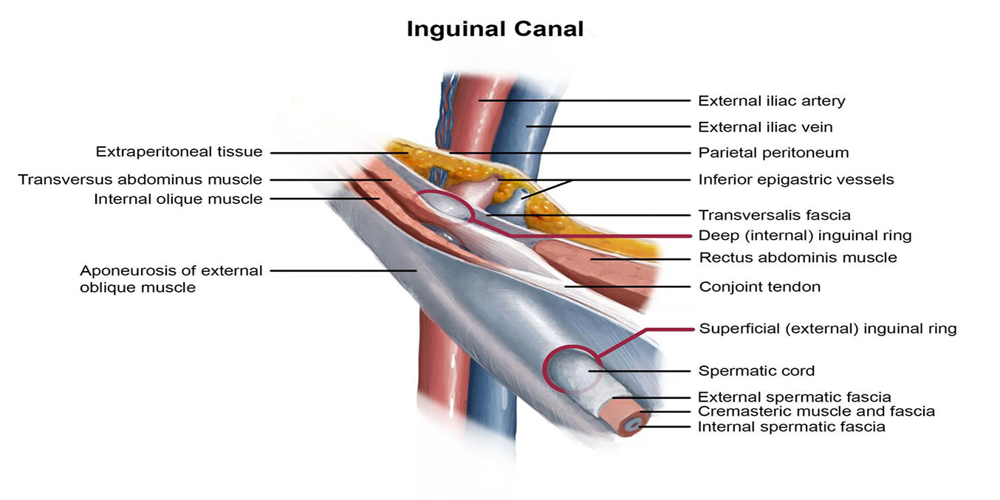
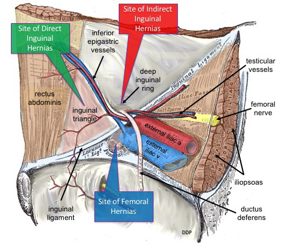
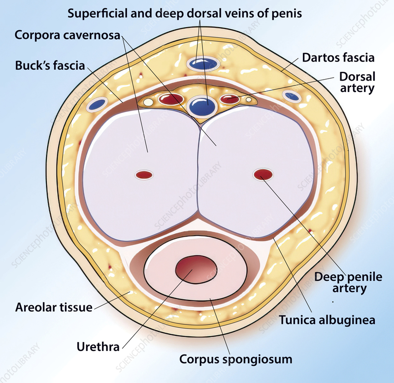
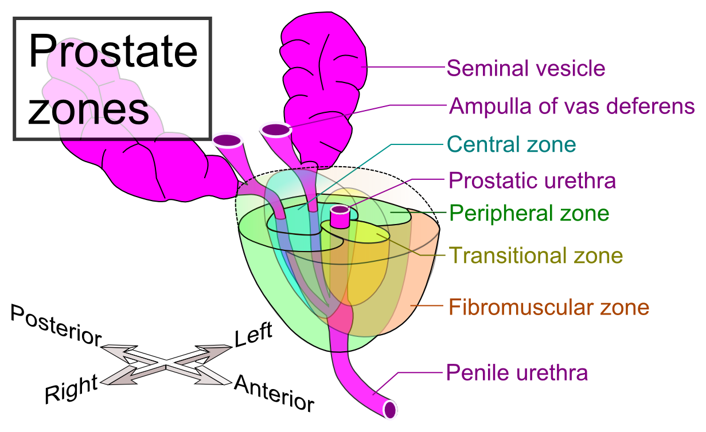
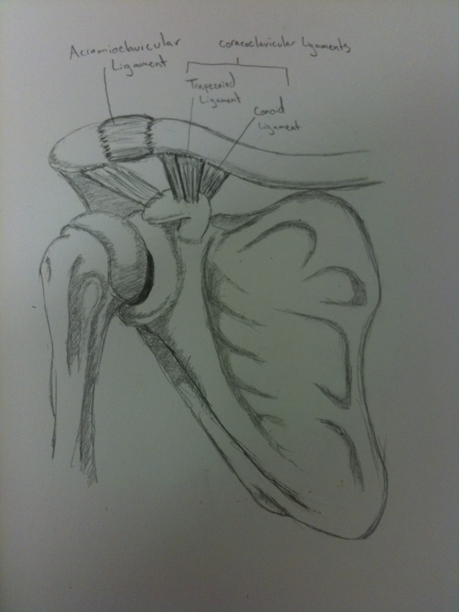
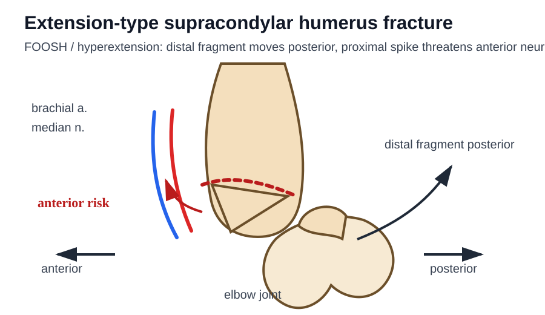
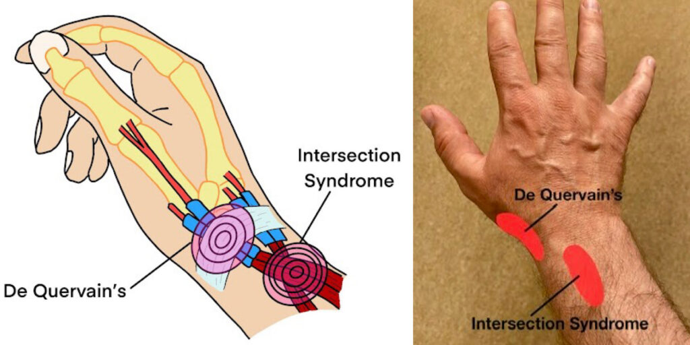

# 泌尿科（考題104）

- 泌尿腫瘤最常見histology快分：

  | 部位      | 最常見癌症                                |
  | ------- | ------------------------------------ |
  | 陰莖      | Squamous cell carcinoma（SCC，鱗狀上皮細胞癌） |
  | 膀胱      | Urothelial carcinoma（尿路上皮癌/移形細胞癌）    |
  | 腎盂、輸尿管  | Urothelial carcinoma（尿路上皮癌/移形細胞癌）    |
  | 腎臟實質    | Renal cell carcinoma（RCC，腎細胞癌）       |
  | 攝護腺/前列腺 | Adenocarcinoma（腺癌）                   |

## 腎臟疾病（考題21）

- Renal Cyst： >50 y/o盛行率3成； SS＝多無症狀（>10cm可能水腎）； 惡性特徵 ＝ 囊腫抽取物血樣（懷疑papillary cancer），CT （Bosniak分級高分，Septal，Nodular變化，強顯影； 低分Obs，高分RFA/手術全切）； Tx＝Acetaminophen、NSAIDs、經皮抽吸+注射硬化劑
- 腎臟外傷：1st泌尿系統外傷，男多，鈍傷為主，血尿量與嚴重度無關； 嚴重度（分五級）＝膜下血腫（1級）⭢1cm內撕裂傷（2）⭢未傷集尿系統（3）⭢傷集尿系統（4）⭢主血管/腎臟碎裂損傷（5）； Exam＝尿檢、影像學（CT、IVP）； Tx＝觀察（1-2級）、引流／手術（3-5級）
- 腎臟感染
  - Acute Pyelonephritis（好發性活躍女，UTI家族史，DM）： 80% E. coli； SS triad＝發燒、畏寒，knocking pain，；Exam＝CT（發炎處perfusion defects），尿培/血培一致率高； Tx＝oral anti 14days for 輕微，IV ampicillin/aminoglycoside （再加14 days if bacteremia）
  - Chronic Pyelonephritis： Recurrent UTI⭢scarred，shrink，Mainly兒童； SS＝多無症狀（也無感染），視力模糊，高血壓，蛋白尿； Dx＝影像學（CT/MRI）腎臟萎縮、疤痕； Tx＝控制感染、預防UV reflux（器質性問題，治療有限）
  - Emphysematous pyelonephritis（EPN，產氣性壞死性腎感染）：DM為大RF，E.coli/KB發酵產氣；SS＝sepsis/抗生素後仍未改善、pneumaturia；Exam＝CT/KUB腎實質/腎周gas；Tx＝IV抗生素＋控血糖＋引流/解除阻塞，嚴重才nephrectomy
  - Renal Abscess（難診斷）： 皮質＝Staphylococci，髓質＝E.coli，Proteus；SS＝畏寒腹痛解尿疼痛>2wks；Exam＝尿血培養>5成沒東西，影像2成正常； Tx＝廣效抗生素（vancomycin，cephalosporin），CT引流 if anti 48hr無果，手術
- 腎臟腫瘤
  - Renal parenchymal neoplasms實質腫瘤：
    - Benign
      - Oncocytoma嗜酸細胞瘤（男性無症狀，影像不典型（像RCC），Exam＝ FNAC（棕色病灶）； Tx＝燒灼，超音波
      - Angiomyolipoma血管肌肉脂肪瘤（AML＝hamartoma錯構瘤，女多，黃病灶，60%合併結節硬化； Exam＝Echo（白色高回音）+CT（黑色）； Tx＝切除/動脈栓塞（>4cm/ 會痛）
    - Malignant
      - RCC（85%，見下方說明)
      - Meta（來源：肺（20%）>乳>胃）
      - tumor（兒童）：多無症狀，太大才被發現，Tx＝主手術，放化療都有反應
  - Renal Cell Carcinoma（黃富含脂質）： 好發老黑男； 病因＝ 體顯遺傳病（VHL dx，Hereditary renal carcinoma），環境因素（抽菸、石棉）； 病理＝mixed carcinoma； SS＝無症狀（>50%）、副腫瘤症候群（高壓高鈣）；Exam＝抽血（ESR⭡、血尿、貧血）、Echo（準度高）、CT（arterial enhancement、venous early washout（HCC也會））、其他進階影像學/膀胱鏡都有效； Tx＝手術（唯一cure方法）、標靶治療（for 轉移性clear cell RCC）
    - Metastatic RCC risk model：International Metastatic Kidney Cancer Database Consortium（IMDC，轉移性RCC預後分層）＝Karnofsky performance status低、Dx-to-Tx<1yr、Hb低、corrected Ca高、neutrophil高、platelet高；lactate dehydrogenase（LDH）屬Memorial Sloan Kettering Cancer Center（MSKCC）舊模型，不是IMDC
  - Renal pelvic/ ureteral tumor（腎盂/輸尿管腫瘤）： 40%合併膀胱癌（尿路上皮細胞癌1st部位）； RF＝橡膠/苯暴露、濫用止痛藥、中藥馬兜鈴酸、埃及血吸蟲；種類＝Transitional Cell carcinoma移形細胞癌（90%）、SCC（8%）、Adenoma（1%）、Fibroepithelial polyp（1st良性）；Exam＝CT/MRI/Sono（鈣化，papillary necrosis）、輸尿管鏡（filling defect/切片，非必要，會低估且不影響處置）；Tx（放療無效）＝手術、雷射、化學治療（cisplatin for 遠端轉移，palliative，對延長生命無效）
- 腎臟移植：
  - 捐贈者：活捐者預後同一般人；死捐者：5-50y/o，50-60有高血壓/腦血管dx，>60健康可捐
  - 體外保存液＝高鉀，低鈉，4度保存
  - 受贈者評估：ABO血型/T cell cross match即可，HLA相對沒關係； 90%保留原腎，移除理由＝頑固性高血壓（1st），嚴重蛋白尿，持續感染因子（結石囊腫逆流）
  - 手術：捐左腎（靜脈長），種右邊（iliac fossa）⭢術後觀察血流（中心靜脈壓10-15cm）/腎功能（creatinine過一週還上升要洗腎，主因ATN）/排尿量（echo看有無阻塞／廔管/血流不足）
  - 禁忌症＝active感染/腫瘤（原位癌例外，可移植）、周邊動脈血管硬化、腎還有救（e.g. cystinosis胱氨酸血症）
  *過去有TB感染要投藥isoniazid 一年才可移植

## 下泌尿道（考題16）

- 解剖
  - 男：尿道口→陰莖段尿道 / 海綿體尿道→ 球部尿道→ 膜部尿道（尿道外括約肌 external urethral sphincter）→ 前列腺部尿道（精阜 verumontanum / seminal colliculus）→ 肥大的前列腺組織→ 膀胱頸（bladder neck）→ 膀胱
- 構造異常（多遺傳性，要手術）：
  - 輸尿管成因
    - 雙套：女多，具遺傳性； 分類＝{不完全型（Y，只有一條接膀胱多無症狀），完全型（兩條通道膀；上腎盂輸尿管易異位/ureterocele/阻塞，下腎盂輸尿管易VUR）}； Tx＝手術
    - Ureteropelvic junction obx（輸尿管腎盂接口處狹窄）：Mainly男左腎，多無症狀（infant嘔吐疼痛狀）；Echo，renal scan，voiding cystourethrogram（VCUG）；Tx＝手術，預後佳
    - 輸尿管開口異位（女多）
    - 膀胱輸尿管逆流（Grade I-V，III＝輕微擴大，IV＝輸尿管扭曲，V＝腎乳突壓跡消失）：成因＝瓣膜UVJ/肌肉無力（1st），結構異常，發炎； Tx＝手術
  - 膀胱成因
    - Interstitial cystitis（間質性膀胱炎）：40y/o 女；SS＝頻尿、尿急、骨盆痛； Exam＝動力學膀胱張力強/順應性差，膀胱鏡＝Hunner lesion（較特異，紅斑/放射狀血管/潰瘍樣病灶）或 glomerulation（粘膜點狀出血）； Tx＝飲食控制（少酒咖啡甜味劑）、藥物（amitriptyline）、膀胱灌藥（DMSO、lidocaine）、手術（膀胱灌水擴張、打肉毒）
- 外傷
  - 輸尿管外傷：多穿刺傷（cf. 腎/膀胱多鈍傷），Exam＝CT（Urinoma尿液腫，顯影劑外露）；Tx＝雙J導管引流（輸尿管受傷必備），手術
  - 膀胱外傷：多撞擊鈍傷（容器狀的都多鈍傷），男多； Exam＝逆行膀胱攝影； Tx＝腹膜外單純破裂導尿，腹膜內/複雜破裂手術
- 感染：
  - Acute Cystitis：女，DM； SS：急尿頻尿惡臭⭢直接Anti TMP-SMX 3-5天（症狀診斷，PCN類普遍抗藥不用，驗尿/影像skip）
  - Recurrent Cystitis：女； Tx＝移除感染源（if 尿中持續有菌），預防性抗生素（if 反覆治好又感染）
  - Urinary TB：>30y/o成人，SS＝多無症狀（if 腎/輸尿管/攝護腺感染），刺激/血尿（if 膀胱炎）； Exam＝尿檢（持續濃尿+培養陰性），觸診（輸精管球狀結節bead chain），X ray（Moth-Eaten腎盞），TB培養（fast stain/ 晨尿）； Tx＝抗結核藥物
- 膀胱癌（2nd泌尿道惡腫，cf. 攝護腺癌）：老白人病，75％診斷時膀胱局限； RF＝抽菸、橡膠、苯、膀胱受傷、洗腎； 種類＝移形上皮（90%）、SCC（5%，伴隨發炎，血尿，埃及血吸蟲）、Mixed carcinoma、Papilloma（＝PUNLMP低惡性泌尿乳突瘤）； SS＝間歇性血尿、頻尿； Exam＝膀胱鏡（確診）、影像（判斷轉移，X for肺，bone scan for骨）、Lab/cytology不準； Tx＝手術（TURBT）+膀胱灌藥物（Mitomycin C、BCG）⭢radical cystectomy（侵犯肌肉層（T2），切骨盆器官，合併骨盆淋巴廓清）⭢chemo（333 rule，1/3反應，1/3縮小，1/3沒反應）、Immune

## 外生殖器（考題29）

- 構造異常：
  - 先天性
    - post. urethral valve（漏尿，感染，水腎）：Exam＝VCUG，Echo（28wks即可見水腎）； Tx＝內視鏡燒灼
    - Hypospadias（尿道下裂，多分佈龜頭近端／冠狀溝）：家族遺傳性，胎兒孕期過度estrogen/progestin暴露； Tx＝保留尿道板+拿包皮重建皮瓣（不要行割禮），手術失敗要等6-12月再重建
    - Cryptorchidism（卡在睪丸下降路徑，prepubic為主）：RF＝早產/家族史； Tx＝睪丸固定（<1.5y/o），睪丸切除（>10 y/o，∵易睪丸癌（Seminoma））
    - 異位睪丸：卡在superficial inguinal為主（cf. Cryptorchidism）
    - Inguinal hernia：Indirect（小孩99%；MOA=patent processus vaginalis腹膜鞘狀突未閉合，從deep inguinal ring突出⭢走inguinal canal，inferior epigastric vessels外側；Tx＝高位結紮ASAP） vs Direct（老人；MOA=從Hesselbach triangle/posterior wall突出，inferior epigastric vessels內側，比indirect易復發；Tx=Mesh（c.f 兒童不常規Mesh））；Femoral hernia＝inguinal ligament下方/股靜脈內側，女多，incarceration風險高
      - Inguinal canal map：deep inguinal ring＝transversalis fascia開口；superficial inguinal ring＝external oblique aponeurosis開口；spermatic cord coverings＝internal spermatic fascia（transversalis fascia延伸）＋cremaster muscle/fascia（internal oblique延伸）＋external spermatic fascia（external oblique aponeurosis延伸）；ilioinguinal n.伴隨cord出superficial ring（不經deep ring），iliohypogastric n.不在spermatic cord；testicular a.來自abdominal aorta
      - 圖：
      - 圖源：本機下載圖片
      - 圖：
      - 圖源：Dennis M. DePace，PhD / Wikimedia Commons，CC BY-SA 4.0
  - 後天性
    - Priapism（陰莖異常勃起）：持續勃起>4hr，多缺血型（陰莖硬龜頭軟），其他＝白血病，藥物，外傷； Exam＝Doppler； Tx＝冰敷，放血，a-agonist，動靜脈瘻管
    - Penile Curvature（彎超過30度）：先天性＝白膜異常，尿道下裂，後天＝Peyronie's dx（發炎纖維斑塊化）； Tx＝Vit E，抗纖維藥，手術
    - Phimosis（包莖）：併發症＝龜頭炎，嵌頓式包莖，陰莖癌，性病⭡； Tx＝anti，手術
    - Urethral stricture（尿道狹窄）：Mainly ∵ INF； Tx＝擴張/重建
    - Testicular Torsion（睪丸扭轉）：青少年急症，Bell-clapper deformity（鞘狀膜異常包覆⭢睪丸可自由旋轉）； SS＝突發性陰囊痛，腫脹，高位/橫躺睪丸，negative Prehn's sign陰性（抬高不緩解），cremasteric reflex消失（Rabinowitz sign相關）； Exam＝Doppler（血流減少），Tc-99m cold； Tx＝手術復位，6hr內90%有救
      - 補：新生兒多extravaginal（常產前，預後差），青少年多intravaginal；開刀前先manual detorsion＝open the book（多由內向外轉，暫時恢復血流），正常側術中也要預防性固定
    - Varicocele（1st男不孕）：左側為主（∵nutcracker effect，左腎靜脈被 SMA /aorta 夾住⭢左側易血尿、varicocele）； Exam＝doppler靜脈>3.5mm，； Tx＝手術（70%改善精子品質）
- 感染：
  - 尿道炎：性傳播； 感染源＝淋病、非淋病（HSV、Chlamydia、Trichomonas）； SS＝5成無症狀、尿道分泌物、排尿疼痛；Exam（不依靠影像學）＝尿道取樣（分泌物取樣不準）； Tx＝抗生素（淋病ceftriaxone、非淋病doxycycline），預防>治療
  - Chlamydia三兄弟快分：

    | 菌種                    | 疾病                                                                                     | 典型情境          |
    | --------------------- | -------------------------------------------------------------------------------------- | ------------- |
    | Chlamydia trachomatis | 嬰幼兒非典型肺炎（無燒、結膜炎、Staccato cough）性病尿道炎/cervicitis、pelvic inflammatory disease（PID，骨盆腔發炎） | 性接觸；新生兒結膜炎/肺炎 |
    | Chlamydia pneumoniae  | 非典型肺炎                                                                                  | 社區感染、人傳人      |
    | Chlamydia psittaci    | psittacosis（鸚鵡熱）/非典型肺炎                                                                 | 鳥類暴露（鸚鵡、家禽）   |

  - 睪丸附睪炎：泌尿道感染後上行傳染，幼童多肺炎/病毒後感染引起； 成因＝E.coli（老人、小孩、肛交）、Chlamydia/ Gonorrhea（成人）； SS＝急性睪丸痛、腫脹、血精；Exam＝尿/血WBC⭡，超音波（增強血流，可DDx torsion）； Tx＝抗生素（ceftriaxone+doxycycline）、NSAIDs消炎、伴侶一起治療
  - Warts（性行為傳播）： Exam=膀胱尿道鏡； Tx＝電燒，5-Fu尿道貫注
  - Fournier gangrene（會陰部壞死性筋膜炎）： 好發：感染，局部外陰瘻管，DM；沿淺層筋膜蔓延（Colles' / Dartos / Scarpa's fascia），不是深層筋膜；Tx＝立即清瘡（不可少清），但睪丸、陰莖海綿體sparing（被deep Buck's fascia保護）
  
- 外傷： SS＝瘀青/陰莖血腫看Buck's fascia：Buck's fascia沒破＝血腫侷限陰莖；Buck's fascia破了⭢血液可進Colles' / Scarpa's / Dartos fascia，會陰/陰囊/下腹butterfly狀；Tx＝逆行性尿道攝影，膀胱造口引流（不可放foley），手術
  - membranous urethra（後段）：最常受傷，合併血腫&攝護腺上移（high riding prostate）
  - bulbous（前段）：陰莖前段1st；SS＝Straddle injury（跨座式傷害）
  - 陰莖骨折：白膜破裂
- 腫瘤
  - 睪丸癌：Mainly germ cell tumor（年輕男1st固態腫瘤； seminoma>non-seminoma）；淋巴擴散＝睪丸沿下降路徑回流⭢retroperitoneal/para-aortic nodes（非先到inguinal）； SS＝無痛腫大（70%）； Exam＝ Lab（HCG+AFP+LDH） + 影像（超音波深色病灶，CXR看肺部轉移，腹部骨盆CT看淋巴轉移）； Tx＝手術（睪丸必切除），化療（全Stage都可輔助，復發能化療就化療，不能就努力切），放療（for seminoma，中低Stage才做）
  - Penile cancer： RF＝>65 y/o，HPV（+），phimosis（包莖），抽菸，SCC為主；SS： Balanitis xerotica obliterans（BXO，閉鎖硬化龜頭，DM常見），陰莖無痛腫塊/潰瘍，腹股溝淋巴腫（發炎，非侵犯），Bowen's dx（紅色結痂），Erythroplasia of queyrat（紅皮潰瘍）； Exam＝病理最準（leukoplakia），Lab/影像都不準； 分級＝Jackson分級（1-4，1龜頭，2主幹，3淋巴結，4遠端）； Tx（if 無淋巴轉移8成可治癒，目標為保留陰莖）＝局部化療（Tis），手術⭢電燒⭢放療（T2）⭢抗生素（淋巴腫）

## 攝護腺（考題7）

- 感染：
  - 細菌性：多<50y/o，急性E.coli為主； SS＝下泌尿道症狀+系統性感染症狀（急性），無症狀（慢性）； Lab＝慢性可前列腺按摩後前段尿（取前列腺液）； Tx＝ 經驗性抗生素（急性6wks，慢性3m），恥骨上膀胱引流（for尿滯留，不要放foley）
  - 攝護腺膿瘍：好發於急性攝護腺炎沒治好，長期導尿，DM； SS＝攝護腺症狀+DRE摸到腫大脈動疼痛攝護腺； Exam＝超音波/CT； Tx＝影像引導引流
- 攝護腺增生（BPH）： 好發老男，Transitional zone細胞數增加（往外壓迫transition zone行程surgical capsule，可作為手術邊界）； SS＝LUTS下泌尿道症狀； Exam＝FUN-WISE score（Frequency、Urgency、Nocturia、Weak stream、Intermittent stream、Straining、Emptying，每項0-5分，>8分中度，>20分重度 ）； Tx＝藥物（for >8分，α-blocker（放鬆膀胱）、5α-reductase inhibitor（⭣攝護腺體積（40ml以上者才顯著），⭣癌症發生率；e.g. Finasteride、Dutasteride）、副交感（興奮劑/抑制劑皆有幫助）、TCA、手術（反覆發作，移除尿管失敗者，Transurethral Incision for<30ml，Transurethral vaporization for 30-80ml）

- 攝護腺癌：1st 泌尿癌症（美國男性第一癌，台灣前三），adenocarcinoma in peripheral zone為主； RF＝年齡，人種（黑>白>黃），紅肉飲食，特定營養缺乏（茄紅素，Vit D，Omega-3），轉移途徑經過Batson's venous plexus（脊椎靜脈叢）至脊椎骨盆； SS＝多無症狀，發現時已轉移（cf. 陰莖癌，膀胱癌）； Exam＝DRE像石頭，PSA>4ng/ml（當中free form比值越小越惡性），影像學（>5成經直腸超音波（TRUS）異常低回音），切片Gleason grading（最大片+最高分分數，7分中風險，>7高風險），MRI低訊號； Tx＝localized且預期壽命>10y看風險做active surveillance/根除性攝護腺切除/放療（TURP不是根除手術，hormone不當第一線單用），放療可合併androgen deprivation therapy（中風險6ms，高風險3yrs），metastatic則androgen deprivation therapy（雙側睪丸切除 or LHRH/GnRH agonist/antagonist效果相近）

## 結石（考題7）

- 流病：3rd泌尿系統dx（UTI⭢BPH⭢stone），RF＝結晶尿、家族史、飲食（高蛋白、重油、高鈉（非石頭成分但增加沉澱）、少蔬菜）、藥物、高社經地位、乾燥氣候、酸性尿、尿少（不需要高尿酸）； cf. 抑制結石成分＝硫，鎂，檸檬 （留美檸檬）
- 種類：Calcium calculi（含鈣結石，80%），非含鈣結石（Struvite結石（磷酸銨鎂）＝女性尿路感染/Proteus，尿酸結石＝男性痛風病史，Cystine結石（胱胺酸結石）＝小孩/年輕＋hexagonal六角形結晶，Indinavir結石＝AIDS Indinavir用藥）；Staghorn鹿角結石＝形狀/範圍名（分枝填滿renal pelvis/calyces，常為struvite感染石），不是成分名
- SS：hematuria（9成），pain（colicky pain＝石頭拉扯痛，noncolicky pain＝積尿痛，石頭大小與痛度無正比關係），三狹窄堵塞（UPJ輸尿腎盂，iliac vessels髂血管旁，UVJ輸尿膀胱），感染（Mainly Proteus（struvite結石））；
Exam＝首選 NCCT（non-contrast CT；可見多數結石與阻塞，indinavir 可看不到）、KUB（可見radiopaque stone含鈣較清楚，struvite可見但較模糊；uric acid/indinavir常看不到）、US 適合孕婦/小兒或看 hydronephrosis、Retrograde pyelography（可見 filling defect，常用於CT不清楚、不能打IV contrast或術中定位），c.f RUG是尿道外傷/狹窄檢查，只能到膀胱；
- Tx＝危急先引流（感染性阻塞/AKI/anuria⭢stent或PCN＋抗生素），hydration（喝水2500ml⭡，排水2000ml⭡），改變尿pH（含鈣結石⭢citrate（抓走 free Ca）/避免鹼化，尿酸/Cystine結石⭢鹼化尿液（Cystine亦可用Tiopronnin/Penicillamine抓走），Struvite結石⭢酸化尿液），碎石/取石（小輸尿管結石可觀察/MET，<1cm ESWL/URS，>1-2cm或staghorn⭢PCNL），低普林/減少動物蛋白，藥物（febuxostat降尿酸生成，禁用Benzbromarone（⭡尿酸排出））
  - 草酸鈣結石特點：pH值在生理範圍內影響不大，攝取鹼性物質(for ⭡尿中Citrate，不要過度鹼化尿液)，要補鈣（減少腸道草酸吸收）
  - 磷酸鈣結石特點：腎本來就不好(e.g Tumor lysis)，不用特別酸化尿液
  - 鹼化尿液特點：Potassium based Bicarbonate9為主，Sodium based會增加Ca排出
  - ESWL體外碎石禁忌：孕婦，腹主動脈瘤，重度水腎，出血傾向

## 泌尿道細菌感染（考題0）

- 宿主防禦＝沖刷，上皮，女＝乳酸菌保護，男＝Zinc in 前列腺
- 導尿管：放一天多5%感染率
- 常用藥：廣泛anti＝TMP+SMX（for uncomplicated UTI；綠膿/Enterococci無效，孕婦小孩禁用）、Fluoroquinolone（for G（-）；孕婦小孩禁用）、Nitrofurantoin（for G（-）/Enterococci；綠膿/Proteus無效，孕婦小孩禁用）、Amynoglycoside（for G（-）Enterococci；腎耳毒性，孕婦小禁用）、PCN（孕婦可用，但多數細菌有抗藥性）、Cephalosporin（孕婦可用）

## 泌尿道功能工程（考題1）

- Urodynamics： 評估內容＝Urinary flow rate（尿流速圖，鐘型曲線，最大流速<15懷疑<10確診阻塞/逼尿功能障礙），Cystometrogram CMG（膀胱壓力圖； 逼尿肌壓力（Pdet）＝膀胱內壓（Pves）-腹內壓（Pabd）； 膀胱體積＝150ml開始尿意，450最大容積），Urethral pressure profile/Sphincter electromyography（尿道壓力圖/括約肌電圖 for括約肌偵測），Videourodynamic（尿路攝影＝影像＋pressure-flow/CMG）
- 下泌尿道功能異常
  - 排尿困難：收縮問題（detrusor hyporeflexia），出口問題（狹窄，外擴約肌異常）
  - Postoperative urinary retention（POUR，術後尿滯留）：RF＝男/高齡/BPH，IV fluid過多（膀胱過度充盈），spinal/epidural anesthesia>general anesthesia（抑制排尿反射），anorectal/pelvic surgery（疼痛與反射性括約肌收縮），opioid/抗膽鹼； Tx＝膀胱掃描，導尿/間歇導尿，處理疼痛與藥物
  - 尿失禁：Mainly女（盛行率>4成）； Exam＝Marshall test（Lithotomy position，膀胱灌水後咳嗽看漏尿量）； 分類＝{Stress（活動漏尿 in中年女骨盆肌肉鬆弛； Tx＝Kegel運動，口服Duloxetine，手術），Urge（急迫性漏尿，逼尿肌不自主收縮，in女/中風帕/金森； Tx＝Kegel運動，口服抗膽鹼（toleridone，oxybutynin），M3抑制劑（solifenacin）），Overflow（積尿漏尿； e.g BPH阻塞，detrusor無力排尿； Tx＝治療原發病因，可能需要導尿），Mixed（混合性漏尿）}
  - Neuropathic bladder（儲尿中樞＝橋腦，排尿中樞＝旁水道灰質（PAG，參與儲尿與排尿轉換，額葉抑制與交感/陰部神經才是維持留尿的主力））： 分類＝{S2以上受傷：S2-4薦反射弧保留，膀胱過動； S2以下受傷：薦反射弧受損，膀胱無力/鬆弛，overflow incontinence}
    - Tx （Goal：膀胱儲尿時保持低壓，防止感染）
      - 過動膀胱：副交感阻斷（oxybutynin，trospium），膀胱內灌藥，肉毒
      - 無力膀胱：膀胱訓練，副交感興奮，間歇導尿

## 男性學（考題7）

- 性功能障礙（早洩，遲洩，逆行射精，無高潮症，勃起障礙）
  - 神經：Erection＝副交感S2-4（pelvic splanchnic（Cavernosal nerve），NO）；Emission/射精前段＝交感T11-L2（hypogastric，輸精管/精囊/前列腺收縮＋內括約肌關閉）；Expulsion/射出＝陰部神經S2-4（bulbospongiosus收縮）
  - 勃起障礙（ED＝impotence）： 好發抽菸、DM、HTN、CAD（80%）、PAD（90%）； Exam＝ 空腹血糖（排除DM）、血中睪固酮／prolactin（抑制testosterone）、夜間陰莖勃起測試（Snap-Gauge test套三跟橡皮經看破幾條； if正常⭢排除器質因素）、Doppler超音波（血流量）； Tx＝治療原發病因、PDE5抑制劑（sildenafil，抑制PDE-5，增加NO-cGMP）、陰莖注射藥物（prostaglandin E1）、真空裝置、手術（陰莖假體植入）
  - 男性不孕症：一年無套未孕； 成因＝{睪丸前（下視丘-垂體-睪丸軸問題），睪丸內（染色體（Klinefelter's disease（47XXY，小睪丸男性女乳），Noonan's），varicocele）），睪丸後}； Exam＝ 排除藥物（血壓CCB、BB、spironolactone、尿酸（秋水仙、allopurinol）、精神科藥）、PE（正常大小18ml）、精液分析（正常>1.5ml、>15 million/ml、活動率>40%、正常形態>4%）； Tx＝underlying dx、Endocrine tx（1st內科治療，用clomiphene/SERM）、手術
  - 低testosterone但想生育：禁用外源性testosterone（抑制GnRH-LH/FSH⭢睪丸內T下降⭢spermatogenesis變差）；可用SERM（clomiphene），aromatase inhibitor，hCG刺激內源性T

## 腎上腺（考題16）

- Anatomy： 皮質（分三層，從外到內（GFR，醛皮性）： Zona glomerulosa （球狀帶，Mineralocorticoid（Grami葛萊美球場），又名Aldosterone，與血壓有關，過多 ＝Conn's），Zona Fasciculata （束狀帶，Glucocorticoid，又名cortisol，過多 ＝Cushing（口訣：束庫帶），過少 ＝Addison's），Zona Reticulosa （網狀帶，Androgen 口訣＝網路宅男），髓質（分泌Catecholamine，Epinephrine/NE（過多 ＝Pheochromocytoma））
  - Conn's dx（原發性醛皮質素增多症，治療預後good）：特徵 ＝ 高壓低鉀頭痛夜尿； Exam＝aldosterone/renin ratio>30（Aldosterone⭡，Renin⭣），24 hr尿中Aldosterone⭡； Tx＝手術切除（單側），藥物（Spironolactone+ Amiloride for雙側）
  - Cushing's：成因 ＝Cushing dx（80%，腦垂Adenoma，hyperplasia），Adrenal tumor（20%，<4cm 良性Adenoma，>6cm惡性Carcinoma，故腎上腺tumor>4cm一概切除），Ectopic ACTH syndrome（非垂體腫瘤分泌ACTH，如小細胞肺癌（長低血鉀/代謝鹼中毒））
    - SS ＝ Buffalo hump，Central obesity，皮膚變薄，易瘀青，骨質疏鬆，DM，Hirsutism，Moon face；
    - Exam  ＝ Cortisol screen（24hr尿游離Cortisol⭡/夜間給1mg Dexamethasone 但Cortisol⭡）； Cortisol Diag（Dexamethasone 0.5mg q6h for 2 days仍無抑制可確診），ACTH（<10（Adrenal tumor（排腹部CT），ACTH independent），>10（腦垂Adenoma/ Ectopic adenoma，排腦部MRI），>200（Small cell lung ca.，排胸部CT））
    - Tx ＝ 手術切除腫瘤（腦垂/Adrenal tumor，成功率80%）⭢類固醇~3年，藥物治療（Ketoconazole抑制Cortisol合成，for 其他難手術者）
  - Adrenal insufficiency（腎上腺功能不全）：
    - Primary （原發性，Addison's disease）： 1st，腎本身被破壞（自體免疫攻擊/感染 （幼兒綠膿，腦膜炎球菌血症）/出血 （成人凝血功能異常）/藥物 （Ketoconazole，Rifampin）/遺傳性 （21-hydroxylase缺乏））
      - Primary特異SS ＝高血鉀，Hyperpigmentation （ACTH過多刺激Melanocyte stimulating hormone）
    - Secondary（次發性）： 腦垂體無法製造（外部壓迫/Glucocorticoid長期使用）
    - 共同SS ＝疲倦，體重減輕，食慾不振，低血壓，低血糖，低血鈉
    - Exam＝ 注射250ug Cosyntropin（合成的ACTH）⭢primary無反應，secondary早期可有反應、久病可能反應差
    - Tx ＝cortisone
      - 用長效藥物（Dexamethasone，可過BBB）可減少生理影響，另外越長效Glucocorticoid越強，Mineralocorticoid作用越弱）
      - 副作用：短期脈衝<長期少量投藥； ∴急性狼瘡用脈衝
    - 特殊狀況 ＝Adrenal crisis（急性腎上腺危象）： 成因 ＝感染/手術/外傷/停藥 導致急性Adrenal失能； SS ＝休克，發燒，嗜睡； Tx ＝IV fluids + IV hydrocortisone； Critical illness related Adrenal insufficiency（Relative AI）： 重症病人腎上腺需求上升6~10x，無法應付壓力，SS ＝休克，Tx ＝IV hydrocortisone
  - Pheochromocytoma嗜鉻細胞瘤（＝adrenal medulla chromaffin cell tumor，常分泌Catecholamine，代謝物＝Metanephrine）
  cf. Paraganglioma（＝extra-adrenal paraganglia tumor，可分泌Catecholamine）
    - Rule of 10： 腎上外10%，雙側侵犯10%，家族性10%，惡性10%）
    - SS： 5P ＝{Pressure（高血壓），Pain，Palpitation，Perspiration（多汗），Pallor（血管收縮蒼白）}
    - 診斷： 24hr尿Metanephrine⭡（也可Vanillymandelate（VMA）/Catecholamine），CT/MRI定位，MIBG scan（if懷疑長在腎上腺外）
    - Tx（完整切除為目標）： α-blocker/ β-blocker控血壓⭢手術
  - Adrenal incidentaloma（偶發腎上腺腫瘤，）： 偶發腎上腺腫瘤，排除Pheochromocytoma且有惡腫hx；Exam＝CT/MRI，CT guide FNA（主要用來評估轉移，良惡性區分不佳）；Tx＝切除 if 功能性腫瘤/ 無功能>6cm/ 惡性特徵（不規則邊界，密度>10HU，增強後washout<50%）
  - Neuroblastoma（神經母細胞瘤，5成長在腎上腺，7成發現時已轉移，預後差）：兒童腎上腺惡性腫瘤，3rd兒童癌症； SS＝腹部腫塊，發燒，骨痛； Dx＝CT/MRI，24hr尿VMA/HVA⭡； Tx＝手術切除+化療

# 外科（考題3）

## ERAS 術後加速恢復（考題0）

| 面向   | 要點                                                              | 考點                                          |
| ---- | --------------------------------------------------------------- | ------------------------------------------- |
| 腸道準備 | Mechanical bowel preparation（MBP，清腸）＋oral antibiotics           | 特別是左側大腸/直腸手術，降低surgical site infection（SSI） |
| 禁食   | 避免長時間NPO；術前2小時可喝碳水化合物飲品                                         | 減少胰島素阻抗/術後不適，不是傳統一路禁食到手術                    |
| 疼痛   | Multimodal analgesia（多模式止痛）：NSAID＋acetaminophen＋gabapentinoids等 | Opioid-sparing，減少腸麻痺/噁心/呼吸抑制                |
| 管路   | 不常規放NG tube或引流管                                                 | 減少感染/活動限制，促進早期進食與下床                         |
| 液體   | Goal-directed fluid therapy（GDFT，目標導向液體治療，不過度輸液）                | 避免過多水腫或過少低灌流                                |

## 咬傷傷口感染（考題0）

- 咬傷感染風險看部位；「任何部位均高風險」太絕對。

| 風險  | 部位            | 原因                     |
| --- | ------------- | ---------------------- |
| 高   | 手部、足部、生殖器、關節  | 血循較差或結構複雜，深部感染/關節侵犯風險高 |
| 低   | 臉部、頭皮、軀幹、近端肢體 | 血循較豐富                  |

| 來源  | 主要病原                                   | 首選抗生素                              |
| --- | -------------------------------------- | ---------------------------------- |
| 貓咬  | Pasteurella multocida（感染快、深部穿刺）        | Amoxicillin-clavulanate（Augmentin） |
| 狗咬  | Pasteurella、Capnocytophaga（脾切/酒癮者怕敗血症） | Amoxicillin-clavulanate（Augmentin） |
| 人咬  | Strep、Staph、Eikenella、厭氧菌              | Amoxicillin-clavulanate（Augmentin） |

## 常見手術 bail-out（考題0）

- Bail-out原則：解剖不清/病人不穩/吻合不安全時，不硬切不硬接；改成控制污染/出血＋引流/造口/分期手術
- Laparoscopic cholecystectomy（膽囊切除）：Calot triangle解剖不清、critical view of safety做不出來⭢subtotal cholecystectomy（fenestrating開個洞肚皮引流/reconstituting）或cholecystostomy；腹腔鏡轉open只是換視野，不等於安全
- Appendicitis abscess/phlegmon（闌尾膿瘍/發炎塊）：不硬切；抗生素±percutaneous drainage
- Colon/rectum（結直腸手術）：污染重/低灌流/休克/吻合張力大⭢不要primary anastomosis；bail-out＝diverting stoma近端肚皮造口/Hartmann procedure遠端封起來
- Abdominal trauma/sepsis（腹部外傷/敗血症）：不穩＋coagulopathy/acidosis/hypothermia⭢damage control surgery（packing/暫時關腹）＋ICU復甦後planned reoperation
- Thyroidectomy（甲狀腺切除）：雙側手術若第一側recurrent laryngeal nerve（RLN）loss of signal⭢停做對側，staged thyroidectomy避免雙側聲帶麻痺

## Lap/Open/Robot 選擇快辨（考題0）

- Laparoscopy明顯贏open：cholecystectomy/appendectomy/fundoplication/colectomy；主要贏＝傷口小、疼痛少、住院短、恢復快、wound infection/incisional hernia少（colectomy另記：短期恢復佳，oncologic outcome可相近）
- Robot真正強項：radical prostatectomy（失血/輸血少、住院短）、partial nephrectomy（深部縫合/renorrhaphy較順、保腎手術較好做、失血/住院少）、deep pelvic surgery（狹窄骨盆內3D視野＋wristed instruments好縫合/剝離）
- Robot沒明顯贏lap：appendectomy/cholecystectomy/hernia repair/多數一般外科；常見問題＝outcome相近但cost高、OR time長
- 反例：early cervical cancer radical hysterectomy（LACC trial）＝open優於minimally invasive surgery（lap/robot），DFS/OS較好；不要套用「微創一定比較好」

## 腹內感染（考題0）

- 抗生素duration：重點看source control；未穿孔闌尾炎切除後不用延長；未穿孔腸壞死切除後≤24hr；穿孔/複雜腹內感染source control足夠約4天；腹內感染合併敗血症/休克約7-10天

## 整形外科重建（考題3）

- Reconstruction ladder：primary closure ⭢ skin graft ⭢ local/regional flap ⭢ free flap；骨/肌腱/血管外露、感染/放療後受床差時偏向flap
- Mangled limb（嚴重碾壓/複合肢體傷）：Life over limb（ATLS/ABC）⭢ limb survival（revascularization，warm ischemia盡量<6hr；必要時先vascular shunt）⭢ function（神經/肌腱/皮瓣重建）
- 重建順序口訣BEANS＝Bone → Extensors/tendon（肌腱）→ Arteries → Nerves → Soft tissue（皮瓣）；原則＝bone before nerve，先穩定骨架再做精細血管/神經吻合，避免骨折復位牽拉撕裂吻合處
- Skin graft：無自帶血流，靠受床存活；split-thickness較易存活/donor可再生但secondary contraction與色差較多，full-thickness外觀較好/收縮少但需血流好且donor需縫合
- Flap：自帶血流；local/regional保留pedicle，free flap需microvascular anastomosis；random靠皮下血管叢，axial有明確血管
- Breast reconstruction：autologous（DIEP/TRAM，自體組織重建）較自然但手術大，free flap受區血管常用internal mammary
- 常考血供：PMMC胸大肌＝thoracoacromial a. pectoral branch（不是internal mammary）；submental flap＝submental a.（from facial a.）；supraclavicular flap＝supraclavicular a.；latissimus dorsi＝thoracodorsal a.（Mathes-Nahai type V）；TRAM/DIEP＝deep inferior epigastric系統

# 骨科（考題48）

## 脊椎與神經根（考題7）

- 上頸椎骨折快分：

| Fracture           | 位置 / 本質                                                                    | 常見機轉                                             | 影像與穩定性考點                                                                       | 考題一句話                                      |
| ------------------ | -------------------------------------------------------------------------- | ------------------------------------------------ | ------------------------------------------------------------------------------ | ------------------------------------------ |
| Jefferson fracture | C1 atlas burst fracture，前後弓/環狀結構破裂                                         | Axial loading（跳水、頭頂受力）                           | C1 lateral mass向外分開；重點看transverse atlantal ligament是否斷，斷了就不穩                   | C1爆裂＝Jefferson；因環往外爆，單純型較少神經缺損             |
| Odontoid fracture  | C2 dens（齒突）骨折                                                              | 老人跌倒低能量或年輕高能量；flexion/extension都可                | Anderson-D'Alonzo：Type I尖端較穩；Type II齒突基底最常見且nonunion風險高；Type III延伸進C2 body較易癒合 | C2齒突＝Odontoid；考Type II不癒合                  |
| Hangman fracture   | C2 pars interarticularis / pedicle雙側骨折，traumatic spondylolisthesis of axis | Hyperextension + axial load/distraction，車禍/吊刑型機轉 | C2相對C3前移；看C2-3 disc/ligament injury與位移角度，穩定型多可外固定                              | C2 pars斷＋C2 on C3＝Hangman；神經缺損也常不明顯，因椎管被拉寬 |

- Denis three-column theory（三柱理論；胸腰椎骨折穩定性）：anterior column＝ALL＋椎體/椎間盤前半，middle column＝椎體/椎間盤後半＋PLL（最關鍵/最不穩），posterior column＝椎弓＋後方韌帶群；單純骨鬆wedge compression fracture多只傷前柱＝stable，Tx＝保守/止痛/支架±骨鬆治療；若傷到middle column（burst fracture、後壁retropulsion）或≥2柱受損，要想unstable/神經壓迫/手術固定
- Spinal nerve roots出孔規則：Cervical有8條root但只有7節vertebra，故C1-C7 root從同名椎骨上方出，C8從C7-T1出；T1以下root從同名椎骨下方出

| 區域     | 出孔規則                    | 例子                                           | 記法                                  |
| ------ | ----------------------- | -------------------------------------------- | ----------------------------------- |
| C1-C7  | root從同名vertebra上方出      | C6 root從C5-6 foramen出                        | 頸椎C5-6壓C6（看下面那條root）                |
| C8     | 從C7-T1 foramen出         | C7-T1壓C8                                     | 多一條C8 root，無C8 vertebra             |
| T/L    | root從同名vertebra下方出      | L4 root從L4-5 foramen出；L5 root從L5-S1 foramen出 | 胸腰椎foramen看上方同名root                 |
| Sacral | sacral foramina多看同名root | S1 root從S1 foramen出                          | L5-S1 disc後外側突出常壓S1 traversing root |

- 狹窄/骨刺/椎間盤壓哪條root：

| Lesion level   | Foraminal stenosis / 骨刺（壓exiting root） | Paracentral/posterolateral disc / lateral recess（壓traversing root） |
| -------------- | -------------------------------------- | ------------------------------------------------------------------ |
| Cervical C4-5  | C5                                     | C5                                                                 |
| Cervical C5-6  | C6                                     | C6                                                                 |
| Cervical C6-7  | C7                                     | C7                                                                 |
| Cervical C7-T1 | C8                                     | C8                                                                 |
| Lumbar L2-3    | L2                                     | L3                                                                 |
| Lumbar L3-4    | L3                                     | L4                                                                 |
| Lumbar L4-5    | L4                                     | L5                                                                 |
| Lumbar L5-S1   | L5                                     | S1                                                                 |

- 判斷規則：foramen變窄（foraminal stenosis/骨刺/isthmic spondylolisthesis）壓正在走出去的exiting root；central/paracentral/posterolateral disc或lateral recess壓還在椎管內往下走的traversing root
- Cervical補充：頸椎root短且斜向外走，沒有lumbar cauda equina那種長距離traversing root概念；C5-6 foramen的exiting root就是C6，C5-6 disc常壓C6（太中央則壓spinal cord）
- 考試一句話：Cervical不管狹窄/骨刺或disc，多記「C5-6壓C6、C6-7壓C7」；Lumbar要分位置，L5/S1 isthmic spondylolisthesis壓exiting L5，L5/S1 posterolateral disc壓traversing S1
  - 圖：
  - 圖源：Orthobullets

## 足踝關節（考題1）

- 踝關節Fx： 1st單踝骨折； 車禍，老人； 韌帶＝ATFL（ant. talofibular lig.防止前滑脫，最常斷∵Supination-External rotation內翻）+PTFL（最壯）+CFL（calcaneofibular lig. 防止內翻）； Exam＝ Xray（根據Ottawa ankle rules，malleolar/midfoot zone踩到地會痛就照）； Tx＝一律先上石膏； 手術（if 骨折位移>3mm）
- Calcaneus 跟骨 Fx： ∵高處跌落，車禍，常合併subtalar joint關節內骨折（talar-calcaneus post. facet）； SS＝高處跌落史，無法負重，Mondor sign（Hematoma延伸腳底）； Exam＝ Xray量Bohler's angle（<20度有fx）； Tx：Open reduction and internal fixation（ORIF，合併其他骨折），固定（if只有跟骨）
- 阿基里斯撕裂傷：運動男； SS＝小腿腳踝腫，小腿跟骨交界凹陷； Exam＝Thompson's test（壓Gastrocnemius muscle壓腓腸肌時足部無plantar flexion）； Tx＝儘速手術避免攣縮

## 膝關節（考題3）

- 前十字韌帶（ACL）撕裂傷： pop一聲，局部腫痛，女性高機率合併外半月板受損； 併發症＝ unhappy triad（ACL前十字韌帶，medial collateral lig內側副韌帶，medial meniscus內半月板）； Exam＝ Lachman test（最敏感，30度下小腿相對往前拉）； Tx＝手術重建（年輕，unhappy triad一起斷，之前ACL reconstruction失敗），保守治療（年長活動少者）
  - ACL function：防止anterior tibial translation；參與screw-home（膝伸直末端引導tibia external rotation）；分支＝AM（flexion緊）/PL（extension緊）
- 後十字韌帶（PCL，人體最強韌帶）撕裂傷： SS＝下樓不舒服； Exam＝ Posterior drawer test（最敏感，膝蓋90度垂直後推疼痛）； Tx＝手術重建（合併ACL，膝關節不穩定，bony avulsion），保守治療（單純PCL斷，膝關節穩定）
- 半月板（Type I collagen，內大C外小O）：好發中年男性，扭轉，蹲踞受傷，Commonly內半月板，verticle tear； SS：腫脹，locking感； Exam＝ McMurray test（膝髖收縮再伸直），Tx＝部分切除，修補，transplant，避免全切除
- Osteochondritis dissecans（OCD，分離性骨軟骨炎）：青少年/年輕人，常見膝/踝/肘；軟骨下骨病灶不穩定⭢loose body（關節內游離體）/locking；Exam＝MRI（非老人股骨頭AVN）

## 創傷（考題4）

- 復位（骨頭相對位置接好）：封閉式＝皮膚肌肉完整，不見骨； 開放式＝皮膚肌肉破裂，骨頭外露
- 固定（斷骨兩端接合）： 外固定＝固定器沒碰骨頭，e.g 石膏 ； 內固定＝釘在骨頭上
- 開放性骨折（骨頭外露）： 常見感染＝S.aureus； 分類（Gustilo-Anderson classification） ＝ I（傷口<1cm），II（1-10cm），III（傷口>10cm or Dirty，IIIA軟組織覆蓋骨頭，IIIB沒覆蓋，IIIC神經血管受損）； Tx＝清洗/留culture ⭢ 外固定（有感染） ⭢secondary closure+內固定（感染解決後）
- Penetrating extremity trauma（穿刺性四肢傷）：先看vascular injury hard signs＝pulsatile/active bleeding、expanding hematoma、pulse deficit/ischemia（5P）、bruit/thrill（AV fistula/pseudoaneurysm）；有hard sign⭢vascular surgery/手術評估，無hard sign再做ABI/CTA；噴血先direct pressure/止血帶，不盲夾血管
- Femoral shaft fx（股骨幹骨折）：雙峰，年輕車禍，年老摔倒；Ankle-Brachial index（<0.8懷疑腳血管阻塞）； Tx＝survey頭胸腹（股骨不易斷），穩定vital sign，骨釘內固定（IM fix，有開放性骨折要等感染控制後再做）； 併發症＝INF，長短腳，Malrotation，Malunion
- Tibial-Fibula fx： 常見骨折，車禍，脛骨承重、腓骨相對非承重（不嚴重可觀察就好）； 併發症： tibial head fx＝common fibular nerve受傷，tibial shaft fx＝deep peroneal nerve受傷（common fibular n. 繞過tibial外側分出）； Tx＝Obs（if 沒有傷及神經血管關節），開刀（if 神經血管關節受傷）
- acute compartment syndrome：5P（Pain（受傷與疼痛不成比例）、Pallor、Paresthesia（麻木）、paralysis、pulselessness）； Tx＝移除外部壓迫＋筋膜切開（腔室壓>30 mmHg或delta pressure<30 mmHg），必要時清創壞死肌肉

## 骨盆與髖部（考題3）

- 一堆classification
- 上到下：pelvis⭢femoral head ⭢ femoral neck ⭢ intertrochanteric
- Osteonecrosis of femoral head（ONFH）： 年輕亞裔，8成雙側侵犯； 成因＝外傷（骨折），非外傷（類固醇，酒精，SLE，感染）； 分期＝FICAT stage； Exam＝Xray(Crescent sign)，MRI（骨頭線段紋路，T1=Serpentine low signal band，T2=Double line sign）SS＝前髖部痛，爬樓梯加重； Tx＝保守治療（早期，NSAIDs止痛），外科（FICAT III以上要人工關節）
- Arthroplasty infection prevention：預防性抗生素依菌相/RF選擇（常用cefazolin）；Timing＝切皮前60min內給藥（vancomycin因輸注時間可在120min內開始），術後通常24hr內停；vancomycin/clindamycin不是routine人人用（MRSA高風險或β-lactam allergy才考慮）
- Piriformis syndrome（梨狀肌症候群）：梨狀肌緊繃/肥厚壓迫坐骨神經；SS＝臀部深層痛，久坐/姿勢誘發，局部壓痛，可有坐骨神經痛；誘發＝FAIR test（hip Flexion屈曲 + Adduction內收 + Internal Rotation內旋）誘發臀痛/坐骨痛（cf. 髖關節術後也避免FAIR）
- Femoral neck fx（femoral head to intertrochanteric line）：Mainly 老人； SS＝Medial circumflex femoral a. 受損＋血腫，難癒合（∵ 此處沒有periosteum包覆）； 分類（Garden classification） ＝ 沒有移位I-II（內固定預後佳； I不完全骨折、II 完全骨折）、III（部分移位）、IV（完全移位）； Tx＝內固定（for I、II、<60 y/o的III、IV）、半人工髖關節置換（for >60 y/o的III、IV）
- Intertrochanteric fx（intertrochanteric line以下，大轉子與小轉子之間）： 特性＝癒合力好（cancellous bone，metaphysis處血流佳（所以罕見avascular necrosis），有periosteum）； 分類（Evans classification） ＝ stable（posteromedial cortex完整）/unstable； Tx＝內固定（Stable），IM fix（Unstable）
- Pelvic fx：特性＝高能量創傷，併發症多（出血，泌尿生殖道損傷，神經損傷），高死亡率（多併發者>50%）； 分類（AO Universal Classification）＝A（stable），B（rotate unstable，B1＝{open book，正面撞擊⭢翻書打開狀}，B2＝{Lateral compression injury，1st骨盆骨折}），C（rotate+vertically unstable）； Tx＝Obs，手術（for 嚴重B，所有C）； 併發症＝nonunion，malunion，慢性arthritis，排尿異常

## 肩、上臂與前臂（考點多）（考題3）

- Acromioclavicular injury： 男運動員，肩關節著地碰撞，包含Acromioclavicular lig.（AC，水平），Coracoclavicular lig（CC，垂直），Coracoacromial lig； Exam＝ AP Xray（coracoid上端 to clavicle下端⭡＝coracoclavicular lig.拉扯）； 分類＝ Rockwood classification（1-6，I AC sprain/II AC torn+CC sprain/III AC+CC torn；Tx＝sling，冰敷；開放式復位（IV-VI關節錯位））
  - 圖：
  - 圖源：Koachinyung / Wikimedia Commons，CC BY-SA 3.0 or GFDL
- 肩關節脫位：1st關節脫位（9成前脫位，傷到前方axillary n.），支撐結構＝ 3x lig（上中下glenohumeral lig（構成capsule））+4x 肌肉（棘上棘下小圓肩胛下（SItS，只有肩胛下載關節前方防止後脫位），構成rotator cuff）； SS＝年輕人Bankart lesion（前下關節唇撕裂，復發率極高），老人Rotator cuff tear（只傷肌腱）； Exam＝ AP Xray （light bulb sign後脫位，肱骨頭像燈泡外露），Y view Xray（肱骨頭不在glenoid fossa內）； Tx＝年輕早期手術，老人內固定
  - Rotator cuff injury：SItS受傷，Mainly Supraspinatus棘上肌；Exam＝Drop arm test（抬手30-90度），Xray，arthrography； Tx＝先保守，惡化開刀（關節鏡⭢open wound）
- Proximal humerus fx：Neer parts＝head/shaft/greater tuberosity/lesser tuberosity，displaced part＝>1cm或>45度；Tx＝年輕＋可重建四部分骨折⭢ORIF保留humeral head，高齡/粉碎不可重建/AVN高風險⭢hemiarthroplasty或reverse shoulder arthroplasty
- Brachial plexus：
  - 正中神經（dx＝腕隧道症候群）＝橈側三指半感覺+拇指對掌外展，前臂屈肌，旋肌（pronator teres，pronator quadratus）；
  - 尺神經（dx＝claw hand，cubital tunnel syndrome肘隧道症候群）＝尺側兩指半感覺+正中外所有手部精細動作，前臂尺側屈肌；
  - 橈神經（dx＝ drop hand/wrist，post. interosseous n.壓迫（橈骨頭脫臼））：橈背近端二指半感覺+前臂伸肌，手部伸肌（三頭，肘肌）；
- Supracondylar fx：1st fx in kids，合併神經血管受損；Extension Fx為主（95%，FOOSH；distal fragment往後移，proximal humerus相對往前頂⭢brachial a./median n. injury）；Tx（Gartland classification）＝Sling（Type I，沒脫位），close reduction（II，後骨膜完整），Open reduction（完全脫位骨折）；併發症＝brachial a damage，median n. injury
  - 圖：
  - 圖源：self-made schematic
  - Xray：fat pad sign（前脂肪墊sail sign/後脂肪墊可見）提示occult fracture隱性骨折；無位移骨折初始可不明顯，約1wk後因骨吸收/骨膜反應較清楚；骨釘旁lucency考慮鬆動/感染
- Epicondylitis肱骨上髁炎： Lateral＝網球肘（壓到extensor radial carpi brevis（ECRB）⭢肌腱發炎）；Medial＝高爾夫球肘
- 肘關節脫位：2nd 脫位（cf. 肩關節），Mainly posterior/posterolateral（指ulna/radius相對移動方向（其實跟Supracondylar fx一樣只是主受詞相反），anterior少見）；Simple dislocation＝無骨折，closed reduction後多穩定、慢性再脫臼少；Tx＝復位後穩定則短期固定＋早期ROM（避免僵硬，不固定2個月），不穩定/terrible triad（lat. ulnar collater lig.（LUCL）+radial head fx + coronoid fx））則手術
  - c.f 膝關節 unhappy triad＝ACL前十字韌帶＋medial collateral lig內側副韌帶＋medial meniscus內半月板
- Distal radius fx：年輕人跌倒，老女人骨鬆，血流豐富，預後佳； Exam＝斷肢背側Silver-fork deformity，X ray AP（Radial height⭣，Radial inclination<20度，ulnar variance>0），X ray Lateral（Palmar tilt<0），Frykman classification（1-8，≥3 延伸到joint）； Tx＝Obs（type1/2，年紀大），Open reduction and internal fixation（ORIF）； 併發症＝Carpal tunnel syndrome，晚期Extensor pollicis longus受損，腕關節不穩定

## 手部（考題5）

- Carpal tunnel syndrome腕隧道症候群： 肥胖懷孕女，甲低，RA； SS＝握力下降、大魚際肌無力、屈腕時加劇（c.f Thenar eminence魚際部皮膚不會麻，∵正中神經Palmar cutaneous branch走在隧道外（其他都麻））； PE＝Carpal tunnel compression test（Durkan's test，最準），Tinel's sign（伸腕時敲擊被電到），Phalen's test； Tx＝消炎，手術切開減壓
  - Carpal tunnel內容物＝transverse carpal lig.包住median n.，tendon of 屈指淺，屈指深，屈拇長（共9條肌腱；cf. 掌長肌在外面）
- Scaphoid fx（舟狀骨骨折）：1st腕骨骨折；SS＝snuff box壓痛； Exam＝X ray； Tx＝螺絲固定； 併發症＝AV-necrosis，舟月骨嚴重崩解，nonunion（cf. distal radius fx/跟骨fx血流良好不會nonunion）
  - cf. Scaphoid旁拇指指掌關節＝1st 扭傷關節
- Lunate bone AVN（Kienbock's dx）：中年男，反覆腕部受傷，ulnar variance⭣（韌帶緊繃lunate壓力上升而缺血）；Exam＝X-ray（sclerotic change蒼白化，ulnar variance⭣）； Tx＝外固定（無位移），局部減壓手術
- Ganglion cyst（腱鞘囊腫，手部軟組織腫塊1st）：四大好發＝dorsal wrist（腕背，最常見；多scapholunate）、volar wrist（腕掌側，近橈動脈）、flexor tendon sheath（屈肌腱鞘/A1 pulley附近，同板機指）、DIP mucous cyst（遠端指間關節黏液囊腫，常合併OA）
- 肌腱受損：
  - Mallet finger（吃蘿蔔，長得像Swan neck但成因不同）：DIP彎曲； Tx＝急性期鋁板，慢性期手術
  - Boutonniere deformity（扣子手）：PIP彎曲，DIP過伸
- 狹窄腱鞘炎（腱鞘問題，跟骨頭壓迫無關，不用X-ray）：
  
  - de Quervain's dx（媽媽手，Snuff box內肌肉發炎）：拇指外展疼痛（第一背側間隔）；MOA＝外展拇長+伸拇短； Exam＝Finkelstein's test（握拳把拇指包在裡面，ulnar deviation會痛）； Tx＝消炎，手術切開減壓
  - Intersection syndrome（交叉症候群）：第1/2背側隔間交叉處肌腱發炎； SS＝前臂遠端交叉處疼痛，屈腕時加劇
  - Trigger finger（扳機指）：手指彎曲卡住無法伸直（屈指A1 pulley狹窄性肌腱發炎）； Tx＝消炎，手術切開減壓

## 骨腫瘤（考題7）

- 概論：
  - 1st原發惡腫＝MM（症狀＝CRAB，hyperCalcemia，Renal impair，Anemia，Bone pain；好發紅骨髓/軸骨如脊椎、肋骨、骨盆、顱骨；長骨位置口訣歸diaphysis）
  - 1st良性骨腫＝OC
  - 1st青年惡腫＝OS（2nd Ewing's sarcoma）
  - 1st成人惡性骨肉瘤＝CS
  - Meta進來（>50%骨腫）＝肺乳前列腺甲狀肝癌，前列腺是osteoblastic/mixed，其他osteolytic
  - Meta出去＝血行微轉移，skip leision跳躍式發病
  - 原發生長位置：
    - Epiphysis頭（GoodChoice CanBe Clear and Clever）＝Giant cell tumor（GCT），Chondroblastoma（CB），Clear cell tumor（CCT）；
    - Diaphysis幹（緻密骨，FALOMMEE）＝Fibrous dysplasia，Adamantinoma，Lymphoma，OsteoMyelitis，Meta，MM，Ewings，Eosinophilic granuloma；
    - Metaphysis過度區＝其他
  - 骨腫瘤來源：Osseous（Osteo-，Fibrous dysplasia），Cartilage（Chondro-），Fibrous（不包含Fibrous dysplasia），其他
- Osseous bone tumor：
  - OO（Osteoid osteoma）：良性青年night pain； Exam＝Xray（sclerotic bone亮白，包圍Nidus光圈狀黑影）； Tx＝NSAIDs，Aspirin⭢手術/radiation
  - OB（OsteoBlastoma）：侵犯性高良性，好發年輕男，脊椎長骨diaphysis； Exam＝Xray（lytic lesion黑影）； Tx＝不擴大就Obs
  - Fibrous dysplasia：<30 y/o女多，單一骨頭lamellar bone缺乏（diaphysis/ metaphysis）； Xray（Ground-glass，Thin and expanded cortex，stepherd's crook deformity）； Tx＝Obs，手術刮除（骨折/變形/疼痛）
  - OS＝2nd原發惡腫（cf. MM），1st原發惡性肉瘤，1st 青少年惡腫； 雙峰分布，老人多伴Paget's dx； 好發distal femur，proximal tibia（長骨metaphysis）； Exam＝Xray（Sunburst pattern骨膜反應，Codman's triangle骨膜被腫瘤抬起形成三角形（非專一性特徵））； Tx＝手術切除+化療，截肢 if 復發；預後=骨膜外（最輕，只需手術）>傳統>次發(paget，老人，放療後)
  - OC＝1st良腫；if 多發＝顯性遺傳；Exam＝Xray（長骨表面sessile一塊台地），pedunculated（細蒂）骨突起）； Tx＝obs}
- Cartilaginous bone tumor：
  - Chrondroma：良性，好發年輕男，長骨中央（enchondroma），長很慢但建議切
    - Enchondromatosis（惡性會轉成CS）：Ollier＝multiple enchondromas；Maffucci＝Ollier＋hemangiomas
  - CS：1st成人惡性骨肉瘤，primary in老人，secondary in中年； 好發pelvis，scapular，femur；Exam＝Xray（分頁透明化，邊緣scalloping弧形變胖）；Tx＝手術（High grade周圍組織一併切）
  - CB＝生長板關閉前才會長（cf. GCT）
- Fibrous tumor：
  - Giant cell tumor（GCT）：良性，中年女（epiphyseal line癒合才會長，青年sparing）； Xray＝大空洞； Tx＝刮除，冷凝
- 其他：
  - Ewing's sarcoma：2nd兒童惡腫（幼童為主，1st <10y/o惡腫），t（11：22）translocation； SS＝發燒、疼痛、ESR/LDH/ALK⭡； Exam＝Xray（Onion-like洋蔥狀/moth-eaten）、PAS染色 ＋ HBA-71/CD99（支持Ewing，仍需病理/免疫染色/分子檢測）；Tx＝Chemo（VCD、Vincristine、Cyclophosphamide、Doxorubicin）＋手術
  - Unicameral Bone cyst：青少年無症狀，non-neoplastic lesion，fallen fragment sign； Exam：Xray（骨頭邊緣清晰，近端肱骨充滿serous fluid，fallen fragment sign（骨碎片in cyst）；Tx＝類固醇/局部抽吸
  - Aneurysmal Bone cyst動脈瘤性骨囊腫：青年男； Exam： Xray（lytic，bubble apperance，含血fluid level）； Tx＝手術刮除+修補

## 小兒骨科（考題11）

- Tall stature / 高瘦體型骨科快辨：

  | 疾病                           | 骨科/外觀提示                       | 其他關鍵                |
  | ---------------------------- | ----------------------------- | ------------------- |
  | Marfan syndrome              | 高瘦、長肢、arachnodactyly（蜘蛛指）、關節鬆 | 晶狀體上外脫位、主動脈根部擴張     |
  | Homocystinuria               | Marfanoid habitus、高瘦長肢        | 晶狀體下內脫位、血栓、智能障礙     |
  | Klinefelter syndrome（47，XXY） | 長腿高身材、類無睪丸發育                  | 小睪丸、男性女乳、不孕         |
  | Scheuermann disease          | 高瘦青少年＋僵硬胸椎駝背                  | 結構性kyphosis，不是姿勢性駝背 |
  | MEN2B                        | Marfanoid habitus             | 黏膜神經瘤＋甲狀腺髓質癌＋嗜鉻細胞瘤  |

- 兒童骨折照護：單純骨折保守治療即可，患側先穿衣，後脫衣
  - 兒童不完全骨折：

    | Type            | 特徵                                        |
    | --------------- | ----------------------------------------- |
    | Greenstick fx   | 一側cortex斷裂，對側cortex彎曲/plastic deformation |
    | Torus/Buckle fx | 壓迫造成cortex隆起/皺褶，無明顯cortical break         |
    | Plastic bowing  | 骨頭彎曲變形，無明顯fracture line                   |

- Congenital scoliosis（先天性脊椎側彎）：成因＝failure of formation/segmentation（半椎體/未分節骨橋）；brace支架效果差；常合併心/腎/脊髓顱內異常；<10y/o只做posterior fusion可能crankshaft phenomenon（前方持續長，後方被固定）
- Klippel-Feil syndrome（先天性頸椎融合）：胚胎3-8wk cervical segmentation failure；Triad＝short neck＋low posterior hairline＋limited neck ROM；常合併泌尿/神經/心肺/聽力異常
- Congenital radioulnar synostosis先天性尺橈骨融：80%雙側，前臂pronation defomity； Tx＝Obs，嚴重＝五歲前開刀
- Slipped capital femoral epiphysis（SCFE，股骨頭骨骺滑脫症）：肥胖男孩，Mainly左側，股骨頭骨骺後下位移＋external rotation；SS＝髖部 / 膝部疼痛髖內轉受限（無法翹腳）跛行常見雙側（20–40%），常合併內分泌異常（甲狀腺低下、生長激素缺乏） Tx＝single-screw fixation，併發症＝avascular necrosis
- Osgood-Schlatter dx：青少年膝蓋生長板炎，脛骨粗隆牽拉性骨骺炎；Tx＝休息，冰敷，伸展運動，手術拿掉發炎組織
- Developmental dysplasia of hip（DDH）：1st新生兒骨科病； RF＝第一胎、女、足位生產（Breech presentation）、家族史； SS＝患髖abduction受限； Exam： Ortolani test（外展髖關節評估可否復位）、Barlow test（測試髖關節是否可被推出髖臼）、Galeazzi test（患側膝蓋較低）、Echo（6m內）、Xray（>6m，已骨化）； Tx＝Pavlik harness（6m內）、Reduction（6m後）、Osteotomy（>2y/o）
- Legg-Calve-Perthes disease（股骨頭缺血壞死）：4-10歲男孩，股骨頭epiphysis不明原因壞死； RF＝低社經二手菸男孩，Protein S/C deficiency； SS＝跛行，Trendelenburg gait（髖部外展內旋角度⭣，走路健側tilt）； Exam＝ X-ray（Waldenstrom/ Herring lateral pillar classification），MRI（femoral head缺血）； Tx＝保守（<8y/o，type A（lateral pillar（股骨頭構造）高度正常）），手術（>8 y/o，type B/C（lateral pillar 高度減少））

## 內科骨疾病（考題4）

- Osteoporosis：成因 ＝ primary（停經（第一型，脊椎，遠端橈骨骨折）、老化（第二型，脊椎，髖骨骨折））、Secondary（副甲亢/庫欣/DM/藥物（Glucocorticoid/Lithium））； Exam＝DEXA（T>-1正常，-1~-2.5 Osteopenia，<-2.5 Osteoporosis）、QUS（定量超音波足跟測量）；Tx ＝ 運動、補鈣（1200mg/day）、Bisphosphonate、女性賀爾蒙（SERM副作用較少）、Calcitonin（效果較弱）、Strontium ranelate（鍶鹽，抑制clast，促進blast，歐洲可用）、脈衝副甲狀腺素、Percutaneous vertebroplasty（骨水泥注射，for 壓迫性骨折）
- 骨科疾病與數值（鈣，磷，ALP（骨頭被吸收程度），PTH）
  - Osteopetrosis（大理石骨，無法骨吸收，骨頭變硬但脆）
  - Osteomalacia/Rickets（缺維他命D，Ca低或正常，P低，PTH/ALP⭡）
  - Osteitis fibrosa cystica纖維囊性骨炎（＝brown tumor，副甲亢，Ca/ALP/PTH⭡，P⭣）
  - Paget's dx（Paramyxovirus感染，同時嗜骨成骨，骨亂長+粉筆式骨折，易伴隨OsteoSarcoma，ALP⭡）
- 關節炎：
  - 發炎性＝{seropositive（RA，中年女，MCP+PIP），Seronegative（Ankylosing spondylitis（1st血清陰性，男多，bamboo spine，dactylitis，HLA-B27（＋）），Psoriatic arthritis（常見乾癬患者，DIP，不對稱晨僵），Reactive Arthritis）}
  - 非發炎性＝{OA，1st關節炎，DIP紅腫熱痛}
