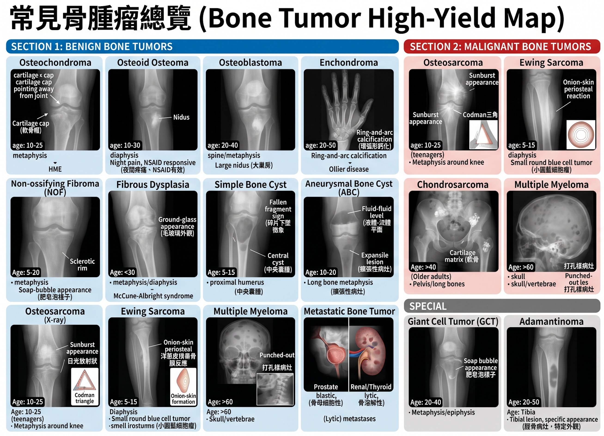

# 泌尿科（考題104）

- 泌尿腫瘤最常見histology快分：

  | 部位      | 最常見癌症                                |
  | ------- | ------------------------------------ |
  | 陰莖      | Squamous cell carcinoma（SCC，鱗狀上皮細胞癌） |
  | 膀胱      | Urothelial carcinoma（尿路上皮癌/移形細胞癌）    |
  | 腎盂、輸尿管  | Urothelial carcinoma（尿路上皮癌/移形細胞癌）    |
  | 腎臟實質    | Renal cell carcinoma（RCC，腎細胞癌）       |
  | 攝護腺/前列腺 | **Adenocarcinoma**（腺癌）               |

## 腎臟疾病（考題21）

- Renal Cyst：
  - 流病：>50 y/o盛行率3成
  - SS：多無症狀；**>10cm可能水腎**
  - Exam：惡性特徵＝囊腫抽取物血樣（懷疑papillary cancer）、CT septal/nodular變化、**強顯影**、Bosniak分級高分
  - Tx：低分Obs；高分RFA/手術全切；疼痛可Acetaminophen、NSAIDs、**經皮抽吸+注射硬化劑**
- 腎臟外傷：
  - 流病：1st泌尿系統外傷，男多，鈍傷為主
  - Pitfall：血尿量與嚴重度無關
  - 分級（五級）：膜下血腫（1）⭢1cm內撕裂傷（2）⭢未傷集尿系統（3）⭢**傷集尿系統（4）**⭢主血管/腎臟碎裂損傷（5）
  - Exam：尿檢、影像學（CT、IVP）
  - Tx：觀察（1-2級）；引流／手術（3-5級）
- 腎臟感染
  - Acute Pyelonephritis（急性腎盂腎炎）：
    - RF：性活躍女性、UTI家族史、DM
    - Pathogen：**80% E. coli**
    - SS triad：**發燒、畏寒、knocking pain**
    - Exam：CT（發炎處perfusion defects）；尿培/血培一致率高
    - Tx：oral antibiotics 14 days for 輕微；IV **ampicillin/aminoglycoside**，再加14 days if bacteremia
  - Chronic Pyelonephritis（慢性腎盂腎炎）：
    - 機轉：recurrent UTI⭢scarred/shrink，mainly兒童
    - SS：多無症狀（也無感染）、**視力模糊、高血壓、蛋白尿**
    - Exam：影像學（CT/MRI）見腎臟萎縮、疤痕
    - Tx：控制感染、預防UV reflux（器質性問題，治療有限）
  - Emphysematous pyelonephritis（EPN，產氣性壞死性腎感染）：
    - RF / Pathogen：**DM為大RF；E. coli / Klebsiella發酵產氣**
    - SS：sepsis、抗生素後仍未改善、pneumaturia
    - Exam：CT/KUB見腎實質/**腎周gas**
    - Tx：IV抗生素＋**控血糖＋引流/解除阻塞**；嚴重才nephrectomy
  - Renal Abscess（腎膿瘍，難診斷）：
    - Pathogen：皮質＝Staphylococci；髓質＝E. coli、Proteus
    - SS：畏寒、腹痛、解尿疼痛>2 wks
    - Exam：**尿血培養>5成沒東西，影像2成正常**
    - Tx：**廣效抗生素（vancomycin、cephalosporin）**；CT引流 if anti 48 hr無果；手術
- 腎臟腫瘤
  - Renal parenchymal neoplasms實質腫瘤：
    - Benign：
      - Oncocytoma嗜酸細胞瘤：男性、無症狀，影像不典型（像RCC）；Exam＝**FNAC棕色病灶**；Tx＝燒灼，超音波
      - Angiomyolipoma（AML，血管肌肉脂肪瘤/hamartoma錯構瘤）：女多，黃病灶，**60%合併結節硬化**；Exam＝**Echo白色高回音+CT黑色**；Tx＝**切除/動脈栓塞**（>4cm/會痛）
    - Malignant：
      - RCC（85%，見下方說明）
      - Meta（來源：**肺（20%）**>乳>胃）
      - Wilms tumor（兒童）：多無症狀，太大才被發現；Tx＝主手術，放化療都有反應
  - Renal Cell Carcinoma（RCC，腎細胞癌；**黃、富含脂質**）：
    - 流病：好發**老、黑、男**
    - RF：體顯遺傳病（VHL disease、hereditary renal carcinoma）、環境因素（抽菸、石棉）
    - 病理：mixed carcinoma
    - SS：**無症狀（>50%）**、副腫瘤症候群（高壓、高鈣）
    - Exam：抽血（ESR⭡、血尿、貧血）、**Echo（準度高）**、CT（arterial enhancement、venous early washout，HCC也會）、其他進階影像學/膀胱鏡都有效
    - Tx：手術（唯一cure方法）；**標靶治療 for 轉移性clear cell RCC 用**
    **VEGF/VEGFR 標靶 ± 免疫治療**
    - Metastatic RCC risk model：International Metastatic Kidney Cancer Database Consortium（IMDC，轉移性RCC預後分層）＝Karnofsky performance status低（<80%）、Dx-to-Tx<1 yr（發病到需要全身治療）、Hb低、corrected Ca高、neutrophil高、platelet高
      - lactate dehydrogenase（LDH）屬Memorial Sloan Kettering Cancer Center（MSKCC）舊模型，不是IMDC
  - Renal pelvic/ureteral tumor（腎盂/輸尿管腫瘤）：
    - cf.：40%合併膀胱癌（尿路上皮細胞癌1st部位）
    - RF：橡膠/苯暴露、濫用止痛藥、中藥馬兜鈴酸、埃及血吸蟲
    - subtype：**Transitional cell carcinoma移形細胞癌（90%）**、SCC（8%）、Adenoma（1%）、Fibroepithelial polyp（1st良性）
    - Exam：**CT/MRI/Sono（鈣化、papillary necrosis）**；輸尿管鏡（filling defect/切片，非必要，會低估且不影響處置）
    - Tx（**放療無效**）：手術、雷射、化學治療（cisplatin for 遠端轉移，palliative，對延長生命無效）
- 腎臟移植：
  - 捐贈者：
    - 活捐者：預後同一般人
    - 死捐者：**5-50 y/o**；50-60有高血壓/腦血管dx；**>60健康可捐**
  - 保存：體外保存液＝高鉀、低鈉，4度保存
  - 受贈者評估：**ABO血型/T cell cross match即可**，HLA相對沒關係
  - 原腎處理：90%保留原腎；移除理由＝頑固性高血壓（1st）、嚴重蛋白尿、持續感染因子（結石、囊腫、逆流）
  - 手術：**捐左腎（靜脈長），種右邊（iliac fossa）**
  - 術後觀察：
    - 血流：**中心靜脈壓10-15 cm**
    - 腎功能：**creatinine過一週還上升要洗腎，主因ATN**
    - 排尿量：echo看有無阻塞／廔管/血流不足
  - C/I：active感染/腫瘤（原位癌例外，可移植）、周邊動脈血管硬化、腎還有救（e.g. cystinosis胱氨酸血症）
  - Pitfall：TB感染史者要投藥**isoniazid**一年才可移植

## 下泌尿道（考題16）

- 解剖
  - 男性尿道：尿道口→陰莖段/海綿體尿道→球部尿道→**膜部尿道（尿道外括約肌 external urethral sphincter）**→前列腺部尿道（精阜 verumontanum / seminal colliculus）→肥大的前列腺組織→膀胱頸（bladder neck）→膀胱
- 構造異常（多遺傳性，要手術）
  - 輸尿管成因
    - Duplicated ureter（雙套輸尿管）：**女多**，具遺傳性
      - 分類：不完全型（Y，只有一條接膀胱，多無症狀） vs 完全型（兩條通道接膀胱；**上腎盂輸尿管（接到下內側膀胱）易異位/囊腫/阻塞**，下腎盂輸尿管易VUR）
      - Tx＝手術
    - Ureteropelvic junction obstruction（UPJ obstruction，輸尿管腎盂接口處狹窄）：男、**左腎為主**；多無症狀，infant可嘔吐/疼痛
      - Exam＝Echo、renal scan、voiding cystourethrogram（VCUG，排尿膀胱尿道攝影）
      - Tx＝手術，預後佳
    - Ectopic ureter（輸尿管開口異位）：女多
    - Vesicoureteral reflux（VUR，膀胱輸尿管逆流）
      - 成因＝瓣膜UVJ/肌肉無力（1st）、結構異常、發炎
      - 分級＝Grade I-V；III輕微擴大，IV輸尿管扭曲，V腎乳突壓跡消失
      - Tx＝手術
  - 膀胱成因
    - Interstitial cystitis（**間質性膀胱炎**）：40y/o女
      - SS＝頻尿、尿急、骨盆痛
      - Exam＝動力學膀胱張力強/順應性差；膀胱鏡見**Hunner lesion**（較特異，紅斑/放射狀血管/潰瘍樣病灶）或 **glomerulation（黏膜點狀出血）**
      - Tx＝飲食控制（少酒/咖啡/甜味劑）、**藥物（amitriptyline）**、膀胱灌藥（DMSO、lidocaine）、手術（膀胱灌水擴張、打肉毒）
- 外傷
  - 輸尿管外傷：多穿刺傷（cf. 腎/膀胱多鈍傷）
    - Exam＝CT（**urinoma尿液腫、顯影劑外露**）
    - Tx＝雙J導管引流（輸尿管受傷必備）、手術
  - 膀胱外傷：多撞擊鈍傷（容器狀的都多鈍傷），男多
    - Exam＝逆行膀胱攝影（打顯影後CT）
    - Tx＝腹膜外單純破裂導尿；腹膜內/複雜破裂手術
- 感染
  - Acute cystitis：女、DM
    - SS＝急尿、頻尿、惡臭
    - Tx＝症狀診斷後直接**anti TMP-SMX** 3-5天（PCN類普遍抗藥不用，驗尿/影像skip）
  - Recurrent cystitis：女
    - Tx＝移除感染源（if 尿中持續有菌）；預防性抗生素（if 反覆治好又感染）
  - Urinary TB：>30y/o成人
    - SS＝**多無症狀（if 腎/輸尿管/攝護腺感染）**；刺激/血尿（if 膀胱炎）
    - Exam＝尿檢（持續濃尿+培養陰性）、觸診（**輸精管球狀結節bead chain**）、X ray（**moth-eaten腎盞**）、TB培養（**fast stain/晨尿**）
    - Tx＝抗結核藥物
- 膀胱癌（2nd泌尿道惡腫，cf. 攝護腺癌）：老白人病，75％診斷時膀胱局限
  - RF＝抽菸、橡膠、苯、膀胱受傷、洗腎
  - 分類＝移形上皮（90%）、SCC（5%，伴隨**發炎/血尿/埃及血吸蟲**）、mixed carcinoma、papilloma（＝PUNLMP低惡性泌尿乳突瘤）
  - SS＝**間歇性血尿、頻尿**
  - Exam＝膀胱鏡（確診）；影像判斷轉移（X for肺、bone scan for骨）；Lab/cytology不準
  - Tx＝手術（TURBT；經尿道可根除性切除）+膀胱灌藥物（**Mitomycin C、BCG**）→radical cystectomy（侵犯肌肉層T2，切骨盆器官，合併骨盆淋巴廓清）→chemo（**333 rule：1/3反應、1/3縮小、1/3沒反應**）、immune

## 外生殖器（考題29）

- 構造異常
  - 先天
    - Posterior urethral valve（PUV，後尿道瓣膜）：感染、水腎、漏尿（膀胱長期高壓失代償）
      - Exam＝VCUG，Echo（28wks即可見水腎）
      - Tx＝內視鏡燒灼
    - Hypospadias（**尿道下裂**）：多在**龜頭近端／冠狀溝**
      - RF＝家族遺傳性，胎兒**孕期過度estrogen/progestin暴露**
      - Tx＝保留尿道板＋拿**包皮重建皮瓣（不要行割禮）**；手術失敗要等6-12月再重建
    - Cryptorchidism（隱睪）：卡在睪丸下降路徑，**prepubic**為主
      - RF＝早產、家族史
      - Tx＝睪丸固定（<1.5y/o）；睪丸切除（>10 y/o，∵易睪丸癌（**Seminoma**））
    - 異位睪丸：卡在**superficial inguinal pouch**為主
      - cf. Cryptorchidism＝卡在睪丸下降路徑
    - Inguinal hernia
      - Indirect：小孩99%；patent processus vaginalis腹膜鞘狀突未閉合，從deep inguinal ring突出⭢走inguinal canal，inferior epigastric vessels外側；Tx＝高位結紮ASAP
      - Direct：老人；從Hesselbach triangle/posterior wall突出，inferior epigastric vessels內側，比indirect易復發；Tx＝Mesh（cf. 兒童不常規Mesh）
      - Femoral hernia：inguinal ligament下方／股靜脈內側，女多，incarceration（嵌頓）風險高
      - Inguinal canal map：deep inguinal ring＝transversalis fascia開口；superficial inguinal ring＝external oblique aponeurosis開口；spermatic cord coverings＝internal spermatic fascia（transversalis fascia延伸）＋cremaster muscle/fascia（internal oblique延伸）＋external spermatic fascia（external oblique aponeurosis延伸）；ilioinguinal n.伴隨cord出superficial ring（不經deep ring），iliohypogastric n.不在spermatic cord；testicular a.來自abdominal aorta
      
      
  - 後天
    - Priapism（陰莖異常勃起）：持續勃起>4hr，多缺血型（**陰莖硬龜頭軟**）；其他＝白血病、藥物、外傷
      - Exam＝Doppler
      - Tx＝冰敷、放血、**α-agonist（海綿肌放鬆動脈收縮）**、動靜脈瘻管
    - Penile curvature（陰莖彎曲）：彎超過30度
      - 先天＝白膜異常、尿道下裂
      - 後天＝**Peyronie's dx**（發炎纖維斑塊化）
      - Tx＝**Vit E、抗纖維藥、手術**
    - Phimosis（包莖）
      - 併發症＝龜頭炎、嵌頓式包莖、陰莖癌、性病⭡
      - Tx＝anti、手術
    - Urethral stricture（尿道狹窄）
      - Mainly＝感染
      - Tx＝擴張、重建
    - Testicular torsion（睪丸扭轉）：青少年急症；**Bell-clapper deformity**（鞘狀膜異常包覆⭢睪丸可自由旋轉）
      - SS＝突發性陰囊痛、腫脹、高位／橫躺睪丸、**negative Prehn's sign陰性（抬高不緩解）**、cremasteric reflex消失（Rabinowitz sign相關）
      - Exam＝Doppler（血流減少），**Tc-99m cold**
      - Tx＝手術復位，6hr內90%有救
      - 補＝新生兒多extravaginal鞘膜外（常產前，連同鞘膜旋轉，預後差），青少年多intravaginal鞘膜內（在鞘膜內自行旋轉）；開刀前先manual detorsion＝open the book（多由內向外轉，暫時恢復血流），**正常側術中也要預防性固定**
    - Varicocele（精索靜脈曲張）：1st男不孕，左側為主
      - MOA＝nutcracker effect，左腎靜脈**被SMA/aorta夾住**⭢左側易血尿、varicocele
      - Exam＝Doppler靜脈**>3.5mm**
      - Tx＝手術（70%改善精子品質）
- 感染
  - 尿道炎：性傳播
    - 感染源＝淋病、非淋病（HSV、Chlamydia、Trichomonas）
    - SS＝5成無症狀、尿道分泌物、排尿疼痛
    - Exam＝**尿道取樣**（分泌物取樣不準），不依靠影像學
    - Tx＝**抗生素（淋病ceftriaxone、非淋病doxycycline）**；預防>治療
  - Chlamydia三兄弟快分：

    | 菌種                    | 疾病                                                                                     | 典型情境          |
    | --------------------- | -------------------------------------------------------------------------------------- | ------------- |
    | Chlamydia trachomatis | 嬰幼兒非典型肺炎（無燒、結膜炎、Staccato cough）性病尿道炎/cervicitis、pelvic inflammatory disease（PID，骨盆腔發炎） | 性接觸；新生兒結膜炎/肺炎 |
    | Chlamydia pneumoniae  | 非典型肺炎                                                                                  | 社區感染、人傳人      |
    | Chlamydia psittaci    | psittacosis（鸚鵡熱）/非典型肺炎                                                                 | 鳥類暴露（鸚鵡、家禽）   |

  - 睪丸附睪炎：泌尿道感染後上行傳染，幼童多肺炎／病毒後感染引起
    - 成因＝**E.coli（老人、小孩、肛交）**、Chlamydia/Gonorrhea（成人）
    - SS＝急性**睪丸痛、腫脹、血精**
    - Exam＝尿/血WBC⭡，超音波（增強血流，可DDx torsion）
    - Tx＝抗生素（ceftriaxone+doxycycline）、NSAIDs消炎、伴侶一起治療
  - Warts（性行為傳播）
    - Exam＝膀胱尿道鏡
    - Tx＝電燒、**5-Fu尿道貫注**
  - Fournier gangrene（會陰部壞死性筋膜炎）
    - RF＝感染、局部外陰瘻管、DM
    - 蔓延＝沿淺層筋膜（Colles' / Dartos / Scarpa's fascia），不是深層筋膜
    - Tx＝**立即清瘡（不可少清）**；但睪丸、陰莖海綿體sparing（被deep Buck's fascia保護）
    
- 外傷
  - Buck's fascia判斷瘀青／陰莖血腫
    - Buck's fascia沒破＝血腫侷限陰莖
    - Buck's fascia破了＝血液可進Colles' / Scarpa's / Dartos fascia，**會陰／陰囊／下腹butterfly狀**
  - Tx＝逆行性尿道攝影、膀胱造口引流（不可放foley）、手術
  - **membranous urethra（中段）**：最常受傷，合併血腫&攝護腺上移（high riding prostate）
  - bulbous（前段）：陰莖前段1st；SS＝**Straddle injury（跨座式傷害）**
  - 陰莖骨折：白膜破裂
- 腫瘤
  - 睪丸癌：Mainly germ cell tumor（年輕男1st固態腫瘤；**seminoma>non-seminoma**）
    - 淋巴擴散＝睪丸沿下降路徑回流⭢**retroperitoneal**/para-aortic nodes（非先到inguinal）
    - SS＝**無痛腫大（70%）**
    - Exam＝Lab（HCG+AFP+LDH）＋影像（超音波深色病灶，**CXR看肺部轉移**，腹部**骨盆CT看淋巴轉移**）
    - Tx＝手術（睪丸必切除），化療（全Stage都可輔助，復發能化療就化療，不能就努力切），**放療（for seminoma**，中低Stage才做）
  - Penile cancer：SCC為主
    - RF＝>65 y/o、HPV（+）、**phimosis（包莖）**、抽菸
    - SS＝**Balanitis xerotica obliterans**（BXO，閉鎖硬化龜頭，DM常見）、陰莖無痛腫塊／潰瘍、腹股溝淋巴腫（發炎，非侵犯）、**Bowen's dx**（紅色結痂）、Erythroplasia of Queyrat（紅皮潰瘍）
    - Exam＝病理最準（**leukoplakia白斑**），Lab/影像都不準
    - 分級＝**Jackson分級**（1-4，1龜頭，2主幹，3淋巴結，4遠端）
    - Tx＝局部化療（Tis）、手術⭢電燒⭢放療（T2）⭢抗生素（淋巴腫，用以排除感染導致）；if 無淋巴轉移8成可治癒，目標為保留陰莖

## 攝護腺（考題7）

- 感染：
  - 細菌性攝護腺炎：**多<50y/o**，急性以E.coli為主
    - SS＝下泌尿道症狀+系統性感染症狀（急性）；慢性可無症狀
    - Exam＝慢性可做**前列腺按摩後前段尿**（取前列腺液）
    - Tx＝經驗性抗生素（**急性6wks，慢性3m**）；尿滯留用**恥骨上膀胱引流，不放foley**
  - 攝護腺膿瘍：
    - RF＝急性攝護腺炎沒治好、長期導尿、DM
    - SS＝攝護腺症狀+**DRE摸到腫大/脈動/疼痛攝護腺**
    - Exam＝超音波/CT
    - Tx＝影像引導引流
- 攝護腺增生（BPH）：
  - 病理＝老男，Transitional zone細胞數增加；往外壓迫peripheral zone形成surgical capsule，可作為手術邊界
  - SS＝LUTS下泌尿道症狀
  - Exam＝FUN-WISE score（**Frequency、Urgency、Nocturia、Weak stream、Intermittent stream、Straining、Emptying**）
    - 每項0-5分；>8分中度，>20分重度
  - Tx：
    - 藥物：for >8分；**α-blocker**（放鬆膀胱）、5α-reductase inhibitor（攝護腺>40ml才明顯縮小體積，也可降癌症發生率；e.g. Finasteride、Dutasteride）、副交感（興奮劑/抑制劑皆有幫助）、TCA
    - 手術：反覆發作或移除尿管失敗；Transurethral Incision for <30ml，Transurethral vaporization for 30-80ml，Enucleation晚除術
    
- 攝護腺癌：
  - 定位＝1st泌尿癌症（美國男性第一癌，台灣前三）；**adenocarcinoma** in **peripheral** zone為主
  - RF＝年齡、人種（黑>白>黃）、**紅肉飲食**、特定營養缺乏（**茄紅素，Vit D，Omega-3**）
  - 轉移＝**經Batson's venous plexus（脊椎靜脈叢）至脊椎骨盆**
  - SS＝多無症狀，**發現時已轉移（cf. 陰莖癌，膀胱癌）**
  - Exam＝DRE像石頭、**PSA>4ng/ml**（**free form比值越小越惡性**）、TRUS常見異常**低回音**、MRI**低訊號**
  - 分類＝切片**Gleason grading**（最大片+最高分分數）；7分中風險，>7高風險
  - Tx（先看stage/壽命/風險）：
    - 低風險且預期壽命>10y：active surveillance（主動監測；定期PSA/DRE/切片，進展才根治）；預期壽命<10y或不適合根治＝watchful waiting（等待觀察，症狀出現再症狀治療）
      - **localized：中高風險且預期壽命>10y**：根除性攝護腺切除（**radical prostatectomy**）或放療；放療可合併androgen deprivation therapy（ADT，雄性素剝奪治療；中風險約4-6mo〔常考6mo〕，高風險2-3y）
      - metastatic：ADT為骨幹（**雙側睪丸切除 or LHRH/GnRH agonist/antagonist效果相近**）；若問全身治療，常合併**androgen receptor pathway inhibitor（ARPI，雄性素受體路徑抑制劑）或docetaxel**
    - Pitfall＝TURP攝護腺不是癌症根除手術；localized不能只用hormone當根治

## 結石（考題7）

- 流病/RF：
  - 3rd泌尿系統dx（UTI⭢BPH⭢stone）
  - RF＝結晶尿、家族史、飲食（高蛋白、重油、高鈉（非石頭成分但增加沉澱）、少蔬菜）、藥物、高社經地位、乾燥氣候、酸性尿、尿少（不需要高尿酸）
  - cf. 抑制結石成分＝硫、鎂、檸檬（留美檸檬）
- 種類：
  - Calcium calculi（含鈣結石，80%）
  - 非含鈣結石：
    - Struvite結石（磷酸銨鎂）＝女性尿路感染/Proteus
    - 尿酸結石＝男性痛風病史
    - Cystine結石（胱胺酸結石）＝小孩/年輕＋hexagonal六角形結晶
    - Indinavir結石＝AIDS Indinavir用藥
  - Staghorn鹿角結石＝形狀/範圍名（分枝填滿renal pelvis/calyces，常為struvite感染石），不是成分名
- SS：
  - hematuria（9成）
  - pain：colicky pain＝石頭拉扯痛；noncolicky pain＝積尿痛；石頭大小與痛度無正比關係
  - 三狹窄堵塞＝UPJ輸尿腎盂、**iliac vessels髂血管旁**、UVJ輸尿膀胱
  - 感染＝Mainly Proteus（struvite結石）
- Exam：
  - 首選NCCT（**non-contrast CT**；可見多數結石與阻塞，indinavir可看不到）
  - **KUB**＝可見radiopaque stone；**含鈣較清楚**，struvite可見但較模糊，uric acid/indinavir常看不到
  - US＝適合孕婦/小兒或看 hydronephrosis
  - Retrograde pyelography＝可見 filling defect，常用於CT不清楚、不能打IV contrast或術中定位
  - Pitfall＝RUG是尿道外傷/狹窄檢查，只能到膀胱
- Tx：
  - 危急先引流＝感染性阻塞/AKI/anuria⭢stent或PCN＋抗生素
  - hydration＝喝水2500ml⭡，排水2000ml⭡
  - 改變尿pH：
    - 含鈣結石：citrate（抓走 free Ca）/避免鹼化
    - 尿酸/Cystine結石：鹼化尿液；Cystine亦可用**Tiopronin/Penicillamine**抓走
    - Struvite結石：酸化尿液
  - 碎石/取石＝小輸尿管結石可觀察/MET藥物排石，<1cm ESWL體外震波/URS輸尿管鏡碎石，>1-2cm或staghorn⭢PCNL經皮取石
  - 飲食/藥物＝**低普林、減少動物蛋白**；febuxostat降尿酸生成；**禁用Benzbromarone**（⭡尿酸排出）
  - 草酸鈣結石：pH值在生理範圍內影響不大；**攝取鹼性物質for ⭡尿中Citrate**（不要過度鹼化尿液）；要**補鈣（減少腸道草酸吸收）**
  - 鹼化尿液：**Potassium based Bicarbonate**為主；Sodium based會增加Ca排出
  - ESWL體外碎石禁忌：孕婦、腹主動脈瘤、**重度水腎**、出血傾向

## 泌尿道細菌感染（考題0）

- 防禦：
  - 宿主＝沖刷、上皮
  - 女＝乳酸菌保護；男＝Zinc in 前列腺
- RF＝導尿管放一天**多5%**感染率
- 常用藥：
  - TMP+SMX＝for uncomplicated UTI；**綠膿/Enterococci無效，孕婦小孩禁用**
  - Fluoroquinolone＝for G（-）；孕婦小孩禁用
  - Nitrofurantoin＝for G（-）/Enterococci/純下泌尿道；綠膿/Proteus無效，孕婦小孩禁用
  - Aminoglycoside＝for G（-）/Enterococci；腎耳毒性，孕婦小孩禁用
  - PCN＝孕婦可用，但多數細菌有抗藥性
  - **Cephalosporin＝孕婦可用**

## 泌尿道功能工程（考題1）

- Urodynamics：
  - Urinary flow rate（尿流速圖）＝鐘型曲線；最大流速**<15懷疑**、<10確診阻塞/逼尿功能障礙
  - Cystometrogram（CMG，膀胱壓力圖）：逼尿肌壓力（Pdet）＝膀胱內壓（Pves）-腹內壓（Pabd）；膀胱體積150ml開始尿意、450ml最大容積
  - Urethral pressure profile/Sphincter electromyography＝尿道壓力圖/括約肌電圖 for括約肌偵測
  - Videourodynamic＝尿路攝影＋pressure-flow/CMG
- 下泌尿道功能異常：
  - 排尿困難：
    - 收縮問題＝detrusor hyporeflexia
    - 出口問題＝狹窄、外括約肌異常
  - Postoperative urinary retention（POUR，術後尿滯留）：
    - RF＝男/高齡/BPH、IV fluid過多（膀胱過度充盈）、spinal/epidural anesthesia>general anesthesia（抑制排尿反射）、anorectal/pelvic surgery（疼痛與反射性括約肌收縮）、**opioid/抗膽鹼**
    - Tx＝膀胱掃描，導尿/間歇導尿，處理疼痛與藥物
  - 尿失禁：
    - 流病＝Mainly女（盛行率>4成）
    - Exam＝Marshall test（Lithotomy position，膀胱灌水後咳嗽看漏尿量）
    - 分類：
      - Stress＝活動漏尿 in中年女骨盆肌肉鬆弛；Tx＝Kegel運動、口服Duloxetine（SNRI）、手術
      - Urge＝急迫性漏尿，逼尿肌不自主收縮，in女/中風/帕金森；Tx＝Kegel運動、**口服抗膽鹼（tolterodine，oxybutynin）、M3抑制劑（solifenacin）**
      - Overflow＝積尿漏尿；e.g BPH阻塞、detrusor無力排尿；Tx＝治療原發病因，可能需要導尿
      - Mixed＝混合性漏尿
  - Neuropathic bladder：
    - 神經＝儲尿中樞：橋腦；排尿中樞：旁水道灰質（PAG，參與儲尿與排尿轉換）；額葉抑制與交感/**陰部神經**才是維持留尿主力
    - 分類＝S2以上受傷：**S2-4薦反射弧保留，膀胱過動**；S2以下受傷：薦反射弧受損，膀胱無力/鬆弛，overflow incontinence
    - Tx Goal＝膀胱儲尿時保持低壓、防止感染
      - 過動膀胱：副交感阻斷（oxybutynin，trospium）、膀胱內灌藥、肉毒
      - 無力膀胱：膀胱訓練、副交感興奮、間歇導尿

## 男性學（考題7）

- 性功能障礙（早洩，遲洩，逆行射精，無高潮症，勃起障礙）
  - 神經：
    - Erection＝副交感S2-4（pelvic splanchnic/cavernosal nerve，NO）
    - Emission/射精前段＝交感T11-L2（hypogastric，輸精管/精囊/前列腺收縮＋內括約肌關閉）
    - Expulsion/射出＝陰部神經S2-4（**bulbospongiosus**收縮）
  - 勃起障礙（ED＝impotence）：
    - RF＝抽菸、DM、HTN、CAD（80%）、**PAD（90%）**
    - Exam＝空腹血糖（排除DM）、血中睪固酮/prolactin（抑制testosterone）、夜間陰莖勃起測試（Snap-Gauge test；三條橡皮筋看破幾條，if正常⭢排除器質因素）、Doppler超音波（血流量）
    - Tx＝治療原發病因、**PDE5抑制劑（sildenafil**，抑制PDE-5，增加NO-cGMP）、陰莖注射藥物（prostaglandin E1）、真空裝置、手術（陰莖假體植入）
  - 男性不孕症：
    - 定義＝一年無套未孕
    - 成因＝睪丸前（下視丘-垂體-睪丸軸問題）、睪丸內（染色體：**Klinefelter's disease**（47XXY，小睪丸男性女乳）、**Noonan's、varicocele**）、睪丸後
    - Exam＝排除藥物（血壓CCB、BB、spironolactone、尿酸藥（秋水仙、allopurinol）、精神科藥）、PE（正常大小**18ml**）、精液分析（**正常>1.5ml、>15 million/ml、活動率>40%、正常形態>4%**）
    - Tx＝underlying dx、Endocrine tx（1st內科治療，用clomiphene/SERM）、手術
  - 低testosterone但想生育：
    - Pitfall＝禁用外源性testosterone（抑制GnRH-LH/FSH⭢睪丸內T下降⭢spermatogenesis變差）
    - Tx＝SERM（clomiphene）、aromatase inhibitor、hCG刺激內源性T（模仿LH刺激Leydig cell）

## 腎上腺（考題16）

- Anatomy：
  - 皮質三層（外到內＝GFR，醛皮性）：
    - Zona glomerulosa（球狀帶）：Mineralocorticoid＝Aldosterone，與血壓有關；過多＝Conn's
    - Zona fasciculata（束狀帶）：Glucocorticoid＝cortisol；過多＝Cushing，過少＝Addison's
    - Zona reticulosa（網狀帶）：Androgen（口訣＝網路宅男）
  - 髓質：Catecholamine（Epinephrine/NE）；過多＝Pheochromocytoma
- Conn's dx（原發性醛皮質素增多症，治療預後good）：
  - SS＝高壓、低鉀、**頭痛、夜尿**
  - Exam＝aldosterone/renin ratio>30（Aldosterone⭡，Renin⭣），24 hr尿中Aldosterone⭡
  - Tx＝手術切除（單側）；**Spironolactone＋Amiloride** for雙側/無法開刀者
- Cushing's：
  - subtype＝Cushing disease（**80%，腦垂Adenoma/hyperplasia**），Adrenal tumor（20%，<4cm良性Adenoma，>6cm惡性Carcinoma；**腎上腺tumor>4cm一概切除**），Ectopic ACTH syndrome（非垂體腫瘤分泌ACTH，如**小細胞肺癌，常低血鉀/代謝鹼中毒**）
  - SS＝Buffalo hump、Central obesity、皮膚變薄、易瘀青、骨質疏鬆、DM、Hirsutism、Moon face
  - Exam：
    - Cortisol screen＝24hr尿游離Cortisol⭡；夜間給1mg Dexamethasone但Cortisol⭡
    - Cortisol diag＝Dexamethasone 0.5mg q6h for 2 days仍無抑制可確診
    - ACTH DDx＝<10（Adrenal tumor，ACTH independent，排腹部CT）；>10（腦垂Adenoma/Ectopic adenoma，排腦部MRI）；>200（Small cell lung ca.，排胸部CT）
  - Tx＝手術切除腫瘤（腦垂/Adrenal tumor，成功率80%）⭢類固醇長期（直到腎上腺習慣低濃度ACTH）；Ketoconazole抑制Cortisol合成 for難手術者
- Adrenal insufficiency（腎上腺功能不全）：
  - Primary（原發性，Addison's disease）：1st，腎上腺本身被破壞（自體免疫攻擊/感染（**幼兒綠膿，腦膜炎球菌血症**）/出血（成人凝血功能異常）/藥物（Ketoconazole，Rifampin）/遺傳性（21-hydroxylase缺乏））
    - Primary特異SS＝高血鉀，**Hyperpigmentation**（ACTH過多刺激melanocyte stimulating hormone）
  - Secondary（次發性）：腦垂體無法製造ACTH（外部壓迫/Glucocorticoid長期使用）
  - 共同SS＝疲倦、體重減輕、食慾不振、**低血壓、低血糖、低血鈉**
  - Exam＝注射250ug Cosyntropin（合成ACTH）⭢primary無反應；secondary早期可有反應、久病可能反應差
  - Tx：
    - cortisone
    - 長效藥物（**Dexamethasone**，可過BBB）：越長效Glucocorticoid越強，Mineralocorticoid作用越弱
    - 副作用：短期脈衝<長期少量投藥；∴急性狼瘡用脈衝
  - Adrenal crisis（急性腎上腺危象）：感染/手術/外傷/停藥⭢急性Adrenal失能；SS＝休克、發燒、嗜睡；Tx＝**IV fluids＋IV hydrocortisone**
  - CIRCI（critical illness-related corticosteroid insufficiency，重症相關皮質類固醇不足）：重症病人腎上腺需求上升6~10x，無法應付壓力；SS＝休克；Tx＝IV hydrocortisone
- Pheochromocytoma（嗜鉻細胞瘤＝adrenal medulla chromaffin cell tumor，常分泌Catecholamine，代謝物＝Metanephrine）
  - cf. Paraganglioma（＝extra-adrenal paraganglia tumor，可分泌Catecholamine）
  - Rule of 10＝腎上腺外10%，雙側侵犯10%，家族性10%，惡性10%
  - SS：5P＝Pressure（高血壓），Pain，Palpitation，Perspiration（多汗），Pallor（血管收縮蒼白）
  - Exam＝24hr尿**Metanephrine**⭡（也可Vanillymandelate（VMA）/Catecholamine）；CT/MRI定位；**MIBG scan if懷疑長在腎上腺外**
  - Tx（**完整切除為目標**）＝α-blocker/β-blocker控血壓（先α再β）⭢手術
- Adrenal incidentaloma（偶發腎上腺腫瘤）：
  - Exam＝CT/MRI；排除Pheochromocytoma；若有惡性腫瘤hx，**CT-guided FNA主要評估轉移**（良惡性區分不佳）
  - Tx＝切除 if **功能性腫瘤/無功能>6cm/惡性特徵（不規則邊界，密度>10HU，增強後washout<50%退的慢）**
- Neuroblastoma（神經母細胞瘤）：兒童腎上腺惡性腫瘤，3rd兒童癌症；5成長在腎上腺，7成發現時已轉移，預後差
  - SS＝腹部腫塊，發燒，骨痛
  - Dx＝CT/MRI，24hr尿VMA/HVA⭡
  - Tx＝手術切除＋化療

# 外科（考題3）

## ERAS 術後加速恢復（考題0）

- ERAS（Enhanced Recovery After Surgery，術後加速恢復）：核心不是單一藥物，而是減少手術壓力＋早期恢復。
  - 腸道準備：
    - Mechanical bowel preparation（MBP，機械性清腸）＋oral antibiotics（口服抗生素）
    - Exam：左側大腸/直腸手術特別常用；目的＝降低surgical site infection（SSI，手術部位感染）
  - 禁食：
    - 避免長時間NPO（nothing by mouth，禁食）
    - 術前2小時可喝碳水化合物飲品
    - Exam：減少胰島素阻抗/術後不適；不是傳統一路禁食到手術
  - 疼痛：
    - Multimodal analgesia（多模式止痛）＝NSAID（nonsteroidal anti-inflammatory drug，非類固醇消炎止痛藥）＋acetaminophen＋gabapentinoids等
    - Exam：opioid-sparing（減少鴉片類止痛藥）⭢減少腸麻痺/噁心/呼吸抑制
  - 管路：
    - 不常規放NG tube（nasogastric tube，鼻胃管）或引流管
    - Exam：減少感染/活動限制，促進早期進食與下床
  - 液體：
    - Goal-directed fluid therapy（GDFT，目標導向液體治療）＝不過度輸液
    - Exam：避免過多水腫或過少低灌流

## 咬傷傷口感染（考題0）

- Exam：咬傷感染風險看「部位＋來源」；「任何部位均高風險」太絕對。
  - 高風險部位：
    - 手部、足部、生殖器、關節
    - 原因＝血循較差或結構複雜，深部感染/關節侵犯風險高
  - 低風險部位：
    - 臉部、頭皮、軀幹、近端肢體
    - 原因＝血循較豐富
- 病原與抗生素（都是Augmentin）：
  - 貓咬：
    - 常見病原＝Pasteurella multocida（感染快、深部穿刺）
    - 首選抗生素＝amoxicillin-clavulanate（**Augmentin**）
  - 狗咬：
    - 常見病原＝Pasteurella、Capnocytophaga（脾切/酒癮者怕敗血症）
    - 首選抗生素＝amoxicillin-clavulanate（**Augmentin**）
  - 人咬：
    - 常見病原＝Streptococcus（鏈球菌）、Staphylococcus（葡萄球菌）、Eikenella、厭氧菌
    - 首選抗生素＝amoxicillin-clavulanate（Augmentin）

## 常見手術 bail-out（考題0）

- Bail-out（退階/救援手術）原則：
  - if 解剖不清/病人不穩/吻合不安全 ⭢ 不硬切、不硬接
  - Tx：控制污染/出血＋引流/造口/分期手術
- Laparoscopic cholecystectomy（腹腔鏡膽囊切除）：
  - if Calot triangle（三角）解剖不清 or critical view of safety（安全視野）做不出來 ⭢ subtotal cholecystectomy（次全膽囊切除）
  - Subtotal：fenestrating（開窗引流）/reconstituting（重建殘端）
  - Pitfall：轉 open（開腹）只是換視野，不等於安全
- Appendicitis abscess/phlegmon（闌尾膿瘍/發炎塊）：
  - if 膿瘍/發炎塊明顯 ⭢ 不硬切
  - Tx：抗生素 ± percutaneous drainage（經皮引流）
- Colon/rectum（結直腸手術）：
  - if 污染重/低灌流/休克/吻合張力大 ⭢ 避免 primary anastomosis（一次吻合）
  - Bail-out：diverting stoma（近端轉流造口）or **Hartmann procedure**（Hartmann 手術：遠端封閉＋近端造口）
- Abdominal trauma/sepsis（腹部外傷/敗血症）：
  - if 不穩＋coagulopathy（凝血異常）/acidosis（酸中毒）/hypothermia（低體溫） ⭢ damage control surgery（損害控制手術）
  - Tx：packing（填塞止血）/暫時關腹＋ICU（intensive care unit，加護病房）復甦後 planned reoperation（計畫性再手術）
- Thyroidectomy（甲狀腺切除）：
  - if 雙側手術且第一側 recurrent laryngeal nerve（RLN，喉返神經）loss of signal（訊號喪失） ⭢ 停做對側
  - Pitfall：改 staged thyroidectomy（分期甲狀腺切除）避免雙側聲帶麻痺

## Lap/Open/Robot 選擇快辨（考題0）

- Lap（laparoscopy，腹腔鏡）贏 open（開腹）：
  - 常見：cholecystectomy（膽囊切除）/appendectomy（闌尾切除）/fundoplication（胃底摺疊術）/colectomy（結腸切除）
  - Advantage：傷口小、疼痛少、住院短、恢復快、wound infection（傷口感染）/incisional hernia（切口疝氣）少
  - Colectomy：短期恢復佳；oncologic outcome（腫瘤結果）可相近
- Robot（機器手臂）真正強項：
  - Radical prostatectomy（根除性攝護腺切除）⭢ 失血/輸血少、住院短
  - Partial nephrectomy（部分腎切除）⭢ 深部縫合/renorrhaphy（腎臟縫合）較順；**保腎手術較好做**；失血/住院少
  - Deep pelvic surgery（深骨盆手術）⭢ 狹窄骨盆內 3D 視野＋**wristed instruments（腕式器械）利於縫合/剝離**
- Robot 沒明顯贏 lap：
  - 常見：appendectomy/cholecystectomy/hernia repair（疝氣修補）/多數一般外科
  - Pitfall：outcome（結果）相近但 cost（成本）高、OR time（operating room time，手術室時間）長
- 反例：
  - Early cervical cancer radical hysterectomy（早期子宮頸癌根除性子宮切除；LACC trial）⭢ open 優於 minimally invasive surgery（MIS，微創手術：lap/robot）
  - Pitfall：disease-free survival（DFS，無病存活）/overall survival（OS，整體存活）較好的是 open，不要套用「微創一定比較好」

## 腹內感染（考題0）

- Antibiotic duration（抗生素療程）：重點看 source control（感染源控制）
  - 未穿孔闌尾炎切除後 ⭢ 不用延長
  - 未穿孔腸壞死切除後 ⭢ ≤24 hr
  - 穿孔/複雜腹內感染，source control 足夠 ⭢ 約 4 天
  - **腹內感染合併敗血症/休克 ⭢ 約 7-10 天**

## 整形外科重建（考題3）

- Reconstruction ladder（重建階梯）：
  - 順序＝primary closure（直接縫合）⭢ skin graft（皮膚移植）⭢ local/regional flap（局部/區域皮瓣）⭢ free flap（游離皮瓣）
  - 考點＝骨/肌腱/血管外露、感染或放療後受床差 ⭢ 偏向 flap，不要只選 graft
- Mangled limb（嚴重碾壓/複合肢體傷）：
  - Step 1 life over limb：先 Advanced Trauma Life Support（ATLS）/ABC（airway, breathing, circulation，呼吸道/呼吸/循環）
  - Step 2 limb survival：revascularization（血流重建）；warm ischemia（溫缺血）盡量 <6 hr，必要時先 vascular shunt（暫時血管分流）
  - Step 3 function：神經/肌腱/皮瓣重建
  - BEANS（重建順序口訣）＝Bone（骨）→ Extensors/tendon（伸肌/肌腱）→ Arteries（動脈）→ Nerves（神經）→ Soft tissue（軟組織/皮瓣）
    - 原則＝bone before nerve；先穩定骨架，再做精細血管/神經吻合，避免復位牽拉撕裂吻合處
- Skin graft vs flap：
  - Skin graft：無自帶血流，靠受床存活
    - Split-thickness skin graft（STSG，部分皮層皮膚移植）：**較易存活**，donor 可再生；缺點＝**secondary contraction**（次發攣縮）與色差較多
    - Full-thickness skin graft（FTSG，全層皮膚移植）：外觀較好、收縮少；缺點＝**需血流好，donor 需縫合**
  - Flap：自帶血流
    - Local/regional flap：保留 **pedicle**（血管蒂）
    - Free flap：需 **microvascular anastomosis**（顯微血管吻合）
    - Random flap：靠皮下血管叢；axial flap：有明確血管
- Breast reconstruction（乳房重建）：
  - Autologous reconstruction（自體組織重建）：Deep inferior epigastric perforator flap（DIEP）/transverse rectus abdominis myocutaneous flap（TRAM）較自然但手術大
  - Free flap 受區血管常用 internal mammary vessels（內乳血管）
- 常考血供：

  | 皮瓣/肌肉                                           | 血供                                         | 考點                      |
  | ----------------------------------------------- | ------------------------------------------ | ----------------------- |
  | Pectoralis major myocutaneous flap（PMMC，胸大肌肌皮瓣） | **thoracoacromial artery pectoral branch** | 不是 internal mammary     |
  | Submental flap（頦下皮瓣）                            | submental artery（from facial artery）       | 口腔/頭頸缺損可考               |
  | Supraclavicular flap（鎖骨上皮瓣）                     | supraclavicular artery                     | 薄皮瓣，頭頸外側重建              |
  | Latissimus dorsi（闊背肌）                           | thoracodorsal artery                       | Mathes-Nahai **type V** |
  | TRAM/DIEP                                       | **deep inferior epigastric system**        | 乳房自體重建                  |

# 骨科（考題48）

## 骨科 Test / Sign 概論（考前快查）（考題0）

- 原則：test/sign 先定位，最後多靠 X-ray/MRI/CT 確認；創傷先看神經血管（pulse、5P、hard signs）再看局部關節。
- 脊椎：
  - Jefferson fracture：open-mouth view/CT 看 C1 lateral mass 外移；transverse atlantal ligament（橫韌帶）斷＝不穩。
- 足踝：
  - Ottawa ankle rules：malleolar/midfoot zone 骨壓痛或無法負重走 4 步才照 X-ray。
  - Mondor sign：足底血腫延伸，支持 calcaneus fracture（跟骨骨折）。
  - Bohler's angle：<20 度支持 calcaneus fracture。
  - Thompson test：壓腓腸肌無 plantar flexion（蹠屈）＝Achilles tendon rupture（阿基里斯肌腱斷裂）。
- 膝：
  - Lachman test：膝 30 度前拉，ACL（anterior cruciate ligament，前十字韌帶）最敏感。
  - Posterior drawer test：膝 90 度後推，PCL（posterior cruciate ligament，後十字韌帶）最敏感。
  - McMurray test：膝髖屈曲再伸直誘發卡痛＝meniscus injury（半月板損傷）。
- 創傷/血管：
  - Vascular hard signs：pulsatile bleeding、expanding hematoma、pulse deficit/ischemia（5P）、bruit/thrill；有就先血管手術評估。
  - ABI（ankle-brachial index，踝肱指數）：<0.8 懷疑下肢血管阻塞。
  - Compartment syndrome 5P：pain out of proportion、pallor、paresthesia、paralysis、pulselessness；壓力>30 或 delta pressure<30 要 fasciotomy。
- 髖/骨盆：
  - ONFH（osteonecrosis of femoral head，股骨頭缺血性壞死）：X-ray crescent sign；MRI T1 serpentine low signal band、T2 double line sign。
  - FAIR test：hip flexion＋adduction＋internal rotation 誘發臀痛/坐骨痛＝piriformis syndrome（梨狀肌症候群）。
- 肩肘上肢：
  - AC joint injury：AP X-ray 見 coracoid 到 clavicle 距離增加＝CC ligament 受拉/斷裂。
  - Shoulder posterior dislocation：light bulb sign（肱骨頭內旋像燈泡）。
  - Rotator cuff tear：Drop arm test（抬手 30-90 度無力/掉落）。
  - Supracondylar fracture：fat pad sign（前 sail sign、後脂肪墊可見）提示 occult fracture。
  - Distal radius fracture：silver-fork deformity（餐叉變形）。
- 手部：
  - CTS（carpal tunnel syndrome，腕隧道症候群）：Durkan's test 最準；Tinel's sign、Phalen's test 也可考。
  - Scaphoid fracture：FOOSH 後 anatomic snuff box 壓痛；初期 X-ray 可正常，先 thumb spica 副木固定追蹤。
  - de Quervain disease：Finkelstein test（拇指握拳內＋ulnar deviation 誘發疼痛）。
  - Mallet finger：DIP 下垂不能伸；Boutonniere deformity：PIP 彎曲＋DIP 過伸。
- 骨腫瘤影像 sign：
  - Osteoid osteoma：night pain＋sclerotic bone 包住 nidus。
  - Fibrous dysplasia：**ground-glass、shepherd's crook deformity。**
  - Osteosarcoma：sunburst pattern、Codman triangle。
  - Chondrosarcoma：endosteal scalloping。
  - Giant cell tumor：epiphysis soap-bubble。
  - Ewing sarcoma：onion-skin/onion-like、moth-eaten。
  - Unicameral bone cyst：fallen fragment sign。
  - Aneurysmal bone cyst：bubble appearance、fluid level。
- 小兒骨科：
  - DDH（developmental dysplasia of hip，發展性髖關節發育不良）：Ortolani＝外展看可否復位；Barlow＝測可否推出髖臼；Galeazzi＝患側膝低。
  - Legg-Calve-Perthes disease：Trendelenburg gait；X-ray 用 Waldenstrom/Herring lateral pillar classification，MRI 看 femoral head 缺血。
  - Osteoporosis：DEXA T-score 正常 > -1、osteopenia -1~-2.5、osteoporosis < -2.5。

## 脊椎與神經根（考題7）

- 上頸椎骨折快分：
  - 考試定位：先分 C1 / C2，再看機轉與是否不穩。
  - Exam：X-ray / CT（computed tomography，電腦斷層）定位；Jefferson fracture 特別看 open-mouth view / CT 與 transverse atlantal ligament（橫韌帶）。

| Fracture           | 位置 / 本質                                                                    | 常見機轉                                             | 影像與穩定性考點                                                                       | 考題一句話                                              |
| ------------------ | -------------------------------------------------------------------------- | ------------------------------------------------ | ------------------------------------------------------------------------------ | -------------------------------------------------- |
| Jefferson fracture | C1 atlas burst fracture，前後弓/環狀結構破裂                                         | Axial loading（跳水、頭頂受力）                           | C1 lateral mass向外分開；重點看**transverse atlantal ligament**是否斷，斷了就不穩               | C1爆裂＝Jefferson；因環往外爆，單純型**較少神經缺損**                 |
| Odontoid fracture  | C2 dens（齒突）骨折                                                              | 老人跌倒低能量或年輕高能量；flexion/extension都可                | Anderson-D'Alonzo：Type I尖端較穩；Type II齒突基底最常見且nonunion風險高；Type III延伸進C2 body較易癒合 | C2齒突＝Odontoid；考**Type II不癒合**                      |
| Hangman fracture   | C2 pars interarticularis / pedicle雙側骨折，traumatic spondylolisthesis of axis | Hyperextension + axial load/distraction，車禍/吊刑型機轉 | C2相對C3前移；看C2-3 disc/ligament injury與位移角度，穩定型多可外固定                              | **C2 pars**斷＋C2 on C3＝Hangman；**神經缺損也常不明顯，因椎管被拉寬** |

- Denis three-column theory（三柱理論；胸腰椎骨折穩定性）：
  - Anterior column（前柱）＝anterior longitudinal ligament（ALL，前縱韌帶）＋椎體/椎間盤前半。
  - Middle column（中柱）＝椎體/椎間盤後半＋**posterior longitudinal ligament（PLL**，後縱韌帶）。
    - 考點：**middle column 最關鍵；受損時要想 unstable**。
  - Posterior column（後柱）＝椎弓＋facet joint（小面關節）＋後方韌帶群。
  - Stable：單純骨鬆 wedge compression fracture（楔形壓迫性骨折）多只傷前柱。
    - Tx＝**保守、止痛、支架 ± 骨鬆治療**。
  - Unstable：middle column 受損（**burst fracture、後壁 retropulsion**）或 >=2 柱受損。
    - 考試反應＝神經壓迫風險高，常需手術固定。
- Spinal nerve roots（脊神經根）出孔規則：
  - 核心：cervical spine（頸椎）有 8 條 root、7 節 vertebra（椎骨），所以 C8 是例外。
  - C1-C7 root＝從同名椎骨上方出。
  - C8 root＝從 C7-T1 foramen（椎間孔）出。
  - T1 以下 root＝從同名椎骨下方出。

| 區域     | 出孔規則                    | 例子                                           | 記法                                  |
| ------ | ----------------------- | -------------------------------------------- | ----------------------------------- |
| C1-C7  | root從同名vertebra上方出      | C6 root從C5-6 foramen出                        | 頸椎C5-6壓C6（看下面那條root）                |
| C8     | 從C7-T1 foramen出         | C7-T1壓C8                                     | 多一條C8 root，無C8 vertebra             |
| T/L    | root從同名vertebra下方出      | L4 root從L4-5 foramen出；L5 root從L5-S1 foramen出 | 胸腰椎foramen看上方同名root                 |
| Sacral | sacral foramina多看同名root | S1 root從S1 foramen出                          | L5-S1 disc後外側突出常壓S1 traversing root |

- 狹窄/骨刺/椎間盤壓哪條root：
  - 先分位置：foraminal stenosis（椎間孔狹窄）/骨刺 vs paracentral/posterolateral disc（旁中央/後外側椎間盤）/lateral recess（側隱窩）。
  - Exiting root（出孔神經根）＝正在走出 foramen 的 root。
  - Traversing root（下行神經根）＝還在椎管內往下一層 foramen 走的 root。

| Lesion level   | Foraminal stenosis / 骨刺（壓exiting root） | Paracentral/posterolateral disc / lateral recess/disc herniation（壓traversing root） |
| -------------- | -------------------------------------- | ---------------------------------------------------------------------------------- |
| Cervical C4-5  | C5                                     | C5                                                                                 |
| Cervical C5-6  | C6                                     | C6                                                                                 |
| Cervical C6-7  | C7                                     | C7                                                                                 |
| Cervical C7-T1 | C8                                     | C8                                                                                 |
| Lumbar L2-3    | L2                                     | L3                                                                                 |
| Lumbar L3-4    | L3                                     | L4                                                                                 |
| Lumbar L4-5    | L4                                     | L5                                                                                 |
| Lumbar L5-S1   | L5                                     | S1                                                                                 |

- 判斷算法：
  - Foraminal stenosis / 骨刺 / isthmic spondylolisthesis（峽部型脊椎滑脫）：
    - 壓 exiting root。
    - 例：L5/S1 isthmic spondylolisthesis 壓 exiting L5。
  - Central / paracentral / posterolateral disc herniation（椎間盤突出）或 lateral recess：
    - 壓 traversing root。
    - 例：L5/S1 posterolateral disc 壓 traversing S1。
  - Cervical 補充：
    - 頸椎 root 短且斜向外走，沒有 lumbar cauda equina（腰椎馬尾）長距離 traversing root 概念。
    - C5-6 foramen 的 exiting root 是 C6，C5-6 disc 常壓 C6。
    - 太中央則壓 spinal cord（脊髓），不是單一 root。
  - 考試一句話：
    - Cervical：不管狹窄/骨刺或 disc，多記「C5-6 壓 C6、C6-7 壓 C7」。
    - Lumbar：要分位置；foramen 壓 exiting root，posterolateral disc 壓 traversing root。
  - 圖：
  - 圖源：Orthobullets

## 足踝關節（考題1）

- 踝關節 fracture（Fx，骨折）：
  - RF＝1st單踝骨折；車禍、老人
  - Ligament：
    - ATFL（anterior talofibular ligament，前距腓韌帶）：防止talus前滑脫；最常斷，常見機轉＝supination-external rotation/內翻
    - PTFL（posterior talofibular ligament，後距腓韌帶）：**最壯**
    - CFL（calcaneofibular ligament，跟腓韌帶）：防止內翻
  - Exam＝X-ray；Ottawa ankle rules（踝足照 X 光規則）：malleolar/midfoot zone骨壓痛或無法負重走4步才照
  - Tx＝先上石膏；**骨折位移>3 mm**才手術
- Calcaneus fracture（跟骨骨折）：
  - RF/MOA＝高處跌落、車禍；常**合併subtalar joint（距下關節）關節內骨折**，尤其talar-calcaneus posterior facet（距跟後關節面）
  - SS＝高處跌落史、無法負重、**Mondor sign（hematoma延伸到腳底）**
  - Exam＝X-ray量**Bohler's angle**（<20度支持fracture）
  - Tx＝open reduction and internal fixation（ORIF，開放復位內固定；合併其他骨折）；**固定（if只有跟骨）**
- 阿基里斯肌腱撕裂傷：
  - RF＝運動男
  - SS＝小腿/腳踝腫，小腿跟骨交界凹陷
  - Exam＝Thompson test：壓gastrocnemius muscle（腓腸肌）時足部無plantar flexion（蹠屈）
  - Tx＝儘速手術，避免肌腱攣縮

## 膝關節（考題3）

- 前十字韌帶撕裂傷（ACL, anterior cruciate ligament）：
  - SS＝pop一聲、局部腫痛；女性較常合併外半月板受損
  - Function＝防止anterior tibial translation（脛骨前移）；參與screw-home（膝伸直末端引導tibia external rotation）
  - Bundle＝AM（anteromedial bundle，前內束；flexion緊）/PL（posterolateral bundle，後外束；extension緊）
  - Exam＝Lachman test最敏感：膝30度，小腿相對往前拉
  - Tx：
    - 手術重建＝年輕、unhappy triad一起斷、之前ACL reconstruction失敗
    - 保守治療＝年長活動少者
  - 併發症/Pitfall＝unhappy triad：ACL＋MCL（medial collateral ligament，內側副韌帶）＋medial meniscus（內半月板；SS＝膝蓋卡住）
- 後十字韌帶撕裂傷（PCL, posterior cruciate ligament；人體最強韌帶）：
  - SS＝下樓不舒服
  - Exam＝posterior drawer test最敏感：膝90度，垂直後推疼痛
  - Tx：
    - 手術重建＝合併ACL、膝關節不穩定、**bony avulsion（骨性撕脫）**
    - 保守治療＝單純PCL斷且膝關節穩定
- 半月板 injury：
  - 特性＝**Type I collagen**；形狀口訣：內大C、外小O
  - RF/MOA＝中年男性、扭轉、蹲踞受傷
  - 常考＝內半月板較常見，vertical tear
  - SS＝腫脹、locking感
  - Exam＝**McMurray test**（膝髖屈曲再伸直）
  - Tx＝部分切除、修補、transplant；避免全切除
- Osteochondritis dissecans（OCD，分離性骨軟骨炎）：
  - RF＝青少年/年輕人；常見膝、踝、肘（內側股骨踝為主）
  - SS＝**軟骨下骨病灶不穩定⭢loose body（關節內游離體）/locking**
  - Exam＝MRI
  - Pitfall＝不是老人股骨頭avascular necrosis（AVN，缺血性壞死）

## 創傷（考題4）

- 復位/固定用語：
  - 復位（把骨頭相對位置接好）：
    - 封閉式＝皮膚肌肉完整，不見骨
    - 開放式＝皮膚肌肉破裂，骨頭外露
  - 固定（讓斷骨兩端接合）：
    - **外固定＝固定器沒碰骨頭，e.g. 石膏**
    - 內固定＝釘在骨頭上
- 開放性骨折：
  - 定義＝骨頭外露
  - 常見感染＝**Staphylococcus aureus**（金黃色葡萄球菌）
  - **Gustilo-Anderson classification**：
    - I＝傷口<1 cm
    - II＝傷口1-10 cm
    - III＝傷口>10 cm or dirty；IIIA軟組織可覆蓋骨頭，IIIB無法覆蓋，IIIC合併神經血管受損
  - Tx＝清洗/留culture ⭢ 外固定（有感染）⭢ secondary closure＋內固定（感染解決後）
- Penetrating extremity trauma（穿刺性四肢傷）：
  - Exam first＝先看vascular injury hard signs（血管損傷硬徵象）
    - **pulsatile/active bleeding**
    - **expanding hematoma**
    - pulse deficit/ischemia（5P）
    - **bruit/thrill（提示AV fistula動靜脈瘻或pseudoaneurysm假性動脈瘤）**
  - Tx/Flow＝有hard sign⭢vascular surgery/手術評估；無hard sign再做ABI（ankle-brachial index，踝肱指數）/CTA（computed tomography angiography，電腦斷層血管攝影）
  - Pitfall＝噴血先direct pressure/止血帶，不盲夾血管
- Femoral shaft fracture（股骨幹骨折）：
  - RF＝雙峰；年輕車禍，年老摔倒
  - Exam＝**ABI<0.8**懷疑下肢血管阻塞
  - Tx＝survey頭胸腹（股骨不易斷）⭢穩定vital signs⭢** intramedullary fixation（IM fix，骨髓內固定）**；有開放性骨折要等感染控制後再做
  - 併發症＝infection（INF，感染）、長短腳、malrotation（旋轉不良）、malunion（癒合不良）
- Tibial-fibular fracture（脛腓骨骨折）：
  - 特性＝常見骨折，常見車禍；脛骨承重、腓骨相對非承重，不嚴重可觀察
  - 併發症/nerve：
    - tibial head fracture＝common fibular nerve（腓總神經）受傷
    - tibial shaft fracture＝deep peroneal nerve（深腓神經）受傷；common fibular nerve繞過tibial**外側**再分出
  - Tx＝observe（if 沒有傷及神經/血管/關節）；開刀（if 神經/血管/關節受傷）
- Acute compartment syndrome（急性腔室症候群）：
  - SS＝5P：pain（受傷與疼痛不成比例）、pallor、paresthesia（麻木）、paralysis、pulselessness
  - Tx＝移除外部壓迫＋筋膜切開；**門檻＝腔室壓>30 mmHg**或delta pressure<30 mmHg；必要時清創壞死肌肉

## 骨盆與髖部（考題3）

- 骨盆髖部定位：
  - 上到下＝pelvis ⭢ femoral head ⭢ femoral neck ⭢ intertrochanteric region
  - Classification多，考試先抓「位置＋穩定性＋血流/癒合」
- Osteonecrosis of femoral head（ONFH，股骨頭缺血性壞死）：
  - RF＝年輕亞裔；**8成雙側侵犯**
  - Cause＝外傷（骨折）；非外傷（類固醇、酒精、systemic lupus erythematosus, SLE、感染）
  - SS＝前髖部痛，爬樓梯加重
  - Stage＝FICAT stage
  - Exam＝X-ray（crescent sign）；MRI（T1 serpentine low signal band、T2 double line sign）
  - Tx＝保守治療（早期，NSAIDs止痛）；外科（**FICAT III（crescent sign/head collapse）以上要人工關節**）
- Arthroplasty infection prevention（人工關節感染預防）：
  - Antibiotics＝依菌相/RF選擇，常用**cefazolin**
  - Timing＝切皮前60 min內給藥；vancomycin因輸注時間可在120 min內開始；術後通常24 hr內停
  - Pitfall＝vancomycin/clindamycin不是routine人人用；MRSA（methicillin-resistant Staphylococcus aureus，抗藥性金黃色葡萄球菌）高風險或**beta-lactam allergy**才考慮
- Piriformis syndrome（梨狀肌症候群）：
  - MOA＝梨狀肌緊繃/肥厚壓迫坐骨神經
  - SS＝臀部深層痛，久坐/姿勢誘發，局部壓痛，可有**坐骨神經痛**
  - Exam＝FAIR test（hip flexion屈曲＋adduction內收＋internal rotation內旋）誘發臀痛/坐骨痛
  - Pitfall＝髖關節術後也避免FAIR姿勢
- Femoral neck fracture（股骨頸骨折；femoral head到intertrochanteric line；內固定直接上）：
  - RF＝老人
  - SS/Complication＝medial circumflex femoral artery（內側旋股動脈）受損＋血腫；此處**無periosteum包覆**，難癒合
  - Garden classification：
    - I＝不完全骨折，無移位
    - II＝完全骨折，無移位；I-II內固定即可，預後佳
    - III＝部分移位
    - IV＝完全移位
  - Tx＝內固定（I、II、<60 y/o的III/IV）；半人工髖關節置換（>60 y/o的III/IV）
- Intertrochanteric fracture（轉子間骨折；大轉子與小轉子之間）：
  - 特性＝intertrochanteric line以下；**cancellous bone＋metaphysis**血流佳＋有periosteum，所以癒合力好、罕見AVN
  - Evans classification＝stable（posteromedial cortex完整）/unstable
  - Tx＝**內固定（stable）**；IM fix（unstable）
- Pelvic fracture（骨盆骨折）：
  - 特性＝高能量創傷；併發症多（出血、泌尿生殖道損傷、神經損傷）；高死亡率（多併發者>50%）
  - AO Universal Classification：
    - A＝stable
    - B＝rotationally unstable；**B1 open book**（正面撞擊⭢翻書打開狀），**B2 lateral compression injury（1st骨盆骨折）**
    - C＝rotationally＋vertically unstable
  - Tx＝observe；手術（嚴重B、所有C）
  - 併發症＝nonunion、malunion、慢性arthritis、排尿異常

## 肩、上臂與前臂（考點多）（考題3）

- Acromioclavicular（AC，肩鎖）joint injury：
  - RF/機轉＝男運動員、肩峰直接著地撞擊
  - Anatomy＝**AC ligament管水平穩定**；coracoclavicular（CC，喙鎖）ligament管垂直穩定；coracoacromial ligament為鄰近支撐
  - Exam＝AP Xray；coracoid上端到clavicle下端距離增加，提示CC ligament受拉/斷裂
  - Rockwood classification：
    - Type I＝AC sprain
    - Type II＝AC torn + CC sprain
    - **Type III＝AC + CC torn**；多先sling、冰敷、止痛
    - **Type IV-VI＝關節明顯錯位**（後/上/下；嚴重錯位中沒有前錯位）；Tx＝open reduction（開放式復位）± fixation
  - 圖：
  - 圖源：Koachinyung / Wikimedia Commons，CC BY-SA 3.0 or GFDL
- Shoulder dislocation（肩關節脫位）與 rotator cuff（旋轉肌袖）：
  - Shoulder dislocation：
    - Exam point＝**1st常見關節脫位**；約9成 anterior dislocation，先檢查**axillary nerve**（腋神經）與血管
    - Anatomy＝glenohumeral ligaments（肩盂肱骨韌帶）構成capsule；rotator cuff＝SItS（Supraspinatus棘上肌、Infraspinatus棘下肌、teres minor小圓肌、Subscapularis肩胛下肌）
    - Pitfall＝年輕人常合併**Bankart lesion**（**前下關節唇撕裂**，復發率高）；老人常合併rotator cuff tear
    - Exam＝AP/Y view Xray確認humeral head是否在glenoid fossa；**posterior dislocation可見light bulb **sign（肱骨頭內旋像燈泡）
    - **Tx＝closed reduction（閉鎖復位）**為主；年輕復發/Bankart、合併骨折或軟組織嚴重受傷才偏手術
  - Rotator cuff injury：
    - Main＝Supraspinatus棘上肌最常受傷
    - Exam＝**Drop arm test**（抬手約30-90度無力/掉落）、Xray排除骨性病灶，必要時ultrasound/MRI/arthrography
    - Tx＝先保守復健止痛；持續無力、年輕外傷性全層撕裂或保守失敗才修補（**arthroscopic優先**，必要時open）
- Proximal humerus fracture（近端肱骨骨折）：
  - Neer parts＝head、shaft、greater tuberosity（大結節）、lesser tuberosity（小結節）
  - Displaced part＝位移>1 cm或角度>45度
  - Tx：
    - **年輕＋可重建四部分骨折＝open reduction and internal fixation（ORIF，開放復位內固定），盡量保留humeral head**
    - 高齡、粉碎不可重建、avascular necrosis（AVN，缺血性壞死）高風險＝**hemiarthroplasty半關節置換或reverse shoulder arthroplasty（關節球轉位，讓三角肌來負責關節）**
- Brachial plexus（臂神經叢）到上肢周邊神經快辨：
  - Median nerve（正中神經）：橈側三指半感覺、拇指對掌/外展、前臂屈肌與前旋**pronator teres/quadratus**；Dx＝carpal tunnel syndrome（腕隧道症候群）
  - Ulnar nerve（尺神經）：尺側一指半到兩指感覺、手內在肌精細動作、前臂尺側屈肌；Dx＝claw hand、cubital tunnel syndrome（肘隧道症候群）
  - Radial nerve（橈神經）：手腕/手指伸肌、肱三頭肌、橈背近端感覺；Dx＝wrist drop（垂腕）、**posterior interosseous nerve（PIN，後骨間神經）**壓迫
- Supracondylar humerus fracture（肱骨髁上骨折；內固定很後線）：
  - Exam point＝**兒童最常見肘部骨折之一**，最怕neurovascular injury（神經血管傷）
  - Mechanism＝**extension type最多（約95%）**，fall on outstretched hand（FOOSH，伸手撐地）後distal fragment往後移，**近端斷端往前頂到brachial artery（肱動脈）/median nerve（正中神經）**
  - Gartland classification / Tx：
    - Type I＝無位移；Tx＝sling/cast固定
    - Type II＝後方骨膜仍部分連續；Tx＝closed reduction（閉鎖復位）± percutaneous pinning（經皮鋼針固定）
    - **Type III＝完全位移；Tx＝closed reduction + pinning，若血管受壓、開放傷或復位失敗才open reduction**
  - Complications＝brachial artery injury、median nerve/anterior interosseous nerve（AIN，前骨間神經）injury、Volkmann contracture（supracondylar fracture 後，前臂缺血造成屈肌攣縮）
  - Xray＝fat pad sign（前脂肪墊**sail sign**、後脂肪墊可見）提示occult fracture（隱性骨折）；無位移骨折初始可不明顯，約1週後**骨吸收（變淡）/骨膜反應（變白）較清楚**；骨釘旁lucency考慮鬆動/感染（變淡）
- Epicondylitis（肱骨上髁炎）：
  - Lateral epicondylitis＝網球肘；extensor carpi radialis brevis（ECRB，橈側伸腕短肌）肌腱發炎，resisted wrist extension會痛
  - Medial epicondylitis＝高爾夫球肘；flexor-pronator tendon發炎，resisted wrist flexion/pronation會痛
- Elbow dislocation（肘關節脫位；外固定很有效）：
  - Exam point＝**2nd常見脫位**（cf. shoulder）；多為posterior/posterolateral，anterior少見
  - Simple dislocation＝無骨折；**closed reduction後多穩定**，慢性再脫臼少
  - Tx＝復位後穩定則短期固定＋**早期range of motion（ROM，關節活動度）訓練**，避免固定2個月造成僵硬
  - Surgery＝復位後不穩定或terrible triad（lateral ulnar collateral ligament, LUCL，外側尺側副韌帶＋radial head fx＋coronoid fx）
  - c.f 膝關節 unhappy triad＝ACL前十字韌帶＋medial collateral lig內側副韌帶＋medial meniscus內半月板
- Distal radius fracture（遠端橈骨骨折）：
  - RF＝年輕人高能量跌倒、老年女性骨鬆；血流相對好，**預後通常比scaphoid好**
  - Exam＝背側移位可見**silver-fork deformity**（餐叉變形）
  - Xray：
    - AP＝radial height下降、**radial inclination<20度**、ulnar variance>0
    - Lateral＝palmar tilt<0（背側傾斜）
    - Frykman classification＝Type 1-8；**Type >=3代表延伸到關節面**
  - Tx＝穩定/低需求可保守；**明顯位移、關節內、年輕高需求＝ORIF**（開放復位內固定）
  - Complications＝carpal tunnel syndrome（腕隧道症候群）、晚期**extensor pollicis longus**（EPL，伸拇長肌）斷裂、腕關節不穩定

## 手部（考題5）

- Carpal tunnel syndrome（CTS，腕隧道症候群）：
  - RF＝**肥胖、懷孕、甲狀腺低下**、rheumatoid arthritis（RA，類風濕性關節炎）、重複腕部動作
  - SS＝握力下降、**大魚際肌無力/萎縮**、夜間麻（大魚際肌不麻）、屈腕加劇
  - Pitfall＝thenar eminence（魚際部）皮膚通常不麻，因median nerve palmar cutaneous branch走在carpal tunnel外
  - PE＝**carpal tunnel compression test**（Durkan's test最準）、Tinel's sign、Phalen's test
  - Tx＝**夜間副木**、NSAID/局部類固醇；失敗或肌萎縮＝surgical release（手術切開減壓）
  - Carpal tunnel contents＝transverse carpal ligament下方包住median nerve + 9條肌腱（4條flexor digitorum superficialis、4條flexor digitorum profundus、1條flexor pollicis longus）；palmaris longus在外面
    - 走在外面=**FCR/FCU/掌長/Ulnar a./n.**
- Scaphoid fracture（舟狀骨骨折）：
  - Exam point＝**1st常見腕骨骨折**；FOOSH後**anatomic snuff box壓痛**
  - Exam＝Xray初期可正常；高度**懷疑時thumb spica固定**後追蹤影像
  - Tx＝無位移可固定；位移/近端骨折/高需求＝**screw fixation（螺絲固定）**
  - Complications＝近端血流差，易avascular necrosis（AVN，缺血性壞死）、nonunion、scapholunate advanced collapse（SLAC，舟月骨進行性崩解）
  - c.f. Scaphoid旁**拇指指掌關節＝1st常見扭傷關節**
- Lunate bone AVN（Kienbock disease，月狀骨缺血壞死）：
  - RF＝中年男、反覆腕部受傷、**negative ulnar variance（尺骨較短）**使lunate壓力上升（c.f Distal radial fx）
  - Exam＝Xray可見**sclerotic change**（硬化變白）與ulnar variance下降
  - Tx＝無位移先外固定；進展/塌陷則局部減壓或腕骨重建手術
- Ganglion cyst（腱鞘囊腫）：
  - Exam point＝手部最常見軟組織腫塊
  - 四大位置：
    - Dorsal wrist（腕背）＝最常見，多來自**scapholunate**區
    - Volar wrist（腕掌側）＝靠近**橈動脈**
    - Flexor tendon sheath（屈肌腱鞘）＝**A1 pulley**附近，可和trigger finger同區
    - DIP mucous cyst（遠端指間關節黏液囊腫）＝常合併osteoarthritis（OA，退化性關節炎）
- Tendon injury（肌腱受損）快辨：
  - Mallet finger（槌狀指）：terminal extensor tendon受傷，DIP下垂不能伸；Tx＝急性期伸直副木，慢性期手術
  - Boutonniere deformity（扣眼變形）：central slip受傷，PIP彎曲＋DIP過伸
- **Stenosing tenosynovitis（狹窄腱鞘炎）**：腱鞘問題，**非骨頭壓迫**；通常不用Xray診斷
  - 圖：
  - de Quervain disease（媽媽手）：
    - Site＝第一背側隔間，abductor pollicis longus（APL，外展拇長肌）＋extensor pollicis brevis（EPB，伸拇短肌）
    - SS＝橈側腕部/拇指活動疼痛
    - Exam＝Finkelstein test（拇指握在拳內，再ulnar deviation誘發疼痛）
    - Tx＝副木、NSAID、局部類固醇；失敗才切開減壓
  - Intersection syndrome（交叉症候群）：
    - Site＝**第1/2背側隔間交叉處肌腱發炎**
    - SS＝前臂遠端背橈側疼痛，腕部活動時加劇，可有**摩擦感**
  - Trigger finger（扳機指）：
    - Site＝A1 pulley狹窄性腱鞘炎
    - SS＝手指彎曲卡住/彈響，嚴重時無法伸直
    - Tx＝NSAID、局部類固醇；失敗才切開減壓

## 骨腫瘤（考題7）

- 概論：
  - 先抓四個大類：
    - Multiple myeloma（MM，多發性骨髓瘤）：1st原發惡性骨腫瘤；SS＝CRAB（hyperCalcemia高血鈣、Renal impairment腎功能受損、Anemia貧血、Bone pain骨痛）；好發紅骨髓/軸骨（脊椎、肋骨、骨盆、顱骨）；長骨位置口訣歸diaphysis（骨幹）
    - Osteochondroma（OC，骨軟骨瘤）：1st良性骨腫瘤
    - Osteosarcoma（OS，骨肉瘤）：1st青少年原發惡性骨腫瘤；Ewing sarcoma（尤文氏肉瘤）＝2nd
    - Chondrosarcoma（CS，軟骨肉瘤）：1st成人原發惡性骨腫瘤
  - Metastasis（轉移）：
    - Meta進來（>50%骨腫瘤）＝肺、乳、前列腺、甲狀腺、肝癌；前列腺多osteoblastic/mixed，其他多osteolytic
    - Meta出去＝血行微轉移；skip lesion（跳躍式病灶）要想到OS局部外擴
  - 原發位置口訣（Epiphysis⭢生長板⭢Diaphysis⭢Metaphysis）：
    - Epiphysis（骨骺）＝GCT（giant cell tumor，骨巨細胞瘤）、CB（chondroblastoma，軟骨母細胞瘤）、clear cell **chondrosarcoma**（透明細胞軟骨肉瘤）
    - Diaphysis（骨幹；FALOMMEE）＝Fibrous dysplasia（纖維性骨發育不良）、Adamantinoma、Lymphoma、Osteomyelitis、Meta、MM、Ewing sarcoma、Eosinophilic granuloma
    - Metaphysis（幹骺端）＝其他；考青少年膝附近侵襲性病灶先想OS
  - 來源分類：
    - Osseous（骨性）＝Osteo-、**Fibrous dysplasia**
    - Cartilaginous（軟骨性）＝Chondro-
    - Fibrous（纖維性）＝不包含Fibrous dysplasia
    - 其他＝Ewing sarcoma、bone cyst
- Osseous tumor（骨性腫瘤）：
  - Osteoid osteoma（OO，骨樣骨瘤）：
    - Exam：青年＋**night pain**；Xray＝sclerotic bone亮白包住**nidus**（黑色病灶）
    - Tx：**NSAIDs/aspirin可緩解**；不行再手術/放射治療
  - Osteoblastoma（OB，骨母細胞瘤）：
    - Exam：年輕男、脊椎/長骨diaphysis；Xray＝**lytic lesion黑影**
    - Tx：不擴大可Obs；侵犯性較高但屬良性
  - Fibrous dysplasia（FD，纖維性骨發育不良）：
    - Exam：**<30 y/o女多**；單骨常見，diaphysis/metaphysis；Xray＝**ground-glass**、thin expanded cortex、**shepherd's crook deformity**
    - Tx：Obs；骨折/變形/疼痛才手術刮除
  - Osteosarcoma（OS，骨肉瘤）：
    - Exam：青少年長骨metaphysis，尤其distal femur/proximal tibia；慢性痛＋侵襲性骨病灶/osteoid matrix（骨樣基質）
    - Xray：sunburst pattern、Codman triangle（非專一性）
    - Risk：**雙峰分布**；老人多伴Paget disease或放射線暴露後
    - Tx：手術切除＋化療（放療無效）；復發/不可保肢才截肢
  - Osteochondroma（OC，骨軟骨瘤）：
    - Exam：1st良性骨腫瘤；Xray＝長骨表面**sessile（寬基底）或pedunculated**（細蒂）骨突起
    - Pattern：多發＝autosomal dominant（體顯）
    - Tx：Obs
- Cartilaginous tumor（軟骨性腫瘤）：
  - Chondroma（軟骨瘤）：
    - Exam：良性、年輕男；長骨中央＝enchondroma（內生軟骨瘤）；長很慢但常建議切
    - Pattern：**enchondromatosis可惡性轉CS**；Ollier＝multiple enchondromas；Maffucci＝Ollier＋**hemangiomas**
  - Chondrosarcoma（CS，軟骨肉瘤）：
    - Exam：成人/老人；好發pelvis、scapula、femur；Xray＝**分葉透明化、endosteal scalloping**
    - Tx：手術；high grade要連周圍組織一併切
  - Chondroblastoma（CB，軟骨母細胞瘤）：生長板關閉前才會長（cf.** GCT＝epiphyseal line癒合後**）
- Fibrous tumor（纖維性腫瘤）：
  - Giant cell tumor（GCT，骨巨細胞瘤）：
    - Exam：良性、20-40 y/o女；epiphyseal line癒合後才長，位置在epiphysis；Xray＝大空洞/soap-bubble
    - Tx：**刮除＋冷凍/局部輔助治療**
- 其他：
  - Ewing sarcoma（尤文氏肉瘤）：
    - Exam：2nd兒童惡性骨腫瘤，幼童為主；<10 y/o惡性骨腫瘤先想Ewing；**t(11;22) translocation**
    - SS：發燒、疼痛、ESR/LDH/ALP（alkaline phosphatase，鹼性磷酸酶）上升
    - Xray：onion-skin/onion-like洋蔥狀、**moth-eaten**
    - Dx：PAS染色（+）＋CD99/HBA-71（+）支持Ewing，仍需病理/免疫染色/分子檢測
    - Tx：chemotherapy（VCD：vincristine、cyclophosphamide、doxorubicin）＋手術
  - Unicameral bone cyst（UBC，單純性骨囊腫）：
    - Exam：青少年無症狀、non-neoplastic lesion；近端肱骨常見；Xray＝邊緣清晰、serous fluid、**fallen fragment sign**（骨碎片掉在囊腫內）
    - Tx：類固醇/局部抽吸
  - Aneurysmal bone cyst（ABC，動脈瘤性骨囊腫）：
    - Exam：青年男；Xray＝**lytic、bubble appearance**、含血fluid level
    - Tx：手術刮除＋修補

## 小兒骨科（考題11）

- Tall stature / 高瘦體型骨科快辨：

  | 疾病                                                           | 骨科/外觀提示                             | 其他關鍵                         |
  | ------------------------------------------------------------ | ----------------------------------- | ---------------------------- |
  | Marfan syndrome                                              | 高瘦、長肢、arachnodactyly（蜘蛛指）、關節鬆       | 晶狀體上外脫位、主動脈根部擴張              |
  | Homocystinuria                                               | Marfanoid habitus（類 Marfan 體型）、高瘦長肢 | 晶狀體下內脫位、**血栓、智能障礙**          |
  | Klinefelter syndrome（47,XXY）                                 | 長腿高身材、類無睪丸發育                        | 小睪丸、男性女乳、**不孕**              |
  | Scheuermann disease                                          | 高瘦青少年＋僵硬胸椎駝背                        | **結構性 kyphosis（駝背）**，不是姿勢性駝背 |
  | MEN2B（multiple endocrine neoplasia **type 2B**，多發性內分泌腫瘤第二型B） | Marfanoid habitus                   | **黏膜神經瘤＋甲狀腺髓質癌＋嗜鉻細胞瘤**       |

- 兒童骨折照護：
  - 單純骨折：多可保守治療。
  - 日常照護：患側先穿衣、後脫衣。
  - 兒童不完全骨折：

    | Type                        | 特徵                                                        |
    | --------------------------- | --------------------------------------------------------- |
    | Greenstick fracture（青枝骨折）   | 一側 cortex（皮質骨）斷裂，對側 cortex 彎曲 / plastic deformation（塑性變形） |
    | Torus/Buckle fracture（隆起骨折） | 壓迫造成 cortex 隆起/皺褶，無明顯 cortical break（皮質斷裂）                |
    | Plastic bowing（塑性彎曲）        | 骨頭彎曲變形，無明顯 fracture line（骨折線）                             |

- 先天脊椎 / 上肢連結異常：
  - **Congenital scoliosis**（先天性脊椎側彎）：
    - 成因＝failure of formation/segmentation（形成/分節失敗：半椎體、未分節骨橋）。
    - Exam：常**合併心、腎、脊髓/顱內異常**。
    - Tx：brace（支架）效果差；**<10y/o 只做 posterior fusion（後方融合）可能 crankshaft phenomenon**（前方持續長、後方被固定）。
  - Klippel-Feil syndrome（先天性頸椎融合）：
    - 成因＝胚胎 **3-8 wk cervical segmentation failure**（頸椎分節失敗）；預後好。
    - Triad＝**短頸＋低後髮際線＋neck range of motion**（頸部活動度）受限。
    - Exam：常合併泌尿、神經、心肺、聽力異常。
  - Congenital radioulnar synostosis（先天性尺橈骨融合）：
    - Pattern：**80% 雙側**，前臂 pronation deformity（旋前變形）。
    - Tx＝觀察；嚴重者五歲前開刀。
- Slipped capital femoral epiphysis（SCFE，股骨頭骨骺滑脫症；激進治療）：
  - Pattern：**肥胖男孩、mainly 左側**；股骨頭骨骺後**下位移**＋external rotation（外旋）。
  - SS：生長板處滑脫、髖部/膝部疼痛、髖內轉受限（無法翹腳）、跛行；雙側 20-40%。
  - Risk：常**合併內分泌異常（甲狀腺低下、生長激素缺乏）**。
  - Tx＝single-screw fixation（單螺釘固定）。
  - Complication＝avascular necrosis（缺血性壞死）。
- Osgood-Schlatter disease（脛骨粗隆骨骺炎；保守治療）：
  - Pattern：青少年膝蓋生長板炎，**脛骨粗隆牽拉性骨骺炎**。
  - Tx＝**休息、冰敷、伸展運動**；少數持續疼痛才手術處理發炎組織/骨片。
- Developmental dysplasia of hip（DDH，發展性髖關節發育不良）：
  - Exam cue：1st 新生兒骨科病。
  - RF（risk factor，危險因子）＝第一胎、**女**、足位生產（breech presentation）、家族史。
  - SS＝患髖 abduction（外展）受限。
  - Exam：
    - Ortolani test：外展髖關節評估可否復位。
    - Barlow test：測試髖關節是否可被推出髖臼。
    - Galeazzi test：患側膝蓋較低。
    - Ultrasound（超音波）：6 m 內。
    - X-ray：>6 m，已骨化。
  - Tx：
    - **<6 m＝Pavlik harness（吊帶，維持外展即可不用刻意復位）**。
    - > 6 m＝reduction（復位）。
    - > 2 y/o＝osteotomy（截骨術）。
- Legg-Calve-Perthes disease（**股骨頭缺血壞死**）：
  - Pattern：**4-10 歲男孩**，股骨頭 epiphysis（骨骺）不明原因壞死。
  - RF＝低社經、二手菸男孩、Protein S/C deficiency（Protein S/C 缺乏）。
  - SS＝跛行、**Trendelenburg gait**（臀中肌跛行；髖外展/內旋角度下降，走路患側 tilt）。
  - Exam：
    - X-ray：Waldenstrom / Herring lateral pillar classification（外側柱分類）。
    - MRI（magnetic resonance imaging，磁振造影）：femoral head（股骨頭）缺血。
  - Tx：
    - 保守＝**<8 y/o、type A**（lateral pillar 高度正常）。
    - 手術＝**>8 y/o、type B/C（lateral pillar 高度減少）**。

## 內科骨疾病（考題4）

- Osteoporosis（骨質疏鬆）：
  - 成因：
    - Primary（原發性）：
      - 停經：**第一型**；脊椎、遠端橈骨骨折。
      - 老化：第二型；脊椎、髖骨骨折。
    - Secondary（次發性）：副甲亢、庫欣、DM（diabetes mellitus，糖尿病）、藥物（glucocorticoid 類固醇、lithium 鋰鹽）。
  - Exam：
    - DEXA（dual-energy X-ray absorptiometry，雙能量 X 光吸收儀）：T-score > -1 正常；-1~-2.5 **osteopenia**（骨量低下）；< -2.5 osteoporosis。
    - QUS（quantitative ultrasound，定量超音波）：**足跟測量**。
  - Tx：
    - 基本＝運動、補鈣** 1200 mg/day。**
    - 藥物＝bisphosphonate、女性賀爾蒙 / SERM（selective estrogen receptor modulator，選擇性雌激素受體調節劑；副作用較少）、calcitonin（效果較弱）、**strontium ranelate**（鍶鹽；抑制 osteoclast 破骨細胞、促進 osteoblast 成骨細胞；歐洲可用）、脈衝副甲狀腺素。
    - Procedure＝percutaneous vertebroplasty（經皮椎體成形術，骨水泥注射）for 壓迫性骨折。
- 骨代謝疾病與數值（Ca 鈣、P 磷、ALP alkaline phosphatase 鹼性磷酸酶、PTH parathyroid hormone 副甲狀腺素）：
  - Osteopetrosis（大理石骨）：無法骨吸收；骨頭變**硬但脆**。
  - Osteomalacia / Rickets（**骨軟化症 / 佝僂病**）：缺維他命 D；Ca 低或正常、P 低、PTH/ALP 上升。
  - Osteitis fibrosa cystica（纖維囊性骨炎，**brown tumor（骨內出血，骨吸收後的纖維血性病灶）**）：副甲亢；Ca/ALP/PTH 上升、P 下降。
  - Paget disease（Paget 骨病）：**Paramyxovirus** 感染；破骨＋成骨都活躍，骨亂長＋**粉筆式骨折**；易伴 **osteosarcoma**（骨肉瘤）；ALP 上升。
- 關節炎分類：
  - 發炎性：
    - Seropositive（血清陽性）＝RA（rheumatoid arthritis，類風濕性關節炎）：中年女，MCP（metacarpophalangeal，掌指關節）＋PIP（proximal interphalangeal，近端指間關節）。
    - Seronegative（血清陰性）：
      - Ankylosing spondylitis（僵直性脊椎炎）：1st 血清陰性；男多，bamboo spine（竹節脊椎）、dactylitis（香腸指）、**HLA-B27（+）**。
      - Psoriatic arthritis（乾癬性關節炎）：常見乾癬患者；**DIP**（distal interphalangeal，遠端指間關節）、不對稱晨僵。
      - Reactive arthritis（反應性關節炎）。
  - 非發炎性：
    - OA（osteoarthritis，骨關節炎）：1st 關節炎；DIP 常見 Heberden nodes（赫伯登結節），偏活動痛/退化性。
