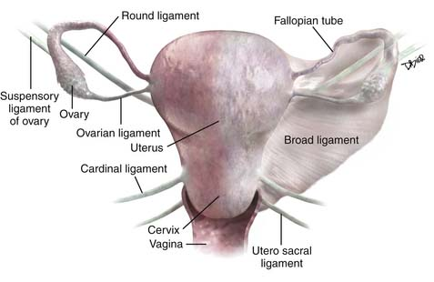
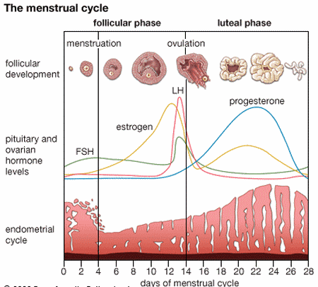
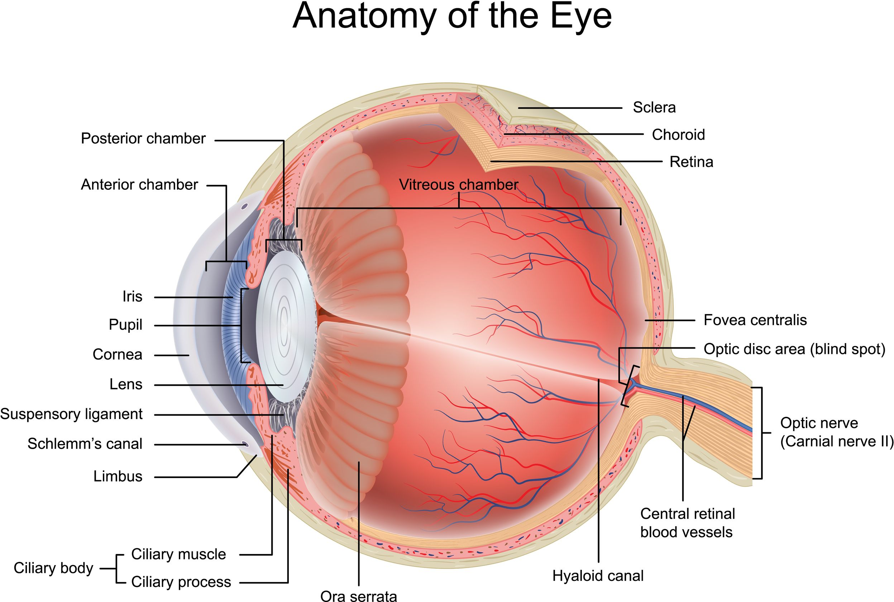
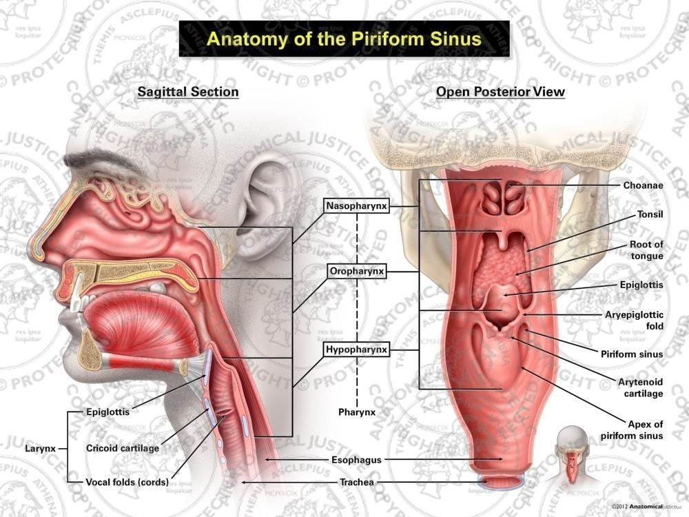
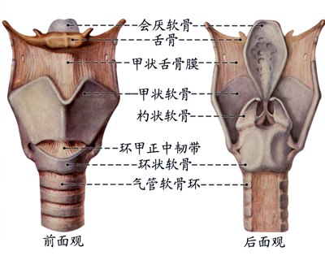
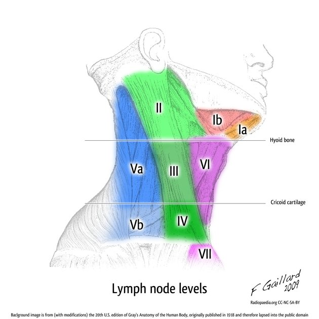

# 產科（考題47）

## Ante-Partum產前時期（考題28）

- Maternal-fetal physiology（孕期母胎生理）
  - Cardiovascular system（心血管）
    - 母體：心輸出量上升（CO＝HRxSV）
      - 早期：**心搏量SV**增加
      - 後期：**心率HR**增加
    - 胎兒循環：umbilical vein（臍靜脈，1條）⭢ **ductus venosus（靜脈導管）**⭢ IVC（inferior vena cava，下腔靜脈）⭢ RA（right atrium，右心房）⭢ foramen ovale（卵圓孔）⭢ LA（left atrium，左心房）⭢ LV（left ventricle，左心室）⭢ aorta（主動脈）⭢ umbilical arteries（臍動脈，2條）⭢ placenta（胎盤）
  - Metabolism（代謝）
    - HPL（human placental lactogen，人體胎盤泌乳素）：**胎盤分泌**；降低胰島素敏感性 ⭢ 孕婦飯前低血糖、飯後高血糖/高胰島素
      - Exam：飯後血糖與巨嬰、新生兒低血糖等預後較相關
    - Progesterone（黃體素）：**<8wks by 黃體**；>8wks by 胎盤
  - Respiratory system（呼吸）
    - **黃體素**：CO2敏感性上升 ⭢ relative hyperventilation（相對過度換氣）+ tidal volume（潮氣容積）增加 ⭢ **呼吸性鹼中毒**
  - Hematologic system（血液）
    - 總血量上升：**足月可達40%**
    - 生理性貧血：**血漿增加 > 紅血球增加**
    - Exam：WBC增加、**凝血因子**增加、**血小板減少**
  - GI/anatomic/lab changes（腸胃/解剖/檢驗）
    - 子宮增大：appendix（闌尾）上移，妊娠後期可到右側腰部/右上腹；McBurney point（麥氏點）典型壓痛可不準
    - Progesterone（黃體素）使平滑肌鬆弛：esophageal peristalsis（食道蠕動）速度/幅度下降，lower esophageal sphincter（LES，下食道括約肌）張力下降 ⭢ GERD（gastroesophageal reflux disease，胃食道逆流）風險↑
    - Gastric emptying（胃排空）不要一概說後期變慢：
      - 1st trimester（第一孕期）：液體胃排空可較非懷孕延遲
      - 2nd/3rd trimester（第二/三孕期）：液體與固體胃排空多與非懷孕無明顯差異
      - Term elective cesarean（足月計畫性剖腹產，未進入產程）：標準禁食後，術前2hr喝 carbohydrate drink（碳水化合物飲料）或 tea with milk（含奶茶水），胃竇橫截面積可與禁食/純水無差異
      - Pitfall：真正 labor（產程）、近期固體食物、systemic opioids（全身性鴉片類止痛）或急診全麻仍當 aspiration（吸入）風險高，麻醉考題常保守視為 full stomach（飽胃）
    - Serum albumin（血清白蛋白）：血漿容積擴張稀釋 ⭢ 下降約10-15%
- Prenatal exam（產前檢查，共10次）
  - 1st trimester（第一孕期，**<17週，2次**）
    - 例行：確認懷孕、預產期（M+9，D+7）、**血型、感染、德麻篩檢**
    - 自費/篩檢：
      - CVS（chorionic villus sampling，絨毛取樣）：**10-12wk**；用絨毛細胞分析**胎兒染色體基因**
      - NIPT（non-invasive prenatal testing，非侵入性產前檢測）：11-14wk唐篩；看媽媽血中 **cell-free DNA**（游離胎兒DNA）
      - 第一孕期三件套：11-14wk唐篩；超音波頸部透明帶 + β-HCG（beta-human chorionic gonadotropin，β-人類絨毛膜促性腺激素）+ **PAPP-A**（pregnancy-associated plasma protein A，妊娠相關血漿蛋白A）；準確率90%
      - SMA（spinal muscular atrophy，脊髓性肌肉萎縮症）/Fragile X（脆弱X症候群）：10-20wk
      - 羊膜穿刺：16-20wk；羊水分析 for 肺成熟度（L/S ratio，卵磷脂/鞘磷脂比值）、感染survey、NTD（neural tube defects，神經管缺陷）、染色體基因異常
    - 孕期侵入子宮/胎兒環境處置：
      - 清除異常妊娠（葡萄胎/流產/死胎/感染）：不保胎
      - 保胎下操作：CVS/羊穿/PUBS（percutaneous umbilical blood sampling，經皮臍血採樣）、IUT（intrauterine transfusion，胎內輸血）、fetoscopic laser for TTTS（twin-to-twin transfusion syndrome，雙胞胎輸血症候群）、胎兒 shunt/手術
      - 原則：超音波導引**避開胎兒/胎盤/臍帶**；前後確認 FHR（fetal heart rate，胎心率）
      - Rh(-)：給 anti-D，預防媽媽自己產生 anti-D
      - Viable fetus（可存活胎兒）：可監測胎心、給 steroid、觀察早產
  - 2nd trimester（第二孕期，17-28週，2次）
    - 例行：Echo（超音波；胎兒畸形篩檢，橫徑/頭圍/腹圍/股骨長）
    - 自費/篩檢：
      - 高層次超音波：18-24wk；abnl＝**spina bifida（脊柱裂）、Lemon sign（額骨塌陷）、Banana sign（小腦結構變異）**
      - GDM（gestational diabetes mellitus，妊娠糖尿病）：24-28wk
      - 四指標唐篩：15-20wk；**AFP**（alpha-fetoprotein，甲型胎兒蛋白；**Trisomy下降、NTD上升（甲脊升）**）+ **β-HCG**（Down's上升、Edwards下降）+ uE3（unconjugated estriol，游離雌三醇）下降 + **inhibin A上升**；準確率83%
  - 3rd trimester（第三孕期，29-40週，6次）
    - 32wk：VDRL（Venereal Disease Research Laboratory，梅毒篩檢）
    - **36wk：GBS**（group B Streptococcus，B群鏈球菌）檢查
    - 例行產檢
- Baby health（胎兒/新生兒健康）
  - GA（gestational age，胎齡）：CRL（crown-rump length，頭臀長，mm）+ 42 days；或 CRL（cm）+ 6 wks
  - Thalassemia（地中海型貧血）
    - α：Ch16 deletion（原口訣：A片低級）；4個等位gene
      - 分級：Silent carrier（3個正常）、Trait（2個正常，Hb降低，Asymp）、HbH（1個正常，慢性貧血）、Hb **Bart's**（0個正常，死胎）
    - β：Ch11 mutation/replacement（原口訣：B咖被取代）；2個等位gene
      - 分級：Minor（1個正常，輕微貧血）、**Major（2個異常，Cooley anemia）**
  - FGR（fetal growth restriction，胎兒生長受限）：<10th percentile
    - RF/原因：感染、胎兒結構異常、母親疾病
    - 分類：
      - Symmetrical（對稱型）：全身小；第一孕程問題
      - Asymmetrical（不對稱型）：第二孕程後；頭正常、腹圍小（養分先給頭）
    - Exam：FSD（fundal symphysis distance，子宮底-恥骨聯合距離；皮尺量）、Echo（可評估是否對稱性）
    - 體重考點：正常國人體重＝**1500g in 32wks**，2500g in 37wks；出生 >2200g 才能出院
- 產前胎兒評估（胎心率基線110-160bpm，**變異度>5bpm**）
  - NST（non-stress test，無壓力試驗）
    - Reactive：**20分鐘內有2次加速（加速 ≥15bpm 且持續 ≥15秒）**；99%出生一週內健康
    - Non-reactive：叫醒寶寶或3-5天後重做（正常寶寶睡覺時間<1hr）
  - Doppler ultrasound（都卜勒超音波）
    - 用途：臍動脈為主；**>24wks **長期追蹤血流狀況
    - S/D ratio（systolic/diastolic ratio）：peak systolic velocity / end diastolic velocity；正常 <3，>3 表胎兒缺氧
    - RI（resistance index，阻力指數）：（S-D）/S；>0.6異常
    - 胎兒窘迫 pattern：AEDV（absent end-diastolic velocity，舒張末期血流消失）、REDV（reversed end-diastolic velocity，舒張末期血流逆流）⭢ **>32wks 立即引產**
  - BPP（biophysical profile，生物物理評估）
    - 組成：NST reactive + 超音波4項；5項各2分，滿分10分
    - 分數：8-10 reassuring；6 equivocal；<6評估 delivery
    - 超音波4項：
      - 呼吸：≥1次且持續 **≥30秒/30分鐘**
      - 胎動：**≥3次/30分鐘**
      - 肌張力：肢體/軀幹伸展後屈曲 **≥1次/30分鐘**
      - 羊水量：MVP/SDP（maximum vertical/single deepest pocket，**最大垂直/單一最深羊水池）≥2cm**
        - Cut-off：**AFI（amniotic fluid index，羊水指數）<5cm** 或 **MVP/SDP <2cm＝oligohydramnios**（羊水過少）
- APH（antepartum hemorrhage，產前出血）：孕20週後出血
  - Placenta previa（前置胎盤）
    - SS：懷孕 >20wks 無痛性出血
    - Exam：Echo看胎盤位置；**禁止內診**
    - Tx：穩定母體 vital、監測胎兒心律、剖腹生產
  - Placental abruption（胎盤早剝）
    - SS：無週期性陣痛性出血；出血量與剝離程度不相關
    - Exam：Echo可見 retroplacental hematoma（胎盤後血腫）
    - 手術發現：**uteroplacental apoplexy（子宮胎盤中風）**＝Couvelaire uterus；收縮力仍足夠，一般孕後不用切子宮止血
    - Tx：mild可**安胎至胎兒成熟**；severe需穩定母體 vital + 剖腹產
  - **Vasa previa（胎膜血管前置）**：無痛性出血；破水時大量出血
  - Uterine rupture（子宮破裂）：陣痛性出血；產婦常有子宮手術史
- 早產：<37wks生產
  - RF：早產陣痛（40%）、早期破水、多胞胎、**子宮頸 <3cm**、子癲前症
  - Exam：**fetal fibronectin**（胎兒纖維連接蛋白）；24-34wks陰道分泌物 **>50ng/ml 表早產風險高**
  - 依周數：
    - **Late preterm：35-37wks，75%**
    - Moderate preterm：**32-34wks**
    - Very preterm：28-32wks
    - Extremely preterm：<28wks
  - 依體重：
    - **LBW（low birth weight，低出生體重）：<2500g**
    - VLBW（very low birth weight，極低出生體重）：<1500g
    - ELBW（extremely low birth weight，超低出生體重）：<1000g
- PTL（preterm labor，早產陣痛）：<37週前規律子宮收縮**（4次/20min）**+ 子宮頸變化**（>2cm/80%薄）**
  - Tx：
    - Tocolytics（安胎藥物）：延後生產
    - Betamethasone：<34wks for 促肺成熟
    - MgSO4（magnesium sulfate，硫酸鎂）：**<34wks for 避免腦麻、同時有避免子宮收縮功能**
    - 子宮頸環紮術：for 第二孕程無痛擴張
- PROM（premature rupture of membranes，**早期破水）：50%兩天內分娩**
  - RF：PROM hx、生殖道感染、產前出血、smoking
  - Exam：
    - Nitrazine test（pH test）：羊水 pH >6.5 呈藍色
    - Amino-dye infusion：indigo carmine 打入羊水，30min後陰道有染劑；舊 gold standard
    - **PAMG-1（placental alpha microglobulin-1；AmniSure test）：棉棒採樣快篩；當今最準且無周數限制**
  - Tx：tocolytics for <32wks、抗生素（預防感染）、Betamethasone（促肺成熟）
- 安胎藥物（tocolytics）
  - Ritodrine（Yutopar）：舊考點＝唯一 FDA-approved 安胎藥；SE多＝心悸喘、心跳上升/可能血壓上升、**低血鉀、高血糖**
  - Nifedipine（calcium channel blocker，鈣離子阻斷劑）：>32wks一線；不可並用 MgSO4
  - MgSO4（magnesium sulfate，硫酸鎂）：only FDA for 子癲前症預防；安胎屬 off-label；SE＝低壓、低鈣、水腫、燥熱
  - Indomethacin（NSAID，non-steroidal anti-inflammatory drug，非類固醇抗發炎藥；長期用有流產風險）：<32wks一線；>32wks C/I（會關 PDA）
  - Atosiban：專注子宮，不喘

## Delivery分娩（考題7）

- 生產前評估
  - 骨盆類型（pelvic types）：
    - **Gynecoid（女性型）：50%，圓形，最適合生產**
    - Android（男性型）：心形，預後差
    - Anthropoid（猿人型）：橢圓形
    - Platypelloid（扁平型）：扁圓形
  - 胎位（presentation）：
    - **Cephalic**（頭位）：95%；**LOA（left occiput anterior，左枕前位）最常見**
    - Breech（臀位）：3-4%
    - Shoulder（肩位）：0.5%
  - Bishop score（子宮頸成熟度）：
    - 項目＝dilation（擴張）、effacement（變薄）、station（胎頭高度）、cervical consistency（質地）、cervical position（子宮頸位置，懷孕末期會往後移）
    - Exam：**總分>8＝子宮頸成熟**，可引產；不是子宮頸開8cm
    - Pitfall：**active phase起點＝子宮頸擴張≥6cm，不是Bishop分數**
  - 陰道生產撕裂傷：
    - 1st degree：皮膚/黏膜撕裂
    - 2nd degree：肌肉撕裂
    - 3rd degree：肛門括約肌撕裂，需對齊縫合＋抗生素
    - **4th degree：肛門括約肌＋直腸黏膜撕裂**
- Cardiotocography（CTG，胎兒心跳監測）
  - 正常：baseline 110-160 bpm，**變異度>5 bpm**
  - Category處理：
    - Category I（reassuring）/Category II（indeterminate）：Obs
    - Category III（non-reassuring）：孕婦**左側躺或膝胸位**、停用子宮收縮刺激、tocolytics（安胎藥）、**氧氣、IV fluids**；嚴重異常＝立即剖腹產
  - Category III常考：
    - **Sinusoidal pattern（正弦波型）**直接算Category III
    - Absent baseline variability（無基線變異）＋recurrent late decelerations / recurrent variable decelerations / bradycardia
  - 速率/變異度異常：
    - Tachycardia（胎兒心跳過快）>160 bpm：**母親焦慮**、缺氧、感染、安胎藥
    - **Bradycardia**（胎兒心跳過慢）<110 bpm：**胎兒窘迫**
    - 變異度減少<5 bpm：睡著、缺氧、酸血症、中樞抑制劑/止痛藥、母親低血壓
  - Deceleration（減速）判讀：
    - Early deceleration：頭部受壓，與陣痛同步
    - Late deceleration：胎盤機能不足/胎兒窘迫，宮縮中期才出現
    - **Variable deceleration：臍帶受壓**，不規則出現
- 正常分娩與產程遲滯
  - 產兆＝破水、bloody show（血性分泌物）、true labor（規律漸強陣痛，止痛劑無效）
  - 產程異常：先分期，再評估**3P（Power子宮收縮、Passenger胎兒、Passage骨盆）**
    - Latent phase（潛伏期）：<6cm；4-6cm可慢，不要太早診斷arrest
    - Active phase（活動期）：≥6cm
  - Prolonged latent phase（潛伏期太久）：
    - Dx：**初產婦>20hr，經產婦>14hr**
    - Tx：休息/鎮痛鎮靜/觀察 ± amniotomy（人工破膜）；非緊急**不首選oxytocin**
  - Protraction disorders（進展太慢）：
    - Dx：active phase子宮頸擴張/胎頭下降過慢；**初產婦擴張<1.2cm/hr**
    - Tx：觀察支持，評估3P
  - Arrest disorders（進展停止）：
    - 原則：先排除CPD（**cephalopelvic disproportion，頭盆不對稱**）；有CPD不催生，改剖腹
    - 無CPD且宮縮不足：**amniotomy/oxytocin**
    - 第一產程arrest（Active phase（6 to 10 cm））：≥6cm且破水後，**足夠宮縮4hr或不足宮縮＋oxytocin 6hr仍無擴張**；足夠產力＝Montevideo units（MVU/MU，蒙特維多單位）**≥200**（多數可進入/維持 active phase）
    - 第二產程arrest（子宮頸全開後仍生不出）：無**epidural止痛>2hr（初產婦3hr）**；**有epidural 多一小**
      - 補：第一產程＝開子宮頸；第二產程＝生小孩；第三產程＝生胎盤。
- 催產、TOLAC/VBAC、過期妊娠（>42wks）
  - 催產藥物：
    - Oxytocin（IV）：促子宮收縮；SE＝水中毒
    - Prostaglandin E2（PGE2，Cervidil陰道塞劑）：促**子宮頸成熟**；SE＝噁心、嘔吐、頭暈、發燒、腹瀉
  - 催生適應症（indication）：**過期妊娠、早期破水、子癲前症**
  - 催生禁忌（contraindication）：前置胎盤、高風險子宮疤痕/**古典式縱切**、生殖器**皰疹感染**
  - TOLAC/VBAC（剖腹產後嘗試陰道產）：
    - TOLAC（trial of labor after cesarean，剖腹產後試產）＝過程
    - VBAC（vaginal birth after cesarean，剖腹產後陰道產）＝成功結果
    - 適合：前次子宮下段橫切（low transverse cesarean）
    - C/I：古典式縱切（classical incision）、曾子宮破裂（uterine rupture）、前置胎盤等不可陰道產原因
    - 併發症：**uterine rupture/dehiscence**（子宮破裂/疤痕裂開）、感染/輸血↑
  - 過期妊娠：
    - Dx：>42wks；RF＝過期hx、**初產婦、肥胖產婦**
    - 併發症＝胎兒窘迫、胎便吸入、羊水過少、胎兒過大（>4000g）
    - Tx：>41wks催生可降低死亡率；子宮頸成熟用oxytocin，**不成熟先用PGE2/子宮頸成熟處置**
- 陰道助產與肩難產
  - 真空吸引器（vacuum extraction，陰道助產）：
    - 條件＝子宮頸全開10cm＋破水＋**頭位/胎頭位置已知**＋head engaged（胎頭銜接，常考**station≥+2**）＋無CPD頭盆不對稱
    - 避免：<34wks
    - 停損：3次pop-off，或約20min/3次牽拉無進展
    - Pitfall：**Bishop總分>8**；active phase≥6cm；**真空吸引器需全開10cm**
  - 肩難產：
    - Dx：head-to-body超過**1min**；Exam＝Turtle sign（胎頭娩出後回縮）
    - RF＝巨嬰、胎肩與骨盆不對稱、GDM（gestational diabetes mellitus，妊娠糖尿病）
    - Tx原則＝先叫人、停止過度牽拉、避免fundal pressure（宮底加壓）
    - HELPERR流程＝Help（找產科/麻醉/小兒科支援）、Evaluate episiotomy（評估會陰切開，只增加操作空間）、Legs（McRoberts maneuver，雙腿屈膝抱胸）、suprapubic pressure（恥骨上施壓）、Enter maneuvers（陰道內旋轉：**Reverse Woods corkscrew推後肩背側**）、Remove posterior arm（**取出後臂，靠媽媽屁股的叫後**）、Roll to all fours（媽媽Gaskin四足位）
    - 併發症＝Brachial plexus palsy（**臂神經叢麻痺**；Erb-Duchenne C5-6（導致肩膀內旋、手軸伸直、肩盂關節發育不良）、Klumpke C8-T1（Horner's syn））、clavicle fracture（鎖骨骨折）
- 流產
  - 自發性流產：
    - RF＝高齡、抽菸吸毒喝酒、**孕期NSAIDs**（non-steroidal anti-inflammatory drugs，非類固醇抗發炎藥）、葉酸不足、Trisomy、子宮異常
    - Tx： threatened abortion（先兆性流產，**子宮頸未開但下腹痛/出血**）可**黃體素安胎**；inevitable/incomplete/missed abortion走流產處置
  - Pregnancy termination（人工流產）：<24wks可執行
    - 藥物：**<7wks用misoprostol**；>15wks用misoprostol ± mifepristone
      - 子宮內孕墮胎一定要有misoprostol（宮縮、子宮軟化，才能排出）；Mifepristone、Methotrexate只是破壞懷孕
    - 手術：D&C（dilation and curettage，子宮擴刮術）for <14wks；胎兒太大會失血過多

## Postpartum產後時期（考題1）

- 產後出血（Postpartum hemorrhage，PPH）：
  - 定義：Primary PPH＝**產後<24hr**；Secondary PPH＝產後**24hr-12wks**；量＝陰道分娩>500ml、剖腹產**>1000ml**
  - RF：4T
    - Tone（子宮無力，70%）：多胎、巨嬰、羊水過多、急產
    - Trauma：產道/子宮損傷
    - Tissue：胎盤組織殘留或植入性胎盤
    - Thrombin：凝血異常
  - Tx：子宮按摩 → 宮縮藥物（Oxytocin、**Prostaglandin E1（PGE1，前列腺素E1）**、ergonovine） → 手術/介入（氣球填塞、子宮動脈栓塞術、子宮切除術）
  - SE：hypovolemic shock（低血容性休克）、anemia（貧血）、Sheehan syndrome（產後垂體功能不全；PPH休克→垂體缺血壞死；**乳汁分泌減少、月經不來、低血糖、低血壓**）
  - 植入性胎盤（Placenta accreta spectrum，PAS；除非明確生育需求不然未來不保子宮）：
    - 特徵：胎盤異常附著/侵入子宮肌層，臨床可無症狀；考試常接在PPH的Tissue
    - RF：前置胎盤、剖腹產史
    - 分類：**Accreta（附著肌層表面，80%）**、Increta（侵入肌層）、Percreta（穿透子宮壁，可能侵犯膀胱）
    - Exam：Echo
    - Tx：**>34wks剖腹產**+子宮切除術
- Newborn：
  - 穩定度評估：Apgar score（Appearance皮膚顏色、Pulse心跳、Grimace反應、Activity肌張力、Respiration呼吸）＝每項0-2分，總分0-10分，**>7分正常**
  - 肺成熟度評估：
    - **Lecithin/Sphingomyelin ratio（L/S ratio**，卵磷脂/鞘磷脂比值）：**>2成熟**
    - Phosphatidylglycerol（PG，磷脂醯甘油）：presence＝成熟
    - **Shake test**（羊水酒精震盪試驗）：presence＝有介面活性劑/成熟
- Puerperium（產褥期，分娩後6週）：
  - 生理變化：
    - 子宮復舊：**1000g縮小到50-100g**
    - **Lochia**（惡露）：共200-500cc；Rubra（紅色）→ Serosa（粉色，<2wks）→ **Alba（白色，2wks後）**
    - 賀爾蒙復原：β-HCG下降，性激素約3wks下降，**月經約6months內恢復**
    - 乳房：漲奶；哺乳性乳腺炎 mainly by **Staphylococcus aureus**（金黃色葡萄球菌）
  - 產褥熱：>38℃，產後**24hr-10days**
    - RF/source：泌尿道感染（1st）、子宮內膜炎（剖腹產風險高）
    - Obstetric sepsis（產科敗血症）：常見來源＝**urinary tract infection**（UTI，泌尿道感染）/pyelonephritis、chorioamnionitis（絨毛膜羊膜炎）、endometritis、wound infection
    - 常見菌：**E. coli（最常見）**、Group B Streptococcus/Group A Streptococcus（GBS/GAS）、Staphylococcus aureus、anaerobes、Enterococcus、Klebsiella
      - Listeria可見於孕期胎兒感染，但孕婦產科敗血症相對少見
  - 母乳特徵：
    - Colostrum（初乳）：產後3-5天，黃色、富含**免疫球蛋白**
    - Mature milk（成乳）：產後2週，有**IgA、cytokine**；缺Vit K，故新生兒出生要打Vit K
- Peripartum cardiomyopathy（PPCM，圍產期心肌病變）：
  - Dx三要素：懷孕**最後1個月～產後5個月出現**heart failure（HF，心衰竭）、排除其他HF原因、Echo見left ventricular systolic dysfunction（左心室收縮功能障礙，left ventricular ejection fraction（LVEF，左心室射出分率）<45%；左心室可擴大但非必要）

## High-risk pregnancy高危險妊娠（考題11）

- Preeclampsia（子癲前症）/孕期高血壓：
  - 定義先分時間與有無器官傷害：
    - Chronic hypertension（慢性高血壓）：**<20wks已高血壓**
    - Gestational hypertension（妊娠高血壓）：>20wks高血壓，無蛋白尿/器官失能
    - Preeclampsia（子癲前症）：>20wks高血壓 + **蛋白尿或器官失能**；90% >34wks發病（late onset預後較佳）
    - Eclampsia（子癲症）：preeclampsia + **seizure（癲癇）**
    - HELLP syndrome（Hemolysis, Elevated Liver enzymes, Low Platelets，**溶血/肝酶升高/血小板低下**）
  - 機轉：unknown，可能與胎盤血管生成異常（sFlt-1↑，**VEGF/PlGF↓**）有關
  - RF＝gestational diabetes mellitus（GDM，妊娠糖尿病）、hypertension（HTN，高血壓）、多胞胎、自體免疫疾病
  - Exam：
    - BP：SBP/DBP（systolic/diastolic blood pressure，收縮壓/舒張壓）**>140/90**
    - 蛋白尿：**24hr尿蛋白>300mg**，**尿蛋白/肌酐比>0.3，dipstick ≥2+**
    - Severe features：血小板低下、腎功能惡化/寡尿、肝功能異常或右上腹痛、肺水腫、新發頭痛/視覺症狀
  - 併發症：腦出血/腦中風、胎兒生長遲緩、胎盤剝離
  - Tx：
    - Delivery（生產）：唯一根治；>34wks常考慮引產
    - MgSO4（magnesium sulfate，硫酸鎂）：預防子癲症；C/I＝**myasthenia gravis（MG，重症肌無力）、肺水腫**；SE＝**燥熱、低血壓、肺水腫、鎂中毒（抑制神經肌肉傳導，使用要規律測DTR**）
    - 降壓：Labetalol（急性用，氣喘不用）、Nicardipine（急性用）、**Methyldopa**（慢性安全）；目標＝**130-150/80-100**，太低胎兒灌流會下降
    - 禁忌：ACEi/ARB（angiotensin-converting enzyme inhibitor/angiotensin receptor blocker，孕期不可用）
    - **Aspirin：高風險者12-28wk給，最有效預防**
- Intrahepatic cholestasis of pregnancy（ICP，妊娠肝內膽汁淤積症）：
  - SS：晚孕期手掌/腳掌搔癢，無皮疹
  - Exam：
    - **Serum bile acids（血清膽汁酸）↑**：最能**預測胎兒窘迫/早產/胎死**；>100 μmol/L風險高
    - ALT & AST（肝酵素）↑；**不準（孕期本來就會高）**
  - Tx：ursodeoxycholic acid（UDCA，熊去氧膽酸）改善孕婦搔癢 + 胎兒監測/適時生產
- Gestational diabetes mellitus（GDM，妊娠糖尿病）：
  - 重點：50%孕婦20年內發展diabetes mellitus（DM，糖尿病）；子女多肥胖
  - RF＝非裔美國人、肥胖、GDM病史、多胞胎、多囊卵巢
  - Exam：OGTT（oral glucose tolerance test，口服葡萄糖耐受試驗；75g）陽性＝fasting >92，1hr >180，2hr >153
  - 母嬰影響：
    - 母體：maternal diabetic ketoacidosis（DKA，糖尿病酮酸中毒，DM I）/hyperosmolar hyperglycemic nonketotic state（HHNK，高滲透壓高血糖非酮症狀態，DM II）、流產、畸形
    - 胎兒/新生兒：macrosomia/LGA（巨嬰/large for gestational age，同周數體重過重）→ shoulder dystocia（肩難產）；newborn（NB，新生兒）三高二低＝呼吸rate↑、紅球↑、膽紅素↑、血鈣↓、血糖↓（∵胎兒高胰島素血症）
  - Tx：
    - 第一線：飲食運動 + 自我監測血糖
    - 第二線：insulin（胰島素，標準且不過胎盤）
    - 口服藥：Glyburide、Metformin需個案評估（可過胎盤）
- 懷孕甲狀腺疾病：
  - 成因：Graves' disease（葛瑞夫茲病，甲亢）、human chorionic gonadotropin-mediated hyperthyroidism（hCG-mediated hyperthyroidism，人類絨毛膜促性腺激素相關甲亢）
  - SS/Exam：焦慮手抖、孕婦增重變慢、劇吐、TSH（thyroid-stimulating hormone，促甲狀腺素）↓、free T4（游離甲狀腺素）↑
  - Tx：
    - Propylthiouracil（PTU）：孕期首選；SE＝肝毒性
    - β-blocker（乙型阻斷劑）：控制心搏過速；SE＝胎兒生長遲緩

# 婦科（考題121）

## Embryology and Anatomy（題目少）（考題2）

- Anatomy：
  - 外陰/前庭 homolog：
    - Skene's gland（尿道旁腺，＝男性攝護腺）
    - Bartholin's gland（大前庭腺，＝男性 bulbourethral/Cowper's gland 尿道球腺）
    - Bulb of the vestibule（前庭球，＝男性 bulb of penis 陰莖球）
  - 尿道括約肌：球海綿體肌＋深會陰橫肌＋提肛肌
  - 子宮韌帶：
    - Broad ligament（闊韌帶）：包住輸卵管、圓韌帶、卵巢韌帶
    - Suspensory ligament（懸韌帶）：卵巢血管走行
    - Round ligament（圓韌帶，弓帶遺跡）：過腹股溝連接大陰唇，維持子宮前傾
    - Ovarian ligament**（卵巢固有韌帶，弓帶遺跡）：連接卵巢與子宮**
    - 圖：
  - 輸尿管走勢（下上下）：
    - 上段：在卵巢血管下
    - 中段：在**內髂動脈**上
    - 下段：在卵巢/子宮動脈下（小橋流水）
  - 淋巴回流：
    - 子宮：外髂 lymph node（淋巴結）
    - 陰道：內髂 lymph node（淋巴結）
    - **卵巢：主動脈旁 lymph node**（淋巴結）
    - **陰唇：淺腹股溝 lymph node**（淋巴結）

## 婦科Tumor（考題71）

- 卵巢：
  - SS：多無特異；腹痛、頻尿
  - 併發症：
    - 腫瘤扭轉：mainly teratoma（畸胎瘤）
    - 囊腫破裂：mainly **黃體囊腫**
  - Exam：
    - 內診
    - 超音波：惡性特徵＝**非高回音、分葉、有血流**
    - Tumor marker（腫瘤標記）：上皮細胞＝CA-125（cancer antigen 125）、CA 19-9（carbohydrate antigen 19-9）、CEA（carcinoembryonic antigen，癌胚抗原）；生殖細胞＝AFP（alpha-fetoprotein，甲型胎兒蛋白）、β-hCG（beta-human chorionic gonadotropin，β-人類絨毛膜促性腺激素）、LDH（lactate dehydrogenase，乳酸脫氫酶）
    - 病理/切片：用來確認分類
  - Tx：
    - 觀察：for 功能性卵巢囊腫
    - 手術：for 其他卵巢腫瘤/不消退囊腫
  - Ovarian cyst（卵巢囊腫，**1st 卵巢良性病灶**）：
    - 功能性囊腫：
      - 包含：濾泡囊腫、黃體囊腫、卵巢黃體囊腫
      - 性質：都良性
      - Exam：超音波追蹤
      - Tx：觀察為主；手術 for 破裂或 **>10 wks 沒消**
    - 發炎性：endometrioma（巧克力囊腫），sono（超音波）呈沙沙狀質地
    - 感染性：abscess（膿瘍）
  - Ovarian tumor（卵巢腫瘤，**95%原發性**）：
    - 分類：
      - Epithelial tumor（上皮細胞瘤，70%）
      - Sex cord-stromal tumor（性索間質瘤，10%）
      - Germ cell tumor（生殖細胞瘤，10%）
      - Meta（轉移）＝Krukenberg tumor（庫肯勃氏瘤）：from 胃（1st）、腸、胸；Exam＝組織 **signet-ring cell（印戒細胞）**
    - Ovarian epithelial carcinoma（上皮性卵巢癌，最常見卵巢惡性；常晚期/預後差）：
      - 最常見：serous carcinoma（漿液性癌），尤其 **high-grade serous carcinoma（高級別漿液性癌）**
      - RF：老、初經早、停經晚、無生育、**BRCA1/2**、Lynch syndrome（HNPCC，hereditary nonpolyposis colorectal cancer，遺傳性非息肉性大腸癌）
      - 保護因子：**OCP（oral contraceptive pill，口服避孕藥）**、結紮、多產、哺乳
      - Type I（低惡性度，階段式進展，常早期）：
        - 注意：不是 estrogen-related（那是子宮內膜癌 Type I 概念）
        - Low-grade serous（低級別漿液性）：KRAS/BRAF
        - Mucinous（黏液性）：**KRAS**
        - Endometrioid/clear cell（子宮內膜樣/透明細胞）：常與 **endometriosis**（子宮內膜異位）相關；PTEN/ARID1A/PIK3CA
      - Type II（高惡性度，常晚期）：
        - High-grade serous（高級別漿液性）：TP53、BRCA/HRD（**homologous recombination deficiency**，同源重組修復缺陷）
        - 來源：常源自**輸卵管傘端 STIC**（serous tubal intraepithelial carcinoma，輸卵管漿液性上皮內癌）
        - Pitfall：BRCA 主要連 high-grade serous，不是 mucinous
      - Exam/分期：
        - 內診：adnexal mass（附件腫塊）
        - Echo（超音波）、tumor marker（如 CA-125）
        - FIGO（International Federation of Gynecology and Obstetrics，國際婦產科聯盟）分期：I 卵巢內、II 骨盆內、III **骨盆外腹膜/後腹腔淋巴**、IV 遠端
      - Tx/預後：
        - 手術分期/減積（debulking）：追求 **no gross residual**；傳統 optimal <1 cm
        - 化療：platinum-taxane，常用 **carboplatin + paclitaxel**；早期低風險不一定需化療
        - 預後好：stage 低、年輕、術後 CA-125 快速下降
    - Ovarian germ tumor（卵巢生殖細胞瘤；多良性、年輕、**多單側**；惡性者常快速生長/有症狀）：
      - Tx：
        - Fertility-sparing staging surgery（生育保留分期手術）：USO（unilateral salpingo-oophorectomy，單側輸卵管卵巢切除）＋全面分期；**對側卵巢不常規切片，除非高度懷疑**
        - BEP（bleomycin、etoposide、cisplatin）化療：for 惡性/高風險；**immature teratoma Stage IA + grade 1 可只手術觀察**，stage > I 或 grade 2/3 多需輔助BEP
        - Pitfall：second-look operation（二次剖腹探查）已不常規；追蹤靠影像＋tumor marker。若化療後 marker 正常但殘存腫塊變大＝growing teratoma syndrome（生長性畸胎瘤症候群）→ secondary cytoreduction（二次減積手術）
      - 分類：
        - Mature cystic teratoma（成熟囊性畸胎瘤＝**dermoid cyst 皮樣囊腫**）：AFP正常，脂肪/牙齒為主；生殖細胞腫瘤 1st；<1% 惡性轉化（**Rokitansky nodule **實質結節為惡化特徵），最常見轉成 **squamous cell carcinoma**（鱗狀細胞癌）
        - Immature teratoma（未成熟畸胎瘤，惡性）：年輕，切片含有未成熟神經組織、混有yolk sac tumor（AFP上升）；依 grade 決定風險
        - Dysgerminoma（無性細胞瘤，**1st 惡性**）：**LDH↑、β-hCG↑**；放療敏感度高（其他 germ tumor 低）；對應男性 **seminoma**；切片＝fried egg cell
        - Yolk sac tumor（卵黃囊瘤＝**endodermal sinus tumor**）：2nd 惡性；AFP↑；年輕/單側/快速；切片＝Schiller-Duval body（甜甜圈）；Tx＝化療＋手術
        - Gonadoblastoma（性腺母細胞瘤，germ＋stromal 間質）：易惡化；Tx＝發現即切
        - **Choriocarcinoma（絨毛膜癌）：β-hCG↑**
        - Embryonal carcinoma（胚胎癌）：AFP↑、β-hCG↑
      - 常見四大惡性排序：dysgerminoma（類似睪丸 seminoma，LDH↑）> endodermal sinus/yolk sac tumor（類似肝細胞癌，AFP↑）> **immature teratoma** > mixed germ cell tumor
    - Ovarian sex-cord stromal tumor（卵巢性索間質瘤；多**良性、年輕**）：
      - Exam：
        - Tumor marker：inhibin、**E2**（estradiol，雌二醇）、**DHEA**（dehydroepiandrosterone，去氫表雄酮）
        - 子宮內膜取樣：for granulosa cell tumor/thecoma，尤其異常出血或**內膜增生 >5 mm**
      - Tx：
        - 手術：單側切除；**年老合併輸卵管切除；淋巴腫大者合併淋巴切除**
        - 化療：> Stage IC，mainly **BEP（bleomycin、etoposide、cisplatin）**
      - Estrogen 造成：
        - **Granulosa cell tumor**（顆粒細胞瘤，1st 惡性，預後好）：好發＝停經後、小女孩性早熟；病理＝coffee bean grooved nuclei、Call-Exner bodies
        - Fibroma（纖維瘤，1st 良性）：不分泌賀爾蒙；SS＝Meigs' syndrome（腹水＋肋膜積水，切除後即消失）
        - **Thecoma**（卵泡膜細胞瘤，良性為主）：25% 伴隨內膜增生
      - Androgen 造成：
        - Sertoli-Leydig cell tumor（支持-間質細胞瘤）
- 子宮
  - Uterine myoma（子宮肌瘤，leiomyoma，1st良性，1/3育齡女子；快速生長但不癌化）：
    - 分類：
      - Submucosal（黏膜下，type 0-2）：出血主因，影響生育主因
      - Intramural（肌層內，type 3-4）
      - Subserous（漿膜下，type 5-7）：疼痛主因，較不影響生育
    - Exam：
      - 內診：不規則腫塊
      - Echo（超音波）：初步評估
      - 子宮鏡：for 懷疑submucosal/intracavitary lesion（腔內病灶）
      - MRI（magnetic resonance imaging，磁振造影）：最準、鑑別惡性；**停經後血流減少可見爆米花鈣化＝良性**
    - Tx：
      - Observation（觀察）：for 無症狀
      - **GnRH agonist/antagonist**（gonadotropin-releasing hormone，促性腺素釋放素促效/拮抗劑）：**唯一可縮小肌瘤的賀爾蒙治療**；for 術前減積/快停經一路打到停經；SE＝骨鬆
      - Progestin-releasing intrauterine device（IUD，黃體素釋放子宮內避孕器）：控出血
      - Uterine artery embolization（UAE，子宮動脈栓塞）：想懷孕者慎用
      - Myomectomy（子宮肌瘤切除術）：保留生育能力；hysterectomy（子宮切除術）：不保留生育能力
    - 孕期**red degeneration**（紅色變性）：急性疼痛，多保守治療（止痛/休息），通常不手術
  - Endometrial polyp（子宮內膜息肉，良性腔內病灶）：
    - SS＝經期過長/間斷性出血、intermenstrual bleeding（IMB，經間期出血）；通常不像肌瘤以經血過多為主
    - Exam：
      - Transvaginal sonography（TVS，陰道超音波）：**月經剛結束Day 5-10內膜薄時最佳**；子宮腔內focal平滑高回音
      - 子宮鏡：可診斷/切除
    - Pitfall＝submucosal myoma多**低回音+聲影/輪廓扭曲**
  - Endometrial hyperplasia（子宮內膜增生，考題少）：
    - 分類：complex atypical hyperplasia（複雜非典型增生）惡性率約3成；其他多良性
    - Exam＝Echo（**月經後/停經>5mm要內膜取樣**）、子宮內膜取樣
    - Tx＝Progestin（黃體素；for 無atypia，**或有atypia但需生育者**）；hysterectomy（子宮切除術；for atypia）
  - Endometrial cancer（子宮內膜癌，mainly **adenocarcinoma**腺癌，1st婦科惡性，60-70歲，多早期診斷）：
    - RF＝肥胖、diabetes mellitus（DM，糖尿病）、hypertension（HTN，高血壓）、**polycystic ovary syndrome（PCOS，多囊性卵巢症候群）、Lynch syndrome（林奇症候群）**
    - SS＝**異常子宮出血；postmenopausal bleeding**（PMB，停經後出血）最典型
    - Exam＝Echo（if >5mm）、切片、marker（CA125/CA199/CEA）、MRI（gold）
    - 分期＝FIGO（International Federation of Gynecology and Obstetrics，國際婦產科聯盟）staging：I局限於子宮、II侵犯子宮頸、III骨盆/腹腔播散、IV遠處轉移
    - Tx＝手術分期（hysterectomy+bilateral salpingo-oophorectomy（BSO，雙側輸卵管卵巢切除）±lymph node（LN，淋巴結）），**stage IV/明顯腹腔病灶才考慮cytoreduction（減積手術）**；化/放/賀爾蒙依stage/risk
    - PMB考法：最常見＝**內膜/陰道萎縮；最重要＝先排除endometrial cancer（約10%）**
    - Histology/Type：
      - Type I（子宮內膜增厚）：**estrogen-related**（肥胖/PCOS），endometrioid（80%，**grade 1-2，PTEN，分化好，預後好，常異常出血**）
      - Type II（子宮內膜萎縮）：non-estrogen-related，serous/clear cell（grade 3，**p53/Her2**，分化差，預後差）
  - **Sarcoma of uterus**（子宮肉瘤，中胚層，**易血行轉移，約10%已肺轉移**）：
    - 預後差＝high grade endometrial stromal sarcoma/undifferentiated uterine sarcoma
    - 預後好＝leiomyosarcoma（停經後快速變大的「肌瘤樣」腫塊、AUB、骨盆痛）、**adenosarcoma**、low grade endometrial stromal sarcoma
    - Tx＝hysterectomy+雙側輸卵管切除+淋巴取樣化驗，輔助放化療
- Human papillomavirus（HPV，人類乳突病毒）：**DNA virus**
  - 病毒/傳染＝大量製造E6/E7（抑制抑癌基因p53/Rb），性傳播/垂直傳染（新生兒多半能完全清除病毒），**潛伏於分裂旺盛basal cell**，80%女性曾感染
  - 分型：
    - Low risk：6/11（菜花）、40、42
    - High risk：**16與58（Taiwan重要）、18（子宮頸腺癌最相關）、31**
  - SS＝condyloma acuminatum（尖銳濕疣，HPV 6/11）、cervical intraepithelial neoplasia（CIN，子宮頸上皮內瘤變）、cervical cancer（子宮頸癌，squamous cell carcinoma（SCC，鱗狀細胞癌）為主）
  - Exam＝內診、Pap smear（子宮頸抹片檢查）、colposcopy（陰道鏡檢查）
  - Tx＝vaccine（預防，target HPV **L1蛋白**，九價＝6/11/16/18/31/33/45/52/58）；菜花局部藥物或手術切除；CIN觀察或手術切除；子宮頸癌手術+化放療
  - CIN（子宮頸上皮內瘤變/癌前病變）：
    - 位置＝squamocolumnar junction（SCJ，鱗柱上皮交接處）/transformation zone（轉化區）
    - 自然史＝多數HPV 1-2年清除；**CIN1兩年內60-90%消退（觀察為主）**；**CIN3/carcinoma in situ（CIS，原位癌）未治療有癌化風險**；HPV16最常見於CIN2/3與侵犯癌
    - Exam＝抹片篩檢：koilocytosis（病毒感染SSC特徵）、核質比上升、mitosis↑；開始性行為後三年一次
    - Tx＝ablation（燒灼/破壞）、conization（錐狀切除；治療兼診斷，可治**CIN3/adenocarcinoma in situ（AIS，腺原位癌）；約10%復發**）、陰道鏡切片（懷孕時不可endocervical curettage（子宮頸內膜刮除術））、子宮切除
- Cervical cancer（子宮頸癌，99.7%因HPV）：**SCC（70%）**/adenocarcinoma（25%）為主（治療沒有差異）
  - RF＝多重性伴侶、過早性行為、多產、社經地位低、抽菸
  - Exam/Dx＝Pap smear/HPV test為篩檢；診斷靠colposcopy-directed biopsy（陰道鏡導引切片）± endocervical curettage（ECC，子宮頸內膜刮除術）；若adenocarcinoma in situ（AIS，腺原位癌）或懷疑microinvasive adenocarcinoma（微侵襲腺癌）/需判定深度與切緣 → diagnostic excisional procedure/conization（診斷性切除/錐狀切片），不可只靠punch biopsy（小片切片）決定範圍
  - 分期＝FIGO staging：I局限子宮頸、II侵犯超出子宮頸但未達骨盆壁/陰道下1/3、III侵犯骨盆壁/陰道下1/3或淋巴結、IV侵犯膀胱/直腸或遠處轉移（cf. ovarian tumor）
  - Tx＝手術（早期，Stage I-IIA，包括子宮切除術、淋巴切除術、盆腔清掃術）、化放療（Stage IIB-IV）、pelvic exenteration（骨盆腔器官刨除術）
  - 保留生育：
    - IA1（基質侵犯≤3mm）且無lymphovascular space invasion（LVSI，淋巴血管空間侵犯）/切緣陰性：conization
    - IA2（>3-5mm）或小IB1/有LVSI：需淋巴結評估，可**radical trachelectomy**（根除性子宮頸切除術）
    - Radical hysterectomy（根除性子宮切除術）/放療會失去生育能力
  - 懷孕（vs一般孕婦）：早產風險高，存活率正常；Tx＝第二孕程conization（**IA、IB1，不可子宮頸刮除術**），**化放療（IB2以上，等生完再治療）**；生產＝剖腹產（避免會陰切開）
- Vaginal cancer（陰道癌，原發少，mainly轉移）：SCC為主，好發陰道**後壁上1/3**
  - SS＝陰道出血/分泌物，後期膀胱/直腸/骨盆侵犯
  - Exam＝抹片（篩檢）、切片（診斷）
  - 分期＝FIGO staging：I局限於陰道黏膜、II侵犯paravaginal器官（未到骨盆）、II侵犯骨盆壁/鼠蹊淋巴結，IV侵犯膀胱/直腸或遠處轉移
  - Tx＝手術（for 陰道上1/3 Stage I），**化放療（Stage III-IV）**
- Vulvar cancer（外陰癌，**4th婦癌**）：SCC為主
  - 路徑/RF：
    - HPV-related：HPV16/18，年輕、抽菸、免疫低下，usual vulvar intraepithelial neoplasia（VIN，外陰上皮內瘤變）/high-grade squamous intraepithelial lesion（HSIL，高度鱗狀上皮內病變），常多發
    - HPV-independent：老年，lichen sclerosus/lichen planus慢性發炎，**differentiated VIN**，較易進展
  - SS＝外陰搔癢/疼痛，不癒潰瘍或腫塊
  - Paget's disease of vulva（外陰佩吉特病；少數，intraepithelial **adenocarcinoma**，通常非HPV相關）：外陰紅斑/濕疹樣病灶/搔癢，易誤認皮膚炎
  - Tx＝手術切除為主 ± **鼠蹊/股淋巴評估**（sentinel node或淋巴切除；Stage IA且侵犯≤1mm通常不需淋巴處理），晚期加放化療
- Gestational trophoblastic disease（GTD，妊娠滋養細胞疾病，胎盤中滋養層增生）：
  - SS＝陰道出血、子宮**骨盆壓痛**、貧血、β-hCG↑
  - Exam＝超音波（**snow-storm pattern**）、β-hCG（>10萬 mIU/mL＝惡性度高；葡萄胎治療後仍惡性＝**β-hCG↑或6個月後仍有β-hCG**）
  - Tx：
    - 葡萄胎＝**suction curettage（吸引刮除術）**，hysterectomy if 不生了
    - 惡性＝化療（methotrexate（MTX）/actinomycin-D（Act-D），for choriocarcinoma絨毛膜癌），手術切除
    - F/U＝每週測量β-hCG直到正常
  - Pitfall＝葡萄胎不是保胎情境；8-9週molar pregnancy首選**suction curettage/evacuation（**想保留生育力），避免observation/hysterotomy
  - 良性：hydatidiform mole（葡萄胎，90%，pure良）
    - **Complete mole：46XX/XY（父源only），無胎兒組織，β-hCG較高，惡性/侵襲風險較高**
    - Partial mole：triploid（69XXY/XXX三倍體，父源x2母源x1），可見胎兒組織，**β-hCG較低，惡性風險較低**
  - 惡性：invasive mole、**choriocarcinoma**（症狀婦科不典型+易轉移，**血行為主，淋巴少見**，mainly**肺**，**化療反應佳**）、placental site trophoblastic tumor、epithelioid trophoblastic tumor

## 一般婦科學（考題10）

- Gynecological infection（婦科感染）
  - Bacterial vaginosis（細菌性陰道病，1st；菌相失衡，培養非診斷標準）
    - RF＝性行為、陰道灌洗、抽菸；菌種＝Gardnerella、Prevotella、Bacteroides、Ureaplasma
    - SS＝分泌物多、腐臭味
    - Exam＝Amsel criteria（Amsel氏準則，4取3）＝薄灰白均質分泌物、pH>4.5、whiff test（加KOH氫氧化鉀出現魚腥味）、抹片clue cell（細菌包覆表皮細胞）
    - Tx＝Metronidazole/Clindamycin（口服或陰道塞劑）
  - Candidiasis（念珠菌陰道炎，2nd；直腸陰道共生菌，C. **albicans**為主）
    - RF＝孕齡婦女；年紀越大感染/復發率越高
    - SS＝搔癢疼痛、白色乳狀分泌物
    - Exam＝pH正常（3.5-4.5）；抹片/KOH（budding yeast、hyphae）
    - Tx＝**Azole**類（**Fluconazole**口服單次/復發治療，Clotrimazole陰道塞劑7天）；**Nystatin**塞劑7天
  - Trichomoniasis（陰道滴蟲，3rd；Trichomonas vaginalis，7成伴侶共同感染）
    - SS＝黃綠惡臭泡沫、搔癢、**子宮頸草莓斑**
    - Exam＝**pH>4.5**；抹片（Trichomonads/**PMNs多形核白血球↑**）
    - Tx＝Metronidazole口服單次；伴侶一併治療
  - Atrophic vaginitis（萎縮性陰道炎；卵巢衰竭⭢**雌激素缺乏**）
    - SS＝陰道**乾澀、流血、灼熱感**
    - Exam＝**pH>5**；抹片（**para-basal不成熟鱗狀上皮↑**）
    - Tx＝局部雌激素
  - 子宮頸炎
    - 感染性（急性）：C. trachomatis（沙眼披衣菌）、N. gonorrhoeae（淋病雙球菌）
    - 非感染性（慢性）：手術、化學刺激（沖洗/藥物）、放射治療
    - SS＝陰道分泌物、接觸性出血
    - Exam＝**內診觸碰即出血可診斷**
    - Tx＝抗生素（C. trachomatis：Azithromycin/Doxycycline；N. gonorrhoeae：Ceftriaxone）；避免刺激物（for 非感染）
  - Pelvic inflammatory disease（PID，骨盆腔發炎/上生殖道急性感染）
    - RF＝性行為、年輕、多重伴侶
    - 菌株＝**C. trachomatis（1st）**、N. gonorrhoeae（2nd）
    - SS＝下腹痛、發燒、**膿樣分泌物**（大量白血球）
    - Exam＝症狀診斷為主
    - Tx＝抗生素（Cefoxitin、Clindamycin）；TOA（tubo-ovarian abscess，輸卵管卵巢膿瘍）手術/抽吸引流 if sepsis或vital sign不穩
    - 併發症＝長期疼痛、**輸卵管水腫**、不孕
  - Genital ulcer（生殖器潰瘍）
    - HSV（herpes simplex virus，**單純疱疹病毒**，1st）
      - SS＝周圍皮膚炎、神經過動、腦炎
      - Exam＝ELISA（enzyme-linked immunosorbent assay，酵素連結免疫吸附分析）/病毒培養
      - Tx＝冰敷、局麻、**NSAIDs**（nonsteroidal anti-inflammatory drugs，非類固醇抗發炎藥）、**acyclovir**（非根治，只能縮短病程）
    - Syphilis（梅毒，2nd）
      - SS＝無痛性潰瘍，伴硬下疳
      - Exam＝RPR/VDRL（非特異性）、FTA-ABS（特異性）
      - Tx＝Penicillin G
    - 其他熱帶病：Chancroid軟性下疳（痛，H. ducreyi）、Lymphogranuloma venereum花柳病（by **Chlamydia**，**無痛性潰瘍**）、**Granuloma inguinale**腹股溝肉芽腫（by Klebsiella granulomatis，無痛性潰瘍）
- Endometriosis（子宮內膜異位；內膜組織異處增生，**雌激素依賴性**，左側常見/復發率高）
  - 好發＝70% of 青少女嚴重經痛、50% of 不孕婦女
  - 機轉＝經血逆流（Sampson's theory）、免疫缺損、遺傳、**血液淋巴傳播**
  - 種類＝**Adenomyosis（子宮肌層）**、**Endometrioma（卵巢巧克力囊腫）**、**DIE（deep infiltrating endometriosis，深部浸潤型子宮內膜異位，浸潤腹膜>5mm）**
  - SS＝疼痛（1st）、不孕
  - Exam＝超音波（1st line）、內診、**Lab（CA125↑）**、腹腔鏡（gold standard）
  - 分期＝**ASRM**（American Society for Reproductive Medicine）staging system：by位置、大小、深淺、沾黏；與疼痛無關；III-IV較影響生育
  - Tx（慢性病，長期治療）
    - 疼痛＝NSAIDs
    - 荷爾蒙＝口服避孕藥（雌激素+黃體素）、GnRH（gonadotropin-releasing hormone，促性腺激素釋放素）agonist/antagonist、**Danazol（抑制腦垂體）**、aromatase inhibitor（抑制雌激素合成；endometriosis 可用但停經前通常合併卵巢抑制/黃體素類；cf. 乳癌 AI 需停經或卵巢抑制）
    - 手術＝for 嚴重症狀或惡性可能；<40y/o盡量保留卵巢；術後藥要繼續吃，因50% 5年復發
- Ectopic pregnancy（子宮外孕，1st 第一孕程母親死因）
  - 位置＝輸卵管為主（95%，Mainly壺腹）
  - RF＝外孕hx、輸卵管手術hx、試管嬰兒、IUD（intrauterine device，子宮內避孕器）使用
  - SS＝下腹痛、陰道出血
  - Exam＝β-hCG+超音波：無子宮孕囊、輸卵管腫塊；48hr後β-hCG上升不超過50%；β-hCG ≥ 1500–3500 mIU/mL通常超音波可見子宮內孕囊
  - Tx
    - MTX（methotrexate）＝穩定無症狀、<3.5cm、β-hCG<5000、胎兒無心跳
    - 手術＝不穩定有症狀、>3.5cm、β-hCG>5000、MTX無效
  - C/I & Pitfall＝**MTX腎代謝不可合用NSAIDs**；藥物治療期間禁止內診/性行為；**治療後6m禁止懷孕（MTX毒性）**
  - 手術種類（兩者預後懷孕/外孕復發率相同）
    - Salpingostomy（輸卵管切開取胚）：保留輸卵管，有組織殘留風險，需追蹤β-hCG
    - Salpingectomy（輸卵管切除）
- OCP（oral contraceptive pill，口服避孕藥）
  - 成分＝estrogen（乙炔化強效，**低劑量 since 副作用高**）+ progestin（新劑型＝spironolactone類似物，雄性素副作用少）
  - 機轉＝estrogen抑制排卵；progestin**增加子宮頸黏液稠度**（抑制精子穿透/受精卵著床）
  - Ind＝避孕、痛經、**婦科疾病（子宮肌瘤、內膜異位）、降低內膜癌/卵巢癌風險**
  - C/I＝**血栓病史、乳癌**、肝病、未控制的高血壓
  - SE＝血栓形成（DVT/PE）
- 靜脈血栓 dx：DVT（deep vein thrombosis，深靜脈血栓）/PE（pulmonary embolism，肺栓塞）
  - SS＝Virchow's triad：血流滯留、血管壁損傷、高凝狀態
  - Exam＝Homan's test（+，扳腳踝小腿痛）、D-dimer、Echo
  - Tx＝**Warfarin 3 months**（目標INR（international normalized ratio，國際標準化比值）2-3）
  - 孕期DVT/PE＝LMWH（low-molecular-weight heparin，低分子量肝素）/UFH（unfractionated heparin，未分餾肝素）不過胎盤；首選LMWH；**避免warfarin（過胎盤⭢畸形/胎兒出血）**
  - 抗凝失敗/禁忌＝可考慮IVC（inferior vena cava，下腔靜脈）filter
- 陰道鏡檢查（colposcopy）
  - 流程＝初步視診⭢染劑檢查⭢切片/子宮頸內膜刮除術
  - 染劑＝**醋酸染色（異常細胞漂白）**；**Schiller's iodine**（異常上皮無肝醣不上色）
  - Endocervical curettage（子宮頸內膜刮除術）＝for CIN（cervical intraepithelial neoplasia III，子宮頸上皮內瘤變）懷疑在子宮頸管內
- 卵巢扭轉（1st 婦科急症，育齡女性）
  - 成因＝卵巢囊腫/tumor（90%）
  - SS＝triad：**下腹痛、噁心、adnexal mass**（附件腫塊）
  - Exam＝超音波/CT（computed tomography，電腦斷層）/MRI（magnetic resonance imaging，磁振造影）（血流減少，敏感度低）
  - Tx＝手術（卵巢復位、卵巢切除）
- 間質性膀胱炎（interstitial cystitis，慢性dx；機轉不明，與**mast cell肥大細胞有關**）
  - 流病/RF＝**女/男＝5**；特定食物活動加劇（咖啡、酒精、運動、性交）
  - SS＝慢性**膀胱不悅>6wks**、下泌尿道陣狀、性交疼痛
  - Exam（臨床診斷為主）
    - 基本＝urine routine、尿路動力學
    - 膀胱鏡切片＝**Hunner's lesion**較特異（膀胱黏膜放射狀紅血管/潰瘍樣病灶）；Glomerulation（腎絲球點狀出血）；mast cell增加
    - Potassium sensitivity test＝**膀胱注射KCl（potassium chloride，氯化鉀）高敏感，病人疼痛尿急**
    - Anesthetic bladder test＝膀胱注射局麻藥後症狀改善
  - Tx＝Mainly支持性；口服藥物（TCA（tricyclic antidepressant，三環抗憂鬱藥）、PPS（**pentosan polysulfate sodium（Elmiron）**，唯一FDA（Food and Drug Administration，美國食品藥物管理局）核准口服藥））；膀胱灌注藥物（合併lidocaine、heparin等）；嚴重治療（打botox、薦椎神經調節、口服cyclosporine A、尿道改道手術）

## Female Endocrinology（考題16）

- 生理週期
  - Two-cell two-gonadotropin model（雙細胞雙性腺刺激素模型）：LH（luteinizing hormone，黃體生成素）刺激theca cell（對應男性Leydig）分泌androgen；FSH（follicle-stimulating hormone，濾泡刺激素）刺激**granulosa cell（對應男性Sertoli）把androgen轉成estrogen**
  - 月經週期：平均28天
    - 濾泡期（Day 1-14）：末期**estrogen**第一高峰
    - 排卵期（Day 14）：LH/FSH高峰
    - 黃體期（固定14天）：中期estrogen第二高峰＋progesterone高峰；子宮**頸黏液可見ferning pattern**（羊齒狀）
  - 子宮內膜週期：增生期（Day 1-14，estrogen刺激內膜增生）⭢分泌期（Day 15-28，progesterone刺激分泌且抑制內膜基質細胞有絲分裂）⭢月經期（內膜剝落）
  - 激素作用：
    - Estrogen：內膜增生、促進LH surge、陰道表皮角化、**乳房stroma/duct增生**、長高防骨鬆、心血管保護
    - Progesterone：內膜分泌化、**抑制內膜增生**、負回饋抑制LH/FSH、乳房小葉增生、心血管保護
- Puberty（青春期，by GnRH（gonadotropin-releasing hormone，性腺刺激素釋放激素）**脈動分泌**）
  - SS order：長高⭢Thelarche（乳房發育）⭢Pubarche（陰毛生長）⭢Menarche（初經，平均12.5歲）
  - Stage：Tanner staging system（1-5；1無發育，5完全發育）
  - Precocious puberty（性早熟）：**<8y/o第二性徵或<10y/o初經**
    - Central：GnRH-dependent（下視丘GnRH依賴性），80%原因不明；Tx＝**GnRH agonist**
    - Peripheral：GnRH-independent（下視丘GnRH非依賴性）；原因＝granulosa cell tumor、外源estrogen、**McCune-Albright syndrome**（骨纖維異常增生＋cafe-au-lait斑＋性早熟）、Leydig cell tumor、CAH（**congenital adrenal hyperplasia**，先天性腎上腺增生；見小兒）；Tx＝**切除/處理原病因為主**
  - Delayed puberty（性發育遲緩）：>13歲無第二性徵或>16歲無初經
    - Hypogonadotropic hypogonadism（低性腺刺激素性性腺低下）：下視丘/垂體功能不全
    - Hypergonadotropic hypogonadism（高性腺刺激素性性腺低下）：卵巢功能不全
  - Amenorrhea（無經）
    - 分類：Primary（初級，從未有月經，>16y/o）；Secondary（次級，曾有月經，>6m無月經）
    - Exam：先排除pregnancy（1st）/**解剖異常**⭢FSH（卵巢異常＝**hypergonadotropic，FSH↑**；中樞異常＝hypogonadotropic，**FSH↓**）、prolactin（pituitary adenoma↑）、**甲低（Prolactin會抑制GnRH）**
    - Pituitary adenoma（腦垂體腺瘤）：<10mm＝microadenoma；>10mm＝macroadenoma，易壓迫optic chiasm（視交叉）導致顳側偏盲；Tx＝dopamine agonist（Bromocriptine/Cabergoline），大型腫瘤可切除
    - Turner syndrome（45XO為主）：卵巢異常、**矮小、蹼頸、骨質疏鬆**、不孕；Tx＝GH（**growth hormone**，生長激素）＋**estrogen**；if **有Y染色體要切性線**
    - Androgen insensitivity syndrome（AIS，雄性素不敏感症候群；46XY，**X-linked AR**（androgen receptor，雄性素受體）mutation）：testis有AMH（anti-Mullerian hormone，抗穆勒氏管荷爾蒙）⭢無子宮/輸卵管上段；**androgen無效**⭢女性外陰、陰毛/腋毛少；testosterone aromatize⭢乳房發育；SS＝primary amenorrhea/inguinal hernia；Tx＝**青春期後gonadectomy（性腺切除，避免gonadal tumor）＋estrogen replacement**
    - AIS/Swyer/Turner快分：
      - AIS：46XY＋AR mutation；**無子宮、乳房有、陰毛少**
      - Swyer syndrome（46XY gonadal dysgenesis，性腺發育不全）：無functional testis⭢有子宮、乳房不發育/青春期延遲、FSH/LH↑；Tx＝**切streak gonad＋E/P（estrogen/progesterone）**
      - Turner：45XO；有子宮但streak ovary，矮小/蹼頸/CoA（coarctation of aorta，主動脈窄縮），FSH/LH↑；Tx＝GH＋E
  - Polycystic ovary syndrome（PCOS，多囊卵巢症候群）
    - 機轉：不明，可能與insulin resistance（胰島素阻抗）/**SHBG（sex hormone-binding globulin，性荷爾蒙結合球蛋白）↓**⭢雄性素↑有關
    - Dx/SS：hyperandrogenism（高雄性素：多毛、痤瘡、黑色棘皮）、**ovulatory dysfunction**（慢性不排卵、月經不規則、不孕）、polycystic ovaries（超音波周邊多個小囊腫）；可見**LH/FSH ratio上升**（連回two-cell two-gonadotropin model，LH多FSH少⭢相對Androgen產生過多）
    - Exam：Rotterdam ultrasound criteria（**Echo看到>12顆2-9mm濾泡**）
    - Complication：DM（diabetes mellitus，糖尿病）、代謝症候群、子宮內膜癌、acanthosis nigricans（褶皺處黑色棘皮，胰島素阻抗特徵）
    - Tx：
      - 生活習慣改變：減重！！
      - 不想懷孕：調整月經＝**避孕藥（可輔以metformin）、Mirena（levonorgestrel intrauterine system，蜜蕊娜**）
      - 想懷孕：誘導排卵＝clomiphene（SERM）、letrozole（Aromatase inhibitor；可輔以metformin）、手術、人工生殖
      - 高雄性素：**首選避孕藥、除毛；代謝問題另用DM藥物**
- Menopause（停經，12m無月經，**90%在45-55y/o**）
  - 成因/激素：卵巢功能衰退⭢estrogen缺乏；更年期＝**inhibin B↓**、**FSH約25↑**、E2正常；menopause＝FSH>40、E2↓
  - SS：**vasomotor symptoms**（熱潮紅、夜間盜汗）、**urogenital萎縮（陰道乾澀、性交疼痛）**、psychological symptoms（情緒不穩、失眠）、osteoporosis（骨質疏鬆）、cardiovascular disease（心血管疾病）
  - Tx（緩解更年期症狀）：**HRT（hormone replacement therapy，荷爾蒙療法）**＝estrogen；if 子宮未切除需合併progesterone
  - C/I：乳癌、高風險子宮內膜癌、心血管/栓塞hx
  - Pitfall：P+E（progesterone＋estrogen）會增加乳癌風險，**但單獨E可降低乳癌發生率**；**transdermal E缺血性腦中風風險較P+E低**；vaginal E可降低反覆泌尿道感染（oral不行）
- Osteoporosis（骨質疏鬆）：停經後/雌激素缺乏要想到；詳細治療見內科/骨科骨鬆段。
- Recurrent pregnancy loss（反覆流產，3次以上自然流產；**40歲以上約50%**）
  - 成因：**免疫因素25%（整體常見）**、子宮因素22%（if 第二孕程常見）、內分泌因素20%、染色體異常6%、遺傳因素5%、血栓因素1%
  - 子宮因素：**Mainly子宮中隔；生殖預後最差，中隔越長預後越差**
  - 染色體異常：Mainly balanced translocation（父母染色體正常但子代染色體異常）

## Infertility（考題16）

- Infertility（不孕症）
  - Def：1年內無避孕仍無法懷孕；35歲以上6m即評估；>40y/o想懷孕者要積極介入
  - Cause：女性因素50%、男性因素30%、不明原因20%
  - Workup（夫妻一起查，不要只查女方）：
    - 排卵追蹤：
      - 基礎體溫：低溫轉高溫的中間點＝排卵日
      - 尿液排卵試紙：**追LH surge**（黃體生成素高峰）
      - 超音波：濾泡追蹤至消失＝排卵日；可計算2-10mm antral follicle count（AFC，基礎濾泡數）
      - 圖：
    - 卵巢庫存/賀爾蒙：
      - Anti-Müllerian hormone（AMH，抗穆勒氏管荷爾蒙）：由<8mm濾泡產生，反映AFC
      - Follicle-stimulating hormone（FSH，濾泡刺激素）：>10表示卵巢功能衰退
      - 其他：LH（luteinizing hormone，黃體生成素）/FSH、prolactin（泌乳素）、TSH（thyroid-stimulating hormone，促甲狀腺素）、testosterone（睪固酮）
    - 影像/管腔：
      - Transvaginal sonography（TVS，經陰道超音波）：看子宮卵巢病灶、AFC
      - Hysterosalpingography（HSG，子宮輸卵管攝影）：看子宮腔病灶、輸卵管通暢
      - 腹腔鏡：for TVS/HSG異常、懷疑子宮內膜異位、試管嬰兒多次失敗
      - 子宮鏡：看/處理子宮腔病灶
    - 男性/感染：精液分析、**Chlamydia trachomatis**（沙眼披衣菌）檢查
- 人工協助生殖 / ART（assisted reproductive technology，輔助生殖科技，嚴格來說只包含有取出卵子體外操作的項目）
  - 誘導排卵：
    - Trigger：LH surge或濾泡達18mm後，打**hCG**（human chorionic gonadotropin，人類絨毛膜促性腺激素）/**GnRH agonist**（gonadotropin-releasing hormone agonist，促性腺激素釋放激素促效劑）等，24-36h等待排卵
    - IUI：for 男性因素輕微（精子>500w）且女性至少單側輸卵管通暢（不算ART）
  - In vitro fertilization（IVF，體外受精/試管嬰兒）：
    - Ind：男性因素嚴重、女性雙側輸卵管阻塞、嚴重子宮內膜異位
    - 刺激排卵protocol：long protocol先用**GnRH agonist downregulation**，可預防premature LH surge（早發LH高峰）造成取卵失敗
    - 生育保存/植入：癌症治療前可**冷凍精子/卵子**；single blastocyst transfer（單一囊胚植入）可降低多胞胎
    - PGT/PGD（preimplantation genetic testing / diagnosis，胚胎著床前遺傳檢測/診斷）：不常規用於無已知染色體異常的習慣性流產
    - 胚胎冷凍原則：越成熟越好冷凍；**精子 > 囊胚期胚胎 > 受精卵 > 卵子**
    - 胚胎切片：做PGT-A（preimplantation genetic testing for aneuploidy，著床前染色體數目異常檢測）以培**養第5日囊胚期**為佳；第3日切片較易damage細胞
    - F/U：取卵後3天**補充黃體素**；植入後14天驗孕
  - Ovarian hyperstimulation syndrome（OHSS，卵巢過度刺激症候群）
    - RF：**<35y/o、polycystic ovary syndrome**（PCOS，多囊卵巢症候群）、hCG破卵、長療程
    - 預測因子（越高越差）：**AMH、estradiol**（E2，雌二醇）、取卵數
    - Mechanism：hCG刺激granulosa cell（顆粒細胞）的LH receptor（黃體生成素受體）**分泌VEGF**（vascular endothelial growth factor，血管內皮生長因子）⭢血管通透性增加⭢**腹水/胸水/血栓**形成
    - 分類：**early onset＝取卵9天內，破卵針造成**；late onset＝>9天，懷孕內生性hCG造成
    - SS：噁心、嘔吐、呼吸困難、**血壓下降、寡尿、低鈉高鉀**
    - Tx：輕度＝止吐止痛補水；重度＝vital monitor、**D5S+albumin補充**、利尿劑、積極**抽腹水、預防血栓**（彈性襪、heparin）
    - Prevention：antagonist protocol（避免長療程）、**GnRH agonist trigger**（避免hCG trigger）、freeze-all（取卵後先冷凍，不在當週期使用）
- 女性不孕症
  - Cause：卵巢25%（PCOS為主）、輸卵管25%、子宮內膜沾黏/異位25%（子宮中隔考生殖預後差）、其他25%（e.g. 子宮頸）
  - Exam：同Infertility workup
    - Clomiphene citrate test：**月經第3天抽FSH/E2**，接著**每天給100mg clomiphene（促進FSH分泌）**；FSH可被抑制＝卵巢庫存正常（E2負回饋可壓FSH）
  - 卵巢無排卵WHO分類：
    - Class 1：hypogonadotropic hypogonadism（低促性腺激素性性腺低下，下視丘分泌不足）；Tx＝生活方式、**gonadotropin**
    - Class 2：normogonadotropic normoestrogenic（促性腺激素/雌激素正常但調控失調），**最常見（85%），mainly PCOS**；Tx＝控制體重、誘導排卵
    - Class 3：hypergonadotropic hypogonadism（高促性腺激素性性腺低下），mainly**卵巢衰退/性線發育不良**；Tx＝卵子捐贈
  - 輸卵管異常：prefer**輸卵管切除+IVF**（因IVF成熟，保留病變輸卵管反而增加外孕/治療失敗風險）
  - Clomiphene citrate（可洛米芬，SERM類促排卵藥）：
    - MOA：下視丘抑制estrogen receptor負回饋；**腦垂體促使LH/FSH上升刺激排卵**
    - Pitfall：**子宮/陰道分泌物呈antagonist效果**
    - SE：生殖道黏液不足、多胞胎妊娠、OHSS
- 男性不孕症
  - Cause：
    - Hypogonadotropic hypogonadism（低促性腺激素性性腺低下）：先天如**Kallmann syndrome（嗅覺喪失）**
    - Hypergonadotropic hypogonadism（高促性腺激素性性腺低下）：先天如Klinefelter syndrome（47,XXY）
    - Post-testicular defects（睪丸後阻塞/排出問題）：epididymis（副睪）、vas deferens（輸精管）、ejaculatory disorders（射精障礙）
  - Exam：
    - 精液分析：體積>1.5mL、濃度>1.5x10^7/mL、活力>40%、正常型態>4%
    - 內分泌：FSH、LH、testosterone、prolactin
    - 遺傳：染色體檢查（Klinefelter syndrome/47,XXY）、Y染色體微缺失
  - 精液名詞：
    - Oligozoospermia（少精症）：精子濃度<1.5x10^7/mL
    - Asthenozoospermia（弱精症）：**精子活力<40%**
    - Teratozoospermia（畸精症）：正常型態<4%
    - **Necrozoospermia**（死精症）：精子活力＝0%
    - Azoospermia（無精症）：精子濃度＝0
- Intrauterine adhesion（子宮內膜沾黏）/ Asherman syndrome
  - Cause：子宮內膜損傷後纖維沾黏（手術、流產、分娩、感染）
  - SS：**月經量減少/停經、不孕、流產**
  - Exam：HSG子宮輸卵管攝影見filling defect；子宮鏡＝gold standard；echo可輔助
  - Tx：子宮鏡切除沾黏組織（**術前勿亂用抗生素/GnRH，無幫助**）；**術後放置intrauterine device（IUD，子宮內避孕器）預防再沾黏**

## 尿路動力學（考題5）

- 神經支配：
  - Pudendal nerve（陰部神經）：體神經，控制尿道外括約肌收放
  - Hypogastric nerve（下腹神經）：交感T10-L2，留尿
    - **α effect：膀胱頸收縮**
    - **β effect：逼尿肌放鬆**
  - Pelvic nerve（骨盆神經）：副交感S2-4，排尿（逼尿肌收縮）
- Urodynamic tests（尿路動力學檢查）：
  - **Cystometry**（CMG，膀胱壓力測量）：充水測試，抓逼尿肌不穩定/膀胱容量
  - Uroflowmetry（尿流率測量）：看尿流率Qmax（正常約12-20 mL/s）
  - Pressure-flow study（壓力-尿流檢查）：分出口阻塞 vs 逼尿肌無力；**Pdet>50 cmH2O但無尿較favor阻塞**
  - Urethral pressure profilometry（UPP，尿道壓力圖）：測尿道壓力/功能性長度；看尿道功能性無力、應力性尿失禁
  - Leak point pressure（漏尿點壓力）：**<60 cmH2O favor intrinsic sphincter deficiency**（ISD，內因性括約肌無力）
  - 正常參數：
    - Pclose（最大尿道關閉壓）＝**Pura（尿道內壓）- Pves（膀胱內壓）**：約90（25y/o）、65（65y/o）
    - Pdet（逼尿肌壓）＝Pves（膀胱內壓）- Pabd（腹壓；用直腸代替）：<20 cmH2O
    - 尿容積：150-250 mL開始有尿意，約2倍為最大容積
- Urinary incontinence（尿失禁）：
  - 共通RF：高齡、多產、肥胖、便秘、咳嗽、DM（diabetes mellitus，糖尿病）、**OSA（obstructive sleep apnea，阻塞型睡眠呼吸中止症）**、喝酒
  - SS＝FUNWISE：Frequency頻尿，Urgency急尿，Nocturia夜尿，Weak stream尿流弱，Incomplete emptying排尿不盡，Stress incontinence壓力性尿失禁，Extra urine漏尿
  - Stress urinary incontinence（SUI，應力性尿失禁；45%，1st）：尿道/括約肌關不緊
    - RF/Epi：**白種人較高**，**多產影響較大**；約**50y/o高峰**（不是年紀越大越高，老年較多urge/mixed）
    - SS：咳嗽、打噴嚏、運動時漏尿
    - Exam：CMG咳嗽時漏尿，但無detrusor（逼尿肌）收縮
    - Tx：Kegel exercise（骨盆底肌肉訓練，1st）、**Duloxetine**（SNRI，serotonin-norepinephrine reuptake inhibitor，血清素正腎上腺素再回收抑制劑）、mid-urethral sling（中段尿道吊帶，**最有效；TVT/TOT放在尿道中段下方**）
  - Urge urinary incontinence（UUI，急迫性尿失禁；30%）：逼尿肌不自主收縮
    - RF：胎次影響較小，較偏**高齡/神經疾病**（中風、MS（multiple sclerosis，多發性硬化症））
    - SS：突然尿急、夜尿
    - Exam：CMG可見**Pdet週期性壓力波**
    - Tx：bladder training（膀胱訓練，固定時間排尿，1st）、**anticholinergic**（抗膽鹼藥；Oxybutynin/**Tolterodine**，SE＝口乾、視力模糊、心跳加速、便秘）、TCA（tricyclic antidepressant，三環抗憂鬱劑；Imipramine）、電刺激
  - Mixed incontinence：SUI+UUI混合
  - Overflow incontinence（溢流性尿失禁）：逼尿肌無力或出口堵塞
    - Tx：手術解決堵塞、藥物治療收縮不全（**Bethanechol**、α-blocker）、CIC（clean intermittent catheterization，間歇性自我導尿）
- Pelvic organ prolapse（POP，骨盆器官脫垂）：
  - RF：同尿失禁
  - SS：**陰道/骨盆下墜感**，應力尿失禁，膀胱過動，排便困難
  - 分級：**Baden-Walker system**（0-4；0無脫垂，2在陰道口，4完全脫垂）
  - Tx：
    - 保守：骨盆底肌肉訓練、pessary（陰道托）、**雌激素**
    - 手術：骨盆底重建、薦骨子宮固定、**colpocleisis**（陰道閉合術，for 無性行為者）
- UTI：見note3

## 內視鏡（考題1）

- Laparoscopy（腹腔鏡）：
  - Ind：骨盆疾病診斷（子宮內膜異位、不明原因不孕）、婦科病灶治療
  - C/I：心肺功能不佳、**腹腔嚴重粘連**、懷孕
  - CO2（carbon dioxide，二氧化碳）氣腹：
    - 優點：不易燃，embolism（栓塞）風險較低（溶解度高）
    - 缺點：**尿量減少、腹壓上升、心血管影響**；CO2吸收可致acidosis（酸中毒）與心輸出下降
    - Exam：成人常用**12-15 mmHg**；>20 mmHg易hypotension（靜脈回流減少，低血壓）、hypercarbia（高碳酸血症）、CO2 embolus，不是高血糖
- Hysteroscopy（子宮鏡，月經排空到排卵前做最好）：
  - C/I：骨盆腔活動性感染、懷孕、子宮頸癌/內膜癌
  - 術前準備：**GnRH**（gonadotropin-releasing hormone，促性腺激素釋放素；縮小肌瘤）、**Misoprostol**（口服/塞劑，軟化子宮頸）
  - Complication：子宮穿孔、電解質不平衡
    - Pitfall：isotonic fluid（等張液）需搭配雙極電燒，避免thermal injury（熱傷害）；單極要用非電解液（Glycine、Sorbitol、Mannitol；但用多了會低血鈉水中毒）

# 眼科（考題58）

章首原則：解剖主要是為了看懂病灶位置與檢查，不是背細節；考試先抓「結構位置 → 症狀/檢查 → 處置」。

## 概論（考題0）

- 眼球結構：
  - 圖：
  - 三層：
    - 纖維層＝角膜（Cornea）+鞏膜（Sclera）；交界＝limbus（角膜緣）
    - 血管層/色素層＝虹膜（Iris）+睫狀體（Ciliary body，分泌房水）+脈絡膜（**Choroid**）
    - 內膜＝視網膜（Retina）
  - 兩腔：前房＝角膜與虹膜間；後房＝虹膜與晶狀體間
  - 兩種眼內液：房水＝前房/後房；玻璃體＝眼球後段
  - 其他：
    - 結膜（Conjunctiva）：覆蓋眼球前段與眼瞼內側；goblet cell（杯狀細胞）分泌黏液層
    - 水晶體（Lens）：透明雙凸透鏡、無血管神經；睫狀肌調厚度改焦距
- 眼眶結構：
  - 骨：7骨組成；內壁最薄，**底壁最易骨折**
  - Blow-out fracture（眼窩爆裂骨折）：常見底壁/內壁；下直肌嵌頓 → 限制上視
  - 神經：CN2、3、4、5-1/5-2、6；上眼眶裂走CN3、4、5-1、6、**上眼靜脈、交感神經**
  - 血管：眼動脈＝internal carotid artery（ICA，內頸動脈）分支；**眼靜脈無瓣膜** → 感染可逆流
  - 兒童trapdoor fracture（活板門骨折，又名**white-eyed blowout fracture**）：
    - 外觀可不瘀青/不明顯
    - 肌肉嵌頓可誘發**oculocardiac reflex（眼心反射）**＝噁心、嘔吐、**bradycardia（心搏過慢）**
    - Tx：合併眼心反射需急診手術
- 眼外肌：
  - 組成：四條直肌+兩條斜肌；直肌起點＝common tendinous ring（**Annulus of Zinn**，總腱環）；IO（inferior oblique，下斜肌）最短，SO（superior oblique，上斜肌）最長
  - 神經支配：CN3支配全部 except LR6SO4（lateral rectus外直肌＝CN6；superior oblique上斜肌＝CN4）
  - 功能：MR（medial rectus，內直肌）內收；LR外展；SR（superior rectus，上直肌）上+內旋；IR（inferior rectus，下直肌）下+外旋；SO下+內旋；IO上+外旋
  - Exam：
    - 上下直肌：眼球外展23度 → 垂直上升/下降；內收67度 → 上直肌內轉、下直肌外轉
    - 斜肌：眼球外展51度 → 上升/下降；內收39度 → 上斜肌內轉、下斜肌外轉
- 視覺發育：**4wks開始**；2months可追視；**6months可定視**；5y/o視力達成人水平
- 視力/視野下降快辨：

  | 線索             | 先想                                               | 關鍵特徵                                                                                         |
  | -------------- | ------------------------------------------------ | -------------------------------------------------------------------------------------------- |
  | 中央視力下降/直線變彎    | Age-related macular degeneration（AMD，老年性黃斑部病變）   | 老人、metamorphopsia（視物變形）、drusen（黃斑沉積物）；周邊視野多保留                                                |
  | 周邊視野先缺損        | Glaucoma（青光眼）                                    | IOP（intraocular pressure，眼壓）高或視神經脆弱、cup/disc ratio 增大；慢性開角通常不痛                               |
  | 黑幕拉下來/周邊視野突然缺損 | Retinal detachment（RD，視網膜剝離）                     | 飛蚊、閃光；高度近視、外傷、白內障術後風險                                                                        |
  | 整體霧、眩光、紅反光下降   | Cataract（白內障）                                    | 無痛漸進，夜間開車眩光                                                                                  |
  | 視力模糊＋眼底出血/新生血管 | Diabetic retinopathy（DR，糖尿病視網膜病變）                | microaneurysm（微血管瘤）、dot-blot hemorrhage（點狀/斑狀出血）、neovascularization（新生血管）                    |
  | 突然無痛單眼失明       | Central retinal artery occlusion（CRAO，中心視網膜動脈阻塞） | cherry-red spot（櫻桃紅斑）；像 eye stroke（眼中風）                                                      |
  | 突然無痛視力下降＋大片出血  | Central retinal vein occlusion（CRVO，中心視網膜靜脈阻塞）   | blood and thunder fundus（血雷樣眼底）                                                              |
  | 單眼視力下降＋眼球轉動痛   | Optic neuritis（視神經炎）                             | 年輕女性、multiple sclerosis（MS，多發性硬化症）相關；RAPD（relative afferent pupillary defect，相對傳入性瞳孔缺損）、色覺變差 |
  | 老人突然失明＋頭痛/咀嚼痛  | Giant cell arteritis（GCA，巨細胞動脈炎/顳動脈炎）            | ESR（erythrocyte sedimentation rate，紅血球沉降速率）/CRP（C-reactive protein，C反應蛋白）高；疑似就先 steroid，避免失明 |
  | 雙眼同側視野缺損       | Homonymous hemianopia（同側偏盲）                      | 病灶在 optic tract（視束）/optic radiation（視放射）/occipital cortex（枕葉皮質），不是眼球本身                       |

## 眼瞼（考題0）

- 眼瞼（保護眼球、參與淚膜形成）：分五層
  - 淺層3層：
    - 皮膚：含Moll gland（汗腺）
    - 皮下組織：**眼緣處有Zeis gland**與睫毛
    - 眼輪匝肌（Orbicularis oculi muscle）：**CN7支配**，負責閉眼
  - 深層2層（提上眼瞼肌、下眼瞼退縮肌附著）：
    - 眼瞼板（Tarsal plate）：結締組織；Meibomian gland分泌油脂
    - 結膜：含副淚腺
- 眼瞼發炎：
  - **Hordeolum**（針眼/麥粒腫）：**急性化膿Staphylococcus aureus**感染
    - 分類：外hordeolum＝睫毛根部Zeis/Moll gland；內hordeolum＝Meibomian gland
    - SS：膿頭、蜂窩組織炎
    - Tx：**溫熱敷、抗生素軟膏（Mupirocin）**；切開引流 for 合併蜂窩性組織炎
  - Chalazion（霰粒腫）：慢性非化膿Meibomian gland阻塞肉芽腫
    - SS：無痛性眼瞼結節，可DDx hordeolum
    - Tx：溫熱敷、按摩促進排出、切開引流；抗生素通常無效
- 眼瞼下垂（Ptosis/**Blepharoptosis**）：
  - 成因：
    - **Aponeurotic（腱膜性，1st）**：退化性提上眼瞼肌腱膜鬆弛、術後
    - 機械性：皮膚鬆弛、疤痕
    - 神經性：CN3麻痺、Horner syndrome、Marcus Gunn syndrome
    - 肌源性：重症肌無力、肌肉失養症
  - Exam：
    - Margin reflex distance（MRD，眼瞼至瞳孔中央距離）：正常3.5-5 mm
    - Levator function：按住眉毛、眼睛往上看，量上眼瞼移動量；正常8-12 mm
  - Tx：手術
    - Levator function >5 mm → 提肌**切除/縮短**
    - Levator function <5 mm → **額肌懸吊**
    - SE：lid retraction（眼瞼退縮）、眼瞼閉合不全
  - Marcus Gunn syndrome（≠Marcus Gunn pupil）：jaw-winking；**CN5-3/CN3錯誤相連，單側受影響眼瞼隨下顎動作抬高**
- 眼瞼痙攣（**Blepharospasm**）：
  - 機轉/族群：**眼輪匝肌局部肌張力不全（focal dystonia）**；中老年女性
  - SS：**雙側不自主閉眼**、畏光；壓力/疲勞加重
  - DDx：hemifacial spasm（半側顏面痙攣，**單側CN7半臉抽動，多血管壓迫**）、myokymia（眼瞼肌纖維顫動，短暫良性）
  - Tx：**Botulinum** toxin（肉毒桿菌毒素）局部注射一線
- 眼瞼內翻（Entropion）/外翻（Ectropion）：
  - 好發：下眼瞼；mainly退化性
  - 內翻：眼瞼緣內捲，睫毛摩擦角膜 → 異物感、流淚、角膜擦傷/潰瘍；Tx＝**人工淚液/膠帶暫時保護**，根本手術矯正
  - 外翻：眼瞼緣外翻，眼球暴露/淚點離開眼球 → **乾眼、流淚；可由顏面神經麻痺造成**
  - Pitfall：trichiasis（倒睫）＝睫毛方向倒向角膜，但眼瞼緣位置可正常；entropion 是整個眼瞼緣內翻
- 眼瞼腫瘤（眼瞼主要考點）：
  - 分類：良性＝病毒疣；惡性前期＝Actinic keratosis（日光性角化）；惡性Tx＝Mohs micrographic surgery（莫氏顯微手術）
  - Basal cell carcinoma（BCC，基底細胞癌）：1st；老人下眼瞼；緩慢、不轉移；SS＝亮、硬、火山口狀潰瘍
  - Squamous cell carcinoma（SCC，鱗狀細胞癌）：老人下眼瞼；少見但侵略性高
  - Sebaceous carcinoma（皮脂腺癌）：中年女性**上眼瞼Meibomian gland**；最惡性；SS＝**睫毛脫落、像hordeolum、全身轉移**

## 淚液系統（考題1）

- 淚膜（Precorneal tear film，角膜前淚膜）：分三層
  - 外油脂層：**Meibomian/Zeis/Moll gland分泌**；延遲水層蒸發
  - 中水層：淚腺分泌；供給**角膜氧氣、免疫抗菌**
  - 內黏液層：結膜goblet cell分泌
- 淚腺：
  - 主淚腺：**上眼瞼外側**；分泌基礎淚液90%，也可角膜反射性分泌；神經＝CN5-1、CN7
  - 副淚腺：**Krause gland（結膜穹窿）、Wolfring gland（上眼瞼緣）**；穩定分泌保濕，**夜晚最少**
- 引流順序（記瓣膜）：上下淚管口（punctum）→ 壺腹 → 淚小管（canaliculus）→ 總淚小管（Rosenmuller瓣膜）→ 淚囊 → 鼻淚管（Hasner瓣膜開口，最常阻塞）→ 下鼻道
- 淚液評估：
  - **裂隙燈**：評估淚點位置、淚液弧面
  - **Jones test**：螢光染劑滴眼後看下鼻甲有無染劑；陽性＝通暢/無阻塞
  - **Schirmer** test：濾紙放下眼瞼測淚量；**<5 mm支持乾眼**
  - Tear break-up time（TBUT，淚膜破裂時間）：滴染劑後用裂隙燈測；**<10 sec支持乾眼**
- 淚液阻塞：
  - 先天阻塞（20%）：Hasner瓣膜未打開
    - SS：epiphora（溢淚）、睫毛眼屎多
    - Tx：<1 y/o觀察/按摩 → **灌洗/探針**；>1 y/o灌洗/探針 →** dacryocystorhinostomy（DCR，淚囊鼻腔吻合術）**
  - 後天阻塞：多老人鼻淚管阻塞
- 淚液系統感染：
  - **Dacryocystitis（淚囊炎，1st）**：mainly Staphylococcus aureus/Streptococci感染
    - SS：急性＝紅腫熱痛；慢性＝無痛、壓迫有分泌物
    - Tx：熱敷、抗生素、切開引流
  - Canaliculitis（淚小管炎）：**Actinomyces israelii感染**
    - SS：單側溢淚、**火山口紅腫，內有含硫顆粒**
    - Tx：抗生素反應不佳 → 切開引流
- 乾眼症（**Keratoconjunctivitis sicca**）：
  - 成因：
    - **淚液分泌不足**：Sjogren syndrome（乾燥症）、vitamin A缺乏、**blepharitis（慢性眼瞼炎，脂肪層分泌不足）**、coffee、atropine
    - **淚液蒸發過多**：顏面神經麻痺、工作眨眼次數不足
  - SS：tear film abnormality（淚膜異常）、**keratopathy**（角膜病變）
    - 例：punctate epithelopathy（點狀上皮病變）、**角膜上皮filament附著**、**mucous plaques（黏液斑塊）**
  - Exam：Schirmer test、**Rose bengal stain**（染角膜上皮細胞，**乾眼症染色增加**）、TBUT
  - Tx：人工淚液、抗發炎藥（**Cyclosporine A**）、**黏液分解藥（N-acetylcysteine，減少黏液附著物刺激）**
- Lacrimal gland tumor（淚腺腫瘤）：上外側眼眶腫塊 → 眼球**前下內移位**
  - Pleomorphic adenoma（良性混合瘤）：圓整、邊界清楚、慢性無痛
    - Tx：完整en bloc excision（整塊切除）；避免incisional biopsy（切開式切片）破壞pseudocapsule（假包膜）造成復發/惡化
  - **Adenoid cystic carcinoma**（腺樣囊性癌，1st惡性）：侵襲性強；perineural invasion（神經周圍侵犯）→ **劇痛；易復發轉移**
    - Tx：biopsy後手術+放療
  - Lymphoma（淋巴瘤）：可侵犯淚腺/眼眶

## 結膜（著重沙眼/春季結膜炎）（考題1）

- 結膜炎（不畏光）：**紅癢**分泌物為主；若**畏光/劇痛**要往**角膜、葡萄膜、青光眼**想
  - Exam pattern：
    - Papillary central fibrovascular pattern（結膜乳頭增生）＝常見於過敏/春季/巨乳突
    - 分泌物＝**水漾（病毒）、黏液狀（春季結膜炎/乾眼症）、化膿黏液（披衣菌/細菌）**
    - 膜＝偽膜（腺病毒、淋病、Stevens-Johnson syndrome（SJS））、真膜（β鏈球菌、白喉）
    - 耳前淋巴腫大（不是細菌性!!!）＝常見於病毒性/披衣菌
  - 病毒結膜炎：傳染性強、自限性
    - SS＝**耳前淋巴腫大**、上呼吸道感染、**偽膜結膜炎、角膜炎**
    - Herpes zoster（帶狀皰疹）＝先水泡後眼睛症狀
  - 砂眼（trachoma，主要考點）：Chlamydia trachomatis（沙眼披衣菌）**A-C型**；發展中國家、眼部接觸傳染；**1st可治之眼盲**
    - SS＝**Arlt's line（上眼瞼瞼結膜水平線狀疤痕）**、**Herbert's pits（角膜緣濾泡癒合後小凹陷）**、**pannus（血管翳）**
    - Exam＝臨床為主；結膜刮片可見**上皮 basophilic inclusion body（嗜鹼性包涵體）**
    - Tx＝**Azithromycin**（1st，單一劑量）；四環黴素口服/局部（孕婦禁用）
  - 春季結膜炎（vernal keratoconjunctivitis，過敏性結膜炎；**Type I + IV hypersensitivity**，主要考點）：男多
    - SS＝**雙眼癢、流淚、畏光、limbic果凍狀**
    - Exam（結膜）＝limbic嗜酸白點（**Horner-Trantas dots**）、**上眼瞼鵝卵石狀乳突（cobblestone papillae）**
    - Exam（角膜）＝上部點狀糜爛（**superior punctate epithelial erosions**）、盾狀潰瘍（**shield ulcers**）
    - Tx＝**mast cell stabilizer**（肥大細胞穩定劑，Cromolyn sodium）、抗組織胺；steroid（嚴重者短期使用）
  - 巨乳突結膜炎（giant papillary conjunctivitis）＝**隱形眼鏡配戴者**
- 眼部水泡/瘢痕疾病：
  - Ocular cicatricial pemphigoid（眼部瘢痕性類天皰瘡）：自體免疫攻擊基底膜，Type II 過敏
  - Stevens-Johnson syndrome（SJS）＝**Type IV 過敏**，HLA-B1502相關
- 退化性疾病：
  - Pinguecula（瞼裂斑/結膜贅）：limbus旁無害黃白色沉積；RF＝**紫外光**
  - Pterygium（翼狀胬肉；鼻側多）：**Bowman's layer**斷裂，良性三角形纖維血管組織**長入角膜上皮**；RF＝紫外光、乾燥、慢性發炎；Tx＝切除合併Mitomycin （單獨切除50%復發）
- Tumor（多良性）：
  - Conjunctival papilloma（結膜乳突瘤）：HPV 6/11，良性
  - Conjunctival-corneal intraepithelial neoplasia（CCIN，結膜角膜上皮內瘤變）：良性緩慢；RF＝HPV 6/11、紫外光

## 角膜（考題8）

- 角膜（cornea）：透明、無血管/淋巴（除了limbus），主要折射介質；limbus（角鞏膜緣）再生力強
  - 五層（外到內）：
    - 上皮層：無角質上皮；basement membrane（基底膜）含 type IV collagen
    - Bowman's layer：無細胞死層；受傷易留疤
    - Stroma（基質層）：最厚，膠質纖維組成，CN5-1通過
    - Descemet's membrane（後彈力層）：type IV collagen
    - 內皮層：**pump排水**、保持透明；無再生能力
  - Exam：
    - **Pachymetry**（角膜厚度測量）＝echo測厚度
    - Specular microscopy（角膜內皮鏡）＝內皮細胞密度/形狀
    - Corneal topography（角膜地形圖）＝角膜曲率，檢查圓錐角膜
    - 切片/KOH＝懷疑感染時輔助
  - 上皮病灶：
    - Punctate epithelial erosions（點狀上皮糜爛）＝乾眼症、春季結膜炎、ultraviolet keratitis（紫外線角膜炎）
      - Ultraviolet keratitis：劇痛；Tx＝**潤滑止痛 + 局部抗生素預防感染 ± cycloplegics（睫狀肌麻痺劑）**
    - Dendritic keratitis（樹枝狀角膜炎）＝herpes simplex virus（HSV，單純疱疹病毒）感染；乳白色上皮水腫、**terminal bulbs**（末端燈泡）
      - Tx（禁用steroid）＝抗病毒藥為主
      - Pitfall＝steroid可使上皮型HSV惡化成 necrotizing stromal keratitis（壞死性基質角膜炎）
  - 隱形眼鏡用途＝改善視力、促進上皮癒合（如雷射角膜切削術後）、減緩疼痛（如水皰性角膜病）、保留角膜完整性
- 感染性角膜炎：
  - 細菌性角膜炎：
    - Pseudomonas aeruginosa（綠膿桿菌）＝隱形眼鏡配戴過久，菌絲狀
    - Staphylococcus aureus（金黃色葡萄球菌）＝邊緣清晰、生長慢
    - SS＝**疼痛、紅眼、流膿、視力模糊**
    - Tx＝局部抗生素（**fluoroquinolone**等）；atropine（減少睫狀體痙攣造成的疼痛）
  - 黴菌性角膜炎：
    - 菌絲型（Fusarium、Aspergillus）＝**dry abscess**（灰色基質乾屑） + hypopyon（前房蓄膿）
    - Candida＝免疫抑制者
  - 病毒性角膜炎：HSV為主；幼年初發輕症，次發ulcer常因類固醇濫用
    - Dendritic ulcer（上皮缺損，HSV active replication）：terminal bulb；Exam＝**螢光染色（+）**；Tx＝acyclovir；C/I＝steroid
    - Pseudodendritic ulcer：varicella-zoster virus（VZV，水痘帶狀皰疹病毒）/阿米巴變形蟲感染；無terminal bulb；**阿米巴可見角膜 ring infiltration**
    - **Disciform keratitis**（圓盤狀角膜炎，**delayed-type hypersensitivity**）：圓盤狀水腫、**Wessely immune ring（Wessely免疫環；像一隻環狀的線蟲）**；Tx＝acyclovir + 少量類固醇
- 角膜相關疾病：
  - **Peripheral ulcerative keratitis**（PUK，周邊潰瘍性角膜炎）：自體免疫，mainly rheumatoid arthritis（RA，類風濕性關節炎），也可 systemic lupus erythematosus（SLE，全身性紅斑狼瘡）；角膜周邊潰瘍、**免疫導致角膜溶解**
    - Tx＝全身免疫抑制劑；severe時角膜移植
  - **Keratoconus（圓錐角膜）**：不明原因基質變薄，Bowman/Descemet破裂可造成 acute hydrops（急性角膜水腫）；可有 corneal ectasia（角膜膨出）、Fleischer ring（角膜基質鐵質沉積）
    - SS＝不規則散光、高度近視
    - Exam＝retinoscopy（視網膜檢影）scissoring of red reflex、Rizzuti's sign、裂隙燈 Vogt lines（基質細小垂直水腫紋）、**Munson's sign**（**下視時下眼瞼外凸**）、computerized videokeratoscopy（角膜下半側外凸）
    - Tx＝初期硬式隱形眼鏡；中晚期角膜移植
  - Megalocornea（先天性角膜過大）：性聯遺傳，雙側角膜直徑 >13mm；男多，**易合併 Marfan syndrome**
    - SS＝高度近視/散光
    - Exam＝量眼壓/眼底鏡，鑑別 buphthalmos（牛眼，先天性青光眼）
- Keratoplasty（角膜移植）：角膜免疫特權（無血管、無捐贈者抗原、**Fas-ligand系統促使受贈者T cell apoptosis**）→ 排斥少；死後24-72小時內捐贈
  - 分類：
    - Penetrating keratoplasty（PK，全層移植）
    - Lamellar keratoplasty（LK，層狀移植）
    - Deep lamellar keratoplasty（深層板層移植，**Descemet以內才用，減少排斥**）
    - Descemet stripping automated endothelial keratoplasty（DSAEK，Descemet膜剝除自動化內皮角膜移植）：**只移植內皮層**
  - Donor C/I＝嬰兒（太軟會散光）、>70歲（細胞太少）、死因不明、**中樞感染、眼睛惡性腫瘤**

## 鞏膜（考題0）

- 鞏膜（sclera，眼球白色部分）：
  - 三層＝外層（Tenon's capsule/Tenon氏囊纖維組織，隔開結膜）、中層（episcleral layer，**血管化結締組織**）、內層（結締組織、elastin、glycoprotein）
  - Exam：
    - Phenylephrine（局部α-agonist）＝結膜/**上鞏膜血管收縮變透明**；鞏膜本體血管不收縮，可看深層是否發炎
    - 水腫＝上鞏膜炎可水腫，**鞏膜本身不水腫**
    - 光照顏色＝血管深紫色；葡萄膜藍色
- 上鞏膜炎（episcleritis）：自限性；**1/3合併系統性病（痛風、玫瑰面皰）**
  - SS＝紅眼、畏光、流淚；無明顯充血/分泌物
- 鞏膜炎（scleritis）：**女多**；鞏膜血流少，病程慢、藥難到、易復發；**mainly前鞏膜炎（98%）**
  - RF/Assoc＝免疫性（RA 1st、SLE）、**角膜感染**（綠膿、肺炎鏈球菌）
  - SS＝**劇烈疼痛（夜間加重）、紅眼、畏光、流淚**
  - Exam＝光照見深紫色血管明顯變形；葡萄膜顏色更明顯
  - Necrotizing scleritis without infection＝RA相關，鞏膜變薄；可見黃色膠狀結節浸潤
  - Tx＝治療 underlying disease、**nonsteroidal anti-inflammatory drugs**（NSAIDs，非類固醇抗發炎藥）、atropine（散瞳，減少疼痛）
- 鞏膜變色：
  - 暗灰卵圓形＝老化透明化
  - 棕黑色＝alkaptonuria（黑尿症）
  - 藍灰色＝minocycline藥物副作用
  - **鏽棕色＝hemochromatosis（鐵血沉著症）**
  - **藍色＝鞏膜變薄露出葡萄膜**；常見於 **osteogenesis imperfecta（骨發育不全）、Turner syndrome、Ehlers-Danlos syndrome、Marfan syndrome**

## 葡萄膜（考點＝自體免疫uveitis，僵直性脊椎炎，Choroid melanoma tumor）（考題7）

- 葡萄膜（Uvea）：眼球血管層（虹膜Iris＋睫狀體Ciliary body＋脈絡膜Choroid），供營養/調光/產生房水；葡萄膜炎 mainly 前葡萄膜炎（約90%，虹彩部分）
  - 前葡萄膜炎（anterior uveitis）：
    - Exam/SS：睫狀充血，角膜後沉澱物（keratic precipitates），房水cell↑，**前房蓄膿（hypopyon），前房輝塵（aqueous flare**，蛋白↑造成Tyndall effect）
    - IOP（intraocular pressure，眼壓）：發炎時可偏低；若虹膜癒合/房水阻塞，後續可變眼壓上升
    - 慢性肉芽腫：**Iris nodules**（虹膜結節）
- 自體免疫/全身病相關 uveitis：
  - HLA-B27（human leukocyte antigen B27）相關＝考試先想到急性前葡萄膜炎
    - Ankylosing spondylitis（僵直性脊椎炎）：HLA-B27常陽性；可合併急性前葡萄膜炎
    - Reactive arthritis（反應性關節炎/Reiter syndrome）：Triad＝**急性前葡萄膜炎＋關節炎＋尿道炎**
    - Psoriatic arthritis（乾癬性關節炎）
  - **Vogt-Koyanagi-Harada syndrome（VKH，原田氏症候群）**：T細胞攻擊melanocyte（黑色素細胞），全葡萄膜炎型
    - SS：急性瀰漫雙側葡萄膜炎，視乳頭水腫；**慢性神經症狀（耳鳴，頭痛）＋皮膚症狀（白斑，頭髮變白）**
    - Tx：類固醇，免疫抑制劑
  - 其他自體免疫/肉芽腫：
    - JIA（juvenile idiopathic arthritis，幼年型特發性關節炎）：<16y/o關節炎且>6wks
    - Sarcoidosis（類肉瘤病）：肉芽腫性**全葡萄膜炎，角膜羊脂樣沉澱**
    - Behcet syndrome（貝賽特氏症）：**口腔潰瘍＋genital潰瘍＋視網/葡萄膜血管炎**
- 感染性葡萄膜炎：病毒/免疫低下背景相關（VZV＝varicella-zoster virus水痘帶狀疱疹病毒，CMV＝cytomegalovirus巨細胞病毒，AIDS＝acquired immunodeficiency syndrome後天免疫缺乏症候群），細菌（結核，梅毒），真菌（Candida），寄生蟲（Toxoplasmosis弓漿蟲）
- 交感性眼炎（Sympathetic ophthalmia）：單眼穿刺傷後，免疫系統攻擊**雙眼葡萄膜**
- Choroidal melanoma（脈絡膜黑色素瘤）：成人1st原發眼內惡腫；cf. 兒童1st＝Retinoblastoma（視網膜母細胞瘤）
  - SS：視力模糊，閃光感，視野缺損
  - Exam：視網膜**黑色蘑菇狀tumor**，**滲出性剝離**
  - Spread/Prognosis：**轉移性高（肝）**；預後差＝類上皮細胞多，淋巴浸潤，腫瘤內封閉血管新生

## 水晶體與白內障（考點＝白內障混濁位置，術後併發症，先天水晶體異位）（考題5）

- 水晶體（Lens）：透明雙凸透鏡，由晶狀體纖維組成，無血管神經；睫狀肌調厚度，混濁＝白內障
- 白內障（Cataract）：
  - Etiology：年齡相關（老年性），先天性（母體TORCH感染，遺傳），藥物（**長期類固醇，金屬，Allopurinol**）
  - SS：早期＝複視，黑影，畏光；晚期＝視力模糊，**夜間視力差，色彩變淡**
  - Exam：眼底鏡（red reflex消失），裂隙燈（看混濁位置與程度）
- 老年白內障：
  - 混濁位置分類：
    - **後囊下：較早發**，強光下眩光/視力模糊
    - 皮質性：晚發、進展慢，**楔形 spoke-like opacity**（輪輻狀混濁）
    - 核質性：中央水晶體開始，核密度增加/硬化/深色化；可有「視力第二春」，又名 **brunescent cataract（深色白內障）**
  - 進程：incipient（初期，無症狀）→ intumescent（膨脹期，視力受影響，可能誘發急性隅角閉鎖青光眼）→ mature（成熟，全白）→ hypermature/**Morganian cataract**（過熟，Ca沈澱，晶狀體皺縮）
  - Tx：**藥物無效**；手術＝超音波乳化術 → ECCE（extracapsular cataract extraction，囊外摘除）→ 人工水晶體植入；復發/後囊混濁**可打 YAG**（yttrium aluminum garnet）雷射
  - 併發症：囊膜破裂，水晶體後脫位，類囊狀黃斑水腫（長期視力下降主因）
- Ectopia lentis（水晶體異位）：
  - 先天：Marfan syndrome（馬凡氏症候群，上顳側脫位），**Homocystinuria（高胱胺酸尿症，下鼻側脫位）**，Weill-Marchesani syndrome（威爾-馬凱薩尼氏症候群，方向不一定）
  - 後天：外傷為主

## 青光眼（考點多，分類愛考）（考題7）

- 青光眼（Glaucoma）：房水循環問題 → IOP（intraocular pressure，眼壓）升高或視神經脆弱 → **視神經受損/視神經盤凹陷（cupping）變大**
  - 視野缺損順序：**paracentral scotoma**（中心旁暗點）→ nasal step（鼻側階梯）→ arcuate defect（弓狀缺損，沿視神經纖維走向）→ 環狀視野缺損
  - 其他類型：Malignant glaucoma（惡性青光眼，術後睫狀體阻塞），Steroid glaucoma（類固醇性青光眼），neovascular glaucoma（新生血管性青光眼，視網膜缺血→VEGF（vascular endothelial growth factor，血管內皮生長因子），e.g. PDR（proliferative diabetic retinopathy，增生性糖尿病視網膜病變）/ischemic CRVO（ischemic central retinal vein occlusion，缺血性中央視網膜靜脈阻塞）），**Glaucomatocyclitic crisis**（**眼壓升高伴虹膜炎**，自限性；Tx＝**降壓藥＋類固醇**）
- Exam：
  - Tonometry（眼壓測量）：Applanation tonometer最準；正常約**11-21mmHg**
  - **Gonioscopy**（房角檢查）：Van Herick Grade 0-4；**0分＝閉鎖性（隅角0度；PACD周邊前房深度/CT角膜厚度<1/4）**，4分＝開放性（隅角45度，近視/無水晶體aphakia常見）
  - Perimetry（視野檢查）：看 scotoma（暗點），常從 **paracentral** 開始
  - Fundoscopy（眼底鏡）：cupping↑，C/D ratio（cup-to-disc ratio，杯盤比）**>0.4**；cup＝disc中凹陷/神經纖維少的區域
  - OCT（optical coherence tomography，光學同調斷層）：視神經纖維層變薄
- 開角型青光眼：
  - Primary open-angle glaucoma（POAG，原發性隅角開放型青光眼）：歐美老人，男女相等；房角開放但**小樑排水變差/視神經脆弱**，**高度近視為RF**
    - SS：初期常無症狀；後期視野中心受損或視力模糊才就診（順序不典型，不會從paracentral開始，而是周邊開始）
    - Exam：>40y/o每年眼睛檢查
    - Tx：**Mainly藥物**；控制不良才手術
  - Ocular hypertension（OHT，隱性高眼壓症）：眼壓升高但尚未有青光眼視神經/視野損傷，長期可演變青光眼
    - 轉POAG五大RF（OHT study）：**年齡↑，IOP↑，CCT薄**（central corneal thickness，中央角膜厚度，薄會低估眼壓），vertical C/D ratio↑，visual field PSD（pattern standard deviation，模式標準差）↑
  - Normal tension glaucoma（NTG，normal-tension glaucoma，正常眼壓性青光眼）：
    - 診斷層次：有青光眼視神經損傷/視野缺損，但診間量到 IOP（intraocular pressure，眼壓）≤21 mmHg；本質是「量到正常眼壓的青光眼」phenotype，不等於單一病因。
    - 成因層次：可能是真低眼壓但視神經灌流差/脆弱（夜間低血壓、migraine、Raynaud、sleep apnea；optic nerve perfusion pressure 約等於 BP - IOP）、也可能是薄 CCT 低估 IOP 或眼壓曾波動、或視神經對正常壓力耐受差。
    - Pitfall：薄 CCT 不只會讓 Goldmann tonometry 低估眼壓，也可代表眼球/視神經結構較脆弱，是青光眼進展風險因子。
  - CCT校正眼壓：
    - 薄角膜：會低估IOP → 可能把實際偏高者誤當NTG
    - 厚角膜：會高估IOP → 可能誤當OHT
  - NTG vs POAG快辨：

    | 特徵     | Normal tension glaucoma（NTG）                  | Primary open-angle glaucoma（POAG） |
    | ------ | --------------------------------------------- | --------------------------------- |
    | 族群     | 東亞/日本比例高（Tajimi study：多數POAG眼壓≤21），主因神經盤血管不穩定 | 西方較典型                             |
    | IOP    | **正常範圍但視神經受損**                                | 多有IOP升高                           |
    | CCT    | **較薄常見，需排除假性低眼壓**                             | 正常或較厚                             |
    | 視神經盤出血 | Drance hemorrhage較常見（小火焰狀出血）                  | 較少                                |
    | 視野缺損   | 較靠中心/paracentral scotoma                      | **周邊弓形缺損較典型**                     |
    | 血管因素   | 夜間低血壓、偏頭痛、Raynaud、sleep apnea重要               | IOP/小樑排水阻力主軸                      |

- 閉角型青光眼：
  - 機轉/RF：前房淺，虹膜貼到角膜；亞洲女/小眼球，暗室停留，長時間閱讀
  - SS：突發單側視力模糊，虹視（彩虹光暈），結膜充血，角膜水腫；慢性可有 PAS（**peripheral anterior synechiae**，虹膜周邊前黏連）
  - Tx（cf. 開角型相反）：**Mainly手術；藥物輔助，acetazolamide可急性降眼壓**
  - DDx紅眼：
    - Acute conjunctivitis（急性結膜炎）：漸進紅眼，無痛，抹片有病原體，眼壓正常
    - Acute iritis（急性虹彩炎）：漸進紅眼，**角膜沉澱物KP（keratic precipitates）**，眼壓正常
    - **急性閉角型青光眼：急性劇痛**，眼壓上升
- 原發性兒童青光眼（primary congenital glaucoma）：1-3y/o出現，**男多，mainly雙側**，約10% GLC3隱性遺傳
  - SS：buphthalmos（**牛眼，眼球變大**），**角膜直徑>13mm**，**Haab's striae（Descemet氏膜裂開）**
  - Tx：Mainly手術，藥物輔助
- Tx種類：
  - 抑制房水產生drug：β-blocker（一線，長效Timolol）、carbonic anhydrase inhibitor（碳酸酐酶抑制劑；眼藥水可減少口服副作用，Acetazolamide；SE＝**HCO3流失，代酸，低血鉀**）、α-agonist（α致效劑，Brimonidine；增加 uveoscleral outflow（會散瞳，閉鎖型少用））
  - 促進房水排出drug：cholinergic（膽鹼性藥，Pilocarpine；縮小瞳孔增加排出）、prostaglandin analogue（PGA前列腺素類似物，Latanoprost；增加 uveoscleral outflow）
  - 雷射治療：laser trabeculoplasty（雷射小梁成形術 for 開角型），laser iridotomy（雷射虹膜造孔術 for 閉角型）

## 玻璃體（老化＝空泡化，飛蚊症）（考題1）

- 後玻璃體剝離（posterior vitreous detachment，PVD）：老化液化/空泡化後，玻璃體從視網膜分離；嚴重時要想到**視網膜裂孔/剝離**
  - RF＝老化、**近視**、糖尿病（diabetes mellitus，DM）
  - SS＝飛蚊症、photopsia（閃光感）、視力模糊
  - Exam＝散瞳間接眼底鏡（看玻璃體混濁/懸浮物）、B-scan ultrasound（B-scan echo，玻璃體與視網膜距離⭡）、光學同調斷層掃描（optical coherence tomography，OCT，最準）
  - Tx＝觀察；若合併視網膜裂孔/受損⭢冷凍或雷射封孔
- 玻璃體出血（vitreous hemorrhage）：**考點是「無痛視力下降＋飛蚊」**，常接糖尿病/玻璃體剝離
  - RF＝糖尿病視網膜病變、PVD、視網膜裂孔/剝離
  - SS＝無痛 vision loss、飛蚊症；久未吸收可造成**溶血性青光眼（血液碎片/鐵離子傷前房隅角）**
  - Tx＝輕微可觀察；新生血管風險⭢**雷射光凝固預防再出血**；血塊不清/合併視網膜受損⭢**經睫狀體扁平部玻璃體切除（pars plana vitrectomy，PPV）**±視網膜復位

## 視網膜（考點雜，抓視網膜剝離，黃斑部病變即可）（考題19）

- 視網膜解剖（十層，脾氣先何從何從節違憲）
  - 十層（外⭢內）：色素上皮層（retinal pigment epithelium，RPE；吸收光線/供養）⭢光感受器層（視桿+視錐；黃斑部只有視錐）⭢外限⭢外核⭢外叢⭢內核（**水平/雙極/Muller glial cell（Muller膠細胞）/無軸突細胞**）⭢內叢⭢神經節層⭢神經纖維層⭢**內限層（Muller cell基底膜）**
  - 水平分佈（內⭢外）：視神經盤（盲點，無視桿視錐，血管分布）⭢黃斑（中央＝中心凹，只有視錐，色覺）⭢鋸齒緣（視網膜與脈絡膜相接最鬆、玻璃體最緊）
- 黃斑部病變（macular degeneration）：考點是乾濕型與濕性 Tx
  - RF/成因＝老化、白人、肥胖、遺傳（ABCR基因）、吸菸；已開發國家常見不可逆 vision loss
  - SS＝中心視力下降、物體變形/變大/變小/變亮
  - 分類：
    - 非滲出性（乾性，90%）：漸進、雙眼**可不對稱**；**Drusen（黃斑部沉積物）**；無有效治療
    - 滲出性（濕性，10%）：新生血管滲漏、色素上皮剝離、急速視力下降；Tx＝玻璃體內 anti-VEGF（抗血管內皮生長因子；Ranibizumab/Bevacizumab）為主、光動力療法已被取代
  - Exam＝視力（近視力）、裂隙燈（內限膜褶皺/水腫）、Amsler grid（中心變形）、fundus angiography（分乾性/濕性）
- 視網膜剝離（retinal detachment，RD）：上皮-感光層間 retinal break⭢subretinal fluid（視網膜下液）進入⭢剝離
  - RF＝老化、近視、白內障手術摘除水晶體、眼外傷
  - SS＝突發單眼視力模糊、閃光感、飛蚊症、視野缺損
  - 分類：
    - 裂孔型（rhegmatogenous RD，最常見）：PVD⭢視網膜孔洞/retinal tear⭢液體進入；可合併玻璃體出血；常見上顳側格子狀變性
    - 牽引型（tractional RD）：糖尿病/早產兒視網膜病變⭢纖維組織牽引
    - 滲漏型（exudative RD）：眼睛疾病/腫瘤導致液體積聚
  - Exam＝眼底鏡（視網膜皺褶、玻璃體混濁）、B-scan echo（視網膜與玻璃體距離⭡）、OCT
  - Tx＝目標封孔/解除牽拉/復位；裂孔尚未大片剝離⭢雷射或冷凍封孔；裂孔型⭢**pneumatic retinopexy**（氣體視網膜固定）/**scleral buckle**（鞏膜扣帶）/PPV ±冷凍或雷射封洞；牽引型⭢**PPV解除纖維牽拉**；photodynamic therapy 不是 RD 治療
  - 裂孔型 RD signs＝眼壓（intraocular pressure，IOP）常偏低/正常（非升高）；RD範圍很大可見 Marcus Gunn pupil/相對傳入性瞳孔缺損（relative afferent pupillary defect，RAPD）；輕微 iritis 常見；**anterior vitreous 可見 Shafer sign/tobacco dust**（RPE色素細胞）
- 視網膜血管疾病
  - 糖尿病視網膜病變（diabetic retinopathy，DR，1st視網膜疾病）：高血糖⭢**capillary pericyte loss**（早期）、基底膜/內皮增生（晚期）
    - RF＝DM duration、糖化血色素（HbA1c）、高血壓
    - Tx＝控制血糖/血壓/血脂；**雷射光凝固**預防增生/玻璃體出血/牽引性剝離；抗 VEGF 藥物 for 增生或黃斑水腫
    - **非增生性/背景型（non-proliferative diabetic retinopathy，NPDR，最常見）**：**不過內限膜**；小血管瘤 microaneurysm、硬性滲出物（lipid）、棉絮狀斑點 **cotton wool spot**、視網膜內出血（dot hemorrhage 在外叢狀層；flame-shaped hemorrhage 在表淺血管）
    - 增生性（proliferative diabetic retinopathy，PDR）：過內限膜到玻璃體；新生血管、玻璃體出血、牽引性 RD
  - 視網膜靜脈阻塞（retinal vein occlusion，RVO，2nd）：**男＝女**，分支阻塞為主；出血類似 NPDR（火焰狀/點狀/棉絮狀）；ischemic central retinal vein occlusion（CRVO）可因 VEGF⭢neovascular glaucoma，也可玻璃體出血/牽引性 RD
  - 視網膜動脈阻塞（retinal artery occlusion）：男多，**血栓 mainly from 頸動脈/心臟**；SS＝突發單眼無痛視力模糊；Exam＝黃斑部 cherry red spot；Tx＝**眼球按摩/降眼壓/急診眼科與中風評估**
  - 高血壓視網膜病變（hypertensive retinopathy）：局部小血管/脈絡膜阻塞；Exam＝Elsner's sign（局部脈絡膜阻塞）、**Siegrist streak**（纖維蛋白壞死）、血管 hyperperfusion、copper wire、動靜脈交叉壓跡（AV nipping）、出血（類似 NPDR）
  - 早產兒視網膜病變（retinopathy of prematurity，ROP）：早產兒顳側視網膜易受氧氣刺激；RF＝**gestational age（GA）<32wks**、birth weight（BW）**<1500g**、過度給氧；傷到 **disc-fovea（zone 1）**最嚴重；Tx＝冷凍治療、anti-VEGF
- 視網膜腫瘤
  - Melanoma＝成人 1st 惡性原發；metastasis（轉移癌）主要 from 乳/肺；retinoblastoma＝兒童 1st 惡性原發
  - Retinoblastoma：RB1 抑癌基因缺乏，**腫瘤易鈣化**
    - SS＝leukocoria（白瞳）、視力差、hypopyon、rubeosis iridis（虹膜血管新生）
    - Exam＝CT（腫瘤鈣化點）
    - Tx＝**雷射/冷凍治療（for <3mm）**；放療/眼球摘除（for 嚴重）

## 光學屈光（太專科，背考古即可）（考題0）

- 屈光主力：
  - Cornea（角膜）：固定屈光大頭，**約整體2/3**（約43D，介質差大）。
  - Lens（水晶體）：屈光較少但可變，負責 accommodation（調節、看近調焦）。
  - Exam：主力＝角膜；可變焦＝水晶體。
- 驗光換算：SCA（sphere/cylinder/axis，球面度數/柱面度數/軸位）轉換＝`S+C, -C, A+90°`。
- Retinoscopy（視網膜檢影、檢影驗光）：
  - 用途：客觀驗光，看 retinal red reflex（視網膜紅光反射）移動來估屈光度/散光。
  - Exam：圓錐角膜可見 scissoring reflex（剪刀樣反射）。
  - Pitfall：**不是主要看視網膜病灶**；看眼底/視網膜/視神經盤/血管＝ophthalmoscopy/fundoscopy（眼底鏡），更進一步影像＝optical coherence tomography（OCT，光學同調斷層掃描）/眼底攝影。
- 近視：主要光學因素＝眼軸過長，使影像落在視網膜前；眼軸長度通常比角膜屈折率更關鍵。

## 斜弱視（抓大方向，檢查方法很亂）（考題5）

- 眼球運動定律：
  - Yoke muscles（共軛肌）：一起完成同方向凝視（e.g. 左上斜肌共軛右下直肌）。
  - Sherrington's law（Sherrington 定律）：同眼拮抗肌互相禮讓，e.g. 外直肌用力時內直肌放鬆。
  - Hering's law（Hering 定律）：雙眼共軛肌會同等程度收縮。
  - Exam：上下直肌檢查＝眼球外展23度 for 上下直肌垂直上升下降；內收67度 for 上直肌內轉、下直肌外轉。
  - Exam：斜肌檢查＝眼球外展51度 for 斜肌上升下降；內收39度 for 上斜肌內轉、下斜肌外轉。
- 斜視（strabismus，眼睛對焦不在同一點）：
  - 臨床後果：**兒童可造成 amblyopia**（弱視）；**成人常表現 diplopia（複視）**。
  - Exam：
    - Hirschberg test：看光線反射位置，正常在瞳孔中心。
    - Krimsky test：放置 prism（稜鏡）測偏移；不考慮隱斜視，會低估偏移角度。
    - Cover-uncover test：遮蓋測顯斜視 tropia，去遮測隱斜視 phoria。
    - Maddox rod test：可測水平/垂直偏移；無法區分隱斜視/顯斜視。
    - Titmus stereo test：戴偏光鏡測立體視覺；先天斜視多立體感差。
    - Cycloplegic refraction（睫狀肌麻痺驗光）：測出潛伏遠視；遠視是 accommodative esotropia（調節性內斜視）主因，足度矯正遠視可改善斜視。
  - Tx（**7-8y/o視覺定型前處理**）：矯正屈光/訓練；必要時手術或 botulinum toxin（肉毒桿菌毒素）注射。
  - 時間性：**Infantile strabismus**（出生後6m內，偏斜角度大合併眼震，**會交叉斜視；屈光/視力發展正常**），acquired esotropia（後天內斜視，>6m/o）
    - 補：新生兒眼球正常無法固視（>6m才行），常誤以為是斜視
  - 融像作用能力（同時注視物體時）：
    - Phoria（隱斜視）：有遮蓋物才會斜視。
    - Intermittent tropia（間歇性顯斜視）：疲勞才會斜視。
    - Constant tropia（持續性顯斜視）：一直斜視。
  - 臨床分類：
    - Esotropia（內斜視，多半跟遠視有關）：假性內斜視（東方嬰兒，鼻樑寬/眼距短看起來像斜視）、先天內斜視、**調節性**內斜視（高度遠視，眼鏡矯正後改善）、非調節性內斜視（其他原因如白內障/視網膜母細胞瘤，眼鏡矯正後無改善）。
    - Exotropia（外斜視）：假性外斜視、先天外斜視（少見）、間歇性外斜視（Tx＝戴眼鏡、內聚力訓練、遮蓋治療訓練）。
    - 垂直斜視：**上斜肌麻痺**最常見；眼眶底骨折可因下直肌嵌頓而限制上視。
    - 甲狀腺眼症相關：mainly 下斜視/內斜視；眼外直肌侵犯順序＝下、內、上、外。
- 弱視（amblyopia，**矯正後視力仍無法>0.7**）：
  - Exam：**crowding phenomenon（擁擠現象，目標旁有其他東西就看不清楚）**。
  - 分類：斜視性弱視、不等視弱視（兩眼屈光度差太多）、刺激剝奪弱視（白內障等病灶剝奪視力）。
  - 預後：**雙眼弱視 > 單眼弱視**（不會早期就依賴好眼）；**近視不等視 > 遠視不等視**。
  - Tx（視力定型前要治好）：移除成因病灶、眼鏡矯正屈光、弱化好眼（遮蓋或點 atropine 散瞳）。

## 眼眶（考古學習）（考題3）

- Exophthalmos（眼球突出）：
  - 定義：>20mm 或雙眼差 >2mm。
  - 成人常見原因：**thyroid** eye disease（TED，甲狀腺眼症）；**carotid-cavernous fistula**（頸動脈海綿竇瘻管）可有搏動性眼凸。
  - 兒童常見原因：orbital cellulitis（眼眶蜂窩組織炎）、**篩竇炎（常單側）**、metastasis（轉移，常雙側）。
- Thyroid eye disease（TED，甲狀腺眼症）：
  - 機轉：自體免疫攻擊眼眶組織；甲狀腺功能可在正常範圍。
  - SS：眼外肌肥大，常見內直肌/下直肌；影像考點＝**tendon sparing**（肌腱相對保留）與外直肌較少侵犯。
  - 惡化因子：**smoking（抽菸）**、radioactive iodine（RAI，放射碘；治療甲亢但可刺激免疫）。

## 小兒眼科學（考題0）

- 新生兒眼炎（ophthalmia neonatorum，<1y/o）：
  - 化學性：硝酸銀眼藥水過度使用。
  - 細菌性：淋病（Neisseria）為主；SS＝急性、大量化膿分泌物；Exam＝**Gram-negative**（革蘭氏陰性）；Tx＝penicillin（**PCN**，盤尼西林）。
  - 披衣菌（Chlamydia）：慢性、可**角膜留疤**、肺炎；Tx＝**紅黴素、磺胺類藥物**。
  - 病毒性：herpes simplex virus（HSV，單純皰疹病毒）；SS＝眼瞼/皮膚水泡、角膜/脈絡膜/視網膜炎。
- 先天性鼻淚管阻塞：20%新生兒 Hasner valve（Hasner瓣膜）未打開；Tx＝<1y/o observation（觀察）/按摩，>1y/o probing（探針）。
- 微血管瘤（草莓痣）：女嬰良性，**單側上眼瞼**。
- 先天青光眼：
  - RF：**男多，常雙側**。
  - Triad：流淚、畏光、**眼瞼痙攣**。
  - SS：buphthalmos（牛眼）、**角膜直徑>13mm、Haab's striae（Descemet氏膜裂開）**。
  - Tx：mainly 手術（**Goniotomy**、Trabeculotomy），藥物輔助。
- Retinoblastoma（視網膜母細胞瘤）：
  - 機轉：RB1抑癌基因缺乏；腫瘤易鈣化。
  - SS：leukocoria（白瞳）、視力差、**hypopyon**（前房蓄膿）、rubeosis iridis（虹膜血管新生）。
  - Exam：CT可見腫瘤鈣化點；病理可見** rosette structure**（玫瑰花環結構）。
  - Tx：雷射/冷凍治療 for <3mm；放療/眼球摘除 for 嚴重。

## 眼科急症（考題1）

- 立即處理：
  - Central retinal artery occlusion（CRAO，中心視網膜動脈阻塞）。
  - 急性青光眼。
  - Methanol intoxication（甲醇中毒）：視野縮小/急性視損、anion gap（AG）與 osmolar gap（OG）增加、**代謝性酸中毒**；視神經**乳頭充血**⭢蒼白萎縮⭢無痛失明。
  - 重度外傷：
    - 化學傷：酸症狀明顯；鹼嚴重度高且可持續惡化。Tx＝大量沖水，**抗膠原酶 for 鹼傷。**
    - 熱傷：抗生素 + 保濕。
    - 眼挫傷。
    - 穿刺傷：金屬保護罩；**必要時摘除以防 sympathetic ophthalmia（交感性眼炎）**。
- 次緊急（數小時處理）：角結膜異物、角膜糜爛、急性虹彩睫狀體炎。

# 復健科（考題21）

神經復健為主；骨科復健與心肺復健背考古，其他先低權重。

## 神經復健（考題17）

- Polytrauma clinical triad（PCT，多重創傷臨床三聯；車禍/軍人/多重外傷後）
  - 組成：**TBI**（traumatic brain injury，外傷性腦傷）/PCS（post-concussion symptoms，腦震盪後症狀）＋chronic pain（慢性疼痛）＋PTSD（post-traumatic stress disorder，創傷後壓力症）。
  - Pitfall：三者互相惡化頭痛、睡眠、情緒、疼痛，最後變成長期失能。
  - 評估：復健評估要同時篩疼痛、認知/前庭視覺、情緒；不要只處理單一骨科傷。
- 腦血管與失語定位
  - 血管定位：
    - ACA（anterior cerebral artery，前大腦動脈）：額葉內側（下肢運動皮質）＋**頂葉內側**；中風＝對側下肢無力、**尿失禁**。
    - MCA（middle cerebral artery，中大腦動脈）：額葉/頂葉外側＋顳葉；中風＝左側失語症、右側空間感病覺缺失。
    - PCA（posterior cerebral artery，後大腦動脈）：枕葉＋**顳內側**；中風＝病灶對側雙眼偏盲。
  - 語言路徑（預後：表達能力好 > 語言理解能力好，因理解力通常比較好恢復）：
    - 閱讀理解：額葉8動眼 ⭢ 枕葉17視覺 ⭢ 頂葉39角回 ⭢** 顳葉22 Wernicke's理解**。
    - 聽力理解：顳葉41/42聽覺 ⭢ 顳葉22 Wernicke's理解。
    - 理解後回應：顳葉22 Wernicke's理解 ⭢ arcuate fasciculus（弓狀束） ⭢ **額葉44/45 Broca's表達** ⭢ 額葉4運動執行。
  - Dx：
    - Wernicke's aphasia：理解障礙，流利但無意義語言。
    - Broca's aphasia：表達障礙，不流利但有意義語言。
    - Conduction aphasia：arcuate fasciculus破壞；**理解/表達正常，但複誦障礙**。
    - Anomic aphasia：頂葉39 angular gyrus（角回）破壞，命名障礙。
    - Global aphasia：額頂顳 perisylvian region 中風；理解/表達障礙，只能反應情緒喊叫。
- Hemineglect（半側忽略）
  - 定位：右頂葉中風才會常考，因右腦同時管左右空間感，左腦只管右邊。
  - SS：mainly左側忽略。
  - Exam：
    - copy test：畫鐘、畫房子。
    - line bisection test：線段切一半，中點偏向正常側。
    - cancellation test：只處理右側。
- 中風
  - Brunnstrom stage（中風後肢體障礙評估，分六期）：
    - I：低張力，無DTR（deep tendon reflex，深部肌腱反射），無自主運動；Tx＝誘發動作訓練。
    - II：spasticity developing，clonus，**DTR開始出現**；Tx＝**誘發 synergy pattern 協同運動**（e.g. 坐姿平衡練習）。
    - III：自主運動出現，但只能 synergy pattern（e.g. 肩上舉 ⭢ 肘會彎曲）；Tx＝增加 voluntary movement。
    - IV：獨立關節運動；V：細動作；VI：協調平衡訓練。
  - 吞嚥困難：
    - 流程：口腔期 ⭢ 咽喉期 ⭢ 食道期。
    - 咽部期正常反應：食團碰 anterior faucial arch（前咽門弓）/posterior pharyngeal wall（後咽壁）啟動反射；soft palate上提封鼻咽，laryngeal elevation保護呼吸道，cricopharyngeus/UES（upper esophageal sphincter，上食道括約肌）放鬆打開。
    - Tx：口腔運動訓練、含**檸檬冰塊**（刺激前咽門弓反射敏感）、chin tuck（縮下巴再進食，減少氣管大小，**增加 vallecula 空間**）、supraglottic swallow（吞嚥前深吸一口氣，吞嚥兩口，吞嚥後咳嗽清喉嚨再呼吸）、Mendelsohn maneuver（吞嚥時刻意停頓＋手指壓迫，增加舌骨提升與食道入口開啟）。
  - 中風後肩膀疼痛：
    - 時點：85%發生在**痙攣期**。
    - 成因：肩關節**半脫位**、肩關節囊炎、複雜性區域**疼痛症候群（第一型）**、旋轉肌肌腱損傷。
    - Tx：首重上肢擺位；shoulder slings（肩膀外展外旋、手肘伸直；跟平時中風姿態相反）、物理治療（神經肌肉電刺激）、類固醇注射。
- Cerebral palsy（CP，腦性麻痺）
  - 定義：發育中腦非進行性傷害。
  - RF：早產、**LBW（low birth weight，低出生體重）**、多胞胎、胎內/新生兒腦傷感染；多數非單純產程窒息。
  - Tx：復健、orthosis（矯具）、Botox/Baclofen降張力；手術多>7y，髖關節可早期監測/介入。
  - 併發症：認知/語言、癲癇、視聽吞嚥、骨質缺乏（少負重＋抗癲癇藥）、肌骨提早老化。
  - 預後：好＝**<2y/o能坐下**；壞＝>4y/o坐不穩、quadriplegia（四肢麻痺）、**>2y/o還有三個原始反射**。
  - 原始反射時間：Moro/palmar grasp/ATNR（asymmetric tonic neck reflex，不對稱張力頸部反射）約4-6m消失；parachute reflex（降落傘反射）約6-9m出現後持續存在。
  - 分型：
    - Spastic痙攣型（1st）：
      - diplegia**雙下肢麻痺**（早產/PVL（periventricular leukomalacia，腦室旁白質軟化），下肢>上肢）
      - hemiplegia半邊麻痺（足月/局部腦傷，多可獨立走路，seizure較多，上肢>下肢）
      - quadriplegia四肢麻痺（足月/廣泛腦病變）。
    - Athetoid/Dyskinetic徐動/動作障礙型：核黃疸/基底核傷害；**記得查聽損**。
    - Ataxic運動失調型：小腦為主。
  - 肌骨續發變形（多見痙攣型）：
    - spasticity痙攣 ⭢** 肌腱攣縮、scissoring剪刀步態**。
    - hip joint後脫位：1st CP脫位。
    - 踝/足 equinus deformity（馬蹄足）：1st 足變形，最需矯正；**伴隨脛前肌無力、腓腸肌/比目魚肌攣縮**。
    - nonambulatory不能行走者：C形脊椎側彎＋pelvic obliquity骨盆傾斜；brace支撐為主，難阻止傾斜/側彎惡化。
    - c.f. 可行走者：S形脊椎側彎（骨盆穩定，肩膀不平衡）。
- Spasticity（痙攣）Tx階梯
  - 基礎：復健、姿勢、矯具。
  - 藥物/局部：口服 baclofen/tizanidine 等；focal spasticity 可用局部 Botox。
  - Intrathecal baclofen（ITB，鞘內/脊髓腔內 baclofen）：
    - 適應症＝severe diffuse spasticity，常見於 CP/SCI**（spinal cord injury，脊髓損傷）/MS（multiple sclerosis，多發性硬化）**，且口服無效或副作用大。
    - 優點＝嗜睡等全身副作用較少；baclofen pump 約** 1/100 口服 dose**。
    - 考點＝spasticity 的 intrathecal 藥先想到 baclofen。
- 常見神經肌肉徵象
  - Drop foot（足下垂）：腓總神經損傷（最常見，腓骨頭/腓骨頸受壓/外傷/骨折）> 坐骨神經腓側分支損傷（髖部外傷/手術）> **L4-5 disc herniation壓到L5 nerve root**
  - Gower's sign（Gowers徵象，常見於Duchenne muscular dystrophy/DMD杜興氏肌肉失養症）：易跌倒；站起要雙手撐膝、膝蓋伸直、肚子前頂，頭肩上揚再慢慢站起；Tx＝類固醇減緩肌肉破壞，游泳增加心肺
  - Winging scapula（肩胛骨外翻）：肩胛骨內側緣突出；分類＝**內側凸起（前鋸肌無力＝長胸神經）** vs 外側凸起（斜方肌無力＝副神經；菱形肌無力＝背肩胛神經）
  - Trendelenburg gait（特倫德倫堡步態）：患側臀中/臀小肌無力；Exam＝站患側時健側骨盆下墜，走路軀幹偏患側
- 脊髓損傷（spinal cord injury, SCI）
  - Epidemiology：台灣1st＝機車事故；paraplegia下半身癱瘓（**T12**為主）> tetraplegia四肢癱瘓（C5為主）
  - 併發症：
    - Orthostatic hypotension（姿勢性低血壓）：T6以上受損；Tx＝束腹帶、彈力襪、姿勢改變慢一點
    - Autonomic dysreflexia（自主反射異常）：T6以上完全性損傷，膀胱/腸道刺激無法上傳⭢交感大爆發；SS＝HTN crisis（高血壓危象）、血壓⭡20mmHg、頭痛、視力模糊、上紅下白；Tx＝移除刺激（e.g. 大小便）、口服**CCB（calcium channel blocker，鈣離子通道阻斷劑）/nitrate**降壓
  - 壓力損傷分級（NPUAP 2016，National Pressure Ulcer Advisory Panel）：1＝皮膚完整+不可褪色紅斑；2＝部分皮層缺損/水泡；3＝全皮層缺損見脂肪/肉芽（無肌腱骨暴露）；**4＝肌腱/軟骨/骨暴露**；另＝無法分期（焦痂壞死蓋住），深部組織損傷（完整皮膚下紫褐色）
  - ASIA impairment scale（American Spinal Injury Association，美國脊髓損傷協會分級）：A＝complete無感覺/運動；B＝**sensory** only；C＝motor preserved但多數key muscle（關鍵肌群）<3；**D＝motor preserved且多數key muscle≥3**；E＝normal
  - Complete SCI（完全損傷）：無運動/感覺功能
  - Incomplete SCI（不完全損傷）：有部分運動/感覺功能；**sacral sparing（薦髓保留）**代表corticospinal/spinothalamic未全斷，運動較有機會恢復
  - Syndrome：
    - Central cord syndrome（中央脊髓症候群）：1st；老年頸椎過度伸展hyperextension；SS＝肩膀以下披**肩狀感覺異常**、四肢無力（**上肢癱瘓 > 下肢癱瘓**）；預後相對佳，90%可恢復行走
      - Whiplash / central cervical cord injury（甩鞭樣頸傷/中央頸髓傷）：後車追撞造成頸椎過伸，若雙上肢疼痛、麻木或無力，要想到central cord syndrome
      - 機轉：中央脊髓較容易影響上肢相關纖維與crossing spinothalamic fibers（交叉中的脊髓丘腦徑纖維）
    - Brown-Sequard syndrome（半側脊髓損傷）：同側運動/位置覺受損，對側痛覺溫覺受損
    - Anterior cord syndrome（前索症候群）：anterior spinal artery梗塞（**owl's eye sign**）或脊椎flexion壓迫；SS＝雙側運動/痛溫覺受損
    - Posterior cord syndrome（後索症候群，少見）：posterior spinal artery有兩條；SS＝雙側本體感覺喪失
    - Conus medullaris syndrome（脊髓圓錐症候群，L1-2中樞神經）：大小便失禁、性功能障礙、**bulbocavernosus reflex（球海綿體反射）消失**；Exam＝對稱性，常見sensory dissociation（不痛但馬鞍區感覺下降，saddle anesthesia）
    - Cauda equina syndrome（馬尾症候群，L2以下周邊神經）：大小便失禁、性功能障礙、bulbocavernosus reflex消失（捏龜頭/陰蒂，肛門括約肌收縮）；Exam＝非對稱性，會痛（無sensory dissociation）
  - 損傷高度：C1-2（可咀嚼吞嚥，需要呼吸器）；C4（要機械手餵食，有機會自行呼吸）；C5（自行呼吸，自主咳痰）；**C6（肩肘可動，手腕無力）**；C8-T1（肩肘手腕手指可動）；T2-T6（日常生活不需輔具，短程行走）
  - **呼吸功能（T12以下損傷不涉及呼吸）**：C3-5（phrenic nerve膈神經），T1-11（肋間肌）；Tx（改善換氣/咳痰/減少併發症）＝呼吸帶、束腹、深呼吸運動、舌咽式呼吸
  - 性功能：
    - 勃起：副交感S2-4/視聽觸T11-L2 ⭢ 副交感節後乙醯膽鹼 ⭢ NO（nitric oxide，一氧化氮）血管充血；Tx＝口服藥物（威而鋼）、陰莖注射alprostadil（prostaglandin E1，前列腺素E1）/α-blocker（平滑肌放鬆有利血液流入）、真空裝置、陰莖假體植入
    - 高潮/射精：交感T11-L2 ⭢ hypogastric plexus（下腹神經叢）；Tx＝人工取精

## 骨科復健（考題2）

- Osgood-Schlatter disease（脛骨粗隆牽拉性骨骺炎）：青少年膝前痛，膝蓋生長板/脛骨粗隆過度牽拉。
  - Tx：休息，冰敷，**股四頭肌/腿後肌伸展**；手術少用，只在保守失敗且殘留骨片/發炎組織時考慮。
- Musculoskeletal ultrasound（MSK US/echo，肌骨超音波）速記：
  - 正常：肌腱/韌帶＝**均質高回音纖維束**；**肌肉＝羽狀低回音肌束+高回音筋膜**；**神經＝蜂巢狀**。
  - 液體/囊腫：無回音或低回音+後方增強。
  - 水腫/發炎：低回音+腫脹；Doppler（都卜勒）可見血流↑。
  - Tendinopathy（肌腱病變）：**低回音+增厚+纖維紋理混亂/新生血管**。
  - 撕裂：低/無回音裂隙或缺口；血腫/膿瘍＝混合回音。
  - 鈣化/骨皮質/異物：高回音+後方聲影。
  - Pitfall：anisotropy（各向異性）＝**探頭角度不垂直，正常肌腱也會假性低回音**。
- 軟組織損傷（肌腱/韌帶/肌肉扭拉傷）：
  - 急性先 PEACE：
    - Protect（保護），Elevate（抬高），Compress（加壓，**限制滲出/出血與腫脹**，勿過緊），Educate（衛教）。
    - Avoid anti-inflammatory modalities（避免過度抗發炎）：不急著用抗發炎藥/類固醇；要止痛可考慮 **Acetaminophen**，冰敷偏止痛、非促癒核心。
    - Pitfall：A 不是 avoid movement；可在安全範圍內活動。
  - 幾天後 LOVE：
    - Load（疼痛可忍下漸進負重/活動），**Optimism（降低恐懼、預期恢復）**，Vascularization（無痛有氧促血流）。
    - Exercise：**恢復 ROM**（range of motion，關節活動度）/肌力/本體感覺。
- 肘外側上髁炎（tennis elbow，網球肘）：
  - 病灶：總伸肌腱退化性肌腱病變，尤其 ECRB（extensor carpi radialis brevis，橈側伸腕短肌）；不是橈側屈腕肌。
  - Exam：超音波可見肌腱低回音/增厚。
  - Tx：避免重複過度使用，**NSAIDs**（nonsteroidal anti-inflammatory drugs，非類固醇抗發炎藥）症狀治療，伸展/離心訓練。
- 術後復健/截肢照護：
  - 乳癌術後肩復健：腋下淋巴結手術/疼痛/放療纖維化可造成**shoulder abduction**最受限；Tx＝疼痛控制、**漸進式ROM**、肩胛穩定訓練。
  - 冷熱敷：冷敷＝急性期降低出血/腫脹/疼痛；熱敷＝慢性疼痛/慢性發炎促循環放鬆；**急性出血/急性感染/惡性腫瘤區域避免熱敷**。
  - 髖關節手術後：避免 FAIR（hip Flexion屈曲，Adduction內收，Internal Rotation內旋），e.g. 站立時不要腳掌內旋。
  - 膝關節手術後：疼痛控制，預防 DVT（deep vein thrombosis，深部靜脈栓塞）/PE（pulmonary embolism，肺栓塞），並及早適當活動。
  - 截肢復健：不必等傷口完全癒合才開始所有復健；可先做**殘肢塑形**、肌力訓練、臨時義肢評估與教育。
  - 義肢配置不良因子：高位截肢、失智/認知問題、傷口延遲癒合、體能差/共病多。
  - 膝截肢照護：術後墊高患肢，彈繃幫助塑形，直視/拍打殘肢減少幻肢痛。
    - 膝上截肢：避免 hip flexion/abduction contracture（髖屈曲/外展攣縮）；仰躺抬腿訓練，**夾腿縮肛**。
    - 膝下截肢：避免 knee flexion contracture（膝屈曲攣縮）；**壓直**，仰躺抬腿訓練。

## 心肺復健（考題2）

- Cardiac rehabilitation（cardiac rehab，心臟復健；MI/PCI/CABG後）：
  - 適應症：myocardial infarction（MI，心肌梗塞）、percutaneous coronary intervention（PCI，經皮冠狀動脈介入）、coronary artery bypass grafting（CABG，冠狀動脈繞道手術）後**穩定者**。
  - 性質：二級預防；心臟手術後勤做，**血管再堵塞率較低**，死亡率可下降約25%。
  - 效果：改善 exercise tolerance（運動耐受度）/serum lipids（血脂），**提高 ischemic threshold**（缺血閾值），降低再住院/死亡率。
  - Pitfall：不會增加 catecholamine（兒茶酚胺）；也不是降低缺血閾值。
  - C/I：不穩定心絞痛、未控制心衰竭合併姿勢性低血壓、未裝節律器的高度房室傳導阻斷等，先不要開始。
- 分期：
  - 住院期：避免臥床，早期活動。
  - 第二期：出院後3-6m，目標恢復日常生活。
  - 社區期：長期維持，目標預防再發。
- 運動處方（FITT）：
  - Frequency（頻率）：每週**3-5次。**
  - Intensity（強度）：60-80%最大心率（220-年齡），或 RPE（rating of perceived exertion，自覺費力程度）12-16。
  - Time（時間）：20-60分鐘。
  - Type（類型）：有氧運動，抗阻訓練，柔軟度訓練。
- 6-minute walk test（6MWT，六分鐘行走測試）：評估functional exercise capacity（功能性運動能力）；常用**COPD（chronic obstructive pulmonary disease，慢性阻塞性肺病）、pulmonary hypertension（肺高壓）、heart failure（心衰竭）**；標準＝30 m硬平走廊，不是隨便走。
- 呼吸控制訓練：
  - 圓唇吐氣：**鼻子吸氣，噘嘴吐氣**；減少焦慮感與呼吸急促。
  - 腹式呼吸：**增加橫隔膜活動**，減少呼吸肌疲勞。
  - 呼吸肌訓練器：增加呼吸肌力量，減少 dyspnea（呼吸困難）。

# 麻醉科（考題35）

## 麻醉評估（考題2）

- 麻醉目標：
  - Amnesia（失憶）、Sedation（鎮靜）、Analgesia（止痛）、Muscle relaxation（肌肉鬆弛）。
- 術前用藥評估：
  - 應停藥：**降血糖藥（避免術前NPO低血糖）**、MAOI（monoamine oxidase inhibitor，單胺氧化酶抑制劑）。
  - 持續用藥：毛地黃、心律不整藥、支氣管藥、抗癲癇藥、甲狀腺藥。
- 麻醉風險評估：
  - ASA physical status classification（American Society of Anesthesiologists，美國麻醉醫學會身體狀態分級）：**1-6級；1級健康人，6級腦死**。
  - ARISCAT（postoperative pulmonary complication score，術後肺部併發症風險）：因子含年齡、術前SpO2（血氧飽和度）、**近期呼吸道感染**、**術前Hb低**、**手術部位/時間**、**急診手術**；BMI不是因子。
- 插管難度評估 LEMON：
  - L＝Look externally：難插＝顏面損傷、缺牙、大舌頭；好插＝戽斗。
  - E＝Evaluate 3-3-2 rule：張口3指幅、下巴到舌骨3指幅、舌骨到甲狀軟骨2指幅。
  - M＝**Mallampati score**（I-IV級）：I軟顎/懸雍垂完全可見；II部分 uvula 可見；**III uvula 只剩基部**；IV只可見硬顎。
  - O＝Obesity（肥胖）/Obstruction（阻塞）。
  - N＝Neck mobility（頸部活動度）。
- 禁食時間：
  - **油脂/蛋白：8 hr**。
  - 吐司/輕食：6 hr。
  - **母乳/果凍：4 hr**。
  - 咖啡/清水：**2 hr**。

## 呼吸道處理（考題3）

- 插管流程（MDSOLES，醫師的足底）：
  - Monitor（監測）、Drug（給藥）、Suction（抽吸）、Oxygen（給氧）、Laryngoscope（喉頭鏡）、Endotracheal tube（氣管內管）、Stylet（管芯/插管導芯）。
- RSI（rapid sequence intubation，快速順序插管）7P：
  - Prepare & Position：墊高肩膀/頭部，外耳道與胸骨一直線。
  - Preoxygenation：100%氧氣自行呼吸；避免正壓通氣以降低 aspiration（吸入）風險。
  - Pretreatment：**Lidocaine** **減少咳嗽反射/抑制腦壓上升**；**Fentanyl**（短效強鴉片）減少插管刺激。
  - Paralysis：肌肉鬆弛藥 + 入睡藥。
  - Protection：Cricoid pressure（**Sellick maneuver**，壓環狀軟骨）降低 GERD（gastroesophageal reflux disease，胃食道逆流）/aspiration 風險；cf. 插管 BURP 壓甲狀軟骨。
  - Placement：插管。
  - Post-management：確認管位、固定、後續通氣/鎮靜。
- 高風險氣道：
  - Aspiration risk：induction（誘導）、extubation（拔管）、recovery（恢復期）皆高風險；高風險病人用 RSI（7P）、禁正壓（會把氣體打到胃裏）、備 suction。
  - Anticipated difficult airway（預期困難氣道）：優先考慮** awake intubation**（清醒插管；topical anesthesia 表面麻醉 ± 少量鎮靜，保留自主呼吸）。
  - Flexible fiberoptic bronchoscope（軟式光纖支氣管鏡）：可經口/鼻、清醒/麻醉後使用；頸椎活動少，適合預期困難氣道或不穩定頸椎骨折；清醒插管重點＝保留自主呼吸、局麻足夠、避免過度鎮靜。
  - Unanticipated difficult intubation（非預期困難插管）：事前備 algorithm/叫人/限制嘗試次數/換工具（VL＝video laryngoscope，視訊喉頭鏡；bougie插管導引棒；LMA喉頭罩）。
  - CICV/CICO（cannot intubate cannot ventilate/oxygenate）：面罩與聲門上器具都無效＝立即緊急 **front-of-neck airway**（頸前氣道；cricothyrotomy 環甲膜切開）。
- LMA（laryngeal mask airway，喉罩）：
  - Ind：短時間手術、**無 GERD 風險**；可不需肌肉鬆弛藥。
  - 優點：置入簡單，減少氣管損傷（水腫、痙攣）。
  - C/I：**長時間手術**、pharynx（咽部）腫瘤、**嗆咳/aspiration 風險**（禁食時間不足、孕婦、hiatal hernia 食道裂孔疝氣）。

## 麻醉監測（考題7）

- 四大監測方向：
  - Oxygenation（氧合）。
  - Ventilation（通氣）。
  - Circulation（循環）。
  - Temperature（體溫）：預防惡性高熱與低溫。
- Oxygenation：
  - Pulse oximetry（脈搏血氧）：夾手指照光；氧合血紅素吸 **940 nm **紅外光，去氧血紅素吸 **660 nm** 紅光；SpO2（peripheral oxygen saturation，周邊血氧飽和度）95-100%正常，<90%（約 PaO2 從 100 mmHg 掉到 60 mmHg）需處理。
  - 管位確認：SpO2不是早期確認插管位置的工具；**早期看EtCO2**（end-tidal carbon dioxide，呼氣末二氧化碳）、胸廓起伏與雙側聽診。主支氣管插管初期可因氧合儲備而SpO2未立即掉；**plethysmographic waveform（脈波波形）振幅低提示周邊灌流差**。
  - ABG（arterial blood gas，動脈血氣）：PaO2 <80 mmHg 需處理。
  - Pitfall：一氧化碳中毒時 COHb（carboxyhemoglobin，一氧化碳血紅素）吸光類似氧合血紅素，會**高估** SpO2；**methemoglobinemia**（變性血紅素血症）常讓 SpO2 卡在約 85%。
- Circulation：
  - A-line（arterial line，動脈導管）：Allen test 傳統用來評估尺動脈側枝循環；
    - Pitfall＝已證無法降低橈動脈導管置入後遺症，不能把「先做 Allen test」背成預防併發症。
  - CVP（central venous pressure，中心靜脈壓）：反映**右心房**壓力；waveform＝a波（心房收縮，AF＝atrial fibrillation 心房顫動時會消失）、c波（心室早期收縮）、v波（心室晚期收縮）。
  - TEE（transesophageal echocardiography，經食道心臟超音波）：Ind＝心室/瓣膜檢查、手術中監測氣體栓塞。
  - Swan-Ganz catheter（肺動脈導管；鎖骨處放入上腔靜脈）：反映肺靜脈/左心房或左心室功能；可測 CVP、肺動脈壓、PCWP（pulmonary capillary wedge pressure，肺微血管楔壓）、心輸出量、肺血管阻力、SVR（systemic vascular resistance，全身血管阻力；需搭配動脈導管）。
    - Swan-Ganz C/I：LBBB（left bundle branch block，左束支傳導阻斷；可能併發 RBBB＝right bundle branch block 右束支傳導阻斷，變完全心阻斷）、WPW syndrome（Wolff-Parkinson-White syndrome）、Ebstein anomaly、三尖瓣有贅生物。
- 電生理監測：
  - SEP（somatosensory evoked potential，體感誘發電位）：刺激末梢、皮質偵測訊號；for 周邊病灶處理，確保神經無損。
  - MEP（motor evoked potential，運動誘發電位）：e.g. 切腦瘤時確認未傷到功能。
  - EMG（electromyography，肌電圖）：反映神經根/周邊神經功能。
- 麻醉深度（Guedel stages/classification；Arthur Guedel，經典吸入麻醉深度分期）：
  - **Stage I**：止痛期，無痛但能講話。
  - Stage II：興奮期，掙扎/delirium；eyelash reflex 消失（碰睫毛反射扎眼；5進7出）。
  - Stage III：外科麻醉期，動眼肌麻痺（眼球不自主轉動）、呼吸肌麻痺（規律弱呼吸）。
  - Stage IV：過度麻醉期，呼吸停止，需緊急處理。
  - BIS（bispectral index，雙頻譜指數；**EEG-based**）：**監測 consciousness/hypnosis**；和 stage 非一對一，不能代表 analgesia/肌鬆/自主反應。
    - 數值：100＝清醒；**40-60＝general anesthesia **目標/**recall 低**；<40＝過深/可能 **burst suppression**；0＝EEG silence/coma（活著）。
    - Ind：常用於 TIVA（total intravenous anesthesia，全靜脈麻醉；不像吸入性麻醉可以評估濃度，就要用BIS評估）/awareness 高風險；propofol 使 EEG 慢波（低頻高振幅），ketamine 解離麻醉時 BIS 可能偏高不可靠（無痛但EEG高頻）。
    - EEG（electroencephalography，腦電圖）深度快分：**清醒＝高頻低振幅 β/γ**；鎮靜/麻醉加深＝**α、theta/delta 慢波↑**；過深＝burst suppression；最深＝isoelectric/EEG silence。
    - Pitfall：EMG/訊號差會干擾 BIS；NMBD（neuromuscular blocking drug，神經肌肉阻斷劑）可**壓低 BIS 但不代表無 awareness**；**N2O（nitrous oxide，笑氣）、小兒/腦傷/低溫時解讀較不可靠**。
- 麻醉藥物流程（先分目標：hypnosis/鎮靜催眠、analgesia/止痛、muscle relaxation/肌鬆；不要把一種藥當全包）：
  - Preanesthetic：for 進入 Stage I；e.g. Midazolam（BZD＝benzodiazepine，苯二氮平類）鎮靜/失憶、抗膽鹼藥減少分泌/反射、Fentanyl/Morphine 減少疼痛與插管交感反應。
  - Induction：Stage I to III；入睡藥（propofol/etomidate/ketamine/barbiturate）＋止痛藥 ± NMBD（neuromuscular blocking drug，神經肌肉阻斷劑）for 插管；Pitfall＝NMBD只讓病人不能動，不代表睡著/無痛。
  - Maintenance：維持 Stage III；吸入性麻醉劑或 TIVA（total intravenous anesthesia，全靜脈麻醉）＋**opioid/NMBD**依手術需求調整。
  - Recovery：Stage III to I；停麻醉藥、恢復自主呼吸/保護性反射，必要時 reversal（**neostigmine**/sugammadex for NMBD；naloxone for opioid；**flumazenil** for BZD）。

## 靜脈麻醉劑（考題3）

- 概論：**多用於induction**（麻醉誘導）；常見共通**SE＝呼吸抑制/低血壓**，若只有鎮靜無止痛要另外補analgesia（止痛）
- **Propofol（）**：
  - MOA：**GABA**（gamma-aminobutyric acid，γ-胺基丁酸）A受體增強
  - 優點：onset/offset快、恢復清爽、**antiemetic（抗噁心）**、可用TIVA（total intravenous anesthesia，全靜脈麻醉）維持
  - SE/C/I：**低血壓（血管擴張/心肌抑制）、呼吸抑制**、注射痛；長時間高劑量注意**propofol infusion syndrome（乳酸中毒/橫紋肌溶解）**
  - Reversal：無特異解藥，支持治療
- Barbiturate（Thiopental，Thiamylal，Methohexital）：
  - MOA：GABA A受體增強；**腦代謝/腦血流/顱內壓下降**
  - 優點：快速induction；可用於**腦壓高或神經保護情境**
  - SE/C/I：低血壓、呼吸抑制、laryngospasm（喉痙攣）、**無止痛；acute intermittent porphyria（急性間歇性紫質症）禁用**
- BZD（benzodiazepine，苯二氮平；Midazolam）：
  - MOA：GABA A受體增強
  - 優點：anxiolysis（抗焦慮）、sedation（鎮靜）、amnesia（失憶）；**常作preanesthetic medication（麻醉前給藥）**
  - SE/C/I：**呼吸抑制**（COPD＝chronic obstructive pulmonary disease，慢性阻塞性肺病；MG＝myasthenia gravis，重症肌無力，皆慎用）、**過胎盤**、與valproate/酒精等中樞抑制加成
  - Reversal：Flumazenil（BZD拮抗劑）
- Ketamine（解離性麻醉）：
  - MOA：**NMDA**（N-methyl-D-aspartate）receptor **antagonist**
  - 優點：唯一兼具明顯analgesia的induction藥；支氣管擴張（氣喘可用）；交感活化使心跳/血壓上升（休克可用）
  - SE/C/I：**幻覺/惡夢（可合併BZD減少）**、唾液分泌增加、心跳/血壓上升；顱內壓或眼壓高者避免
- Etomidate（無止痛功能）：
  - MOA：GABA A受體增強
  - 優點：心血管影響最小，**hemodynamic instability（血流動力不穩）/休克病人induction常用**
  - SE/C/I：adrenal suppression（腎上腺抑制，抑制11β-hydroxylase）、**myoclonus（肌陣攣）**、術後噁心嘔吐；sepsis/腎上腺不足者慎用
- Dexmedetomidine：
  - MOA：α2 agonist（α2腎上腺素受體致效劑）
  - 優點：鎮靜、**opioid-sparing analgesia（減少鴉片需求）**、**呼吸抑制少**；ICU（intensive care unit，加護病房）呼吸器鎮靜常用
  - SE/C/I：bradycardia（心搏過慢）、hypotension（低血壓）；不是主要induction藥
- Opioids（Fentanyl，Morphine，Meperidine）：
  - MOA/優點：μ為主（另有δ/κ）受體致效；強止痛、鈍化插管/手術交感反應、**止咳**
  - SE/C/I：呼吸抑制、噁心嘔吐、便秘/尿滯留、縮瞳、欣快/成癮、低血壓/徐脈；Fentanyl高劑量可chest wall rigidity（胸壁僵硬），Meperidine長期/腎差可癲癇
  - Reversal：Naloxone（opioid拮抗劑，短效，必要時重複給；SE＝急性戒斷/交感反應），**Methylnaltrexone（周邊opioid拮抗劑，治便秘**，不過BBB＝blood-brain barrier，血腦障壁）

## 吸入性麻醉劑（考題2）

- 概論：主要用作**maintenance**（麻醉維持）；小兒常用**sevoflurane**做mask induction（面罩誘導）
  - MAC（minimum alveolar concentration，最低肺泡濃度）：讓50%病人不對手術刺激反應的肺泡濃度；MAC越小＝potency（效價）越強
    - 常考大小：Halothane 0.75% < Isoflurane 1.2% < Sevoflurane 2.0% < Desflurane 6.0% << N2O（nitrous oxide，笑氣）104%（弱到不能單獨全身麻醉）
    - MAC下降：老年、低溫、懷孕、鎮靜藥/BZD/opioid、急性酒精中毒
    - MAC上升：小兒/年輕、慢性酒精、交感興奮劑；
    - 不受性別、身高、體重、甲狀腺功能明顯影響
  - Blood/gas partition coefficient（血氣分配係數）：血中溶解度；越高＝被血液吃掉越多＝onset/offset慢；效價看MAC，不看blood/gas
  - 共通SE：**呼吸抑制（tidal volume潮氣容積下降）**、血管擴張/低血壓（Desflurane例外）、**惡性高熱風險（N2O例外）**
- N2O vs NO（笑氣 vs 一氧化氮）：
  - N2O（nitrous oxide，笑氣）：MAC 104、blood/gas低，onset/offset快；止痛但麻醉弱，常作輔助
    - SE/C/I：**擴張封閉氣腔（氣胸、腸阻塞、中耳手術禁用）**、噁心嘔吐；長期用**抑制vitamin B12（維生素B12）**導致骨髓抑制/神經病變
  - NO（nitric oxide，一氧化氮）：不是麻醉藥；吸入NO＝selective pulmonary vasodilator（**選擇性肺血管擴張**），for pulmonary hypertension（肺高壓）/ARDS（acute respiratory distress syndrome，急性呼吸窘迫症候群）氧合改善
- 個論：
  - Desflurane：MAC 6.0%、**blood/gas很低＝甦醒快**；SE＝airway irritation（咳嗽/喉痙攣/支氣管痙攣；避免小兒mask induction/氣喘）、**交感活化使心跳/血壓上升**
  - Sevoflurane：MAC 2.0%、氣道刺激少；優點＝小兒mask induction首選、甦醒快；SE＝Compound A相關**腎毒性**（考試記腎毒性即可）
  - Isoflurane：MAC 1.2%、便宜；SE＝血管擴張/低血壓，**coronary steal syndrome（冠狀動脈竊血**，CAD＝coronary artery disease，冠狀動脈疾病病人慎用）
  - Halothane：MAC 0.75%（效價強）、**支氣管擴張**；SE＝心肌抑制/低血壓、**心律不整（catecholamine sensitization）、halothane hepatitis**（肝毒性）

## 神經肌肉阻斷劑NMBD（考題6）

- 概論：Neuromuscular blocking drugs（NMBD，神經肌肉阻斷劑）作用在neuromuscular junction（神經肌肉交界）的nicotinic acetylcholine receptor（ACh受器）；只讓肌肉放鬆，無止痛/失憶/安眠，且**不過blood-brain barrier（BBB，血腦障壁）**⭢要合併麻醉/止痛避免awareness
- 分類
  - Depolarizing（去極化型）：Succinylcholine（Sux，琥珀膽鹼）＝ACh-like agonist，持續去極化；**phase I block在Train-of-four（TOF）通常無fade**
  - Non-depolarizing（ND，非去極化型）：競爭性占住ACh受器；Rocuronium、Vecuronium、Pancuronium、Cisatracurium/Atracurium；TOF有fade，**吸入性麻醉會potentiate作用**
- Reversal（逆轉）
  - Neostigmine（acetylcholinesterase inhibitor，乙醯膽鹼酯酶抑制劑）：增加ACh與ND NMBD競爭；**給藥時機＝prefer TOF count 4/4且TOF ratio 0.4-<0.9（minimal block），deep block/TOF 0無效且有ceiling effect；若TOF ratio ≥0.9通常不需藥物逆轉**
    - SE＝muscarinic副交感作用（噁心、分泌物↑、bradycardia）⭢**合併anticholinergic drug（Atropine或Glycopyrrolate）**
  - Sugammadex：包住aminosteroid NMBD（Rocuronium、Vecuronium）做reversal；不逆轉benzylisoquinolinium（Cisatracurium/Atracurium）、Pancuronium（親和力弱）
- 個論
  - Succinylcholine：超短效，Ind＝rapid sequence intubation（RSI，快速插管；外傷/懷孕/肥胖/嗆入風險）；SE＝**惡性高熱、高血鉀、眼內壓/顱內壓↑**、橫紋肌溶解、心律不整、兒童心搏過緩、肌肉震顫（可先給低劑量非去極化肌鬆劑預防）；C/I＝惡性高熱、**燒傷/神經損傷、高血鉀、**慢性失用症（denervation 24 hr 後）
  - Rocuronium/Vecuronium（aminosteroid**中效ND）**：Rocuronium onset較快（可作為Succinylcholine替代），主要hepatic/biliary；Vecuronium hepatic＋部分renal；組織胺釋放少，可用Sugammadex reversal
  - Pancuronium（長效ND，腎代謝）：for長時間手術；**vagolytic⭢心跳/血壓↑；無法**Sugammadex逆轉
  - Cisatracurium/Atracurium（benzylisoquinolinium ND）：**Hofmann elimination/ester hydrolysis（非肝腎主導，依體溫/pH）**；適合肝腎功能差；**代謝產物Laudanosine可致癲**；不能用Sugammadex
- 監測：ulnar nerve（尺神經）刺激看**adductor pollicis（內收拇指肌）**，TOF＝4次2Hz刺激
  - Pattern：ND＝twitch fade；Depolarizing phase I＝等幅下降、無fade
  - TOF ratio：第4下/第1下twitch高度；>0.9才算拔管安全，<0.9＝residual neuromuscular blockade（殘餘神經肌肉阻斷，缺氧/呼吸道阻塞/吸入風險↑）
  - Residual blockade RF：**吸入性麻醉**（比total intravenous anesthesia, TIVA更易殘留）、高齡、**肝腎功能差**、低溫、酸鹼/電解質異常、**抗生素交互作用**

## 局部麻醉藥（考題10）

- 機轉：Local anesthetics（局部麻醉藥）阻斷voltage-gated Na channel（電位門控鈉通道）⭢阻斷動作電位；過量通常**先出現central nervous system（CNS，中樞神經）症狀**，再到心毒性
- 特性
  - Potency：脂溶性↑
  - Duration：protein binding↑
  - Onset：pKa越接近生理值越快；**加NaHCO3鹼化可加速onset**；感染/酸性環境效果差
  - **Epinephrine（Epi）：血管收縮⭢延長作用**、降低全身吸收；末端動脈/感染區慎用
  - Block順序：B纖維>C纖維>A纖維；細神經（BC）、有髓鞘（AB）較先被麻
  - 吸收速度：**靜脈>氣管>brachial plexus（臂神經叢）**>sciatic nerve（坐骨神經）>皮下
  - Toxicity：**口腔金屬味**、耳鳴、頭暈、震顫、癲癇**；心律不整/心毒性以Bupivacaine較重要**；過敏反應Esters較多
- 分類
  - Amides（2個i；Lidocaine、Bupivacaine、Ropivacaine）：**肝代謝**，過敏少，化學穩定
  - Esters（1個i；Cocaine、Procaine）：**血漿cholinesterase代謝，PABA相關過敏較多**
  - 常考藥：Lidocaine短/中效、onset快；**Bupivacaine/Ropivacaine長效，Bupivacaine心毒性較強**
- 臨床應用
  - 無痛分娩：lumbar epidural analgesia（腰椎硬膜外止痛，可放catheter調整）
  - 局部麻醉/神經阻斷：可作**awake intubation**（清醒插管）topical anesthesia的一部分，重點是保留自主呼吸、避免過度鎮靜
  - Brachial plexus block（臂神經叢阻斷）：interscalene偏肩/上臂（**易phrenic nerve膈神經阻斷**）；supraclavicular/infraclavicular/**axillary**偏遠端上肢/手腕手術
  - Spinal anesthesia（脊髓麻醉）：L3-L4或L4-L5進**subarachnoid** space；下腹/骨盆/下肢手術、剖腹產；最常見併發症＝**交感阻斷造成hypotension**（低血壓）
    - High spinal block：阻斷太高可bradycardia/低血壓，接近頸髓時可呼吸抑制
    - 藥物快辨：Lidocaine duration較短；Bupivacaine較長；**intrathecal morphine較fentanyl親水、作用較久**；intrathecal opioid SE＝搔癢、尿滯留、噁心嘔吐、延遲性呼吸抑制

### Neuraxial anatomy / procedure 快辨

| 結構                           | 成人    | 新生兒   |
| ---------------------------- | ----- | ----- |
| Conus medullaris（脊髓圓錐）       | L1-L2 | L3    |
| Dural sac termination（硬膜囊終點） | S2    | S3-S4 |
| Sacral hiatus（骶裂孔，caudal穿刺點） | S4-S5 | S4-S5 |

| 處置                                 | 入口/目標空間                                                       | 主要用途                                             | 考點                                      |
| ---------------------------------- | ------------------------------------------------------------- | ------------------------------------------------ | --------------------------------------- |
| Lumbar puncture（腰椎穿刺）              | L3-L4或L4-L5進**subarachnoid space**取CSF                        | 診斷meningitis/SAH、量opening pressure、CSF檢查         | 見CSF；是診斷取樣，不是主要麻醉方式                     |
| Spinal anesthesia（脊髓麻醉）            | L3-L4或L4-L5進**subarachnoid space**（避開conus）                   | 下腹/骨盆/下肢手術、剖腹產                                   | 單次給藥、起效快、block較密；常見SE＝交感阻斷低血壓/PDPH      |
| Lumbar epidural analgesia（腰椎硬膜外止痛） | L2-L4附近進**epidural space**，常放catheter                         | **無痛分娩**、術後止痛；可cover T10-L1（第一產程）＋S2-S4（會陰/第二產程） | 不見CSF；可連續調整；比spinal慢、block較可滴定          |
| **Caudal block（骶管阻滯）**             | Sacral hiatus（骶裂孔，約**S4-S5 level**）進**caudal epidural space** | 小兒常用；肛門/會陰、泌尿、下腹/下肢手術止痛                          | 同屬epidural但從尾端進；偏sacral roots，成人頭側擴散較不穩 |

- Spinal needle路徑（直上堅韌硬網）：skin⭢subcutaneous tissue⭢supraspinous ligament⭢interspinous ligament⭢ligamentum flavum⭢epidural space⭢dura mater⭢arachnoid mater⭢subarachnoid space（CSF流出）；L3-L4/L4-L5避開spinal cord/conus，路徑**不經pia mater（軟腦膜）**
- PDPH（post-dural puncture headache，硬膜穿刺後頭痛）：dura穿刺癒合不良⭢CSF leak，orthostatic headache（站立痛、平躺緩解）
  - Tx＝平躺、**補水/咖啡因（血管收縮）**、epidural blood patch（自體血打入硬膜外促進封閉）

## 疼痛（考題1）

- 疼痛名詞（-algesia痛覺、-esthesia所有知覺）：

  | Term                             | 定義                                |
  | -------------------------------- | --------------------------------- |
  | Allodynia                        | **非傷害性刺激也痛（輕觸痛）**                 |
  | Hyperalgesia                     | 傷害性刺激疼痛反應加劇                       |
  | Analgesia                        | 痛覺消失/降低；cf. **Anesthesia＝所有感覺消失** |
  | Paresthesia                      | 異常感覺，不一定不舒服（麻、刺）                  |
  | Dysesthesia                      | **不舒服的異常感覺，**可自發或誘發               |
  | Central pain（中樞痛）                | 中樞病灶造成疼痛（如中風後）                    |
  | Postherpetic neuralgia（帶狀皰疹後神經痛） | 帶狀皰疹後>3m疼痛，老人/免疫低下高風險             |

- 疼痛類型：
  - Nociceptive pain（傷害感受性疼痛）：組織損傷/發炎；somatic（體性，定位清楚）或visceral（內臟，定位差/牽涉痛）。
  - Neuropathic pain（神經病變痛）：神經受損**後燒灼、電擊、麻刺**；e.g. 糖尿病神經病變、postherpetic neuralgia。
- 特殊疼痛個論：
  - Postherpetic neuralgia（PHN，帶狀皰疹後神經痛）：
    - Tx：antiviral（抗病毒藥）急性期可減少病毒複製，不是主要止痛；止痛靠**gabapentin/pregabalin**、tricyclic antidepressants（TCA，三環抗憂鬱藥）、lidocaine貼片。
  - Trigeminal neuralgia（三叉神經痛）：短暫、電擊樣、觸發性單側臉痛；Tx＝**carbamazepine/oxcarbazepine（第一線）**。
  - 術後止痛：
    - 全身性：patient-controlled analgesia（PCA，病人自控式止痛）/opioid（鴉片類止痛藥）；快速大劑量opioid可胸壁僵硬。
    - 區域止痛：局部麻醉/神經阻斷。
  - 癌症痛：somatic/visceral/neuropathic都可混合；Tx＝3B（By the mouth口服優先、By the clock固定時間、By the ladder階梯式升級）。

## 術中維持與併發症（考題1）

- Malignant hyperthermia（惡性高熱）：
  - Trigger：halogenated volatile anesthetics（鹵化揮發性**吸入麻醉劑**；N2O不是典型trigger）＋**succinylcholine**（去極化肌肉鬆弛劑）。
  - 機轉：遺傳性ryanodine receptor（**RYR1**，雷諾定受體）鈣釋放異常⭢**骨骼肌持續收縮、代謝亢進、產熱過多**。
  - SS：早期＝**end-tidal CO2（ETCO2，呼氣末二氧化碳）上升**、tachycardia/arrhythmia；後期＝高熱、全身/咬肌僵硬、**酸中毒、高血鉀、橫紋肌溶解**。
  - Tx：立刻停trigger、給**dantrolene**（丹曲林，抑制肌肉Ca2+鈣離子釋放）、**100% O2**、降溫、補液/利尿、矯正酸中毒與高血鉀；**改用benzodiazepine（BZD，苯二氮平類）/opioid/propofol維持麻醉**。
- Cesarean section under general anesthesia（剖腹產全身麻醉）：
  - 足月孕婦視為full stomach（胃排空不足）⭢常需RSI；可給nonparticulate antacid（不含顆粒制酸劑）降低吸入性肺炎風險。
  - Succinylcholine起效快、胎盤通過少，可用於剖腹產RSI；不是因怕新生兒呼吸抑制而禁用。
  - Opioid**通常胎兒娩出後再給**；吸入麻醉維持濃度不宜過高，避免子宮鬆弛與出血。
- Surgical positioning complications（手術姿勢併發症快辨）：
  - Supine position（仰臥）：ulnar nerve injury（尺神經傷害；肘部壓迫/屈曲）最常被考；手臂外展避免超過90度，否則偏brachial plexus injury（臂神經叢傷害）。
  - Lithotomy position（截石位）：common peroneal nerve injury（腓總神經傷害；腓骨頭被腳架壓迫）與compartment syndrome（腔室症候群；長時間抬腿、灌流下降）要背。
  - Fowler/sitting position（半坐臥/坐姿）：venous air embolism（靜脈空氣栓塞）與hypotension（低血壓）。
- Prone position（趴臥，常用脊椎後路）：
  - 肺：**FRC（functional residual capacity，功能餘氣量）/V/Q matching（ventilation-perfusion matching，通氣血流配合）/oxygenation可優於supine/lateral。**
  - 循環：腹部要懸空；腹部受壓⭢inferior vena cava（IVC，下腔靜脈）壓迫⭢venous return/CO（cardiac output，心輸出量）下降、**出血增加**。
  - 擺位：**上臂外展<90度，避免brachial plexus injury（臂神經叢傷害）**；保護眼睛、臉部、ET tube（endotracheal tube，氣管內管）避免受壓/脫落。
  - POVL（postoperative visual loss，術後視力喪失）：眼未受壓也可因ischemic optic neuropathy（缺血性視神經病變）；RF＝**長時間手術、大量失血、低血壓、貧血**。
  - 其他併發症：顏面水腫、壓瘡、氣管內管脫落。

# 耳鼻喉科（考題59）

## 耳科（考題21）

- 聽力檢查：
  - Bedside音叉：
    - Rinne test：同側air conduction（AC，氣導）> bone conduction（BC，骨導）＝陽性/正常。
    - Weber test：音叉放頭頂；傳導性聽損＝偏患側，sensorineural hearing loss（SNHL，感音神經性聽損）＝偏健側。
  - Pure tone audiometry（PTA，純音聽力檢查，**250-8000** Hz）：
    - 測AC/BC聽力閾值；正常＝**air-bone gap（氣骨差）<10 dB**。
    - 傳導性聽損＝**氣骨差>10 dB**；10-40 dB偏外耳/中耳，**>40 dB懷疑聽小骨**。
    - SNHL＝AC/BC都下降但氣骨差<10 dB；常見高頻漸傾（sloping）。
    - 符號：右耳紅色AC＝O、BC＝<；左耳AC＝X、BC＝>。
  - Immittance/impedance audiometry（鼓室圖）：
    - 測中耳功能；A正常，**As低峰（耳膜硬化/鐙骨固著）**，**Ad高峰（聽小骨斷裂）**，B平坦（積水/耳道堵塞），C負壓峰（波峰位移；耳咽管功能不全）。
  - Acoustic reflex（AR，鐙骨反射）：
    - Afferent＝CN8（聽神經），efferent＝**CN7**（顏面神經/鐙骨肌）；閾值約**70-100** dB。
    - 衰退＝聽小骨肌肉疲乏或神經病變線索。
  - Auditory brainstem response（ABR，聽性腦幹反應）：
    - Ind＝嬰幼兒/無法配合、非器質性聽損、腦幹病變、聽神經瘤。
    - 波I-V定位（口訣=E.Coli）：I＝CN8，II＝cochlear nucleus（耳蝸核），III＝superior olive（上橄欖核），IV＝lateral lemniscus（外側丘系），V＝inferior colliculus（下丘，臨床最重要）。
    - Interaural latency difference（ILD，雙耳潛伏期差）：波V雙耳時間**差>0.2 ms** → **retrocochlear lesion**（蝸後病變，e.g. 聽神經瘤）。
- 聽損分類：
  - Conductive hearing loss（傳導性聽損）：
    - Site＝**外耳/中耳**；Exam＝PTA有air-bone gap、impedance audiometry可呈flat。
    - Tx＝先處理可逆病因（藥物/手術）；特殊狀況可**bone-anchored hearing aid**（BAHA，骨錨式助聽器）。
  - Sensorineural hearing loss（SNHL，感音神經性聽損）：
    - Site＝內耳/毛細胞/CN8到聽神經核；SS＝高頻聽損、耳鳴、語音解析度下降。
    - Tx＝輕中度助聽器；**雙側重度/極重度且助聽器效果差** → cochlear implant（**CI**，人工電子耳）。
    - CI高收益族群＝**嬰幼兒雙側重度SNHL**；語言critical period約2-3歲前，越早植入越好。
  - Ototoxicity/hearing loss RF：
    - 藥物＝**aminoglycoside**（e.g. gentamicin）、**platinum**（cisplatin/carboplatin）、**loop diuretics**（furosemide）、salicylate＝Aspirin/NSAID（耳鳴）。
    - 治療後＝頭頸部放療可傷內耳/中耳；nasopharyngeal carcinoma（NPC，鼻咽癌）治療後**耳咽管功能不良** → otitis media with effusion（**OME，積水性中耳炎**）。
  - Mixed hearing loss（混合性聽損）：傳導性＋SNHL。
  - Functional hearing loss（功能性聽損）：無器質性病變；Exam＝**聽力圖不合理但ABR正常**。
- Sudden sensorineural hearing loss（SSNHL，突發性感音神經性聽損）：
  - Dx：Rule of 3＝3天內、連續3個頻率、**下降≥30 dB**；**90%單側**，常無明確病因。
  - SS：突發耳聾、耳鳴、頭暈，可有**upper respiratory infection（URI，上呼吸道感染）**病史。
  - Tx：可逆期7-14日內積極治療；steroid（口服/**鼓室內注射**）± hyperbaric oxygen therapy（**HBOT，高壓氧**）。
  - Prognosis：低頻聽損、早期治療較好；**伴眩暈/重度聽損較差**。
- 外耳疾病：
  - 解剖：
    - 外1/3軟骨部＝皮脂腺/汗腺/cerumen gland（耵聹腺）；內2/3骨部＝薄表皮。
    - 神經供應高收益＝耳大神經C2-3。
  - Cerumen impaction（耳垢栓塞）：Tx＝耳垢軟化劑（礦物油/甘油/過氧化氫）或溫水灌洗。
  - Otitis externa（外耳道炎，swimmer's ear）：
    - Pathogen先想**Pseudomonas**；Tx＝清潔耳道＋抗生素滴劑。
    - 耳膜**破可用fluoroquinolone**（ofloxacin/ciprofloxacin）；耳膜破避免neomycin/polymyxin B。
    - Complication：auricular perichondritis（耳廓軟骨膜炎，不侵犯耳垂）vs cellulitis（蜂窩性組織炎，耳垂可受侵犯）。
  - Malignant/necrotizing otitis externa（惡性/壞死性外耳炎）：
    - RF＝diabetes mellitus（DM，糖尿病）/免疫低下；Pathogen＝Pseudomonas。
    - Danger＝**skull base osteomyelitis**（顱底骨髓炎），**CN VII最常受損**；Tx＝**長期抗綠膿桿菌抗生素**，手術多限清創/併發症。
  - External auditory canal exostosis（外耳道骨疣，surfer's ear）：
    - Cause＝長期**冷水刺激**；雙側/多發/光滑廣基底，嚴重可**反覆外耳炎或傳導性聽損**。
    - Tx＝觀察；**嚴重狹窄（>70%）**或反覆感染 → **canalplasty管腔成形術**；cf. **osteoma（骨瘤）多單發/有蒂**。
- 中耳疾病：
  - 解剖：
    - Ossicles＝malleus/incus/stapes（MIS，槌/砧/鐙骨），放大聲音。
    - **Tensor tympani**連malleus handle與**Eustachian tube（耳咽管）**；chorda tympani（鼓索神經，CN7分支）管味覺。
    - Taste innervation（味覺神經支配）：舌前2/3＝CN VII經chorda tympani；舌後1/3＝CN IX；會厭/喉咽＝CN X internal laryngeal branch；CN XII管舌肌運動，不管味覺。
  - Pathogen pitfall：AOM 急性背 SHM＝Streptococcus pneumoniae（肺炎鏈球菌）/Haemophilus influenzae（流感嗜血桿菌）/Moraxella catarrhalis（卡他莫拉菌）；COM/CSOM 慢性背 Gram-negative rods（革蘭陰性桿菌）＋Staphylococcus aureus（金黃色葡萄球菌），因耳膜穿孔/慢性耳漏環境易有 biofilm（生物膜）。
  - Acute otitis media（AOM，急性中耳炎）：
    - Pathogen＝Streptococcus pneumoniae、Haemophilus influenzae、Moraxella catarrhalis。
    - RF＝男、**18個月-6歲**、Jan-Apr（感冒高峰）、平躺奶瓶餵食；SS＝耳痛/耳漏/頭痛、鼓膜膨出或充血。
    - Tx＝**amoxicillin**第一線。
  - Otitis media with effusion（OME，**積水性中耳炎**）：
    - Cause＝**耳咽管功能不全**（過敏/鼻竇炎/**adenoid hypertrophy**增殖腺肥大）或AOM後。
    - SS＝聽力下降、耳悶；通常**無急性發燒/耳漏/耳痛**。
    - Exam＝耳鏡air-fluid level、**耳膜塌陷**；**成人單側/反覆OME要survey鼻咽癌**。
    - Tx＝先觀察；**外科處理if 負壓加重（膽脂瘤風險）、抗生素3個月無效、傳導性聽損>15 dB。**
  - Chronic otitis media（慢性中耳炎，>3個月）：
    - 常見菌＝**Pseudomonas、Proteus、E. coli、Staphylococcus aureus**；比 AOM 更偏革蘭陰性桿菌/生物膜。
    - Chronic **suppurative** otitis media（CSOM，慢性化膿性中耳炎）：耳膜**穿孔癒合不全**；Exam＝耳膜穿孔、鼓室**硬化斑**；Tx＝tympanoplasty（鼓室成形術）/myringoplasty（耳膜成形術）為主＋**抗生素滴劑**。
    - Cholesteatoma（膽脂瘤，與膽固醇無關，是一種鱗狀上皮增生導致的keratin debris）：後天性多因**長期中耳負壓**；SS＝**惡臭、耳漏、耳脹、耳痛**；Exam＝鼓膜凹陷、角質增生、穿孔、**temporal bone CT評估侵犯**；Tx＝mastoidectomy（乳突切除術）/excision±ossicular reconstruction（聽小骨重建）。
    - Complication＝聽小骨侵犯（傳導性聽損）、內耳侵犯（**迷路瘻管**；挖耳更暈）、乳突炎、顏面神經麻痺。
  - Otosclerosis（耳硬化症）：
    - Pathophys＝迷路外囊**骨頭新生**、鐙骨固定；RF＝遺傳、女性、**懷孕加劇**。
    - SS＝漸進性傳導性聽損（**低頻為主**）、耳鳴；Carhart notch＝2000 Hz骨導下降；Schwartze sign＝耳膜紅斑。
    - Exam＝耳鏡常正常，可CT看鐙骨固定；Tx＝助聽器、stapedectomy（鐙骨切除術）或stapedotomy（鐙骨造口術）。
- 內耳疾病與眩暈：
  - 解剖/檢查：
    - Cochlea（耳蝸）：scala vestibuli/tympani/**media**；scala media內淋巴＝高鉀低鈉。
    - Vestibular system（前庭系統）：utricle（橢圓囊）、saccule（球囊）、semicircular canals（半規管）。
    - Caloric test（冷熱水試驗）：**檢查CN8**；正常眼震快外相方向＝COWS（cold opposite, warm same）。
  - Peripheral vertigo（周邊性眩暈）：
    - Pattern＝短暫/劇烈，**眼震快相常往健側**，視線固定可抑制。
    - Exam＝**Dix-Hallpike maneuver**；問診要排除syncope（昏厥）與stroke（中風）。
    - Tx＝**Epley maneuver（耳石復位**，for benign paroxysmal positional vertigo, BPPV）、Brandt-Daroff exercise、短期**benzodiazepine（BZD**，苯二氮平類；抑制前庭神經核）。
    - Vestibular neuritis（前庭神經炎；已無感染）：URI/中耳炎後；持續眩暈＋噁心嘔吐，通常**無耳鳴/聽損**；Tx＝休息、短期BZD、類固醇。
    - Acute labyrinthitis（急性迷路炎）：**感染侵犯內耳**；眩暈＋**聽損/耳鳴**；Tx＝抗生素，若疑meningitis（腦膜炎）再做**lumbar puncture（LP，腰椎穿刺）**。
    - Meniere disease（梅尼爾氏症）：**內淋巴水腫**；classic triad＝**反覆vertigo、低頻波動性聽損**、耳鳴/耳脹；Tx＝**低鹽、利尿劑、短期BZ**D，難治可gentamicin鼓室內注射或手術（耳毒性以毒攻毒）。
  - Central vertigo（中樞性眩暈）：
    - Pattern＝**direction-changing gaze-evoked nystagmus**（凝視誘發方向改變眼震），視線固定不消失；Cause＝stroke、vestibular schwannoma、vertebrobasilar artery insufficiency。
    - Vestibular schwannoma（前庭神經鞘瘤）：單側**漸進聽損/耳鳴**，晚期壓迫可眩暈或三叉神經症狀；Exam＝Auditory brainstem response（ABR）、corneal reflex（CN5/7；長在小腦腳，很靠近CN5、CN7）下降、MRI gold；Tx＝放射治療或手術。
    - Vertebrobasilar artery insufficiency（椎基底動脈供血不足）：高齡男性、抽菸、三高；要和單純周邊眩暈分開。

## 鼻科（考題10）

- 解剖學：
  - 鼻腔：
    - 鼻前庭：外鼻孔，皮膚有**毛囊/汗腺**
    - 固有鼻腔：**內＝鼻中隔**；外＝鼻甲/鼻道
    - 鼻中隔：篩骨垂直板 + Vomer（犁骨）+ 鼻中隔軟骨（caudal尾部易鼻中隔彎曲⭢鼻塞）
    - 鼻甲/鼻道：
      - 上鼻道：部分篩骨；開口＝**蝶竇（sphenoethmoid recess，蝶篩隱窩）+ 後篩竇**
      - 中鼻道：部分篩骨；開口＝上頜竇 + 前篩竇 + 額竇
      - 下鼻道：**獨立骨頭**；開口＝鼻淚管
  - 鼻竇發育：
    - Maxillary sinus（上頜竇）：生前發育，最早發育，18y/o成熟，一生最易感染
    - Ethmoid sinus（篩竇）：生前發育，**最早成熟**（12y/o），吃穿會到眼匡
    - Sphenoid sinus（蝶竇）：2-3y/o開始發育，7y/o到sella（蝶鞍）位置
    - Frontal sinus（額竇）：最晚發育，術後狹窄常見黏液囊腫
  - 神經支配：
    - 外鼻部肌肉＝**CN7**（cranial nerve VII，顏面神經）
    - 外**鼻部感覺＝CN V1/V2**（三叉神經眼支/上頜支）
    - 內鼻部＝嗅覺（CN1嗅神經，不經丘腦）+ 一般感覺（CN V1/V2）+ 黏膜腺體（翼管神經＝**深岩神經（內頸神經叢交感；深交）+ 大岩神經（顏面神經副交感；大副）**）
  - Olfactory dysfunction（嗅覺異常）：
    - 常見＝viral URI（upper respiratory infection，上呼吸道感染）、head trauma、rhinosinusitis/鼻腔阻塞
    - Pitfall：CNS（central nervous system，中樞神經系統）tumor少見；**單側/神經學症狀要排除**
  - Little's area/Kiesselbach's plexus（鼻中隔前下方易出血區）：
    - 來源＝內頸分支（**anterior/posterior ethmoidal artery**，前/後篩動脈）+ 外頸分支（nasopalatine artery鼻腭動脈、superior labial artery上唇動脈、great palatine artery大腭動脈）
    - Exam：前鼻出血先想到Little area；後鼻出血較難壓迫，老年/高血壓較要警覺
- 鼻出血：
  - Cause：局部（外傷、鼻腔腫瘤、鼻竇炎）+ 全身（凝血異常、高血壓、**SLE**（systemic lupus erythematosus，全身性紅斑狼瘡））
  - Exam：CBC（complete blood count，全血球計數）、PT/aPTT（prothrombin time/activated partial thromboplastin time，凝血時間）、X-ray、CT（computed tomography，電腦斷層）
  - Tx：定位止血（4% lidocaine棉花 + **黏膜血管收縮劑（Otrivin）**）⭢ Silver nitrate（硝酸銀化學燒灼）⭢ 手術ligation（血管結紮）
- Nasal foreign body（鼻腔異物）：兒童常見；單側惡臭鼻漏要想到異物。Button battery（鈕扣電池）是急症，會快速液化壞死/鼻中隔穿孔；應緊急取出，不先滴鼻劑、沖洗或潤滑，必要時X-ray輔助。
- 鼻炎：最常考＝**過敏性鼻炎、血管運動性鼻炎**
  - Allergic rhinitis（過敏性鼻炎，IgE介導type I過敏反應）：
    - SS＝鼻塞、鼻水、打噴嚏、鼻癢
    - Pathophys：
      - **Sensitization**（致敏化）：初次接觸無症狀；APC（antigen-presenting cell，抗原呈現細胞）⭢ Th2（T helper 2 cell，第二型輔助T細胞）⭢ **IL-4/13**（interleukin-4/13）⭢ B cell class switch產生IgE，IgE黏mast cell/basophil FcεRI
      - Early reaction（早期反應）：再次接觸5-30min；IgE cross-link⭢mast cell degranulation，**histamine/leukotriene⭢鼻癢/噴嚏/水鼻**
      - Late inflammation（晚期發炎）：反覆暴露4-8hr；eosinophil/Th2浸潤⭢鼻塞/慢性發炎
    - Tx＝避免過敏原、抗組織胺藥（口服/鼻噴霧）、**類固醇鼻噴霧**、LTRA（leukotriene receptor antagonist，白三烯受體拮抗劑）
  - Vasomotor rhinitis（血管運動性鼻炎，非過敏性鼻炎）：
    - Cause＝副交感旺盛、溫度改變、壓力、激素
    - SS＝水性陣發鼻水、鼻黏膜腫脹；無典型IgE過敏機轉
    - Tx＝運動、抗副交感（Atrovent nasal spray）、類固醇；嚴重可手術（**鼻甲黏膜電燒/雷射、副交感神經阻斷**）
  - Atrophic rhinitis（萎縮性鼻炎）：
    - Cause＝中年女多；感染、內分泌、**VitA/D缺乏、術後**
    - SS＝鼻腔擴大、**鼻甲萎縮、黃綠惡臭膿痂、鼻甲骨暴露**
    - Tx＝感染控制、減少化學刺激、**補VitA、女性動情素**；嚴重可手術減少病側鼻孔氣流
- 鼻竇炎：
  - 影像判讀：
    - Water view：頭部前傾；只有蝶竇看不到
    - Caldwell view：上頜竇/顳骨岩部重疊較不清
    - Lateral view：側面拍攝，四竇皆清楚
  - Acute/chronic rhinosinusitis（急性/慢性鼻竇炎）：
    - 高收益定位＝上頜竇最常見；慢性＝>3m，症狀較輕
    - Cause＝**病毒（90% 5天內自癒）**、細菌（S. pneumoniae、H. influenzae、M. catarrhalis）、真菌
    - SS＝**鼻根/上頜/面頰疼痛**、膿鼻涕、味覺喪失
    - Tx＝抗生素、**鼻腔沖洗、鼻腔類固醇噴霧**；手術＝FESS（functional endoscopic sinus surgery，功能性鼻竇內視鏡手術）for 引流/通氣
  - 黴菌型鼻竇炎：
    - Allergic fungal rhinosinusitis（AFRS，過敏性黴菌性鼻竇炎，非侵犯性）：
      - Dx＝allergic mucin + **eosinophils/Charcot-Leyden crystals**（非neutrophil）
      - Exam＝CT病灶**hyperattenuation**（mucin金屬蛋白沉積，影像極白），**bone remodeling/erosion**（骨重塑/侵蝕）
    - Invasive fungal rhinosinusitis（侵犯性黴菌性鼻竇炎）：
      - RF＝免疫低下；常見**Mucorales/Aspergillus**
      - Pattern＝組織/血管侵犯，可經篩竇侵入眼眶/腦
      - Tx：急性侵犯型是FESS絕對適應症之一（functional endoscopic sinus surgery，功能性鼻竇內視鏡手術）
  - 併發症：
    - 眼窩蜂窩性組織炎：病原體經篩竇攻擊眼眶
    - 海綿靜脈竇栓塞：ophthalmic/angular vein（眼靜脈/內眥靜脈）血栓；SS＝**單側深部眼痛畏光** + CN3/4/6（動眼/滑車/外展）麻痺；**硬腦膜膿瘍（急症，抗生素+引流）**
    - Chandler classification（急性鼻竇炎眼眶併發症）：
      - I preseptal cellulitis（眼瞼蜂窩性組織炎）：眼瞼紅腫，眶內正常
      - II orbital cellulitis（眼眶蜂窩性組織炎）：眶脂肪模糊，無膿
      - III subperiosteal abscess（骨膜下膿瘍）：骨壁-骨膜間膿，眼球外推
      - IV orbital abscess（眼眶膿瘍）：眶脂肪內膿，眼球固定
      - V cavernous sinus thrombosis（海綿靜脈竇栓塞）：**雙眼/CN3、4、6/高燒意識變**
      - Tx＝引流/手術 if** III大或視力差/24hr無效**；IV-V需手術
  - 黏液囊腫：
    - Cause＝**術後狹窄；1st額竇**，2nd篩竇
    - SS＝眼窩無痛性腫脹（額竇）、視神經壓迫（蝶竇）
    - Tx＝手術引流

## 喉科（考題5）

- 解剖學：咽部+喉部
  - 咽部：Nasopharynx（鼻咽，鼻腔到軟顎上表面），Oropharynx（口咽，軟顎到舌根，含舌扁桃體、舌後1/3、vallecula會厭谿），Laryngopharynx（喉咽，舌骨/會厭到環狀軟骨下緣，含pyriform sinus梨狀窩、postcricoid area環狀軟骨後區、posterior pharyngeal wall後咽壁）
    - 圖：
  - 喉部（Larynx，喉）：聲門上區（supraglottis，含會厭軟骨/杓狀軟骨），聲門區（glottis，含聲帶），聲門下區（subglottis，含環狀軟骨）
    - 圖：
    - 神經支配（迷走神經分支）：
      - Superior laryngeal nerve（SLN，上喉神經）：internal branch感覺＝聲門上區；external branch運動＝cricothyroid**環甲肌（拉緊聲帶、唱高音）**
      - Recurrent laryngeal nerve（RLN，喉返神經）：運動＝除環甲肌外的喉內肌；**感覺＝聲門下區**；左RLN繞主動脈弓較長，較易被胸腔/甲狀腺手術或腫瘤傷到
- Acute epiglottitis（＝acute supraglottitis，急性會厭炎，急症）：聲門上區蜂窩性組織炎，Hib（Haemophilus influenzae type b，B型嗜血桿菌）典型，2-4y/o
  - SS：高燒、流口水、吞嚥困難、呼吸窘迫；小兒3D＝**drooling（流口水）+ dysphagia（吞嚥困難）+ distress（呼吸窘迫）**，可有tripod姿勢/躁動
  - Exam：側頸X-ray thumb sign；**內視鏡可見cherry-red swollen epiglottis**（氣道不穩時避免壓舌板刺激）
  - Tx：先airway（緊急插管/必要時氣切）再IV抗生素（e.g. **ampicillin**或第三代**cephalosporin**）
- Vocal fold paralysis（聲帶麻痺，常見左側RLN損傷）：成因＝甲狀腺/頸部手術、肺尖/食道/甲狀腺腫瘤、DM（diabetes mellitus，糖尿病）
  - SS：單側＝聲音沙啞、吞嚥嗆咳；**雙側＝stridor/呼吸困難**（先保airway）
  - Tx：語言治療；復健6m無果或永久性單側麻痺⭢**injection medialization**（玻尿酸/自體脂肪）、thyroplasty（甲狀軟骨成形術）或**RLN reinnervation/reconstruction**（喉返神經再支配/重建）
  - RLN重建：常用 ansa cervicalis（頸神經袢）接RLN；效果＝**恢復肌肉tone、減少萎縮、改善聲門閉合/聲音**，但通常不恢復正常聲帶運動，且需數月才見效
- Pediatric tracheostomy（小兒氣切）：Ind＝**長期插管/ventilator dependence**（呼吸器依賴）
  - Safety：進氣管前先放**stay sutures（固定牽引線**，早期脫管可拉開氣管口重插）；早期tract未成熟，脫管/阻塞風險高⭢ICU/密切監測，不直接一般病房
- Obstructive sleep apnea（OSA，阻塞性睡眠呼吸暫停症候群）：apnea暫停>10sec
  - RF/分類：肥胖男、鼻中隔彎曲、家族史；阻塞性90%，也可中樞性/混合性
  - SS/併發症：打鼾、白天嗜睡、注意力差、HTN（hypertension，高血壓）、心律不整、心衰竭
  - Exam：polysomnography（多項睡眠生理檢查，gold）；AHI（apnea-hypopnea index，呼吸暫停低通氣指數）＝每小時apnea+hypopnea次數，5-15 mild，15-30 moderate，>30 severe、Muller maneuver看吸氣時咽部塌陷
  - Tx：減重、側睡/避免仰睡（positional therapy）、戒酒；CPAP（continuous positive airway pressure，持續正壓呼吸器）；手術＝LAUP（laser-assisted uvulopalatoplasty，止鼾雷射）、UPPP（uvulopalatopharyngoplasty，懸雍垂顎咽成形術）
- Laryngomalacia（喉軟化症，聲門上區塌陷）：新生兒最常見stridor（喘鳴）原因，常1w/o後出現（c.f acute epiglottis 常見大兒童/成人）
  - SS：吸氣性喘鳴（仰躺/哭/餵食更明顯）、餵食困難、生長遲滯
  - Tx：多數觀察，2y/o內自愈；嚴重呼吸/餵食問題⭢**supraglottoplasty（聲門上成形術）**
- Herpetic gingivostomatitis（皰疹性齦口炎，HSV-1＝herpes simplex virus type 1，第一型單純皰疹病毒）：潛伏期約7天
  - SS：**口腔前半多發小水泡**，破後潰瘍，牙齦紅腫/惡臭；cf. enterovirus/herpangina偏口腔後半
  - Tx：支持治療；嚴重/早期可**acyclovir**（阿昔洛韋）
- Juvenile nasopharyngeal angiofibroma（JNA，青少年鼻咽血管纖維瘤）：**青春期男性；良性但局部侵犯，會吃到鼻竇/眼眶/顱底**
  - SS：反覆單側鼻出血、單側鼻塞、顏面腫脹，侵犯時可耳鳴/複視
  - Dx：**鼻咽鏡（深紅色、表面光滑、無包膜）**+ CT/MRI看範圍；Pitfall＝高度血管性，避免直接biopsy
  - Tx：術前**血管攝影栓塞(internal maxillary artery embolism)** + 手術切除、optional術後放療

## 頭頸科（考題23）

- 解剖學：頭頸部淋巴結分為7群（I-VII，依照位置命名）

- 頸部淋巴 level 快分：

  | Level | 名稱/界線                                                                                        | 常考記法                                                   |
  | ----- | -------------------------------------------------------------------------------------------- | ------------------------------------------------------ |
  | IA    | Submental（頦下）：兩側anterior belly of digastric + hyoid bone + midline/mandible                  | 題幹出現「anterior belly of digastric + hyoid + midline」＝IA |
  | IB    | Submandibular（下頷下）：mandible + anterior/posterior belly of digastric；**含submandibular gland** | IA正中；IB在下頷骨下外側                                         |
  | II    | Upper jugular：顱底/二腹肌後腹附近 **to hyoid下緣**                                                      | IIA＝spinal accessory nerve（副神經）之前/內側；IIB＝之後/外側         |
  | III   | Middle jugular：**hyoid下緣 to cricoid下緣**                                                      | 舌骨到環狀軟骨                                                |
  | IV    | Lower jugular**：cricoid下緣 to clavicle**                                                      | 環狀軟骨到鎖骨                                                |
  | V     | 後頸三角：前＝SCM（sternocleidomastoid，胸鎖乳突肌）後緣，**後＝trapezius前緣**，下＝鎖骨                               | Va＝cricoid上方；Vb＝cricoid下方                              |
  | VI    | Anterior/central compartment：兩側carotid sheath間，hyoid to suprasternal notch                   | **甲狀腺/喉/氣管前旁淋巴**                                       |
  | VII   | Superior mediastinal                                                                         | 胸骨上窩以下到上縱膈                                             |

  - 淋巴廓清：
    - Radical＝傳統全切，for 大範圍轉移。
    - Modified radical＝保留SCM/副神經/頸內靜脈。
    - Selective＝只切特定level。
  - 頭頸癌淋巴轉移考題反射：

    | 原發部位              | 常考/常規清掃level              | 選項判斷                |
    | ----------------- | ------------------------- | ------------------- |
    | 口腔癌（唇、舌前部、口底、頰黏膜） | I-III                     | 有Level I才合理         |
    | 口咽癌、下咽癌、喉癌        | **II-IV（lateral neck）**   | 下咽癌單側病灶＝同側II、III、IV |
    | 鼻咽癌               | **retropharyngeal、II-IV** | 頸部腫塊/耳悶常見           |
    | 甲狀腺、聲門下、頸段食道      | **VI ± VII**              | 中央區/上縱膈             |

  - Pitfall：Level I偏口腔；Level V偏後三角/鼻咽；VI-VII不是單側下咽癌最高風險。考「hypopharyngeal cancer（下咽癌）淋巴轉移最高風險」先選II-III-IV。
- Deep neck infection（深頸部感染；S. pyogenes/GAS＝Group A Streptococcus、Streptococcus、Bacteroides為主）
  - Fascia（筋膜）分層：
    - Superficial cervical fascia＝**platysma**（頸闊肌）。
    - Deep cervical fascia（深頸筋膜）：
      - Investing layer（淺層/包覆層）＝包**SCM、trapezius、submandibular gland、parotid gland**。
      - Middle/pretracheal layer（中層/氣管前層）＝visceral division（食道、氣管、甲狀腺）＋muscular division（infrahyoid strap muscles）。
      - Deep layer（深層）＝**alar layer＋prevertebral layer**；兩者之間的danger space可往縱膈擴散。
  - 常見感染區＝**parapharyngeal**、retropharyngeal、**peritonsillar**。
  - Source：成人多齒源性；兒童多扁桃腺/上呼吸道；其他＝醫源性、鰓裂囊腫、甲狀舌管囊腫感染。
  - SS：不對稱頸腫、**trismus**（牙關緊閉，pterygoid受影響）、耳痛、hot potato voice（含滷蛋聲）、**Ludwig angina**（口底/下頷下感染，先顧airway）。
  - Dx/Tx：contrast CT定位膿瘍；**airway優先，IV antibiotics ± drainage（有膿瘍/壓迫/抗生素無效）**。
- 先天頸部腫塊
  - Thyroglossal duct cyst（甲狀舌管囊腫，惡性率<1%）：**正中無痛腫塊**；吞嚥/伸舌會動；Tx＝Sistrunk procedure（囊腫＋舌骨中段切除）。
  - Branchial cleft cyst（鰓裂囊腫）：側頸腫塊；**Mainly 2nd cleft**（沿SCM，走CN9/12之上、**內外頸動脈間，開口tonsillar fossa**）；SS＝cyst/sinus/fistula/贅皮；Tx＝感染控制後手術切除。
- Sialolithiasis（唾石症，唾液腺結石）
  - RF：唾液少（脫水、抗膽鹼藥）、唾液成分改變（放射治療、Sjogren syndrome）。
  - Location：submandibular gland/Wharton's duct最常見（80%；cf. 腫瘤最常見在腮腺）；parotid gland/Stensen's duct次之；舌下腺/小唾液腺少見。
  - SS：**餐後疼痛腫脹**。
  - Exam：occlusal view for 下頷腺結石；腮腺結石X-ray約半數可見；CT、Echo。
  - Tx：小結石保守（熱敷、補水、口腔運動、酸味刺激）**；失敗或大結石才取石**。
- Salivary gland tumor（唾液腺腫瘤）
  - Location：parotid gland（腮腺）**最常見且多良性**；sublingual/minor salivary gland較少但惡性比例高。
  - SS：無痛性腫塊；快速長大、**皮膚凹陷/潰瘍、疼痛或面神經麻痺偏惡性**。
  - Dx：Echo＋**FNA（fine needle aspiration，細針抽吸）**、CT。
  - Tx：手術切除；惡性常加放射治療。
  - Complication：腮腺腫瘤/手術可傷facial nerve（顏面神經）；**Frey syndrome＝腮腺術後吃東西臉頰流汗**。
  - **Mucoepidermoid carcinoma（黏液表皮癌，1st惡性）：腮腺/小唾液腺為主**。
  - **Adenoid cystic carcinoma（腺樣囊性癌，2nd惡性）**：下頷腺/小唾液腺為主；生長慢但perineural invasion，疼痛/面神經麻痺；血行轉移肺骨；Tx＝手術＋放射治療。
  - **Pleomorphic adenoma**（多形性腺瘤/良性混合瘤，1st良性）：Mainly腮腺；pseudocapsule但**有偽足，需完整切除（連同周邊預留margin）**；久了可變carcinoma ex pleomorphic adenoma。
  - Warthin tumor（papillaary囊腺淋巴瘤（@腮腺尾端），2nd良性）：老年男性、吸菸；Tx＝腮腺淺葉切除即可（連同周邊預留margin）。
    - cf. Wharton's duct＝下頷腺導管，不是Warthin tumor。
- 頭頸癌（多為SCC＝squamous cell carcinoma；HPV＝human papillomavirus偏口咽癌；EBV＝Epstein-Barr virus偏鼻咽癌）
  - General：
    - RF＝ABC（alcohol酒、betel quid檳榔、cigarette菸）為主；**口咽癌另看HPV**；**鼻咽癌另看EBV**。
    - Targeted Tx：Cetuximab（西妥昔單抗）target＝EGFR（epidermal growth factor receptor，表皮生長因子受體）。
    - Prognosis粗排（同樣SCC位置題）：**glottic laryngeal cancer（聲門喉癌）最好**（早沙啞、淋巴少） > oral cavity cancer（口腔癌）/HPV-positive oropharyngeal cancer（HPV陽性口咽癌） > nasopharyngeal cancer（鼻咽癌；放化療敏感但常頸部LN、看stage/EBV DNA） > **hypopharyngeal cancer（下咽癌）最差**（症狀晚、淋巴豐富）。
      - Pitfall：HPV-negative oropharyngeal cancer（HPV陰性口咽癌）＋抽菸喝酒者預後較差；不要把「喉癌最好」套到supraglottic/subglottic，真正最好是glottic。
  - 口腔癌（90%SCC，1st頭頸癌）：
    - Site：tongue（1st）、floor of mouth、buccal、gingiva、hard palate、lip、retromolar trigone。
    - SS：無痛**不癒潰瘍>2wks/腫塊**；後期頸部淋巴腫。
    - Exam：觸診＋biopsy；CT看侵犯範圍。
    - Tx：手術切除；**stage III-IV常合併CCRT（concurrent chemoradiotherapy，同步化放療）**。
  - Nasal/sinus cancer（鼻竇癌，80%SCC，上頷竇為主，2nd頭頸癌）：
    - RF（與檳榔無關）：**抽菸、喝酒、鎳、芥子氣**、鉻、木屑粉塵。
    - SS：早期無症狀；單側鼻塞、出血、複視、CN5-2神經痛。
    - Tx：手術切除＋化放療。
  - NPC（nasopharyngeal carcinoma，鼻咽癌；放射敏感，EBV相關，Mainly Rosenmuller fossa）：
    - RF（與**喝酒/檳榔關係弱**）：男性、抽菸、東南亞/非洲、鹹魚/亞硝酸、**HLA-A2**。
    - WHO type I（**keratinizing SCC，最差預後**），type III（undifferentiated，EBV最相關，盛行率最高，預後最好）；
    - SS（六大症狀）：單側鼻塞、出血、複視、頸腫塊、耳悶、聽損/頭痛。
    - Exam：nasopharyngoscopy＋**biopsy才可診斷**；CT/MRI定位。
    - Tx：化放療；手術for復發或殘留病灶。
  - Hypopharyngeal cancer（下咽癌，SCC為主，淋巴結豐富易轉移）：
    - RF：中壯年男性、ABC、VitA/B缺乏、**Plummer-Vinson syndrome（女性缺鐵，postcricoid cancer）**。
    - Site：**pyriform sinus（80%）**、postcricoid area、posterior pharyngeal wall（女性Plummer-Vinson）。
    - Lymph：單側病灶最常**同側Level II、III、IV**；Level I偏口腔。
    - SS：**初期症狀輕微**；聲音沙啞/吞嚥痛多較晚。
    - Exam/Tx：喉內視鏡＋影像分期；手術＋CCRT，術後重視聲音/吞嚥復健。
  - Esophageal cancer（食道癌）：
    - 流病：台灣/全球SCC為主；美國近年adenocarcinoma>SCC。
    - RF：SCC＝ABC、熱飲/腐蝕傷、**achalasia**；adenocarcinoma＝GERD/Barrett、肥胖、**distal/GE junction**。
    - SS：progressive dysphagia（**固體到液體**）＋體重減輕；hoarseness多為晚期喉返神經侵犯。
    - Exam：EGD（esophagogastroduodenoscopy，上消化道內視鏡）＋biopsy；staging＝EUS（endoscopic ultrasound，內視鏡超音波）/CT/PET。
    - Esophagectomy術式快分：

      | 術式                             | 切口         | 吻合位置    | 常用情境             |
      | ------------------------------ | ---------- | ------- | ---------------- |
      | Ivor Lewis（Lowis）              | 腹＋右胸       | **胸腔內** | 中下段食道癌           |
      | McKeown（馬上）                    | 頸＋胸＋腹（三切口） | **頸部**  | 上段食道癌/需頸部廓清      |
      | Transhiatal esophagectomy（THE） | 腹＋頸        | 頸部      | **早期下段、較不耐胸腔手術** |

  - Laryngeal cancer（喉癌，SCC為主，與**檳榔無關**）
    - RF（與檳榔無關）：中壯年男性、**抽菸喝酒**、HPV。
    - Site：glottic（聲門區，**1st，早期聲音沙啞、淋巴少**）、supraglottic（聲門上區，**淋巴多易轉移**）、subglottic（聲門下區，難早期發現）。
    - SS：聲音沙啞、喉嚨痛、吞嚥困難。
    - Tx：早期可放射治療/保守手術；晚期全喉切除＋永久氣管造口。
  - Oropharyngeal cancer（口咽癌，SCC為主，早期**無症狀又容易淋巴轉移**）
    - RF：ABC、HPV（tonsil crypts易讓HPV進basal cell）。
    - Site：舌根、扁桃體、軟顎。
    - SS：初期無症狀；喉嚨痛、吞嚥困難、頸部淋巴腫。
    - Tx：化學/放射治療；**HPV+通常對化放療反應較好**。
  - 甲狀腺癌：
    - Papillary（乳突癌，1st）：**BRAF**/RET-PTC；**淋巴轉移常見（預後極好，<55t/o就算遠端轉移也只有StageII（>55y/o StageIV））**；RAI（radioactive iodine，放射碘）敏感，傳統化療不敏感。
    - Follicular（濾泡癌）：RAS；**血行轉移較典型**；良惡性靠capsular/vascular invasion。
    - Medullary（髓質癌，from **parafollicular C cell**）：RET/MEN2、**calcitonin**、amyloid；**不吃碘，RAI無效**，手術為主。
    - Anaplastic（未分化癌）：p53/去分化；高度惡性、預後最差。
