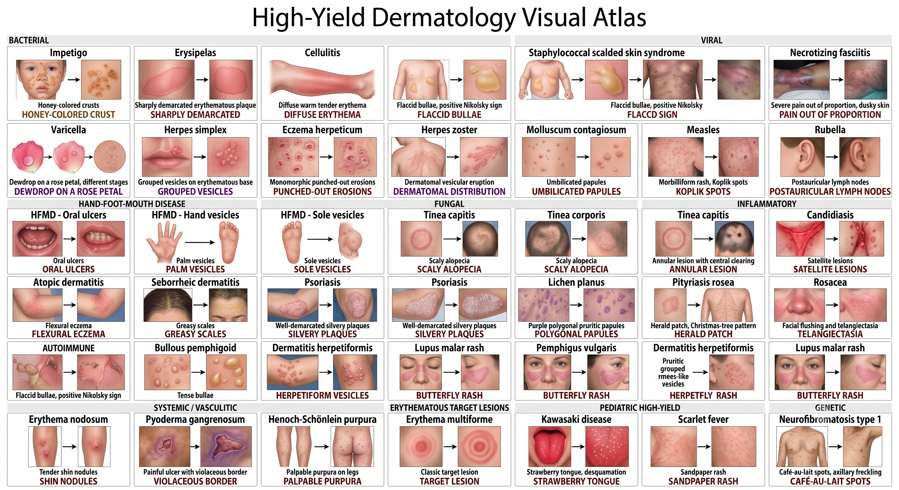
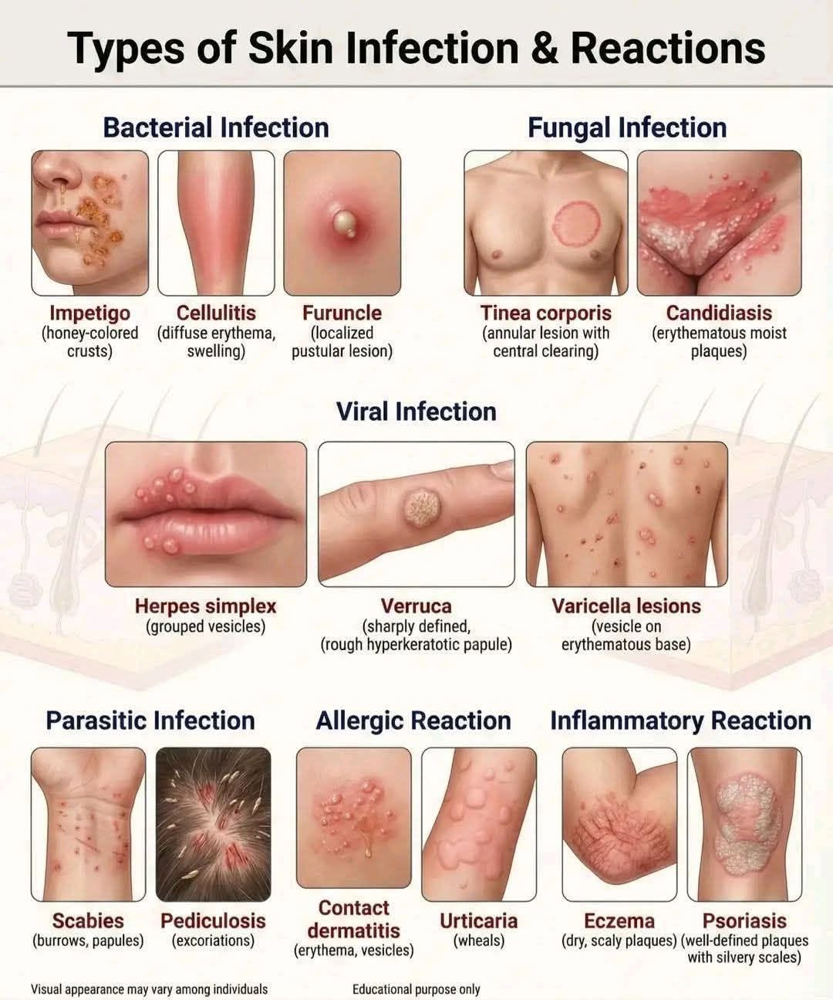
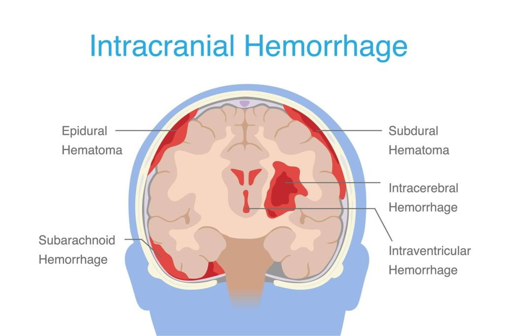
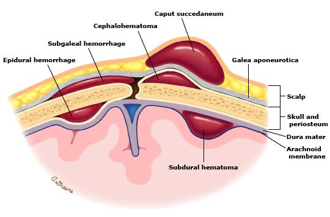

# 小兒科（考題157）

## 小兒急症初評（考題0）

- Exam：Pediatric assessment triangle（PAT，兒童評估三角）
  - 用途：快速目視判斷 sick/not sick
  - Pitfall：PAT 不是 ABC；PAT 之後才接 primary assessment（ABCDE/ABC）
  - 三項：
    - Appearance（外觀/意識互動）
    - Work of breathing（呼吸作功）
    - Circulation to skin（皮膚循環：蒼白/斑駁/發紺）
- 流程：PAT ⭢ primary assessment（ABCDE/ABC）
  - if 危急狀態（airway 不穩、respiratory failure、shock、altered mental status）：邊評估邊處置
  - Pitfall：不等 primary/secondary/tertiary assessment 全做完才處置
- Exam：小兒低血壓 SBP 門檻
  - 1-10 y/o：最低可接受 SBP 約 70＋2×age（歲）mmHg
  - ≥10 y/o：約 SBP ≥90 mmHg
- Risk：小兒外傷特性
  - 頭皮血流豐富＋總血量少（約70-80 mL/kg）⭢ **頭皮撕裂傷也可失血性休克**（小兒代償能力強，血壓可能正常）
  - 頭大、頸肌弱 ⭢ 頭頸部外傷多
  - 肋骨軟骨多/彈性高 ⭢ 不易骨折但肺挫傷可重
  - 肝脾較大且位置較低 ⭢ 腹部鈍傷易傷
    - 脾臟包膜較厚 ⭢ 穩定者非手術治療成功率高（>95%）
  - seat belt sign（腹部腰帶瘀痕）：想腸繫膜傷與 Chance fracture（腰椎骨折）

## 小兒CV（考題29）

- 男女比：涉及主動脈＝男多（ToF、TGA、CoA、BAC、AS）；其他=女多
- 發紺先天心臟病
  - 5T：Tetralogy of Fallot（TOF，1st）、Transposition of great arteries（TGA，大血管轉位）、Tricuspid atresia（三尖瓣閉鎖）、Total anomalous pulmonary venous return（TAPVR，全肺靜脈異常回流）、Truncus arteriosus（共同動脈幹）
  - 其他：Pulmonary atresia（肺動脈閉鎖）、Ebstein anomaly（艾布斯坦畸形）、Hypoplastic left heart syndrome（HLHS，左心發育不全症候群）
  - Pitfall：出生發紺 5T R-to-L vs Eisenmenger syndrome
    - 5T：原發 cyanotic CHD，新生兒/嬰兒期就因 R-to-L shunt 或 mixing 發紺
    - Eisenmenger：原本 VSD/ASD/PDA 等 L-to-R shunt 長期肺血流過多 ⭢ pulmonary vascular disease/PAH ⭢ bidirectional/R-to-L；屬晚期併發症，不是出生就典型發紺
    - Eisenmenger syndrome Tx：一旦形成通常不關缺損（血管已重塑，關了會右心衰竭），改以肺高壓治療/移植評估
  - Fallot
    - Tetralogy：肺動脈狹窄、室間隔缺損 VSD、主動脈跨騎、右心室肥厚（最終）
    - SS：杵狀指、肺動脈瓣心雜音、陣發性發紺、生長/青春期遲滯
    - SS（tet spell突發RtoL shunt發紺）：Squatting（蹲下可暫時改善發紺）
      - Tx：嗎啡、給 O2；if 代謝酸中毒 ⭢ 迅速 bicarbonate
    - 併發症：腦栓塞（>2y/o，because **polycythemia/dehydration**）、腦膿瘍（>2y/o，低燒/行為改變）、細菌心內膜炎
    - 相關先天 dx：DiGeorge（1st，染色體異常）、CATCH22（ch22q11.2 deletion）、先天肺動脈瓣缺失
    - Exam：CXR（**boot-shape heart**，肺紋減少）、EKG（右軸偏移，右心室肥厚）、Echo（for 確診）
    - Tx：PGE1 for 維持血流/灌流 ⭢ 手術（人工血管、VSD 修補）；tet spell症狀控制＝knee-chest position、α-agonist、β-blocker
  - Pulmonary atresia（全依靠 PDA）
    - 分類：伴隨 VSD＝重度 Fallot（但心臟不一定肥大）；無 VSD＝嚴重缺氧
    - Exam：EKG 尖 P 波、QRS 0-90 度
    - Tx：PGE1 + 手術
    - cf. EKG：左心發育不全＝肥 P；肺動脈瓣狹窄＝尖 P
  - Tricuspid atresia
    - 血流：ASD/PFO 必要 for RA→LA mixing；VSD/PDA 決定肺血流量
    - Pitfall：合併 TGA 或大 VSD 可造成 pulmonary overcirculation
    - Exam：CXR（undercirculation：ASD/VSD；overcirculation：TGA）
    - Tx：PGE1 + 手術（Balloon atrial septostomy）
  - 大血管轉位
    - RF：GDM 患者胎兒風險高
    - SS：**肺紋增加**，其他都跟 TOF 一樣（嚴重發紺、呼吸急促、餵食困難）
    - Exam：CXR（egg on a string，肺紋增加）
    - Tx：PGE1 for 維持血流 ⭢ 手術（arterial switch operation）
  - TAPVR 全肺靜脈異常回流
    - 分流位置：50% supracardiac（L. innominate v. 為主）、20% cardiac（coronary sinus）、30% infracardiac（堵塞率近 100%，預後最差）
    - SS：肺紋增加，像新生兒 RDS 易混淆
    - Tx：唯一手術；不要用 PGE1，because 會造成肺部瘀血
    - cf. PAPVR：不一定手術；看 Qp/Qs、症狀、RV dilation、pulmonary hypertension
  - Ebstein anomaly（亞柏斯坦/艾布斯坦畸形）
    - 結構：三尖瓣下移 + **三尖瓣逆流**（右心室心房化/有效 RV 變小）
    - SS：重症可胎兒/新生兒 cyanosis/HF（ASD/PFO 右到左分流、功能性肺動脈閉鎖）；輕症可青少年/成人才運動不耐或心律不整
    - Exam：CXR（box-shaped 心肥大）、EKG（**RBBB**，20% 有 Wolff-Parkinson-White syndrome）
    - Tx：手術 for 嚴重
  - HLHS 左心發育不全症候群
    - SS：全身循環差、grayish-blue（藍嬰）、乳酸⭡、酸血症⭡
    - Exam：EKG 肥大 P、Echo 小左室/扭曲二尖瓣
    - Tx：唯一手術（Norwood procedure（stage1）、Glenn procedure（stage2）、Fontan procedure（stage3））
- 非發紺先天心臟病：VSD、ASD、PDA、PVS（肺動脈瓣狹窄）、AS、CoA（Coarctation of the aorta，主動脈狹縮）
  - VSD
    - 地位：1st；L-to-R shunt，嚴重可反轉成 Eisenmenger
    - 分型（1、3靠近瓣膜預後差）：Type1（肺動脈瓣下，東方人 1st，易主動脈脫垂）、Type2（周邊型，自癒率高（1/3，因長 aneurysm））、Type3（inlet/AV canal type）、Type4（肌肉型，常見於極早產兒，80% 自癒）
    - Tx：口腔清潔預防、心導管、手術（for 症狀嚴重/肺高壓/type1 or 3/Qp:Qs > 2:1）
  - ASD
    - 分型：70% ostium secundum（fossa ovalis 卵圓孔肥大）
    - SS：無症狀為主；心雜音＝寬且固定 S2、左上胸骨爆裂音
    - Tx：Obs、口腔清潔預防、手術（Qp/Qs > 1.5）
  - PDA（出生三天沒癒合）
    - RF：早產、女、懷孕缺氧、德麻感染
    - SS：無症狀為主；機械性連續性心雜音（pan murmur）
    - Tx：**限水/利尿**（PDA 是水多，不是發紺）⭢ 藥物（Indomethacin、Ibuprofen、PGE 抑制劑）⭢ 手術（嚴重）
    - cf. PGE1：維持 PDA 開放，用於 Fallot、Pulmonary atresia、Tricuspid atresia、大血管轉位、CoA
  - PVS
    - 地位：1st 右心出口梗阻
    - Exam：EKG（右軸偏移、右心室肥厚、尖 P 波）
    - Tx：balloon、手術
    - Pitfall：PVS 伴隨 VSD（多半血氧飽和能維持正常）≠ Fallot
  - AS：聽診＝右鎖骨 harsh 心雜音、輻射至頸部、split S2
  - CoA
    - RF/位置：男多；>9 成發生在** subclavian-PDA **之間
    - SS：青年腿無力
    - Exam：echo（降主動脈 hypo-pulsatile）
    - Tx：PGE1（維持）⭢ 氣球/手術
- 後天心臟病：Infective endocarditis（細菌心內膜炎）、Rheumatic heart disease（風濕性心臟病）、Kawasaki disease（川崎病）、Myocarditis（心肌炎）
  - Infective endocarditis
    - Pathogen：鏈球菌（α-Viridans，1st）、金黃（2nd）
    - RF：先天心臟病、風濕心臟病；嬰兒 sparing
    - SS：發燒、心雜音、**Osler nodes（手腳趾壓痛）**、**Janeway lesions（手腳無痛紅斑）**
    - Tx：抗生素（penicillin；vancomycin for 人工瓣膜感染）
  - Rheumatic heart disease（鏈球菌抗體誤傷）
    - SS：風濕熱（發燒、關節炎、**erythema marginatum 邊緣性紅斑（不癢）**、舞蹈症）、二尖瓣侵犯、**mitral regurgitation 最常見**
    - Exam：Jones criteria
    - Tx：預防最重要；penicillin 預防復發；**Aspirin/NSAIDs 止痛**
  - Kawasaki disease（川崎病，aka mucocutaneous lymph node syndrome，**MCLS**）
    - RF/成因：成因不明；Mainly 亞洲嬰幼兒；T-cell ITPKC 基因相關
    - SS（病程）：持續發燒 >5 天 ⭢ 中大血管動脈瘤（25% 冠狀動脈瘤）
    - SS（黏膜/四肢/皮膚）：眼結膜充血、紅斑草莓舌、口唇乾裂、手腳紅腫、皮疹、頸部淋巴結腫大（非化膿性）、hepatitis、gallbladder hydrops
    - Tx：IVIG（發病 10 天內，預防冠狀動脈瘤）、Aspirin（抗血小板；if 冠狀動脈病變也要長期給）、echo 追蹤
    - cf. 猩紅熱：鏈球菌、草莓舌、褶皺處線狀丘疹 Pastia's lines、手足鱗狀脫皮
    - cf. Myocarditis：不影響冠狀動脈
  - Myocarditis
    - Pathogen：Mainly CoxB virus in 幼童
    - SS：心衰竭症狀（呼吸困難、水腫、心肌受損、coronary sparing）
    - Exam：心肌酵素、Viral PCR
    - Tx：支持療法（氧氣、利尿劑）

## 小兒GI（考題13）

- 概論
  - 急性病因：
    - Necrotizing enterocolitis、腸套疊、闌尾炎、volvulus（腸扭轉）、腸穿孔、生殖器扭轉
  - 依年齡分群：
    - <3y/o：Necrotizing enterocolitis、腸套疊、巨腸症、Meckel's、腸扭轉、腸阻塞
    - 3-10y/o：外加闌尾炎、肺炎、過敏紫斑
    - > 10y/o：外加懷孕/身心
- Diarrhea：
  - 病程：Acute<2wks；Chronic>2wks
  - 分類：
    - Osmotic（滲透性）：Tx＝禁食；e.g.乳糖不耐症
    - Secretory：感染/內分泌（甲亢，Zollinger-Ellison Syn）
    - Inflammatory：血便、發燒；Mainly大腸/末端迴腸
      - 細菌感染：單一系統局限
      - 病毒感染：跨系統
    - 細胞毒性
  - Fecal Osmotic Gap（FOG）：
    - 公式＝血清滲透壓－2×（糞便Na + 糞便K）
    - Osmotic diarrhea：FOG>50
    - Secretory diarrhea：FOG<50
- 口腔唇顎裂：
  - RF：男多
  - Tx＝手術：
    - 3m/o for 脣裂
    - 6-12m/o for 齶裂
- 食道
  - 食道氣管瘻管：
    - 頻率/分類：1/1w%；分5 types
      - 1st＝type C：食道上端閉鎖、下端接氣管
      - type A＝pure EA
    - RF：高臨產婦肥胖、歐洲人、抽菸
    - SS：VATER/VACTERL syn（Vertebral、Anal、Cardiac、Trachea、Esophageal、Renal、Limb anomalies）、出生羊水過多
    - Exam：NG tube無法通過食道、Scaphoid Abd舟狀腹部、鋇劑攝影（看不到H型）、支氣管鏡（H型）
    - Tx：prone position防嗆；only手術（復發可改內視鏡）
  - Hiatal Hernia：
    - Sliding：1st；胃食道交界上移；SS＝GERD
    - Paraesophageal：交界正常但胃部突出；Mainly fundus；好發於外科手術後；進食易飽
  - GERD：
    - SS：吐奶、體重增加不佳、咳嗽、哮吼、夜間喘鳴
    - Exam：24hr monitor @ 下1/3食道
    - Tx：餵食後保持直立、小量多餐、制酸劑
- 胃腸道
  - Infantile colic（嬰兒腸絞痛）：
    - SS：健康嬰兒陣發難安撫哭鬧（常傍晚）；無red flag症狀
    - Rule of 3：>3hr/day、>3d/wk、>3wk
    - 時序：2wk開始、6wk peak、3-4m/o緩解
    - Dx：排除發燒/嘔吐/腹脹/血便/生長差等器質性病因
    - Tx：家長衛教＋安撫支持
  - Hypertrophic pyloric stenosis（HPS，肥厚性幽門狹窄）：
    - RF：白男多
    - SS：無膽汁噴射嘔吐、Olive-shaped mass（幽門橄欖狀腫）、代鹼
    - Exam：Echo（shoulder sign）
    - Tx：手術
  - Duodenal atresia（十二指腸閉鎖）：
    - Exam weight：1st腸道閉鎖dx；易合併心肝腎dx、Down's syndrome
    - SS：出生24-48hr內嘔吐（含膽汁）
    - Exam：Double bubble sign（胃和十二指腸氣體積聚）
    - Tx：手術
    - cf. 空常閉鎖：Triple bubble sign（胃、十二指腸、空腸氣體積聚）
  - Malrotation：
    - 核心：大腸跑到**左邊**，易產生**midgut volvulus**
    - cf. 成人大腸扭轉多sigmoid/cecum
    - Dx：全年齡
    - Exam：UGI contrast series（corkscrew sign）
    - Tx：手術
  - Intussusception腸套疊：
    - 特徵：Mainly右上腹、近套遠、男多、cecocolic sparing
      - cf. NEC＝1st危及生命的新生兒GI急症
    - SS：間歇性腹痛（小兒會彎腰哭鬧）、腹部腫塊（腸套疊腫塊）、紅色果醬便、敗血症、腦膜炎
    - Exam：US（target/coiled spring sign，螺旋丸）
    - Tx：NPO；氣壓灌腸（if 無穿孔/壞死）⭢手術
  - Meckel's diverticulum：
    - Exam weight：1st先天消化道dx
      - cf. NEC＝1st危及生命的新生兒GI急症
    - Rule of 2s：2%人口、<2 y/o發病、男女比2：1、<2 feet from ileocecal valve、2 inches long、2種異生組織＝gastric/pancreatic
    - SS：無症狀為主、腸阻塞、腸穿孔、發炎（類似闌尾炎）、PUD（胃酸分泌造成腸出血）、Lead point腸套疊
    - Exam：Meckel's scan（Tc-99m pertechnetate scan）
    - Pitfall：Plain Xray沒有診斷價值
    - Tx：手術only for症狀嚴重
  - Functional constipation：
    - idiopathic為主
    - 年齡：>1m/o以後才有；新生兒便秘歸類為巨結腸症
  - Hirschsprung dx（巨結腸症）：
    - Exam weight：1st新生兒下消化道dx；偶發；乙狀結腸為主
    - RF：男、Down's syndrome
    - 成因：神經母細胞移形不良（缺Meissner/Auerbach plexus）
    - SS：新生兒期無胎便（足月兒>48hr未解可確診）、腹部膨大、含膽汁嘔吐、生長遲滯
    - Exam：肛門氣球測括約肌反射、Rectal biopsy（缺乏神經節細胞）、鋇劑檢查
    - Tx：手術
- 肝膽Dx
  - Biliary atresia：
    - Exam weight：1st肝膽dx；治不太好
    - SS：出生2-8wks內黃疸（直接型，出生時還沒）、灰白色大便、深色尿
      - Exam：肝功能檢查（直接型黃疸）、Echo（triangular cord sign，**肝內膽管通常不擴張**）、切片（膽管增生/膽汁淤積/纖維化）、排除新生兒肝炎、腹部探查/術中膽道攝影 for 確診
    - Tx：
      - Kasai hepatic procedure（肝門空腸吻合術）：**for 管徑>150um**；越早越好（<60days）但非根治
      - 移植：根治；70%病人最終需要
  - 膽囊水腫/膽囊壁水腫（gallbladder hydrops/wall edema）：
    - Exam：小兒考題優先想**Kawasaki disease**（川崎病，發燒>5天＋結膜/草莓舌/手足紅腫/頸部淋巴）
    - 其他可見於：EBV/HAV等急性肝炎、Dengue/DHF血漿滲漏、GAS猩紅熱、Salmonella/Leptospira/sepsis、低白蛋白/腎病症候群、TPN/禁食/燒傷/重大創傷
      - cf. biliary atresia：考膽囊小/不顯影或triangular cord，不是hydrops
    - Pitfall：非典型/不要硬選＝HPS、duodenal atresia、intussusception、Meckel、Hirschsprung、biliary atresia
  - 門脈高壓：
    - 定義：門靜脈壓>11mmHg（正常7，記法＝7-11）
    - 主因：
      - 栓塞：1st，Intrahepatic
      - 臍帶炎：Prehepatic
      - Budd-Chiari syndrome（肝靜脈血管受阻）：Posthepatic
    - SS：食道靜脈瘤出血、肝脾腫大
    - Exam：Echo（門靜脈血流逆行）
    - Tx（if Intrahepatic預後差）：
      - 出血急救：輸液、**vasopressin（內臟血管收縮門脈血流會減少）**
      - 預防出血：β-blocker（心輸出下降、內臟血管舒張降壓）
      - 內視鏡治療：結紮/硬化劑注射
- 腹壁缺損
  - Omphalocele：
    - 特徵：有包膜、缺口大；預後差、死亡率高；腹壁缺損在umbilicus
    - SS：包膜覆蓋的腸子暴露在羊水中
    - 伴隨其他先天dx：Malrotation（1st）、Beckwith-Wiedemann syn、Meckel's、Fallot、ch13/18/21三倍體、
    - Tx：濕紗保濕、手術
  - Gastroschisis：
    - 特徵：無包膜、失水多（無膜要大量靜脈輸液）、缺口小；死亡率低；only**隱睪風險**；腹壁缺損在umbilicus右側
    - SS：無包膜覆蓋的腸子暴露在羊水中（易發炎）、**母親AFP⭡**
    - Tx：同Omphalocele

## 小兒Nephro（考題15）

- UTI
  - RF：排尿學習期、女、包莖男
  - 感染源：E.coli、KB、Proteus、Adenovirus（11、21）
  - SS：FUNWISE；腎盂腎炎＝**系統性發燒**、嘔吐、黃疸
  - Asymptomatic bacteriuria（無症狀菌尿症）：培養陽性但無症狀，兒童通常不治療
    - cf. 孕婦/侵入性泌尿道處置前才治療
  - Exam：
    - Echo：Screen
    - VCUG：看結構、有無逆流
    - DMSA renal scan：gold，看功能、有無scar（吸收變差顯影變暗）
    - Leukocyte esterase（尿中白血球酵素）：敏特皆高；Pyuria；Nitrite：特異性高
  - Tx：經驗性 cephalosporin + aminoglycoside ⭢ 根據培養給藥
- Nocturnal enuresis（夜尿）：男多，≥5 y/o 睡眠中不自主排尿
  - 分類：
    - Primary：常見，從小都尿床
    - Secondary：曾 >6m 沒尿床 ⭢ 要找 UTI/DM/壓力/神經原因
  - Exam：先 UA
  - Tx：衛教＋alarm therapy（尿床警報器）
    - 短期：desmopressin（ADH類似物，水份再吸收）for 短期控制；**要限水防低鈉/水中毒**
- Vesicoureteral reflux（VUR，膀胱輸尿管逆流）
  - RF/assoc.：家族性；30%合併水腎、UTI
  - 分級：
    - I：逆流到 ureter，無擴張
    - II：輸尿管無擴張
    - III：腎盂輕度擴張，輸尿管變粗
    - IV：腎盂銳角消失
    - V：腎盂、輸尿管扭曲變形
  - Exam/Pitfall：會反覆燒、scarring；低階可給 anti（抗生素），V 為手術考點
- Posterior urethral valve（後尿道瓣膜）
  - SS：阻塞、尿道後擴張（keyhole sign）；羊水⭣可肺發育不全 ⭢ 呼吸窘迫
  - Exam：產前 Echo（keyhole sign）；VCUG 確診
  - Tx：尿管導尿/膀胱引流，手術
- Cryptorchidism（undescended testis，隱睪）
  - Timing：6 m/o後不太會自行下降 → 轉小兒泌尿/外科；多在6-18 m/o orchiopexy（睪丸固定術）。
  - Non-palpable testis（摸不到睪丸）：**不要靠Echo/CT/MRI陰性排除**；影像不能用來確定無睪丸，仍需diagnostic laparoscopy（診斷性腹腔鏡）/surgical exploration，避免腹腔內睪丸漏掉（不孕＋germ cell tumor風險）。
  - Bilateral non-palpable（雙側摸不到）：先加想 DSD（disorder of sex development，性發育差異）/內分泌評估。
- 小兒尿液篩檢異常：
  - Hematuria（血尿）Most common要看題幹：
    - Gross hematuria（肉眼血尿）/有症狀：先想 UTI（urinary tract infection，泌尿道感染）或 hypercalciuria（高尿鈣）；若有發燒、頻尿、解尿痛更偏 UTI。
    - Asymptomatic microscopic hematuria（無症狀顯微血尿）：常考 hypercalciuria（高尿鈣）。
    - Glomerular hematuria（腎絲球性血尿）：IgA nephropathy 最常見；URI（upper respiratory infection，上呼吸道感染）後同步/1-2日血尿＝IgA nephropathy，URI後1-3 wk＋C3低＝PSGN。
    - Red flag：血尿合併 proteinuria（蛋白尿）、HTN（hypertension，高血壓）、水腫、腎功能惡化 → 想 nephritic syndrome（腎炎症候群）。
  - Proteinuria（蛋白尿）Most common：
    - Isolated proteinuria（孤立性蛋白尿）最常見＝orthostatic proteinuria（姿勢性/直立性蛋白尿），尤其青少年；白天站立有蛋白尿，躺下就好，第一泡晨尿消失。
    - Dx：first-morning urine（第一泡晨尿）UPCR（urine protein/creatinine ratio，尿蛋白/肌酸酐比）正常（>2 y/o 約 <0.2）支持良性 orthostatic proteinuria。
    - Red flag：持續性蛋白尿、nephrotic-range proteinuria（腎病症候群範圍蛋白尿）、水腫/低白蛋白 → 想 nephrotic syndrome；小兒 nephrotic 最常見病理＝minimal change disease（MCD，微小變化病）。
- 絲球腎炎（if 合併腎損傷＝nephritic syn）：mainly 自體免疫疾病
  - 分類：
    - Mesangial cell dx：IgA、MPGN、Class 2 SLE
    - Endothelial cell dx：Infection、MPGN、Class 3/4 SLE
    - Epithelial dx：MCD、Class 5 SLE
  - IgA nephropathy（Berger nephropathy）
    - Exam：1st 絲球腎炎 in PEDS，男多，C3正常
    - Tx：支持性療法（血壓控制）
  - Henoch-Schonlein purpura nephritis（IgA vasculitis nephritis）
    - 定位：IgA的系統性疾病（無法單用病理區分），1st 兒童血管炎
    - RF：多秋冬，男多
    - 病理：leukocytoclastic vasculitis，IgA沈澱
    - SS：palpable purpura（下肢）、腹痛、關節痛；**不會血小板低下**
    - Tx：Steroid（預後佳，緩解嚴重腹痛）
  - IgA nephropathy vs IgA vasculitis nephritis快分：

    | 疾病                                      | 定位            | 考試關鍵                                                         |
    | --------------------------------------- | ------------- | ------------------------------------------------------------ |
    | IgA nephropathy（Berger）                 | 腎限定為主         | URI後很快血尿（synpharyngitic hematuria）、C3正常；常只有腎臟表現              |
    | IgA vasculitis nephritis（HSP nephritis） | 系統性IgA小血管炎＋腎炎 | palpable purpura＋腹痛＋關節痛＋腎炎，血小板正常；腎病理可像IgA nephropathy，靠全身表現分 |

  - Alport Syndrome
    - RF/機轉：X-linked（Type IV collagen基因突變、**GBM缺陷**），男多
    - SS：無症狀血尿、聽力障礙、眼部異常（anterior lenticonus）
    - Tx：ACEI（血壓控制）
  - Poststreptococcal glomerulonephritis（PSGN）
    - Exam定位：2nd 絲球腎炎 in PEDS，>3 y/o 才會得病
    - SS：無症狀 ⭢ 血尿 ⭢ **腦病 ⭢ 腎衰竭**
    - 機轉/Pitfall：**type III過敏**；抗生素無法預防腎炎
    - Exam：C3⭣、**C4正常!!**、Antistreptolysin O titer⭡、喉採樣+
    - Tx：抗生素（**預防風濕熱不預防腎炎**）+ 支持（會好；cf. MPGN不會）
  - SLE腎炎：分6 type（III/IV會血尿腎病AKI，V多nephrotic）
    - Type 1：沒什麼變化（Minimal change）
    - Type 2：免疫沈積於內基質 mesangium（**mesangial proliferative lupus nephritis**）
    - Type 3：IgG、C3沉澱於腎臟多組織（focal lupus GN）⭢ 需積極脈衝治療
    - Type 4：>50%廣泛沉積，**wire-loop lesion**（diffuse lupus GN）⭢ 需積極脈衝治療
    - Type 5：MMF治療
  - Membranoproliferative GN（MPGN）
    - Exam定位：1st chronic 絲球炎 in PEDS，補體低落
    - 分型：I常見；II預後差（連續絲帶沉積）
    - Exam：腎切片
    - Tx/預後：長期 prednisolone；50%會進展到末期腎衰竭
- Nephrotic Syn
  - SS：大量蛋白尿（Uprotein >3.5g/d）、低白蛋白（Alb <3.5mg/dl）、高血脂、水腫、低血容（濕冷、腹痛）
  - Exam定位：小兒最常見＝MCN；<3 m/o 發病＝congenital nephrotic syn（TORCH、重金屬、基因突變）
  - Exam：血檢、urine、Echo；腎切片 if <1 y/o 或 >12 y/o
  - Tx：類固醇（復原指標：四周尿蛋白下降）+ 腎保護降血壓（ACEi、ARB）
  - Minimal change Dx（MCD，預後極好）
    - RF：2-6 y/o，黑黃男多
    - SS：上呼吸道感染後；nephrotic syndrome＝大量蛋白尿、低白蛋白、水腫、高血脂；血壓正常、無血尿
    - Exam（甭切片）：抽血（腎功能/C3/C4正常）+ 排除診斷
  - Membranous nephropathy（MN）
    - Exam定位：兒童少，secondary MN 為主，50%變 chronic
    - SS：HTN，C3/CH50正常
    - Exam：唯一切片
  - Focal Segmental Glomerulosclerosis（FSGS）
    - RF：男多；AIDS、heroin、鐮刀貧血
    - SS：九成血尿/蛋白尿，高機率變慢性 in 10年
    - Exam：IgM/C3＋，切片足細胞融合（**foot process fusion**）
    - Tx：類固醇效果差
- AKI（＝ARF）
  - 定義：**Cr⭡ 0.3mg/dL ∪ 50% in 48hr**
  - Exam：
    - pRIFLE：依 Cr clearance rate（GFR）分嚴重度（Risky ⭢ End stage）
    - AKI work：依 Cr 上升分嚴重度，Stage I >150%，II >200%，III >300%
- CKI（GFR不可逆 for >3m）
  - Exam：依 GFR 分 Stage（1-5）；兒童 GFR 計算 **Schwartz formula**
  - 併發/Tx方向：水腫、高壓、低鈣、高磷、副甲亢、生長遲滯
- RTA（renal tubular acidosis，腎小管性酸中毒）
  - RTA1（遠端RTA）：無法排 H＋（遠ㄑㄧㄥ），尿鹼（pH >5.5），高血氯、低血鉀；病因＝SJS、RA
  - RTA2（近端RTA）：無法重吸 HCO3（惡鏡檢，2近鹼），低血鉀
    - SS：生長慢、合併 Fanconi syn（近端腎小管再吸收全失；生長遲緩、骨痛、佝僂症、多尿、脫水）、佝僂症
  - RTA4：醛固酮抵抗/缺乏，會有高血鉀；病因＝DM、ACEi、Addison's、CAH
- 遺傳性腎小管Dx
  - Bartter's syndrome（≈Loop diuretics，K wasting）
    - 遺傳/預後：體隱遺傳，早發，預後好
    - SS：NaCl無法再吸收、反覆脫水、HyperRAAS（for 代償；RAAS下游PGE2上升）、低血氯、低血鉀、生長慢
    - Tx：防脫水、補鉀、給 Indomethacin（抑制PGE2）
  - Gitelman syndrome（≈Thiazide，保鈣降鉀鈉鎂）
    - Exam定位：生長正常，青年發病
    - SS：低血鎂，不脫水

## 小兒感染（考題15）

- 發燒：
  - Tx：治underlying dx；>39給退燒
  - C/I：Aspirin、酒精降溫
- Acute Otitis Media：
  - RF：小兒耳咽管短直軟 → 易感染鼻竇炎/中耳炎/肺炎
  - 病原：S. pneumonia，H. influenza，M. catarrhalis
  - SS：發燒，耳漏，吹球耳膜無彈性
  - Tx：<2y/o直接上anti（**Augmentin**）
  - 併發症：穿孔，HL，Mastoiditis乳突炎（CT確診）
- Sinusitis：
  - 病原：比AOM多一隻S. aureus
  - SS：鼻塞，口臭，濃鼻涕>3天
- Epiglottitis（∈聲門上，主細菌）：
  - SS：高燒，口水，Stridor
  - Exam：Lat Xray（thumb sign），喉鏡（cherry red）
  - Tx：暢通呼吸道（順便採樣），Unasyn
- Croup（∈聲門下，Parainfluenza）：
  - RF：<3 y/o男多
  - SS：Barking cough，Stridor，Hoarseness
  - Exam：典型症狀即可確診；Xray（AP＝Steeple sign，Lat排除會厭炎）
  - Tx：cool mist → Steroid（症狀明顯） → racemic epinephrine（呼吸窘迫）
- PNA（PEDS PNA不一定有呼吸道症狀）：
  - 病原：
    - 1st＝肺炎鏈球菌
    - <5y/o以RSV為主；<3m/o懷疑Chlamydia垂直感染
    - GAS好發於水痘感染後
  - Exam：聽診，Echo，**CXR（不能評估康復狀況）**
  - Tx：Anti
    - <2m/o＝**Ampi（GBS、Listeria、Enterococcus）+Genta（G-）**
    - 3m/o-1y/o＝PCN/Cefotaxime
    - > 2y/o＝PCN/Ampi + Macrolide/Tetracycline
  - 併發症：pleural effusion（鏈球菌，葡萄菌），腦膜炎
  - 感染pattern：
    - 細菌：unilateral alveolar棉絮狀，迅速發燒胸腹痛
    - **病毒：bilateral diffuse interstitial點線網**，緩慢，胸痛sparing
    - 黴漿菌：≈病毒，外加關節炎/皮疹
    - Chlamydia：持續咳嗽，呼吸rale；**不會發燒，不會wheeze**
- Bronchiolitis（支氣管炎）：
  - 病原/RF：Mainly virus（RSV為主），<2y/o為主
  - SS：Nasal sparing，Grunting
  - Exam：CXR lung hyperinfiltration
  - Tx：O2，Fluid
  - 預防：Palivizumab for 高風險預防
- Pertussis（百日咳）：
  - 病原/RF：兩個Bordetella菌株；<6m/o、全年盛行
  - 疫苗：無法完全預防；只有B. pertussis可用**DTaP/Tdap**預防
  - 病程：卡他（輕微感冒） → 陣發（cyanosis，whoop） → 恢復
  - Exam：症狀診斷（**咳>2wks伴隨吐/呼嘯聲Whoop**）；Nasal swab分離**出桿菌**
  - Tx：隔離 + **Anti（Macrolide/TMP-SMX）**
- Parvovirus B19（5th dx，virus攻擊紅血球，**沒疫苗**）：
  - SS：伸側出疹（此時已有感染力），掌摑臉頰
  - Pitfall：孕婦感染 → 胎兒水腫hydrops fetalis
  - Tx：支持性
- 水痘（VZV）：
  - Exam定位：冬季dx
  - SS：出疹（無身體順序，出疹前2天到結痂有感染力），S. aureus次級感染
  - Pitfall：**1st孕期/產前感染 → 死胎**
  - Tx：Vaccine（10年保護，活疫苗孕婦X），VZIG（孕婦），Acyclovir
  - C/I：Aspirin（會Reye Syn）
- Measles：
  - SS：出疹（**red maculopapular eruption**）→ 皮疹，Warthin-Finkeldey giant cell in lymph node
  - Exam：口腔Koplik spots（可鑑別德麻），IgM/G
  - Tx：VitA支持
  - cf. 德麻：
    - SS：**淋巴病變（Mainly枕部耳下前頸）**，不脫皮
    - 傳染期：皮疹前後五天可傳染
    - 先天德麻：母體感染＝眼耳PDA dx
- Enterovirus：
  - 相關Dx：無菌性腦膜炎（aseptic meningitis, 1st神經學併發症）、手足口病（**四不：不痛不癢不結痂不結疤**）、心肌炎（CoxB）、Herpangina（口腔**後半**潰瘍，四肢無紅疹）
  - SS：台灣CDC Enterovirus重症四前兆
    - 嗜睡/意識改變/活力差/手腳無力
    - **myoclonic jerk肌躍型抽搐**
    - 持續嘔吐
    - 呼吸急促/心跳加快
  - Tx：IVIG，洗手，適量給水（給太多會腦水腫，休克）
- Adenovirus：
  - Exam定位：老二病毒（淋巴/呼吸/消化 2nd）
  - 相關Dx：
    - Pharyngo-conjunctival fever咽結膜熱：發燒**感冒結膜濾泡性充血**
    - Epidemic keratoconjunctivitis（EKC流行性角膜炎）：**眼睛水性分泌，耳前淋巴腫**
  - Tx：洗手，少游泳，少揉眼睛
- EB virus（口腔終身寄生，又名**Kiss dx**）：
  - Exam：初期IgM＋；後期**Heterophile** test/EBNA＋
  - 相關Dx：**單核增多症**，Hemophagocytic Lymphohistiocytosis（嗜血淋巴增生，預後好），splenic rupture（脾腫大後激烈碰撞，e.g 接觸性運動要避免），hepatitis，lymphoma/NPC
  - 單核增多症：
    - Triad：**fatigue，pharyngitis，全身lymphadenopathy（化膿扁桃腺炎 + 頸部淋巴結 + 脾腫大）**
    - Pitfall：**給Amoxicillin會全身rash，眼皮腫Hoagland sign**
    - cf. 鏈球菌不會脾
- Herpes Simple virus：
  - SS：口腔前半，牙齦腫（cf. Enterovirus牙齦sparing、PCN（Phenytoin、Cyclosporine、Nifedipine（CCB類）會牙齦增生））
  - Exam：PCR，Tzanck smear
- HHV-6（＝exanthem subitum，Roseola Infantum嬰兒玫瑰疹，6th dx）：
  - Exam定位：<3 y/o，預後極佳
  - SS：輕燒三天，少數seizure，退燒後紅色斑塊，uvulopalatoglossal junction處**Nagayama spots**
- Bartonella INF（Cat-Scratch Dx，CSD）：
  - RF：偶發，有貓抓史
  - SS：erythema w/o cellulitis，Chronic lymphadenopathy
  - Exam：淋巴檢體（**Warthin-Starry/Brown-Hopps stain** 發現Bartonella）
  - Tx：支持性；**Azithromycin** for 嚴重
- GAS Scarlet fever：
  - 病原：GAS產生pyrogenic exotoxin（erythrogenic toxin）
  - SS：草莓舌，砂紙皮膚，褶皺處脫皮
  - Tx：PCN
  - cf. 草莓舌常見於：Kawasaki，Scarlet，S. aureus
- Dengue（天狗/斷骨熱）：
  - SS：發燒、紅疹、斷骨痛（肌肉/關節/眼窩痛），相對心搏慢
  - Exam：DHF出血熱四標＝發燒 + 出血傾向/止血帶test(+) + **Plt<10w** + 血漿滲漏（**Hct↑≥20%**，肋膜積水/腹水/低albumin）
  - **Tx：支持 + 退燒只用acetaminophen**
  - C/I：NSAIDs/Aspirin（出血/Reye）
- 疫苗接種：
  - 活性減毒：
    - Timing/間隔：活疫苗同日可打；**分開打隔≥1m**
    - C/I：孕婦/免疫低下禁活疫苗
    - IG/血品間隔：一般IG隔3m；**輸血/血液製品隔6m**；高劑量IVIG隔11m；**洗滌RBC、單株抗體（palivizumab）不影響**
    - 口訣：JRBOYMV（日本（SA-14-14-2）-輪狀-卡介-口服（口服小兒麻痺/口服沙賓OPV）-黃熱-德麻MMR-水痘）
    - Pitfall：卡介注射後2wk會有紅色結節；**水痘打完6wks不可用Aspirin**
    - 暴露後可接種PEP：
      - 水痘：無免疫且無禁忌，**3-5d內給varicella vaccine**；高風險/禁活疫苗給VZIG
      - 麻疹：MMR 72hr內；高風險給IG
      - HAV：**2wk**內HAV vaccine±IG
      - HBV：HBV vaccine±HBIG
      - Rabies：傷口處理 + HRIG（過去打過疫苗不用） + 疫苗（0,3,7,14；打過疫苗0,3）
      - mpox/天花：公共衛生情境
  - 常規兒童疫苗時程（疾管署114年1月版）：

    | 年齡       | 接種疫苗                             |
    | -------- | -------------------------------- |
    | 24小時內    | HBV 1                            |
    | 1個月      | HBV 2                            |
    | 2個月      | **五合一 1、PCV13 1（13價肺炎鏈球菌結合型疫苗）** |
    | 4個月      | 五合一 2、PCV13 2                    |
    | 5個月      | 卡介苗（BCG；建議5-8個月）                 |
    | 6個月      | HBV 3、五合一 3；可開始接種流感疫苗            |
    | 12個月     | PCV13 3、**水痘 1、MMR 1**           |
    | 15個月     | 活性減毒日本腦炎 1                       |
    | 18個月     | 五合一 4、**HAV 1**                  |
    | 27個月     | 活性減毒日本腦炎 2、HAV 2                 |
    | 滿5歲至入國小前 | MMR 2、DTaP-IPV 1                 |

    - 易混：114年起HAV改18/27m；舊表常見12/18m。流感滿6m可打，8y以下初次接種2劑、間隔4wk。
    - B: 0,1,6 / 卡: 5
    VZV: 12 / MMR: 12, 小學
    13: 2, 4, 12 / 白百血痹: 2, 4, 6, 18
    日本: 15, 27 / A: 18, 27

## 小兒神經系統（考題32）

- Neurocutaneous Syn
  - Neurofibromatosis（NF＝神經纖維瘤病，**AD體顯**，無有效Tx）：
    - 分類：
      - NF1：Ch17 neurofibromin，50%偶發，**von Recklinghausen dx；會性早熟、智力不足**
        - SS＝6C2：Cafe-au-lait macules，腋/鼠蹊freckling（Crowe's sign），Lisch nodules，脊椎側彎，**optic pathway glioma**，**neurofibroma/plexiform neurofibroma**
        - 腫瘤：MPNST（malignant peripheral nerve sheath tumor，惡性周邊神經鞘瘤），pheochromocytoma，JMML（juvenile myelomonocytic leukemia，幼年型骨髓單核球白血病）
      - NF2：Ch22 merlin，現稱NF2-related schwannomatosis
        - SS＝"雙側" vestibular schwannoma/CN8聽神經瘤
        - 腫瘤：meningioma（腦膜瘤），ependymoma（室管膜瘤），其他顱神經/周邊神經schwannoma
  - Tuberous sclerosis（結節硬化症TS，**Ch9/16**突變⭢mTOR過度活化，無有效Tx）：
    - SS：
      - 皮膚病變：ash leaf低色素白斑，Shagreen patch（腰薦鯊魚皮粗糙斑），Sebaceous adenomas（臉頰青春痘斑），Subungual/Periungual fibromas（青少年指甲纖維瘤），Facial angiofibrosis
      - 心臟：橫紋肌瘤（>50%病人）
      - 新生兒infantile spasm（s/p Vigabatrin）
    - Tx：mTOR inhibitor（**Everolimus、Sirolimus**），癲癇藥（Vigabatrin for infantile spasm）
  - Sturge-Weber syn（腦血管床Abnl⭢皮質鈣化/萎縮，癲癇）：
    - SS：Port-wine stain（葡萄酒斑面部血管瘤），leptomeningeal angioma（腦膜血管瘤），**buphthalmos（牛眼先天青光眼）**，<1y/o **酒斑對側Seizure**
    - Exam：Xray（蛇軌鈣化），CT（皮質鈣化/萎縮），MRI（leptomeningeal enhancement，pial angioma）
    - Tx：**<1y/o手術（可防弱智）**，抗癲癇藥，Laser for Port-wine stain
  - Von Hippel-Lindau syn（VHL，體顯Ch3突變⭢HIF-1α過度活化⭢血管增生，無有效Tx）：
    - SS：全身長瘤（CNS/retina hemangioblastoma血管母細胞瘤，RCC，pheochromocytoma，pancreatic cyst/NET）
    - Tx：手術清除，每年F/U
- Neuromuscular dx
  - Myasthenia gravis（MG，自體免疫攻擊AChR，無有效Tx）：
    - SS：骨骼肌無力（眼肌最常見，眼瞼下垂，複視），呼吸衰竭
    - 併發症：胸腺瘤，Hashimoto
    - Exam（**切片沒用**）：肌電圖，Xray for thymus，Immune Panel
    - Tx：抗膽鹼酯酶藥物（**Pyridostigmine**），免疫抑制劑（Steroid，Azathioprine），Plasmapheresis換血漿/IVIG for 重症
  - Spinal muscular atrophy（SMA，AR，Ch5 SMN1缺失⭢SMN蛋白缺乏⭢下運動神經元退化）：
    - 分類：
      - SMA0：產前即胎動少/關節攣縮，新生兒期重症死亡
      - SMA1（Werdnig-Hoffman，infantile）：<6m/o發病，**floppy infant，永遠無法獨坐**，呼吸衰竭
      - SMA2：6-18m/o發病，能坐不能站/走
      - SMA3（Kugelberg-Welander）：>18m/o發病，能站能走
      - SMA4：成人發病，預後較好
    - SS：**對稱肌**肉無力/萎縮（下>上，近>遠），低張力/反射低下，舌肌顫動，**感覺正常**
    - Exam：SMN1 DNA testing（可產前檢測），血清CK正常/輕微⭡，EMG（denervation神經性改變，非正常）
    - Tx：SMN2 mRNA splicing modifier（**Nusinersen/risdiplam**），gene therapy（onasemnogene），呼吸/營養支持
  - Duchenne muscular dystrophy（DMD，X-linked recessive，男（女性多帶原），ChX突變⭢dystrophin完全缺乏）：
    - SS：3-5y/o走路困難，pelvic girdle/proximal weakness（骨盆帶/近端無力，先腿再手），Gower sign，calf pseudohypertrophy（肌肉被脂肪取代），Trendelenburg gait（骨盆靠健側（Gluteus Medius拉不動）、重心靠患側）
    - 併發症：**dilated cardiomyopathy**/傳導異常，呼吸衰竭
    - Exam：**CK⭡⭡⭡**，肌肉切片/基因檢測（dystrophin缺乏），肌電圖myopathic
    - Tx：Steroid延緩退化，物理治療/伸展/呼吸輔助/心臟追蹤，避免maximal exercise
    - cf. Becker muscular dystrophy（BMD，較少見/晚發）：X-linked recessive，ChX突變⭢dystrophin部分異常，發病較晚/病程較慢，預後好於DMD，也可心肌病變
  - **Leigh syndrome**（粒線體腦肌病）：
    - 定位：嬰幼兒神經退化/低張力
    - SS：餵食困難，發展遲緩/退步，**眼神互動差，hypotonia**，可**乳酸酸中毒/呼吸異常**
    - Exam：母系家族多人早夭/智能不足提示粒線體遺傳
    - cf. DMD＝3-5y/o近端無力；PWS＝新生兒**低張力後肥胖**；congenital myasthenic不解釋母系遺傳
  - Myotonic dystrophy（MD，AD，**Ch19突變⭢DMPK**基因異常，**CTG重複序列**⭢肌肉纖維退化，無有效Tx）：
    - SS：小臉，V唇，顳肌凹，舌無力（dysarthria），遠端肌肉萎縮，**心律不整猝死**
    - Exam：肌電圖（myotonic discharge），**肌肉切片（type 1 fiber萎縮），基因檢測**
    - Tx：支持性療法（物理治療，心律不整治療）
  - 其他：
    - Guillain-Barre syn：感染後免疫攻擊髓鞘，Landry ascending paralysis（遠端下肢先→近端上行），預後好；Tx＝IVIG/plasma exchange＋呼吸支持
    - Bell's palsy：感染後單側面神經麻痺（病毒無入侵），預後好；Tx＝Steroid，眼藥水
    - Cerebral palsy：腦發展不良，1st運動障礙dx，無有效Tx
      - SS：運動障礙（下肢痙攣/無力），智力障礙，癲癇，手足徐動
      - Tx：物理治療，抗痙攣藥物
- 神經行為Dx
  - ADHD：
    - RF：男多，**DAT1，DRD4**強基因關聯性
    - 分類：分3 types（只有**predominantly inattentive type女多**，伴隨cognitive impairment）
    - SS：注意力不集中，過動衝動
    - Exam：症狀診斷（至少**6個症狀持續6個月以上**，兩個以上環境出現症狀），**Conners rating scale**
    - Tx：心理/行為治療，Presynaptic dopaminergic agonists（**Methylphenidate**，台灣唯一approved）
  - Tourette syn：
    - RF：男多，hereditary，50%伴ADHD/強迫症
    - SS：多重運動/聲音抽動（至少一個聲音抽動），青春期慢慢減少
    - Exam：症狀診斷，MRI沒用
    - Tx：行為治療，α2-agonist（clonidine），Dopamine **antagonist**（Fluphenazine，Tetrabenazine）
- Seizure（>60%用藥後可控）：
  - Febrile Seizure：
    - RF：6m/o-5y/o，男多，1st seizure dx
    - SS：發燒（>39°C）伴隨抽搐（全身性tonic-clonic（GTC），持續<15min，24hr內不再發作），症狀前常合併HHV6等感染
    - Exam：症狀診斷，LP排除腦膜炎，EEG for complex
    - Tx：Obs即可
  - Partial Seizure：
    - 定位：單側皮質開始
    - Tx：抗癲癇藥物（Carbamazepine）
    - 分類：
      - Simple：意識清楚，單一肢體抽搐，無Automatism自動症
      - Complex：意識不清，手腳口唇亂動，EEG額葉sharp wave
      - Benign Partial Epilepsy w/ Centrotemporal Spike（BPEC）：多睡夢發作，僅臉部SS，預後佳；Tx＝**Oxcarbazepine for 2 years**
  - Generalized Seizure：
    - 定位：雙側皮質參與，多失去意識
    - Tx：Vit B6，ACTH，生酮飲食，抗癲癇藥物（Valproic acid for GTC/Absence，**Levetiracetam for Myoclonic**（腎代謝、藥物交互作用少））
    - 分類：
      - Absence（失神臉部呆滯）：女多，Mainly >5y/o，EEG雙邊3Hz全腦亂放電
      - Tonic-clonic（GTC）：全身性強直陣攣，Apnea，咬舌
      - Myoclonic（短暫對稱重複肌陣攣）：Benign type 2歲前消失，Complex type預後差（合併**上URI，腦缺血**）
      - Infantile Spasm（4-8m/o對稱收縮，男多）：symptomatic type會智障，EEG＝**hypsarrhythmia**（不規則高振幅亂放電）
  - Status epilepticus（SE，癲癇重積）：
    - 定義：小兒也會；單次發作>5min或反覆發作中間未恢復意識
    - Tx：ABC/血糖＋IV lorazepam（>5min就先處理，後來發現<15min再當是simple）⭢ levetiracetam/fosphenytoin/valproate
    - Focal SE with impaired consciousness（局部癲癇重積合併意識障礙>10min）：focal seizure持續/反覆＋意識不清/自動症；可無明顯抽搐（NCSE，需EEG排除）
- Acute Bacterial Meningitis：
  - 定位：高致死率，PEDS可能沒有neuro sign
  - SS：**皮膚purpura**，DIC，畏光，囟門突出，發燒，頭痛，頸部僵硬
  - 菌株：
    - 新生兒：GBS、E.coli、**Listeria**
    - 3m/o-18y/o：N. meningitidis（常瘀青紫斑，死亡率比S.pneumoniae低，療程短5-7days）、S. pneumoniae
  - Exam：Kernig/Brudzinski+，LP（CSF細菌培養、細胞計數、糖蛋白濃度），CT（排除腦膿瘍/腦水腫）
  - Tx：抗生素（3代Cepha+Vancomycin，<3 m/o 加 **Ampi** cover Listeria；duration約10-14 days），Rifampin for Hib感染照護者
- Neural development：
  - 粗動作＝2抬4翻7坐8爬9站12走18跳
  - 精細動作＝15積木60四色畫三角
  - 語言＝6咿呀9爸媽12唱18字詞圖形身體部位24句子
  - Neural tube defect（NTD）/occult spinal dysraphism：
    - Sacral dimple低風險：單純（距肛門**≤2.5cm**，直徑小，底部可見，無其他皮膚異常）通常觀察即可
    - 高風險：位置高、**底部不可見**、”**>5mm“**、合併aplasia cutis/毛髮叢/血管瘤/皮膚贅生物/皮膚竇道
    - Exam：高風險提示occult spinal dysraphism，需脊髓影像評估（嬰兒**可先spinal echo**，較大或高疑慮用MRI）
  - Tethered cord syndrome（TCS，脊髓拴繫症）：
    - 機轉：脊髓/filum被異常固定，成長中長期牽拉
    - SS：下肢無力/步態變差、**足部畸形（clubfoot/馬蹄內翻足）**、neurogenic bladder（神經性膀胱）、**腰薦部皮膚stigma**（毛髮叢/血管瘤/皮竇/脂肪瘤）
    - Exam：MRI見低位conus medullaris（脊髓圓錐）± **thickened filum terminale終絲**
    - Tx：手術切除異常組織，鬆解牽拉

## 內分泌dx（考題7）

- 甲狀腺（主要作用在Osteoclast）
  - Hypothyroidism：
    - Congenital（1st）：
      - 成因：主因＝**dysgenesis發育不良（其中最常見ectopic gland）**；其他＝TORCH，母體抗體
      - SS：Cretinism（呆小症，poor ctrl⭢**低溫，大囪門，大理石斑**，大舌頭，臍疝氣）
      - Exam：T4，TSH（>6mIU/L），Echo，核醫
      - Tx：Levothyroxine
    - Hashimoto's：
      - Exam定位：後天/青年1st，**hereditary**
      - SS：painless goiter，brittle hair（髮易碎）
      - Exam：Anti-thyroid **peroxidase** antibody（TPOAb），切片，骨齡，Echo
      - Tx：Levothyroxine
  - Hyperthyroidism：
    - Graves dx：
      - Exam定位：1st，Rule of 10（10%沒有明顯甲亢，**10%眼病可單側**，女/男≈10，20-50y/o）
      - 成因：自體免疫刺激TSH receptor⭢**甲狀腺過度活化**
      - SS：軟組織侵犯（**眼乾澀，複視，角膜受損**），lid retraction眼瞼退縮，proptosis眼凸，肌肉水腫＋不可逆纖維化
      - Pitfall：眼外肌侵犯順序（Tendon sparing）＝下內上外
      - Tx：PTU，MMI，β-blocker（症狀控制）
- 副甲狀腺（主要作用在osteoblast；不管降鈣升鈣）
  - Hypoparathyroidism：
    - 成因：PTH缺乏（**DiGeorge syn**），PTH receptor異常（pseudo-hypoPTH），粒腺體突變，**VitD/鎂離子缺乏（PTH分泌需要Mg）**
    - SS：Ca⭣，呼吸痙攣，Tetany（Chvostek sign臉部抽搐，Trousseau sign腕部抽搐）
    - Exam：血清Ca/P/Mg/Albumin（白蛋白校正），PTH，X-ray（DiGeorge syn無胸腺）
    - Tx：calcium gluconate，VitD
  - Hyperparathyroidism：
    - 成因：**腺瘤**（1st，Mainly benign）
    - SS：難餵，劇渴，便秘，肌無力，胰臟炎
- 佝僂症：
  - 成因：Calcipenic/Phosphopenic（缺鈣或缺磷）
  - SS：難餵，骨骼畸形（widening wrists，bowed legs），枕骨頂骨軟化（**Craniotabes**），骨痛，串珠狀肋骨（**Rachitic rosary**）
  - Exam：
    - Ca/P擇一低，ALP⭡
    - X-ray：骨骼畸形，rachitic rosary肋骨畸形，**cupping and fraying生長板寬且模糊**
- Congenital adrenal hyperplasia（CAH，Prednisolone走17-OH變Testosterone，走21-OH變Aldosterone（多半這條掛掉））：
  - 遺傳：AR
  - 成因：21-hydroxylase缺乏（90%），11β-hydroxylase缺乏，17α-hydroxylase缺乏
  - 分型：
    - 鹽丟失型（Salt-wasting）：出生1wk低Na/高K/脫水+男性化，色素沉著
    - 單純性（Simple virilizing）：僅男性化（virilizing）
    - 非經典型（Non-classic）：mild觀察即可
  - Exam：血清21-hydroxylase⭣（**懷孕第一期即可驗**），17-hydroxyprogesterone⭡，骨齡超前
  - Tx：**Glucocorticoid**（抑制ACTH分泌），**Mineralocorticoid**（鹽丟失型）
  - Pitfall：46，XX** 女嬰 virilization/DSD 最常見原因（內女外男，有子宮無睪丸）**；46，XY 多表現為salt-wasting crisis
- Diabetes mellitus：
  - 分類：
    - Type 1：多渴多尿，**會陰念珠菌感染**；共病＝**自體甲狀腺dx，乳糜瀉**
    - Type 2：胖子，90%家族史，Acanthosis nigricans黑色棘皮症
    - Maturity Onset Diabetes of the Young（MODY）：體顯，輕度高血糖，**無自體免疫抗體**
    - 2nd DM：胰臟切除，類固醇overuse，囊性纖維化dx
  - DKA（type 1）：
    - 成因：有效Insulin不足
    - SS：高血糖（**>250mg/dL**），酮體⭡，酸中毒（pH**<7.3**，HCO3<15mEq/L），脫水，滲透利尿，呼吸水果香，腦水腫
    - Tx：先IV fluid（0.9% NS/Ringer lactate）→ Insulin（0.1U/kg/hr）→ K補充（依血鉀）；mannitol for腦水腫
  - Screen/追蹤：
    - 10y/o眼底鏡，microalbuminuria/Creatinine 定期追蹤
    - routine驗血糖group＝**出生太大/太小，母親GDM，出生INF，家族史**
- 性早熟（男性危險，survey腦瘤）：
  - 分類：
    - 中樞：Idiopathic（1st）
    - 器質/周邊：CAH，Adrenal adenoma，性腺tumor，severe hyperparathyroidism，McCune-Albright syn，Familial male limited precocious puberty
  - Tx：中樞＝GnRH agonist；周邊＝underlying dx
  - McCune-Albright syn：
    - 成因：GNAS abnl⭢G protein突變⭢LH，FSH過度活化
    - SS：咖啡牛奶斑，fibrous dysplasia骨病變，**Ambiguous genitalia女嬰外陰肥大**
    - Tx：Aromatase inhibitor
  - Familial male-limited precocious puberty（testotoxicosis）：
    - 遺傳/成因：**體顯**，LHCGR（LH receptor）活化突變⭢Leydig cell自動分泌testosterone；只有男性發病
    - SS：**2-4y/o男童virilization（陰莖變大，陰毛/腋毛，體味，acne，聲音低沉），快速長高＋骨齡超前（終身身高反矮），睪丸小/不成比例（FSH未啟動）**
    - Exam：testosterone⭡但LH/FSH低或不高（GnRH-independent）
- 身材矮小（第三百分位以下）：
  - 分類：
    - 矮瘦：氣喘，GI dx，DM
    - 矮胖：遺傳性（無青春期延遲，確實矮；cf. 體質型＝青春期延遲，成年正常），染色體異常，代謝dx，內分泌異常
  - Tx：underlying
  - GH測試：
    - 刺激生長激素物質＝Arginine，Clonidine，Insulin，L-dopa
    - 抑制生長激素物質（GG）＝Glucose，Glucagon

## 兒童風免dx（考題7）

- Asthma：
  - 病理：慢性發炎（表皮細胞破壞脫落而非增生），**嗜伊紅**增生，**IgE，IL5最重要**
  - Exam：兒童重病史詢問
  - Tx：**<12y/o不用茶鹼**
- 免疫缺乏：
  - T-cell缺陷：
    - RF/感染：**早發（2-6m/o）**，∵病毒伺機感染
    - e.g. DiGeorge dx
    - SS：發育不良，輸血後GVHD（∵無法有效清除donor T）
    - Exam：**Abs lymphocyte count**、**Candida skin test、Mitogen test（測T功能）**
    - X-linked hyper-IgM syn
    - DiGeorge dx：
      - 記憶：CATCH22（Cardiac、Abnormal facies、Thymic aplasia、Cleft palate顎裂、Hypocalcemia、Ch22 microdeletion）
      - SS：心臟畸形（conotruncal anomaly）、免疫缺陷（T-cell缺乏，**∵3/4 pharyngeal pouch異常**）、**低鈣（Tetany）**、特徵臉孔
      - Exam：血清Ca/PTH、Echo、Xray（無胸腺）
      - Tx：胸腺/骨髓transplant
  - B-cell缺陷（ABC）：
    - RF/感染：>6m/o發病（母親抗體沒了），**∵莢膜細菌（能抵抗吞噬但會被Ig binding；H.inf、P.pneu、N.men.），Enterovirus、S.pneumonea、Hib、Neisseria**
    - Dx：Selective IgA deficiency（1st），X-linked agammaglobulinemia（Bruton），CVID
    - SS：反覆**呼吸道/腸道感染**
    - Exam：血清IgA⭣，Flow cytometry
    - Selective IgA deficiency：
      - Exam定位：最常見免疫缺陷（0.33%），1st B-cell缺陷
      - 遺傳/表現：體顯，**5成病人體內有IgA抗體**，5成無症狀，常合併CVID
    - X-linked agammaglobulinemia（Bruton dx，BTK蛋白/CD19缺乏）：
      - 成因：X-linked（男多），ChX突變⭢**BTK蛋白缺乏**⭢B細胞發育停滯（可抗病毒不可抗細菌）
      - SS：男多，6m/o後反覆呼吸道感染（尤其**肺炎鏈球菌**），**無扁桃體/淋巴結**
      - Exam：**Total Ig<100mg/dL**
    - Common variable immunodeficiency（CVID）：
      - 成因：體顯，**B細胞數量正常但功能差**
      - SS：症狀相對輕微
  - Granulocyte缺陷：
    - RF/感染：早發，反覆細菌感染（尤其皮膚），e.g. LAD懶得吞，CGD可以吞
    - SS：臍帶晚脫落（LAD特徵），**反覆肺炎，膿瘍，口腔潰瘍**
    - Exam：Nitroblue tetrazolium test（NBT test，CGD特異性）
    - Leukocyte adhesion deficiency（LAD，不吞）：
      - 機轉：neutrophil無法依附（飄在周邊，傷口卻沒有）
      - SS：**無膿，臍帶晚脫落**（>30d）
    - Chronic granulomatous disease（CGD，吞而不嗜）
  - Complement缺陷：
    - 成因/關聯：C3 pathway異常，合併風濕疾病
  - 同時BT缺陷：
    - Severe combined immunodeficiency（SCID，死定）：
      - Pitfall：預後差，無治療幾乎必死
      - SS：新生兒期反覆感染（細菌/病毒/黴菌）
      - Tx：**骨髓/幹細胞移植**，**PEG-ADA（for ADA缺乏型）**
    - Wiskott-Aldrich syn：
      - 遺傳：**X-linked**
      - SS：濕疹 + 反覆感染 + 小血小板低下出血
- 風濕Dx：
  - Juvenile idiopathic arthritis（JIA）：
    - Exam定位：1st慢性關節炎dx
    - Criteria：rule in＝6wks以上；subtypes用前6mths症狀分群
    - 預後差：Rheumatoid factor（+）
    - 預後好：Oligoarthritis（1st（50%），**女多，合併anterior uveitis，ANA+**）
    - Tx：NSAIDs，Methotrexate for 多關節
    - SS：全身型合併Salmon-pink**鮭魚粉色皮膚疹**
  - Systemic lupus erythematosus（SLE）：
    - Criteria（4/11 SOAP BRAIN MD）：Serositis，Oral ulcer，**Arthritis（>2）**，Photosensitivity，Blood disorder（紅白小下降＝溶血性貧血/白血球或淋巴球低/血小板低），Renal disorder，ANA（+），Immunologic disorder（Anti-XXX），Neurologic disorder，Malar rash，Discoid rash
    - Neonatal lupus：
      - 成因：母體抗體穿過胎盤（anti-Ro/SSA，anti-SSB為主）
      - SS：心臟傳導阻滯（最嚴重，可能需要裝心律調節器）
    - Drug-induced lupus：
      - 成因：藥物引起的SLE-like症狀
      - Pitfall：**會肝炎**（原發不會）
      - Lab：anti-**histone** antibody（+）
      - Tx：停藥
    - Lab：
      - ANA：screen工具，敏感度高但特異度低
      - Anti-dsDNA：特異度高，活躍度指標，可預測腎炎，血管炎
      - Anti-Smith：特異best，但跟活躍度無關
      - Anti-Ro/SSA：可過胎盤，導致胎兒先天心臟傳導dx
      - Anti-ribosomal P：中樞侵犯，精神病
  - Henoch-Schonlein purpura（HSP）：
    - 病理：小血管炎，男童略多，IgA沈澱，血小板正常
    - SS：palpable purpura（下肢），**腹痛，關節痛，腎炎**
    - Tx：自癒，**類固醇/免疫 for器官保護**
  - Scleroderma：
    - SS：早期以Raynaud's phenomena表現
    - Exam：anti-Scl-70，anti-centromere
  - Juvenile dermatomyositis（JDM）：
    - Exam定位：1st發炎性肌炎
    - SS：
      - 肌無力：近端>遠端，Gower's sign
      - 皮膚病變：Gottron papules（手/關節對稱亮紅萎縮丘疹），Heliotrope rash（眼瞼藍紫斑疹），Shawl sign（胸頸erythema）
- 風濕藥物：
  - NSAIDs：
    - 機轉：抑制COX⭢PGE合成減少
    - 副作用：胃潰瘍，腎衰竭，出血傾向（aspirin腸胃毒性較強；coxib/ibuprofen心血管風險較高（心臟科少用））
    - C/I：避免 aspirin（Reye syndrome）
  - Steroid：
    - 機轉：抑制免疫反應
    - 副作用：生長遲緩，骨質疏鬆，Cushing syn（滿月臉，水牛肩），高血糖，高血壓
  - DMARDs（Disease-modifying anti-rheumatic drugs）：
    - Methotrexate：抑制DNA合成；副作用＝肝毒性，骨髓抑制
    - Etanercept：TNF-α inhibitor，∈生物製劑，用前篩 TB/HBV，**治療中避免 live vaccine**
    - Hydroxychloroquine：抑制Toll-like receptor；副作用＝視網膜病變
    - Sulfasalazine：抑制NF-κB、prostaglandin、leukotriene生成；副作用＝肝毒性，骨髓抑制

## 兒童血液dx（考題11）

- 貧血：
  - 時間DDx：
    - birth：α thalassemia
    - 1-2 d/o：O mother's IgG antibody（其他型都是IgM不過胎盤）、Rh（-）
    - Bleeding：subgaleal
    - 3-14 d/o：physiologic anemia、G6PD
    - 2-6 m/o：IDA
    - > 6 m/o：β thalassemia
    - Child：Hemangioma、Meckel's diverticulum
  - 小球性貧血（MCV<80，小地鐵）：
    - IDA：最常見，MCV/RBC>13，TIBC⭡，Ferritin⭣；Tx＝Ferrous sulfate
    - Thalassemia：新生兒α為主，MCV/RBC<13，**TIBC⭣，Ferritin⭡**；Tx＝輸血+鐵螯合劑
      - α：16 deletion，A片低級；分級＝Silent carrier（3個正常）→ Trait（2，Hb降低，Asymp）→ HbH（1，慢性貧血）→ Hydrops fetalis（死胎）
      - β：11 replaced，B咖被取代；分級＝Minor（1，輕微貧血）→ Major（2，Cooley anemia）
  - 正球性貧血（MCV 80-100，正豆）：
    - RI%<2%：再生不良性貧血/脾腫大/感染
    - RI%>2%：失血，溶血性貧血（RBC破壞過多，e.g. G6PD，紅血球膜病變，**Autoimmune hemolytic anemia（AIHA）**）
    - Favism（G6PD 缺乏）：
      - RF：X-linked，男多
      - Exam：smear bite cells，Heinz body in 紅球，**G6PD免疫染色沒亮**
    - AIHA自體抗體分類：
      - Cold＝IgM（低溫反應）
      - Warm＝IgG（常溫反應，多idiopathic）
    - Coombs test：
      - Direct：RBC表面抗體，常用；for 新生兒溶血、AIHA、SLE、ABO輸錯血、藥物貧血
      - Indirect：檢測血清中有無抗體；for，輸血後症狀、Rh(-)母親懷Rh(+)嬰兒後母親血中出現抗體
  - 大球性貧血（MCV>100，大葉比）：
    - 成因＝Megaloblastic：
      - Vit B12缺乏：有神經學症狀，舌頭發炎，神經病變
      - Folate缺乏：∵MTX，酒精使用，懷孕；無神經症狀
    - 成因＝Non-megaloblastic：肝病，甲狀腺功能低下，Myelodysplastic syndrome骨髓增生不良，Aplastic anemia
- Sickle cell anemia（HbS，AR）：
  - 成因：Ch11突變⭢β globin chain異常⭢RBC變鐮刀狀⭢血管阻塞/溶血
  - SS：感染（<5 y/o S. pneumoniae），骨骼畸形（**crew cut skull**），肺栓塞，中風，脾腫大（**嬰兒期後**）
- 血小板dx：
  - Thrombocytopenia（血小板減少）：
    - Cutoff：<5w手術風險⭡，<2w自發出血
    - **分類：Immune（ITP，HIT）和Non-immune（DIC，TTP，HUS）**
    - **Immune thrombocytopenia（ITP，1st血小板減少dx）：**
      - 特徵：單獨血小板低下，6個月內康復；**IgG 抗 platelet membrane glycoprotein，常見 anti-GPIIb/IIIa**
      - SS：病毒感染後發病
      - Exam：排除性診斷
      - Tx：Steroid，**Anti-Rh（D） IgG/IVIG for Rh（+）嬰兒**
    - TTP/HUS（thrombotic microangiopathy，TMA；微血管血栓病）共同：
      - SS triad：**血小板低下＋microangiopathic hemolytic anemia（MAHA，微血管性溶血）＋腎功能異常**
      - Lab：schistocytes（helmet cell）、LDH⭡、haptoglobin⭣；**PT/aPTT不延長**（cf. DIC＝PT/aPTT延長）
    - Hemolytic uremic syndrome（HUS，kidney local；會溶血）：
      - 成因：E. coli O157：H7/Shiga toxin；多兒童血便後AKI
      - Tx：支持治療（補液/透析）；典型Shiga toxin HUS：避免抗生素/止瀉藥；症狀比TTP多腹瀉
    - Thrombotic thrombocytopenic purpura（TTP，systemic）：
      - 成因：多後天抗ADAMTS13（嚴重下降常<10-15%）→ vWF multimer清不掉 → platelet microthrombi
      - SS：HUS triad + fever/CNS症狀；成人、神經症狀明顯較偏TTP
      - Tx：血漿置換（plasma exchange）急救；可加steroid/rituximab
- 凝血問題：
  - 新生兒Vit K related：2，7，9，10；PT＝外在路徑
  - Protein C/S：量只有成人50%
  - PTT：看內在路徑（8，9，11，12；加起來雙20）
  - Von Willebrand dx：
    - **Exam定位：1st PEDS遺傳出血dx**
    - 成因：Intrinsic pathway⭢vWF缺乏（80% factor 8異常⭢Bleeding Time/PTT延長）
    - Tx：Desmopressin（促vWF釋放）
  - Hemophilia：
    - 分類：A缺8，B缺9
    - RF：X-linked
    - Lab：PTT延長，Bleeding Time正常
    - Tx：預防性注射（可以注射到活性至100%）
  - cf. PT/PTT：
    - ITP/HUS/TTP/HIT：血小板/微血栓問題⭢PT/PTT正常
    - **DIC：凝血因子被消耗⭢PT/PTT延長**
  - 藥物解毒：
    - Warfarin：Vit K
    - Heparin：Protamine
- 全血球低下：
  - Aplastic anemia（AA）：發病3 peaks＝2-5 y/o，20 y/o，60 y/o；Tx＝Steroid，骨髓移植，免疫抑制
  - Fanconi anemia：先天再生不良，cafe-au-lait斑，性線低下，小頭症
  - 後天再生不良：化療，parvovirus B19，EBV，HIV，SLE

## 兒童腫瘤dx（考題6）

- 兒童癌症：
  - 大多數：85-90% 為偶發（sporadic，e.g. 白血病）
  - 少數：10-15% 與先天性遺傳疾病有關（Li-Fraumeni 症候群、神經纖維瘤病 NF1、Beckwith-Wiedemann 症候群等）
- Leukemia（from骨髓幹細胞）：
  - 分類：Lymphoid淋巴性（ALL）和Myeloid（AML）
  - ALL（1st PEDS cancer，AML四倍）：
    - RF：男>女，白>黑，Down's syn，Klinefelter syn，Turner syn，Neurofibromatosis，Paroxysmal nocturnal hemoglobinuria
    - SS：9成貧血，血小板低下
    - Exam：early pre-B cell CD10（＋），WBC<1w，骨髓>25% blasts
    - Tx：Induction（高劑量化療） → Consolidation（消除殘餘＋中樞預防：頭部放射/脊髓投藥） → Maintenance（低劑量化療）
    - 預後好：1-9 y/o，發病時WBC<5w，hyperdiploidy超二倍體（染色體總數>50）
    - 預後差：<1 y/o，發病時WBC>5w，hypodiploidy<40
  - AML（outcome比ALL差）：
    - SS：發燒骨痛淋巴腫
    - 特異性高：皮下結節，gingiva牙齦腫，Chloroma綠色瘤（t（8;21））
    - Exam：Blood smear Auer rods
    - Tx：化療/移植
    - 預後好：t（8;21），t（15;17），inv（16），<50 y/o，Down's
    - 預後差：黑人，診斷時WBC>100w，FLT3-ITD mutation
- Lymphoma（from淋巴組織）：
  - 分類：Hodgkin's 和 Non-Hodgkin's
  - Hodgkin's lymphoma（病程較非哈金慢）：
    - RF：年紀大兒童為主，有感染史
    - Subtype：Nodular sclerosing為主（cf. 老人以Lymphocyte-rich CHL，mixed cellularity為主，post EBV）
    - SS：無痛淋巴腫（頸部最常見），上呼吸困難，B symptoms（發燒，盜汗，體重減輕）
    - Exam：Reed-Sternberg cell（雙核大細胞，Owl's eye）
    - Tx：化療/放療
  - Non-Hodgkin's lymphoma：
    - RF：<10y/o多非哈金
    - Subtype：Burkitt's lymphoma 為主（80%，t（8;14））
    - SS：腸套疊，starry sky appearance
- 兒童腦瘤：
  - Exam定位：2nd PEDS cancer；Mainly實質腫瘤；好發<10y/o
  - SS：癲癇，IICP signs
  - Exam：MRI，CT
  - Tx：手術切除+化療/放療
  - 天幕上Tumor（雙峰分布：<2y/o，青年）：
    - Craniopharyngioma：from Rathke's pouch；SS＝顳側視野缺損
    - Pineal tumor：SS＝水腦，Parinaud syndrome（triad＝Vertical/Upward Gaze Palsy，Convergence-Retraction Nystagmus向上看時眼震，Light-Near Dissociation瞳孔光反射消失）
    - 松果體區腫瘤快分：
      - Germinoma/GCT：最多考；放療敏感；鞍上/下視丘-垂體軸侵犯 → DI尿崩
      - non-germinomatous GCT：β-hCG↑＝choriocarcinoma（可甲亢或男童性早熟）；AFP↑＝yolk sac
      - Pineoblastoma：高度惡性pineal parenchymal tumor/PNET-like，IICP＋Parinaud（上視困難、光反射差）
  - 天幕下Tumor（2y/o-青年；差值天幕上）：
    - Cerebellar astrocytoma：最常見，預後好
    - Brainstem glioma：pons，預後極差
    - Medulloblastoma：小腦蚓部
    - Ependymoma：水腦
- Wilms tumor（1st embryonal tumor in Taiwan，1st PEDS原發腎腫瘤，2nd PEDS Abd tumor）：
  - 成因：Ch11 WT1突變
  - SS：常無症狀（cf. NB），臟器肥大，腎缺血高血壓，tumor硬平滑少跨中線（cf. NB）
  - 相關SS：
    - WAGR syn：Wilms + Aniridia無虹膜 + GU anomaly + intelligence deficiency，11p13 WT1 deletion
    - Denys-Drash syn：Wilms + nephropathy + 性腺異常，WT1
    - Beckwith-Wiedemann syn：overgrowth/巨舌/臍膨出OC/低血糖，11p15，↑Wilms/hepatoblastoma
  - Exam：Abd Echo，Xray無鈣化（鑑別NB）
  - Tx：手術切除（腫瘤不可弄破）+化療/放療
- 小兒 mediastinal tumor（縱隔腫瘤）：
  - Pitfall：成人 anterior mediastinum（前縱隔）常背 4T（thymoma、teratoma、thyroid、terrible lymphoma），但小兒題不要直接套。
  - 小兒整體最常見＝neurogenic tumor（神經源性腫瘤，約40-46%），多在 posterior mediastinum（後縱隔）；後縱隔腫瘤約9成為 neurogenic origin。c.f 小兒前縱隔最常見＝lymphoma（淋巴瘤）。
  - 分化/惡性度：
    - Neuroblastoma（神經母細胞瘤）＝高度惡性、嬰幼兒/<5y；
    - ganglioneuroblastoma（神經節母細胞瘤）＝中間型/中度惡性、幼童；
    - ganglioneuroma（神經節瘤）＝良性、分化成熟、較大兒童/青少年。
- Neuroblastoma（NB）：
  - Exam定位：1st PEDS 惡性 tumor，1st PEDS Abd tumor，3rd PEDS tumor
  - RF/病理：<1y/o，全身交感細胞瘤；很會轉移（骨頭，眼睛）
  - SS：
    - 腹部腫塊：irregular，firm，可越過中線
    - catecholamine症狀：HTN/心悸/出汗
    - 骨/骨髓轉移：肢體疼痛/limping/貧血
    - 眼眶轉移：raccoon eyes/proptosis
    - paraneoplastic syndrome：Horner syn（單側眼瞼下垂縮瞳無汗），Opsoclonus-myoclonus syn
  - Exam：Xray（鈣化/出血），Urine VMA/HVA↑，骨切片（rosette formation）
  - 預後好：發病早
  - 預後差：diploid DNA（正常二倍體），染色體1p缺失，N-myc基因擴增
- Hepatoblastoma（1st PEDS肝腫瘤）：
  - RF：<3y/o，familial adenomatous syn，Beckwith-Wiedemann syn，過輕
  - SS：右葉肝腫，thrombocytosis
  - Exam：AFP↑高度支持/追蹤治療反應（非單獨確診；典型年齡+肝腫瘤影像+AFP很高可免切片），Abd Echo（找血管瘤）
  - Tx：手術切除8成肝+化療
- Retinoblastoma：
  - 成因：Ch13 RB1異常
  - Exam定位：Mainly單側偶發；雙側多年紀小
  - SS：leukocoria（白瞳孔），strabismus斜視
  - Exam（鑑別cataract）：眼底鏡（白色腫瘤，鈣化），CT（鈣化）
  - Tx（保留單眼視力）：手術切除
- Osteosarcoma（1st PEDS惡性骨腫瘤，好發青年長高期）：
  - RF：hereditary retinoblastoma，生長太快的骨頭
  - SS：localized 骨痛
  - Exam：Xray（sunburst pattern，Codman's triangle），骨切片，LDH，AKP↑
  - Tx（放療效果差）：手術切除+化療
- Ewing's sarcoma（2nd PEDS惡性骨腫瘤，1st <10y/o惡腫）：
  - RF：年幼，白人
  - SS：全身fever，weight loss
  - Exam：細針抽吸
  - Tx（放療效果佳，cf. OS）：化療/放療
  - 預後差：>10y/o男，骨盆侵犯，LDH高
- Rhabdomyosarcoma（RMS，橫紋肌肉瘤）：
  - Exam定位：兒童最常見 soft tissue sarcoma（軟組織肉瘤），可長在任何位置
  - 常見部位：head and neck，genitourinary tract（GU tract，泌尿生殖道），四肢/軀幹
  - Exam：影像評估＋biopsy證實
  - Tx：surgery＋chemotherapy＋radiation therapy多模式治療
  - Sarcoma botryoides（葡萄狀肉瘤）：botryoid-type embryonal RMS；幼女/新生兒陰道口紅色易出血、葡萄串狀腫塊要想到它
  - 預後部位：
    - 較好：orbit（眼眶），non-parameningeal head and neck
    - 較差：parameningeal，四肢，轉移病灶
- Teratoma：
  - Exam定位：Mainly 長在Sacrococcygeal；from germ cell；∈良性有鈣化腫瘤
  - Exam：AFP，CEA，β-hCG
  - Tx：chemo＋手術＋術後chemo（BEP＝Bleomycin，Etoposide，Cisplatin）

## 遺傳學（考題3）

- 先天遺傳dx：
  - SS：難餵，嗜睡，代酸，肝腫大
  - Exam流程：外觀 → 肝臟 → pH
  - Tx：初步停止蛋白質/乳糖/果糖攝取，矯正酸血症/低血糖
  - 鑑別診斷：
    - 外觀正常：
      - 有機酸血症：NH3↑，pH↓，HCO3↓，中性球↓
      - 尿素循環異常：NH3↑，BUN↓
      - 氨基酸異常
    - 外觀異常：過氧化體dx，溶小體dx
      - 溶小體儲積病（lysosomal storage diseases，LSD）速辨：
        - Tay-Sachs disease（泰-薩克斯症）：cherry-red spot（櫻桃紅斑）＋無 hepatosplenomegaly（肝脾腫大）；Hexosaminidase A 缺乏
        - Niemann-Pick disease（尼曼匹克病）：cherry-red spot＋hepatosplenomegaly；sphingomyelinase 缺乏，foam cells（泡沫細胞）
        - Gaucher disease（高雪氏症）：骨痛/骨危象＋hepatosplenomegaly＋macrophage（巨噬細胞/Gaucher cells）；glucocerebrosidase 缺乏
        - Fabry disease（法布瑞氏症）：X-linked＋angiokeratoma（血管角化瘤）＋腎衰竭/心腦病變；alpha-galactosidase A 缺乏
        - Hunter syndrome（Mucopolysaccharidosis type II, MPS II；第2型黏多醣症）：X-linked＋無 corneal clouding（角膜混濁）；cf. Hurler syndrome（MPS I）有角膜混濁
        - Pompe disease（龐貝氏症；Glycogen storage disease type II, GSD II）：嬰兒 hypertrophic cardiomyopathy（肥厚型心肌病）＋hypotonia/肌無力；GAA/acid alpha-glucosidase 缺乏
    - 肝臟：
      - 醣代謝dx：酮體/乳酸↑，pH↓，血糖↓
      - 脂肪氧化dx：酮體↓，血糖↓
    - 僅pH低：楓糖尿症（MSUD）
  - 新生兒篩檢：
    - Screen：<48hr tandem mass足底採血
    - 先天甲低：
      - Pitfall：>6 m/o治療會retard
    - 苯酮尿症（Phenylketonuria，PKU）：
      - Exam定位：世上第一個NB篩檢
      - 遺傳：體隱
      - SS：濕疹，皮膚霉臭，智力障礙
      - Tx：低Phenylalanine飲食
    - MSUD：
      - SS：楓糖尿味，黃疸，嗜睡
      - 遺傳：體隱
      - Exam：pH↓，其他Lab全正常
    - 高胱氨酸尿症：
      - 遺傳：ch21體隱
      - SS：眼睛晶狀體脫位，骨骼畸形
    - Galactosemia半乳糖血症：
      - 遺傳/成因：ch9體隱 → GALT缺乏
      - SS：G1P、半乳糖堆積；眼、肝、腦、補體功能受損，死於E. coli感染敗血症
    - 甲基丙二酸血症：
      - 成因：Met-CoA堆積
      - SS：生長慢，酸血症
      - Exam：尿中Methylmalonic acid↑，血中glycine↑
    - Fabry dx：
      - 成因：脂質代謝abnl
      - SS：**心腎腦**病變，灼燒感
    - Pompe dx（GSD II）：
      - 遺傳/成因：AR，GAA基因/acid α-glucosidase缺乏 → lysosomal glycogen堆積
      - 嬰兒型<1y：floppy baby + 肥厚型心肌病/心臟肥大 + 肝大
      - 晚發型（較常見）：近端肌無力 + 呼吸肌弱
      - Bx：**PAS（+）溶小體空泡**
    - G6PD
    - CAH
- 染色體異常dx：
  - Edwards（Trisomy 18）：
    - SS：**生長慢，胎盤不良，早產**，clenched fist，rocker bottom feet**，心臟畸形VSD**
    - 預後：差
  - Down（Trisomy 21）：
    - 遺傳/分類：mainly trisomy，也有t（14，21），鑲嵌型
    - Exam定位：1st先天智障，Congenital Happy
    - SS：特徵臉孔（**斜眼，小鼻子，大舌頭**），第五指clinodactyly（打字手），聽力差，**心內膜缺損**（ECD）
    - Exam：染色體分析；產前Echo十二指腸double bubble sign
    - cf. Trisomy三大咖：13（Patau），18（Edward），21（Down）
  - Fragile X syn：
    - 遺傳/成因：X-linked，**CGG repeat>200次**，FMR蛋白不良
    - Exam定位：2nd先天智障（1st遺傳性智障）
    - SS：結締組織不良、**關節過度伸掌、二尖瓣脫垂、臉長、巨睪**
    - Exam：FMR1基因分析
  - DiGeorge syn：
    - 口訣：CATCH22（Cardiac，Abnormal facies，Thymic aplasia，Cleft palate，Hypocalcemia，**Ch22 microdeletion**）
  - Marfan syn：
    - 遺傳/成因：Ch15，**fibrillin-1缺陷**，體顯
    - SS：手腳細長、眼睛晶狀體脫位（右上）、主動脈瘤、關節鬆弛
    - Exam：Wrist sign（手指環抱手腕），Thumb sign（拇指蓋過四指）
  - Wilson dx（hepato-lenticular degeneration＝肝豆狀核變性）：
    - 遺傳/成因：ch13、Ceruloplasmin缺乏（攜銅蛋白）、體隱
    - SS：
      - 肝：肝病；合併食道破、**性發育/月經異常**
      - 腦：神經精神異常
      - 角膜：Kayser-Fleischer ring
      - 心：銅沉澱
    - Tx：少銅（甲殼，肝臟，巧克力），D-penicillamine（促銅排泄）
  - Turner dx：
    - 遺傳：**X少一條，only女活著**
    - SS：身形小（健保cover給生長激素）、蹼狀頸、**雙耳突出**，左心發育不全（cf. 努南右心）、智力正常、**主動脈狹窄**
    - Exam：染色體分析，追蹤甲狀腺抗體
    - Tx：生長激素、雌激素
    - GH健保補助：GHD、Turner、Noonan、SHOX缺乏、Prader-Willi；FDA另含SGA/CKD/idiopathic short stature。DiGeorge不是常規GH適應症（頂多可以用GHD申請）
  - Noonan dx：
    - 遺傳/流行病學：體染Abnl，男＝女
    - SS：Noonan face（眼寬短頸低耳位），右心dx（肺動脈狹窄，ASD；美國（A）肺奴），高頻聽損，retarded，男隱睪
    - Tx：生長激素

## 新生兒科（考題19）

- 基本照護：
  - 維持輸液（maintenance fluid）：4-2-1 rule＝前10kg 4 mL/kg/hr，10-20kg 2 mL/kg/hr，>20kg 1 mL/kg/hr
  - 熱量需求：100kcal/kg/day（母乳/配方奶熱量皆2/3 kcal/ml，一日要150cc/kg）
    - 計算：以出生體重計算
    - 生理性體重下降：足月新生兒**可掉≤10%**（出生後3-5天最低），**10-14天回出生體重**
    - Pitfall：>10%或未回升要評估餵食不足/脫水/疾病
  - 保溫箱 Ind：isolation（infection，免疫缺陷）、保溫保濕（preterm）、照光（jaundice）、方便觀察（可脫衣）
- 嬰兒猝死症候群（Sudden Infant Death Syndrome，SIDS）：
  - RF：<1y/o，男多，2-4m/o高峰
  - 安全睡眠5不：**<1歲仰睡**（不趴/不側）、不用枕/塑型枕、同室不同床、**不悶熱**（睡袋/防踢被取代厚被）、不鬆軟（移除床圍/玩偶/厚被）
- 先天感染 dx（TORCH）：
  - 病原/SS：
    - Toxoplasmosis：貓、腦鈣化、chorioretinitis
    - Other：Syphilis、VZV、Parvovirus B19（貧血水腫）
    - **Rubella德麻**：聽障、白內障、心臟畸形
    - **CMV**：1st先天感染、腦鈣化、聽損、小頭
    - **HSV**：皮膚水泡、腦炎
  - Exam：血清IgM（Toxo）、Tzanck smear（HSV、VZV；刮腳底看multinucleated giant cells）、Urine culture（CMV）、RPR（梅毒）、PCR
- Developmental dysplasia of hip（DDH）：
  - Exam定位：1st新生兒骨科病
  - RF：第一胎、女、足位生產（Breech presentation）、家族史
  - SS：患髖abduction受限
  - Exam（BOG）：
    - Ortolani test：外展髖關節評估可否復位，非治療
    - Barlow test：測試髖關節是否可被推出髖臼
    - Galeazzi test：患側膝蓋較低
    - **Echo：6m內**；Xray：>6m，已骨化
  - Tx：**Pavlik harness**（6m內；維持關節屈曲外展（像Ortolani））、Reduction（6m後）、Osteotomy（>2y/o）
- Gestational diabetes mellitus（GDM；妊娠糖尿病，50%孕婦20年內DM，子女多肥胖）：
  - RF：非裔美國人，肥胖，GDM hx，多胞胎，多囊卵巢
  - Exam：OGTT（口服75g葡萄糖水血糖**>180（1hr），>153（2hr），>92（fasting）**）
  - SE：
    - Maternal DKA（DM I）/HHNK（DM II）、流產、畸形、巨嬰（LGA，同周數體重過重）
    - NB三高二低：高＝呼吸rate、紅球、膽紅素；低＝血鈣、血糖（因胎兒高胰島素血症）
  - Tx：飲食運動（第一線）；藥物（第二線，Insulin，口服血糖藥物如Glyburide，Metformin，對胎兒無影響；避免SGLT2 inhibitor、GLP-1 agonist、DPP-4inhibitor、TZD）
- Fetal heart rate tracing（FHR tracing，胎心音監測）Category III：
  - Criteria：sinusoidal pattern（正弦波型）直接算Cat III；或 absent baseline variability（無基線變異）＋recurrent late decelerations / recurrent variable decelerations / bradycardia
  - 意義：**胎兒酸血症/窘迫風險高**
  - Tx：立即 intrauterine resuscitation（先改善母體血流（左側躺）、降低過強宮縮、解除臍帶壓迫；若 Category III 持續，才快速 delivery）；嚴重持續則準備 delivery
- Necrotizing enterocolitis（NEC，1st危及生命的新生兒GI急症，嚴格NPO）：
  - RF：早產，腸道菌叢移生，配方奶；**多在開始餵食後/出生2-3wk內**
  - SS四聯：嗜睡/活力差，腹脹，含膽汁嘔吐/feeding intolerance，血便
  - 併發症：嚴重可穿孔/休克
  - Exam：Xray（pneumatosis intestinalis，腸壁積氣）；不可以endo
  - Tx：症狀控制
  - 預防：母乳
  - cf. Infantile colic（嬰兒腸絞痛）：
    - Colic：健康嬰兒、2wk後、傍晚陣發哭鬧，Rule of 3；無發燒/腹脹/血便/生長差，Tx＝衛教安撫。
    - NEC：早產/餵食後＋病容差，腹脹/含膽汁嘔吐/feeding intolerance/血便；Xray腸壁積氣，Tx＝NPO＋IV antibiotics。
- NB 呼吸 dx：
  - Tx總則：IV，anti，外科
  - Respiratory distress syndrome（RDS，hyaline membrane dx）：
    - RF：GA<37，GDM，男嬰
    - 成因：肺表面活性劑（Surfactant）不足
    - SS：出生6hr逐漸惡化，**呼吸急促，胸骨凹陷，鼻翼扇動**
    - Exam：**CXR（低肺容積，ground-glass肺小小霧霧的，air bronchogram）**，切片（**hyaline membrane**），產前**Lecithin/Sphingomyelin ratio<2.0**，shake test（-，胃液+酒精＝沒泡泡）
    - Tx：Permissive hypercapnia＋避免高壓氧、產前給**betamethasone（長效類固醇）**，保溫箱，Surfactant
  - Transient tachypnea of newborn（TTN）：
    - RF：C/S
    - 成因：胎兒肺液吸收不良（哭不夠，沒有陰道擠壓）
    - SS：出生立即，呼吸急促，胸骨凹陷，鼻翼扇動、三天內消退（鑑別RDS）
    - Exam：**CXR（hyperinflation，小葉間fluid，心肥大）**，shake test（+，胃液+酒精＝有泡泡）
    - Tx：保溫箱，O2
  - Meconium aspiration syndrome（MAS，胎便症候群）：
    - RF：GA>40
    - 成因：胎便吸入肺部 → 阻塞/發炎
    - SS：身上有胎便（10%會有MAS）
    - Exam：CXR（patchy infiltrate，氣胸），胎便染色羊水
    - Tx：插管抽吸
  - Apnea of prematurity（慢跳，不呼吸）：
    - RF：GA<37
    - 分類：Obstructive type（有起伏沒氣），Central（沒起伏），Mix（1st，>60%）
    - SS：呼吸暫停>20s，心跳慢，血氧降
    - Tx：刺激（拍背），CPAP，**咖啡因，茶鹼**（for NB therapeutic window窄，像是Asthma長期就不適合茶鹼）
  - Congenital diaphragmatic hernia（CDH）：
    - SS：late onset喘，舟狀腹（或腹部扁平即可）、心尖搏動偏右
    - Tx：插管＋胃管減壓，禁用面罩/避免bagging；先穩定呼吸/血流動力學、控制pulmonary hypertension（肺高壓）± ECMO，再delayed repair（延後修補，常24-72hr或更久），不是出生後emergency surgery。
- Persistent pulmonary hypertension of newborn（PPHN；出生後肺血管阻力沒有正常下降，仍然走胎兒循環）：
  - RF：足月 ∪ GA>40、birth asphyxia（出生時窒息）、MAS、感染史、**懷孕用NSAIDs**（動脈導管收縮）
  - SS：出生12hr內，**呼吸急促**
  - Exam：Echo（**右心負荷增加（往左心凸，三尖瓣逆流**））、**hyperoxia test（-，給氧PaO2也拉不到100）**、血液培養（排除sepsis）
  - Tx：O2、**NO（肺血管擴張）**、ECMO（體外膜氧合）、surfactant、矯正酸血症
- 新生兒評估：
  - APGAR score：
    - Timing：出生後1，5，10分鐘
    - 項目：Appearance（皮膚顏色），Pulse（心跳），Grimace（反應），Activity（肌張力），Respiration（呼吸）
    - Pitfall：分數<7需要重複評估
  - 產房復甦NRP：
    - 正常HR：約120-160/min
    - 復甦流程：初始步驟（保暖/擺位/清呼吸道/擦乾刺激）後看呼吸＋HR（小兒急就先救呼吸）
    - **呼吸喘/無效或HR<100** → PPV正壓換氣
    - 有效PPV 30秒後HR仍<60 → 胸外按壓＋100%O2
    - 再30-60秒仍<60 → epinephrine
    - 補：心跳血壓兒科每階段不同，大原則＝呼吸<60、心跳＝呼吸x2-3
  - 頭部：腫（排除subgaleal），囟門（後2m/o前1y/o關閉，太大考慮甲低，骨骼問題）
  - 神經反射：大多6m/o成熟長大消失，除了parachute
    - Moro reflex（掉落驚嚇反射），Rooting reflex（尋乳反射），Sucking reflex（吸吮反射）
    - Grasp reflex（抓握反射），Tonic neck reflex（轉頸動手，fencing reflex）
    - Parachute reflex：向前跌倒伸手，1y/o才出現，終生有
- 新生兒黃疸：
  - 分類：
    - 生理性：出生後2-3d，1w內消失，間接膽紅素<12mg/dL
    - 病理性：出生後24hr內，1w後持續
  - 成因：間接膽紅素過多（溶血，ABO不合），代謝酵素破壞（G6PD），藥物競爭（Sulfonamide，nitrofurantoin，PCN），結合能力缺陷（Crigler-Najjar syn，Gilbert syn）
  - Exam：皮膚黃（臉5，身體10，下肢15），Echo找出血，Lab（Coombs test，G6PD，血型）
  - Tx：光療（對表，低於年齡Bili對應上限2單位可停）
  - cf. Crigler-Najjar vs Gilbert：兩者皆UGT1A1↓、間接膽紅素↑；Gilbert輕微良性（禁食/壓力誘發），Crigler-Najjar重（**I型核黃疸風險高，II型對phenobarbital有效**）

# 皮膚科（考題50）

## 概論（考題1）

- 皮膚組織：
  - 表皮：
    - 角質層：20層死細胞
    - 透明層：手腳底
    - 顆粒層
    - 棘狀層：Langerhans抗原呈現細胞
    - 基底層：黑色素細胞，Merkel cell輕觸覺
  - 真皮：
    - 乳頭層
    - 網狀層：附屬器官（毛囊，汗腺，皮脂腺）
  - 皮下組織
- 病灶描述：
  - cutoff：大/小＝0.5 cm
  - 平坦：
    - 小：Macule
    - 大：Patch
  - 隆起：
    - 小：Papule
    - 大台地：Plaque
    - 大突起：Nodule
  - 水泡：
    - 小：Vesicle
    - 大：Bulla
  - 其他：
    - Pustule：膿皰，隆起分泌物
    - Crusts：結痂，分泌物乾掉
    - Scales：角質異常堆積
    - Erosion：表皮缺損，不留疤
    - Ulcer：真皮缺損，留疤
    - Fissure：線狀裂傷
    - Atrophy：萎縮，皮膚變薄
    - Lichenification：苔癬化，皮膚變厚
    - Excoriation：抓傷
    - Scar：疤痕
- 皮膚科常考sign：

  | Sign                 | 關鍵動作/表現          | 代表疾病/意義                                                    |
  | -------------------- | ---------------- | ---------------------------------------------------------- |
  | Darier sign          | 搔抓/摩擦後局部紅腫、膨疹、搔癢 | Mastocytosis/mastocytoma，肥大細胞去顆粒                           |
  | Koebner phenomenon   | 外傷/抓傷處出現同型病灶     | Psoriasis、lichen planus、Vitiligo白斑                         |
  | Auspitz sign         | 刮除乾癬鱗屑後點狀出血      | Psoriasis                                                  |
  | Nikolsky sign        | 摩擦後表皮剝離          | Pemphigus vulgaris、SJS/TEN、SSSS                            |
  | Pathergy test        | 針刺後局部紅腫/膿疱       | Behcet disease                                             |
  | Hutchinson sign      | 鼻尖皮疹             | VZV侵犯nasociliary branch，Herpes zoster ophthalmicus/眼部併發症風險 |
  | Hutchinson nail sign | 甲黑線延伸到甲周/近端甲皺襞   | Subungual melanoma警訊                                       |
  | Leser-Trelat sign    | 脂漏性角化症短期暴增       | 內臟惡性腫瘤paraneoplastic sign                                  |

## 感染性皮膚病（考題11）

- 細菌傳染：
  - Staphylococcal scalded skin syndrome（SSSS）：
    - 病原/機轉：Start from眼耳口鼻感染，S. aureus 外毒素 Exfoliatin A/B → 表皮顆粒層/棘狀層分離
    - SS：脫皮，粘膜sparing
    - Exam：Nikolsky sign（+）
    - Tx：眼口衛生，Oxacillin
  - Toxin Shock Syndrome（TSS）：
    - 機轉：超級抗原（S. aureus TSST-1/exotoxin superantigen，GAS SPE exotoxin）結合MHCII → 全身反應
    - SS：曬傷紅疹，粘膜侵犯
    - Tx：supportive，Clindamycin（抑制毒素合成），陰部護理
    - cf. SSSS：TSS有粘膜侵犯
  - Scarlet fever（猩紅熱）：
    - 病原/機轉：GAS → 毒素性皮疹
    - SS：exudative pharyngitis，Enanthem（黏膜疹，草莓舌），Exanthem（全身細砂紙狀紅疹），Pastia's lines（皮膚褶皺紅線），circumoral pallor（口周蒼白）
    - Tx：Penicillin
  - Impetigo（膿皰病，蜂蜜色痂皮）& Ecthyma（膁瘡）：
    - 病原/機轉：S. aureus/GAS → red sore（顆粒小紅瘡）
    - Tx：注重衛生，Anti（Mupirocin，Retapamulin）
    - Impetigo contagiosa（＝non-bullous impetigo）：
      - RF：抓搔轉移（autoinoculation，傷口不留疤）
      - SS：紅瘡，honey-colored crusts
    - Bullous impetigo：
      - 病原/機轉：S. aureus 外毒素為主（同SSSS）
      - RF：<5y/o
      - SS：無痛水泡（破了會膿瘡），粘膜sparing
      - Tx：局部抗生素，全身抗生素（嚴重）
    - Ecthyma：
      - 病理：Impetigo 到真皮
      - SS：下肢為主，癒合留黑痂疤
  - Furuncle（癤，單顆）& Carbuncle（癰，多顆）：
    - 病原/RF：S. aureus感染，年輕人夏天毛囊炎（手腳掌sparing）
    - SS：紅腫熱痛，膿頭
    - Tx：熱敷，Anti（Mupirocin，Retapamulin），引流
    - cf. Hidradenitis suppurativa（HS，化膿性汗腺炎/反常性痤瘡；女多）：
      - 病理：不是汗腺細菌感染，是毛囊阻塞/慢性發炎
      - RF：好發腋下/鼠蹊/肛周
      - SS：反覆痛性結節、膿瘍、竇道、疤痕
      - Tx＝減重戒菸、抗生素（Tetracycline、Clinda+Rifam）、Adalizumab（anti TNF-a）、Secukinumab（IL-17）
      - Hurley：I膿瘍無竇道/疤，II反覆且分離病灶＋竇道/疤，III瀰漫互通竇道（SCC風險）
  - Erythrasma紅癬：
    - 病原/RF：Corynebacterium微細棒桿菌感染，好發男性褶皺/粘膜
    - SS：不規則深色紅斑
    - Wood's：珊瑚紅色螢光
- 病毒傳染：
  - Erythema infectiosum（第五病，Parvovirus B19）：
    - 病程：Self-limited
    - SS：slapped cheek rash（臉頰紅斑），Lacy reticular rash（身體蕾絲狀紅疹）
  - Molluscum contagiosum（傳染性軟疣，**MC**V感染）：
    - SS：皮下圓形半透明肚臍狀小丘疹
    - Exam：病理紅色**molluscum body**（virus inclusion）
  - HHV：
    - 分類：HSV1＝**herpetic gingivostomatitis**（齒齦口腔炎），Herpes labialis（唇皰疹）；HSV**2**＝genital herpes（生殖器疱疹）；HHV-3（VZV）＝帶狀皰疹
    - Erythema multiforme（EM，多形性紅斑）：
      - Trigger：**HSV/Mycoplasma**後免疫反應
      - SS：典型靶心狀病灶（true target lesions，常**肢端/手掌足底**）±水疱
      - EM major：true target lesions + 明顯黏膜侵犯（**考題常抓≥2處：口腔、眼、生殖器**）
      - Tx：自癒，NSAIDs，Steroid
      - cf. Erythema marginatum（邊緣性紅斑）：acute rheumatic fever（急性風濕熱）Jones major；軀幹/近端肢體，非搔癢、會消退/移動的環狀或蛇行紅斑，臉部sparing；不是target lesion，也不是黏膜糜爛
      - cf. 梅毒：Primary無痛硬下疳；Secondary全身疹含手腳掌；不是true target＋多處黏膜糜爛
      - cf. SJS/TEN：多藥物、疼痛、Nikolsky(+)、表皮剝離，**target-like壞死而非典型true target**
    - 帶狀皰疹：
      - 病程：初次＝水痘，感染後終身潛伏dx（沒水痘過不會得）
      - SS：dermatomal painful vesicles，postherpetic neuralgia（病後持續數年神經痛），Ramsay Hunt syndrome（geniculate ganglion感染，**耳道皰疹**，顏面神經麻痺Bell's palsy），眼併發症（鼻頭疹Hutchinson's sign為前哨）
      - Exam：PCR，Tzanck smear（多核巨細胞）
      - Tx：VZV疫苗，疼痛控制，保濕，72hr內給Acyclovir
    - Roseola infantum（第六病，HHV-6/7）：
      - 病程：嬰幼兒HHV感染，自癒
      - SS：高燒3-5天，常合併熱痙攣，退燒玫瑰疹
    - Pityriasis rosea（玫瑰糠疹）：
      - 病原/病程：青壯年HHV6/7感染，自癒，先herald patch再發炎皮疹
      - SS：無燒，胸背herald patch（玫瑰斑，Christmas tree pattern）
      - Tx：**紅疹照UV，anti-histamine for severe**
- Scabies（疥瘡，Sarcoptes scabiei感染）：
  - 潛伏期：1mth
  - SS：褶皺柔軟skin，夜間嚴重搔癢，皮膚特徵（Burrow山脊，Scabietic Nodule，**Hyperkeratosis**過度角化）
  - Exam/KOH：皮膚刮片滴KOH（找到蟲卵/糞便）
  - Tx：個人衛生，疥蟎藥（**Permethrin**）
  - Tx補：
    - Permethrin 1st
      - Lindane神經毒性大，老人/小孩/孕婦非一線
      - 孕婦避免口服ivermectin
    - Norwegian/crusted scabies（蟲量高/免疫低下）＝Permethrin + oral ivermectin重複治療
- Fungus（KOH是gold，Wood's lamp是輔助）：
  - Dermatophytosis（tinea癬，e.g. 香港腳）：
    - KOH：hyphae分岔菌絲
    - SS：環狀，脫屑，**邊緣活躍**，俗稱 ringworm
    - Onychomycosis甲癬：
      - 病原：常由dermatophytes，也可nondermatophytes/Candida
      - RF：足癬共病，DM，HIV/免疫低下
      - SS：指甲增厚/變色/碎裂
      - Tx：口服Terbinafine
    - 頭癬（Tinea capitis）：
      - 分類：髮外＝**Microsporum**（Wood's綠螢光），髮內＝Trichophyton（無色）
      - Tx（外用無效!!）：口服Griseofulvin、Terbinafine
  - Candidiasis：
    - KOH：pseudohyphae假菌絲（胞芽+菌絲）
    - Wood's：無色
    - SS：紅白斑（可剝掉）、衛星狀膿皰、鵝口瘡（白斑）
  - Malassezia：
    - 相關Dx：新生兒頭部膿疱病（neonatal **cephalic pustulosis**），脂漏性皮膚炎（**seborrheic dermatitis**），汗斑（Pityriasis versicolor）
    - 汗斑（Pityriasis versicolor）：
      - SS：軀幹/頸部 hypo/hyperpigmented scaly patches
      - KOH：spaghetti and meatball pattern（短菌絲+圓形酵母）
      - Wood's：黃綠色螢光
- Sexually transmitted infection（STI）：
  - Syphilis：
    - 病原：Treponema pallidum感染
    - SS：
      - Primary：無痛硬下疳chancre（button-like papule），4-6wks痊癒
      - Secondary：全身紅疹（condyloma lata），包括手腳掌**Copper-penny lesion（病灶切片有古銅色圓形孢子）**，頭皮落髮（moth-eaten syphilitic alopecia）
      - Latent：無症狀
      - Tertiary：Gumma肉芽腫，**心血管侵犯（多黑人）**，神經性（10-30年後）
    - Exam：RPR/VDRL（非特異性），**FTA-ABS（Treponemal test**，特異性）
    - Tx：Penicillin G
  - Condylomata acuminata（尖銳濕疣，HPV6/11感染）：
    - SS：外生殖器/肛門周圍菜花狀丘疹

## 水皰疾病（考題3）

- 分類 / 裂解深度：
  - Pemphigus（天皰瘡）：intraepidermal blister（表皮內）
  - Bullous pemphigoid（BP，類天皰瘡）：subepidermal blister（表皮下）
  - Epidermolysis bullosa（水疱性表皮鬆解症）：非自體免疫；simplex（單純型，最淺）< junctional（交界型）< dystrophic（失養型，最深）
- Pemphigus（天皰瘡）：
  - 機轉：B cell IgG攻擊表皮**desmosome** ⭢ acantholysis（棘層鬆解）⭢ acantholytic cell水泡
  - Exam：Nikolsky sign（+）；Direct immunofluorescence（DIF，直接免疫螢光）＝**intercellular（IC/fishnet）IgG pattern**
  - Tx：**不會自癒**，需**口服Steroid**；IV Steroid/免疫抑制劑/Rituximab（抗CD20） for 嚴重
  - Pemphigus vulgaris（PV，尋常型，1st）：
    - SS：口腔/黏膜侵犯
  - Pemphigus foliaceus（PF，落葉型）：
    - SS：**胸背臉水泡**，口腔黏膜sparing
    - 裂解深度：較PV表淺
- **Bullous pemphigoid**（BP，類天皰瘡）：
  - 地位/RF：**1st自體免疫水泡病**；mainly老人
  - 機轉：IgG攻擊BP Ag 1&2 ⭢ **hemidesmosome**分離 ⭢ subepidermal cleft/blister
  - SS：深層**tense bullae（大水泡）**、褶皺；口腔侵犯較PV少
  - Exam：Nikolsky sign（-）；DIF＝**linear** IgG pattern；切片subepidermal blister
  - Tx：口服**Steroid**；**Dapsone**（達普頌）
  - cf. PV：PV＝表皮內、Nikolsky(+)、DIF** IC**/fishnet、口腔常侵犯；BP＝表皮下、Nikolsky(-)、**DIF linear**、老人tense bullae
- **Paraneoplastic** pemphigus：
  - SS：惡性腫瘤併發水泡病，**100%口腔侵犯**
  - Exam：DIF混合pattern（IC + linear）

## 自體免疫疾病（考題3）

- Kawasaki disease（Kawasaki/MCLS）
  - RF：<5y/o
  - SS（時間序）：abrupt fever；**急性期紅斑/結膜充血/草莓舌**；約10天後皮膚脫屑（非急性期症狀）
  - Tx：**IVIG，Aspirin**
- Dermatomyositis（皮肌炎）
  - SS（皮膚 signs）：Gottron's papules（關節伸側紅斑），Heliotrope rash（眼瞼紫紅色），Shawl sign（肩頸背），V sign（胸前紅斑）
- SLE（systemic lupus erythematosus，全身性紅斑狼瘡）
  - SS：Photosensitivity（皮膚光敏感）
  - subtype（cutaneous）：
    - Acute cutaneous lupus（急性皮膚紅斑）：butterfly rash
    - Subacute cutaneous lupus（亞急性皮膚紅斑）：psoriasiform papulosquamous（似乾癬脫屑紅斑），annular（環形紅疹）
    - Discoid/chronic cutaneous lupus（慢性皮膚紅斑）：臉/耳/頭皮紅斑
- Scleroderma
  - SS：皮膚硬化，Raynaud's phenomenon（雷諾氏症候群，手腳冰冷變色）
  - CREST：Calcinosis（皮下鈣化）、Raynaud's、Esophageal dysmotility（食道運動障礙）、Sclerodactyly（手指硬化）、Telangiectasia（微血管擴張）
- Behcet's disease
  - RF：女多
  - SS：Triad（口腔 ulcer/genital ulcer/uveitis），erythema nodosum（下肢伸側結節紅斑）
  - Exam：**Pathergy test（+，針刺後出現紅腫）**
  - Tx：Steroid；Colchicine for ulcer（眼睛沒效）
- Henoch-Schonlein purpura（HSP，IgA血管炎）
  - RF：2-8y/o，**男童略多**，有GAS感染史
  - SS：Triad（皮膚紫斑（下肢伸側），腹痛，暫時關節痛）
  - Exam：皮膚切片 Direct immunofluorescence（DIF，直接免疫螢光）染色 IgA 沈澱
  - 補（DIF染色）：Pemphigus vulgaris＝IgG IC，HSP＝IgA，Cryoglobulinemia＝IgM，Cutaneous polyarteritis nodosa/ANCA-associated vasculitis＝negative

## 皮膚炎/濕疹（考題14）

- Urticaria（蕁麻疹；真皮水腫，專有名詞＝風疹塊）：
  - 分類：<6wks急性；≥6wks慢性（多找不到單一過敏原，可合併autoimmune thyroid disease）
  - SS：Wheal風疹塊，transient pruritic wheal（風團），24hr消退，不脫屑不留痕
  - 免疫/誘發：IgE立即型＝{食物，藥物，昆蟲叮咬}；補體系統＝{輸血}；感染/接觸/壓力等也可誘發；**慢性自發性多不是外來過敏原造成**
  - 物理性：Dermographism（皮膚壓痕，迅速消退），cold urticaria（跳泳池/冰塊接觸），solar urticaria，cholinergic urticaria（運動洗澡皮膚癢）
  - Exam：
    - Acute：若病史指向食物/藥物/昆蟲等立即型過敏，才驗specific IgE/skin test
    - Chronic：不常規驗specific IgE
  - Tx：移除誘發因子；2nd gen H1 antihistamine（非鎮靜，e.g. desloratadine/cetirizine/fexofenadine）為一線；效果不足可加量（最多4倍）；Omalizumab（抗IgE單株抗體），Cyclosporin，短效Steroid for severe
  - Angioedema：
    - 分類/概念：血管性水腫（≠血管炎）；遺傳型可為AD
    - SS：好發嘴唇/眼周/手腳掌，**>50%呼吸道侵犯**（喉頭水腫），深而不癢（mast cell/神經末梢少；但會痛）
    - MOA：**C1 esterase inhibitor**濃度/功能不足 → bradykinin↑（不是IgE主軸）
    - Tx：Bradykinin B2 antagonist（**Icatibant**），Kallikrein inhibitor（**Ecallantide**），Danazol；Epinephrine/抗組織胺/類固醇效果差
  - cf. Contact dermatitis：urticaria＝真皮水腫/24hr退/不脫屑；contact dermatitis＝表皮發炎/可維持數週/脫屑留痕
- Contact dermatitis（接觸性皮膚炎；表皮發炎）：
  - SS：紅斑，水泡，潰瘍；**可維持數週**，脫屑留痕
  - Exam：**Patch test**（ACD要>48hr才反應）
  - Tx：移除誘發因子，Steroid
  - ICD（irritant contact dermatitis，刺激性皮膚炎）：
    - MOA：直接傷害皮膚，不需過敏體質
    - Exam：劑量到閾值即反應，邊界明顯
  - ACD（allergic contact dermatitis，過敏性皮膚炎）：
    - 免疫：接觸過敏原 → type **IV **hypersensitivity
    - SS：病灶超出暴露區域
- Atopic dermatitis（異位性皮膚炎）：
  - MOA：皮膚屏障缺陷 + type 2 inflammation（IgE type I hypersensitivity為主+type IV）
  - RF：<5y/o，異位性體質，氣喘史
  - SS（白糠毛角魚鱗癬+白劃結錐障）：白色糠疹Pityriasis alba、毛囊角化Keratosis pilaris、尋常魚鱗癬Ichthyosis vulgaris、白色劃紋症white dermatographism、結膜炎Conjunctivitis、角膜圓錐Keratoconus、白內障Cataracts、**Dennie-Morgan眼眶下褶皺**
  - **Location：<2y/o頭臉手伸側（悶熱處不接觸外界故安全）、其他頸手屈側**
  - Complication：**eczema herpeticum**皰疹感染，keratoconus錐形角膜，cataracts白內障
  - Tx：保濕，抗組織胺，Steroid
  - 補：Wiskott-Aldrich syndrome＝血小板低下（1st，出血體質）、免疫功能低下、異位性皮膚炎
- Seborrheic dermatitis（脂漏性皮膚炎）：
  - MOA：成因不明，但與Malassezia（皮膚常在lipophilic yeast）增生/免疫反應相關，非典型傳染病
  - RF：男多，雙峰分布（嬰兒，中年）
  - SS：皮脂分布處油膩鱗屑（臉部T字型，耳後；但不侵犯關節）
  - Tx：規律生活，頭皮屑治療（焦油，硫化硒，Zinc），**抗真菌洗髮精**，Steroid
  - cf. Atopic dermatitis：常四肢伸側
- Asteatotic eczema（缺脂性濕疹）：
  - RF：冬天老年人皮脂分泌減少
  - SS：乾燥龜裂苔癬化，無組織滲液
  - Tx：**保濕，Steroid/尿素軟膏**
  - Pitfall：不可泡溫泉!!
- Lichen planus：
  - RF：女多，會**粘膜侵犯**（e.g. 口）
  - SS：5P（Planus扁平，Pruritic，Purple，Polygonal多邊形，Papule），Wickham striae（白色網狀線條），Koebner phenomenon（抓癢會誘發病灶）
  - Tx：生活調整，Steroid，A酸
- Pityriasis alba（白色糠疹，非感染）：
  - RF：深色乾燥皮膚，兒童，異位性體質
  - SS：臉頸不規則淡色斑
  - Exam：KOH排除黴菌感染
  - Tx：防曬+塗抹Steroid即可；勿強效類固醇使用（SE＝皮膚萎縮）

## 藥物疹（考題2）

- Fixed drug eruption：
  - Trigger：Tetracycline，NSAIDs，Sulfonamide，Aspirin
  - SS：用藥後同部位反覆出疹（同部位復發是考點）
- Stevens-Johnson syndrome（SJS）/Toxic epidermal necrolysis（TEN）：
  - Trigger/RF：藥物過敏；HLA-B*1502（Carbamazepine），HLA-B*5801（Allopurinol）
  - 面積 cutoff：SJS <10%，overlap 10-30%，TEN >30%
  - MOA：CD8/Th1活化
  - SS：Prodrome（發燒，咳嗽，喉嚨痛），口腔/genital ulcer，**疼痛性target-like necrosis**，表皮剝離
  - Exam：Nikolsky sign（+）
  - Tx：立即停藥，支持療法，Steroid/IVIG
- 藥物皮膚反應快分：
  - Acute Generalized Exanthematous Pustulosis（AGEP）：抗生素（macrolide/quinolone等）後急性泛發無菌小膿皰；軀幹/對磨處，可發燒/中性球↑
  - Tetracycline：photosensitivity（日曬部位）＋色素沉著
  - Drug-induced SCLE（subacute cutaneous lupus erythematosus，亞急性皮膚紅斑）：**常潛伏數週-數月**
  - Sorafenib/TKI：hand-foot skin reaction＋alopecia
- Erythema nodosum：
  - RF：壯年女，post-infection hx
  - SS：**小腿前方紅紫色脂肪炎，不潰瘍**
  - Exam：皮膚切片＝septal panniculitis（脂肪炎）
  - Tx：NSAIDs，Steroid

## 乾癬 Psoriasis（考題3）

- 流病：
  - 免疫軸：IL17/23
  - 分佈：雙峰白人（年輕人病程長）；男＝女
- 機轉：
  - 角質cell增生週期⭣、棘皮層增厚
  - **Th1活化** ⭢ Munro's microabscess（表皮內中性球膿皰）
  - Koebner phenomenon：抓癢/外傷處容易增生同型病灶
  - Flare trigger：**TIDES**＝Trauma（Koebner）、Infection（GAS→guttate psoriasis）、Drug（**ABCD+GI**：ACEi、anti-malarial（chloroquine）、β-blocker、corticosteroid/停藥 rebound、lithium、Gemfibrozil、Imiquimod（TLR-7，活化宿主免疫）、IFN）、Environment、Sun（phototherapy可治療；反覆日曬/曬傷可惡化）
- SS：
  - 紅色斑塊覆蓋**銀白色鱗屑**；沖洗後紅斑不退
  - 關節/指甲侵犯（指甲油滴狀變色，專一性高）
- Exam：
  - 皮膚切片：表皮增厚，**Munro's microabscess**
  - **Auspitz sign**：刮除鱗屑出現血點
  - **Koebner phenomenon**
- Tx：
  - Topical：**Steroid（不可以用口服！易rebound flare=**Generalized pustular psoriasis）、VitD、焦油
  - Phototherapy：光療
  - Systemic：MTX，Cyclosporine
  - Biologics：anti-TNF-α；anti-IL17（Secukinumab，Ixekizumab，有IBD風險）；anti-IL23（Risankizumab，可降低Crohn disease（CD））
- Pitfall：
  - 口服Steroid / B-blocker：會加重或誘發rebound flare
- subtype：
  - Psoriasis vulgaris（尋常型）：
    - 地位：最常見，慢性反覆發作
    - SS：**頭皮、背部、伸側地圖狀/指環狀病灶**，銀白鱗屑斑塊
    - cf. Pemphigus vulgaris 是水泡疾病
    - cf. inverse psoriasis：皮膚褶皺處光滑紅斑
  - Psoriatic arthritis（seronegative）：
    - 支持：**dactylitis香腸指，DIP/不對稱關節炎**，nail pitting/onycholysis/指甲增厚，頭皮/皮膚乾癬
    - Pitfall：不是seropositive, RF（-）
  - Generalized pustular psoriasis / von Zumbusch：
    - Trigger：**口服steroid rebound**
    - SS：突發全身膿皰，會融合成lakes of pus

## 色素疾病（考題2）

- 分類：
  - 色素細胞減少：Vitiligo（白斑）
  - 色素細胞正常、黑色素分泌減少：Albinism（白化症）
  - 色素細胞正常、黑色素分泌增加：**Freckle**（雀斑）、**Lentigo**、**Melasma**（肝斑）
- Nevus（痣）：
  - Patho：黑色素細胞由神經脊遷徙過程停滯
  - Tx：雷射除斑，λ＝694/1064nm
  - subtype：
    - Nevus of Ota（太田氏母斑）：亞女；色素遷徙**卡真皮層**；SS＝**單眼藍灰斑**（長得像 Port-wine stain）
    - Mongolian spot（蒙古斑）：SS＝出生時腰背部藍灰斑，1-2y/o 消失
    - Becker's nevus（貝克氏痣）：男多，青年期發生；SS＝肩背部不規則褐色斑，毛髮增多
- 後天色素增加 DDx：
  - Freckle（雀斑）：
    - Patho：色素細胞量正常
    - RF：白人、夏天惡化
    - SS：曝曬部位小褐色斑
    - DDx：Lentigo 不會隨季節變化
    - Tx：防曬、雷射、紅寶石脈衝
  - Solar lentigo（老人斑）：
    - Patho：色素細胞量正常
    - RF：年紀大、曬太陽
    - SS：慢性曝曬部位大褐色斑（不會突然爆發）
    - Tx：紅寶石脈衝
  - Melasma（肝斑；與肝無關）：
    - Patho：原因不明；不代表肝功能異常
    - RF：成年女/深膚色、懷孕/OCP 口服避孕/HRT/日曬
    - SS：雙頰棕色沈澱
    - Tx：防曬、**Hydroquinone 淡斑**
    - Pitfall：CO2 laser（氣化切平組織、疤痕修整用） 非首選，易 post-inflammatory hyperpigmentation（PIH）
- Albinism（白化症）：
  - Patho：色素細胞量正常，**tyrosinase** 異常
  - subtype：OCA1＝tyrosinase 完全喪失功能；OCA2＝部分喪失功能
  - SS：全身毛髮/皮膚/眼睛色素缺乏（不是斑狀，cf. 白斑）
  - Tx：防曬、眼睛保護、視力矯正
- Vitiligo（白斑）：
  - Patho：色素細胞減少；廣泛型會伴隨自體免疫 dx
  - RF：家族史、心靈創傷
  - SS：不規則白斑（zebra like macule）
  - Exam/DDx：看邊界、脫屑、KOH
    - Vitiligo：界線分明，不脫屑
    - 白色糠疹：**界線不明顯，有脫屑**
    - 汗斑：KOH 菌絲，Wood's lamp 淡黃色
  - Tx：所有皮膚科的招

## 皮膚腫瘤/增生（考題11）

- Hemangioma of infancy：
  - 地位：1st newborn tumor，良性
  - 病程：**6m/o增生 ⭢ 10y/o消失**
  - SS：快速生長紅色隆起腫瘤，可能潰瘍出血
  - Tx：觀察；**眼耳周圍/大出血要介入**；IV Propranolol/Steroid，dye laser
- Port-wine stain（葡萄酒色斑）：
  - SS：終身單側紅斑，沿CN5-1/2生長，斑本身良性
  - Underlying dx：Sturge-Weber syn（腦血管畸形，癲癇，眼部病變）；Klippel-Trenaunay syn（血管/淋巴管/骨骼畸形）
  - Tx：雷射除斑
- Pyogenic granuloma（化膿性肉芽腫）：
  - 地位/Pitfall：良性血管增生；是**血管瘤**，not肉芽腫/血管肉瘤
  - RF：孕婦、口服retinoid後
  - SS：**鼻中隔/牙齦，易出血**
  - Tx：冷凍，電燒
- Syringoma（汗管瘤）：
  - 地位：真皮良性汗腺增生
  - RF：**女（佔90%）**，家族史，化妝品使用
  - SS：眼周/前胸小黃白色丘疹
  - Tx：雷射
- Seborrheic keratosis（脂漏性角化症，aka老人斑）：
  - 地位：1st良性上皮瘤，中年開始長，**油蠟狀皮膚**
  - SS：手臉褐色/黑色/黃色斑塊，粗糙微癢表面
  - Pitfall：Leser-Trelat sign＝短時間暴增，懷疑paraneoplastic syndrome
  - Tx：美觀治療即可
- Melanoma（惡性黑色素瘤）：
  - 地位：1st皮膚癌死因，淋巴轉移快，tumor越厚預後越差
  - RF：**CDKN2a**變異，曬太陽，家族史，全身>50顆黑色素母斑
  - SS：ABCDE rules（Asymmetry，Border irregularity，Color variation，Diameter>6mm，短時間Enlargement）；Hutchinson nail sign（甲黑線延伸到甲周/近端甲皺襞＝subungual melanoma警訊）
  - subtype：**superficial spreading type最常見**（**女多**，radial phase 2年後劇烈vertical）
  - Exam：
    - 皮膚切片：不規則增生黑色素細胞
    - Dermoscopy：網狀/不規則血管，**藍灰色斑點**
    - 2 phase病灶擴散：radial（上皮層水平擴散）⭢ vertical（血管淋巴全身）
    - staging/轉移預測：傳統影像（解析度要>1cm），Sentinel lymph node biopsy，PET scan
  - Tx：切除，Dacarbazine（化療），Vemurafenib（BRAF抑制劑，BRAF V600E突變；SE＝產生SCC）
- Basal cell carcinoma（BCC，基底細胞癌）：
  - 地位：1st皮膚癌，低惡性（95%治癒）；**Nodular type**最常見（cf. Melanoma的Nodular type為2nd）
  - RF：老白男
  - SS：鼻眼臉involved，pearl-like不可動硬塊，**rodent ulcer**（中心潰瘍，鼠咬樣），telangiectasia（血管擴張）
  - Exam（有明顯病理pattern，給切片先猜BCC）：
    - 皮膚切片：基底細胞增生，**palisading nuclei**（核大質少）
    - tumor island：跟**非增生區有retraction artifact空隙**
  - Tx：Mohs micrographic surgery（邊緣切片檢查free margin）；Hedgehog inhibitor（Vismo**degib**，for advanced/metastatic BCC）
- Squamous cell carcinoma（SCC，鱗狀細胞癌）：
  - 地位：2nd皮膚癌
  - RF：**老男，太陽，化學暴露**
  - SS：曝曬部**位邊緣清晰病灶**（隆起硬化，底層紅色肉芽組織）
  - Exam：皮膚切片（不規則增生鱗狀細胞，**keratin pearl**（角化珍珠））
  - Tx：同BCC
  - subtype/相關：
    - **Bowen's disease**（SCC in situ）：SCC早期，紅色鱗屑斑塊（atypical keratinocytes增生但**沒穿過基底膜**）；Tx＝手術切除
    - Erythroplasia of Queyrat：SCC in situ on genitalia
    - **Actinic**（Solar） keratosis（光化性角化症）：SCC癌前病灶，形態多樣；RF＝年長白男，曬太陽；SS＝曝曬部位粗糙/脫屑的丘疹/紅斑/棕斑；Tx＝光動力療法，局部抹藥（5-FU/Imiquimod，TCA）
    - Arsenical keratosis（砷化性角化症）：砷>10years；SS＝烏腳病，PAOD，Bowen's dx（SCC in situ，紅色鱗屑斑塊）；併發症＝肺/腎/膀胱/前列腺癌
    - Keratoacanthoma（角化棘皮症≈Wart）：SCC亞型症狀，迅速生長後自癒的低惡性腫瘤；RF＝50y/o男，陽光/化學暴露；SS＝火山口狀鱗狀腫塊，脫落後留疤；Tx＝切除
- Merkel cell carcinoma（MCC，皮膚神經內分泌癌）：
  - 地位：少見但侵襲性高，復發/轉移快
  - RF：老年、免疫抑制、UV、Merkel cell polyomavirus（MCPyV，梅克爾細胞多瘤病毒）
  - SS/Exam：曝曬部無痛紅紫色快速長結節；IHC（immunohistochemistry，免疫組織化學）＝CK20 dot-like、neuroendocrine markers（chromogranin/synaptophysin）；Tx＝wide excision＋sentinel lymph node biopsy ± radiation
- Kaposi's sarcoma（血管瘤）：
  - 病因：HHV-8感染，死因多AIDS
  - RF：AIDS；典型KS＝東歐老男；cf. 地域型KS另有雙峰分布（<3y/o，>35y/o）
    - SS：初期小血管浸潤、**下肢無痛紫紅色斑塊/結節**、內臟侵犯、**淋巴水腫**
  - Exam：皮膚切片（**spindle cell proliferation**紡錘細胞增生，slit-like vascular space狹縫狀血管空間）
  - Tx：抗病毒藥物、放療（典型KS）、化療（地域型KS）
- Mycosis fungoides（MF，**皮膚T細胞淋巴瘤**，與fungus無關）：
  - 地位：惡性，早期像非特異性皮膚炎
  - SS：皮膚炎；**Sezary syndrome**（MF晚期，全身紅皮病、血液T細胞（Sezary cell）增生、淋巴內臟入侵）
  - Tx：局部治療（Steroid，UVB，PUVA）；全身治療（化療，骨髓移植，干擾素，單株抗體）

## 先天性dx（考題0）

- Peutz-Jeghers syn（PJS）：
  - 遺傳 / Patho：體顯，STK11/LKB1突變
  - SS：口唇/手腳掌黑色素斑；色素沉澱長大會消失（口腔例外）
  - GI：**空腸hamartomatous polyp**（過誤息肉）⭢ 出血 / 腸套疊 / adenocarcinoma
  - Tx：定期腸鏡檢查
- NB（略過）
- Ichthyosis vulgaris（尋常魚鱗癬，別名**穿山甲/泡泡龍**）：
  - Patho：Profilaggrin突變 ⭢ filaggrin缺乏 ⭢ 魚鱗狀粗糙龜裂
  - SS：1y/o開始、四肢伸側粗糙鱗屑、Keratosis pilaris角化增生、手腳掌紋增厚
  - Tx：保濕，軟化角質（尿素軟膏）
- Darier's dx：
  - 遺傳 / Patho：體顯，ATP2A2突變 ⭢ **SERCA2鈣泵異常**
  - SS：青春期開始、褶皺處泛、過度角化丘疹 / 棕色斑塊、指甲紅白直條紋、夏日加重
  - Exam：皮膚切片
    - corps ronds：棘層細胞核染色變圓
    - corps grains：角質層細胞核染色變小
  - cf. Hailey-Hailey（破） vs Darier（沒破）：
    - 位置：Hailey-Hailey＝對磨處（腋下 / 胯下 / 頸）糜爛紅斑 / 裂隙 / 水泡；Darier＝脂漏區油膩疣狀角化丘疹
    - 誘發：Hailey-Hailey＝熱 / 流汗 / 摩擦惡化；Darier＝UV / 熱惡化
    - 指甲：Hailey-Hailey＝指甲縱向白紋；Darier＝V-shaped nail notch
    - 病理：Hailey-Hailey＝棘層鬆解dilapidated brick wall；Darier＝棘層鬆解 + dyskeratosis（corps ronds / grains）

# 精神科（考題48）

## 概論（考題1）

- Psy診斷四要素：
  - 症狀
  - 時長
  - r/o症狀
  - **function impairment**
- 台灣精神病範疇：反社會人格違常不在精神病範疇
- 考試技巧：大部分盛行率都是1%，考試猜題用
- Schizophrenia/Bipolar/MDD 常考排序：
  - Dx關鍵：Schizophrenia（思覺失調症）＝psychosis（精神病症狀）＋negative symptoms（負向症狀）＋functional decline；Bipolar I＝至少一次 mania（躁症）；Bipolar II＝major depressive episode（重鬱發作）＋hypomania（輕躁症），**不能有 mania**；Major depressive disorder（MDD，重鬱症）＝重鬱發作，**不能有 mania/hypomania**。
  - 起病年齡：只背方向，不背硬排序；Schizophrenia＝男早女晚，Bipolar＝多 teens-20s，MDD＝任何年齡、平均較 Bipolar 稍晚。
  - 性別：MDD 女多；Bipolar I 約男=女，Bipolar II 可偏女；Schizophrenia 約男=女或男稍多。
  - 急性住院風險：**Bipolar I mania** > Schizophrenia acute psychosis > psychotic/severe MDD > Bipolar II hypomania。
  - Psychosis典型度：Schizophrenia > Bipolar I > MDD with psychotic features > Bipolar II；**hypomania 有 psychosis＝mania → Bipolar I**。
  - 長期功能/認知退化：Schizophrenia最重；Bipolar I > Bipolar II > MDD 只當方向，不背成絕對。
  - Depression burden：MDD、Bipolar II 高；但 bipolar suicide risk 也高，不能只照憂鬱量排序。
  - 盛行率粗背：MDD最多 > Bipolar disorders > Schizophrenia。
- **Catatonia**（僵直狀態）：
  - 常見相關精神病（住院病人）：Mood disorder（Bipolar/MDD）> Schizophrenia
  - SS：活動減少/增加可交替，stupor/rigidity，mutism，waxy flexibility，echolalia/echopraxia，negativism
  - Pitfall：無Nihilism（虛無妄想；覺得自己已經死了，肉體腐爛）；抗精神病藥可能誘發/惡化
  - Tx：BZD（lorazepam）/ECT

## Brain stimulation（腦刺激治療）（考題0）

- ECT（electroconvulsive therapy，電痙攣治療）：
  - MOA：誘發可控制seizure，需麻醉
  - Ind＝severe/treatment-resistant MDD、psychotic depression、自殺/拒食/妊娠需快速反應、catatonia（BZD無效或malignant）、severe mania/部分schizophrenia
  - 特色：起效快、**急重症比TMS強**
- TMS/rTMS（transcranial magnetic stimulation，經顱磁刺激）：
  - 特色：非侵入、門診、**不需麻醉、不誘發seizure**
  - Ind＝treatment-resistant depression（常見考點）、OCD
  - Pitfall：較安全但起效慢；不是自殺/psychosis/catatonia急救首選

## 精神科藥物（考題4）

- 分類：
  - Typical antipsychotics（1st gen）：Dopamine-2 **antagonist**；EPS錐體外症狀副作用；Haloperidol、Fluphenazine、Chlorpromazine（low potency）
  - Atypical antipsychotics（2nd gen）：D2 + Serotonin（5HT2）antagonist；可治負向症狀，副作用少；Clozapine、Olanzapine、Risperidone、Aripiprazole
  - Mood stabilizer：Lithium、Valproate（for seizure/migraine）、Carbamazepine（for acute mania，三叉痛）、Gabapentin
  - Antidepressant：SSRIs（Fluoxetine半衰長停藥副作用少、Paroxetine抗膽鹼強停藥副作用強）、SNRIs、TCAs、MAOIs
  - Anxiolytics：BZD、Buspirone
- Typical antipsychotics：
  - 分類：high potency（Haloperidol，Fluphenazine，Pimozide） vs low potency（Chlorpromazine，Thioridazine）
  - Ind＝精神分裂症、急性躁症、**Tourette's syndrome（Haloperidol）**
  - Dopamine hypothesis：
    - Nigrostriatal：運動調控；EPS副作用
    - **Mesolimbic：正向症狀**
    - Meso**cortical：負向症狀**
    - Tuberoinfundibular：催乳素分泌抑制；高prolactin副作用
  - SE：
    - EPS：acute dystonia急性肌肉痙攣（數小時內，動眼危相）、akathisia坐立不安、Parkinsonism帕金森症狀（女多，TRAP＝Tremor，Rigidity，Akinesia，Postural instability）、tardive dyskinesia遲發性運動障礙（老年女性，不可逆）
      - Tx：anticholinergic（Benztropine，**Diphenhydramine**）；β-blocker（for Akathisia）
      - Pitfall：dyskinesia只能停藥
    - Chlorpromazine相關：**α-blockade（orthostatic hypotension）、黃疸、光敏感、QT prolong、眼睛色素沉澱**
- Atypical antipsychotics：
  - Clozapine：最有效但副作用多；agranulocytosis，流口水，seizure
  - Risperidone：**高prolactin**，體重⭡
  - Olanzapine：體重⭡
- 共同副作用：Neuroleptic malignant syndrome（NMS）
  - Timing：發生於精神病藥使用的任何時間
  - RF：年輕，男
  - SS（in 72 hr）：**肌肉僵硬⭢熱⭢自律神經不穩定**
  - Tx：降溫，Dantrolene（肌肉鬆弛），**Bromocriptine**（D2 agonist）
  - Pitfall：死亡率30%
- 其他藥物：
  - Beta-blocker：for 高血壓、心絞痛、心律不整、甲亢、社交障礙、鋰鹽的手抖、攻擊行為、acute akathisia（EPS）、酒精戒斷
  - BZD：
    - PK：吸收快/半衰長＝**Clonazepam，Diazepam，Flurazepam**（最長）
    - Ind＝焦慮症，OCD，type I bipolar，Parkinson's like syn，酒精戒斷
    - 解毒：**Flumazenil**（BZD antagonist，可能引起癲癇）
  - Lithium：
    - MOA：機轉不明
    - SE：GI（嘔吐，食慾差）、**Neuro（手抖，記憶差）**、CKD、Thyroid低下、**CV類似低血鉀**
  - 憂鬱藥物：
    - TCA：心臟毒性（e.g. Clomipramine）
    - MAOI：合用cheese會HTN crisis（e.g Phenelzine、Tranylcypromine）
    - SSRI：飲食限制少，會性功能障礙
    - SNRI、NDRI（bupropion）、NaSSA（e.g. mirtazepine）

## 思覺失調症（考題14）

- 流病：1%，男=女（c.f schizophreniform disorder男生稍多），男早女晚（早發指向gene預後差⭢男預後差；晚發多epigenetic預後好），高遺傳性
- SS：
  - 正向症狀（type I）：Mesolimbic；妄想誇大，預後好
  - 負向症狀（type II）：Mesocortical；無力退縮（≠depression），預後差
  - Eugen Bleuler's 4A：**Associational disturbance思考無連貫性**，**Affective disturbance不當情感表現**，**Autistic thinking**，Ambivalence情感矛盾
- Exam：5C2＝妄想、幻聽、亂語、混亂行為、負性症狀
- Risk：自殺RF＝年輕男、未婚、病程早期/有病識感（尚無法接受）
- 預後：
  - 好＝晚發、女性、急性發病（代表有誘因）、已婚、有情感症狀（e.g. 憂鬱）、無負向症狀
  - 差＝早發/男性、負向症狀明顯
  - 長期社會/職業功能差預測力（強→弱）：**認知功能缺損 ≈ 負向症狀**（意志缺乏、社交退縮、情感平板） > 病前功能差 > 早發/DUP長（duration of untreated psychosis，未治療精神病期） > 正向症狀 > 情緒症狀
- subtype：
  - Paranoid：妄想/幻聽，20-30y/o發病，**預後好**
  - Disorganized：原始/混亂思考，預後差
  - Catatonic：僵直，負向症狀明顯，預後差
- 時長鑑別：Brief psychotic disorder（<1mth） vs Schizophreniform disorder（1-6mths） vs Schizophrenia（>6mths）

## 情感性疾患（Mood disorder）（考題14）

- Major depressive disorder（MDD）：
  - 流病：女/男=2、多單身/離婚者、50%<40y/o發病、50%兩年內復發
  - SS：70%自殺念頭、97%沒動力、80%失眠
  - Dx/Exam：至少兩週；DSM-5症狀9C5（憂鬱、失去興趣、體重改變、睡眠改變、心智改變、無精打采、無價值感、猶豫不決、想自殺），且2C1（**憂鬱心情/興趣減退**）
  - Risk：自殺死亡率＝MDD > Bipolar（II > I）
- Dysthymic Disorder（輕鬱症，6%盛行率）：
  - Dx：慢性（>2y日復一日；青少年>1y）
  - SS：6C2＝胃口⭣、失眠、無力、低自尊、猶豫不決、無望感
- Double Depression（雙鬱症）：輕鬱症底上發MDD
- Bipolar disorder：
  - Bipolar type I（主Mania>1wks）：
    - 流病：1%、女=男、多單身/離婚者、20-30y/o發病、平均發作9次、病程3m、50%慢性化
    - SS：躁期＝精力充沛、誇大妄想、減少睡眠需求；鬱期＝同MDD症狀
    - 預後好＝發作短、年紀大、無自殺念頭
  - Bipolar type II（主MDD）：從未Manic（頂多hypomanic＝發作期間不失能）、發病後**5年內**不太會變type I
  - Tx快分：
    - 躁期＝Lithium/Valproate ± atypical antipsychotic
    - 雙極鬱期first-line＝Lithium、Quetiapine、Lurasidone、Lamotrigine；**避免SSRI/SNRI單用**（manic switch）
    - Bipolar depression鬱期口訣＝**LQC+O**：Lurasidone（單用或合併Li/VPA），Quetiapine（單用），Cariprazine（單用），Olanzapine+Fluoxetine（合併）；c.f **Risperidone**用在躁期

## 焦慮性疾患（SSRI好用）（考題6）

- Panic disorder（盛行率1-5%）
  - 流病/RF：女/男=2-3、20-30y/o發病；20%合併人格疾患
  - Dx：重複panic attack ⭢ anticipatory anxiety（發作後害怕/後遺症）
  - Panic attack：10min內onset、>4 SS（心悸、胸痛、呼吸困難、頭暈、麻木、發抖、出汗）
  - Agoraphobia：對無法逃離的場所（>2種）感到恐懼（e.g. 公共交通工具、開放空間、人群）
  - Tx：SSRIs（均對panic有效，e.g. **paroxetine**（FDA approved））；BZD（會成癮）
- Obsessive-compulsive disorder（OCD，盛行率2-3%）
  - 流病/RF：女/男=1、20-30y/o發病；**60%合併重鬱症**、25%合併其他人格疾患
  - MOA：**serotonin dysregulation**（已證實）
  - Tetrad SS：想法反覆intrusive、影響生活、難以壓抑、想法可理解（c.f. SCZ是插入思想）
  - 常見型：Contamination（洗手，1st）、Pathological doubt（檢查，門沒鎖瓦斯沒關）、Symmetry（整理）、Intrusive thoughts（宗教/性/攻擊）
  - Tx：Clomipramine（三環抗憂鬱藥，1st FDA approved，**心毒性強**）；SSRIs（高劑量）
- Phobic disorder
  - 流病/RF：盛行率10%、**1st老人焦慮疾患**；沒認真治容易變成重鬱症，物質濫用
  - SS：對特定物體/情境的過度恐懼（e.g. 動物、高處、閉鎖空間），迴避行為
  - Tx：行為/心理治療；SSRIs（1st line drug）
- Generalized anxiety disorder（GAD，盛行率5%）
  - 流病/RF：女/男=2、20-30y/o發病；50%合併其他精神病
  - SS：過度焦慮/擔心（對多種事件），難以控制
  - Tx：類似其他焦慮症
- Post-traumatic stress disorder（PTSD，盛行率8%）
  - 流病/RF：**女/男=2**（女多性侵、男多戰爭）
  - SS（>1個月才算）：經歷創傷事件（直接經歷/目擊/聽說）、持續重複回想（閃回）、迴避行為、過度警覺

## 身體型疾患（考題3）

- 簡介：身體症狀無法用醫學解釋，症狀非故意製造，造成function impairment
  - subtype：somatoform disorder（身體化障礙）、Conversion disorder（功能性神經症狀障礙）、Hypochondriasis（疑病症）、Anorexia nervosa（厭食症）、Bulimia nervosa（暴食症）、Body dysmorphic disorder（身體變形障礙）
  - Tx：心理治療，固定一位醫師，避免hospital shopping
- Somatoform disorder（身體化障礙，全身不適但找不到問題，舊稱hysteria）
  - 流病/RF：女多、年輕發病、低教育程度、童年創傷、窮
- Conversion disorder（壓力轉化成生理問題，找不到原因）
  - 流病/RF：女多、青年發病、常**合併思覺失調/情感疾患**；女多左側，**男多反社會人格**
  - SS：麻痹、失語、不語、pseudoseizure
  - Tx：心理治療、物理治療、BZD（輔助）
- Hypochondriasis（疑病症，舊稱nosophobia）
  - 流病/RF：青年發病，3%醫學生發病
  - SS：過度擔心自己有嚴重疾病（e.g. 癌症），醫療檢查正常
- Anorexia nervosa（厭食症）
  - 流病/RF：媒體/表演者女多；多合併重鬱症、social phobia、OCD；1/4預後差/死亡
  - subtype：Restricting type（不暴食/不吐）；Binge-eating/purging type（暴食/吐）
  - SS（>3m才可確診）：強烈害怕變胖、體像扭曲、**連續>3m無月經**
  - Tx：hydration、心理治療、藥物有限
- 人格違常障礙（Personality disorder）
  - Dx：持續的行為/認知模式**偏離文化期望**，造成function impairment
  - subtype：Cluster A（古怪怪異，包括Paranoid、Schizoid、Schizotypal）；Cluster B（戲劇化／情緒化／衝動型，包括Antisocial、Borderline、Histrionic、Narcissistic）；Cluster C（焦慮恐懼，包括Avoidant、Dependent、Obsessive-compulsive）

## 睡眠疾患（考題0）

- Narcolepsy type 1（猝睡症合併cataplexy猝倒）：
  - MOA：**hypocretin/orexin**（下視丘促清醒神經胜肽）deficiency
  - SS：白天嗜睡、猝倒、sleep paralysis睡眠癱瘓（鬼壓床）、hypnagogic hallucination入睡幻覺
  - Tx：
    - 白天嗜睡：**stimulant** / modafinil
    - 猝倒：SSRI / SNRI / TCA 或 sodium oxybate

## 物質相關dx（考題6）

- 診斷：
  - 物質依賴（>3症狀）：耐受性⭡、戒斷症狀、用了會更想用、放棄生活...
  - 物質濫用（>1症狀）：造成**function impairment**、危險使用、法律問題、社會/人際問題
- 中毒 vs 戒斷快辨：
  - 原則：中毒＝藥效過強；戒斷＝停藥後rebound
  - Pitfall：opioid中毒/戒斷瞳孔相反最常考
  - stimulant / amphetamine / cocaine：
    - 中毒：交感亢進（tachy / HTN / 發汗 / 高熱）、**mydriasis瞳孔放大**、躁動失眠、paranoid psychosis / 觸幻覺（蟲爬）、seizure
    - 戒斷：crash後疲倦嗜睡或失眠、憂鬱 / anhedonia、**食慾↑**、生動夢、craving（少見致命）
  - opioid / **heroin**：
    - 中毒：**CNS / 呼吸抑制**＋miosis（昏迷**針尖瞳孔**）
    - 戒斷：流感狀流淚流鼻水、打呵欠、mydriasis瞳孔放大、冒汗 / piloerection、腹瀉 / 嘔吐 / 腹絞痛 / 肌痛（難受但少致命）
    - Tx：中毒用 **naloxone**
  - alcohol / BZD：
    - 中毒：CNS抑制、disinhibition、ataxia共濟失調、slurred speech、nystagmus眼球震顫 / 呼吸抑制
    - 戒斷：GABA withdrawal、tremor、焦慮失眠、自律神經亢進、重症幻覺 / seizure / delirium tremens（會致命）
    - Tx：酒精戒斷用 **BZD＋thiamine**
- Alcohol（濫用＝男20%，女10%）：
  - 死因：自殺 / 癌症 / 心肝病
  - 共病：反社會人格、mood disorder、MDD、suicide
  - Wernicke-Korsakoff syn：因 thiamine 缺乏
    - Wernicke：急性平衡感異常
    - Korsakoff：慢性不可逆記憶損失、幻想
    - Tx：Thiamine（Vit B1）
- 中樞興奮劑（stimulant，e.g. amphetamine，cocaine；for **ADHD / 猝睡症**）：
  - Amphetamine：阻擋 Dopamine / Norepinephrine / Serotonin 回收；**3日內尿殘留（>50%直接排出）**；鹼化尿液會再吸收
  - 中毒：失眠、睡眠剝奪、焦慮、易怒、paranoid psychosis
    - 幻覺：**1st聽幻覺**，**2nd觸幻覺（有蟲在爬）**
  - 戒斷（多數停用後快速改善）：嗜睡、疲倦、憂鬱、夢魘 / 生動夢
  - Tx：停用＋BZD（**lorazepam**，急性首選，可同時**緩解躁動**、自律神經過度興奮、**預防癲癇與心律不整**）；antipsychotic（e.g. Haldol，短期使用）
- Opioid（morphine，codeine，heroin（1st，終生盛行率1%））：
  - 共病：90%合併其他精神病
  - MOA：μ（止痛、呼吸抑制、便秘、成癮）、κ（止痛、利尿、鎮靜）、σ（止痛）
  - 中毒：昏迷、嗜睡、縮瞳（缺氧後瞳孔放大）
  - Tx：先暢通呼吸，中毒用 naloxone；戒斷用 **Methadone / clonidine**
  - 戒斷：短效＝短SS強；長效＝長SS弱

## 老年精神（考題0）

- 老年譫妄（delirium）：
  - 定位：急性腦衰竭（aka預後極差）、波動性注意力 / 意識障礙
  - RF：先找可逆原因（感染、代謝、缺氧、疼痛、尿滯留、便秘、藥物）
  - 藥物誘發：**anticholinergics、BZD、opioids（尤其 meperidine）、TCA**
  - Tx：
    - **矯正原因＋非藥物**（定向感、睡眠、眼鏡 / 助聽器、減少約束）
    - 躁動型 hyperactive delirium 危及安全：可**短期 Haloperidol**（高效價 typical antipsychotic，抗膽鹼性極低，譫妄風險相對低；注意QT / EPS）
- 老年憂鬱症：
  - RF（**年紀無關**）：失去伴侶、慢性疾病
  - SS：無精神、注意力低、睡眠問題、伴隨認知障礙（dementia syndrome of depression）
- Delusional disorder：
  - 分類：1st被害妄想；其他＝色情妄想（幻想高社經者愛她，女多）、誇大妄想
  - Exam：幻想內容是可能成真的、觸 / 嗅幻覺為主、**無負性症狀 / 聽幻覺**（cf. schizophrenia）
  - Tx：抗精神病藥

## 兒童精神（考題0）

- ADHD（attention-deficit/hyperactivity disorder，注意力不足過動症）：
  - 流病：盛行率5-10%，**男/女＝10**，成因不明，**多共病症，高遺傳率（>75%）**
  - SS（2C1）：注意力差 / 過動
  - Exam：12y/o前發病、>6m
  - Tx：中樞興奮劑（70%有效，**Methylphenidate**，dextroamphetamine）
- DMDD（disruptive mood dysregulation disorder，侵擾性情緒失調症）：
  - SS：慢性易怒＋每週爆怒>3次
  - Pitfall：有 mania / hypomania 先區分是不是 Bipolar
  - **不可共病：Bipolar / ODD / IED（優先序：Bipolar > DMDD > ODD）**
  - 可共病：**ADHD、MDD、焦慮症、Conduct disorder**
- Autistic disorder：
  - 流病：**男/女＝5**，女發病多智障
  - SS：回應少、視覺 / 機械表現佳
  - 預後好：IQ高、5-7y/o可講話、無seizure
  - Tx：行為治療；藥物for症狀治療
    - **Risperidone** / Aripiprazole（FDA approved 減少 irritability）
    - Methylphenidate（改善ADHD症狀）
- Tourette's disorder：
  - SS：Motor tics（7y/o）⭢ Vocal tics（11y/o）
  - 流病：男/女＝3、50%合併ADHD / OCD
  - Tx：抗精神病藥（**Haldol**、pimozide）、clonidine、SSRI for 合併OCD

## 自殺（考題0）

- 流病：
  - 排名：8th美國死因，12th台灣死因
  - 方法：男激烈（上吊 / 跳樓 / 開槍），女溫和（藥物過量）
- RF：
  - 成功率RF：年輕、男（男/女＝4）、無伴、有家族史者
  - 嘗試率RF：Serotonin / 5-HIAA低、女（女/男＝4）、累犯
- 分類：
  - self-harm：不想死但想自殘
  - suicidal ideation：想自殺沒行動
  - suicidal attempt：想自殺有行動但沒死
  - completed suicide：想自殺有行動死了

# 神經內科（考題64）

## 神經學檢查（考題11）

- 大腦腦區（Brodmann area）

  | Lobe      | Brodmann Area | 名稱                      | 功能          |
  | --------- | ------------- | ----------------------- | ----------- |
  | Frontal   | 4（中央溝前）       | Motor初級運動               | 對側隨意運動      |
  | Frontal   | 6             | Premotor運動前區            | 運動計畫        |
  | Frontal   | 8             | Frontal Eye Field （FEF） | 眼球運動（對側凝視）  |
  | Frontal   | 44/45         | Broca's Area            | 語言表達（左側優勢）  |
  | Parietal  | 39            | Angular Gyrus           | 閱讀、書寫整理（左側） |
  | Parietal  | 43            | 味覺區                     |             |
  | Temporal  | 41/42         | Auditory                | 聽覺          |
  | Temporal  | 22            | Wernicke's Area         | 語言理解（左側優勢）  |
  | Temporal  | 28（顳葉內側）      | 嗅覺區                     |             |
  | Occipital | 17            | Primary Visual Cortex   | 對側視野（視覺）    |

- 腦區高層次互動：
  - 路徑：
    - 閱讀理解：額葉8動眼⭢枕葉17視覺⭢頂葉39角回⭢顳葉22 Wernicke's理解
    - 聽力理解：顳葉41/42聽覺⭢顳葉22 Wernicke's理解
    - 理解後回應：顳葉22 Wernicke's理解⭢Arcuate⭢額葉44/45 Broca's表達⭢額葉4運動執行
  - Dx：
    - Wernicke's aphasia：理解障礙，流利但無意義語言
    - Broca's aphasia：表達障礙，不流利但有意義語言
    - Conduction aphasia：Arcuate破壞，理解/表達正常；複誦障礙
    - Anomic aphasia：額葉39 Angular Gyrus破壞，命名障礙
    - Global aphasia：額頂顳perisylvian region中風，理解/表達障礙，只能反應情緒喊叫
  - cf. Apraxia（失用症，非肌力/感覺/協調問題）：
    - Ideomotor apraxia：懂動作概念，但「照指令/模仿」做不出熟悉動作（e.g. 叫他揮手/假裝刷牙不會）
    - Ideational apraxia：動作概念/**多步驟順序壞掉**（e.g. 牙刷牙膏用途或泡咖啡順序錯）
    - Constructional apraxia：畫圖/拼圖困難
    - **Limb-kinetic** apraxia：精細動作困難（e.g. 扭鑰匙）
- 邊緣系統（情緒/記憶）：
  - 定位：Hippocampus＝記憶；Amygdala＝情緒
  - Dx：Hippocampus缺血＝Transient global amnesia（TGA，短暫性全面性失憶），會不斷問相同問題
  - DDx：排除外傷、癲癇、偏頭痛；預後好，不會中風
- 12對腦神經：
  - 定位：1x，2丘，345中腦，678橋腦，9101112延腦
  - I嗅：唯一不經丘腦；單側＝嗅神經/嗅溝壓迫，雙側＝local黏膜破壞
  - II視：視覺
    - 病灶：視交叉前＝單眼雙側視野缺損；視交叉＝雙側外側視野缺損（e.g. 腦垂瘤/NPC）；視交叉後＝對側視野缺損
    - Homonymous visual field defect（同名/同側視野缺損；不是病灶同側）：視交叉後病灶造成雙眼同一側視野缺損，病灶在缺損對側。
    - 定位快分：optic tract（視束）＝較incongruous兩眼不對稱（同向偏盲但兩眼來的同向範圍不同重疊處落差）；temporal lobe/Meyer loop＝contralateral superior quadrantanopia（上象限盲，pie in the sky）；parietal optic radiation＝contralateral inferior quadrantanopia（下象限盲，pie on the floor）；occipital cortex＝較congruous，可macular sparing。Occipital tip/pole代表macula，若只傷tip可呈central/macular defect而周邊較保留。
  - III動眼：內側眼球運動（DM缺血先影響），**外側副交感瞳孔收縮**（uncal hernial/血管瘤壓迫影響）
  - IV滑車（SO4上斜）/VI外展（LR6，經橋腦路長，容易受損）
  - V三叉（臉部感覺/咀嚼肌運動）：SS=三叉痛（年輕人多**Multiple sclerosis**，老年人多上**小腦動脈扭曲壓迫**）
  - VII顏面（臉部表情、前2/3舌頭味覺）：
    - Peripheral palsy（e.g. Bell's palsy；周圍性面神經麻痺）：單側臉部完全癱瘓，可能伴隨**味覺障礙/聽覺過敏**，可能與HSV-1 reactivation有關
    - Central facial palsy（中樞性面神經麻痺）：單側下半臉癱瘓，上半臉不受影響
  - VIII聽（聽覺/平衡）：
    - Exam：Rinne（骨導>氣導⭢中耳問題，都小聲⭢內耳問題）；Weber（偏傳導性聽損患側；感音性偏健側）；Calori（COWS）
  - IX舌咽（後1/3舌頭味覺、咽部感覺、吞嚥肌運動），X迷走（**內臟感覺/運動**，懸雍垂往健側），XI副神經（肩頸肌運動），XII舌下（舌頭運動，舌頭往患側）
  - Reflex：Corneal reflex（**5-1進7出**）；Doll's eye phenomenon搖頭看前方/Calori test灌水COWS（**8進346出**）；Gag reflex（9進10出）
- 病灶定位

  | 感覺/功能   | 交叉位置  | Lesion 表現側 |
  | ------- | ----- | ---------- |
  | 溫痛      | 脊髓上節  | 對側（always） |
  | 運動/本體感覺 | 延腦    | 延腦以下同側     |
  | 臉感覺     | 非交叉系統 | 猜同側        |
  | 小腦      | 不交叉   | 同側         |

  - 定位：
    - 舌頭地圖：
      - 運動：CN12
      - 味覺：舌前2/3＝CN7 **chorda tympani**，舌後1/3＝CN9，會厭/喉咽＝CN10 internal laryngeal branch
    - 脊髓地圖：
      - 後索：同側震動本體
      - 前脊髓：對側冷熱痛
      - 側索：同側運動
    - 皮節：手臂外上/外下/內下（567中指81）；**T4乳頭；T10肚臍；T12鼠蹊韌帶**；S4/5肛門
  - Reflex：
    - Ankle jerk：S1，Achilles
    - Knee：L**2/3/4**，Patellar
    - Biceps：C5
    - Supinator：C6，Brachioradialis
    - **Triceps：C7**
- 手部神經與疾病

  | 神經         | 重要動作（支配肌肉）             | 感覺區域  | 典型無力/表現                                  | 常見疾病                          |
  | ---------- | ---------------------- | ----- | ---------------------------------------- | ----------------------------- |
  | **Radial** | 手部伸展（finger，wrist，arm） | 手背    | **Wrist drop** 無法伸腕                      | Saturday night palsy（肱骨螺旋溝壓迫） |
  | **Median** | **拇指對掌**               | 橈側3指半 | **Ape hand** 大魚際萎縮（Thenar atrophy）       | **Carpal tunnel syndrome腕隧道** |
  | **Ulnar**  | 大部分手部動作                | 尺側1指半 | **Claw hand**（無名+小指）、Froment's sign（抽鈔票） | Cubital tunnel syndrome肘隧道    |

- 腦出血

  | 腦出血類型                                                    | 頭皮/顱內出血層次                                                        |
  | -------------------------------------------------------- | ---------------------------------------------------------------- |
  |  |  |

  | 類型                   | 影像形態             | 出血來源             | 關鍵臨床特徵                              |
  | -------------------- | ---------------- | ---------------- | ----------------------------------- |
  | EDH （硬膜外）            | 雙凸鏡形、**不跨縫**     | **中腦膜動脈**（顳骨骨折）  | 清醒期（lucid interval）後急速惡化            |
  | SDH （硬膜下）            | 新月形、**跨縫**       | **橋接靜脈撕裂**       | 急性／慢性；老人、**酒精濫用**高風險                |
  | SAH （蜘蛛網膜下）          | 腦池積血             | **動脈瘤破裂**        | 雷擊頭痛（worst headache of life）；腦膜刺激陽性 |
  | ICH （腦內出血）           | 深部圓形血腫           | **穿通小動脈（高血壓）**   | **基底核、視丘、橋腦**好發；抗凝血劑為另一大原因          |
  | Subgaleal hemorrhage | 頭皮下瀰漫腫脹、**跨縫跨囟** | emissary v.導靜脈撕裂 | 新生兒（產鉗/真空吸引）；可大量失血致休克               |

- 頭部外傷/TBI腦內出血（contusion/traumatic ICH；非自發性hemorrhagic stroke）：
  - Goal：避免secondary brain injury（缺氧、低血壓、過度換氣造成腦缺血）
  - Tx：ATLS ABC；GCS≤8插管保護airway，C-spine collar固定頸椎，低血壓立即輸液/輸血維持CPP
    - Steroid：禁用/不建議；外傷性腦水腫或IICP不會因類固醇改善，可能增加死亡率（cf. tumor edema才常用）
    - BP：維持SBP ≥100 mmHg（考題常用；年輕/老人常抓≥110），重點是避免hypotension；不要直接套自發性ICH的急降血壓
    - Ventilation：PaCO2 35-40 mmHg；不用預防性hyperventilation（PaCO2<35，尤其<25），除非herniation/IICP惡化時暫時使用
    - Seizure prophylaxis：顱內血腫/contusion可給Levetiracetam或Phenytoin 7d，預防early post-traumatic seizure
    - Surgery：看mass effect/神經惡化/血塊大小；frontal/temporal contusion >20cc + GCS 6-8 + midline shift/cistern compression，或任何lesion >50cc才偏向開刀；10cc + GCS 13多保守觀察
    - cf. 自發性 ICH：主軸是降血壓（SBP 150–220 mmHg）/逆轉抗凝與凝血異常、評估血腫擴大與手術；TBI主軸是先避免低血壓/低氧、C-spine/ATLS，不要急著套急降血壓。
- 腦梗塞（MRI明顯）：
  - Exam：**T1變暗；FLAIR（變亮＋抑制腦脊髓液）；DWI（擴散差處變亮）**

## 癲癇（考題5）

- 特徵：
  - 癲癇：無預兆、立刻失憶、短暫（<5min）、可能咬舌/頭痛
  - cf. 昏厥：有預兆、慢慢失憶、只有幾秒、不咬舌/頭痛
- 年齡：
  - 嬰兒：Acute CNS infection、Perinatal hypoxia
  - <5y/o：Febrile seizure
  - 青年-中年：Trauma、Infection、Genetic
  - > 35y/o：CVA，Tumor
- 分類：
  - Partial：
    - Simple：意識不受影響，e.g. Jacksonian
    - Complex：多顳葉；Tx＝**Carbamazepine**（1st line）⭢Phenytoin
  - Generalized：
    - GTCS：大發作，意識混亂
    - Absence：臉部呆滯，影響學習；Tx＝**Valproic Acid、Ethosuximide**
  - Status epilepticus：反覆發作，持續**>5min**，導致心律不整；Tx＝**IV Lorazepam，levetiracetam/fosphenytoin/valproate**
- AED：
  - Na channel blocker：Partial首選；e.g. **Phenytoin、Carbamazepine（三叉痛；禁用於HLA-B1502）、Lamotrigine**
  - T-type Ca channel blocker：**失神發作**；e.g. **Ethosuximide** for Absence seizure
  - Na/Ca：Valproic Acid，畸胎性孕婦禁用
  - GABA potentiator：BZD（Lorazepam for重積），Barbiturate
- Neuromodulation（神經調控，for drug-resistant epilepsy）：
  - 目標：不是根治，降低seizure frequency
  - VNS（vagus nerve stimulation，迷走神經刺激）：周邊刺激，較廣泛/可用於非切除候選
  - DBS-ANT（**deep brain stimulation of anterior nucleus of thalamus**，前視丘核深腦刺激）：癲癇網路調控
  - RNS（responsive neurostimulation）：偵測到發作樣腦波才局部刺激，適合1-2個明確foci但切除風險高者

## 頭痛（考題1）

- 分類：
  - Primary：Migraine、Tension、Cluster
  - Secondary：CNS infection、Tumor、Glaucoma、Giant cell arteritis
- Primary：
  - Migraine（偏頭痛）：年輕女，70%家族史，Serotonin⭢單側搏動
    - SS：前兆（閃光/視野缺損）、單側搏動性頭痛、惡心嘔吐、光聲敏感
    - Tx：急性＝**Sumatriptan**（5HT1B/1D agonist），**Ergotamine**；慢性預防＝ABC（Anticonvulsant/Antidepressant，BB，CCB（Verapamil、Flunarizine））
  - Tension（緊縮性，aka緊箍咒）：緊張男女
    - SS：環狀雙側壓迫性頭痛
    - Tx：生活方式改變，**Amitriptyline**，肌肉鬆弛
  - Cluster（叢發性）：年輕男，**血中Histamine/下視丘異常**
    - SS：週期性**單側眼周劇痛**，流淚鼻塞流鼻水
    - Tx：急性＝**100% O2**，Sumatriptan，Ergotamine；慢性＝CCB/**Lithium**
- Secondary：
  - Meningeal irritation：neck stiffness
    - Exam：Kernig's sign⭢CT（排除mass lesion）⭢Lumbar puncture（高壓力，淋巴細胞增多，**低糖，高蛋白**）
  - IICP（顱內壓過高，躺著加劇）：
    - SS：頭痛，嘔吐，**視神經乳頭水腫**
    - 壓迫：tentorial＝**CN3/中腦壓迫**、瞳孔放大失去反射；延腦＝Cushing Triad（高壓慢跳亂呼吸）
    - Exam：CT；negative考慮**pseudotumor cerebri（年輕胖女不明原因IICP）**
  - 顱壓太低：站直會痛（∵顱底凹凸不平），躺著不痛
  - Tumor（0.3%頭痛成因，不常見）：若有IICP/局部神經學缺損/癲癇要影像檢查
  - Giant cell arteritis（顱動脈炎）：老年人，顳動脈壓痛，可能失明；Exam＝ESR⭡，貧血，CK正常

## 腫瘤（考題2）

- 流行病學考點：

  | 問法                      | 最常見                                        | 第二常見            |
  | ----------------------- | ------------------------------------------ | --------------- |
  | 所有顱內腫瘤                  | Metastasis轉移瘤                              | Meningioma      |
  | 成人原發性顱內/CNS腫瘤overall    | Meningioma                                 | Pituitary tumor |
  | 原發性惡性CNS腫瘤              | Glioblastoma（WHO grade 4 astrocytic tumor） |                 |
  | 小兒腦瘤（2nd tumor in PEDS） | 實質腦瘤dx（Medulloblastoma=後顱窩1st）             | 依天幕上下分類記        |

  Glioblastoma= 老人大腦半球惡性星狀細胞瘤，ring enhancement + necrosis，跨 corpus callosum 變 butterfly
- Meningioma（腦膜瘤，1st）：
  - 流病：**女多**，隨年齡增加
  - 位置：可發生在顱內或脊髓硬腦膜
  - Exam：影像常見dural tail/均勻顯影
- Glioma WHO grade：
  - 光鏡判斷：**cellularity/pleomorphism，mitosis，microvascular proliferation，necrosis**
  - Pitfall：calcification不是分級依據（較像oligodendroglioma提示）

## 中樞感染（考題2）

- Lumbar puncture：
  - 順序：Protein⭢WBC⭢sugar
  - 正常CSF：透明、壓力10-20、細胞<5、血糖>50、蛋白<45mg/dL
  - 分類：細菌以外感染＝**Lym dominant**；細菌感染＝**Neutrophil dominant**（PMN）
- Bacterial meningitis：
  - 常見：**S. pneumoniae**（40%，合併肺炎中耳炎）；N. meningitidis（20%，年輕人；**SS＝皮膚purpuric rash**）
  - Tx：Empiric antibiotics（上經驗不要等培養，**Ceftriaxone**）；Rifampin（for N. meningitidis接觸者預防）
- 神經性梅毒：
  - SS（其他症狀請看感染科）：早期<1yr＝**腦膜炎症狀**；晚期>20yr＝neurosyphilis神經梅毒（**tabes dorsalis步態不穩，Argyll Robertson瞳孔**＝對近物有反應對光無反應）
  - Exam：Nontreponemal test（RPR/VDRL，篩檢/活躍度追蹤）；Treponemal test（TPHA，FTA-ABS，特異性高，治療後仍陽性）
  - Tx：Penicillin G
- Fungal meningitis：
  - RF：免疫不全者（HIV/AIDS，糖尿病，長期使用類固醇）
  - 常見：**Cryptococcus** neoformans（鳥糞，India ink stain顯示**polysaccharides厚厚的莢膜**）
  - Tx：Amphotericin B + Flucytosine for 3 months
- Viral meningitis：
  - 常見：**Enterovirus**（70%，夏天，腸病毒），HSV-2（性接觸傳染）
  - Tx：Supportive care；HSV-2給Acyclovir
- Creutzfeldt-Jakob disease（CJD，人類普里昂病）：
  - 分類：Mainly sporadic散發型
  - SS：>50y/o 快速認知退化、視幻覺/ataxia、startle myoclonus（驚嚇肌陣攣）、90%一年內死亡
    - cf. 狂牛症：新變異型，年輕人，病程長
  - Exam：EEG（1Hz週期棘波 in sporadic，negative in狂牛症）；CSF（**14-3-3蛋白**增多，negative in狂牛症）；MRI DWI（**cortical ribboning皮質變亮/基底核高訊號**）
  - Tx：無效
  - Pitfall：病毒感染也有週期EEG spike：Herpes（2Hz）/ Measles（3-20Hz）

## 腦血管疾病（考題2）

- Ischemic stroke：**75% stroke**
  - 成因：
    - Athero-thrombotic：中大血管粥狀硬化（**DM/高血脂→血小板聚集**）
    - Cardio-embolic：常卡**MCA上支（多影響灰質）**，可併發seizure
    - Lacunar infarction：小動脈堵塞（多影響白質，mainly putamen）；RF＝HTN、男、抽菸、喝酒、DM
  - TIA（transient ischemic attack）：短暫局灶性神經功能缺損（臉手腳無力/麻、失語、黑矇等）且**無急性梗塞**；多數<1hr，當stroke warning緊急評估（MRI DWI、血管/心臟來源、Aspirin二級預防）
  - Exam：
    - CT：**2-48hr低密度**，<2hr常看不到
    - MRI：30min內DWI/T2高密度
    - Carotid ultrasound：頸動脈狹窄
    - Echocardiography：心臟栓塞來源
  - SS / 血管定位：
    - ACA：下肢無力、小便失禁
    - MCA：上肢無力；左側＝失語症；右側＝anosognosia（半側忽略/空間感喪失）
    - PCA：雙眼同邊對側偏盲、記憶喪失
    - ICA：amaurosis fugax（單側暫時黑矇）
    - BA/VA：四肢癱瘓，因**腦幹內側多運動神經纖維**
    - PICA：對側肢體/同側臉麻；Horner's syndrome（同側瞳孔縮小、眼瞼下垂、無汗），因**腦幹外側多交感/副交感纖維**
  - Tx：
    - 急性一般：**BP維持<220/120即可**；血糖控制140-180
    - IV alteplase/tPA：符合條件且**<4.5hr**；不要因等EVT延誤
    - EVT血栓移除術：大血管阻塞（ICA/M1/M2）；小血管/lacunar infarct不適用；tPA禁忌/超時但LVO符合條件可直接EVT；前循環通常<6hr，符合DAWN/DEFUSE-3影像mismatch可延長到<24hr；目標救**penumbra**；術後不常規追加溶栓
    - Aspirin + normal saline：c.f glucose會乳酸堆積，D5W低張會水腫；**若有IV tPA/EVT，先等24hr影像排除出血再給抗血栓（Aspirin）**
    - Mannitol：有IICP/腦水腫適應症時使用
    - Steroid：only if tumor導致水腫
  - 禁忌：
    - tPA：**BP降不下來仍>185/110**、**glucose<50**、**Plt<10w**、**INR>1.7/aPTT>40s**、CT有ICH或大範圍梗塞（**>1/3半球/MCA territory**）、近3m嚴重頭外傷/中風、近21d GI出血、近14d大手術
  - 抗血栓快分：
    - Non-cardioembolic AIS/TIA：antiplatelet；minor AIS/high-risk TIA才短期DAPT（Aspirin+Clopidogrel）
    - AF/cardioembolic：長期oral anticoagulation（Warfarin/DOAC）；急性期不常規heparin/LMWH bridge（怕hemorrhagic transformation，常4-14天後依風險啟動）
    - **CVST（cerebral venous sinus thrombosis，腦靜脈竇栓塞）：急性therapeutic anticoagulation，即使少量出血也常要抗凝**（因為多半是靜脈高壓產生的滲出）
    - IV tPA/EVT後：先等24hr影像排除出血再給抗血栓
  - Cervical artery dissection（頭頸部動脈剝離）：antiplatelet或anticoagulation皆可，依出血風險、栓塞復發、影像特徵選
- Hemorrhagic stroke：25% stroke
  - 分類：
    - ICH：**高血壓性深部出血最常見**；頻率＝殼核>視丘>小腦>橋腦
    - SAH：常因aneurysm（4%）、AVM（1%）
  - ICH好發位置與症狀：

    | 位置            | 發生率/血管                            | 典型表現                                                             |
    | ------------- | --------------------------------- | ---------------------------------------------------------------- |
    | 殼核 Putamen    | 50-60%；lenticulostriate a.豆紋動脈    | 對側偏癱/感覺缺損；左側可aphasia；意識依出血量                                      |
    | 視丘 Thalamus   | 20-25%；thalamogeniculate a.視丘膝狀動脈 | 對側偏癱＋感覺異常；可**垂直凝視麻痺/Parinaud**、嬰兒**Sunset eye sign、Horner sign** |
    | 小腦 Cerebellum | 10-15%；SCA/AICA                   | 軀幹共濟失調、步態不穩、眩暈、眼震；腦幹壓迫可昏迷                                        |
    | 橋腦 Pons       | 5-10%；basilar perforators         | **針尖樣瞳孔、四肢癱瘓**、昏迷，預後差                                            |

  - ICH Tx（保守為主）：
    - 降血壓：**維持<160/90**
    - Mannitol：for腦水腫
    - 開刀：**年輕**、出血>50cc、**GCS<5**、別處出血迫腦幹/水腦；cf. **視丘/腦幹本身壓迫太深不開**
    - 長期抗凝血：if cardiac emboli，**heparin要aPTT<2.5x，warfarin要INR<3**
  - SAH：
    - 成因：75% aneurysm破裂；Acom、Pcom常見
    - SS：雷擊頭痛；**diplopia（Pcom aneurysm壓迫CN3）**；Horner's syndrome（ICA aneurysm壓迫交感纖維）
    - Tx：clipping或coil embolization（固定動脈瘤，減少再出血風險）；**Nimodipine**（CCB，預防血管痙攣）；Gamma knife（for AVM）
    - 預後量表快記：**Fisher**看CT血量預測vasospasm；**Fisher/WFNS/Hunt-Hess越低越好；**GCS越低越差

## 大腦疾病（考題16）

- 失智症/神經認知障礙（Dementia/NCD）：
  - Dx：影響獨立生活功能；需排除其他Dx（MRI，抽血）
    - DSM-5六大認知領域＝**注意力、執行功能、學習與記憶、語言、知覺-動作、社交認知**
    - 舊式記法＝記憶損傷＋aphasia/apraxia/agnosia/執行功能障礙
  - MOA：Cholinergic deficit（Ach⭣）是失智症共同機轉（要補Ach/減少Ach分解）
  - Alzheimer's disease（AD，60%失智症成因）：
    - RF：晚發型（Main，ch19 APOE4基因）；早發型（家族性AD，APP/presenilin 1&2增加機率）
    - Exam：病理＝β-amyloid senile plaques（extracellular；消耗游離的Aβ42）＋neurofibrillary tangles（intracellular tau蛋白纏結；細胞破裂釋放被測到）；影像＝腦室/sulcus加大、medial temporal lobe萎縮
    - Biomarker：amyloid-based（早期/病理確認：amyloid PET(+)、**CSF Aβ42↓**）；neurodegeneration marker（MRI海馬/medial temporal lobe萎縮、**FDG-PET代謝↓**、**CSF tau↑**）
    - Tx：Cholinesterase inhibitors（=AchE-ase，e.g. Donepezil、Rivastigmine）＋NMDA blocker（Memantine）
  - Vascular dementia（=Multi-Infarct Dementia，20%失智症成因）：
    - RF/MOA：中年發病男多；**多次小中風造成腦部缺血**
    - SS：階梯式變差
    - Tx：預防中風（**降血壓，抗凝血，DM**）
  - Dementia with Lewy bodies（DLB，失智/帕金森間隔一年內出現）：
    - MOA：Lewy body（**α-synuclein**蛋白聚集在皮質）；皮質 cholinergic deficit（cf. PD）
    - SS：波動症狀、快速動眼期症狀（把夢演出來）、易hallucination視覺幻覺、parkinsonism
    - Tx：AchE-ase（對認知/精神症狀有效）；抗精神病藥物敏感（可能惡化parkinsonism/認知）
  - Frontotemporal dementia（FTD）：
    - MOA：Tau蛋白（Pick body）或TDP-43蛋白聚集axon
    - SS：**年輕人格改變（額葉）、語言障礙（顳葉）、帕金森症狀**（伴隨Ch17 **MAPT**異常者）
  - Normal pressure hydrocephalus（NPH=**communicating hydrocephalus**）：
    - MOA：腦室擴大但CSF壓力正常
    - SS Triad（3W）：**Wacky（認知障礙Dementia）＋Wobbly（步態不穩）＋Wet（尿失禁）**
    - Exam：Evans index（腦室/頭骨內側距離>0.3）；MRI（DESH sign，腦室擴大但sulcus變窄）
    - Tx：腦室-腹腔分流術（VP-shunt）；Wobbly改善最快，Wacky最差
- Parkinson's disease（PD）：
  - MOA：**黑質色素cell⭣，dopamine⭣**，Ach⭡（藥抑制Ach；cf. 失智要增加Ach）；老男，少家族史
  - SS：單側慢慢惡化，TRAP＝resting Tremor、Rigidity、Akinesia運動不能、Postural instability
  - 病理：Lewy body（**α-synuclein蛋白聚集在黑質**）
  - Tx：Levodopa+Benserazide（=Madopar，⭡多巴胺前驅物）；刺激dopamine釋出（Amantadine）；dopamine agonist（Bromocriptine，Pramipexole，副作用噁心嘔吐）
  - PD用藥年齡快分：
    - <60-70y/o且認知正常：可先DA agonist（pramipexole/ropinirole/rotigotine）或MAO-B inhibitor（sele**giline**/ra**sagiline**/sa**finamide；減少Dopamine分解**）；顫抖型可短期anticholinergic（**trihexyphenidyl/benztropine**）
    - > 70y/o或失智/幻覺風險高：Levodopa首選；**避免anticholinergic**（惡化認知/幻覺/尿滯留）
  - Parkinson disease dementia（PDD）：
    - Dx：PD motor症狀先>1y後才失智（cf. DLB一年內同時）
    - Tx：**Rivastigmine（ChE inhibitor中常考唯一有PDD適應症）**
  - cf. 類帕金森：
    - Essential tremor：有家族史，緊張加劇
    - 非典型帕金森：雙側＋發展快速，不算狹義帕金森；Multiple system atrophy（自主神經症狀，小腦辨距失調）、Progressive supranuclear palsy（垂直凝視障礙，不能往下看，levodopa反應差）、Corticobasal degeneration
- Huntington's disease（HD）：
  - MOA：Ch4基因異常（**CAG** trinucleotide **repeat expansion**）⭢**基底核/尾狀核退化**
  - SS：Triad＝choreoathetosis（舞蹈徐動）、精神症狀、認知退化；前期徐動，**後期肌肉僵硬**
  - Tx：對症治療（**Haldol減少dopamine活性**）
- 進行性共濟失調/運動退化鑑別：

  | 疾病                          | 遺傳/年齡                     | 題幹關鍵                                                                              |
  | --------------------------- | ------------------------- | --------------------------------------------------------------------------------- |
  | Spinocerebellar ataxia（SCA） | AD，多30-40y/o，CAG repeat常見 | 家族多代＋進行性小腦症狀：步態不穩、dysarthria、眼震/眼動慢、dysmetria辨距不良、反射亢進                            |
  | Wilson disease              | AR，青少年/年輕人                | 肝病＋神經精神症狀＋Kayser-Fleischer ring；**ceruloplasmin低/尿銅高**                            |
  | Parkinson disease           | **多老人，少家族**               | TRAP：resting tremor、rigidity、akinesia/bradykinesia、postural instability；非小腦測距不準為主 |
  | Huntington disease          | AD，CAG，30-50y/o           | 舞蹈症chorea＋精神/認知退化＋家族史；**尾狀核萎縮**                                                   |
  | CJD                         | **多>50y/o sporadic**      | **快速失智（數月）**＋myoclonus/startle＋ataxia；一年內死亡，不是慢性家族多代進展                            |

- 大腦代謝dx
  - Central pontine myelinolysis：
    - RF：Na給太快1週內
    - SS：locked-in syndrome**（全身無力）、聲音沙啞、昏迷**
    - Exam：MRI DWI
    - Tx：支持
  - Wernicke-Korsakoff syndrome（略，見別處）
  - Subacute combined degeneration（Vit B12 cobalamin缺乏（不能只補葉酸）；常見於Penicious anemia、切胃的人、NO笑氣使用過量）：
    - SS：無力/本體感覺不良、感覺腳踩棉花
    - MOA：lateral/posterior column異常
    - Exam＝B12⭣、Methylmalonic acid⭡、Homocysteine⭡

## 脊髓，周邊神經dx（考題23）

- 基本神經學
  - 血管
    - Ant. spinal a.（x1）：ant. horn ⭢ 同側 LMN 無力；lat. corticospinal tract ⭢ 同側 UMN 無力；spinothalamic tract ⭢ 對側痛溫覺喪失
    - Post. spinal a.（x2）：post. column ⭢ 同側本體感覺/震動覺
  - UMN/LMN
    - Upper motor neuron（UMN，上運動神經）：end @ corticospinal tract；SS＝痙攣，無力，反射增加
    - Lower motor neuron（LMN，下運動神經）：start from anterior horn cell（前角細胞）；SS＝**fasciculation（肌束震顫，特異性高**），無力，萎縮
- 運動神經dx
  - Amyotrophic lateral sclerosis（ALS，肌萎縮性側索硬化症）
    - UMN：lat. column，包括** Jaw jerk、假性延髓情緒（突然笑/哭）**
    - LMN：ant. horn 侵犯
    - SS：純運動侵犯；**感覺神經、膀胱、眼球 sparing**
    - Exam：Criteria＝1x UMN + 2x LMN，且括約肌/眼睛 sparing；EMG＝denervation，病症早期症狀不明時使用
    - RF/基因：SOD1，C9orf72（歐洲1st）；cf. APP＝Alzheimer，**LRRK2/parkin**＝Parkinson
    - Tx：**Rilutek**（抑制 glutamate-mediated excitotoxicity，無法根治），支持性；3-5y死亡，多**死於肺炎**
- 去髓鞘dx（中樞＝多發性硬化症，周邊=AIDP（急性），CIDP（慢性））
  - Acute disseminated encephalomyelitis（ADEM，急性播散性腦脊髓炎）
    - RF：兒青單次發作（類似MS），有**前驅感染/疫苗接種史**
    - SS：急性單次發病，全身**症狀（發燒、頭痛、譫妄、神經炎）**
    - Tx：steroid；年紀小預後佳
  - 多發性硬化症（MS，multiple sclerosis）
    - MOA：Myelin破壞，每次 onset 階梯式下降
    - RF：中年女；**年輕 + 三叉神經痛要想到 MS**
    - SS：**神經肌肉侵犯＝脊髓 <3節**、**單側**視神經、眼球肌肉（cf. ALS眼球肌肉 sparing）、小腦、三叉神經
    - Exam：**CSF oligoclonal band**（一群免疫球在攻擊髓鞘）；MRI＝腦室旁病灶
    - Tx：steroid，干擾素
  - Neuromyelitis optica（NMO，Devic's disease，視神經脊髓炎）
    - MOA：抗 AQP4 抗體攻擊視神經/脊髓
    - RF：女，感染史
    - SS：**雙側**視神經炎/脊髓炎（相繼反覆發作，病灶 >3節脊椎）、頑固性打嗝
    - Exam：NMO-IgG（+）；MRI＝延髓area postrema、3&4腦室旁
    - Tx：steroid，plasma exchange，**Rituximab**；預後比 MS 差
  - Guillain-Barre syndrome（GBS，AIDP）
    - 基本：急性周邊神經去髓鞘
    - RF：中年，EBV/CMV感染（單核球 dominant，但 WBC 正常）
    - SS：**對稱性無力（遠端下肢先→近端上行，ascending paralysis）**，反射消失；嚴重可呼吸衰竭
    - Tx：IVIG，plasma exchange；**類固醇效果不佳（AIDP是急性抗體攻擊鞘細胞）**
  - Chronic inflammatory demyelinating polyneuropathy（CIDP）
    - 基本：慢性周邊神經去髓鞘，無特定成因（cf. AIDP post infection）
    - SS：漸進對稱性無力（ascending paralysis）
    - Tx：IVIG（75%有效），plasma exchange，steroid
  - Charcot-Marie-Tooth disease（CMT，高足弓，無生命危險）
    - 基本：遺傳性周邊神經病變；Type I（脫髓鞘型，M
      ### 頭癬
      CV 減慢）；Type II（軸突型，振幅降低）
    - SS：腳部變形（高弓足），感覺神經失調
    - Tx：支持性
  - Leukodystrophy（**白質失養症**；洛倫佐的油）
    - 基本：遺傳性中樞神經去髓鞘
    - Tx：Lorenzo's oil（只能 for kid 避免惡化），骨髓移植（根治）
- DM Neuropathy
  - 對稱性 polyneuropathy：Sorbitol/Fructose 堆積神經元；SS＝對稱 LMN，影響順序（from遠端）＝**感覺 ⭢ 自主 ⭢ 運動**
  - 單側顱神經麻痺：mainly **CN3內側神經纖維** DM 缺血，多可逆
- Porphyria（heme合成卡住，ALA/PBG堆積）
  - MOA：肝代謝 abnl ⭢ 血紅素前驅物 porphyrin 積累
  - SS：光敏（皮膚型 porphyria），**腹痛，神經精神 syn**（**1st＝motor下降**），紅尿
  - Tx：**急性 Hematin + Glucose 注射**（抑制 ALA synthase），BZD for seizure

## 肌肉dx（考題2）

- 肌肉vs神經病變：大肌肉在中間（近端先失調），神經如電線（遠端先失調）
- 神經接合疾病（死因多呼吸衰竭）
  - 方向鑑別：GBS＝遠端下肢→近端上行；MG＝眼/口咽/近端易疲勞、不是上行；Botulism＝眼口/腦神經→四肢下行
  - Myasthenia gravis（MG，重症肌無力）
    - MOA：抗 Ach receptor 抗體攻擊神經肌肉接合處
    - RF：**年輕女，年老男**；合併 thymus hyperplasia（胸腺增生）者 66%
    - SS：單側**小肌肉無力，眼肌（可能 ptosis/復視）與頸部常見**；越動越嚴重，下午惡化；不是 ascending paralysis
    - Exam：**Edrophonium test**（短效 AchE inhibitor，MG症狀改善）；EMG＝神經刺激後肌肉反應減弱
    - Tx：AchE inhibitor（Mestinon），切胸腺，plasma exchange
  - Lambert-Eaton myasthenic syndrome（LEMS）
    - 基本：**paraneoplastic syndrome**，約半數合併 malignancy，常見於 small cell lung cancer（SCLC）
    - MOA：抗體攻擊突觸前** P/Q-type voltage-gated Ca channel**（不是 K channel）⭢ Ach 無法釋出
    - SS：骨骼肌無力（下肢先受影響，**cf. MG頭眼肌侵犯**），越動越有力，自律神經症狀（口乾）
    - Exam：EMG＝incremental response（越電越有力）
    - Tx：underlying malignancy
  - Botulism（肉毒桿菌中毒）
    - MOA：干擾突觸前 Ach 釋放
    - SS：anticholinergic syn（**瞳大、口乾、便秘**）＋對稱性肌肉無力；order＝**眼臉 ⭢ 四肢 ⭢ 心肺（descending paralysis）**
    - Exam：EMG＝**incremental response（越電越有力）**
- 肌肉病變（只有myotonic dystrophy遠端開始）
  - Duchenne muscular dystrophy（DMD）
    - 基本：X-linked recessive（男性）⭢ Dystrophin total absence，**3-5y/o發病**
    - SS：Gower's sign（從地上爬起來要用手幫忙），proximal/pelvic girdle weakness，calf pseudohypertrophy（肌肉被脂肪取代）
    - 併發症/死因：respiratory failure + dilated cardiomyopathy/傳導異常
    - Tx：steroid/supportive，避免 maximal exercise
  - Becker muscular dystrophy（BMD）
    - 基本：X-linked recessive（男性）⭢ Dystrophin部分 abnl
    - SS：發病較晚/病程較慢，仍可 cardiomyopathy
  - Myotonic dystrophy（肌強直性失養症）
    - 基本：AD遺傳，**CTG** trinucleotide repeat expansion
    - SS：遠端肌肉無力（手部先受影響），**myotonia（握拳後無法放鬆），白內障，心律不整**
